使用one_gadget的时候，必须要满足一定条件，如果所有one_gadget都没有满足条件，那么我们可以使用realloc函数来调整栈帧打one_gadget。**本文以2.23的libc版本中的realloc函数举例说明使用realloc函数是如何调整栈帧打one_gadget的，但是在不同的libc版本中，realloc函数的具体汇编代码也不同，就导致了从在不同libc版本中的realloc函数的相同偏移处开始执行，最终调整的栈帧也是不同的，因此在实际的做题中，去一个一个尝试偏移会比计算出能使one_gadget生效的realloc函数偏移更快。**

## 怎么看one_gadget是否满足条件？

下图是one_gadget的使用条件

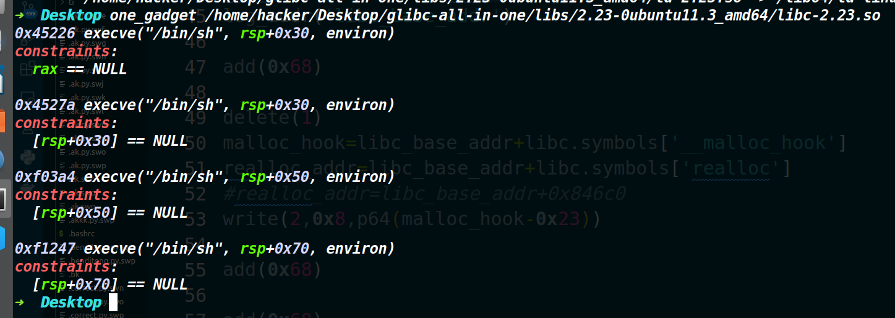

然后下图此时的\_\_malloc\_hook已经被修改为one_gadget了，并且此时准备执行calloc函数（这里先理解成malloc就行，利用手法是一样的），然后si单步进去（如下图）

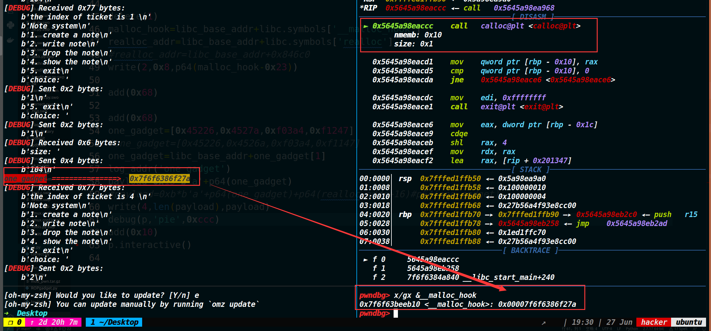


然后单步到这里（如下图），此时就执行了\_\_malloc\_hook中的内容，也就是将要执行我们的one_gadget

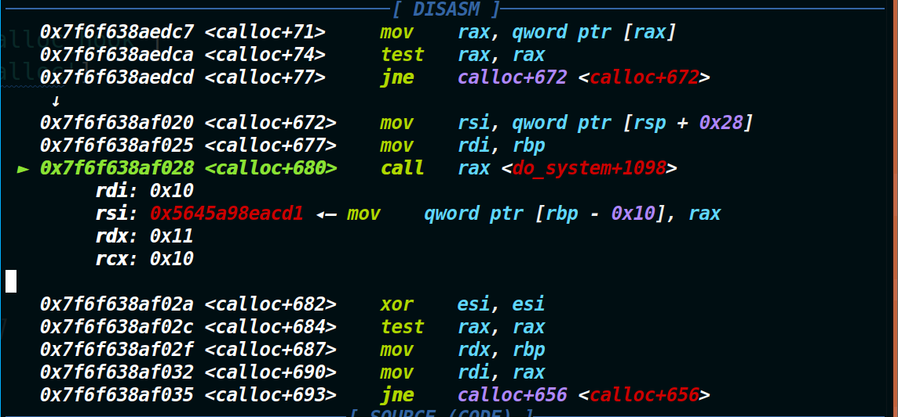


然后我们再si进去（如下图）

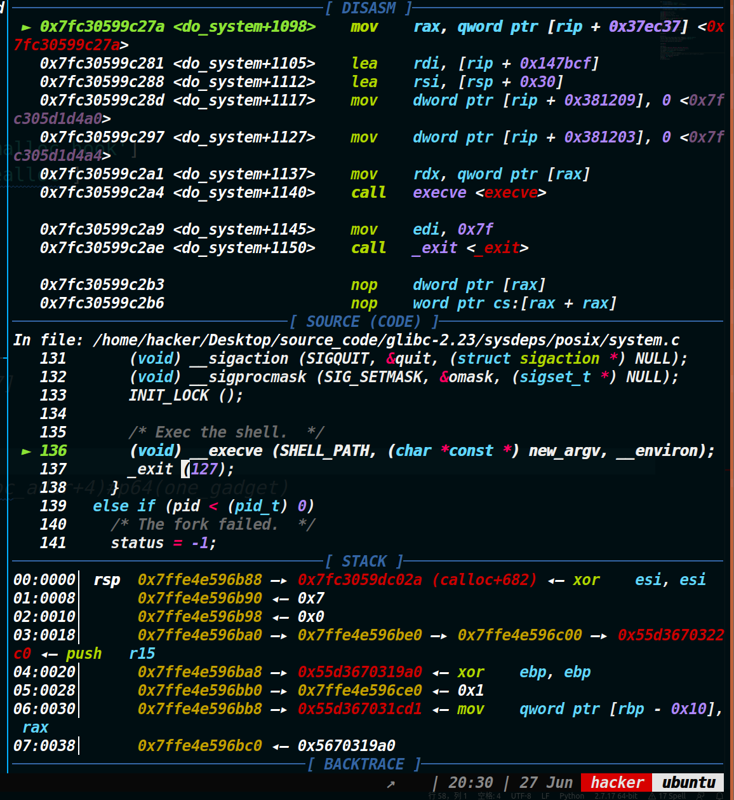


然后我们看此时的是否满足one_gadget的执行条件

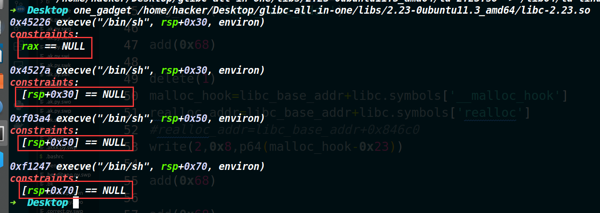


先看rax寄存器的值（如下图），发现不为0（NULL)，因此第一个one_gadget不能用

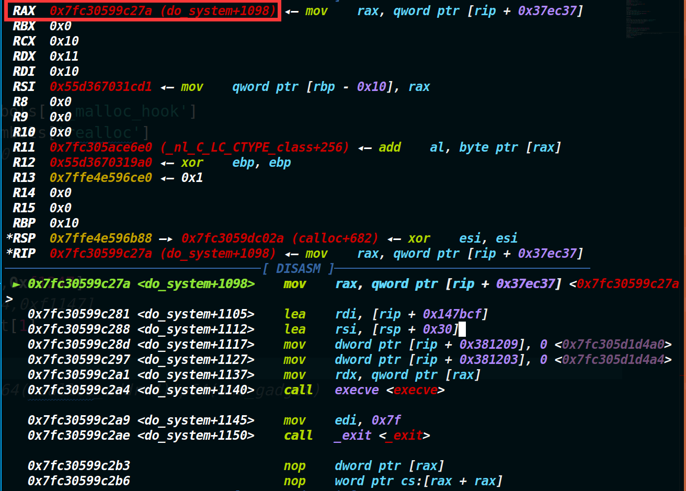


然后看[rsp+0x30]的值(如下图)，发现也不为0(NULL)，因此第二个也不能用

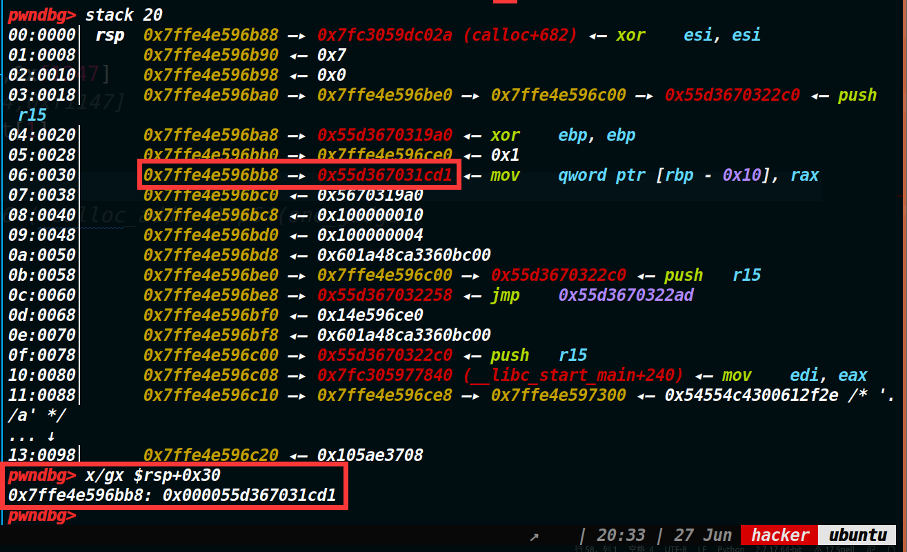


然后依次类推，发现[rsp+0x50]和[rsp+0x70]的地方也都不为0（如下图）

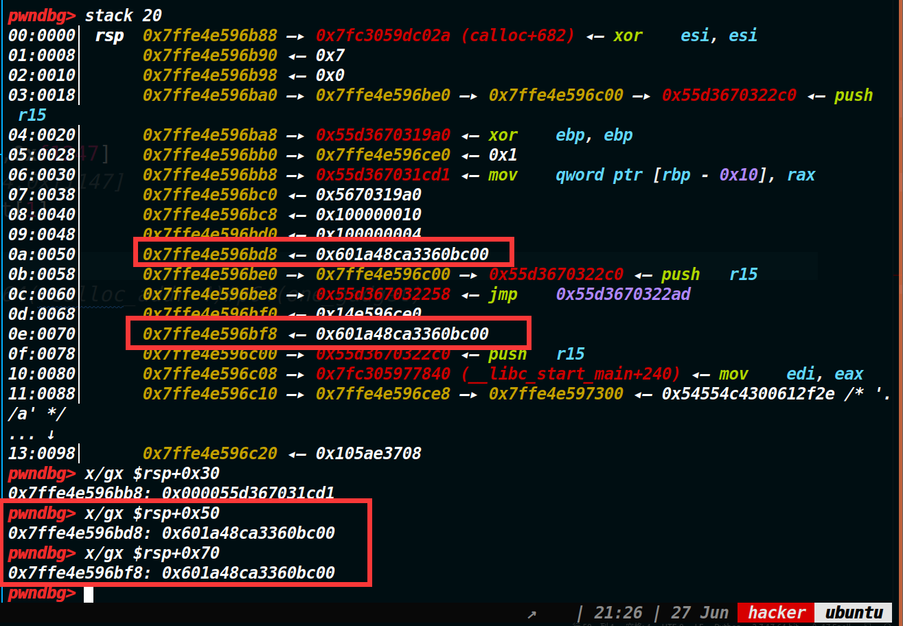


至此，四个one_gadget全部失效。因此我们要用realloc函数来调整栈帧，从而使one_gadget能够使用。

## 为什么我们用realloc函数调整栈帧？

我认为原因有两个**（根本原因是第一个）**：

>  第一、realloc函数存在一个__realloc_hook（执行realloc的时候会判断\_\_realloc_hook是否为空，如果不为空，则执行\_\_realloc\_hook指向的内容），同时\_\_realloc\_hook和\_\_malloc\_hook的地址是挨着的（如下图），这就意味着我们覆写\_\_malloc\_hook的时候可以顺便控制\_\_realloc\_hook。**因此我们把\_\_malloc\_hook改成\_\_realloc\_hook然后\_\_realloc\_hook写入one\_gaget，最后依然可以执行one\_gadget**

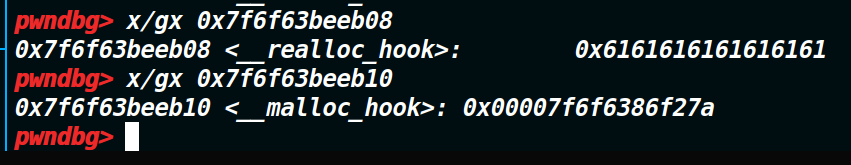


> 第二、realloc函数中有大量的push指令（如下图）（在执行\_\_realloc\_hook之前），因此我们将realloc函数的地址加上一定的偏移，就可以选择去执行一定量的push指令，从而抬高栈帧（我指的抬高栈帧是栈帧又向着低地址增长了）。这样rsp增加了之后，我们就可以控制例如rsp+0x30，让其内存值正好落在0处。

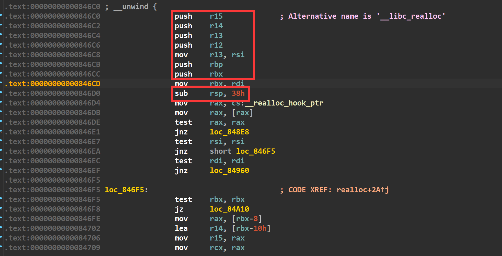


## 具体怎么用realloc函数调整栈帧

首先看一下上面的图片，其中有6个push指令和一个sub rsp,0x38指令。**这些指令都是把栈帧抬高（我说的抬高是指栈向低地址增长），然后抬高栈帧之后去执行one_gadget。(以[rsp+0x30]这个条件为例)这就意味着我们必须去[rsp+0x30]的上面(也就是低地址处)寻找0** (这句话您细品)

然后将realloc函数地址加上不同的偏移，就可以执行一定数量的push和sub rsp,0x38指令(因为可以跳过一定个数的指令)。先考虑一下直接从0x846c0这个地址（先忽略PIE造成的影响）开始执行。这样到执行one_gadget之前有6个push和一个sub rsp,0x38指令，这将栈帧抬高了0x68(0x8*6+0x38),但是别忘了由于多call了一次(call了realloc函数，然后又去call one_gadget，但是原本只有一次call one_gadget)，**因此多执行了一次压栈指令，所以最终直接执行realloc函数，栈帧抬高了0x70字节（就是将原本的rsp变成了rsp-0x70）**

如果执行realloc函数栈帧最少抬高多少呢？

> 最少肯定是只抬高八字节(也就是仅仅多了一次call时执行的压栈指令)，**这里我们先不考虑这种情况，假设必须要执行一次对栈操作指令，那么执行一次realloc函数最少应该抬高0x40个字节（sub rsp,0x38让rsp-0x38再加上call时的压栈指令）**

## 结论：

> **当使用realloc函数调整栈帧时，我们可以将rsp增加（这个增加指的是栈向低地址增长）的范围控制在 0x40与0x70之间**(如果不考虑最低0x8字节的话)，**为了满足one_gadget的条件，只要rsp-0x40与rsp-0x70之间存在一个为0的内存单元，那么我们就可以控制realloc函数中push的数量来满足条件（控制的方法就是将realloc函数的地址加上偏移来跳过一定量的push指令）。**
>
> 以[rsp+0x30]=NULl这个条件为例，加上rsp-0x40与rsp-0x70这个范围。也就是说最后要在rsp-0x10与rsp-0x40找一块值为0成内存单元。

## 举例演示：

现在我已经发现四个one_gadget全部失效，然后我想看看其中一个one_gadget [rsp+0x30]经过调整栈帧后能否使用，先去看rsp-0x10与rsp-0x40 这个范围是否存在值为0的内存。

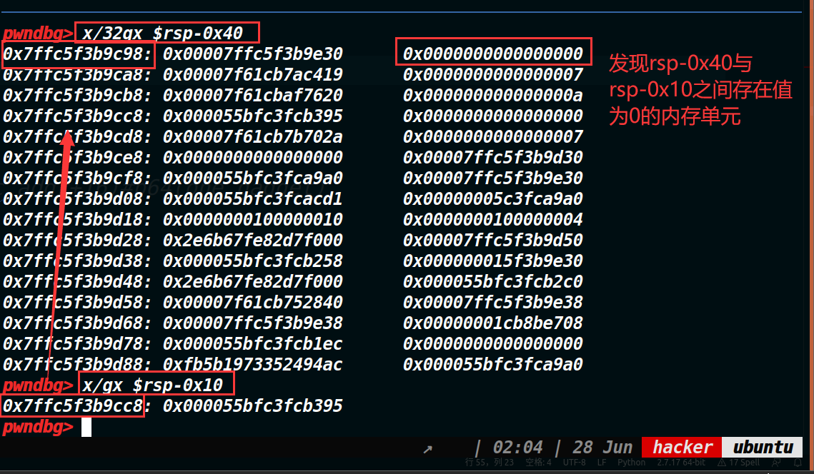


这个0的地址是0x7ffc5f3b9ca0，如果将realloc函数对栈操作指令全部执行完的话，那么rsp-0x30的位置就是0x7ffc5f3b9c98，我们少执行一个push的话，那么rsp-0x30就会变成0x7ffc5f3b9ca0。因此判断出来我们写入realloc地址+2(push指令长度为2字节)就可以让one_gadget生效（因为跳过了一次push指令）

下图为realloc调整栈帧处的exp。

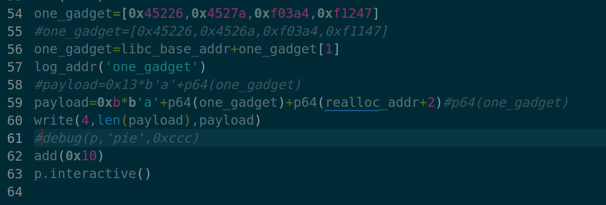


可以看见下图已经说明这个one_gadget已经生效，我们获取了shell

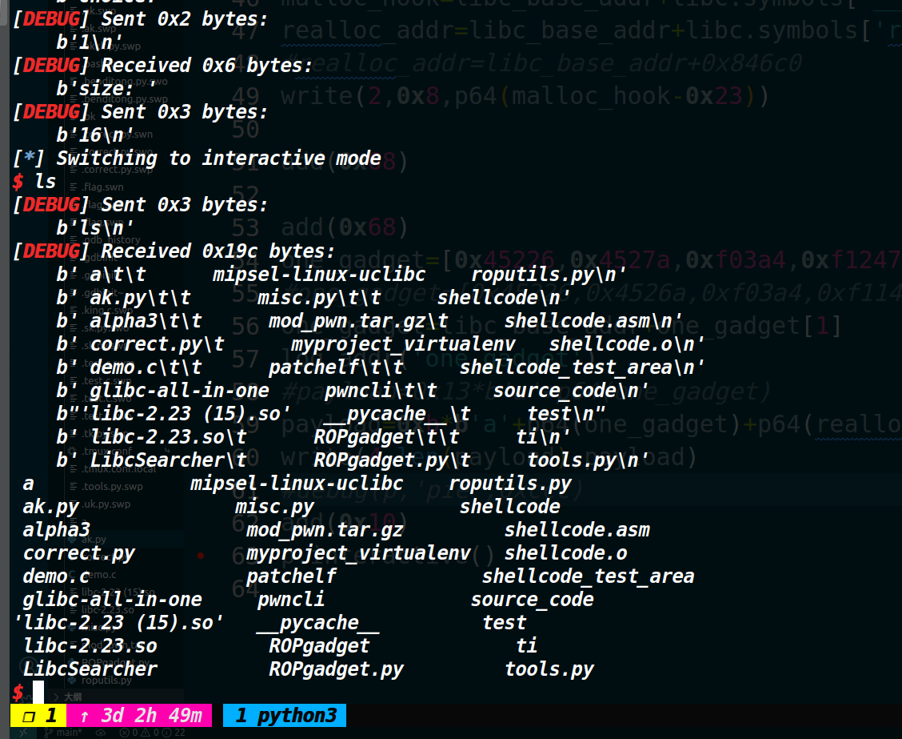


## one_gadget的条件是获取shell的充分条件

如果这道题你已经掌握了上面介绍realloc调整栈帧的话，其实就已经是结束了。不过在最后我又学了一个更重要的细节。**还是上面的脚本最后如果实际调一下的话，发现\_\_malloc\_hook里写realloc+1或者realloc+3或者直接写realloc地址都可以获取shell。**（如下图）

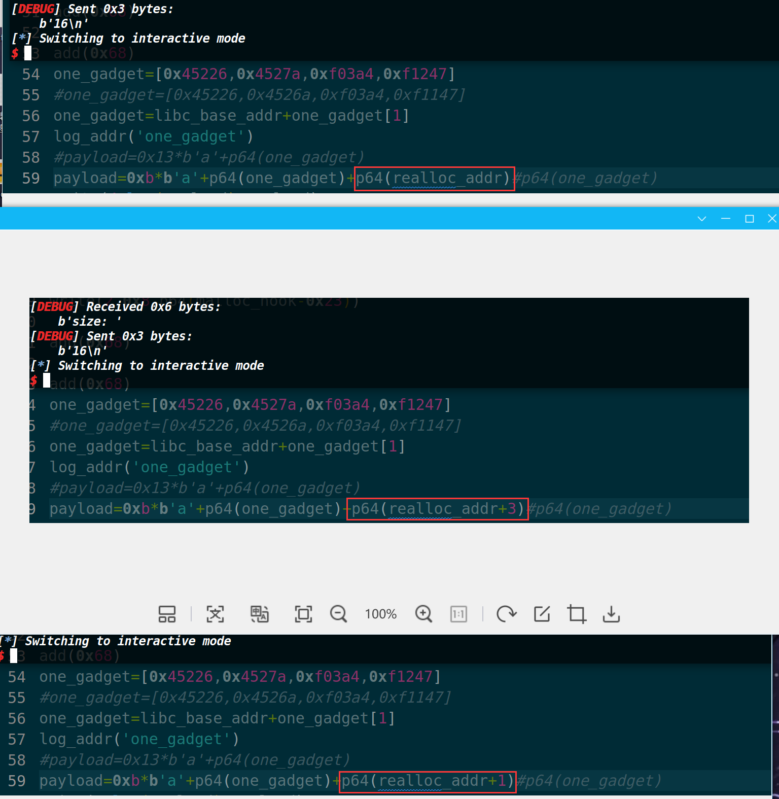


这是为什么？这是否意味着上面我们的结论有误？

探究一下便知。首先调试一下\_\_malloc\_hook里写入realloc函数的地址 这个情况。

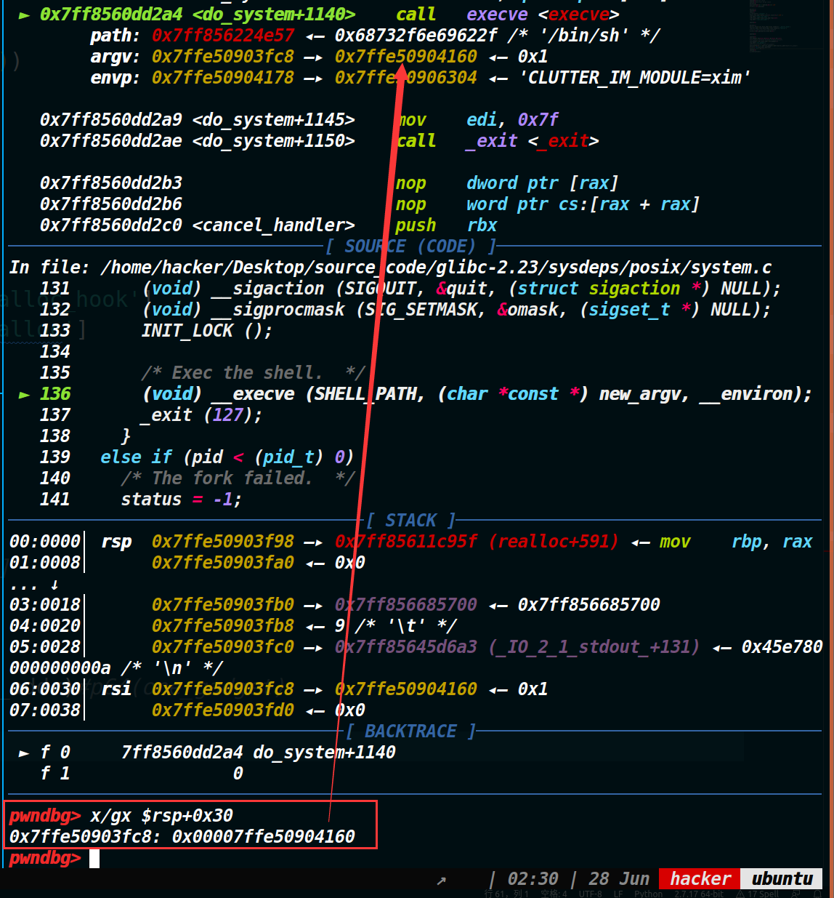


发现[rsp+0x30]处居然不为0，但是却能成功获取shell（如下）

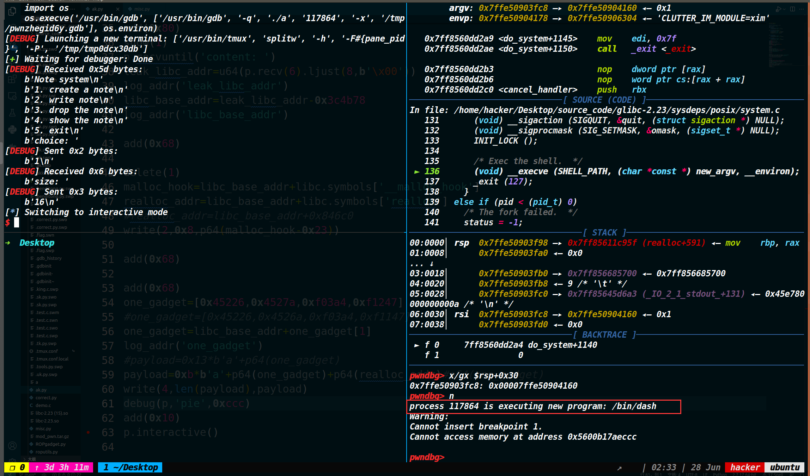


想解释这个原因，还要从execve函数下手。

通常我们认为获取shell就要写执行execve(“/bin/sh”,0,0)才可以，但是后两个参数真的一定要为0么？

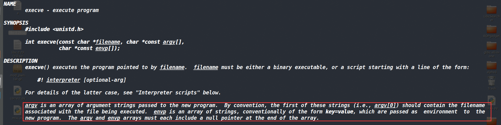


它这段第一句的意思就是说argv是个传递新程序的字符串数组，说实话这句我理解也不是太深，但是能获取到两个信息。**首先这个argv数组里面装的是指针（因为实际上是指针指向了字符数组(字符串使用字符串数组进行存储)的地址），其次这个数组要以NULL结尾，envp参数也是一样。**

**也就是说只要argv这个地方里面放了个指针并且是NULL结尾，至于指针指向的是不是字符串已经无所谓了，而此时的情况就是argv里面放了个指针，并且是NULL结尾(如下图)**

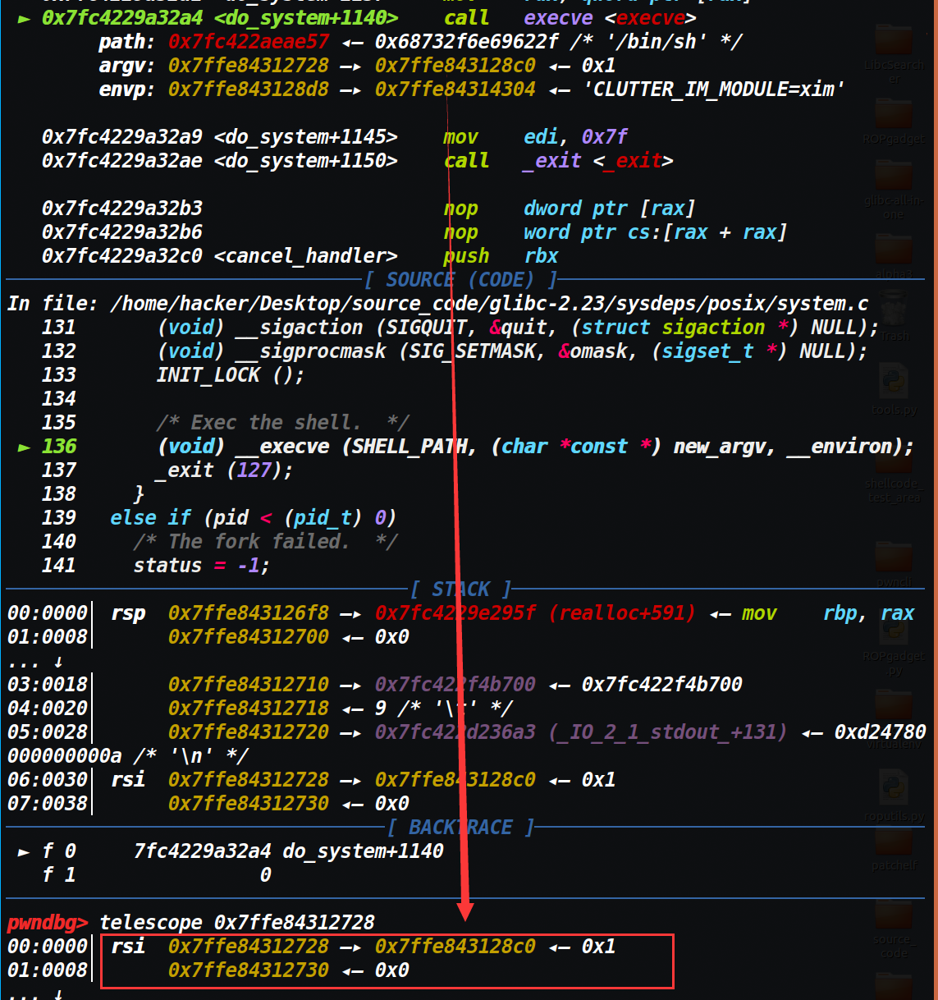


虽然这个指针指向的是数字1，不过依然最终也可以获取shell。

同时也可以做一个小测试,就是将argv里面放个Int类型的指针，指向整数，看看execve函数还能否获取shell。

```c
#include<stdio.h>
#include<unistd.h>

int main(int arg, char **args)
{
    int *p;
    int a=1;
    p=&a;
    char *argv[]={p,NULL};
    char *envp[]={0,NULL};

    execve("/bin/sh",argv,envp);
    return 0;
}

```

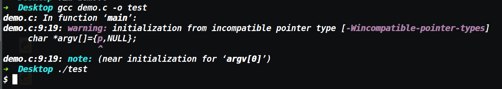


发现是成功的又开启了一个shell。

> 因此得出结论，one_gadget的生效条件是获取shell的充分条件，也就是说获取shell不一定要满足one_gadget的条件。


为什么realloc+1和realloc+3也能获取shell呢？

通过调试发现realloc+1和realloc+3开始执行的话，执行的并不是正确的机器码**，而是机器码进行了错位。不过正好错位之后，依然是个push指令，导致了realloc+1其实和realloc的栈中情况是一样的，而realloc+3和realloc+2的栈中情况是一样的**。（如下图）

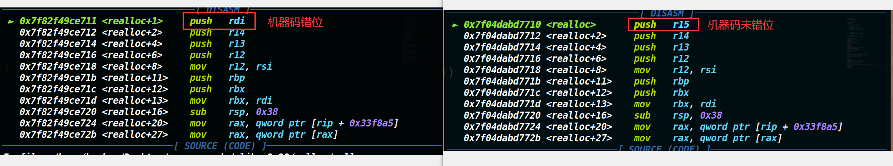


由此可见，即使机器码错位，但push指令依然没变，仅仅变的是push后面的寄存器。所以并不改变栈帧