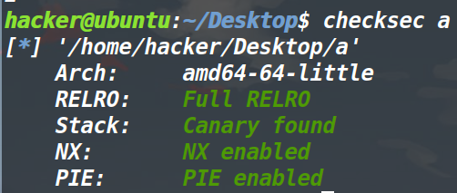
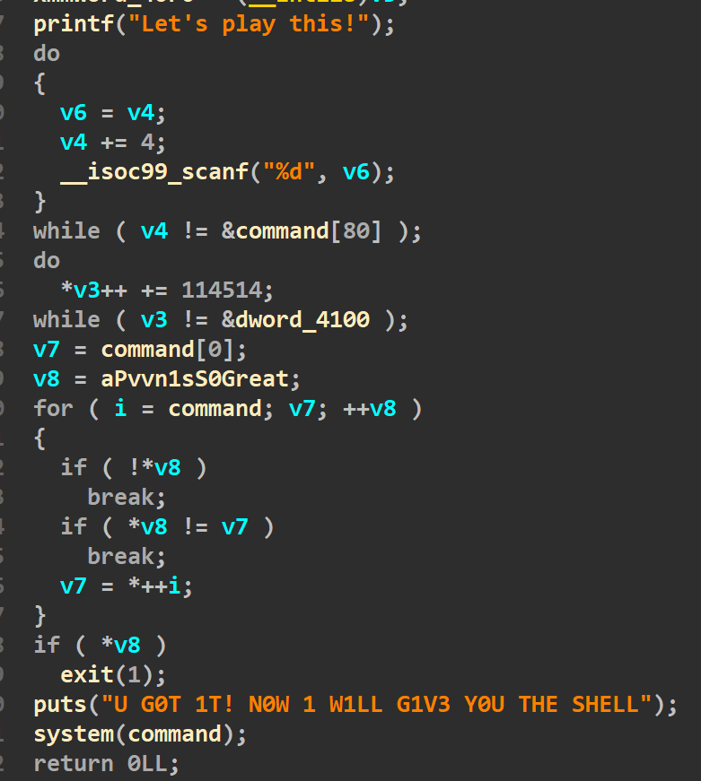
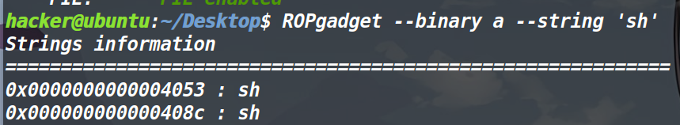
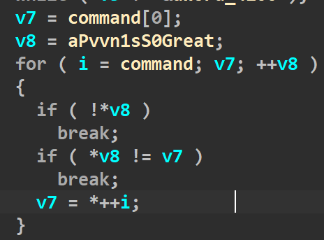
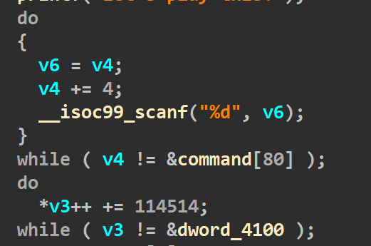
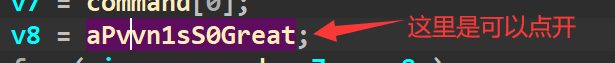
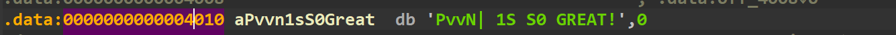
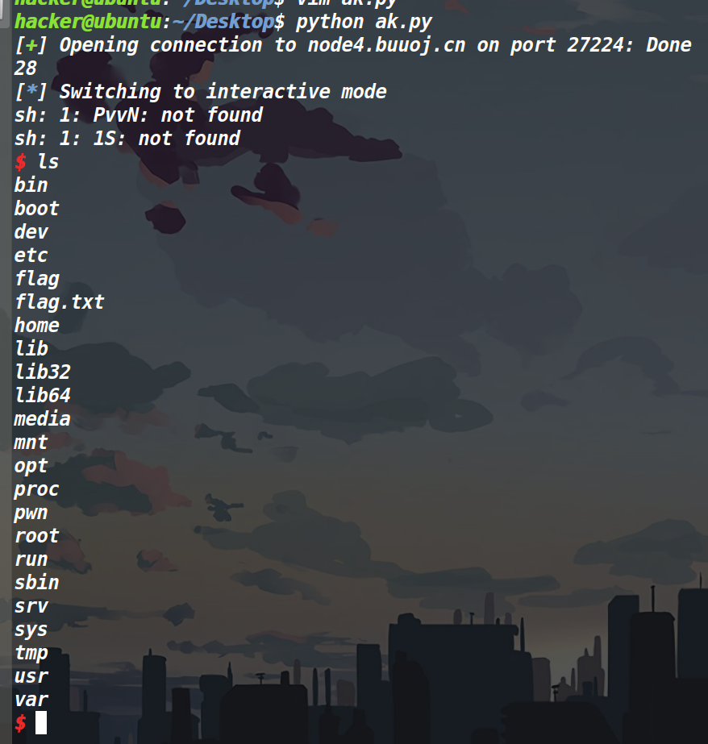

## 总结：

通过这道题的学习与收获有：

1、分析这种漏洞比较明显的题目，应该倒推程序逻辑，而且程序最后给出了system(command)，而command又是个地址（指向我们所输入的内容），此时应该很容易想到，我们输入/bin/sh就可以执行。但是我开始没有想到这一点... 还是做的少。

2、考察了linux下命令行多命令执行的特定。如果命令被;分开，即使前面的命令执行错误也依旧会执行后面的命令。

3、u32可以一次转四个字符为对应ASCII码，返回值为int类型。

4、当格式化字符为%d时，我们想存入字符串，应该输入对应其ASCII。

5、这道题又是地址又是*地址的，开始容易搞迷糊，应该仔细捋一下。


## 保护策略：





## 程序分析&&大致思路：




倒着分析一下，如果程序要执行system(command)就不能进入最后的一个if。也就是说最后的*v8要为0。并且command还要为/bin/sh参数或者sh参数。



这道题搜到了sh，然后思路就彻底跑偏了。因为我一直在考虑怎么对抗PIE保护（因为开了PIE之后，这个sh地址是没法直接用的），想对抗PIE的话，首先想到的就是泄露程序泄露基地址，不过这道题打印函数是不可能去泄露的，同时我们也没法溢出，不可能控制返回地址，因此泄露基地址这个方向绝对行不通。

***（这里当时想的就不对，command本身就是个地址，而我们输入的内容是存放到了command指向的位置，因此给system的command本身就是个指针了，所以就不可能再写sh的地址了）***

这道题依然需要倒着分析，先看这一部分。




因为*v8最后肯定是要为0的，这个定死了。可是我们是控制不了\*v8的值，不过这里分析一下这个循环。什么时候\*v8可以为0？我们发现每次循环v8都会++，因此只有当\*v8指向字符串末尾的时候，它的值才为0。因此我们肯定是要让这个for执行完毕。

再观察一下这个for循环整体，i和v7拿到的都是command（输入内容最开始的地址），每次循环先判断\*v8是否为0（如果为0的话就会触发break结束掉循环（不过我们分析过了，只有在\*v8到达字符串末尾的时候才会为0,因此这里不用考虑这个break））


第二个if，每次的v7都不能和*v8的值相同（如果相同，就会提前break掉导致\*v8不为0)，而v7将循环遍历command[0]开始的每一个内存单元，而我们是可以控制每个内存单元的值的，接下来分析另一个部分。




v4和v3还有v6都是command。然后输入的内容（必须是int型，如果是char类型程序将直接结束）将存放到command中，只要v4不是command+80就继续进行循环，也就是进行20次循环。由于每次v4+4并且又赋给v6，因此v6也在移动，也就是说我们输入的内容会依次存到command~command+80的位置。

然后进入第二个循环，这个循环很简单，就是v3去从command开始遍历，将每个内存单元的值都加上114514，等到v3为4100的时候，就可以出来这个循环了（v3将最后超过了我们可控制的command+80,不过仔细想一下，这并不影响，对么？

## 执行system时的小坑

至此通过了所有的检查，可以执行system(command)，command前面是需要输入PvvN| 1S S0 GREAT!

这里有个坑



内容在这里。

然后PvvN| 1S S0 GREAT!的后面是我们要输入的命令，这里考察了linux系统命令行多命令执行的特点。

>  Linux 系统可以在一个命令行上执行多个命令:
>  	; --如果命令被分号(;)所分隔，那么命令会连续的执行下去，就算是错误的命令也会继续执行后面的命令
>  	&& --如果命令被 && 所分隔，那么命令也会一直执行下去，但是中间有错误的命令就不会执行后面的命令，没错就继续执行直至命令执行完为止
>  	|| --如果命令被双竖线 || 所分隔，那么一遇到可以执行成功的命令就会停止执行后面的命令，而不管后面的命令是否正确。如果执行到错误的命令就是继续执行后一个命令，直到遇到执行到正确的命令或命令执行完为止

此处转自[(27条消息) PWN-PRACTICE-CTFSHOW-4_P1umH0的博客-CSDN博客](https://blog.csdn.net/weixin_45582916/article/details/122519353)

因为我们前面输入的内容会被当做命令执行，它肯定是错误的，因此我们紧接着需要用;来连接后面的参数/bin/sh（sh也是可以的）

**因为我们只能输入整数，因此我们输入是以ASCII码的形式将字符输入进去的。**

## EXP：

```python
from pwn import *
context.log_level='debug'
#p=process('./a')
p=remote('node4.buuoj.cn',27224)
#gdb.attach(p)
flag="PvvN| 1S S0 GREAT!;/bin/sh\x00\x00"
print(len(flag))
for i in range(7):
    a=i*4
    p.sendline(str(u32(flag[a:a+4])-114514))#因为当时*v3加了114514,因此这里要减去，才能存入我们想要的值
    #因为一个内存单元只能存四个字节，因此一次发送四个字节过去，用u32将字符转换成对应的ASCII码（u32返回值为int类型，同时u32正好需要四个参数）
    #这道题也可以用chr来转换，不过就是比较麻烦，也算知道了u32的新用法
for i in range(13):
    p.sendline('1')

p.interactive()

```
