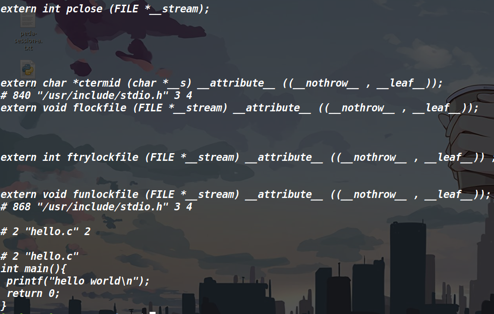
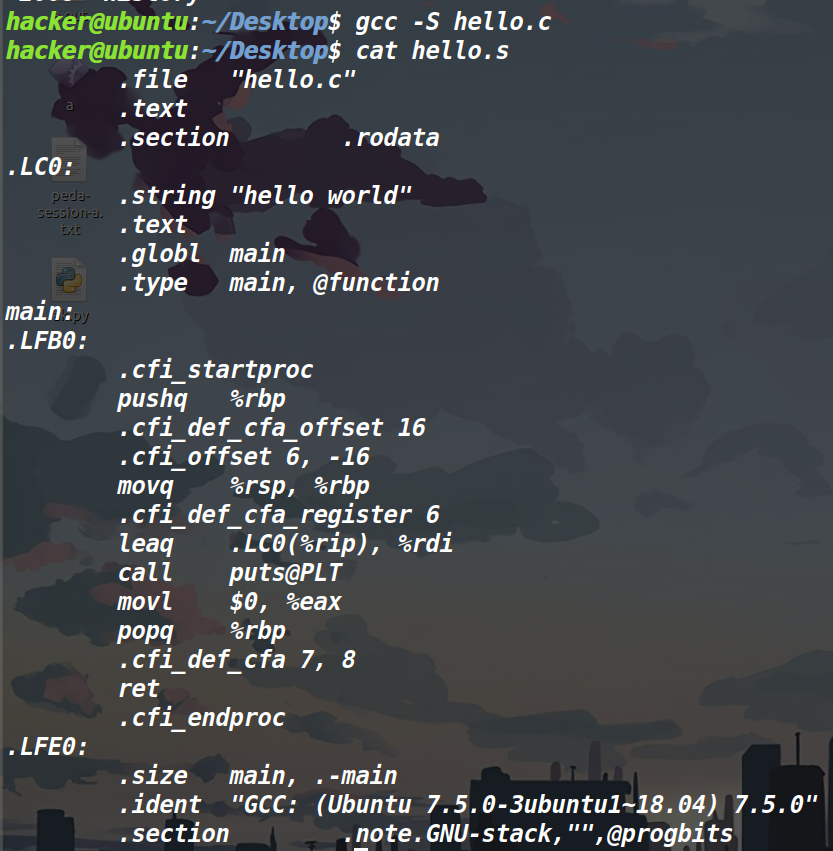
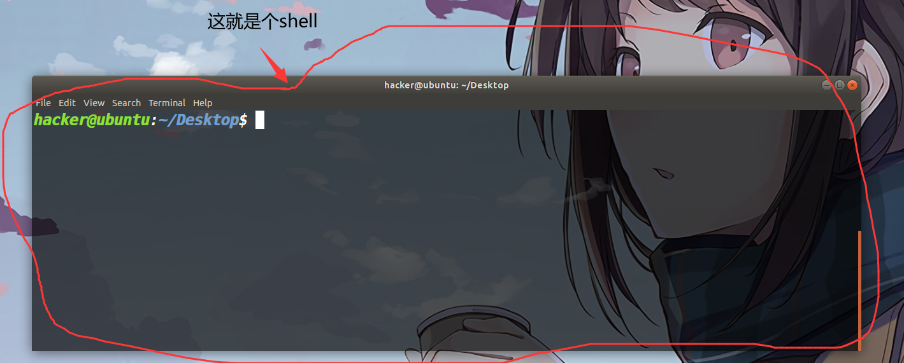
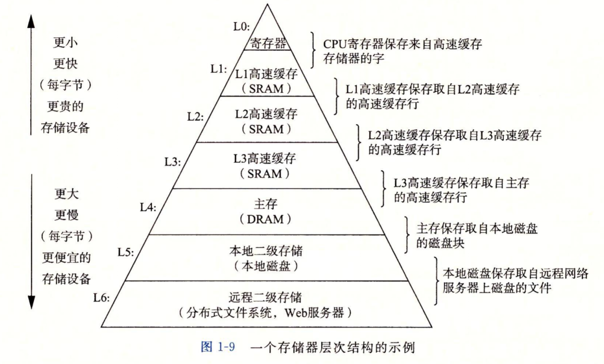
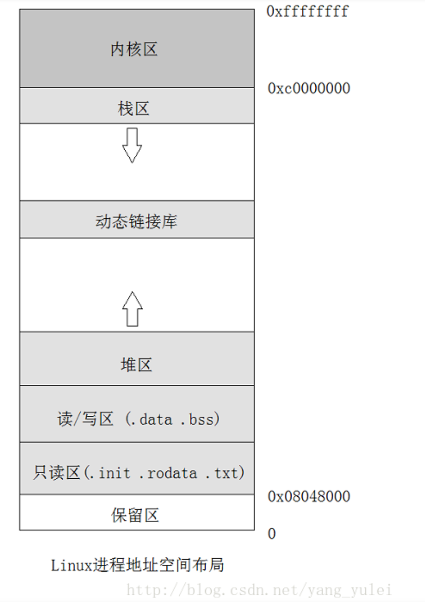

​	这个第一章，主要是介绍了计算机上的一些专业术语，以及一些最基础的概念（并没有深入讲解，不过会在后面的章节进行探究）。**不过这些概念彼此之间联系不大，并不是循序渐进的，因此这一章，我单独介绍里面出现的术语**。

# 计算机系统是个啥？操作系统又是个啥？

​	这一章的名字叫做计算机系统漫游，别的不说，就光看名字，这个计算机系统是什么？我们平常提到的操作系统又是啥，怎么去理解它？

## 计算机系统是什么？

​	这个**计算机系统**啊，其实第一章的第一句话就给出定义了，**它是由硬件和系统软件组成的**，他们共同工作来运行应用程序。其实这就是一个很大的范围，**就可以简单理解为计算机系统就是包括了软件系统和硬件系统**。

## 操作系统是什么？

​	这个操作系统其实没有计算机系统那么抽象，**你完全可以把它理解成一个软件**（CSAPP中提到我们可以把操作系统看成是应用程序与硬件之间插入的一层软件），<u>只不过这个软件相比于其他软件不同之处在于可以去管理计算机的硬件以及计算机的资源</u>。它存在的意义就是去为了更方便用户来控制我们的电脑。*操作系统位于底层硬件与用户之间，是两者沟通的桥梁。用户可以通过操作系统的用户界面，输入命令。操作系统则对命令进行解释，驱动硬件设备，实现用户要求。*

## 现在知道了操作系统的概念，那我们平常提到的32位和64位操作系统又是个什么玩意？

​	这里我以64位程序为例，这个64位的这个单位其实是Bit(比特)，而一个比特呢，就是我们所说的二进制中的一个0或1。为什么正好是64位比特呢，这是因为我们使用的这个CPU，一次性处理的就是64个比特的数据（你可以姑且这么理解），但事实上一次处理64个比特的数据并不全是CPU的意思。其实这跟总线也有一部分关系，在书中的原话是这样描述总线的。

> ​	贯穿整个系统的是一组电子管道，称作总线，它携带信息字节并负责在各个部件间传递。通常总线被设计成传送定长的字节块，也就是字（word）。字中的字节数（即字长）是一 个基本的系统参数，各个系统中都不尽相同。现在的大多数机器字长要么是4个字节（32 位），要么是8个字节（64位）。

​	由此可以看出，是传输信息的时候，就已经把这些信息给划分成了固定的长度。就比如64位程序，那它传输的数据，就是把64个比特划分成了一个定长，然后传输给CPU。毕竟接收的数据都是64位比特位一组了，那处理起来，自然也要是64位比特为一组。看一下书中怎么介绍CPU的

*处理*器

> *中央处理单元（CPU）,简称处理器，是解释（或执行）存储在主存中指令的引擎。处理器的核心是一个大小为一个字的存储设备（或寄存器），称为程序计数器（PC）。在任何时刻，PC都指向主存中的某条机器语言指令（即含有该条指令的地址）。*
>    <u>从系统通电开始，直到系统断电，处理器一直在不断地执行程序计数器指向的指令, 再更新程序计数器，使其指向下一条指令</u>在这个模型中，指令按照严格的顺序执行，而执行一条指令包含执行一系列的步骤。处理器从程序计数器指向的内存处读取指令，解释指令中的位，执行该指令指示的简单操作，然后更新PC,使其指向下一条指令, 而这条指令并不一定和在内存中刚刚执行的指令相邻。*

​	**可以看到CPU和总线在设计的时候，都被刻意设置成了一次处理或传输一个字。而这个字的大小就决定了这个程序是个32位的还是64位的。**

程序编译成可执行文件的四个阶段

一个程序刚写完的时候，它其实是这样的。

但此时它并不是我们最终要的ELF（Linux下的可执行文件）程序，需要经过编译之后，才能变成我们能够执行的ELF文件（如下）

此时单单看大小，你应该就会产生一个疑问，刚写完的时候，大小是70字节，结果编译成了可执行文件，咋就成了8.2KB，大小直接翻了将近120倍，为什么会这样？

这时候我们就要聊聊这个程序被编译成ELF文件的四个阶段了。

## 1、预处理阶段

这个阶段最主要的事情，就是把#后面的内容去用代码替换掉，就比如#include<stdio.h>这句话，在预处理阶段，这句话会消失，取而代之的是很长的代码。我们先写一个hello world源文件，然后用gcc -E hello.c去编译一下。

可以发现，原本的#include<stdio.h>没了，变成了一些代码（这张图片没有展示完全，因为代码太多了，就截取了一小部分）不过我们写的main函数的代码还在。

## 2、编译阶段

这个阶段就是通过编译器，把我们写的c的高级语言代码变成了汇编指令。通过gcc -S hello.c命令可以编译出来hello.s文件。

## 3、汇编阶段

汇编阶段就是把上个阶段得到的汇编指令给翻译成机器语言指令（就是二进制指令），也就是说此时经过了汇编阶段后，我们再查看编译得到的文件，得到的就全都是乱码了。用gcc -c hello.c命令去编译。此时的文件也就是目标文件（被编译好了，不过还没有进行链接的文件）

## 4、链接阶段

就比如这个最简单的hello world的程序，你有没有想过，凭什么printf函数它就可以去打印。其实奥秘就在这个链接阶段，这个printf函数的背后也是有很多的代码（绝不是你表面上看起来的printf()这一个单词）只不过这个printf函数的代码已经提前被写好了，并且也被打包成了一个目标文件。因此在链接阶段只需要将需要的目标文件都合并到一起，就成为了最后的ELF文件。

## 编译系统

最后可以看一下整体的过程，如下图。并且执行这四个阶段的程序（预处理器、编译器、汇编器和链接器）一起构成了编译系统

# 什么是shell

shell本质上就是个程序，不过我通常把它理解为终端。事实上shell只是一个命令行解释器（这个解释的更好一些）（也就意味着其实它并不包括可视化界面，不过你把它理解成终端也没什么问题的）（具体介绍的话，书中已经详细写了，这里就不再赘述了）

# 虚拟内存&&高速缓存&&主存

这里我只是先简单介绍一下这三者，在以后的笔记中，会详细讨论他们三个。

## 1、先谈谈主存

		首先主存就是内存，这俩是一回事。当一个程序运行的时候，这个程序就会被加载到内存里面，以便CPU进行数据处理，简单来说内存就是用于暂时存放CPU中的运算数据。在书中强调说，主存是一个临时存储设备，为什么这是个临时的呢？因为它通电才会进行存储，断电后内存中的数据就会消失。
	
		如果单听解释太抽象的话，这里来举两个例子。如果你在用word写一个文档，你在敲击每一个字到word中的时候，此时它们是存储到了内存中，如果你点击了保存，那么它们才存到了磁盘中。如果你开了一局游戏，此时这个游戏其实就是在内存中进行。

*从逻辑上来说，存储器是一个线性的字节数组，每个字节都有其唯一的地址（数组索引），这些地址是从零开始的。*

从书中的这句话，我们可以知道其实这个存储器，就可以把它理解为一个旅馆，其中有一个一个的小房间，每个房间都是有一个唯一的号码。

此时问题就来了，我们如果开了两个游戏呢，我们知道一个游戏，是一个进程，这个进程对应着自己的内存，可是如果两个进程呢，或者更多个进程呢？我们有那么多内存去分配给他们么？此时我们引入了虚拟内存这个概念。

## 2、虚拟内存

虚拟内存细了讲是有很多东西的，这里简单解释一下。虚拟内存出现的其中一个目的就是去解决我上面说的那个问题（去“创造”出来更多的内存来供我们使用）这里的创造，我加了引号，事实上它并不是创造，而更像是一种欺骗，**一个叫做MMU的东西，去欺骗了每个进程，当每个进程准备提供给CPU数据的时候，MMU才会把那些数据放到内存里面，不然的话，那些不用的数据时一直存放在磁盘中（这样真正的内存存储的都是与CPU即将交换的数据，这样就类似于“创造”了更多的内存）**。不过进程本身是不知道这件事情的，进程一直以为自己是独占了整个内存的使用。

## 3、高速缓存

**这个高速缓存其实就是比内存传输数据更快的东西。**传输数据最快的是寄存器，因为寄存器本身就在CPU上，然后就是高速缓存，接着是内存，最后是外存。越往后传输速度越慢，但是存储的内容更多。

缓存也没什么好说的，主要是原文已经写的很明白了。最后就是高速缓存的目的就是去提升计算机系统的处理速度。

# 什么是进程和线程？

## 1、进程

写好的程序，它是放在磁盘上的，如果我们去运行它，ok，它就变成了进程。**可以说被运行的程序就是进程**。既然是被运行了，那进程肯定是在内存中的。下面是进程在内存中的布局。

现在我们只要初步了解一下进程即可。<u>并且进程彼此独立互不干扰的；另外每个进程都认为自己是在独占着CPU，但事实上我们系统中一定不是就一个进程，因此在实际的进程切换中，就会进行上下文切换（这个上下文就是一种状态，例如PC和寄存器文件的当前值等等），保存当前上下文，恢复新进程的上下文。</u>

## 2、线程

 ***线程是操作系统能够进行运算调度的最小单位。它被包含在进程之中**，是进程中的实际运作单位。一条线程指的是进程中一个单一顺序的控制流，一个进程中可以并发多个线程，每条线程并行执行不同的任务。*

进程之间是彼此独立的，<u>而线程只要是所属于一个进程之下，那他们之间就可以共享一个进程的资源以及地址空间。并且多个线程可以读写同一快内存</u>。**由于进程彼此是独立的，在安全性上略胜一筹，而多个线程是可以读写同一个内存，因此在速度上有优势。**

# 什么是I/O

我最早的时候，经常看到网上的文章说I/O，但是一直不理解，其实它没什么好神秘的，**I/O的意思就是输入（Input)和输出(Output)**，只要具有输入输出类型的交互系统都可以认为是I/O系统。<u>就比如我们的键盘和鼠标就是输入设备，而显示器则是输出设备，甚至磁盘也是输出设备（尽管这个我们看不见，但是数据确实是被输出到了磁盘中）</u>，每个I/O设备都是通过一个控制器或适配器与I/O总线相连。

# 什么是文件

**文件就是字节序列（字节序列可能有点抽象，简单来说，就是很多个字节集合放到了一起）**，并且在linux中，万物皆为文件（包括磁盘、键盘、显示器等等）。

# 平常说的CPU到底是个啥

**CPU是指中央处理器，通俗来讲就是读取指令然后执行然后再读取，用不停歇直到断电**。它作为计算机系统的运算和控制核心，是信息处理、程序运行的最终执行单元。CPU里面分为三个很重要的部分，分别是ALU（算术逻辑单元），寄存器组，控制单元。

## ALU

是CPU的核心，因为它是负责计算的

## 寄存器组

实质上就是CPU中暂时存放数据的地方，里面保存着等待处理和处理过的数据。

## 控制单元

简单来说，控制单元就是来指挥CPU内部的工作的。

# 并发和并行&&超线程

简单来说，并发就是两个事件或多个事件在一个时间依次发生；而并行则是两个时间或多个事件在一个时间同时发生。

## 并发

我们知道如果只有一个CPU的话，那么它在某一时刻也只能执行一个线程，因此它要执行多个线程，就只能把时间分成若干段，然后把每一段时间分别分配给每个线程。在某一时刻线程代码在运行时，其他线程是处于挂起状态。

## 并行

可如果我们拥有了多个CPU，那每一个CPU都可以在一个时刻去处理一个线程，从而系统在操作的时候，就可以同时处理多个线程（且线程之间互不抢占CPU的资源），这就是并行。

可是即使只有一个CPU，在用户看来，系统似乎还是可以同时处理多个线程，那是因为CPU处理的速度是在太快了，使多个线程快速交替进行，从而给人的感觉是在同一个时间处理了多个线程。

## 超线程

如果理解了前面的并行之后，超线程（有时也被称为多线程）就不难理解了，它可以让一个CPU能够到达线程级并行计算。大概是通过备份一些CPU的硬件，比如寄存器文件和程序计数器等等，尽管此时的CPU可以同时处理两个线程，但除去刚才提到的寄存器文件和程序计数器，其他硬件依然是被共享的。

参考文章 https://www.zhihu.com/question/497245883
图片链接 https://www.php.cn/faq/422175.html