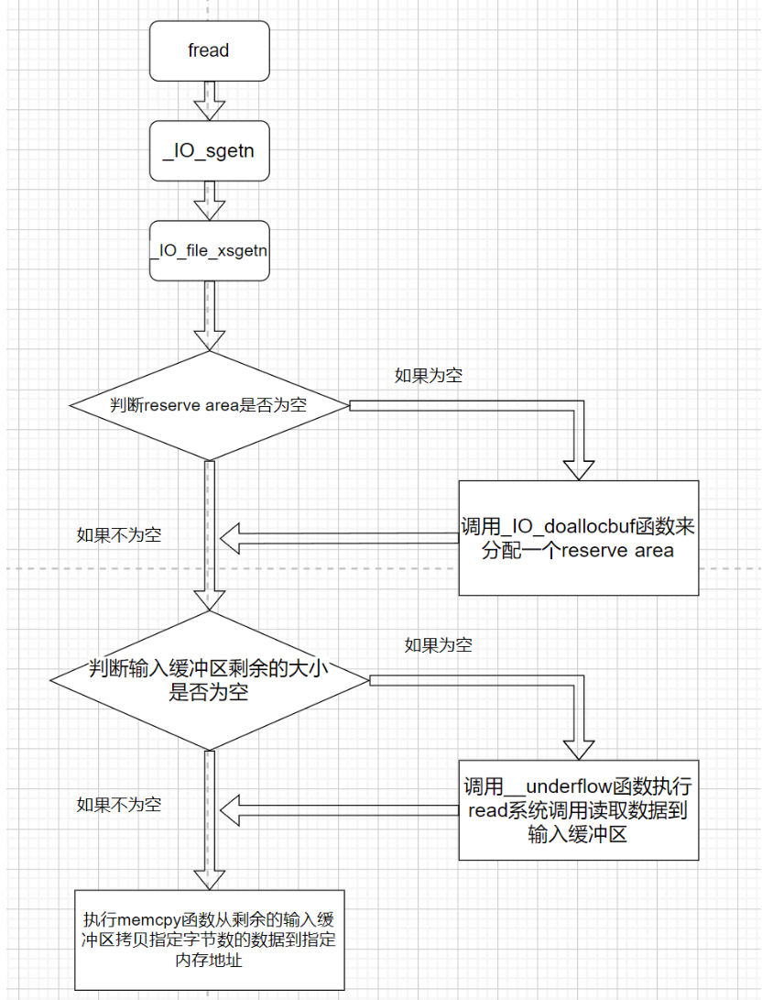

上一篇分析的是fopen函数，这次来分析下fread函数。
[IO学习--源码调试fopen函数](https://www.cnblogs.com/ZIKH26/articles/16567446.html)

## 前置知识：

在分析fread函数时，应该先明确一下输入缓冲区是怎么来的。

首先**fread函数会先将数据读到输入缓冲区中，然后从输入缓冲区中执行memcpy函数，拷贝一定字节的数据到我们指定的内存地址上**。而这个输入缓冲区是从哪到哪呢？由两个指针分别声明了这片区域的开始和结束，他们分别叫做**\_IO_read_base和_IO_read_end，他们之间的区域就是输入缓冲区**。这样看起来似乎还需要一个输出缓冲区，难道需要malloc申请两个堆块来分别表示输入缓冲区和输出缓冲区么？非也，其实**malloc函数自始至终只申请了一个堆块**，**这个堆块的区域也叫做reserve area**，而\_IO_buf_base和\_IO_buf_end两个指针则分别声明了这个reserve area的始末。然后将 _IO_read_ptr; _IO_read_end; _IO_read_base;	_IO_write_base;	_IO_write_ptr; _IO_write_end;这六个指针全部初始化为了\_IO_buf_base的值，现在的输入缓冲区和输出缓冲区还不存在(因为现在 _IO_read_end和 _IO_read_base的值相同)，以输入缓冲区为例，**读入数据时是执行了系统调用read，而此时的数据是在reserve area中，紧接着 _IO_read_end就会加上刚刚读入的数据的个数，那么此时 _IO_read_end和 _IO_read_base的值变的不同了。而现在这二者之间的区域就成为输入缓冲区**。

再提一下_IO_FILE结构体中的一些指针(如下)

```c
  char* _IO_read_ptr;	/* Current read pointer */ 
  char* _IO_read_end;	/* End of get area. */
  char* _IO_read_base;	/* Start of putback+get area. */
  char* _IO_write_base;	/* Start of put area. */
  char* _IO_write_ptr;	/* Current put pointer. */
  char* _IO_write_end;	/* End of put area. */
  char* _IO_buf_base;	/* Start of reserve area. */
  char* _IO_buf_end;	/* End of reserve area. */
```

其中_**IO_buf_base 和 _IO_buf_end两个指针的作用分别是标明reserve area的始末**。**\_IO_read_base 和  _IO_read_end两个指针的作用分别是标明输入缓冲区的始末(write那两个指针同理)**，现在假设有一个30字节的flag文件，然后我连续执行两次fread函数，每次从文件中只读10字节，那么第二次执行fread函数是从哪开始读呢，很明显并不是文件的开始来读取了，而是接着上回fread函数读到的位置，继续读10字节数据。但我们怎么去记录上回fread函数读到哪了呢，这就需要用到**\_IO_read_ptr指针了，它是来记录下一次数据应该从输入缓冲区的哪里开始读了。也就是说\_IO_read_base 和 \_IO_read_ptr 之间的区域是已经使用了的输入缓冲区，而 \_IO_read_ptr 和 _IO_read_end之间的区域是输入缓冲区的剩余部分(也就是还未使用部分)**。


通过上面这两段文字，应该可以对刚学习IO的师傅对_IO_FILE结构体中表示缓冲区位置的指针有一些了解了。

同时这次还要提到vtable，它是_IO_FILE_plus结构体中的一个字段，也是一个虚表指针。它指向了\_IO\_jump\_t结构体

```c
struct _IO_FILE_plus
{
  _IO_FILE file;
  const struct _IO_jump_t *vtable;
};
```


对于\_IO\_jump\_t结构体，我目前的理解它就是一个跳转表，这里放的都是函数指针。通过不同的偏移获取不同的函数指针，然后将其调用。

```c
struct _IO_jump_t
{
    JUMP_FIELD(size_t, __dummy);
    JUMP_FIELD(size_t, __dummy2);
    JUMP_FIELD(_IO_finish_t, __finish);
    JUMP_FIELD(_IO_overflow_t, __overflow);
    JUMP_FIELD(_IO_underflow_t, __underflow);
    JUMP_FIELD(_IO_underflow_t, __uflow);
    JUMP_FIELD(_IO_pbackfail_t, __pbackfail);
    /* showmany */
    JUMP_FIELD(_IO_xsputn_t, __xsputn);
    JUMP_FIELD(_IO_xsgetn_t, __xsgetn);
    JUMP_FIELD(_IO_seekoff_t, __seekoff);
    JUMP_FIELD(_IO_seekpos_t, __seekpos);
    JUMP_FIELD(_IO_setbuf_t, __setbuf);
    JUMP_FIELD(_IO_sync_t, __sync);
    JUMP_FIELD(_IO_doallocate_t, __doallocate);
    JUMP_FIELD(_IO_read_t, __read);
    JUMP_FIELD(_IO_write_t, __write);
    JUMP_FIELD(_IO_seek_t, __seek);
    JUMP_FIELD(_IO_close_t, __close);
    JUMP_FIELD(_IO_stat_t, __stat);
    JUMP_FIELD(_IO_showmanyc_t, __showmanyc);
    JUMP_FIELD(_IO_imbue_t, __imbue);
#if 0
    get_column;
    set_column;
#endif
};
```

## 整体流程




上面第一张图片是fread函数的整体流程，第二张图片是根据我下面写的这个源代码对应的函数调用流程(调试的时候结合这两个图片，可以对自己调试到哪部分有个比较清楚的认知)。

## 源代码：

```c
#include<stdio.h>
int main(){
    char value[20];
    FILE* fp=fopen("flag","rb");
    fread(value,1,10,fp);
    return 0;
}
```
**本文的源代码以及调试的程序所依赖的libc都为2.23版本的**
## 源码分析&&源码调试

先看fread函数源码，发现它的代码很短(如下)，这里主要就是调用了_IO_sgetn函数


查看_IO_sgetn函数后，发现它只调用了vtable中的\_IO\_XSGETN


然后再溯源的话就是几个宏定义，代码如下：

```c
#define _IO_XSGETN(FP, DATA, N) JUMP2 (__xsgetn, FP, DATA, N)
#define JUMP2(FUNC, THIS, X1, X2) (_IO_JUMPS_FUNC(THIS)->FUNC) (THIS, X1, X2)
# define _IO_JUMPS_FUNC(THIS) \
 (*(struct _IO_jump_t **) ((void *) &_IO_JUMPS_FILE_plus (THIS) \
			   + (THIS)->_vtable_offset))
```

我简单分析一下上述部分，核心就是_IO_JUMPS_FUNC(THIS)返回了\_IO_jump_t地址，由于JUMP2第一个参数就是__xsgetn，所以->FUNC访问的就是\_IO_jump_t结构体中\_\_xsgetn,然后我们用gdb看下此时的\_IO_jump_t结构体中的值(如下)，因此最后我们跳转到了0x7ffff7a86df0处。


然后我们看一下汇编如何实现的这里。


先是让rdi+0xd8指向的内容赋值给了rax寄存器。而**此时的rdi就是\_IO\_list\_all的值**，加上0xd8这个偏移，正好就是_IO_FILE_plus结构体中的vtable字段。加上[]寻址后，也就是拿到了\_IO_jump_t结构体的地址。

然后第二条指令是`mov    rax, qword ptr [rax + 0x40]`，而\_IO_jump_t结构体中偏移0x40的字段正好就是__xsgetn(如下图)


最后加上[]寻址，rax为0x7ffff7a86df0(如下图)


如此，最终jmp rax，成功跳转到_IO_file_xsgetn函数(如下图)，而这个\_IO_file_xsgetn函数也是fread函数实现的核心函数。


### _IO_file_xsgetn函数

_IO_file_xsgetn函数主要分为三个部分(下面先是对三个部分的简单概括，后面是对三个部分的具体分析)：

1、先是去判断fp->_IO_buf_base(reserve area)是否为空，如果为空的话，就说明resever area还没有被分配出来，因此去调用\_IO_doallocbuf函数来分配一个reserve area（源码如下）

```c
if (fp->_IO_buf_base == NULL)
    {
      /* Maybe we already have a push back pointer.  */
      if (fp->_IO_save_base != NULL)
	{
	  free (fp->_IO_save_base);
	  fp->_flags &= ~_IO_IN_BACKUP;
	}
      _IO_doallocbuf (fp);
    }
```


2、如果输入缓冲区剩余的大小不为空，并且还需要读入一定字节的数据，就调用memcpy函数，将输入缓冲区的数据复制到指的的内存处。have为输入缓冲区剩余大小，want为还要读入的字节数。（源码如下）

```c
      have = fp->_IO_read_end - fp->_IO_read_ptr;
      if (want <= have)
	{
	  memcpy (s, fp->_IO_read_ptr, want);
	  fp->_IO_read_ptr += want;
	  want = 0;
	}
      else
	{
	  if (have > 0)
	    {
#ifdef _LIBC
	      s = __mempcpy (s, fp->_IO_read_ptr, have);
#else
	      memcpy (s, fp->_IO_read_ptr, have);
	      s += have;
#endif
	      want -= have;
	      fp->_IO_read_ptr += have;
	    }
```


3、如果输入缓冲区剩余大小为0，并且存在resever area(这片区域就是fp->\_IO\_buf\_end - fp->_IO_buf_base)，且我们需求size比resever area区域小。那么调用__underflow函数执行系统调用read读入一定字节的数据到resever area中。

```c
	  if (fp->_IO_buf_base
	      && want < (size_t) (fp->_IO_buf_end - fp->_IO_buf_base))
	    {
	      if (__underflow (fp) == EOF)
		break;

	      continue;
	    }
```


### 分配resever area

先来看第一部分，也就是如果不存在resever area的情况下调用\_IO_doallocbuf函数来分配一个resever area。

```c
void
_IO_doallocbuf (_IO_FILE *fp)
{
  if (fp->_IO_buf_base)//如果存在resever area(保留区)的话，就直接返回
    return;
  if (!(fp->_flags & _IO_UNBUFFERED) || fp->_mode > 0)
    if (_IO_DOALLOCATE (fp) != EOF)//调用了vtable中的函数
      return;
  _IO_setb (fp, fp->_shortbuf, fp->_shortbuf+1, 0);
}
```

因为是第一次执行fread函数，所以肯定是会调用\_IO\_doallocbuf 函数的。通过观察上面的源码和下面的图片发现在这个_IO_doallocbuf函数中又调用了\_IO_FILE的vtable中的IO_file_doallocate函数(如下图)


我这里就不放IO_file_doallocate函数的源代码了，调试看一下流程吧。


si进入IO_file_doallocate函数后，又调用了vtable中的_IO_file_stat函数。


而后又执行了系统调用fstat，这个系统调用是来获取文件状态，并且初始化st结构体的。可以看到此时的st_blksize为4096(如下图)


而这个st_blksize也就是接下来malloc申请的内存大小（也就是reserve area的大小）


当malloc函数将内存申请出来后，调用了vtable中的_IO_setb函数(如下)


这个函数的代码很短

```c
void
_IO_setb (_IO_FILE *f, char *b, char *eb, int a)
{
  if (f->_IO_buf_base && !(f->_flags & _IO_USER_BUF))
    free (f->_IO_buf_base);
  f->_IO_buf_base = b;
  f->_IO_buf_end = eb;
  if (a)
    f->_flags &= ~_IO_USER_BUF;
  else
    f->_flags |= _IO_USER_BUF;
}
```

通过阅读上面的源代码就明白，这个函数主要就是对\_IO_buf_base和\_IO_buf_end指针进行赋值。至此_IO_doallocbuf函数就结束了。**\_IO_doallocbuf函数主要是将resever area申请出来(大小为0x1000),并且对\_IO_buf_base和\_IO_buf_end指针进行赋值**。


### 从输入缓冲区中拷贝数据

第二部分是最简单的，结合下面的源码很容易分析出来，拷贝我们指定的字节的内容从输入缓冲区的剩余部分到指定地址，但如果输入缓冲区剩余大小为空的话，就无法去拷贝。

**(have为输入缓冲区剩余大小，want为还要读入的字节数)**

```c
      have = fp->_IO_read_end - fp->_IO_read_ptr;
      if (want <= have)
	{
	  memcpy (s, fp->_IO_read_ptr, want);
	  fp->_IO_read_ptr += want;
	  want = 0;
	}
      else
	{
	  if (have > 0)
	    {
#ifdef _LIBC
	      s = __mempcpy (s, fp->_IO_read_ptr, have);
#else
	      memcpy (s, fp->_IO_read_ptr, have);
	      s += have;
#endif
	      want -= have;
	      fp->_IO_read_ptr += have;
	    }
```


### 执行系统调用read读入数据

第三部分的核心是__underflow函数。它先是经过一些检查后，去调用了vtable中的\_IO_file_underflow函数。检查如下，调用vtable中的\_IO_file_underflow函数是在\_\_underflow函数将要返回之时执行的\_IO_UNDERFLOW (fp)。

```c
int
__underflow (_IO_FILE *fp)
{
#if defined _LIBC || defined _GLIBCPP_USE_WCHAR_T
  if (_IO_vtable_offset (fp) == 0 && _IO_fwide (fp, -1) != -1)
    return EOF;
#endif

  if (fp->_mode == 0)
    _IO_fwide (fp, -1);
  if (_IO_in_put_mode (fp))
    if (_IO_switch_to_get_mode (fp) == EOF)
      return EOF;
  if (fp->_IO_read_ptr < fp->_IO_read_end)
    return *(unsigned char *) fp->_IO_read_ptr;
  if (_IO_in_backup (fp))
    {
      _IO_switch_to_main_get_area (fp);
      if (fp->_IO_read_ptr < fp->_IO_read_end)
	return *(unsigned char *) fp->_IO_read_ptr;
    }
  if (_IO_have_markers (fp))
    {
      if (save_for_backup (fp, fp->_IO_read_end))
	return EOF;
    }
  else if (_IO_have_backup (fp))
    _IO_free_backup_area (fp);
  return _IO_UNDERFLOW (fp);
}
```


因为宏定义`# define _IO_new_file_underflow _IO_file_underflow`，所以\_IO_file_underflow在源码中为\_IO_new_file_underflow.

然后上来就是很多检查，不过根据程序当前的状态，直接跳过了前面的检查。先去执行了_IO_switch_to_get_mode 函数，该函数将fp->\_IO_read_base进行了赋值，其他指针依然为0。

等到_IO_switch_to_get_mode函数执行结束，出来之后就是疯狂的对read和write字段进行赋值，这里都初始化为了\_IO_buf_base，代码如下

```c
  fp->_IO_read_base = fp->_IO_read_ptr = fp->_IO_buf_base;
  fp->_IO_read_end = fp->_IO_buf_base;
  fp->_IO_write_base = fp->_IO_write_ptr = fp->_IO_write_end
    = fp->_IO_buf_base;
```

此时的_IO_FILE结构体各个字段如下


然后此时调用了虚表中的_IO_file_read函数(如下图)


而后该函数进行了系统调用read，它的第二个参数也就是fp->\_IO_buf_base的值，第三个参数就是fp->_IO_buf_end - fp->\_IO_buf_base的值。此时也才终于将文件中的数据读入到了resever area中(我认为现在数据还并不是在输入缓冲区中，因为按照定义的话\_IO_read_end  \_IO_read_base之间的才属于输入缓冲区，而现在还没有挪动\_IO_read_end指针，因此严谨一些的话，现在数据是属于resever area中的)


而后_IO_SYSREAD函数返回，read系统调用读入的字节数返回给变量count。此时执行到fp->\_IO_read_end += count才算是将\_IO_read_end 的指针移动，现在可以说是刚刚写入的数据位于了输入缓冲区中。


由于第二部分和第三部分是位于while循环中的，因此第三部分执行后，再次来到了第二部分。这回fp->_IO_read_end - fp->\_IO_read_ptr的值是存在的，所以这次就可以进入if去执行memcpy函数了(如下)


兜兜转转了很久，一直都是围绕着数据从文件中写到输入缓冲区中的操作，终于到了memcpy函数，通过这个拷贝函数，我们就可以将输入缓冲区中的数据拷贝指定的字节数到指定的地址，最后将指针_IO_read_ptr进行更新(如下图)，同时将want置零。


该fread函数的源码分析至此就结束了，看一下最后的_IO_FILE结构体


## 总结fread函数调用流程：

先判断是否存在reserve area(没有的话就malloc申请出来)，再去判断输入缓冲区是否还有剩余区域，如果有的话就直接拷贝输入缓冲区剩余部分的数据，如果没有的话，执行系统调用read从文件中读取数据到输入缓冲区中，然后循环再次去执行memcpy函数拷贝输入缓冲区的数据。

因为是初学IO，因此有些地方可能会理解有误，如果存在问题欢迎师傅们斧正
## 参考文章：

[IO FILE之fread详解 - 安全客，安全资讯平台 (anquanke.com)](https://www.anquanke.com/post/id/177958#h3-3)

 [(leanote.com)](http://blog.leanote.com/post/mut3p1g/file-struct)

[FILE结构体及漏洞利用方法 | Hacked By Fish_o0O (fish-o0o.github.io)](https://fish-o0o.github.io/2019/12/29/FILE结构体及漏洞利用方法/#fread)

[IO FILE之fwrite详解 « 平凡路上 (ray-cp.github.io)](https://ray-cp.github.io/archivers/IO_FILE_fwrite_analysis)