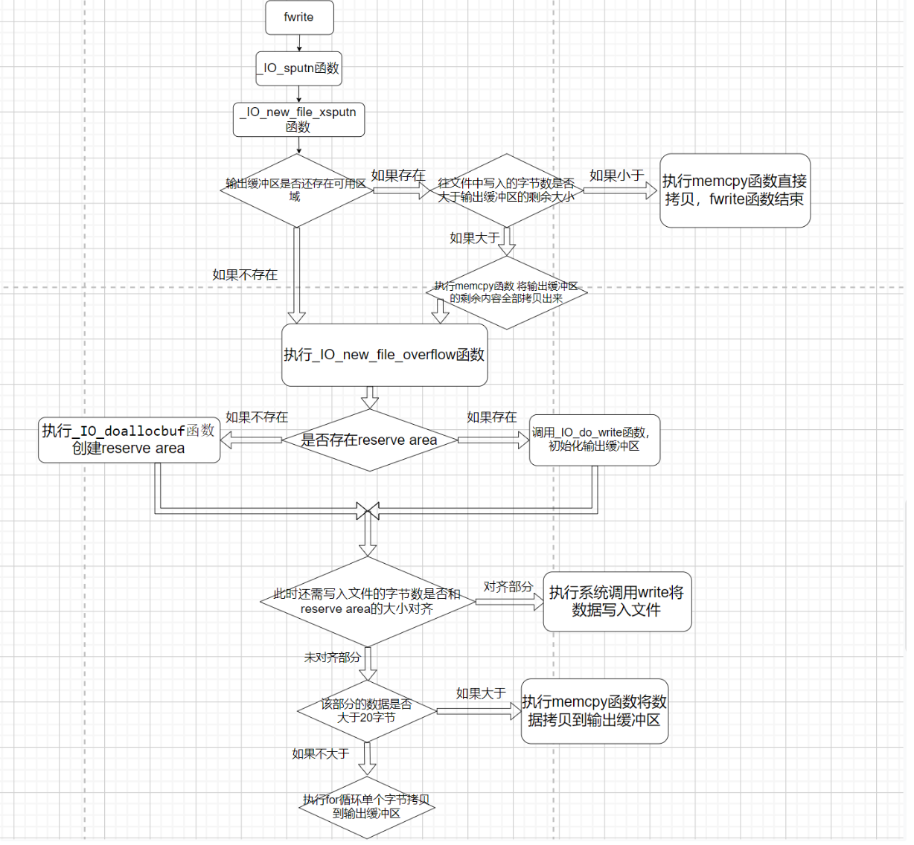

## 前置知识：

这个fwrite函数中的_IO_write_ptr指针的挪动和fread函数中的\_IO_read_ptr指针的挪动是不太一样的。先回顾一下上一篇文章中\_IO_read_ptr指针什么时候挪动？当系统调用read的时候从文件中读取多少个字节的数据到输入缓冲区，就将\_IO_read_end指针挪动多少个字节**(初始值和\_IO_read_base是一样的)**，而此时的\_IO_read_ptr指针不动。当执行memcpy函数将数据从输入缓冲区拷贝多少个字节的数据到我们指定的内存地址，就将\_IO_read_ptr指针挪动多少个字节。**在\_IO_read_base和\_IO_read_ptr之间是已经拷贝过的数据，\_IO_read_ptr和\_IO_read_end之间是输入缓冲区中还未拷贝的数据。**

而本次分析的**fwrite函数则是直接将\_IO_buf_end的值赋给了\_IO_write_end**（read的那个指针可不是这样），而\_IO_write_ptr的初始值则和\_IO_write_base的值一样。该函数先从指定的内存地址读取一定字节的数据到输出缓冲区，此时的\_IO_write_ptr指针挪动(我这里以及上下文提到的挪动指的都是在原本的基础上加)相应的字节。此时的**\_IO_write_base指针和\_IO_write_ptr指针之间的区域是将要从输出缓冲区写入文件的数据，而\_IO_write_ptr指针和\_IO_write_end指针之间的区域是输出缓冲区的可用区域(就是还能再往输出缓冲区拷贝多少个字节的内容)**，当执行系统调用write往文件中写入一定的字节的内容后，\_IO_write_ptr就会**减去相应的字节**。

上面的内容一定要清楚，不然分析的时候就会陷入误区

前面两篇文章的地址如下：

[IO学习--源码调试fopen函数](https://www.cnblogs.com/ZIKH26/articles/16567446.html)

[IO学习--源码分析fread函数 ](https://www.cnblogs.com/ZIKH26/articles/16575066.html)

## 整体流程：



上面第一张图片是fwrite函数的整体流程，第二张图片是根据我下面写的这个源代码对应的函数调用流程(调试的时候结合这两个图片，可以对自己调试到哪部分有个比较清楚的认知)。

## 源代码：

```c
#include<stdio.h>
int main(){
    char value[20];
    char new[30]="nice-day";
    FILE* fp=fopen("flag","wt");
    fwrite(new,1,25,fp);
    return 0;
}
```
**本文的源代码以及调试的程序所依赖的libc都为2.23版本的**
## 源码分析

_IO_fwrite 源代码(fwrite原型为\_IO\_fwrite函数)如下，这段很好分析，先是判断了request（也就是我们要输入的字节数是否为0），然后加锁去执行\_IO_sputn函数(该函数是vtable中的\_IO_new_file_xsputn函数)。

```c
_IO_size_t
_IO_fwrite (const void *buf, _IO_size_t size, _IO_size_t count, _IO_FILE *fp)
{
  _IO_size_t request = size * count;
  _IO_size_t written = 0;
  CHECK_FILE (fp, 0);
  if (request == 0)
    return 0;
  _IO_acquire_lock (fp);
  if (_IO_vtable_offset (fp) != 0 || _IO_fwide (fp, -1) == -1)
    written = _IO_sputn (fp, (const char *) buf, request);
  _IO_release_lock (fp);
  if (written == request || written == EOF)
    return count;
  else
    return written / size;
}
```


然后进入了\_IO_new_file_xsputn函数，先是有个if判断如下，这里我很迷惑，因为我不清楚_flags对应的各个位都是什么含义，尽管**通过调试可以看出来这个if并没有进去**，但实际上我并不知道为什么这个if进不去，我上网找了很多资料也没有找到相关\_flags各个位的含义，那就继续往下分析吧。

```c
  if ((f->_flags & _IO_LINE_BUF) && (f->_flags & _IO_CURRENTLY_PUTTING))
    {
      count = f->_IO_buf_end - f->_IO_write_ptr;
      if (count >= n)
	{
	  const char *p;
	  for (p = s + n; p > s; )
	    {
	      if (*--p == '\n')
		{
		  count = p - s + 1;
		  must_flush = 1;
		  break;
		}
	    }
	}
    }
```


如果没有进入上面的if，则会去判断是否还存在剩余的输出缓冲区（如下），count是剩余输出缓冲区的大小，to_do是需要往文件中写入的字节数。

根据下面这段代码分析，现在有三种情况分别是count>to_do    count<to_do    count==0

第一种是剩余的输出缓冲区比我们要输入的数据大，那memcpy执行后将数据拷贝到输出缓冲区就完事大吉，因为if (to_do + must_flush > 0)这行代码是进不去的，所以就直接return了。第二种是剩余的输出缓冲区比我们要输入的数据小，也进行memcpy函数的拷贝，只不过拷贝后，因为还有数据没有拷贝进输出缓冲区(此时输出缓冲区已经满了)，那就去执行_IO_new_file_overflow函数，它有俩作用，如果不存在输出缓冲区则会进行创建reserve area，如果存在的话，则会调用\_IO_do_write函数进行刷新，等刷新后再去拷贝剩下的数据到输出缓冲区。然后还有第三种情况就是此时并没有输出缓冲区。那也去执行\_IO_new_file_overflow函数进行创建reserve area，再去拷贝数据到输出缓冲区。

第一种情况下面的代码写的很清楚了，就不再分析第一种情况。

```c
  else if (f->_IO_write_end > f->_IO_write_ptr)
    count = f->_IO_write_end - f->_IO_write_ptr; /* Space available. */

  /* Then fill the buffer. */
  if (count > 0)
    {
      if (count > to_do)
	count = to_do;
#ifdef _LIBC
      f->_IO_write_ptr = __mempcpy (f->_IO_write_ptr, s, count);
#else
      memcpy (f->_IO_write_ptr, s, count);
      f->_IO_write_ptr += count;
#endif
      s += count;
      to_do -= count;
    }
```


第二种和第三种情况都会进入这个if中（这个if的代码我没放全，等分析到下面再放之后的部分），进入这个函数后就去调用了_IO_OVERFLOW (f, EOF)，这个函数是vtable中的\_IO_new_file_overflow。

```c
  if (to_do + must_flush > 0)
    {
      _IO_size_t block_size, do_write;
      /* Next flush the (full) buffer. */
      if (_IO_OVERFLOW (f, EOF) == EOF)
	/* If nothing else has to be written we must not signal the
	   caller that everything has been written.  */
	return to_do == 0 ? EOF : n - to_do;
```


进入_IO_new_file_overflow函数(代码如下)，可以发现有一个对f->\_IO_write_base是否为空的判断，而程序通过这个判断来判定是否没有分配resever area。如果没有分配的话则去执行\_IO_doallocbuf函数来分配resever area(这个函数在[fread源码分析](https://www.cnblogs.com/ZIKH26/articles/16575066.html)中已经分析过了，这里就不再分析了)，\_IO_setg这个宏的作用就是将三个read指针全部赋值为f->\_IO_buf_base(f->\_IO_buf_base在\_IO_doallocbuf函数中已经被初始化过了)

```c
int
_IO_new_file_overflow (_IO_FILE *f, int ch)
{
  if (f->_flags & _IO_NO_WRITES) /* SET ERROR */
    {
      f->_flags |= _IO_ERR_SEEN;
      __set_errno (EBADF);
      return EOF;
    }
  /* If currently reading or no buffer allocated. */
  if ((f->_flags & _IO_CURRENTLY_PUTTING) == 0 || f->_IO_write_base == NULL)
    {
      /* Allocate a buffer if needed. */
      if (f->_IO_write_base == NULL)
	{
	  _IO_doallocbuf (f);
	  _IO_setg (f, f->_IO_buf_base, f->_IO_buf_base, f->_IO_buf_base);
          /* #define _IO_setg(fp, eb, g, eg)  ((fp)->_IO_read_base = (eb),\
	(fp)->_IO_read_ptr = (g), (fp)->_IO_read_end = (eg))*/
	}
```


下面的代码一定要注意，此处是将_IO_write_ptr和\_IO_write_base两个指针都初始化为了\_IO_buf_base的值，**但\_IO_write_end指针却是初始化为了\_IO_buf_end**（read的三个相关指针是都被初始化为了\_IO_buf_base）

```c
      if (__glibc_unlikely (_IO_in_backup (f)))
	{
	  size_t nbackup = f->_IO_read_end - f->_IO_read_ptr;
	  _IO_free_backup_area (f);
	  f->_IO_read_base -= MIN (nbackup,
				   f->_IO_read_base - f->_IO_buf_base);
	  f->_IO_read_ptr = f->_IO_read_base;
	}

      if (f->_IO_read_ptr == f->_IO_buf_end)
	f->_IO_read_end = f->_IO_read_ptr = f->_IO_buf_base;
      f->_IO_write_ptr = f->_IO_read_ptr;
      f->_IO_write_base = f->_IO_write_ptr;
      f->_IO_write_end = f->_IO_buf_end;
      f->_IO_read_base = f->_IO_read_ptr = f->_IO_read_end;

      f->_flags |= _IO_CURRENTLY_PUTTING;
```


然后由于当初调用_IO_OVERFLOW函数的时候，第二个参数为EOF


因此_IO_new_file_overflow函数的ch为EOF


所以上面几个指针赋值过后，执行下面if的时候就直接进入了,调用了_IO_do_write函数，注意下\_IO_do_write的第三个参数，如果是新创建的reserve area，那么 f->\_IO_write_ptr - f->\_IO_write_base的值则为0的（如下代码）

```c
  if (ch == EOF)
    return _IO_do_write (f, f->_IO_write_base,
			 f->_IO_write_ptr - f->_IO_write_base);
```


因为刚才说过，这个to_do其实就是0，因此return返回的时候发现to_do==0成立并且后面是||，就直接从\_IO_new_do_write函数返回了，并没有去执行后面的new_do_write函数(当时分析到这里，我还不信，于是写了个demo测试了一下发现确实如此(如下图)）**注意:前面讨论的是新创建reserve area执行到这里的情况，如果是输出缓冲有数据的话，来到这里就会执行new_do_write函数，从而触发系统调用write来刷新输出缓冲区(不仅数据被刷新了出去,同时\_IO_write_ptr指针也进行了更新)。**总结一下就是_IO_new_do_write函数对输出缓冲区中的数据进行了一个判断，如果存在数据的话就调用write函数来将输出缓冲区中的数据写入文件，否则的话就直接返回。

```c
# define _IO_new_do_write _IO_do_write

int
_IO_new_do_write (_IO_FILE *fp, const char *data, _IO_size_t to_do)
{
  return (to_do == 0
	  || (_IO_size_t) new_do_write (fp, data, to_do) == to_do) ? 0 : EOF;
}
```


然后程序一直返回到_IO_new_file_xsputn函数，接下这段代码实现的是如果要写到文件里的数据大于了reserve area这块区域(通常是0x1000,也就是4k)，那就将大于的部分直接执行系统调用write输出到文件，剩下的部分则写到输出缓冲区中。比如我们要写10k的数据到文件中，而reserve are为4k，那8k的数据都将直接被系统调用write写入文件中，另外2k的数据放到输出缓冲区中。

上述功能的实现核心代码就是这一行`do_write = to_do - (block_size >= 128 ? to_do % block_size : 0);`(不得不说，这一行写的是真巧妙)，如果写入的数据量本身就小于reserve area的话，那do_write就会是0，也就无法进入下面那个if。而if中的new_do_write函数中执行了系统调用write，并且重置了\_IO_write_ptr指针(如下图)

```c
      block_size = f->_IO_buf_end - f->_IO_buf_base;
      do_write = to_do - (block_size >= 128 ? to_do % block_size : 0);

      if (do_write)
	{
	  count = new_do_write (f, s, do_write);
	  to_do -= count;
	  if (count < do_write)
	    return n - to_do;
	}
```


这里也就是将大块的数据(大于reserve area的数据)去直接执行系统调用write写入文件，而剩余的小块(小于reserve area的数据)拷贝到输出缓冲区中（下面代码的_IO_default_xsputn函数调用了拷贝函数memcpy）

```c
      if (to_do)
	to_do -= _IO_default_xsputn (f, s+do_write, to_do);
```


_IO_default_xsputn函数的源码如下，这个函数分析起来还是比较简单的。more是我们需要写入文件的字节数，count是输出缓冲区剩余的字节数。如果我们需要写入文件的字节数大于20的话，就执行memcpy函数去拷贝，如果小于20的话，就用for循环一个字节一个字节的拷贝(这个策略应该是效率比较高的)

```c
_IO_default_xsputn (_IO_FILE *f, const void *data, _IO_size_t n)
{
  const char *s = (char *) data;
  _IO_size_t more = n;
  if (more <= 0)
    return 0;
  for (;;)
    {
      /* Space available. */
      if (f->_IO_write_ptr < f->_IO_write_end)
	{
	  _IO_size_t count = f->_IO_write_end - f->_IO_write_ptr;
	  if (count > more)
	    count = more;
	  if (count > 20)
	    {
#ifdef _LIBC
	      f->_IO_write_ptr = __mempcpy (f->_IO_write_ptr, s, count);
#else
	      memcpy (f->_IO_write_ptr, s, count);
	      f->_IO_write_ptr += count;
#endif
	      s += count;
	    }
	  else if (count)
	    {
	      char *p = f->_IO_write_ptr;
	      _IO_ssize_t i;
	      for (i = count; --i >= 0; )
		*p++ = *s++;
	      f->_IO_write_ptr = p;
	    }
	  more -= count;
	}
      if (more == 0 || _IO_OVERFLOW (f, (unsigned char) *s++) == EOF)
	break;
      more--;
    }
  return n - more;
}
```

然后这个函数执行完毕后，整个fwrite函数也就算是结束了。

## 总结fwrite函数的调用流程：

先尝试将数据拷贝到输出缓冲区，如果全部都拷贝过去的话函数就直接返回。如果只拷贝过去了一部分数据，另外一部分数据因为输出缓冲区满的话又或者没有分配reserve area的话都调用\_IO\_new\_file_overflow函数，然后这个函数会新创建一个reserve area或者执行系统调用write刷新输出缓冲区。最后来判断要写入的字节数是否小于reserve area，如果小于的话则将数据拷贝到输出缓冲区中，如果大于的话则将大于部分用系统调用write写入文件剩余部分再拷贝到输出缓冲区。**注意：这个demo程序的话，调试到fwrite函数结束也没有发现系统调用了write，这是因为输出缓冲区将在程序结束时的exit函数中的_IO_cleanup函数调用\_IO_flush_all_lockp函数时进行刷新，此时才会执行系统调用write**

## 参考文章：

[FILE结构体及漏洞利用方法 | Hacked By Fish_o0O (fish-o0o.github.io)](https://fish-o0o.github.io/2019/12/29/FILE结构体及漏洞利用方法/#fwrite)

[IO FILE之fwrite详解 - 跳跳糖 (tttang.com)](https://tttang.com/archive/1279/#toc__1)

[ (leanote.com)](http://blog.leanote.com/post/mut3p1g/file-struct)