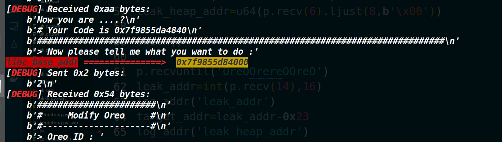
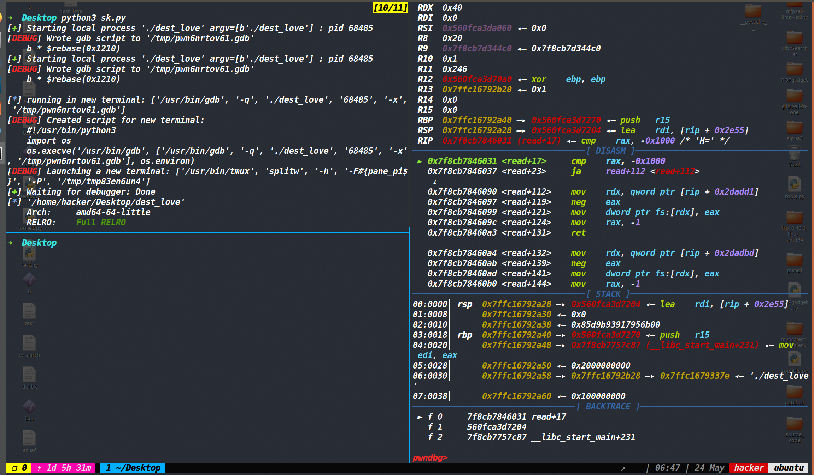
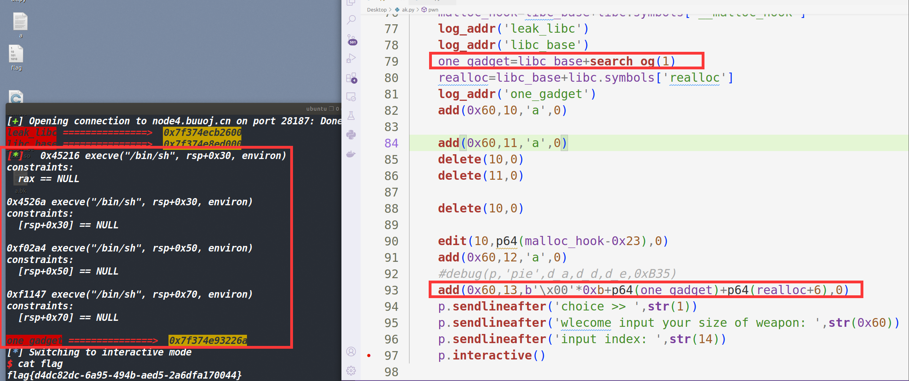

我和我的同学 [trunk](https://www.cnblogs.com/trunk/) 写了一些方便解PWN题的~~鸡肋~~函数封装到了这个库里，第一是平常用起来方便顺手，第二顺便练习下编程能力，第三如果以后有可能的话，希望逐渐做成像 **roderick** 师傅的[pwncli](https://github.com/RoderickChan/pwncli)那样。

[源代码](https://github.com/ZIKH26/tools/blob/master/tools.py)

一条命令下载 `tools` 函数库

```shell
wget https://raw.githubusercontent.com/ZIKH26/tools/master/tools.py
```


**`tools` 库只支持python3**

## 命令行参数：

为了不在打远程和本地，以及打本地时是否开启调试选择中来不断的更改脚本，因此我设置了命令行参数来直接做切换。

1 去打远程且不开启脚本中的调试

2 打本地且不开启脚本中的调试

如果不加命令行参数，则默认打本地，若有debug函数则自动开启调试。


假设你现在想打远程

那么你需要在脚本里写`p,e,libc=load("heap","node4.buuoj.cn:27339")` (程序名和ip&port请自行更改，这里只是举例说明)

然后运行脚本时使用命令 如下(即使脚本中有debug函数也不影响打远程)

```shell
python3 exp.py 1
```

如果打本地时，不想去让脚本执行debug函数，那么命令可以如下(这样的好处是即使脚本中存在debug函数，但不想在本次执行脚本时debug也不需要来回去脚本里注释了)

```
python3 exp.py 2
```

**如果直接运行exp.py的话，即使脚本里存在ip和port也不会去打远程**

此外，假设你打本地所依赖的libc是2.23-0ubuntu11.3版本 而远程服务器程序所依赖的libc是2.23-0ubuntu11版本。二者仅仅是小版本有细微的不同，可能one_gadget和一些libc里函数的偏移有点不同，如果来回去修改的话，有点麻烦，因此在load函数的第三个参数可以设置远程依赖的libc，这样用后面search_og函数或者libc.symbols找的函数地址都会自动切换到远程所依赖的libc。

示例如下:

```py
p,e,libc=load("a","node4.buuoj.cn:29026","libc-2.23.so")
```


## 各个函数的使用说明

### long_search&local_search

作用：这两个函数就是去libc中寻找system函数和/bin/sh的地址（分别用于本地和远程）
优点：将用LibcSearcher搜索并装载的重复的代码都放到了函数内部，现在一行就可以获取system和/bin/sh地址，因此您的脚本看起来更为简洁。

使用范例

```python
sys_addr,bin_sh_addr=long_search('puts',puts_addr)

sys_addr,bin_sh_addr=local_search('puts',puts_addr,libc)
"""libc指的是装载本地的libc,例如在脚本开始声明"""
"""libc=ELF('/lib/i386-linux-gnu/libc.so.6')"""

```

### log

作用：这个函数就是单纯的打印一下某些变量的信息，类似于日志（但我更建议去使用下面的log_addr函数）
优点：加了箭头和字体颜色效果，可以更清楚的打印所需要的信息

使用范例

```python
puts=123456
log('puts_addr',puts_addr)
```

### log_addr

如果你仅仅是想看一下变量对应的值是否是你需要的那个地址，同时感觉上面这个log函数太麻烦还需要两个参数，那么你不妨试试log_addr函数。

作用:log_addr是专门为展示地址设计的（因为它会自动将变量以16进制的形式打印)

优点：**只传一个变量名字即可同时返回的是以十六进制表示的变量**，但是没有log函数灵活。

使用前提：你要确保变量是int类型的，那么你仅仅传入**字符型的<u>变量名字</u>**（不是变量）

使用范例

```
puts_addr=123456
log_addr('puts_addr')
```

使用效果：


### log_info

如果仅仅是打印一个参数的话，可以使用log_info函数。

作用：打印调试信息

优点：前面加了[*]，使调试信息更加明显，让你更快的找到你想看见的信息。

适用情况：比如你发现u32(p.recv(4))得到的地址不对，你想要看看p.recv()到底接收了什么，那么你就可以这么写log_info(p.recv())。

使用范例

```
log_info(p.recv())
```

使用效果：


### debug

作用：在脚本中下断点进行调试
优点：1、如果使用tmux，可以直接分三屏，效果如下图。您仅仅只需要在脚本中加入这个函数，运行脚本的时候就可以自动分出三块屏幕(调试具体信息占屏幕的右侧，左上是脚本的debug执行信息，左下则可以继续使用)，左下角的区域完全可以去对着脚本进行调试。



2、可以很简洁的输入地址，即可完成下断点的工作，同时开了pie保护的话，也可以正常去下断点

使用说明：
		这个函数还是比较常用的，适用于tmux的终端，只需要在最开始传递一下process函数返回的对象，接着就可以直接下断点了（默认使用tmux），如果开启了PIE保护的话，需要声明一下pie（也就是加一个参数'pie'）即可继续下断点。
		如果不使用tmux也没问题，可以加入参数no-tmux就可以正常使用这个函数（**如果使用no-tmux，则这个参数必须是放在第二个参数的位置**（第一个参数始终是process的返回值）

如果直接使用debug()函数，参数只有process函数返回的对象的话，则默认使用tmux终端，执行分三屏命令，最后执行gdb.attach(p)
PS：这个函数可以放到脚本的任何位置（必须要保证当前位置的下面还有一行不会触发报错的代码），这样可以从脚本当前的位置去开始调试，同时配合下的断点可以使调试更高效。
使用范例：

```python
debug(p,0x400ECD,0x400F54)
"""使用tmux，下两个断点"""

debug(p,'no-tmux','pie',0x248)
"""不使用tmux，程序开了pie，用偏移来下断点"""

debug(p)
"""使用tmux，执行gdb.attach(p)"""
```

### load

作用:写入目标程序的名字，将返回p(process的返回值),e(当前ELF文件的信息),libc(ELF文件所依赖的libc文件的信息)。ps：如果是静态链接的程序，那么只会执行p=process或者p=remote然后直接返回p。

也就是相当于执行了原来的p=process('xxx') e=ELF('xxx') libc=ELF('xxx')。如果传入了ip和port的话，则会执行remote(ip,port)代替原本的process。这样就可以直接打远程了

优点:将原本重复的代码写在了函数内部，现在只要调用load函数，传入函数名即。同时该函数也获取了libc的信息将其存为了全局变量，为了之后获取one_gadget的函数直接使用。

使用范例：

```python
p,e,libc=load('program')#这是打本地，动态链接的程序
p=load('program')#这是打本地，静态链接的程序
p,e,libc=load("program","node4.buuoj.cn:28822")#这是打远程的情况，ip和port只需要用:分隔开即可。
```


### shellcode_store

我封装了一些shellcode放到了tools里面，可以使用shellcode_store函数来进行使用。

作用：参数设置为需要的shellcode类型，返回对应的shellcode

使用范例：

```python
shellcode=shellcode_store('shell_64')#返回64位获取shell的shellcode
shellcode=shellcode_store('orw_32')#返回32位执行open,read,write读出flag的shellcode
shellcode=shellcode_store('str_rax')#返回起始的跳转寄存器为rax的字符型shellcode
```

PS：获取shell和orw的我都写了64位和32位的shellcode（应该是最短字节的了），纯字符的shellcode我几乎只生成了针对于x64的各个寄存器，其他没有生成那么多（因为感觉平常很少用到），等以后用到没有生成过的再记录上来吧。


### search_og

作用：不需要手动将one_gadget工具获取的one_gadget再复制粘贴到脚本中了，可以直接通过这个函数来获取one_gadget,参数为想获取对应的one_gadget在列表中的索引。

注意:这个函数依赖了one_gadget这个工具以及load函数，因此必须要保证当前拥有one_gadget工具并且脚本中使用了load函数才行。

使用范例:

```py
one_gadget=search_og(1)
p.sendline(p64(one_gadget+libc_base))
```

使用效果：



### 攻击模板

#### obstack_attack

作用: 这个函数是提前布局好的一个 `IO_FILE` 模板（打的 `IO` 链是 `IO_obstack_jumps` 中 `_IO_obstack_xsputn` 函数），攻击效果可以任意地址执行并且可以控制第一个参数,这个函数的最终效果是执行 `system("/bin/sh")`

适用版本: `glibc 2.36`及以下

利用条件:使用前提是泄露 `libc` 地址和堆地址 并且能任意地址写一个堆地址(最好是往 `IO_list_all` 里写一个堆地址) 且能从 `main` 函数正常返回或者触发 `exit` 函数


```py
dirc={ 'system':libc_base+0x50d60 ,'io_obstack_jumps':libc_base+xxx}
libc_symbols=create_dict(dirc)

payload=obstack_attack(heap_addr,libc_symbols)
```

使用方法: `heap_addr` 是写入 `IO_list_all` 中的堆地址( `chunk` 头地址)
`libc_symbols` :是 `create_dict(dict)` 传入进来返回值（ `dirc` 是所需的参数字典）

返回值是构造好的 `payload`


#### obstack_orw1_attack

作用：这个函数就是在禁用了 `execve` 或者栈没对齐时使用的,攻击效果就是执行常规的 `orw`,和`obstack_attack` 不同的就是字典中多了几个成员

```py
dirc={'io_obstack_jumps':libc_base+xxx ,'open':libc_base+xxx ,'read':libc_base+xxx ,'write':libc_base+xxx ,'svcudp_reply':libc_base+xxx ,'add_rsp':libc_base+xxx ,'leave_ret':libc_base+xxx ,'pop_rdi':libc_base+xxx ,'pop_rsi':libc_base+xxx ,'pop_rdx_xxx':libc_base+xxx }

libc_symbols=create_dict(dirc) 
payload=obstack_attack(heap_addr,libc_symbols)
```

使用方法: `heap_addr` 是写入 `IO_list_all` 中的堆地址( `chunk` 头地址)
`libc_symbols` :是 `create_dict(dict)` 传入进来返回值（ `dirc` 是所需的参数字典）

返回值是构造好的 `payload`

#### obstack_orw2_attack

这个是上一个的升级版,区别就是将 `open` 换成了 `openat` （有时候可能沙箱会禁用掉 `open`）,并且关闭标准输入流，将文件描述符 `0`  作为 `flag` 文件的文描述符,避免本地通了，远程打不通

```py
dirc={'io_obstack_jumps':libc_base+xxx ,'openat':libc_base+xxx ,'close':libc_base+xxx ,'read':libc_base+xxx ,'write':libc_base+xxx ,'svcudp_reply':libc_base+xxx ,'add_rsp':libc_base+xxx ,'leave_ret':libc_base+xxx ,'pop_rdi':libc_base+xxx ,'pop_rsi':libc_base+xxx ,'pop_rdx_xxx':libc_base+xxx }
libc_symbols=create_dict(dirc)
payload=obstack_attack(heap_addr,libc_symbols)
```

使用方法: `heap_addr` 是写入 `IO_list_all` 中的堆地址( `chunk` 头地址)
`libc_symbols` :是 `create_dict(dict)` 传入进来返回值（ `dirc` 是所需的参数字典）

返回值是构造好的 `payload`