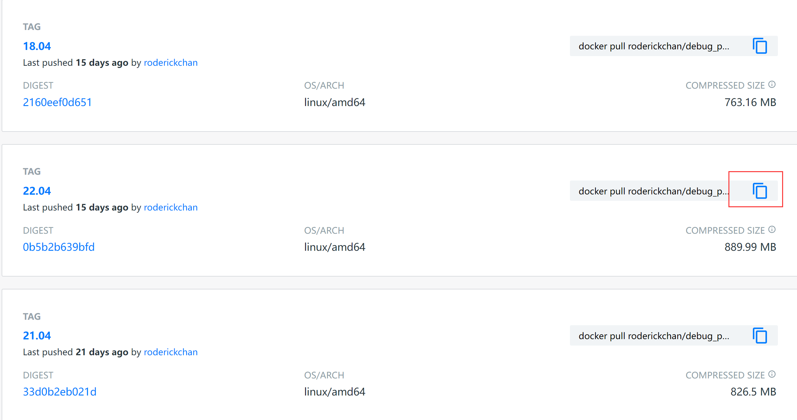
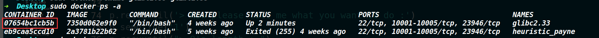
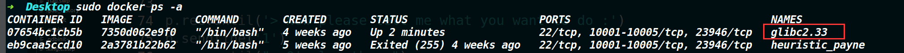

因为打CTF pwn题的时候，经常遇见本地程序的libc与远程服务器那边程序所依赖的libc不匹配的情况，尽管可以用patchelf和glibc-all-in-one来给程序patch一个libc。但是patchelf似乎有点小bug，为了防止比赛的时候在这个地方掉链子，因此可以采用在docker里跑不同版本的ubuntu。

同时随着时间的推移，自己也从一个拉跨的做题人偶尔客串了一下拉跨的出题人，因此需要打包一个题目环境，还得学习一下docker的几个基本配置文件。

本文是对我学习docker做了一个简单的小总结。


### docker 容器 镜像

Docker是一个开源的容器编排工具，它允许开发人员在自己的计算机上打包和运行应用程序。

容器是一种轻量级的虚拟化技术，它允许在单个操作系统中运行多个隔离的应用程序。容器运行时会在镜像的基础上创建一个可写层，而镜像本身是只读的。

镜像是容器运行时所需要的文件系统，它包含了容器运行时需要的所有软件，配置文件和环境变量等。镜像是静态的，不能运行命令，只能被用来创建容器。

总之，Docker是一种工具，容器是运行在Docker上的一种虚拟化技术，镜像是容器运行所需要的文件系统。


## docker安装

一条命令安装docker:

```shell
sudo curl -fsSL https://get.docker.com | bash -s docker --mirror Aliyun
```

如果没有安装curl的话，先安装curl:

```shell
sudo apt-get install curl
```

## ubuntu不同版本对应默认libc：

> 需要什么版本libc，接下来下载对应的版本镜像即可
>
> 22.04---->2.35-0ubuntu3
>
> 21.04---->2.33-0ubuntu5
>
> 20.04---->2.31-0ubuntu9.7
>
> 21.10---->2.34-0ubuntu3.2
>
> 18.04---->2.27-3ubuntu1.5

## 下载镜像

roderick师傅编译了很多版本的镜像,在下面这个链接下载(使用roderick师傅的镜像，运行起来的容器里面要用gdb.attach的话，需要指定终端tmux，roderick师傅把一些快捷键给改了，具体请在容器里输入cat ~/.tmux.conf 来查看）

https://hub.docker.com/r/roderickchan/debug_pwn_env/tags




点这个，然后直接粘到虚拟机上就开始下载了（注意权限问题）。

我简单说一下这个docker是咋用的

> 刚刚下载下来的镜像，要实例化成容器（也就是让容器运行起来）。当容器运行起来之后，我们就相当于有了"另一个版本的ubuntu"。如果你想退出它可以用exit，此时它依然是运行状态，如果你停止了一个容器，那么此时它处于停止状态，不过不管是你exit还是stop还是关机，容器依然存在（里面你新下载的文件也存在），可以使用start开启停止状态的容器，如果删除了容器，则里面你新下载的文件会消失（容器原本的文件不会消失）

## 搜索镜像

```shell
docker search 关键字
```


使用docker search命令搜索官房仓库中的共享镜像。

## 拉取镜像

对于Docker镜像来说，如果下载镜像时不指定标签，默认会下载仓库中最新版本的镜像，即选择
标签latest。

```shell
docker pull 仓库名称[:标签]
```


## 查看镜像或者容器

查看所有容器

```shell
sudo docker ps -a
```

查看正在运行的容器

```shell
sudo docker ps
```

查看已有镜像：

```shell
sudo docker images
```

## 启动容器

这意味着是在把一个镜像给实例化（除非删除，不然启动的容器不会消失（即使主机重启,或者输入stop，或者exit）

```shell
sudo docker run -it IMAGE ID /bin/bash
```

启动已停止的容器(启动被stop暂停的容器)

```shell
sudo docker start  CONTAINER ID
```

## 进入容器&&退出容器

进入容器的前提是容器必须启动（也就是用docker ps可以看到容器)，如果容器处于了停止状态，需要用docker start将其启动，然后再进入容器.

下面两个命令都可以进入容器，二者区别在于前者使用之后执行exit会顺便把容器停止，而后者执行exit，容器依然在运行。

```shell
sudo docker attach  CONTAINER ID
```

```shell
sudo docker exec -it CONTAINER ID /bin/bash
```

如果要以root权限进入容器的话，命令如下

```shell
sudo docker exec -it -u root CONTAINER ID /bin/bash
```

**退出容器执行`exit`即可，只要容器被启动，则输入上述命令就能再次进入。**

## 删除镜像或者容器

删除指定的容器

```shell
sudo docker rm -f CONTAINER ID
```

删除指定的镜像（删除镜像之前需要先停止容器，然后先删容器后删镜像）

```shell
sudo docker rmi IMAGE ID
```

下面的命令可以清理掉所有处于终止状态的容器。

```shell
sudo docker container prune
```

删除所有镜像(如果被实例化的镜像是不能删除的)

```shell
sudo docker system prune -a
```

## 停止容器

请注意停止容器和删除容器的区别：停止容器，仅仅是用docker ps查看不到了（因为他不再运行了，但它依然存在，只不过属于停止状态，用docker ps -a可以查看到）

停止容器

```shell
sudo docker stop CONTAINER ID
```

## 将文件从主机复制到docker

```shell
sudo docker cp file CONTAINER ID:Destination_directory
```

## 挂载命令

可以通过挂载的方式来让宿主机和Docker直接来共享文件。（下面这个方法只适用于创建新的容器时同时创建共享目录，不适于后期添加共享目录）

创建容器时执行Docker Volume

```shell
docker run -itd --volume /tmp/source:/tmp/destination --name test ubuntu/nginx bash
```

示例：

```shell
sudo docker run -it --volume /home/hacker/Desktop/ROPgadget:/home/roderick/ROPgadget --name test roderickchan/debug_pwn_env:22.04
```

解释:将本机上的ROPgadget文件复制到容器里面,命名为test。

本人也只是刚开始接触docker的使用，如果上述理解又什么问题，欢迎各位师傅斧正，如果以后用到了docker的其他用法，我会更新这篇文章。

下面为后来的更新部分：

## NAMES有些地方可以代替CONTAINER ID

上面的命令我一直以为 CONTAINER ID要输入下面这个东西才行



刚才我试了一下发现也可以输入NAMES来代替，也就是下面这个东西。



以启动这个glibc2.33的容器举例，重新启动docker的时候，输入 sudo docker start  glibc2.33即可。

## 容器的重命名

如果最开始创建容器的时候没有进行命名，那么就会随机给这个容器分配一个名字，之后可以通过下面这个命令给容器重命名（docker1为容器原本的名字，docker2为容器的新名字）

```she
sudo docker rename docker1 docker2
```


## docker的基本配置文件

在出题的时候，需要去部署一下docker，一般来说用那个ctf_xinetd项目是比较方便的，相关用法不做介绍了，网上一搜一堆。

主要是简单说一下几个配置文件的作用以及代码的简单分析

我找了之前出过的一个题目的docker文件，来解释一下


有以上几个基本的配置文件


#### Dockerfile

用于构建镜像的配置文件，里面包含了构建镜像所需的各种指令，如配置环境，安装软件，配置启动命令等。

```dockerfile
FROM ubuntu:18.04 #该指令告诉Docker我们要在基于Ubuntu 18.04镜像进行操作，如果你本地没有该镜像，Docker会去Docker hub上下载

RUN sed -i "s/http:\/\/archive.ubuntu.com/http:\/\/mirrors.tuna.tsinghua.edu.cn/g" /etc/apt/sources.list && \
    apt-get update && apt-get -y dist-upgrade && \
    apt-get install -y lib32z1 xinetd
#上述指令首先将ubuntu的镜像源替换为清华大学的镜像源，更换镜像源的目的是为了更快的下载软件包
#其次更新了系统软件包，确保系统是最新的状态
#最后安装libc32z1和xinetd两个软件包

RUN useradd -m ctf #创建名为ctf的用户，-m表示创建用户的同时创建用户的主目录

WORKDIR /home/ctf #将工作目录设置为/home/ctf

RUN cp -R /lib* /home/ctf && \ 
    cp -R /usr/lib* /home/ctf

RUN mkdir /home/ctf/dev && \
    mknod /home/ctf/dev/null c 1 3 && \
    mknod /home/ctf/dev/zero c 1 5 && \
    mknod /home/ctf/dev/random c 1 8 && \
    mknod /home/ctf/dev/urandom c 1 9 && \
    chmod 666 /home/ctf/dev/*

RUN mkdir /home/ctf/bin && \
    cp /bin/sh /home/ctf/bin && \
    cp /bin/ls /home/ctf/bin && \
    cp /bin/cat /home/ctf/bin

COPY ./ctf.xinetd /etc/xinetd.d/ctf #将本地的ctf.xinetd文件复制到容器的/etc/xinetd.d/ctf下
COPY ./start.sh /start.sh #将本地的start.sh文件复制到容器的根目录下
RUN echo "Blocked by ctf_xinetd" > /etc/banner_fail

RUN chmod +x /start.sh #给start.sh可执行权限

COPY ./bin/ /home/ctf/
RUN chown -R root:ctf /home/ctf && \
    chmod -R 750 /home/ctf && \
    chmod 740 /home/ctf/flag

CMD ["/start.sh"] #在容器启动时执行/start.sh文件

EXPOSE 9999 #将容器的9999端口暴露出来
```

上面出现的关键词如下：

1. `FROM`: 指定基础镜像。
2. `RUN`: 在镜像中执行命令。
3. `WORKDIR`: 指定工作目录。
4. `COPY`: 从本地主机复制文件/文件夹到容器。
5. `CMD`: 容器启动时运行的命令。
6. `EXPOSE`: 暴露容器的端口。

关于这个 `EXPOSE 9999` ，指的是运行的服务可以通过9999端口进行访问，但这不意味着自动将容器的9999端口映射到主机端口，EXPOSE主要是让构建镜像的人和运行容器的人有一个明确的了解，这个容器上的端口哪些提供服务，并且如果需要的话可以运行容器的时候把这些端口映射到主机端口上。当然，这不算强制的，这只是一个建议或者提示，依然可以不按照EXPOSE声明的端口来使用，你可以使用自己需要的端口映射容器端口到主机上。


#### docker-compose.yml

该文件用来配置和启动多容器Docker应用程序的配置文件，可以在一个文件中定义所有容器，并在所有容器之间定义连接。

```
version: '3'	 #指定了Docker Compose文件格式的版本

services:  		 #    定义了一个服务部署的集合
    pwn:		 #	 定义了一个名为pwn的服务
        build: ./ #   指定了Docker Compose应该使用当前目录下的Dockerfile来构建镜像
        image: pwn #  镜像的名称为pwn
        ports:
            - "8888:9999"  #将容器中的9999端口映射到主机的8888端口
        pids_limit: 1024
        # cpus: 0.5
        container_name: pwn #容器的名称为pwn
        restart: unless-stopped
        # privileged: true
```


#### start.sh

主要在构建完镜像后运行在容器中的脚本，用于在容器启动时进行初始化操作。可以在Dockerfile文件中配置其作为容器启动时的入口点，从而完成一些必要的配置。

```
#!/bin/sh
# Add your startup script
echo dXNlcj1gbHMgL2hvbWVgCmlmIFsgISAkREFTRkxBRyBdO3RoZW4KIGVjaG8gZmxhZ3tURVNUX0RBU0ZMQUd9fHRlZSAvaG9tZS8kdXNlci9mbGFnIC9mbGFnCmVsc2UKIGVjaG8gJERBU0ZMQUd8dGVlIC9ob21lLyR1c2VyL2ZsYWcgL2ZsYWcKZmkKY2hvd24gcm9vdDokdXNlciAvaG9tZS8kdXNlci9mbGFnIC9mbGFnCmNobW9kIDc0MCAvaG9tZS8kdXNlci9mbGFnIC9mbGFnCg==|base64 -d|sh;
# DO NOT DELETE
/etc/init.d/xinetd start; #启动xinetd服务
sleep infinity;
```

上面是被base64编码过了，然后解码之后内容如下

```shell
user=`ls /home`
if [ ! $DASFLAG ];then
 echo flag{TEST_DASFLAG}|tee /home/$user/flag /flag
else
 echo $DASFLAG|tee /home/$user/flag /flag
fi
chown root:$user /home/$user/flag /flag
chmod 740 /home/$user/flag /flag
```

这里是设置的动态flag


这样将docker环境打包好后，直接输入 `docker compose up -d ` 命令，即可自动部署。

**当你使用docker compose up 命令启动容器时，Docker Compose会读取docker-compose.yml文件并使用Dockerfile构建镜像，然后根据文件中配置启动容器，并执行start.sh脚本。，容器启动后，就可以通过指定的端口访问容器中运行的应用或服务。**


