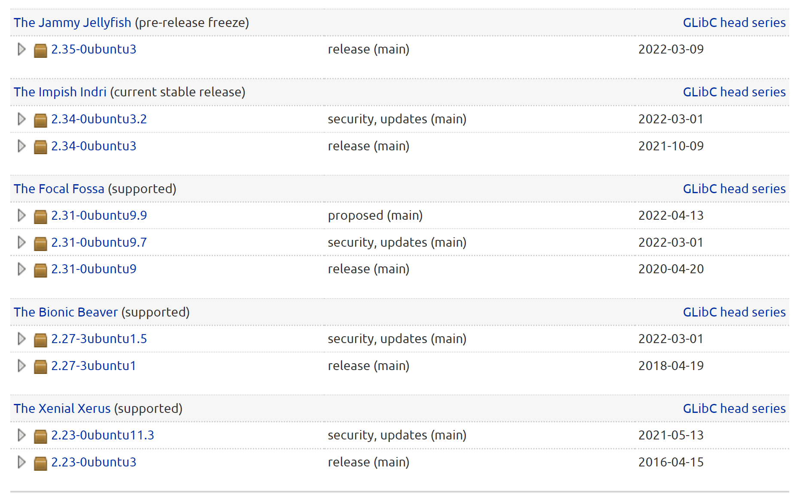
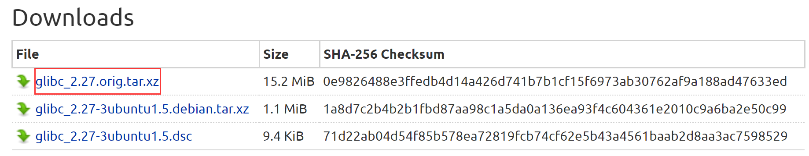
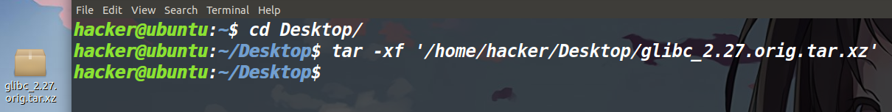
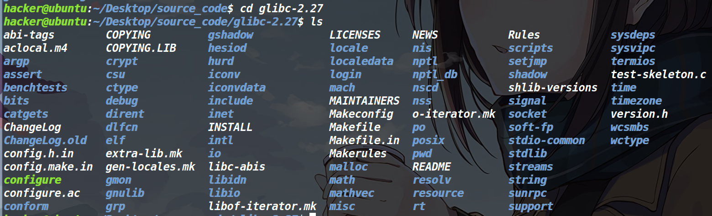
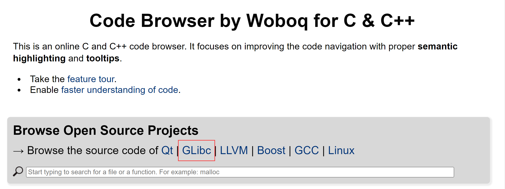
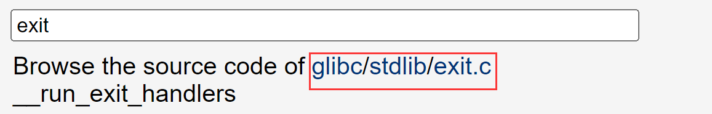
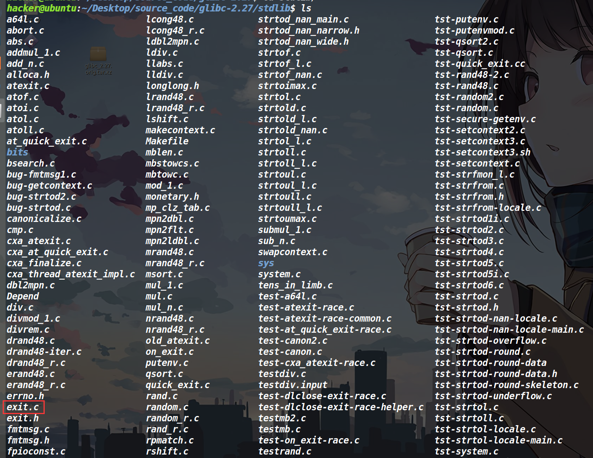
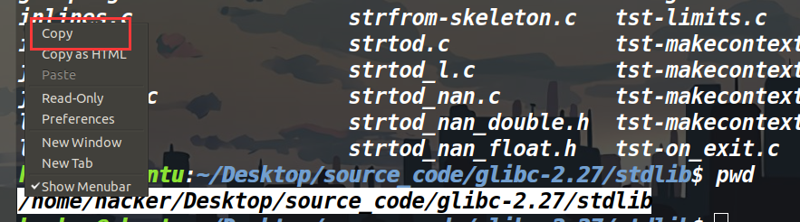
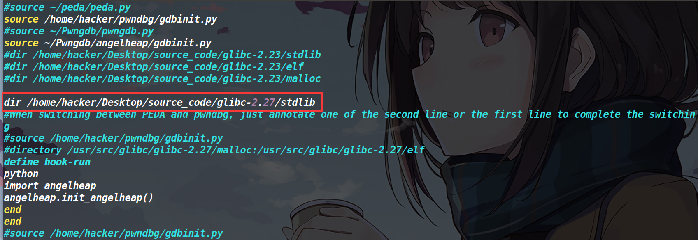
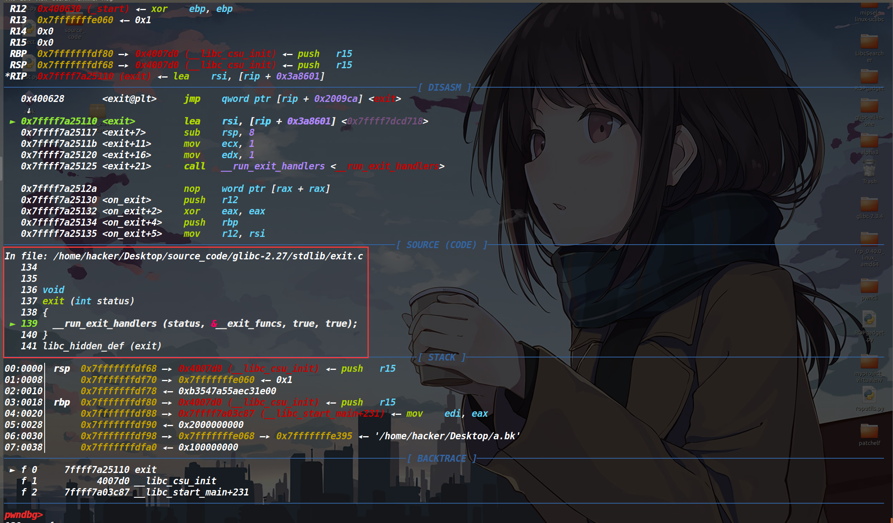

有时候我们要去追踪一些函数或是数据，需要用gdb动态调试并去结合着源码分析。下面介绍一下gdb源码调试的环境如何搭建

## glibc源码下载

glibc源码可以在下面这个链接下载

```
https://launchpad.net/ubuntu/+source/glibc/
```



选择需要的glibc版本，我以2.27-3ubuntu 1.5为例



选择这个最大的文件，下载。

然后拖到ubuntu里面解压

```bash
tar -xf filename
```



新建一个大的文件夹，用来存放各个版本的glibc，然后进入新下载的glibc，ls看一下发现东西都在里面。然后我们需要去找源码所在的文件夹。



## 找一下函数所在的源文件

比如我现在想进行exit源码调试，先去下面这个网站搜一下exit源码在哪个文件里面。

[在线查看源码网站](https://code.woboq.org/)




进去之后，搜索想找的函数，然后就可以看到它所在的文件。发现exit.c在stdlib文件中。



我们去看一下，果然是在stdlib中发现了exit.c



## 配置.gdbinit

然后pwd，复制一下路径。



然后去用户目录下输入

```bash
vim .gdbinit
```

然后输入

```bash
dir  刚才复制的路径
```

效果如下



最后保存一下就ok了。

然后gdb继续调试elf程序即可，等进入你装载进去的文件之后，就会自动展示glibc源代码。

## 最后效果

效果如下：



PS：如果调试其他函数没有出现源码，就说明没有导入成功对应的代码源文件，另外就是调试不同的程序，对应的glibc版本不要选错了。

参考博客：

[Glibc源码调试环境搭建 | TaQini](http://taqini.space/2020/11/01/glibc-debug-pwndbg/#Glibc源码调试环境搭建)