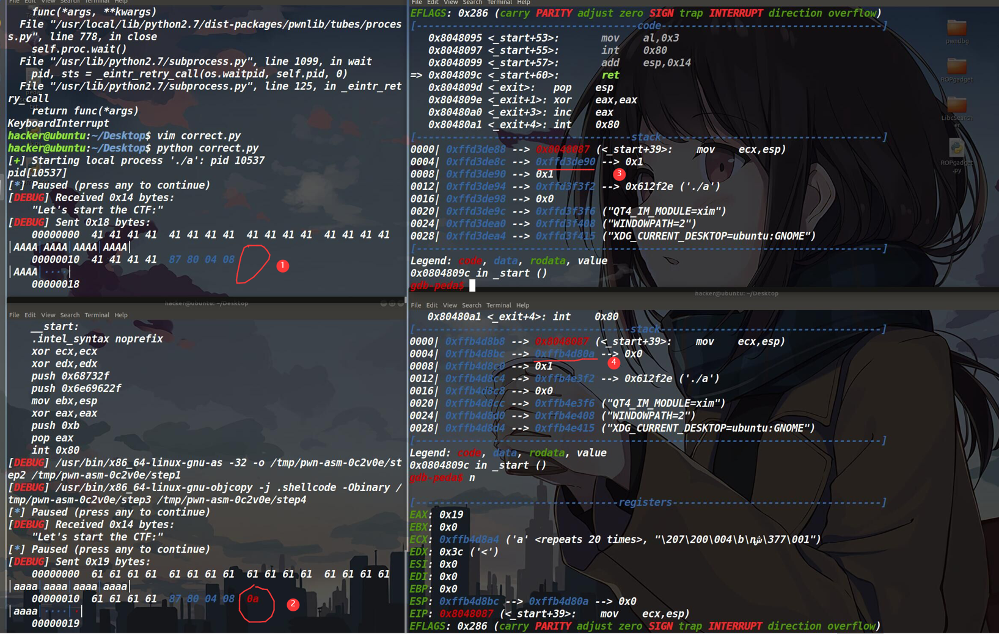
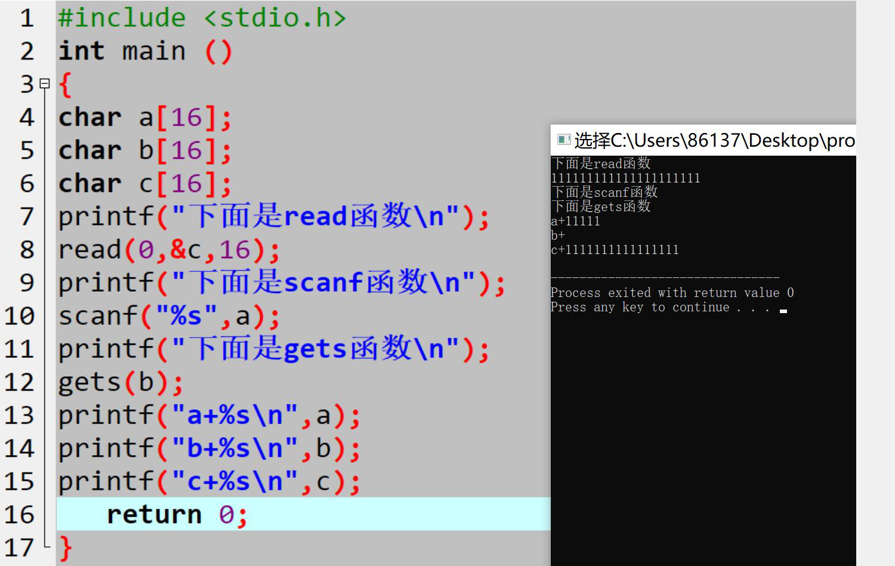
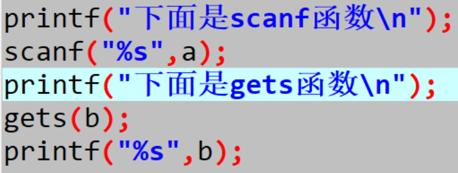
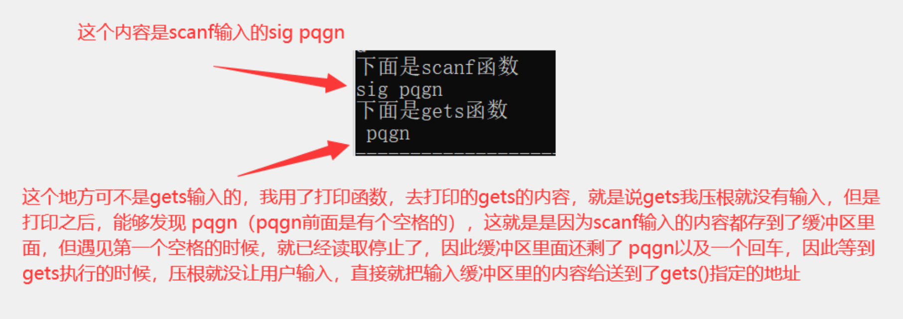

在pwntools中，sendline和send都是发送数据，但是sendline是发送一行数据，换句话说就是sendline会在发送的数据末尾加一个回车。而**这个回车所造成的影响，是跟对应的输入函数有关系**，在做pwn题中，碰见的输入函数有scanf（"%s")，gets()，read()，fgets(),这四个函数。我感觉最常见的应该是read函数。**我们分别讨论一下这前三个函数在读取内容上的具体细节以及sendline所造成的影响**。

# read函数

<u>read(fd, buf,  count) fd是文件描述符，你可以通俗理解为从哪读；buf是一个指针，你可以理解为读到哪，count就是读入字符的数量。</u>

***read的内容都是从缓冲区中读取的***
如果read的fd是0，也就是说read的内容，都要从输入的缓冲区中读取。（0在文件描述符中代表着标准输入）这里要注意，**读取的内容不是直接被输入到了指定的地方，而是不管你输入了多少内容，即使超过了count的限制，****也依旧输入到了输入缓冲区中**
只是read函数没有把输入缓冲区中超过count限制的后面的内容读到指定的buf而已，**也就是说此时输入缓冲区里面依然存在多余的内容。**同样，*也就是说如果你输入的内容是伴随着你按下回车结束，并且此时输入内容的长度还小于read函数的count那么这个回车也会被读取到read指定的第二个参数中*

我们现在来分情况讨论read，它只有三种可能
第一种情况，*read的第三个参数大于了实际输入的内容的字节数*
那么此时，**输入到缓冲区的内容都被读取到了read第二个参数指定的地址**，这里就要注意，我们用sendline发送是数据就相当于在原本的发送的数据结尾再加上一个回车。在pwn题中，大多时候read第二个参数指定的地址都是写到了栈里面***也就是说不仅仅read会把你输入的数据存入栈中，还会把这个回车（ASCII码也就是0a）存入到栈中，***当然你可能大部分时候，都不会对那个存入0a的内存单元进行操作，因此是不影响我们获取shell的但事实上，此时的回车已经影响到栈中数据，***我们平常使用sendline可能没有因为这个原因受到影响，仅仅是我们没有用到那个被0a影响的数据而已***。<u>我们可以看到下面这个图片①处没有0a(回车)②处有0a③是正常的栈空间的内容④可以看到原本正常的内容，可最后的末尾却被覆盖成0a了</u>。最关键的就是在BUUCTF的pwnable_start这道题，这个被干扰的数据，我们还需要使用，因此在这里面对read函数的时候不可以用sendline，只能使用send。

第二是，我们输入的字节数，等于了count的字节（不包括回车）。
这就意味着，我们的数据时可以正常存入到指定的地址的，也就是说即使我们使用sendline栈中也并不会写入0a。但，这就可以高枕无忧了么？别忘了，**我们输入的数据先是放入了缓冲区中，再从缓冲区中写到了指定的地址，虽然sendline的回车没有被写进去，但是回车停留在了缓冲区中。**接下来如果有gets函数需要获取输入的话，***gets函数会因为这个缓冲区里的回车直接结束，不会从用户这里获取输入。***

第三是，我们输入的字节数，超过了count的字节，此时用这个实验来解释，再好不过了

*可以发现输入了20个1，但由于read只能从缓冲区里面接收16个字节，因此执行完read函数之后，它的缓冲区里面还剩4个1和一个回车。但由于scanf的性质是，从缓冲区里面读入内容，遇见空白符停止，并且不读入空白符，因此a的内容是4个1。最后由于缓冲区只剩了一个回车，被gets读到之后，把回车丢弃了，因此直接声明了gets的结束，并且gets什么都没有读到*。**因此当输入的字节数，超过了第三个字节的参数，就如同第二种情况一样，多出来的内容都会停留在缓冲区中（包括回车，这个回车用sendline发送payload，才会有回车）**

# gets函数

*使用 gets() 时，系统会将最后输入的换行符（也就是回车）从缓冲区中取出来，然后给舍弃，因此缓冲区中不会遗留换行符*。gets函数尽管会溢出，但是由于它会把自身发送的回车给从缓冲区中丢弃，**因此遇见gets函数，就不用考虑sendline和send的区别。但是吧，面对这个函数，你不用sendline还不行，因为它需要回车来声明你输入的结束，尽管它会把\n丢弃**。并且值得注意的就是，如果当gets溢出的话（我指的是数组溢出），那么它会在你发送所有数据之后会在最后填上一个00，如果不溢出的话，就不会出现这个00。使用gets输入的字节，正好和创建数组的大小一样的话，也会溢出（可能是因为回车的原因，尽管丢弃了，但还是会在输入的字符串结尾填上一个00），也就是说，如果用gets输入溢出数组的话，它会和read的第一种情况一样，把00写入栈中，也会干扰栈中数据。

# scanf函数

而scanf('%s',c)的时候，**scanf是从第一个非空白字符（空格 换行 制表符）开始读入的，就是你输入的数据，在按下回车的之前，*输入的数据都会被存储在输入缓冲区（包括回车）***，当按下回车键之后，scanf就会开始<u>从输入缓冲区里面读取数据</u>，把读取的数据都传送到你指定的地址，直到遇见了空白符
然后停止。***它仅仅是遇见空白符停止了，但是空白符以及空白符后面的内容依然在输入缓冲区里面。***

如果再遇见gets函数的话，gets函数会从缓冲区里面继续从空白符开始读（空格），然后遇见了回车停止，并把回车丢弃，此时我们根本无法用gets函数输入，因为它在缓冲区里面就遇到了换行符。用下面的图片举例

scanf函数也存在溢出，如果对它用sendline发送数据的话，是不可能被回车（0a）所影响栈中数据的。但是吧，通过实验发现，面对scanf的时候，不用sendline还不行，必须要用sendline，send发送的话，会在执行scanf的时候卡住。因此面对scanf("%s")的时候，我们用sendline发送，时刻要注意它的回车会留着缓冲区里面，可能影响接下来程序的执行情况。

# 总结

**<u>*使用sendline的结果取决于输入的函数*</u>**

如果是read函数的话，①只有当count的字节数大于你所输入的字节数，这个回车才不会产生任何的影响，而多出来的回车也会被当成输入数据正常存入栈中（如果输入的地址是栈的话）；②当count字节数等于你所输入的字节数，那么最后的sendline的回车会停留在栈中（没有在缓冲区中），此时它是不正常存入，因为这个回车的缘故，已经造成了溢出；③当count字节数小于你所输入的字节数，那么没有输入进指定地址的内容，都会停留在输入缓冲区，有可能会影响之的输入。**但值得一提的是使用read函数，我们可以用send来发送数据，这样就可以确保万无一失**。（**如果是gets函数或者scanf函数**，我们没有办法选择，**只能使用sendline**，这两种函数只有遇见sendline发送的回车，才会停止读入。**gets函数会清空缓冲区里的回车，而scanf则不会清空回车。因此scanf可能会因为没有清空回车的缘故，对之后的程序输入可能造成影响，但是如果gets函数溢出了数组限制的话，会异常的在输入的字符串结尾填上一个00存入栈中。此时的00也有可能会覆盖原本栈中的数据**，另外就是遇见fgets的话，也是没的选，只能用sendline